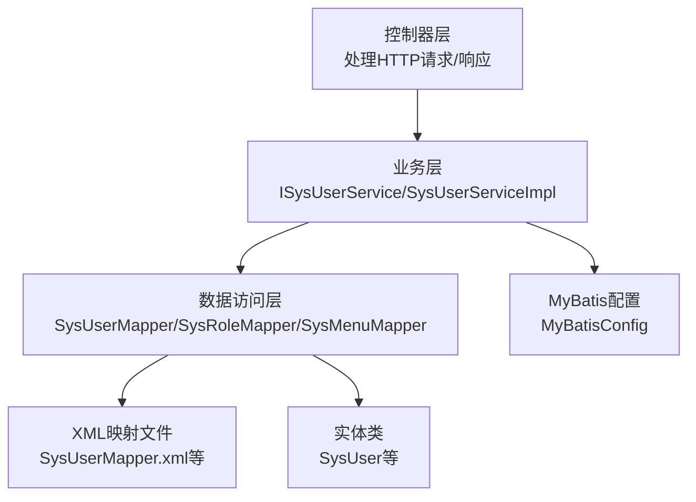
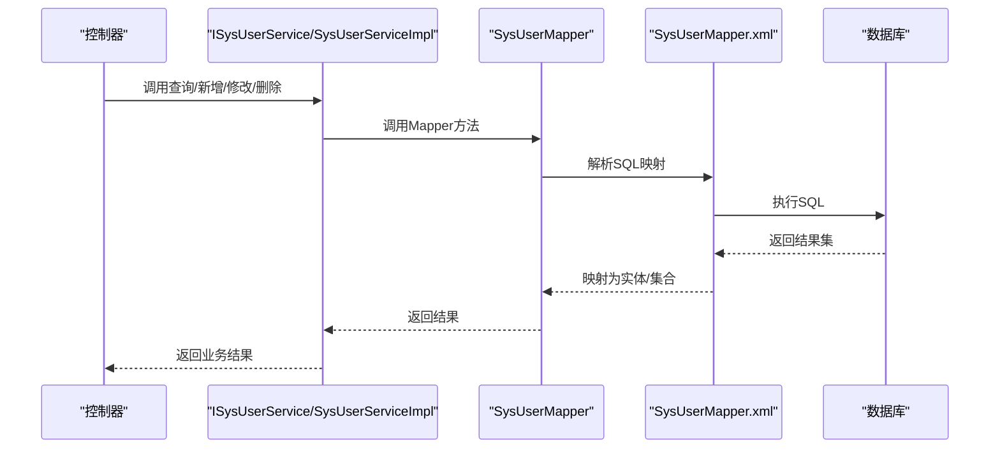
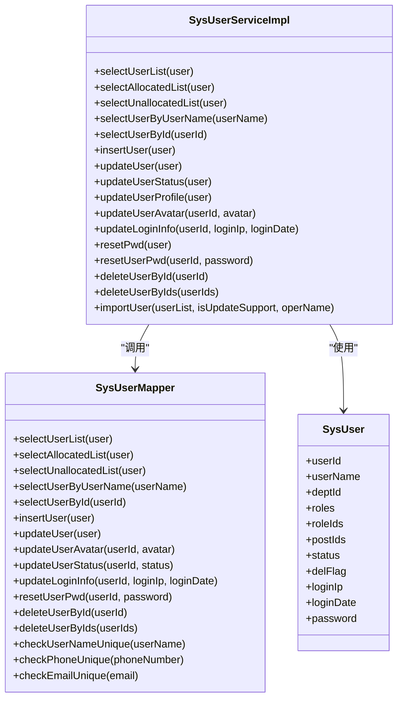
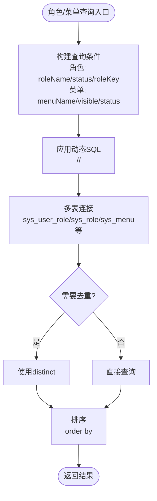
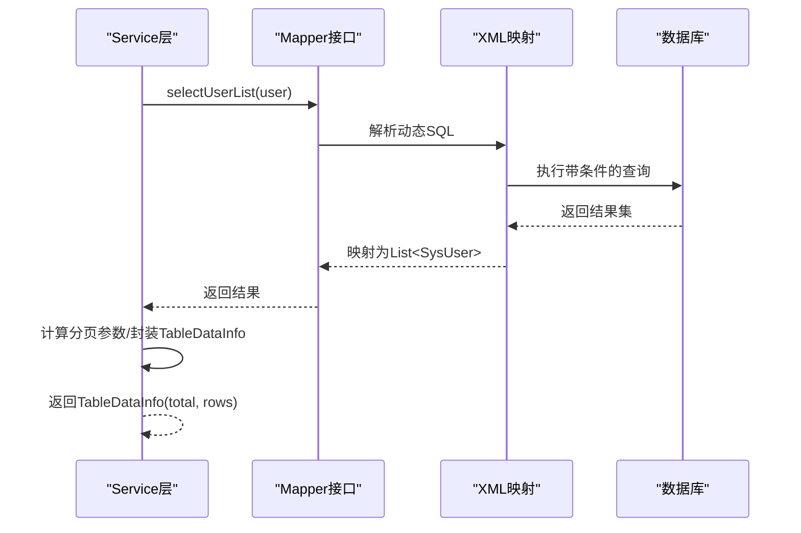
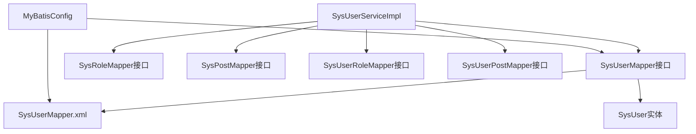

# Mapper接口设计规范

<cite>
**本文档引用的文件**
- [SysUserMapper.java](file://XingChen-Vue/xingchen-system/src/main/java/com/xingchen/system/mapper/SysUserMapper.java)
- [SysUserMapper.xml](file://XingChen-Vue/xingchen-system/src/main/resources/mapper/system/SysUserMapper.xml)
- [SysRoleMapper.java](file://XingChen-Vue/xingchen-system/src/main/java/com/xingchen/system/mapper/SysRoleMapper.java)
- [SysRoleMapper.xml](file://XingChen-Vue/xingchen-system/src/main/resources/mapper/system/SysRoleMapper.xml)
- [SysMenuMapper.java](file://XingChen-Vue/xingchen-system/src/main/java/com/xingchen/system/mapper/SysMenuMapper.java)
- [SysMenuMapper.xml](file://XingChen-Vue/xingchen-system/src/main/resources/mapper/system/SysMenuMapper.xml)
- [ISysUserService.java](file://XingChen-Vue/xingchen-system/src/main/java/com/xingchen/system/service/ISysUserService.java)
- [SysUserServiceImpl.java](file://XingChen-Vue/xingchen-system/src/main/java/com/xingchen/system/service/impl/SysUserServiceImpl.java)
- [SysUser.java](file://XingChen-Vue/xingchen-common/src/main/java/com/xingchen/common/core/domain/entity/SysUser.java)
- [MyBatisConfig.java](file://XingChen-Vue/xingchen-framework/src/main/java/com/xingchen/framework/config/MyBatisConfig.java)
- [PageDomain.java](file://XingChen-Vue/xingchen-common/src/main/java/com/xingchen/common/core/page/PageDomain.java)
- [TableDataInfo.java](file://XingChen-Vue/xingchen-common/src/main/java/com/xingchen/common/core/page/TableDataInfo.java)
- [TableSupport.java](file://XingChen-Vue/xingchen-common/src/main/java/com/xingchen/common/core/page/TableSupport.java)
</cite>

## 目录
1. [简介](#简介)
2. [项目结构](#项目结构)
3. [核心组件](#核心组件)
4. [架构总览](#架构总览)
5. [详细组件分析](#详细组件分析)
6. [依赖关系分析](#依赖关系分析)
7. [性能考虑](#性能考虑)
8. [故障排查指南](#故障排查指南)
9. [结论](#结论)
10. [附录](#附录)

## 简介
本文件系统化梳理健康管理系统中Mapper接口的设计规范，覆盖命名约定、方法设计原则、CRUD标准、参数与返回值设计、异常处理策略、Service与Mapper的职责分离与调用关系，并结合实际代码示例总结复杂查询、批量操作与分页查询的优化技巧，提供可复用的最佳实践与设计建议。

## 项目结构
系统采用典型的分层架构：
- 控制器层：负责接收请求与响应输出
- 业务层（Service）：封装业务逻辑，协调多个Mapper
- 数据访问层（Mapper/DAO）：定义数据库访问接口，配合XML映射SQL
- 实体层（Entity）：承载持久化实体与字段约束
- 配置层（MyBatis）：配置扫描包、Mapper位置与全局配置

图表来源
- [ISysUserService.java:1-218](file://XingChen-Vue/xingchen-system/src/main/java/com/xingchen/system/service/ISysUserService.java#L1-L218)
- [SysUserServiceImpl.java:1-566](file://XingChen-Vue/xingchen-system/src/main/java/com/xingchen/system/service/impl/SysUserServiceImpl.java#L1-L566)
- [SysUserMapper.java:1-148](file://XingChen-Vue/xingchen-system/src/main/java/com/xingchen/system/mapper/SysUserMapper.java#L1-L148)
- [SysUserMapper.xml:1-227](file://XingChen-Vue/xingchen-system/src/main/resources/mapper/system/SysUserMapper.xml#L1-L227)
- [MyBatisConfig.java:1-132](file://XingChen-Vue/xingchen-framework/src/main/java/com/xingchen/framework/config/MyBatisConfig.java#L1-L132)

章节来源
- [SysUserMapper.java:1-148](file://XingChen-Vue/xingchen-system/src/main/java/com/xingchen/system/mapper/SysUserMapper.java#L1-L148)
- [SysUserMapper.xml:1-227](file://XingChen-Vue/xingchen-system/src/main/resources/mapper/system/SysUserMapper.xml#L1-L227)
- [MyBatisConfig.java:1-132](file://XingChen-Vue/xingchen-framework/src/main/java/com/xingchen/framework/config/MyBatisConfig.java#L1-L132)

## 核心组件
- Mapper接口：定义数据访问契约，方法名遵循“动词+名词”语义化命名，参数多为实体对象或主键，返回值多为List或基础类型，部分方法使用@Param注解明确参数绑定。
- XML映射：namespace与Mapper接口全限定名一致；通过resultMap映射实体属性，SQL中广泛使用动态标签（如<if>、<where>、<set>、<include>）实现条件查询与批量操作。
- Service层：实现业务逻辑，调用Mapper执行数据操作，处理事务、校验与异常，封装复杂流程（如用户角色/岗位关联维护）。
- 实体类：SysUser等实体承载字段与校验注解，作为Mapper参数与返回值的基础类型。
- 分页支持：PageDomain、TableDataInfo、TableSupport提供统一的分页参数封装与结果封装。

章节来源
- [SysUserMapper.java:13-147](file://XingChen-Vue/xingchen-system/src/main/java/com/xingchen/system/mapper/SysUserMapper.java#L13-L147)
- [SysUserMapper.xml:5-29](file://XingChen-Vue/xingchen-system/src/main/resources/mapper/system/SysUserMapper.xml#L5-L29)
- [ISysUserService.java:12-217](file://XingChen-Vue/xingchen-system/src/main/java/com/xingchen/system/service/ISysUserService.java#L12-L217)
- [SysUserServiceImpl.java:41-566](file://XingChen-Vue/xingchen-system/src/main/java/com/xingchen/system/service/impl/SysUserServiceImpl.java#L41-L566)
- [SysUser.java:22-337](file://XingChen-Vue/xingchen-common/src/main/java/com/xingchen/common/core/domain/entity/SysUser.java#L22-L337)
- [PageDomain.java:10-68](file://XingChen-Vue/xingchen-common/src/main/java/com/xingchen/common/core/page/PageDomain.java#L10-L68)
- [TableDataInfo.java:11-85](file://XingChen-Vue/xingchen-common/src/main/java/com/xingchen/common/core/page/TableDataInfo.java#L11-L85)
- [TableSupport.java:11-56](file://XingChen-Vue/xingchen-common/src/main/java/com/xingchen/common/core/page/TableSupport.java#L11-L56)

## 架构总览
Mapper层与Service层的职责边界清晰：Mapper只负责数据存取，Service负责业务编排与事务控制。复杂查询通过XML动态SQL实现，批量操作通过<foreach>循环处理，分页通过PageDomain与TableDataInfo统一处理。

图表来源
- [ISysUserService.java:12-217](file://XingChen-Vue/xingchen-system/src/main/java/com/xingchen/system/service/ISysUserService.java#L12-L217)
- [SysUserServiceImpl.java:75-80](file://XingChen-Vue/xingchen-system/src/main/java/com/xingchen/system/service/impl/SysUserServiceImpl.java#L75-L80)
- [SysUserMapper.java:13-147](file://XingChen-Vue/xingchen-system/src/main/java/com/xingchen/system/mapper/SysUserMapper.java#L13-L147)
- [SysUserMapper.xml:60-87](file://XingChen-Vue/xingchen-system/src/main/resources/mapper/system/SysUserMapper.xml#L60-L87)

## 详细组件分析

### 用户Mapper与Service交互
- Mapper接口：提供用户查询、唯一性校验、新增、修改、删除、登录信息更新、头像与状态变更等方法，参数多为实体或主键+参数组合，返回值为List或int。
- XML映射：通过resultMap映射用户及其关联的部门与角色；动态SQL根据条件拼接查询；批量删除使用<foreach>遍历数组。
- Service实现：在事务中维护用户与角色、岗位的关联表；对唯一性校验与数据范围进行前置检查；封装导入导出等复杂流程。

图表来源
- [SysUserMapper.java:13-147](file://XingChen-Vue/xingchen-system/src/main/java/com/xingchen/system/mapper/SysUserMapper.java#L13-L147)
- [SysUserServiceImpl.java:41-566](file://XingChen-Vue/xingchen-system/src/main/java/com/xingchen/system/service/impl/SysUserServiceImpl.java#L41-L566)
- [SysUser.java:22-337](file://XingChen-Vue/xingchen-common/src/main/java/com/xingchen/common/core/domain/entity/SysUser.java#L22-L337)

章节来源
- [SysUserMapper.java:13-147](file://XingChen-Vue/xingchen-system/src/main/java/com/xingchen/system/mapper/SysUserMapper.java#L13-L147)
- [SysUserMapper.xml:60-227](file://XingChen-Vue/xingchen-system/src/main/resources/mapper/system/SysUserMapper.xml#L60-L227)
- [SysUserServiceImpl.java:75-566](file://XingChen-Vue/xingchen-system/src/main/java/com/xingchen/system/service/impl/SysUserServiceImpl.java#L75-L566)
- [SysUser.java:22-337](file://XingChen-Vue/xingchen-common/src/main/java/com/xingchen/common/core/domain/entity/SysUser.java#L22-L337)

### 角色与菜单Mapper
- 角色Mapper：提供角色列表、按用户查询角色、角色唯一性校验、新增/修改/删除等方法，XML中使用distinct去重与动态条件。
- 菜单Mapper：提供菜单列表、权限字符串列表、菜单树、唯一性校验、排序更新、新增/修改/删除等方法，XML中使用多表连接与动态条件。

图表来源
- [SysRoleMapper.java:11-107](file://XingChen-Vue/xingchen-system/src/main/java/com/xingchen/system/mapper/SysRoleMapper.java#L11-L107)
- [SysRoleMapper.xml:33-57](file://XingChen-Vue/xingchen-system/src/main/resources/mapper/system/SysRoleMapper.xml#L33-L57)
- [SysMenuMapper.java:12-141](file://XingChen-Vue/xingchen-system/src/main/java/com/xingchen/system/mapper/SysMenuMapper.java#L12-L141)
- [SysMenuMapper.xml:36-139](file://XingChen-Vue/xingchen-system/src/main/resources/mapper/system/SysMenuMapper.xml#L36-L139)

章节来源
- [SysRoleMapper.java:11-107](file://XingChen-Vue/xingchen-system/src/main/java/com/xingchen/system/mapper/SysRoleMapper.java#L11-L107)
- [SysRoleMapper.xml:33-152](file://XingChen-Vue/xingchen-system/src/main/resources/mapper/system/SysRoleMapper.xml#L33-L152)
- [SysMenuMapper.java:12-141](file://XingChen-Vue/xingchen-system/src/main/java/com/xingchen/system/mapper/SysMenuMapper.java#L12-L141)
- [SysMenuMapper.xml:36-215](file://XingChen-Vue/xingchen-system/src/main/resources/mapper/system/SysMenuMapper.xml#L36-L215)

### 复杂查询与批量操作
- 复杂查询：通过<include>复用SQL片段，使用<if>条件判断与<where>拼接动态WHERE子句，避免多余的AND/OR；使用${params.dataScope}注入数据范围过滤。
- 批量操作：使用<foreach>遍历数组或集合，生成IN子句或批量插入；删除时采用软删除标记（del_flag）或物理删除。
- 分页查询：通过PageDomain封装pageNum、pageSize、orderByColumn、isAsc等参数，XML中计算limit偏移与条数，Service层返回TableDataInfo封装总数与列表。

图表来源
- [SysUserMapper.java:21](file://XingChen-Vue/xingchen-system/src/main/java/com/xingchen/system/mapper/SysUserMapper.java#L21)
- [SysUserMapper.xml:60-87](file://XingChen-Vue/xingchen-system/src/main/resources/mapper/system/SysUserMapper.xml#L60-L87)
- [PageDomain.java:27-34](file://XingChen-Vue/xingchen-common/src/main/java/com/xingchen/common/core/page/PageDomain.java#L27-L34)
- [TableDataInfo.java:40-44](file://XingChen-Vue/xingchen-common/src/main/java/com/xingchen/common/core/page/TableDataInfo.java#L40-L44)

章节来源
- [SysUserMapper.xml:60-87](file://XingChen-Vue/xingchen-system/src/main/resources/mapper/system/SysUserMapper.xml#L60-L87)
- [SysUserMapper.xml:220-225](file://XingChen-Vue/xingchen-system/src/main/resources/mapper/system/SysUserMapper.xml#L220-L225)
- [PageDomain.java:10-68](file://XingChen-Vue/xingchen-common/src/main/java/com/xingchen/common/core/page/PageDomain.java#L10-L68)
- [TableDataInfo.java:11-85](file://XingChen-Vue/xingchen-common/src/main/java/com/xingchen/common/core/page/TableDataInfo.java#L11-L85)
- [TableSupport.java:41-56](file://XingChen-Vue/xingchen-common/src/main/java/com/xingchen/common/core/page/TableSupport.java#L41-L56)

## 依赖关系分析
- Mapper接口与XML映射文件强绑定：namespace必须与接口全限定名一致，方法名与XML中id一致。
- Service层依赖多个Mapper：如SysUserServiceImpl依赖SysUserMapper、SysRoleMapper、SysUserPostMapper、SysUserRoleMapper等。
- 实体类与Mapper参数/返回值耦合：实体类字段与resultMap列名一一对应，便于自动映射。
- MyBatis配置：MyBatisConfig负责扫描实体包与Mapper XML位置，确保命名空间解析与资源加载。

图表来源
- [SysUserMapper.java:13](file://XingChen-Vue/xingchen-system/src/main/java/com/xingchen/system/mapper/SysUserMapper.java#L13)
- [SysUserMapper.xml:5](file://XingChen-Vue/xingchen-system/src/main/resources/mapper/system/SysUserMapper.xml#L5)
- [SysUserServiceImpl.java:45-67](file://XingChen-Vue/xingchen-system/src/main/java/com/xingchen/system/service/impl/SysUserServiceImpl.java#L45-L67)
- [MyBatisConfig.java:116-131](file://XingChen-Vue/xingchen-framework/src/main/java/com/xingchen/framework/config/MyBatisConfig.java#L116-L131)

章节来源
- [SysUserMapper.java:13](file://XingChen-Vue/xingchen-system/src/main/java/com/xingchen/system/mapper/SysUserMapper.java#L13)
- [SysUserMapper.xml:5](file://XingChen-Vue/xingchen-system/src/main/resources/mapper/system/SysUserMapper.xml#L5)
- [SysUserServiceImpl.java:45-67](file://XingChen-Vue/xingchen-system/src/main/java/com/xingchen/system/service/impl/SysUserServiceImpl.java#L45-L67)
- [MyBatisConfig.java:116-131](file://XingChen-Vue/xingchen-framework/src/main/java/com/xingchen/framework/config/MyBatisConfig.java#L116-L131)

## 性能考虑
- 动态SQL优化：优先使用<where>与<if>减少冗余条件，避免硬编码OR/AND；对LIKE查询使用concat('%', param, '%')并注意索引。
- 关联查询优化：使用LEFT JOIN连接相关表，必要时使用DISTINCT去重；对大表查询添加适当索引（如用户状态、创建时间、角色ID等）。
- 批量操作：使用<foreach>批量插入/更新，减少网络往返；批量删除采用IN子句或批量更新。
- 分页优化：合理设置pageSize，避免超大offset；对高频查询建立复合索引；必要时使用覆盖索引。
- 缓存与扫描：MyBatisConfig支持扫描包与Mapper XML位置，确保资源加载高效。

章节来源
- [SysUserMapper.xml:60-87](file://XingChen-Vue/xingchen-system/src/main/resources/mapper/system/SysUserMapper.xml#L60-L87)
- [SysRoleMapper.xml:33-57](file://XingChen-Vue/xingchen-system/src/main/resources/mapper/system/SysRoleMapper.xml#L33-L57)
- [SysMenuMapper.xml:36-139](file://XingChen-Vue/xingchen-system/src/main/resources/mapper/system/SysMenuMapper.xml#L36-L139)
- [MyBatisConfig.java:94-131](file://XingChen-Vue/xingchen-framework/src/main/java/com/xingchen/framework/config/MyBatisConfig.java#L94-L131)

## 故障排查指南
- 参数绑定问题：当方法参数为多个基本类型或非实体时，使用@Param明确参数名，避免MyBatis无法识别。
- SQL语法错误：检查XML中动态标签是否闭合，条件表达式是否正确；确认列名与resultMap一致。
- 数据范围过滤：确保${params.dataScope}注入的SQL片段合法且安全，避免注入风险。
- 事务一致性：批量操作需在@Transactional中执行，确保关联表同步更新/删除。
- 唯一性校验：在Service层对唯一性校验进行业务判断（忽略自身ID），避免误判。
- 异常处理：Service层捕获异常并抛出业务异常，向控制器层返回友好提示。

章节来源
- [SysUserMapper.java:78-106](file://XingChen-Vue/xingchen-system/src/main/java/com/xingchen/system/mapper/SysUserMapper.java#L78-L106)
- [SysUserServiceImpl.java:172-218](file://XingChen-Vue/xingchen-system/src/main/java/com/xingchen/system/service/impl/SysUserServiceImpl.java#L172-L218)
- [SysUserServiceImpl.java:458-489](file://XingChen-Vue/xingchen-system/src/main/java/com/xingchen/system/service/impl/SysUserServiceImpl.java#L458-L489)

## 结论
该系统的Mapper接口设计遵循清晰的分层与职责分离原则：Mapper专注数据存取，Service负责业务编排与事务控制；XML映射通过动态SQL实现灵活查询与批量操作；分页通过统一模型封装；整体具备良好的扩展性与可维护性。建议在后续开发中持续遵循本文规范，保持命名一致性、参数与返回值设计的一致性，并关注SQL性能与安全性。

## 附录

### Mapper接口命名规范与方法设计原则
- 命名规范
  - 查询：selectXxx、selectXxxList、selectXxxByXxx
  - 唯一性校验：checkXxxUnique
  - 新增/修改/删除：insertXxx、updateXxx、deleteXxxById(s)
  - 特定字段更新：updateXxxXxx
- 方法设计原则
  - 参数：优先使用实体对象承载查询条件；多参数时使用@Param明确参数名
  - 返回值：查询返回List<T>或T；新增/修改/删除返回int；唯一性校验返回T或布尔
  - 异常：业务异常通过Service层抛出，Mapper层保持纯数据访问

章节来源
- [SysUserMapper.java:13-147](file://XingChen-Vue/xingchen-system/src/main/java/com/xingchen/system/mapper/SysUserMapper.java#L13-L147)
- [SysRoleMapper.java:11-107](file://XingChen-Vue/xingchen-system/src/main/java/com/xingchen/system/mapper/SysRoleMapper.java#L11-L107)
- [SysMenuMapper.java:12-141](file://XingChen-Vue/xingchen-system/src/main/java/com/xingchen/system/mapper/SysMenuMapper.java#L12-L141)

### CRUD操作标准命名约定
- 新增：insertXxx
- 查询：selectXxx、selectXxxList、selectXxxById、selectXxxByXxx
- 更新：updateXxx、updateXxxXxx
- 删除：deleteXxxById、deleteXxxByIds
- 唯一性校验：checkXxxUnique

章节来源
- [SysUserMapper.java:21-146](file://XingChen-Vue/xingchen-system/src/main/java/com/xingchen/system/mapper/SysUserMapper.java#L21-L146)
- [SysRoleMapper.java:19-106](file://XingChen-Vue/xingchen-system/src/main/java/com/xingchen/system/mapper/SysRoleMapper.java#L19-L106)
- [SysMenuMapper.java:20-140](file://XingChen-Vue/xingchen-system/src/main/java/com/xingchen/system/mapper/SysMenuMapper.java#L20-L140)

### 参数设计、返回值类型与异常处理
- 参数设计
  - 实体对象：承载查询条件与业务数据
  - 主键：Long userId
  - 多参数：使用@Param("name")标注参数名
- 返回值类型
  - 查询：List<T>、T
  - 新增/修改/删除：int
  - 唯一性校验：T或布尔
- 异常处理
  - Service层统一捕获异常并抛出业务异常
  - Mapper层保持数据访问纯净，不处理业务异常

章节来源
- [SysUserMapper.java:45-106](file://XingChen-Vue/xingchen-system/src/main/java/com/xingchen/system/mapper/SysUserMapper.java#L45-L106)
- [SysUserServiceImpl.java:172-218](file://XingChen-Vue/xingchen-system/src/main/java/com/xingchen/system/service/impl/SysUserServiceImpl.java#L172-L218)

### Service层与Mapper层职责分离与调用关系
- 职责分离
  - Mapper：仅负责SQL执行与结果映射
  - Service：负责事务、校验、业务编排与异常处理
- 调用关系
  - Service实现类实现接口方法，内部调用Mapper完成数据操作
  - 复杂流程（如用户角色/岗位关联）在Service中维护

章节来源
- [ISysUserService.java:12-217](file://XingChen-Vue/xingchen-system/src/main/java/com/xingchen/system/service/ISysUserService.java#L12-L217)
- [SysUserServiceImpl.java:75-566](file://XingChen-Vue/xingchen-system/src/main/java/com/xingchen/system/service/impl/SysUserServiceImpl.java#L75-L566)

### 复杂查询、批量操作与分页查询优化
- 复杂查询
  - 使用<include>复用SQL片段，<if>/<where>/<set>动态拼接条件
  - 使用${params.dataScope}注入数据范围过滤
- 批量操作
  - 使用<foreach>遍历数组/集合，生成IN子句或批量插入
- 分页查询
  - PageDomain封装分页参数，XML中计算limit偏移与条数
  - Service层返回TableDataInfo封装总数与列表

章节来源
- [SysUserMapper.xml:60-87](file://XingChen-Vue/xingchen-system/src/main/resources/mapper/system/SysUserMapper.xml#L60-L87)
- [SysUserMapper.xml:220-225](file://XingChen-Vue/xingchen-system/src/main/resources/mapper/system/SysUserMapper.xml#L220-L225)
- [PageDomain.java:27-34](file://XingChen-Vue/xingchen-common/src/main/java/com/xingchen/common/core/page/PageDomain.java#L27-L34)
- [TableDataInfo.java:40-44](file://XingChen-Vue/xingchen-common/src/main/java/com/xingchen/common/core/page/TableDataInfo.java#L40-L44)

### 接口设计最佳实践与代码复用策略
- 命名一致性：严格遵循“动词+名词”语义化命名
- 参数与返回值一致性：同一业务域内参数与返回值类型保持一致
- XML复用：通过<include>复用公共SQL片段，减少重复
- 事务管理：批量操作与关联更新统一在Service层@Transactional中执行
- 安全性：避免硬编码SQL，使用参数化与动态标签；数据范围过滤通过${params.dataScope}注入

章节来源
- [SysUserMapper.xml:50-58](file://XingChen-Vue/xingchen-system/src/main/resources/mapper/system/SysUserMapper.xml#L50-L58)
- [SysUserServiceImpl.java:261-304](file://XingChen-Vue/xingchen-system/src/main/java/com/xingchen/system/service/impl/SysUserServiceImpl.java#L261-L304)
- [MyBatisConfig.java:94-131](file://XingChen-Vue/xingchen-framework/src/main/java/com/xingchen/framework/config/MyBatisConfig.java#L94-L131)