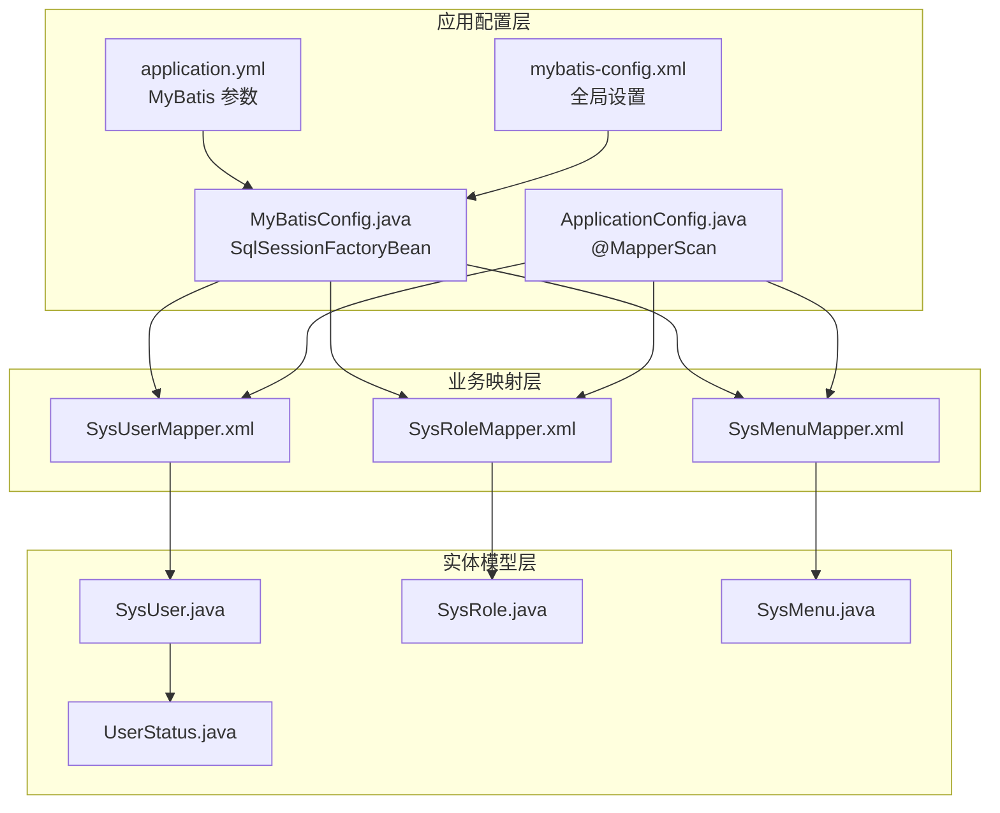
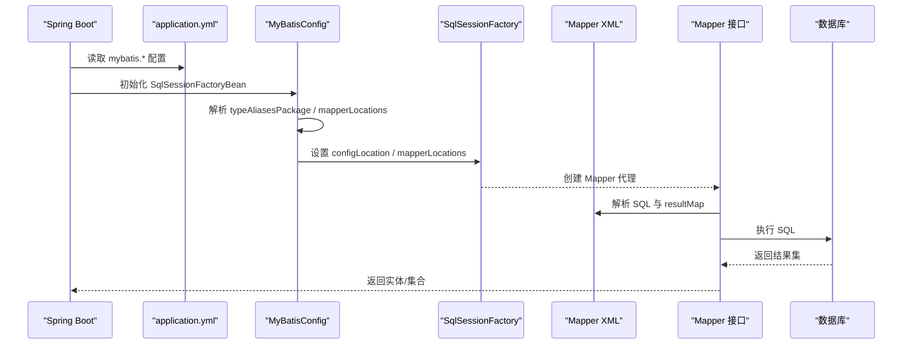
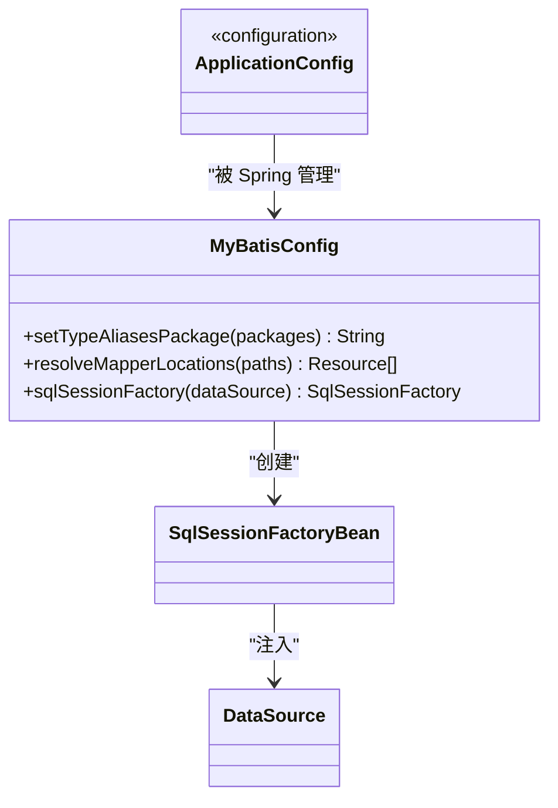
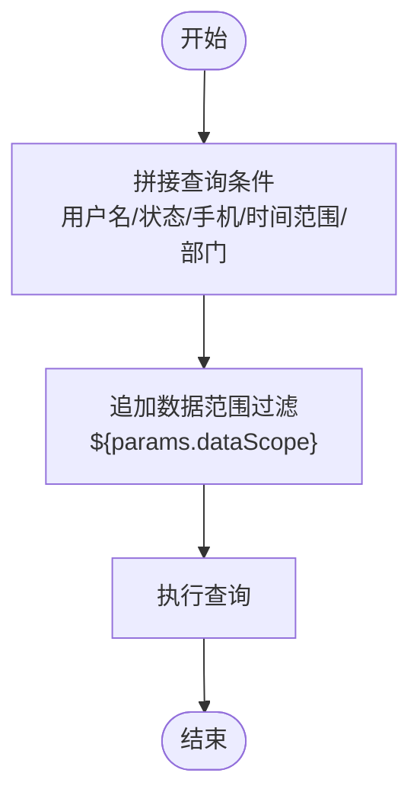
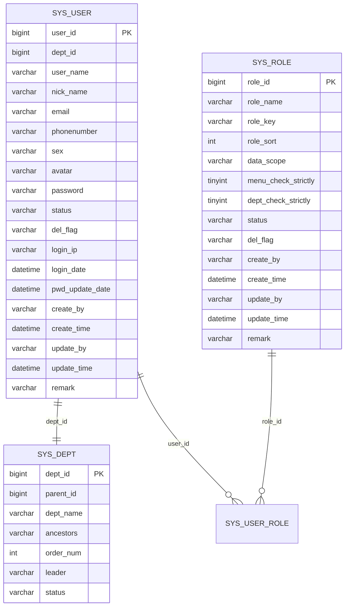
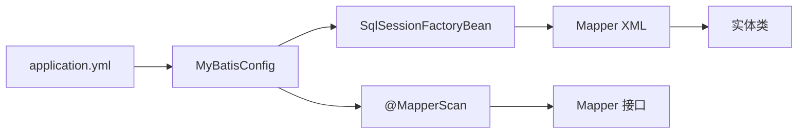

# MyBatis配置与映射

<cite>
**本文引用的文件**
- [mybatis-config.xml](file://XingChen-Vue/xingchen-admin/src/main/resources/mybatis/mybatis-config.xml)
- [application.yml](file://XingChen-Vue/xingchen-admin/src/main/resources/application.yml)
- [MyBatisConfig.java](file://XingChen-Vue/xingchen-framework/src/main/java/com/xingchen/framework/config/MyBatisConfig.java)
- [ApplicationConfig.java](file://XingChen-Vue/xingchen-framework/src/main/java/com/xingchen/framework/config/ApplicationConfig.java)
- [SysUserMapper.xml](file://XingChen-Vue/xingchen-system/src/main/resources/mapper/system/SysUserMapper.xml)
- [SysRoleMapper.xml](file://XingChen-Vue/xingchen-system/src/main/resources/mapper/system/SysRoleMapper.xml)
- [SysMenuMapper.xml](file://XingChen-Vue/xingchen-system/src/main/resources/mapper/system/SysMenuMapper.xml)
- [SysUser.java](file://XingChen-Vue/xingchen-common/src/main/java/com/xingchen/common/core/domain/entity/SysUser.java)
- [SysRole.java](file://XingChen-Vue/xingchen-common/src/main/java/com/xingchen/common/core/domain/entity/SysRole.java)
- [SysMenu.java](file://XingChen-Vue/xingchen-common/src/main/java/com/xingchen/common/core/domain/entity/SysMenu.java)
- [UserStatus.java](file://XingChen-Vue/xingchen-common/src/main/java/com/xingchen/common/enums/UserStatus.java)
- [SqlUtil.java](file://XingChen-Vue/xingchen-common/src/main/java/com/xingchen/common/utils/sql/SqlUtil.java)
</cite>

## 目录
1. [简介](#简介)
2. [项目结构](#项目结构)
3. [核心组件](#核心组件)
4. [架构总览](#架构总览)
5. [详细组件分析](#详细组件分析)
6. [依赖分析](#依赖分析)
7. [性能考虑](#性能考虑)
8. [故障排查指南](#故障排查指南)
9. [结论](#结论)
10. [附录](#附录)

## 简介
本文件面向健康管理系统中基于 MyBatis 的配置与映射，系统性梳理了核心配置文件结构、类型别名与插件配置、驼峰命名转换策略；详细说明了 Mapper XML 的编写规范（SQL 优化、动态 SQL 标签、结果映射）、实体类与数据库表的映射关系、字段类型转换与枚举处理；并提供 SQL 注入防护、性能优化技巧与调试方法，以及常见 SQL 写法示例与最佳实践。

## 项目结构
本项目采用多模块结构，MyBatis 相关配置集中在 admin 模块的 resources 下，核心配置通过 Spring Boot 自动装配加载；系统业务模块（system）提供各领域实体对应的 Mapper XML；公共模块（common）提供实体类与工具类。

**图表来源**
- [application.yml:104-112](file://XingChen-Vue/xingchen-admin/src/main/resources/application.yml#L104-L112)
- [mybatis-config.xml:5-18](file://XingChen-Vue/xingchen-admin/src/main/resources/mybatis/mybatis-config.xml#L5-L18)
- [MyBatisConfig.java:116-131](file://XingChen-Vue/xingchen-framework/src/main/java/com/xingchen/framework/config/MyBatisConfig.java#L116-L131)
- [ApplicationConfig.java:15-16](file://XingChen-Vue/xingchen-framework/src/main/java/com/xingchen/framework/config/ApplicationConfig.java#L15-L16)
- [SysUserMapper.xml:5](file://XingChen-Vue/xingchen-system/src/main/resources/mapper/system/SysUserMapper.xml#L5)
- [SysRoleMapper.xml:5](file://XingChen-Vue/xingchen-system/src/main/resources/mapper/system/SysRoleMapper.xml#L5)
- [SysMenuMapper.xml:5](file://XingChen-Vue/xingchen-system/src/main/resources/mapper/system/SysMenuMapper.xml#L5)
- [SysUser.java:22](file://XingChen-Vue/xingchen-common/src/main/java/com/xingchen/common/core/domain/entity/SysUser.java#L22)
- [SysRole.java:18](file://XingChen-Vue/xingchen-common/src/main/java/com/xingchen/common/core/domain/entity/SysRole.java#L18)
- [SysMenu.java:17](file://XingChen-Vue/xingchen-common/src/main/java/com/xingchen/common/core/domain/entity/SysMenu.java#L17)
- [UserStatus.java:8](file://XingChen-Vue/xingchen-common/src/main/java/com/xingchen/common/enums/UserStatus.java#L8)

**章节来源**
- [application.yml:104-112](file://XingChen-Vue/xingchen-admin/src/main/resources/application.yml#L104-L112)
- [mybatis-config.xml:5-18](file://XingChen-Vue/xingchen-admin/src/main/resources/mybatis/mybatis-config.xml#L5-L18)
- [MyBatisConfig.java:116-131](file://XingChen-Vue/xingchen-framework/src/main/java/com/xingchen/framework/config/MyBatisConfig.java#L116-L131)
- [ApplicationConfig.java:15-16](file://XingChen-Vue/xingchen-framework/src/main/java/com/xingchen/framework/config/ApplicationConfig.java#L15-L16)

## 核心组件
- MyBatis 核心配置
  - 全局设置：缓存、主键生成、默认执行器、日志实现等。
  - 驼峰命名转换：当前未启用，建议在生产按需开启。
- MyBatis Spring Boot 集成
  - 通过 MyBatisConfig 动态解析 typeAliasesPackage 与 mapperLocations。
  - 通过 ApplicationConfig 的 @MapperScan 扫描 Mapper 接口。
- Mapper XML
  - 以 namespace 对应 Mapper 接口，resultMap 描述实体映射。
  - 大量使用动态 SQL（<if>/<where>/<set>/<trim>/<include>）与 SQL 片段复用。
- 实体类与枚举
  - 实体类字段与数据库列名一一对应，配合 resultMap 完成映射。
  - 枚举用于状态字段（如用户状态），在业务层转换为数据库存储值。

**章节来源**
- [mybatis-config.xml:7-18](file://XingChen-Vue/xingchen-admin/src/main/resources/mybatis/mybatis-config.xml#L7-L18)
- [MyBatisConfig.java:40-92](file://XingChen-Vue/xingchen-framework/src/main/java/com/xingchen/framework/config/MyBatisConfig.java#L40-L92)
- [ApplicationConfig.java:15-16](file://XingChen-Vue/xingchen-framework/src/main/java/com/xingchen/framework/config/ApplicationConfig.java#L15-L16)
- [SysUserMapper.xml:7-29](file://XingChen-Vue/xingchen-system/src/main/resources/mapper/system/SysUserMapper.xml#L7-L29)
- [SysRoleMapper.xml:7-22](file://XingChen-Vue/xingchen-system/src/main/resources/mapper/system/SysRoleMapper.xml#L7-L22)
- [SysMenuMapper.xml:7-29](file://XingChen-Vue/xingchen-system/src/main/resources/mapper/system/SysMenuMapper.xml#L7-L29)
- [SysUser.java:26-86](file://XingChen-Vue/xingchen-common/src/main/java/com/xingchen/common/core/domain/entity/SysUser.java#L26-L86)
- [UserStatus.java:8-31](file://XingChen-Vue/xingchen-common/src/main/java/com/xingchen/common/enums/UserStatus.java#L8-L31)

## 架构总览
MyBatis 在本项目中的工作流如下：Spring Boot 读取 application.yml 中的 MyBatis 配置，MyBatisConfig 创建 SqlSessionFactory 并加载 mybatis-config.xml；Mapper XML 与实体类通过 resultMap 完成 ORM 映射；业务层调用 Mapper 执行 SQL。

**图表来源**
- [application.yml:104-112](file://XingChen-Vue/xingchen-admin/src/main/resources/application.yml#L104-L112)
- [MyBatisConfig.java:116-131](file://XingChen-Vue/xingchen-framework/src/main/java/com/xingchen/framework/config/MyBatisConfig.java#L116-L131)
- [SysUserMapper.xml:5](file://XingChen-Vue/xingchen-system/src/main/resources/mapper/system/SysUserMapper.xml#L5)

## 详细组件分析

### MyBatis 核心配置文件
- 全局设置
  - 缓存启用：提升查询性能，适合读多写少场景。
  - JDBC 主键生成：自动获取数据库自增主键。
  - 默认执行器：简单执行器，适合大多数场景。
  - 日志实现：SLF4J，便于统一日志输出。
  - 驼峰命名转换：当前注释掉，建议结合命名策略按需启用。
- 类型别名与插件
  - 类型别名通过 MyBatisConfig 动态扫描包别名。
  - 插件配置在本项目中未显式声明，可扩展分页插件（已在 application.yml 中配置 PageHelper）。

**章节来源**
- [mybatis-config.xml:7-18](file://XingChen-Vue/xingchen-admin/src/main/resources/mybatis/mybatis-config.xml#L7-L18)
- [application.yml:113-118](file://XingChen-Vue/xingchen-admin/src/main/resources/application.yml#L113-L118)
- [MyBatisConfig.java:40-92](file://XingChen-Vue/xingchen-framework/src/main/java/com/xingchen/framework/config/MyBatisConfig.java#L40-L92)

### MyBatis Spring Boot 集成
- SqlSessionFactoryBean 配置
  - 从环境变量读取 typeAliasesPackage、mapperLocations、configLocation。
  - 动态解析包路径，确保类型别名与 Mapper XML 正确加载。
- Mapper 接口扫描
  - @MapperScan("com.xingchen.**.mapper") 扫描所有 Mapper 接口。

**图表来源**
- [MyBatisConfig.java:116-131](file://XingChen-Vue/xingchen-framework/src/main/java/com/xingchen/framework/config/MyBatisConfig.java#L116-L131)
- [ApplicationConfig.java:15-16](file://XingChen-Vue/xingchen-framework/src/main/java/com/xingchen/framework/config/ApplicationConfig.java#L15-L16)

**章节来源**
- [MyBatisConfig.java:116-131](file://XingChen-Vue/xingchen-framework/src/main/java/com/xingchen/framework/config/MyBatisConfig.java#L116-L131)
- [ApplicationConfig.java:15-16](file://XingChen-Vue/xingchen-framework/src/main/java/com/xingchen/framework/config/ApplicationConfig.java#L15-L16)

### Mapper XML 编写规范与示例

#### SysUserMapper.xml
- 结果映射
  - 通过 resultMap 将 sys_user 与 SysUser 实体字段映射，包含一对一（dept）与一对多（roles）关联。
- 动态 SQL
  - 使用 <where>/<if> 实现条件查询；使用 <include> 引用公共 SQL 片段；使用 <set>/<trim> 动态更新。
- 关键点
  - 分页与数据范围过滤：通过 ${params.dataScope} 注入动态过滤条件（需谨慎防注入）。
  - 主键生成：insert 使用 useGeneratedKeys 与 keyProperty。

**图表来源**
- [SysUserMapper.xml:60-87](file://XingChen-Vue/xingchen-system/src/main/resources/mapper/system/SysUserMapper.xml#L60-L87)

**章节来源**
- [SysUserMapper.xml:7-29](file://XingChen-Vue/xingchen-system/src/main/resources/mapper/system/SysUserMapper.xml#L7-L29)
- [SysUserMapper.xml:60-87](file://XingChen-Vue/xingchen-system/src/main/resources/mapper/system/SysUserMapper.xml#L60-L87)
- [SysUserMapper.xml:146-178](file://XingChen-Vue/xingchen-system/src/main/resources/mapper/system/SysUserMapper.xml#L146-L178)
- [SysUserMapper.xml:180-198](file://XingChen-Vue/xingchen-system/src/main/resources/mapper/system/SysUserMapper.xml#L180-L198)

#### SysRoleMapper.xml
- 结果映射
  - SysRoleResult 映射角色表字段，含数据范围与严格模式控制字段。
- 动态 SQL
  - 使用 <where>/<if> 实现角色名称/键/状态/时间范围过滤。
  - 使用 <set> 动态更新角色信息。

**章节来源**
- [SysRoleMapper.xml:7-22](file://XingChen-Vue/xingchen-system/src/main/resources/mapper/system/SysRoleMapper.xml#L7-L22)
- [SysRoleMapper.xml:33-57](file://XingChen-Vue/xingchen-system/src/main/resources/mapper/system/SysRoleMapper.xml#L33-L57)
- [SysRoleMapper.xml:96-122](file://XingChen-Vue/xingchen-system/src/main/resources/mapper/system/SysRoleMapper.xml#L96-L122)
- [SysRoleMapper.xml:124-139](file://XingChen-Vue/xingchen-system/src/main/resources/mapper/system/SysRoleMapper.xml#L124-L139)

#### SysMenuMapper.xml
- 结果映射
  - SysMenuResult 映射菜单表字段，含路由、组件、权限标识等。
- 动态 SQL
  - 使用 <where>/<if> 实现菜单名称/可见性/状态过滤。
  - 使用 <set> 动态更新菜单信息。

**章节来源**
- [SysMenuMapper.xml:7-29](file://XingChen-Vue/xingchen-system/src/main/resources/mapper/system/SysMenuMapper.xml#L7-L29)
- [SysMenuMapper.xml:36-50](file://XingChen-Vue/xingchen-system/src/main/resources/mapper/system/SysMenuMapper.xml#L36-L50)
- [SysMenuMapper.xml:141-163](file://XingChen-Vue/xingchen-system/src/main/resources/mapper/system/SysMenuMapper.xml#L141-L163)

### 实体类与数据库映射关系
- SysUser
  - 字段覆盖 sys_user 表主要列，包含部门与角色关联。
  - 状态字段映射到 UserStatus 枚举。
- SysRole
  - 字段覆盖 sys_role 表，含数据范围与严格模式控制。
- SysMenu
  - 字段覆盖 sys_menu 表，含路由、组件、权限标识与层级关系。

**图表来源**
- [SysUser.java:26-86](file://XingChen-Vue/xingchen-common/src/main/java/com/xingchen/common/core/domain/entity/SysUser.java#L26-L86)
- [SysRole.java:22-53](file://XingChen-Vue/xingchen-common/src/main/java/com/xingchen/common/core/domain/entity/SysRole.java#L22-L53)
- [SysMenu.java:21-67](file://XingChen-Vue/xingchen-common/src/main/java/com/xingchen/common/core/domain/entity/SysMenu.java#L21-L67)
- [SysUserMapper.xml:7-29](file://XingChen-Vue/xingchen-system/src/main/resources/mapper/system/SysUserMapper.xml#L7-L29)

**章节来源**
- [SysUser.java:26-86](file://XingChen-Vue/xingchen-common/src/main/java/com/xingchen/common/core/domain/entity/SysUser.java#L26-L86)
- [SysRole.java:22-53](file://XingChen-Vue/xingchen-common/src/main/java/com/xingchen/common/core/domain/entity/SysRole.java#L22-L53)
- [SysMenu.java:21-67](file://XingChen-Vue/xingchen-common/src/main/java/com/xingchen/common/core/domain/entity/SysMenu.java#L21-L67)

### 字段类型转换与枚举处理
- 枚举映射
  - UserStatus 提供 code/info，业务层将枚举转换为数据库存储值（如“0/1/2”）。
- 字段类型
  - 时间字段使用 Date 类型，与数据库 datetime 对应。
  - 性别、状态等使用字符串存储，便于国际化与展示。

**章节来源**
- [UserStatus.java:8-31](file://XingChen-Vue/xingchen-common/src/main/java/com/xingchen/common/enums/UserStatus.java#L8-L31)
- [SysUser.java:50-76](file://XingChen-Vue/xingchen-common/src/main/java/com/xingchen/common/core/domain/entity/SysUser.java#L50-L76)

### SQL 注入防护、性能优化与调试
- 注入防护
  - 使用 SqlUtil 对 orderBy 与输入参数进行校验与关键字过滤，防止注入绕过。
  - 动态 SQL 中优先使用 #{} 占位符，避免直接拼接；${} 仅在必要且可控时使用（如数据范围过滤）。
- 性能优化
  - 启用缓存与合理使用主键生成，减少网络往返。
  - 使用 <include> 复用 SQL 片段，避免重复；使用 <trim>/<where>/<set> 减少冗余逻辑。
  - 分页插件 PageHelper 已配置，建议在查询列表时统一使用。
- 调试方法
  - 设置日志实现为 SLF4J，结合 application.yml 的 logging.level 输出 SQL 与参数。
  - 在开发环境开启 SQL 输出，定位慢查询与异常。

**章节来源**
- [SqlUtil.java:31-70](file://XingChen-Vue/xingchen-common/src/main/java/com/xingchen/common/utils/sql/SqlUtil.java#L31-L70)
- [application.yml:34-38](file://XingChen-Vue/xingchen-admin/src/main/resources/application.yml#L34-L38)
- [mybatis-config.xml:14](file://XingChen-Vue/xingchen-admin/src/main/resources/mybatis/mybatis-config.xml#L14)
- [application.yml:113-118](file://XingChen-Vue/xingchen-admin/src/main/resources/application.yml#L113-L118)

## 依赖分析
- 配置依赖
  - application.yml -> MyBatisConfig -> SqlSessionFactoryBean -> Mapper XML。
- 映射依赖
  - Mapper XML -> 实体类（resultMap/association/collection）。
- 运行时依赖
  - @MapperScan -> Mapper 接口 -> SqlSessionFactory -> DataSource -> 数据库。

**图表来源**
- [application.yml:104-112](file://XingChen-Vue/xingchen-admin/src/main/resources/application.yml#L104-L112)
- [MyBatisConfig.java:116-131](file://XingChen-Vue/xingchen-framework/src/main/java/com/xingchen/framework/config/MyBatisConfig.java#L116-L131)
- [ApplicationConfig.java:15-16](file://XingChen-Vue/xingchen-framework/src/main/java/com/xingchen/framework/config/ApplicationConfig.java#L15-L16)

**章节来源**
- [application.yml:104-112](file://XingChen-Vue/xingchen-admin/src/main/resources/application.yml#L104-L112)
- [MyBatisConfig.java:116-131](file://XingChen-Vue/xingchen-framework/src/main/java/com/xingchen/framework/config/MyBatisConfig.java#L116-L131)
- [ApplicationConfig.java:15-16](file://XingChen-Vue/xingchen-framework/src/main/java/com/xingchen/framework/config/ApplicationConfig.java#L15-L16)

## 性能考虑
- 启用缓存与主键生成，减少网络往返与序列号管理开销。
- 使用 PageHelper 进行分页，避免一次性加载大量数据。
- 合理使用动态 SQL，避免全表扫描；对高频查询建立合适索引。
- 控制 SQL 片段复杂度，避免过度嵌套导致可读性与维护性下降。

## 故障排查指南
- 驼峰命名问题
  - 若字段与属性不一致，检查 mybatis-config.xml 中 mapUnderscoreToCamelCase 设置。
- 类型别名扫描失败
  - 检查 MyBatisConfig 的 setTypeAliasesPackage 返回值与实际包路径。
- 动态 SQL 注入风险
  - 使用 SqlUtil.escapeOrderBySql 与 filterKeyword 对输入进行校验。
- 日志与调试
  - 调整 logging.level，确认 SQL 与参数输出。

**章节来源**
- [mybatis-config.xml:16-17](file://XingChen-Vue/xingchen-admin/src/main/resources/mybatis/mybatis-config.xml#L16-L17)
- [MyBatisConfig.java:40-92](file://XingChen-Vue/xingchen-framework/src/main/java/com/xingchen/framework/config/MyBatisConfig.java#L40-L92)
- [SqlUtil.java:31-70](file://XingChen-Vue/xingchen-common/src/main/java/com/xingchen/common/utils/sql/SqlUtil.java#L31-L70)
- [application.yml:34-38](file://XingChen-Vue/xingchen-admin/src/main/resources/application.yml#L34-L38)

## 结论
本项目通过清晰的配置与规范化的 Mapper XML，实现了良好的 ORM 映射与动态 SQL 能力。建议在生产环境中启用驼峰命名转换与缓存策略，严格遵循 SQL 注入防护与性能优化最佳实践，持续完善日志与监控体系，以保障系统的稳定性与可维护性。

## 附录
- 常见 SQL 写法示例与最佳实践
  - 列表查询：使用 <where>+<if> 组合条件，避免多余的 AND/OR。
  - 动态更新：使用 <set>+<trim> 自动去除尾部逗号。
  - 主键生成：insert 使用 useGeneratedKeys 与 keyProperty。
  - SQL 片段复用：<sql>+<include> 提升可维护性。
  - 数据范围过滤：通过 ${params.dataScope} 注入，务必配合权限控制与审计。