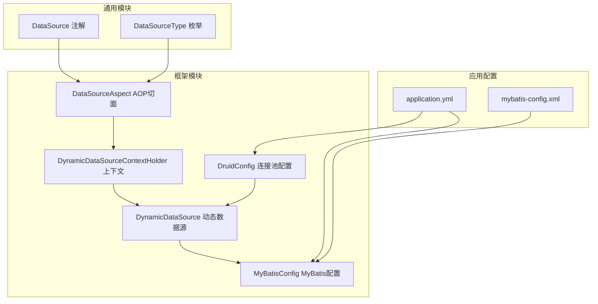
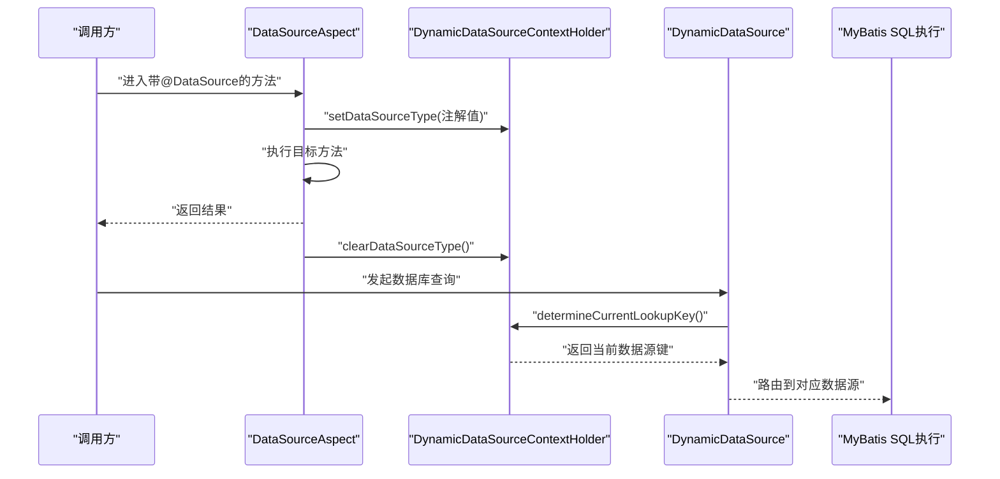
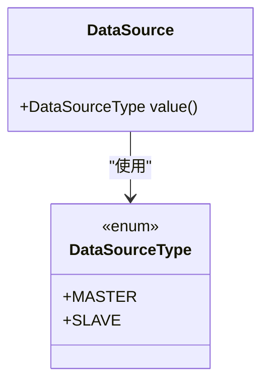
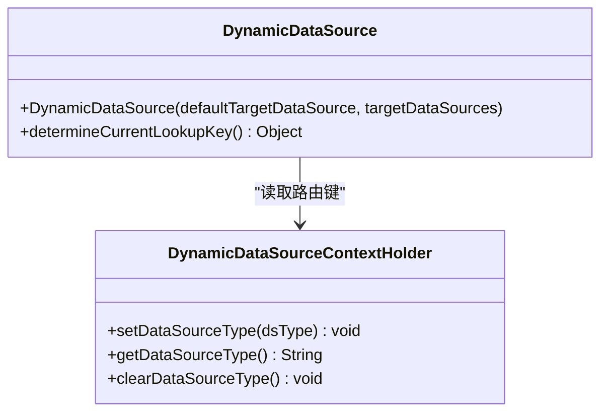
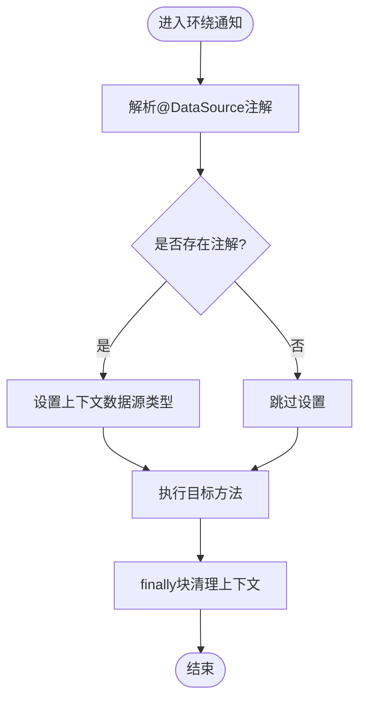
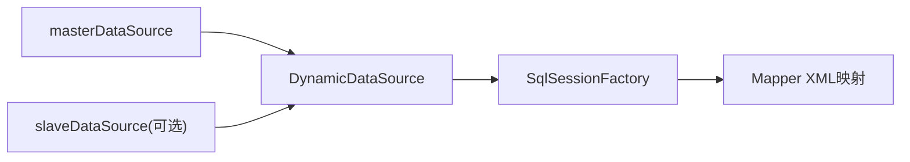
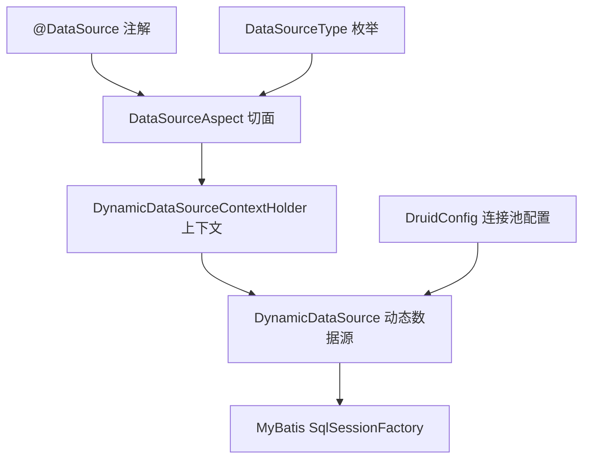

# 动态数据源管理

<cite>
**本文引用的文件**
- [DataSource.java](file://XingChen-Vue/xingchen-common/src/main/java/com/xingchen/common/annotation/DataSource.java)
- [DataSourceType.java](file://XingChen-Vue/xingchen-common/src/main/java/com/xingchen/common/enums/DataSourceType.java)
- [DynamicDataSource.java](file://XingChen-Vue/xingchen-framework/src/main/java/com/xingchen/framework/datasource/DynamicDataSource.java)
- [DynamicDataSourceContextHolder.java](file://XingChen-Vue/xingchen-framework/src/main/java/com/xingchen/framework/datasource/DynamicDataSourceContextHolder.java)
- [DataSourceAspect.java](file://XingChen-Vue/xingchen-framework/src/main/java/com/xingchen/framework/aspectj/DataSourceAspect.java)
- [DruidConfig.java](file://XingChen-Vue/xingchen-framework/src/main/java/com/xingchen/framework/config/DruidConfig.java)
- [MyBatisConfig.java](file://XingChen-Vue/xingchen-framework/src/main/java/com/xingchen/framework/config/MyBatisConfig.java)
- [application.yml](file://XingChen-Vue/xingchen-admin/src/main/resources/application.yml)
- [mybatis-config.xml](file://XingChen-Vue/xingchen-admin/src/main/resources/mybatis/mybatis-config.xml)
</cite>

## 目录
1. [简介](#简介)
2. [项目结构](#项目结构)
3. [核心组件](#核心组件)
4. [架构总览](#架构总览)
5. [详细组件分析](#详细组件分析)
6. [依赖分析](#依赖分析)
7. [性能考虑](#性能考虑)
8. [故障排查指南](#故障排查指南)
9. [结论](#结论)
10. [附录](#附录)

## 简介
本文件系统性阐述健康管理系统中动态数据源管理的设计与实现，重点围绕以下目标展开：
- 动态数据源切换的核心机制：基于Spring JDBC的AbstractRoutingDataSource实现，结合ThreadLocal上下文完成路由决策。
- 数据源路由策略：通过注解驱动的AOP切面在方法执行前后设置/清理数据源上下文，确保读写分离与多数据源场景下的正确路由。
- 多数据源配置与连接池管理：基于Druid连接池的主从数据源装配，以及MyBatis的集成配置。
- 事务处理策略：在多数据源环境下保持事务边界清晰，避免跨数据源事务带来的不一致。
- 最佳实践与常见问题：提供可操作的配置建议与排障指引。

## 项目结构
动态数据源相关代码主要分布在通用模块与框架模块中，配合应用配置与MyBatis配置共同工作：
- 通用注解与枚举：定义@DataSource注解与数据源类型枚举，用于声明式切换。
- 框架层实现：动态数据源类、上下文持有者、AOP切面、Druid配置与MyBatis配置。
- 应用配置：Spring Boot配置文件中启用多数据源与MyBatis映射。

图表来源
- [DataSource.java:1-29](file://XingChen-Vue/xingchen-common/src/main/java/com/xingchen/common/annotation/DataSource.java#L1-L29)
- [DataSourceType.java:1-20](file://XingChen-Vue/xingchen-common/src/main/java/com/xingchen/common/enums/DataSourceType.java#L1-L20)
- [DynamicDataSource.java:1-26](file://XingChen-Vue/xingchen-framework/src/main/java/com/xingchen/framework/datasource/DynamicDataSource.java#L1-L26)
- [DynamicDataSourceContextHolder.java:1-46](file://XingChen-Vue/xingchen-framework/src/main/java/com/xingchen/framework/datasource/DynamicDataSourceContextHolder.java#L1-L46)
- [DataSourceAspect.java:1-73](file://XingChen-Vue/xingchen-framework/src/main/java/com/xingchen/framework/aspectj/DataSourceAspect.java#L1-L73)
- [DruidConfig.java:1-127](file://XingChen-Vue/xingchen-framework/src/main/java/com/xingchen/framework/config/DruidConfig.java#L1-L127)
- [MyBatisConfig.java:1-132](file://XingChen-Vue/xingchen-framework/src/main/java/com/xingchen/framework/config/MyBatisConfig.java#L1-L132)
- [application.yml:1-148](file://XingChen-Vue/xingchen-admin/src/main/resources/application.yml#L1-L148)
- [mybatis-config.xml:1-21](file://XingChen-Vue/xingchen-admin/src/main/resources/mybatis/mybatis-config.xml#L1-L21)

章节来源
- [application.yml:1-148](file://XingChen-Vue/xingchen-admin/src/main/resources/application.yml#L1-L148)
- [mybatis-config.xml:1-21](file://XingChen-Vue/xingchen-admin/src/main/resources/mybatis/mybatis-config.xml#L1-L21)

## 核心组件
- 注解与枚举
  - @DataSource：用于在方法或类上声明数据源类型，默认为主库；优先级为“方法 > 类”。
  - DataSourceType：定义MASTER（主库）与SLAVE（从库）两种类型。
- 动态数据源
  - DynamicDataSource：继承AbstractRoutingDataSource，重写determineCurrentLookupKey，返回当前线程上下文中的数据源键。
- 上下文持有者
  - DynamicDataSourceContextHolder：使用ThreadLocal保存当前线程的数据源类型，在方法执行前设置、执行后清理。
- AOP切面
  - DataSourceAspect：基于注解的环绕通知，在方法执行前后设置/清理数据源上下文，解析注解优先级。
- Druid配置
  - DruidConfig：装配主库与可选从库Druid数据源，构建DynamicDataSource并设为Primary。
- MyBatis配置
  - MyBatisConfig：统一管理实体别名包、Mapper XML位置与MyBatis全局配置加载。

章节来源
- [DataSource.java:1-29](file://XingChen-Vue/xingchen-common/src/main/java/com/xingchen/common/annotation/DataSource.java#L1-L29)
- [DataSourceType.java:1-20](file://XingChen-Vue/xingchen-common/src/main/java/com/xingchen/common/enums/DataSourceType.java#L1-L20)
- [DynamicDataSource.java:1-26](file://XingChen-Vue/xingchen-framework/src/main/java/com/xingchen/framework/datasource/DynamicDataSource.java#L1-L26)
- [DynamicDataSourceContextHolder.java:1-46](file://XingChen-Vue/xingchen-framework/src/main/java/com/xingchen/framework/datasource/DynamicDataSourceContextHolder.java#L1-L46)
- [DataSourceAspect.java:1-73](file://XingChen-Vue/xingchen-framework/src/main/java/com/xingchen/framework/aspectj/DataSourceAspect.java#L1-L73)
- [DruidConfig.java:1-127](file://XingChen-Vue/xingchen-framework/src/main/java/com/xingchen/framework/config/DruidConfig.java#L1-L127)
- [MyBatisConfig.java:1-132](file://XingChen-Vue/xingchen-framework/src/main/java/com/xingchen/framework/config/MyBatisConfig.java#L1-L132)

## 架构总览
动态数据源的运行时流程如下：
- 方法调用进入AOP切面，根据注解解析目标数据源类型。
- 将数据源类型写入ThreadLocal上下文。
- MyBatis执行SQL时，通过DynamicDataSource的lookupKey从上下文中读取当前数据源键，选择对应的数据源。
- 方法执行完成后清理ThreadLocal，避免线程复用导致的脏读。

图表来源
- [DataSourceAspect.java:37-56](file://XingChen-Vue/xingchen-framework/src/main/java/com/xingchen/framework/aspectj/DataSourceAspect.java#L37-L56)
- [DynamicDataSourceContextHolder.java:24-44](file://XingChen-Vue/xingchen-framework/src/main/java/com/xingchen/framework/datasource/DynamicDataSourceContextHolder.java#L24-L44)
- [DynamicDataSource.java:21-25](file://XingChen-Vue/xingchen-framework/src/main/java/com/xingchen/framework/datasource/DynamicDataSource.java#L21-L25)

## 详细组件分析

### 注解与枚举
- @DataSource
  - 作用域：方法与类级别，支持继承。
  - 默认值：MASTER。
  - 优先级：方法注解覆盖类注解。
- DataSourceType
  - MASTER：主库，用于写操作。
  - SLAVE：从库，用于读操作。

图表来源
- [DataSource.java:22-28](file://XingChen-Vue/xingchen-common/src/main/java/com/xingchen/common/annotation/DataSource.java#L22-L28)
- [DataSourceType.java:8-19](file://XingChen-Vue/xingchen-common/src/main/java/com/xingchen/common/enums/DataSourceType.java#L8-L19)

章节来源
- [DataSource.java:1-29](file://XingChen-Vue/xingchen-common/src/main/java/com/xingchen/common/annotation/DataSource.java#L1-L29)
- [DataSourceType.java:1-20](file://XingChen-Vue/xingchen-common/src/main/java/com/xingchen/common/enums/DataSourceType.java#L1-L20)

### 动态数据源与上下文
- DynamicDataSource
  - 继承AbstractRoutingDataSource，构造时注入默认数据源与目标数据源映射。
  - determineCurrentLookupKey返回当前线程上下文中的数据源键。
- DynamicDataSourceContextHolder
  - 使用ThreadLocal存储当前线程的数据源类型。
  - 提供set/get/clear方法，分别用于设置、获取与清理。

图表来源
- [DynamicDataSource.java:12-25](file://XingChen-Vue/xingchen-framework/src/main/java/com/xingchen/framework/datasource/DynamicDataSource.java#L12-L25)
- [DynamicDataSourceContextHolder.java:11-45](file://XingChen-Vue/xingchen-framework/src/main/java/com/xingchen/framework/datasource/DynamicDataSourceContextHolder.java#L11-L45)

章节来源
- [DynamicDataSource.java:1-26](file://XingChen-Vue/xingchen-framework/src/main/java/com/xingchen/framework/datasource/DynamicDataSource.java#L1-L26)
- [DynamicDataSourceContextHolder.java:1-46](file://XingChen-Vue/xingchen-framework/src/main/java/com/xingchen/framework/datasource/DynamicDataSourceContextHolder.java#L1-L46)

### AOP切面与注解解析
- DataSourceAspect
  - 切点：匹配带@DataSource的方法或类。
  - 环绕通知：在方法执行前设置上下文，执行后清理。
  - 注解解析：优先取方法注解，其次取类注解。
- 执行流程
  - 解析注解 -> setDataSourceType -> proceed -> finally清理。

图表来源
- [DataSourceAspect.java:37-56](file://XingChen-Vue/xingchen-framework/src/main/java/com/xingchen/framework/aspectj/DataSourceAspect.java#L37-L56)

章节来源
- [DataSourceAspect.java:1-73](file://XingChen-Vue/xingchen-framework/src/main/java/com/xingchen/framework/aspectj/DataSourceAspect.java#L1-L73)

### 多数据源配置与连接池管理
- DruidConfig
  - 主库：从配置前缀spring.datasource.druid.master加载Druid属性。
  - 从库：条件装配，仅当spring.datasource.druid.slave.enabled=true时生效。
  - 动态数据源：将MASTER与SLAVE数据源注册到DynamicDataSource，MASTER作为默认数据源。
- MyBatisConfig
  - 统一扫描实体别名包、Mapper XML位置与MyBatis全局配置文件。
  - 通过SqlSessionFactoryBean注入动态数据源。

图表来源
- [DruidConfig.java:35-79](file://XingChen-Vue/xingchen-framework/src/main/java/com/xingchen/framework/config/DruidConfig.java#L35-L79)
- [MyBatisConfig.java:116-131](file://XingChen-Vue/xingchen-framework/src/main/java/com/xingchen/framework/config/MyBatisConfig.java#L116-L131)

章节来源
- [DruidConfig.java:1-127](file://XingChen-Vue/xingchen-framework/src/main/java/com/xingchen/framework/config/DruidConfig.java#L1-L127)
- [MyBatisConfig.java:1-132](file://XingChen-Vue/xingchen-framework/src/main/java/com/xingchen/framework/config/MyBatisConfig.java#L1-L132)

### 事务处理策略
- 建议
  - 在同一业务方法内，尽量保持数据源不变，避免跨数据源事务。
  - 对于读写分离场景，确保写操作在MASTER，读操作在SLAVE。
  - 使用编程式事务时，明确绑定当前数据源类型，避免线程切换导致的上下文丢失。
- 注意
  - Spring事务管理器需与动态数据源协同，确保同一事务内的所有数据访问使用相同的数据源。

## 依赖分析
- 组件耦合
  - DataSourceAspect依赖@DataSource注解与DynamicDataSourceContextHolder。
  - DynamicDataSource依赖DynamicDataSourceContextHolder提供的lookupKey。
  - DruidConfig装配DynamicDataSource并注入MyBatis。
- 外部依赖
  - Druid连接池：提供高性能连接池能力。
  - MyBatis：提供ORM映射与SQL执行能力。
  - Spring AOP：提供注解驱动的切面织入。

图表来源
- [DataSource.java:1-29](file://XingChen-Vue/xingchen-common/src/main/java/com/xingchen/common/annotation/DataSource.java#L1-L29)
- [DataSourceType.java:1-20](file://XingChen-Vue/xingchen-common/src/main/java/com/xingchen/common/enums/DataSourceType.java#L1-L20)
- [DataSourceAspect.java:1-73](file://XingChen-Vue/xingchen-framework/src/main/java/com/xingchen/framework/aspectj/DataSourceAspect.java#L1-L73)
- [DynamicDataSourceContextHolder.java:1-46](file://XingChen-Vue/xingchen-framework/src/main/java/com/xingchen/framework/datasource/DynamicDataSourceContextHolder.java#L1-L46)
- [DynamicDataSource.java:1-26](file://XingChen-Vue/xingchen-framework/src/main/java/com/xingchen/framework/datasource/DynamicDataSource.java#L1-L26)
- [DruidConfig.java:1-127](file://XingChen-Vue/xingchen-framework/src/main/java/com/xingchen/framework/config/DruidConfig.java#L1-L127)

## 性能考虑
- 连接池参数
  - 合理设置Druid连接池的初始连接数、最大活跃数与最大等待时间，避免高并发下的连接争用。
- 路由开销
  - determineCurrentLookupKey为轻量级操作，但应避免在热点路径频繁切换数据源。
- 读写分离
  - 将只读查询路由至SLAVE，写操作路由至MASTER，降低主库压力。
- 缓存与日志
  - MyBatis开启二级缓存与合适的日志实现，便于定位性能瓶颈。

## 故障排查指南
- 症状：切换无效或始终使用默认数据源
  - 检查@DataSource注解是否正确标注在目标方法或类上。
  - 确认AOP切面已生效，且优先级顺序正确。
  - 查看DynamicDataSourceContextHolder中是否成功set/clear。
- 症状：从库不可用
  - 检查spring.datasource.druid.slave.enabled是否为true。
  - 确认从库Druid配置项存在且有效。
- 症状：事务异常或跨数据源事务
  - 确保同一业务方法内数据源不变。
  - 明确事务边界，避免在不同数据源间传播事务。
- 症状：SQL执行慢
  - 检查Druid连接池参数与数据库性能指标。
  - 审核Mapper SQL与索引情况。

章节来源
- [DataSourceAspect.java:37-56](file://XingChen-Vue/xingchen-framework/src/main/java/com/xingchen/framework/aspectj/DataSourceAspect.java#L37-L56)
- [DynamicDataSourceContextHolder.java:24-44](file://XingChen-Vue/xingchen-framework/src/main/java/com/xingchen/framework/datasource/DynamicDataSourceContextHolder.java#L24-L44)
- [DruidConfig.java:43-79](file://XingChen-Vue/xingchen-framework/src/main/java/com/xingchen/framework/config/DruidConfig.java#L43-L79)

## 结论
本方案通过注解+AOP+ThreadLocal+DynamicDataSource的组合，实现了灵活、可控的多数据源切换。配合Druid连接池与MyBatis配置，可在保证性能的同时满足读写分离与扩展需求。实际落地时，建议严格遵循注解优先级、事务边界与连接池参数优化等最佳实践，以获得稳定高效的运行效果。

## 附录
- 关键配置参考
  - application.yml中MyBatis相关配置与profiles激活。
  - mybatis-config.xml中MyBatis全局设置。
- 常用路径
  - 注解与枚举：common模块。
  - 动态数据源与切面：framework模块。
  - 连接池与MyBatis：framework模块。
  - 应用配置：admin模块。

章节来源
- [application.yml:104-111](file://XingChen-Vue/xingchen-admin/src/main/resources/application.yml#L104-L111)
- [mybatis-config.xml:5-18](file://XingChen-Vue/xingchen-admin/src/main/resources/mybatis/mybatis-config.xml#L5-L18)