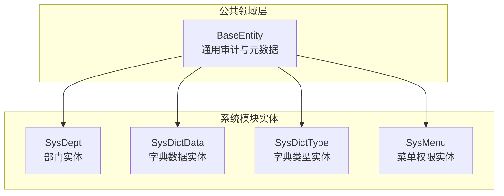
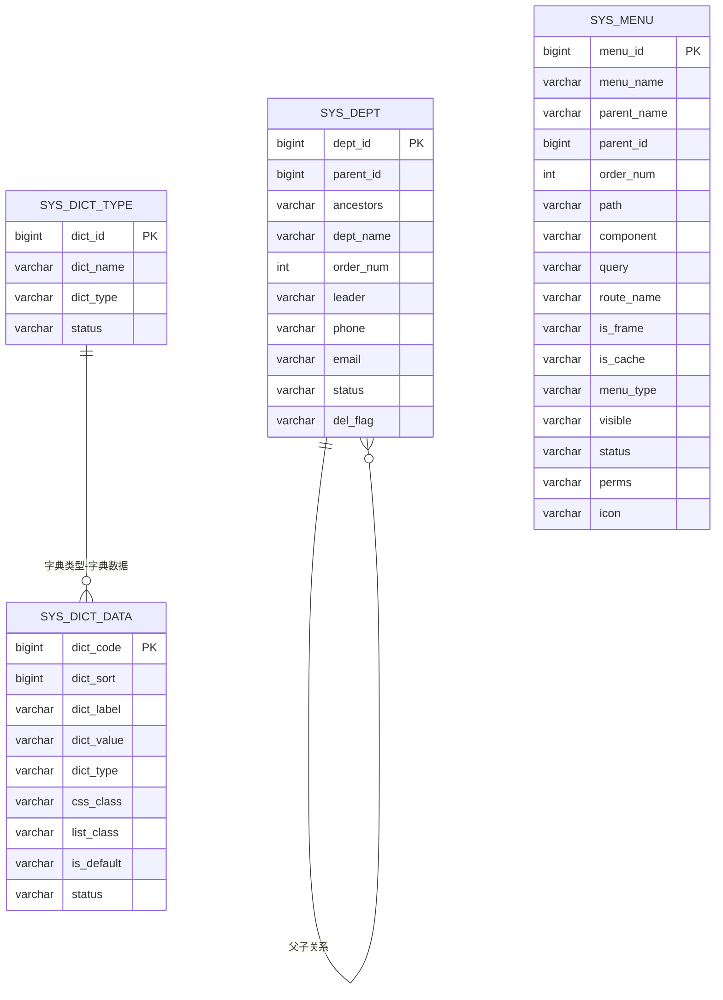
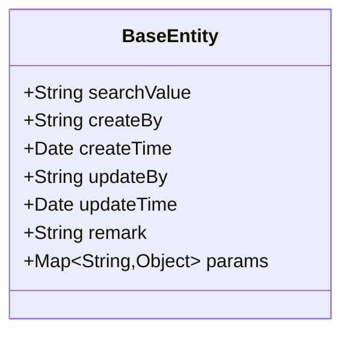
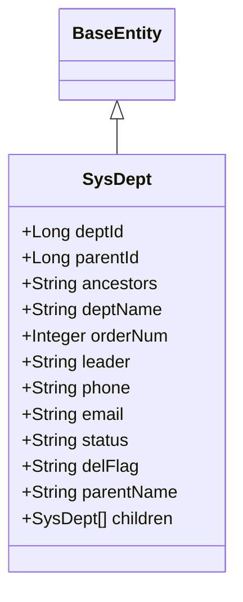
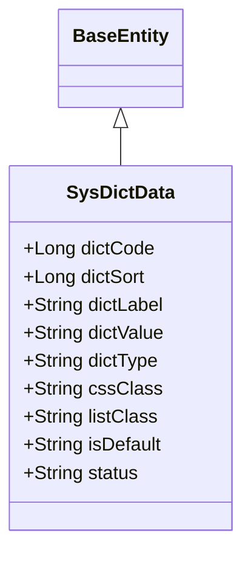
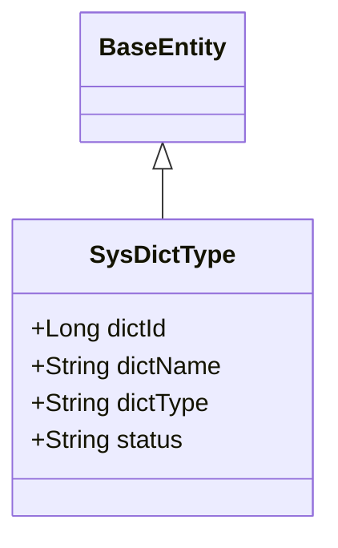
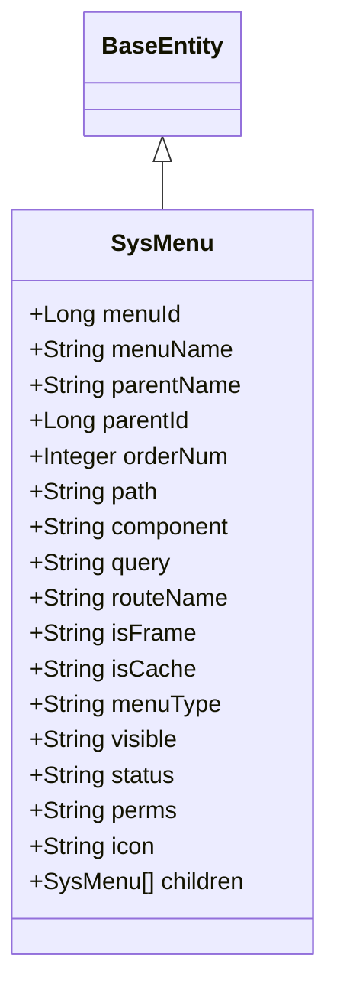
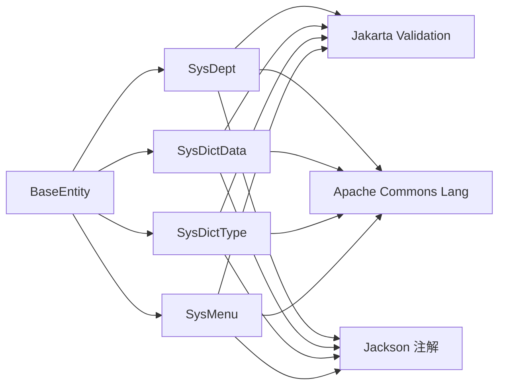

# 实体类设计与映射

<cite>
**本文引用的文件**
- [BaseEntity.java](file://XingChen-Vue/xingchen-common/src/main/java/com/xingchen/common/core/domain/BaseEntity.java)
- [SysDept.java](file://XingChen-Vue/xingchen-common/src/main/java/com/xingchen/common/core/domain/entity/SysDept.java)
- [SysDictData.java](file://XingChen-Vue/xingchen-common/src/main/java/com/xingchen/common/core/domain/entity/SysDictData.java)
- [SysDictType.java](file://XingChen-Vue/xingchen-common/src/main/java/com/xingchen/common/core/domain/entity/SysDictType.java)
- [SysMenu.java](file://XingChen-Vue/xingchen-common/src/main/java/com/xingchen/common/core/domain/entity/SysMenu.java)
</cite>

## 目录
1. [引言](#引言)
2. [项目结构](#项目结构)
3. [核心组件](#核心组件)
4. [架构总览](#架构总览)
5. [详细组件分析](#详细组件分析)
6. [依赖分析](#依赖分析)
7. [性能考虑](#性能考虑)
8. [故障排查指南](#故障排查指南)
9. [结论](#结论)
10. [附录](#附录)

## 引言
本文件聚焦于健康管理系统中“实体类设计与映射”的工程实践，围绕 BaseEntity 基类的设计理念与通用字段、业务实体类的字段定义与校验注解、实体与数据库表的映射关系、序列化处理策略以及数据转换与约束规则进行系统性梳理，并总结可复用的设计规范与继承关系最佳实践。

## 项目结构
本项目的实体类主要位于公共模块的领域层，采用“按功能域分包”的组织方式，便于跨模块复用与维护。核心结构如下：
- 公共基础：BaseEntity 提供统一的审计与元数据字段
- 业务实体：SysDept、SysDictData、SysDictType、SysMenu 等继承 BaseEntity，承载各自业务模型与约束

图表来源
- [BaseEntity.java:16-118](file://XingChen-Vue/xingchen-common/src/main/java/com/xingchen/common/core/domain/BaseEntity.java#L16-L118)
- [SysDept.java:18-203](file://XingChen-Vue/xingchen-common/src/main/java/com/xingchen/common/core/domain/entity/SysDept.java#L18-L203)
- [SysDictData.java:17-176](file://XingChen-Vue/xingchen-common/src/main/java/com/xingchen/common/core/domain/entity/SysDictData.java#L17-L176)
- [SysDictType.java:17-96](file://XingChen-Vue/xingchen-common/src/main/java/com/xingchen/common/core/domain/entity/SysDictType.java#L17-L96)
- [SysMenu.java:17-274](file://XingChen-Vue/xingchen-common/src/main/java/com/xingchen/common/core/domain/entity/SysMenu.java#L17-L274)

章节来源
- [BaseEntity.java:11-118](file://XingChen-Vue/xingchen-common/src/main/java/com/xingchen/common/core/domain/BaseEntity.java#L11-L118)
- [SysDept.java:13-203](file://XingChen-Vue/xingchen-common/src/main/java/com/xingchen/common/core/domain/entity/SysDept.java#L13-L203)
- [SysDictData.java:12-176](file://XingChen-Vue/xingchen-common/src/main/java/com/xingchen/common/core/domain/entity/SysDictData.java#L12-L176)
- [SysDictType.java:12-96](file://XingChen-Vue/xingchen-common/src/main/java/com/xingchen/common/core/domain/entity/SysDictType.java#L12-L96)
- [SysMenu.java:12-274](file://XingChen-Vue/xingchen-common/src/main/java/com/xingchen/common/core/domain/entity/SysMenu.java#L12-L274)

## 核心组件
本节聚焦 BaseEntity 基类的设计与职责，以及其在各业务实体中的继承与复用。

- 设计理念
  - 统一审计：通过创建者、创建时间、更新者、更新时间等字段，确保所有持久化对象具备一致的审计轨迹
  - 元数据支持：提供搜索值与请求参数容器，便于查询过滤与动态扩展
  - 序列化控制：对敏感或冗余字段进行序列化时的排除与包含策略，降低传输体积与安全风险
  - 可扩展性：子类仅需关注自身业务字段与规则，无需重复实现通用逻辑

- 关键字段与行为
  - 审计字段：createBy、createTime、updateBy、updateTime
  - 元数据：searchValue（忽略序列化）、params（非空时才序列化）
  - 备注：remark
  - 默认初始化：params 字段在首次访问时惰性初始化为空 Map

- 注解与序列化策略
  - 时间字段使用 JSON 格式化注解，保证序列化输出格式一致
  - searchValue 使用忽略序列化注解，避免污染响应体
  - params 使用非空包含策略，避免返回空集合导致的冗余

章节来源
- [BaseEntity.java:16-118](file://XingChen-Vue/xingchen-common/src/main/java/com/xingchen/common/core/domain/BaseEntity.java#L16-L118)

## 架构总览
下图展示了实体类与数据库表的映射关系，以及字段到 Java 类型的对应思路。该映射遵循“命名规约 + 注解标注”的方式，确保 ORM 层与前端交互的一致性。

图表来源
- [SysDept.java:22-56](file://XingChen-Vue/xingchen-common/src/main/java/com/xingchen/common/core/domain/entity/SysDept.java#L22-L56)
- [SysDictData.java:21-53](file://XingChen-Vue/xingchen-common/src/main/java/com/xingchen/common/core/domain/entity/SysDictData.java#L21-L53)
- [SysDictType.java:21-35](file://XingChen-Vue/xingchen-common/src/main/java/com/xingchen/common/core/domain/entity/SysDictType.java#L21-L35)
- [SysMenu.java:21-69](file://XingChen-Vue/xingchen-common/src/main/java/com/xingchen/common/core/domain/entity/SysMenu.java#L21-L69)

## 详细组件分析

### BaseEntity 基类
- 角色定位：所有业务实体的父类，提供统一的审计与元数据能力
- 字段与注解
  - 审计字段：createBy、updateBy（字符串），createTime、updateTime（日期），使用 JSON 格式化输出
  - 元数据：searchValue（忽略序列化），params（非空包含）
  - 备注：remark（字符串）
- 设计要点
  - 将“创建/更新”信息下沉至基类，减少重复代码
  - 通过注解控制序列化，兼顾安全性与传输效率
  - params 的惰性初始化提升内存友好性

图表来源
- [BaseEntity.java:20-43](file://XingChen-Vue/xingchen-common/src/main/java/com/xingchen/common/core/domain/BaseEntity.java#L20-L43)

章节来源
- [BaseEntity.java:16-118](file://XingChen-Vue/xingchen-common/src/main/java/com/xingchen/common/core/domain/BaseEntity.java#L16-L118)

### SysDept（部门实体）
- 表映射：sys_dept
- 继承关系：继承 BaseEntity，获得统一审计与元数据
- 关键字段与业务规则
  - 主键与层级：deptId、parentId、ancestors；children 支持树形结构
  - 名称与排序：deptName（必填，长度限制）、orderNum（必填）
  - 负责人与联系方式：leader、phone（长度限制）、email（邮箱格式与长度限制）
  - 状态与删除标记：status、delFlag
  - toString：基于 Apache Commons Lang 的 ToStringBuilder 输出全部字段
- 数据约束与校验
  - 使用 Jakarta Validation 注解对输入进行强约束，覆盖非空、长度、格式等
- 序列化与转换
  - 继承 BaseEntity 的序列化策略，时间字段格式化输出
  - toString 用于日志与调试场景

图表来源
- [SysDept.java:18-203](file://XingChen-Vue/xingchen-common/src/main/java/com/xingchen/common/core/domain/entity/SysDept.java#L18-L203)
- [BaseEntity.java:16-118](file://XingChen-Vue/xingchen-common/src/main/java/com/xingchen/common/core/domain/BaseEntity.java#L16-L118)

章节来源
- [SysDept.java:13-203](file://XingChen-Vue/xingchen-common/src/main/java/com/xingchen/common/core/domain/entity/SysDept.java#L13-L203)

### SysDictData（字典数据实体）
- 表映射：sys_dict_data
- 继承关系：继承 BaseEntity
- 关键字段与业务规则
  - 编码与排序：dictCode、dictSort（数值型 Excel 列）
  - 标签与键值：dictLabel、dictValue（必填，长度限制）
  - 类型与样式：dictType（必填，长度限制）、cssClass、listClass（长度限制）
  - 默认与状态：isDefault（枚举式展示）、status（状态）
  - toString：输出全部字段，包含 BaseEntity 的审计信息
- 注解与导出
  - 使用自定义 Excel 注解标注导入导出列属性与类型
- 校验与转换
  - 必填与长度校验确保数据完整性
  - isDefault 转换为布尔语义（基于常量判断）

图表来源
- [SysDictData.java:17-176](file://XingChen-Vue/xingchen-common/src/main/java/com/xingchen/common/core/domain/entity/SysDictData.java#L17-L176)
- [BaseEntity.java:16-118](file://XingChen-Vue/xingchen-common/src/main/java/com/xingchen/common/core/domain/BaseEntity.java#L16-L118)

章节来源
- [SysDictData.java:12-176](file://XingChen-Vue/xingchen-common/src/main/java/com/xingchen/common/core/domain/entity/SysDictData.java#L12-L176)

### SysDictType（字典类型实体）
- 表映射：sys_dict_type
- 继承关系：继承 BaseEntity
- 关键字段与业务规则
  - 主键与名称：dictId（数值型 Excel 列）、dictName（必填，长度限制）
  - 类型与状态：dictType（必填，长度限制，正则约束以字母开头且仅含小写/数字/下划线）、status（状态）
  - toString：输出全部字段，包含 BaseEntity 的审计信息
- 校验与约束
  - 正则表达式确保类型标识符的规范性
  - 长度与必填约束保障一致性

图表来源
- [SysDictType.java:17-96](file://XingChen-Vue/xingchen-common/src/main/java/com/xingchen/common/core/domain/entity/SysDictType.java#L17-L96)
- [BaseEntity.java:16-118](file://XingChen-Vue/xingchen-common/src/main/java/com/xingchen/common/core/domain/BaseEntity.java#L16-L118)

章节来源
- [SysDictType.java:12-96](file://XingChen-Vue/xingchen-common/src/main/java/com/xingchen/common/core/domain/entity/SysDictType.java#L12-L96)

### SysMenu（菜单权限实体）
- 表映射：sys_menu
- 继承关系：继承 BaseEntity
- 关键字段与业务规则
  - 菜单与层级：menuId、menuName、parentId、parentName
  - 排序与路由：orderNum（必填）、path（长度限制）、component（长度限制）、query、routeName
  - 行为与状态：isFrame、isCache、menuType（必填）、visible、status、perms（长度限制）、icon
  - 子菜单：children 支持树形结构
  - toString：输出全部字段，包含 BaseEntity 的审计信息
- 校验与约束
  - 必填、长度与类型约束确保菜单配置的合法性
- 序列化与转换
  - 继承 BaseEntity 的序列化策略，时间字段格式化输出

图表来源
- [SysMenu.java:17-274](file://XingChen-Vue/xingchen-common/src/main/java/com/xingchen/common/core/domain/entity/SysMenu.java#L17-L274)
- [BaseEntity.java:16-118](file://XingChen-Vue/xingchen-common/src/main/java/com/xingchen/common/core/domain/BaseEntity.java#L16-L118)

章节来源
- [SysMenu.java:12-274](file://XingChen-Vue/xingchen-common/src/main/java/com/xingchen/common/core/domain/entity/SysMenu.java#L12-L274)

## 依赖分析
- 继承关系
  - 所有业务实体均继承 BaseEntity，形成清晰的层次结构
- 外部依赖
  - Jakarta Validation 注解用于输入校验
  - Apache Commons Lang ToStringBuilder 用于 toString 输出
  - Jackson 注解用于序列化控制（JSON 格式化、忽略字段、非空包含）
- 约束与规则
  - 字段长度、必填、格式（邮箱、正则）等约束在实体层面集中定义
  - 删除标志与状态字段统一采用字符串枚举值，便于前端与数据库一致处理

图表来源
- [BaseEntity.java:7-9](file://XingChen-Vue/xingchen-common/src/main/java/com/xingchen/common/core/domain/BaseEntity.java#L7-L9)
- [SysDept.java:5-11](file://XingChen-Vue/xingchen-common/src/main/java/com/xingchen/common/core/domain/entity/SysDept.java#L5-L11)
- [SysDictData.java:3-10](file://XingChen-Vue/xingchen-common/src/main/java/com/xingchen/common/core/domain/entity/SysDictData.java#L3-L10)
- [SysDictType.java:3-10](file://XingChen-Vue/xingchen-common/src/main/java/com/xingchen/common/core/domain/entity/SysDictType.java#L3-L10)
- [SysMenu.java:5-10](file://XingChen-Vue/xingchen-common/src/main/java/com/xingchen/common/core/domain/entity/SysMenu.java#L5-L10)

章节来源
- [BaseEntity.java:7-9](file://XingChen-Vue/xingchen-common/src/main/java/com/xingchen/common/core/domain/BaseEntity.java#L7-L9)
- [SysDept.java:5-11](file://XingChen-Vue/xingchen-common/src/main/java/com/xingchen/common/core/domain/entity/SysDept.java#L5-L11)
- [SysDictData.java:3-10](file://XingChen-Vue/xingchen-common/src/main/java/com/xingchen/common/core/domain/entity/SysDictData.java#L3-L10)
- [SysDictType.java:3-10](file://XingChen-Vue/xingchen-common/src/main/java/com/xingchen/common/core/domain/entity/SysDictType.java#L3-L10)
- [SysMenu.java:5-10](file://XingChen-Vue/xingchen-common/src/main/java/com/xingchen/common/core/domain/entity/SysMenu.java#L5-L10)

## 性能考虑
- 序列化开销控制
  - 使用忽略序列化注解剔除不必要的字段（如 searchValue）
  - 使用非空包含策略避免空集合的序列化输出
- 内存占用优化
  - params 字段惰性初始化，仅在使用时创建 Map，降低空闲状态下的内存占用
- 查询与过滤
  - searchValue 作为临时查询参数，避免持久化存储，减少数据库字段数量
- 日志与调试
  - toString 使用批量构建器输出，便于日志记录但应避免在高频接口中频繁调用

## 故障排查指南
- 常见问题与定位
  - 字段长度超限：检查实体上的长度注解与数据库字段长度定义是否一致
  - 格式不合法：邮箱、正则等格式校验失败时，确认输入是否符合注解要求
  - 状态与删除标志：统一使用字符串枚举值，避免大小写与拼写差异
  - 时间字段格式：确认 JSON 序列化格式与前端解析一致
- 排查步骤
  - 在控制器或服务层捕获参数校验异常，定位具体字段与错误消息
  - 通过 toString 输出快速核对实体状态
  - 检查 BaseEntity 的序列化策略是否影响了预期输出

章节来源
- [BaseEntity.java:20-43](file://XingChen-Vue/xingchen-common/src/main/java/com/xingchen/common/core/domain/BaseEntity.java#L20-L43)
- [SysDept.java:88-142](file://XingChen-Vue/xingchen-common/src/main/java/com/xingchen/common/core/domain/entity/SysDept.java#L88-L142)
- [SysDictData.java:75-109](file://XingChen-Vue/xingchen-common/src/main/java/com/xingchen/common/core/domain/entity/SysDictData.java#L75-L109)
- [SysDictType.java:47-70](file://XingChen-Vue/xingchen-common/src/main/java/com/xingchen/common/core/domain/entity/SysDictType.java#L47-L70)
- [SysMenu.java:82-227](file://XingChen-Vue/xingchen-common/src/main/java/com/xingchen/common/core/domain/entity/SysMenu.java#L82-L227)

## 结论
本系统的实体设计以 BaseEntity 为核心，实现了审计与元数据的统一抽象，结合 Jakarta Validation 注解与 Jackson 序列化策略，形成了“强约束 + 友好序列化”的完整闭环。业务实体在继承通用能力的同时，专注于自身字段与规则，既保证了数据一致性，也提升了可维护性与扩展性。建议在后续迭代中持续完善注解覆盖范围与测试用例，确保边界条件与异常场景得到充分验证。

## 附录
- 设计规范与最佳实践
  - 继承关系：所有业务实体统一继承 BaseEntity，避免重复字段与逻辑
  - 字段命名：保持与数据库表字段一致的命名风格，必要时通过注解映射
  - 校验策略：优先在实体层使用注解进行强约束，减少后续处理分支
  - 序列化策略：对敏感字段使用忽略序列化，对可选字段使用非空包含
  - 状态与枚举：统一使用字符串枚举值，配合前端字典或常量进行展示转换
  - 日志与调试：合理使用 toString 输出，避免在高并发场景中过度使用