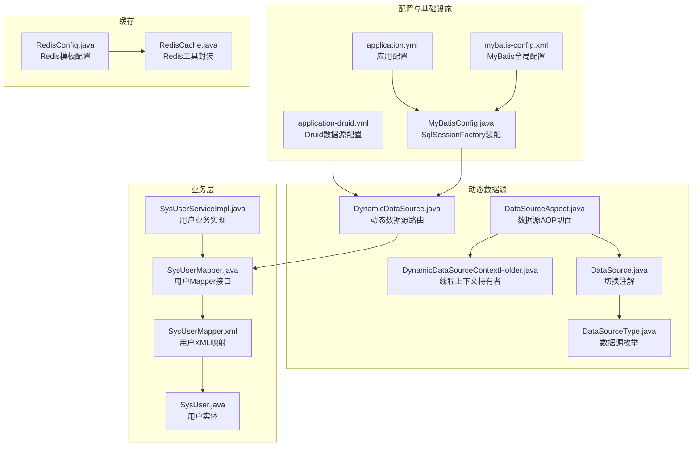
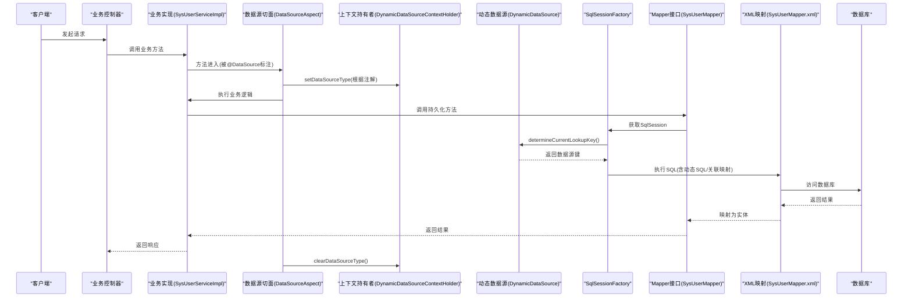
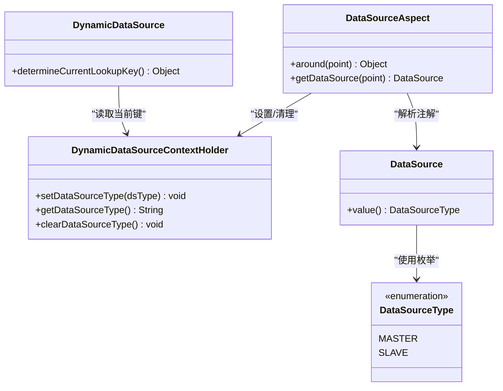
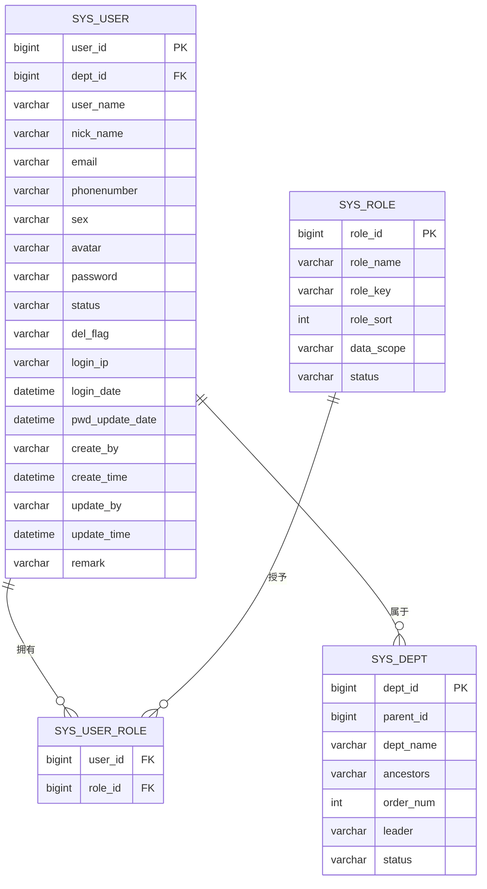
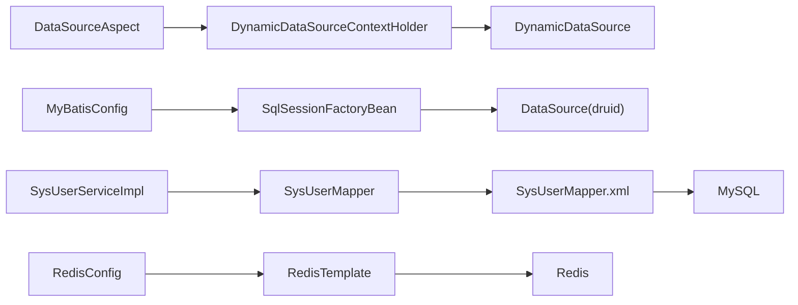

# 数据访问层设计

<cite>
**本文引用的文件**
- [application.yml](file://XingChen-Vue/xingchen-admin/src/main/resources/application.yml)
- [application-druid.yml](file://XingChen-Vue/xingchen-admin/src/main/resources/application-druid.yml)
- [mybatis-config.xml](file://XingChen-Vue/xingchen-admin/src/main/resources/mybatis/mybatis-config.xml)
- [MyBatisConfig.java](file://XingChen-Vue/xingchen-framework/src/main/java/com/xingchen/framework/config/MyBatisConfig.java)
- [DynamicDataSource.java](file://XingChen-Vue/xingchen-framework/src/main/java/com/xingchen/framework/datasource/DynamicDataSource.java)
- [DynamicDataSourceContextHolder.java](file://XingChen-Vue/xingchen-framework/src/main/java/com/xingchen/framework/datasource/DynamicDataSourceContextHolder.java)
- [DataSourceAspect.java](file://XingChen-Vue/xingchen-framework/src/main/java/com/xingchen/framework/aspectj/DataSourceAspect.java)
- [DataSource.java](file://XingChen-Vue/xingchen-common/src/main/java/com/xingchen/common/annotation/DataSource.java)
- [DataSourceType.java](file://XingChen-Vue/xingchen-common/src/main/java/com/xingchen/common/enums/DataSourceType.java)
- [SysUserMapper.java](file://XingChen-Vue/xingchen-system/src/main/java/com/xingchen/system/mapper/SysUserMapper.java)
- [SysUserMapper.xml](file://XingChen-Vue/xingchen-system/src/main/resources/mapper/system/SysUserMapper.xml)
- [SysUser.java](file://XingChen-Vue/xingchen-common/src/main/java/com/xingchen/common/core/domain/entity/SysUser.java)
- [SysUserServiceImpl.java](file://XingChen-Vue/xingchen-system/src/main/java/com/xingchen/system/service/impl/SysUserServiceImpl.java)
- [RedisConfig.java](file://XingChen-Vue/xingchen-framework/src/main/java/com/xingchen/framework/config/RedisConfig.java)
- [RedisCache.java](file://XingChen-Vue/xingchen-common/src/main/java/com/xingchen/common/core/redis/RedisCache.java)
</cite>

## 目录
1. [简介](#简介)
2. [项目结构](#项目结构)
3. [核心组件](#核心组件)
4. [架构总览](#架构总览)
5. [详细组件分析](#详细组件分析)
6. [依赖分析](#依赖分析)
7. [性能考虑](#性能考虑)
8. [故障排查指南](#故障排查指南)
9. [结论](#结论)
10. [附录](#附录)

## 简介
本文件系统性梳理健康管理系统的数据访问层设计，重点覆盖以下方面：
- MyBatis ORM 框架配置与扫描机制
- 动态数据源切换机制与多数据源支持策略
- 分层设计：Mapper 接口、XML 映射文件与实体类
- 数据源路由策略与事务管理
- SQL 优化、查询性能调优与缓存策略
- 最佳实践与常见问题解决方案

## 项目结构
数据访问层主要分布在三个模块：
- framework 层：MyBatis 配置、动态数据源与切面
- common 层：通用注解、枚举、实体与 Redis 封装
- system 层：业务 Mapper、XML 映射与 Service 实现

**图表来源**
- [application.yml:104-112](file://XingChen-Vue/xingchen-admin/src/main/resources/application.yml#L104-L112)
- [application-druid.yml:1-61](file://XingChen-Vue/xingchen-admin/src/main/resources/application-druid.yml#L1-L61)
- [mybatis-config.xml:1-21](file://XingChen-Vue/xingchen-admin/src/main/resources/mybatis/mybatis-config.xml#L1-L21)
- [MyBatisConfig.java:116-132](file://XingChen-Vue/xingchen-framework/src/main/java/com/xingchen/framework/config/MyBatisConfig.java#L116-L132)
- [DynamicDataSource.java:12-26](file://XingChen-Vue/xingchen-framework/src/main/java/com/xingchen/framework/datasource/DynamicDataSource.java#L12-L26)
- [DynamicDataSourceContextHolder.java:11-46](file://XingChen-Vue/xingchen-framework/src/main/java/com/xingchen/framework/datasource/DynamicDataSourceContextHolder.java#L11-L46)
- [DataSourceAspect.java:26-73](file://XingChen-Vue/xingchen-framework/src/main/java/com/xingchen/framework/aspectj/DataSourceAspect.java#L26-L73)
- [DataSource.java:18-29](file://XingChen-Vue/xingchen-common/src/main/java/com/xingchen/common/annotation/DataSource.java#L18-L29)
- [DataSourceType.java:8-20](file://XingChen-Vue/xingchen-common/src/main/java/com/xingchen/common/enums/DataSourceType.java#L8-L20)
- [SysUserMapper.java:13-148](file://XingChen-Vue/xingchen-system/src/main/java/com/xingchen/system/mapper/SysUserMapper.java#L13-L148)
- [SysUserMapper.xml:5-227](file://XingChen-Vue/xingchen-system/src/main/resources/mapper/system/SysUserMapper.xml#L5-L227)
- [SysUser.java:22-337](file://XingChen-Vue/xingchen-common/src/main/java/com/xingchen/common/core/domain/entity/SysUser.java#L22-L337)
- [SysUserServiceImpl.java:41-566](file://XingChen-Vue/xingchen-system/src/main/java/com/xingchen/system/service/impl/SysUserServiceImpl.java#L41-L566)
- [RedisConfig.java:18-71](file://XingChen-Vue/xingchen-framework/src/main/java/com/xingchen/framework/config/RedisConfig.java#L18-L71)
- [RedisCache.java:23-269](file://XingChen-Vue/xingchen-common/src/main/java/com/xingchen/common/core/redis/RedisCache.java#L23-L269)

**章节来源**
- [application.yml:104-112](file://XingChen-Vue/xingchen-admin/src/main/resources/application.yml#L104-L112)
- [application-druid.yml:1-61](file://XingChen-Vue/xingchen-admin/src/main/resources/application-druid.yml#L1-L61)
- [mybatis-config.xml:1-21](file://XingChen-Vue/xingchen-admin/src/main/resources/mybatis/mybatis-config.xml#L1-L21)
- [MyBatisConfig.java:116-132](file://XingChen-Vue/xingchen-framework/src/main/java/com/xingchen/framework/config/MyBatisConfig.java#L116-L132)

## 核心组件
- MyBatis 全局配置与扫描
  - 全局设置启用缓存、JDBC 主键生成、日志实现等
  - 应用通过 application.yml 指定 typeAliasesPackage、mapperLocations 与 configLocation
  - MyBatisConfig 负责解析包扫描与 mapper 路径，并装配 SqlSessionFactory

- 动态数据源与路由
  - DynamicDataSource 继承 AbstractRoutingDataSource，按当前线程上下文选择数据源
  - DynamicDataSourceContextHolder 使用 ThreadLocal 维护当前数据源键
  - DataSourceAspect 通过注解识别目标数据源，环绕增强方法执行前后设置/清理上下文

- 多数据源支持策略
  - application-druid.yml 定义 master/slave 数据源（slave 默认关闭）
  - DataSourceType 提供 MASTER/SLAVE 枚举
  - DataSource 注解用于方法或类级别声明数据源

- 分层设计
  - Mapper 接口：定义 CRUD 与条件查询方法
  - XML 映射：resultMap、SQL 片段、动态 SQL 与关联映射
  - 实体类：承载字段与业务属性，配合注解与校验

- 缓存策略
  - RedisConfig 配置 RedisTemplate 序列化策略与限流脚本
  - RedisCache 提供对象、List、Set、Map、Hash 的常用缓存操作

**章节来源**
- [mybatis-config.xml:7-18](file://XingChen-Vue/xingchen-admin/src/main/resources/mybatis/mybatis-config.xml#L7-L18)
- [application.yml:104-112](file://XingChen-Vue/xingchen-admin/src/main/resources/application.yml#L104-L112)
- [MyBatisConfig.java:40-92](file://XingChen-Vue/xingchen-framework/src/main/java/com/xingchen/framework/config/MyBatisConfig.java#L40-L92)
- [DynamicDataSource.java:12-26](file://XingChen-Vue/xingchen-framework/src/main/java/com/xingchen/framework/datasource/DynamicDataSource.java#L12-L26)
- [DynamicDataSourceContextHolder.java:11-46](file://XingChen-Vue/xingchen-framework/src/main/java/com/xingchen/framework/datasource/DynamicDataSourceContextHolder.java#L11-L46)
- [DataSourceAspect.java:26-73](file://XingChen-Vue/xingchen-framework/src/main/java/com/xingchen/framework/aspectj/DataSourceAspect.java#L26-L73)
- [DataSource.java:18-29](file://XingChen-Vue/xingchen-common/src/main/java/com/xingchen/common/annotation/DataSource.java#L18-L29)
- [DataSourceType.java:8-20](file://XingChen-Vue/xingchen-common/src/main/java/com/xingchen/common/enums/DataSourceType.java#L8-L20)
- [application-druid.yml:1-61](file://XingChen-Vue/xingchen-admin/src/main/resources/application-druid.yml#L1-L61)
- [SysUserMapper.java:13-148](file://XingChen-Vue/xingchen-system/src/main/java/com/xingchen/system/mapper/SysUserMapper.java#L13-L148)
- [SysUserMapper.xml:5-227](file://XingChen-Vue/xingchen-system/src/main/resources/mapper/system/SysUserMapper.xml#L5-L227)
- [SysUser.java:22-337](file://XingChen-Vue/xingchen-common/src/main/java/com/xingchen/common/core/domain/entity/SysUser.java#L22-L337)
- [RedisConfig.java:18-71](file://XingChen-Vue/xingchen-framework/src/main/java/com/xingchen/framework/config/RedisConfig.java#L18-L71)
- [RedisCache.java:23-269](file://XingChen-Vue/xingchen-common/src/main/java/com/xingchen/common/core/redis/RedisCache.java#L23-L269)

## 架构总览
下图展示从请求到数据访问的关键流程，包括动态数据源路由与事务边界。

**图表来源**
- [DataSourceAspect.java:37-56](file://XingChen-Vue/xingchen-framework/src/main/java/com/xingchen/framework/aspectj/DataSourceAspect.java#L37-L56)
- [DynamicDataSourceContextHolder.java:24-44](file://XingChen-Vue/xingchen-framework/src/main/java/com/xingchen/framework/datasource/DynamicDataSourceContextHolder.java#L24-L44)
- [DynamicDataSource.java:21-25](file://XingChen-Vue/xingchen-framework/src/main/java/com/xingchen/framework/datasource/DynamicDataSource.java#L21-L25)
- [MyBatisConfig.java:116-132](file://XingChen-Vue/xingchen-framework/src/main/java/com/xingchen/framework/config/MyBatisConfig.java#L116-L132)
- [SysUserMapper.java:13-148](file://XingChen-Vue/xingchen-system/src/main/java/com/xingchen/system/mapper/SysUserMapper.java#L13-L148)
- [SysUserMapper.xml:5-227](file://XingChen-Vue/xingchen-system/src/main/resources/mapper/system/SysUserMapper.xml#L5-L227)

## 详细组件分析

### MyBatis 配置与扫描
- 全局配置要点
  - 启用缓存、JDBC 主键生成、默认执行器类型、日志实现
  - 可选驼峰命名转换（当前未启用）

- 扫描与装配
  - application.yml 指定 typeAliasesPackage、mapperLocations、configLocation
  - MyBatisConfig 解析包扫描路径，合并去重，确保别名包可达
  - resolveMapperLocations 支持多路径匹配，统一加载 mapper XML
  - SqlSessionFactoryBean 绑定数据源、别名包、mapper 位置与全局配置

- 复杂度与性能
  - 包扫描与元数据读取为 IO 密集型，建议合理拆分包路径，避免过度通配
  - 多路径加载需注意重复与顺序，建议集中管理

**章节来源**
- [mybatis-config.xml:7-18](file://XingChen-Vue/xingchen-admin/src/main/resources/mybatis/mybatis-config.xml#L7-L18)
- [application.yml:104-112](file://XingChen-Vue/xingchen-admin/src/main/resources/application.yml#L104-L112)
- [MyBatisConfig.java:40-92](file://XingChen-Vue/xingchen-framework/src/main/java/com/xingchen/framework/config/MyBatisConfig.java#L40-L92)
- [MyBatisConfig.java:94-114](file://XingChen-Vue/xingchen-framework/src/main/java/com/xingchen/framework/config/MyBatisConfig.java#L94-L114)
- [MyBatisConfig.java:116-132](file://XingChen-Vue/xingchen-framework/src/main/java/com/xingchen/framework/config/MyBatisConfig.java#L116-L132)

### 动态数据源与路由策略
- 设计模式
  - AbstractRoutingDataSource + ThreadLocal 上下文
  - 切面 + 注解驱动，保证方法粒度的精确控制

- 路由流程
  - 方法执行前：根据 @DataSource 决定数据源键并设置到上下文
  - 执行期间：SqlSessionFactory 通过 determineCurrentLookupKey 获取键
  - 执行后：清理上下文，避免线程复用污染

- 多数据源配置
  - application-druid.yml 定义 master/slave，slave 默认关闭
  - DataSourceType 提供枚举常量，便于扩展新数据源

**图表来源**
- [DynamicDataSource.java:12-26](file://XingChen-Vue/xingchen-framework/src/main/java/com/xingchen/framework/datasource/DynamicDataSource.java#L12-L26)
- [DynamicDataSourceContextHolder.java:11-46](file://XingChen-Vue/xingchen-framework/src/main/java/com/xingchen/framework/datasource/DynamicDataSourceContextHolder.java#L11-L46)
- [DataSourceAspect.java:26-73](file://XingChen-Vue/xingchen-framework/src/main/java/com/xingchen/framework/aspectj/DataSourceAspect.java#L26-L73)
- [DataSource.java:18-29](file://XingChen-Vue/xingchen-common/src/main/java/com/xingchen/common/annotation/DataSource.java#L18-L29)
- [DataSourceType.java:8-20](file://XingChen-Vue/xingchen-common/src/main/java/com/xingchen/common/enums/DataSourceType.java#L8-L20)

**章节来源**
- [DynamicDataSource.java:12-26](file://XingChen-Vue/xingchen-framework/src/main/java/com/xingchen/framework/datasource/DynamicDataSource.java#L12-L26)
- [DynamicDataSourceContextHolder.java:11-46](file://XingChen-Vue/xingchen-framework/src/main/java/com/xingchen/framework/datasource/DynamicDataSourceContextHolder.java#L11-L46)
- [DataSourceAspect.java:37-56](file://XingChen-Vue/xingchen-framework/src/main/java/com/xingchen/framework/aspectj/DataSourceAspect.java#L37-L56)
- [application-druid.yml:7-18](file://XingChen-Vue/xingchen-admin/src/main/resources/application-druid.yml#L7-L18)
- [DataSourceType.java:8-20](file://XingChen-Vue/xingchen-common/src/main/java/com/xingchen/common/enums/DataSourceType.java#L8-L20)

### 分层设计：Mapper、XML 与实体
- Mapper 接口
  - 定义用户查询、分页、新增、修改、删除与唯一性校验等方法
  - 使用 @Param 标注参数，便于 XML 中引用

- XML 映射
  - 通过 resultMap 完成一对一/一对多关联映射（部门、角色）
  - 使用 <sql> 定义可复用片段，减少重复
  - 动态 SQL 通过 <if>/<trim>/<foreach> 等标签实现条件拼接
  - 提供多个查询入口，覆盖不同筛选维度

- 实体类
  - SysUser 承载用户字段与业务属性，包含部门与角色集合
  - 配合注解与校验，满足导入导出与安全要求

**图表来源**
- [SysUserMapper.xml:7-48](file://XingChen-Vue/xingchen-system/src/main/resources/mapper/system/SysUserMapper.xml#L7-L48)
- [SysUser.java:22-337](file://XingChen-Vue/xingchen-common/src/main/java/com/xingchen/common/core/domain/entity/SysUser.java#L22-L337)

**章节来源**
- [SysUserMapper.java:13-148](file://XingChen-Vue/xingchen-system/src/main/java/com/xingchen/system/mapper/SysUserMapper.java#L13-L148)
- [SysUserMapper.xml:5-227](file://XingChen-Vue/xingchen-system/src/main/resources/mapper/system/SysUserMapper.xml#L5-L227)
- [SysUser.java:22-337](file://XingChen-Vue/xingchen-common/src/main/java/com/xingchen/common/core/domain/entity/SysUser.java#L22-L337)

### 事务管理机制
- 事务边界
  - Service 层使用 @Transactional 标注关键写操作（新增、修改、删除、授权）
  - 保证跨 Mapper 的一致性，避免部分提交

- 事务传播与隔离
  - 默认传播行为适用于大多数场景
  - 建议对只读查询（如分页查询）不加事务，降低锁竞争

- 异常回滚
  - 未捕获的运行时异常触发回滚
  - 业务异常通过抛出受检异常或运行时异常控制回滚

**章节来源**
- [SysUserServiceImpl.java:260-271](file://XingChen-Vue/xingchen-system/src/main/java/com/xingchen/system/service/impl/SysUserServiceImpl.java#L260-L271)
- [SysUserServiceImpl.java:291-305](file://XingChen-Vue/xingchen-system/src/main/java/com/xingchen/system/service/impl/SysUserServiceImpl.java#L291-L305)
- [SysUserServiceImpl.java:458-489](file://XingChen-Vue/xingchen-system/src/main/java/com/xingchen/system/service/impl/SysUserServiceImpl.java#L458-L489)

### SQL 优化与查询性能调优
- 动态 SQL 与条件拼接
  - 使用 <if> 标签按需拼接 where 条件，避免全表扫描
  - 注意参数绑定与类型匹配，防止隐式转换导致索引失效

- 关联查询与分页
  - XML 中通过 left join 进行关联，注意 on 条件与笛卡尔积风险
  - PageHelper 配置在 application.yml 中，结合分页参数提升性能

- 字段选择与冗余
  - 仅查询必要字段，减少网络与内存开销
  - 避免使用 select *，明确映射字段

- 索引与统计
  - 对高频过滤字段建立合适索引
  - 定期分析慢查询日志，结合 Druid 监控定位热点 SQL

**章节来源**
- [SysUserMapper.xml:60-87](file://XingChen-Vue/xingchen-system/src/main/resources/mapper/system/SysUserMapper.xml#L60-L87)
- [application.yml:114-118](file://XingChen-Vue/xingchen-admin/src/main/resources/application.yml#L114-L118)
- [application-druid.yml:52-61](file://XingChen-Vue/xingchen-admin/src/main/resources/application-druid.yml#L52-L61)

### 缓存策略与最佳实践
- Redis 配置
  - RedisConfig 统一序列化策略，避免默认 JDK 序列化带来的兼容性问题
  - 提供限流脚本，便于实现接口级限流

- 缓存封装
  - RedisCache 提供对象、List、Set、Map、Hash 的常用操作
  - 支持过期时间设置与批量操作，简化上层调用

- 使用建议
  - 读多写少场景优先使用缓存，写操作同步失效
  - 对热点数据设置合理 TTL，避免缓存雪崩
  - 使用 Hash 存储结构化对象，减少序列化成本

**章节来源**
- [RedisConfig.java:18-71](file://XingChen-Vue/xingchen-framework/src/main/java/com/xingchen/framework/config/RedisConfig.java#L18-L71)
- [RedisCache.java:23-269](file://XingChen-Vue/xingchen-common/src/main/java/com/xingchen/common/core/redis/RedisCache.java#L23-L269)

## 依赖分析
- 组件耦合
  - DataSourceAspect 依赖 DataSource 注解与 DynamicDataSourceContextHolder
  - DynamicDataSource 依赖 Spring JDBC 的 AbstractRoutingDataSource
  - MyBatisConfig 依赖 Environment 与资源解析能力
  - Service 层聚合多个 Mapper，形成业务组合

- 外部依赖
  - Druid 数据源提供连接池与监控
  - MyBatis 作为 ORM 框架负责 SQL 执行与映射
  - Redis 作为缓存中间件

**图表来源**
- [DataSourceAspect.java:14-16](file://XingChen-Vue/xingchen-framework/src/main/java/com/xingchen/framework/aspectj/DataSourceAspect.java#L14-L16)
- [DynamicDataSourceContextHolder.java:11-46](file://XingChen-Vue/xingchen-framework/src/main/java/com/xingchen/framework/datasource/DynamicDataSourceContextHolder.java#L11-L46)
- [DynamicDataSource.java:12-26](file://XingChen-Vue/xingchen-framework/src/main/java/com/xingchen/framework/datasource/DynamicDataSource.java#L12-L26)
- [MyBatisConfig.java:116-132](file://XingChen-Vue/xingchen-framework/src/main/java/com/xingchen/framework/config/MyBatisConfig.java#L116-L132)
- [SysUserMapper.java:13-148](file://XingChen-Vue/xingchen-system/src/main/java/com/xingchen/system/mapper/SysUserMapper.java#L13-L148)
- [SysUserMapper.xml:5-227](file://XingChen-Vue/xingchen-system/src/main/resources/mapper/system/SysUserMapper.xml#L5-L227)
- [application-druid.yml:4-18](file://XingChen-Vue/xingchen-admin/src/main/resources/application-druid.yml#L4-L18)
- [RedisConfig.java:18-71](file://XingChen-Vue/xingchen-framework/src/main/java/com/xingchen/framework/config/RedisConfig.java#L18-L71)

**章节来源**
- [DataSourceAspect.java:14-16](file://XingChen-Vue/xingchen-framework/src/main/java/com/xingchen/framework/aspectj/DataSourceAspect.java#L14-L16)
- [DynamicDataSource.java:12-26](file://XingChen-Vue/xingchen-framework/src/main/java/com/xingchen/framework/datasource/DynamicDataSource.java#L12-L26)
- [MyBatisConfig.java:116-132](file://XingChen-Vue/xingchen-framework/src/main/java/com/xingchen/framework/config/MyBatisConfig.java#L116-L132)
- [SysUserMapper.java:13-148](file://XingChen-Vue/xingchen-system/src/main/java/com/xingchen/system/mapper/SysUserMapper.java#L13-L148)

## 性能考虑
- 连接池与监控
  - Druid 提供连接池参数与慢 SQL 记录，建议结合业务峰值调优
  - 监控控制台可观察活跃连接、创建销毁速率与异常

- ORM 与 SQL
  - 合理使用二级缓存与本地缓存，避免 N+1 查询
  - 使用批量插入/更新减少往返次数

- 缓存命中率
  - 通过合理的键设计与 TTL，提升缓存命中率
  - 对热点数据进行预热，降低冷启动抖动

- 线程模型
  - 动态数据源基于 ThreadLocal，避免跨线程共享上下文
  - 异步任务与定时任务需谨慎设置数据源，避免污染

[本节为通用指导，无需列出具体文件来源]

## 故障排查指南
- 数据源切换无效
  - 检查方法是否被 @DataSource 标注或类上存在注解
  - 确认 finally 中是否调用了清理方法，避免上下文残留

- SQL 执行异常
  - 查看 Druid 监控面板的慢 SQL 与错误统计
  - 核对 XML 中动态 SQL 条件与参数绑定

- 缓存不生效
  - 检查 RedisTemplate 序列化配置与键空间
  - 确认缓存键命名规则与 TTL 设置

- 事务未回滚
  - 确认异常类型与传播行为
  - 检查跨代理调用导致的事务失效

**章节来源**
- [DataSourceAspect.java:51-56](file://XingChen-Vue/xingchen-framework/src/main/java/com/xingchen/framework/aspectj/DataSourceAspect.java#L51-L56)
- [DynamicDataSourceContextHolder.java:41-44](file://XingChen-Vue/xingchen-framework/src/main/java/com/xingchen/framework/datasource/DynamicDataSourceContextHolder.java#L41-L44)
- [application-druid.yml:52-61](file://XingChen-Vue/xingchen-admin/src/main/resources/application-druid.yml#L52-L61)
- [RedisConfig.java:22-41](file://XingChen-Vue/xingchen-framework/src/main/java/com/xingchen/framework/config/RedisConfig.java#L22-L41)

## 结论
本数据访问层设计以 MyBatis 为核心，结合 Druid 连接池与动态数据源切面，实现了灵活的多数据源支持与清晰的分层职责。通过注解驱动的数据源路由、完善的 XML 映射与实体设计，以及 Redis 缓存与事务管理，整体具备良好的可维护性与扩展性。建议在生产环境中持续关注慢 SQL、连接池参数与缓存命中率，以进一步提升系统稳定性与性能。

[本节为总结性内容，无需列出具体文件来源]

## 附录
- 关键配置项速览
  - MyBatis：typeAliasesPackage、mapperLocations、configLocation
  - PageHelper：helperDialect、supportMethodsArguments、params
  - Druid：master/slave、连接池参数、慢 SQL 记录

- 常用优化清单
  - 为高频查询字段建索引
  - 使用动态 SQL 精准拼接条件
  - 合理设置缓存 TTL 与失效策略
  - 监控连接池与慢 SQL，定期优化

**章节来源**
- [application.yml:104-118](file://XingChen-Vue/xingchen-admin/src/main/resources/application.yml#L104-L118)
- [application-druid.yml:1-61](file://XingChen-Vue/xingchen-admin/src/main/resources/application-druid.yml#L1-L61)