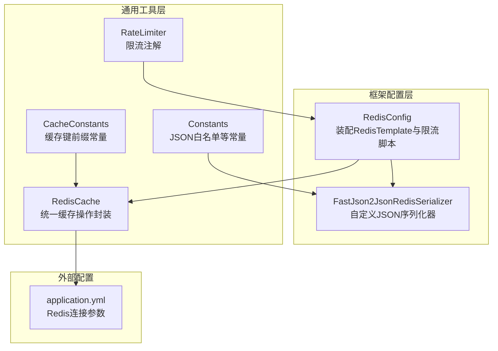
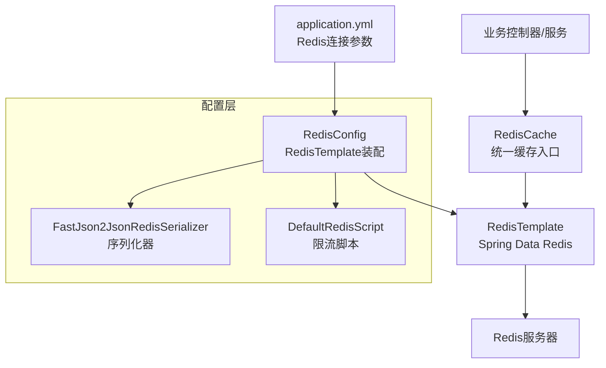
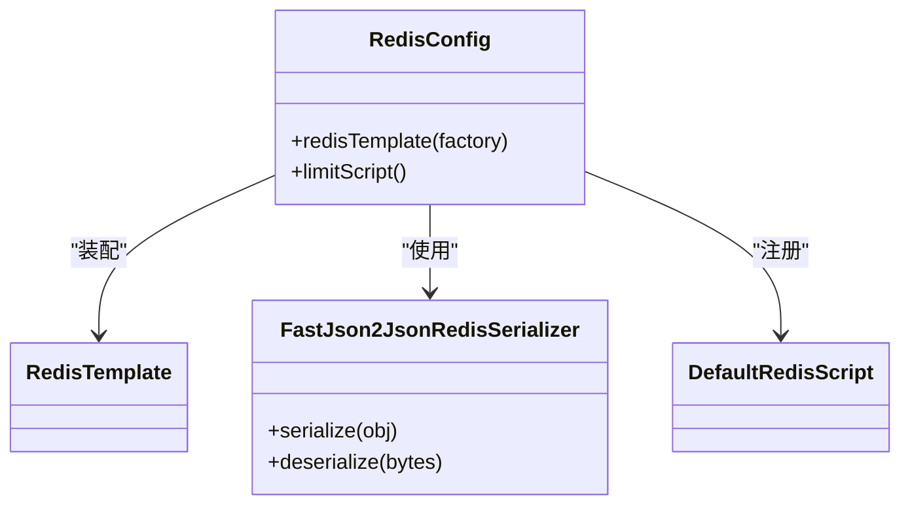
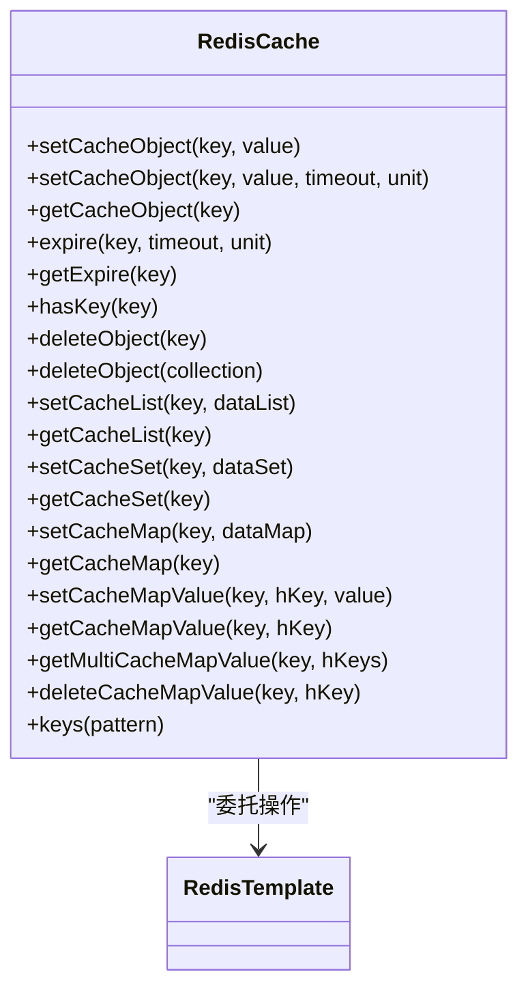
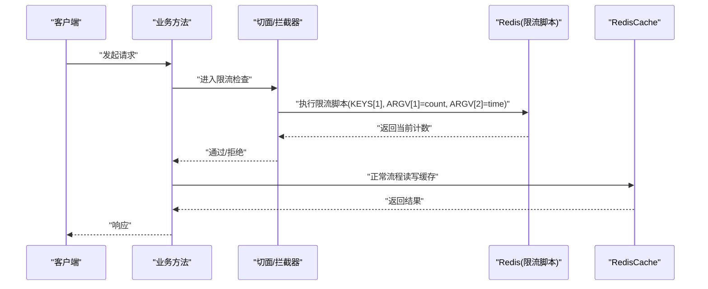
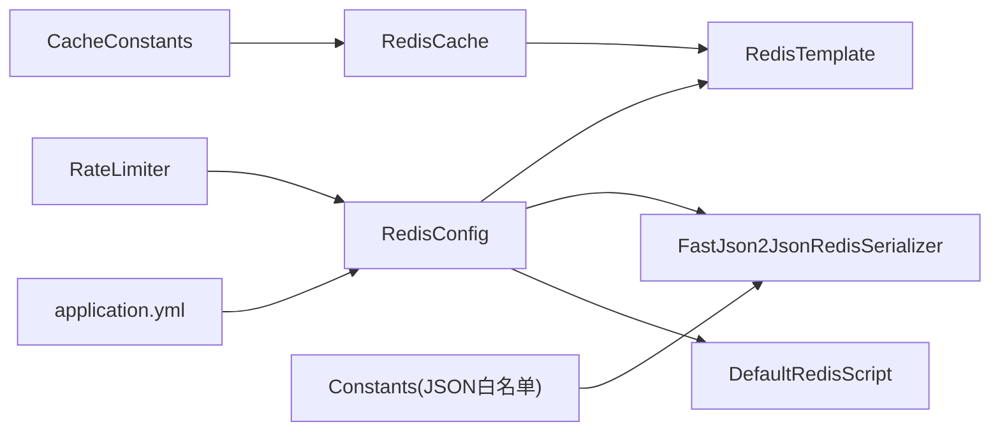

# 缓存Redis配置

<cite>
**本文引用的文件**
- [RedisConfig.java](file://XingChen-Vue/xingchen-framework/src/main/java/com/xingchen/framework/config/RedisConfig.java)
- [FastJson2JsonRedisSerializer.java](file://XingChen-Vue/xingchen-framework/src/main/java/com/xingchen/framework/config/FastJson2JsonRedisSerializer.java)
- [RedisCache.java](file://XingChen-Vue/xingchen-common/src/main/java/com/xingchen/common/core/redis/RedisCache.java)
- [CacheConstants.java](file://XingChen-Vue/xingchen-common/src/main/java/com/xingchen/common/constant/CacheConstants.java)
- [Constants.java](file://XingChen-Vue/xingchen-common/src/main/java/com/xingchen/common/constant/Constants.java)
- [RateLimiter.java](file://XingChen-Vue/xingchen-common/src/main/java/com/xingchen/common/annotation/RateLimiter.java)
- [application.yml](file://XingChen-Vue/xingchen-admin/src/main/resources/application.yml)
</cite>

## 目录
1. [简介](#简介)
2. [项目结构](#项目结构)
3. [核心组件](#核心组件)
4. [架构总览](#架构总览)
5. [详细组件分析](#详细组件分析)
6. [依赖分析](#依赖分析)
7. [性能考虑](#性能考虑)
8. [故障排查指南](#故障排查指南)
9. [结论](#结论)
10. [附录](#附录)

## 简介
本文件系统性梳理健康管理系统中的Redis缓存配置与实现，覆盖连接配置、序列化策略、缓存模板与工具类、注解式限流、分布式缓存策略、缓存键设计原则、过期与内存管理、性能优化与故障排查等内容。目标是帮助开发者快速理解并正确使用Redis缓存能力，确保在高并发场景下具备良好的稳定性与可维护性。

## 项目结构
围绕Redis缓存的关键代码分布在框架配置层与通用工具层：
- 框架配置层：负责Redis连接工厂、RedisTemplate、序列化器与限流脚本的装配
- 通用工具层：提供统一的Redis操作封装，便于业务侧直接使用
- 常量与注解：定义缓存键前缀、JSON白名单、限流注解等

图表来源
- [RedisConfig.java:1-71](file://XingChen-Vue/xingchen-framework/src/main/java/com/xingchen/framework/config/RedisConfig.java#L1-L71)
- [FastJson2JsonRedisSerializer.java:1-53](file://XingChen-Vue/xingchen-framework/src/main/java/com/xingchen/framework/config/FastJson2JsonRedisSerializer.java#L1-L53)
- [RedisCache.java:1-269](file://XingChen-Vue/xingchen-common/src/main/java/com/xingchen/common/core/redis/RedisCache.java#L1-L269)
- [CacheConstants.java:1-45](file://XingChen-Vue/xingchen-common/src/main/java/com/xingchen/common/constant/CacheConstants.java#L1-L45)
- [Constants.java:1-205](file://XingChen-Vue/xingchen-common/src/main/java/com/xingchen/common/constant/Constants.java#L1-L205)
- [RateLimiter.java:1-41](file://XingChen-Vue/xingchen-common/src/main/java/com/xingchen/common/annotation/RateLimiter.java#L1-L41)
- [application.yml:72-94](file://XingChen-Vue/xingchen-admin/src/main/resources/application.yml#L72-L94)

章节来源
- [RedisConfig.java:1-71](file://XingChen-Vue/xingchen-framework/src/main/java/com/xingchen/framework/config/RedisConfig.java#L1-L71)
- [application.yml:72-94](file://XingChen-Vue/xingchen-admin/src/main/resources/application.yml#L72-L94)

## 核心组件
- Redis连接与模板
  - 通过RedisConfig装配RedisTemplate，设置Key/HashKey为字符串序列化，Value/HashValue使用FastJson2序列化器，保证跨语言与类型安全
  - 提供限流Lua脚本Bean，用于基于Lua的原子计数与过期控制
- 自定义序列化器
  - FastJson2JsonRedisSerializer支持写入类名与自动类型过滤，结合Constants中的JSON白名单，降低反序列化风险
- 缓存工具类
  - RedisCache封装了对象、List、Set、Hash等常用数据结构的增删改查与过期设置，提供统一入口
- 缓存键与注解
  - CacheConstants集中定义各类缓存键前缀，避免散落硬编码
  - RateLimiter注解用于方法级限流，结合限流脚本与键前缀实现分布式限流

章节来源
- [RedisConfig.java:22-50](file://XingChen-Vue/xingchen-framework/src/main/java/com/xingchen/framework/config/RedisConfig.java#L22-L50)
- [FastJson2JsonRedisSerializer.java:17-53](file://XingChen-Vue/xingchen-framework/src/main/java/com/xingchen/framework/config/FastJson2JsonRedisSerializer.java#L17-L53)
- [RedisCache.java:23-269](file://XingChen-Vue/xingchen-common/src/main/java/com/xingchen/common/core/redis/RedisCache.java#L23-L269)
- [CacheConstants.java:8-45](file://XingChen-Vue/xingchen-common/src/main/java/com/xingchen/common/constant/CacheConstants.java#L8-L45)
- [RateLimiter.java:19-41](file://XingChen-Vue/xingchen-common/src/main/java/com/xingchen/common/annotation/RateLimiter.java#L19-L41)
- [Constants.java:159-161](file://XingChen-Vue/xingchen-common/src/main/java/com/xingchen/common/constant/Constants.java#L159-L161)

## 架构总览
下图展示Redis配置在系统中的装配与使用关系，以及与业务侧的交互路径。

图表来源
- [RedisConfig.java:22-50](file://XingChen-Vue/xingchen-framework/src/main/java/com/xingchen/framework/config/RedisConfig.java#L22-L50)
- [application.yml:72-94](file://XingChen-Vue/xingchen-admin/src/main/resources/application.yml#L72-L94)
- [RedisCache.java:23-269](file://XingChen-Vue/xingchen-common/src/main/java/com/xingchen/common/core/redis/RedisCache.java#L23-L269)

## 详细组件分析

### RedisTemplate配置与序列化策略
- 连接参数
  - 通过application.yml配置host、port、database、timeout、密码与Lettuce连接池参数，确保连接稳定与资源可控
- 序列化策略
  - Key/HashKey使用字符串序列化，利于键空间查询与运维
  - Value/HashValue使用FastJson2JsonRedisSerializer，开启写入类名与自动类型过滤，结合白名单提升安全性
- 限流脚本
  - 提供限流Lua脚本Bean，实现“计数+过期”的原子操作，避免竞态条件

图表来源
- [RedisConfig.java:22-50](file://XingChen-Vue/xingchen-framework/src/main/java/com/xingchen/framework/config/RedisConfig.java#L22-L50)
- [FastJson2JsonRedisSerializer.java:17-53](file://XingChen-Vue/xingchen-framework/src/main/java/com/xingchen/framework/config/FastJson2JsonRedisSerializer.java#L17-L53)

章节来源
- [application.yml:72-94](file://XingChen-Vue/xingchen-admin/src/main/resources/application.yml#L72-L94)
- [RedisConfig.java:22-50](file://XingChen-Vue/xingchen-framework/src/main/java/com/xingchen/framework/config/RedisConfig.java#L22-L50)
- [FastJson2JsonRedisSerializer.java:17-53](file://XingChen-Vue/xingchen-framework/src/main/java/com/xingchen/framework/config/FastJson2JsonRedisSerializer.java#L17-L53)

### RedisCache缓存管理机制
- 支持的数据结构
  - 基础对象：ValueOperations，支持设置过期时间
  - 列表：ListOperations，支持批量入队
  - 集合：SetOperations，支持去重集合
  - 哈希：HashOperations，支持KV字段存储与批量读取
- 关键能力
  - 过期设置与查询
  - 键存在性判断
  - 模糊匹配查询键集合
  - 删除单键与批量删除

图表来源
- [RedisCache.java:23-269](file://XingChen-Vue/xingchen-common/src/main/java/com/xingchen/common/core/redis/RedisCache.java#L23-L269)

章节来源
- [RedisCache.java:23-269](file://XingChen-Vue/xingchen-common/src/main/java/com/xingchen/common/core/redis/RedisCache.java#L23-L269)

### 分布式缓存策略与注解限流
- 缓存键设计原则
  - 使用CacheConstants集中定义前缀，避免散落硬编码
  - 前缀区分业务域（登录、验证码、字典、参数、防重、限流、密码错误等）
- 限流注解与脚本
  - RateLimiter注解提供key、time、count、limitType四个维度的限流配置
  - RedisConfig提供限流脚本Bean，实现原子计数与过期控制
- 缓存穿透与缓存雪崩
  - 缓存穿透：对不存在的键设置短 TTL 的空值兜底，或使用布隆过滤器（建议在上层网关或业务层引入）
  - 缓存雪崩：为热点键增加随机抖动TTL，避免同时过期；降级非关键路径或启用本地缓存兜底

图表来源
- [RateLimiter.java:19-41](file://XingChen-Vue/xingchen-common/src/main/java/com/xingchen/common/annotation/RateLimiter.java#L19-L41)
- [RedisConfig.java:43-70](file://XingChen-Vue/xingchen-framework/src/main/java/com/xingchen/framework/config/RedisConfig.java#L43-L70)
- [RedisCache.java:23-269](file://XingChen-Vue/xingchen-common/src/main/java/com/xingchen/common/core/redis/RedisCache.java#L23-L269)

章节来源
- [CacheConstants.java:8-45](file://XingChen-Vue/xingchen-common/src/main/java/com/xingchen/common/constant/CacheConstants.java#L8-L45)
- [RateLimiter.java:19-41](file://XingChen-Vue/xingchen-common/src/main/java/com/xingchen/common/annotation/RateLimiter.java#L19-L41)
- [RedisConfig.java:43-70](file://XingChen-Vue/xingchen-framework/src/main/java/com/xingchen/framework/config/RedisConfig.java#L43-L70)

### 缓存键设计原则、过期策略与内存管理
- 键设计原则
  - 前缀语义化：login_tokens、sys_dict、sys_config、rate_limit等
  - 命名一致性：统一使用冒号分隔，避免多级目录
  - 作用域隔离：按业务域与租户维度扩展
- 过期策略
  - 登录令牌：结合JWT过期时间与Redis TTL，建议设置较短TTL并配合刷新
  - 验证码：固定短期TTL（如分钟级）
  - 字典/参数：变更时主动失效或设置合理TTL
- 内存管理
  - 合理设置连接池参数，避免连接泄漏
  - 使用哈希与集合存储聚合数据，减少键数量
  - 定期清理过期键，监控内存使用

章节来源
- [CacheConstants.java:8-45](file://XingChen-Vue/xingchen-common/src/main/java/com/xingchen/common/constant/CacheConstants.java#L8-L45)
- [application.yml:72-94](file://XingChen-Vue/xingchen-admin/src/main/resources/application.yml#L72-L94)

## 依赖分析
- 组件耦合
  - RedisConfig对RedisTemplate进行集中装配，耦合度低，易于替换序列化器或脚本
  - RedisCache依赖RedisTemplate，提供业务友好的API，降低重复代码
  - RateLimiter注解与RedisConfig的限流脚本配合，形成声明式限流
- 外部依赖
  - Spring Data Redis、Lettuce连接池、FastJSON2序列化库
  - application.yml中的Redis连接参数影响可用性与性能

图表来源
- [RedisConfig.java:22-50](file://XingChen-Vue/xingchen-framework/src/main/java/com/xingchen/framework/config/RedisConfig.java#L22-L50)
- [RedisCache.java:23-269](file://XingChen-Vue/xingchen-common/src/main/java/com/xingchen/common/core/redis/RedisCache.java#L23-L269)
- [CacheConstants.java:8-45](file://XingChen-Vue/xingchen-common/src/main/java/com/xingchen/common/constant/CacheConstants.java#L8-L45)
- [Constants.java:159-161](file://XingChen-Vue/xingchen-common/src/main/java/com/xingchen/common/constant/Constants.java#L159-L161)
- [RateLimiter.java:19-41](file://XingChen-Vue/xingchen-common/src/main/java/com/xingchen/common/annotation/RateLimiter.java#L19-L41)
- [application.yml:72-94](file://XingChen-Vue/xingchen-admin/src/main/resources/application.yml#L72-L94)

## 性能考虑
- 连接池参数
  - 根据QPS与实例规格调整max-active、max-idle、min-idle与max-wait，避免阻塞与资源耗尽
- 序列化开销
  - 使用二进制序列化（如JSON）时注意字段数量与嵌套深度，必要时拆分键值或压缩
- 命令批量化
  - 使用mget/mset、pipeline减少RTT
- 过期策略
  - 为热点键设置随机抖动TTL，避免同时过期
- 读写分离与分片
  - 在高并发场景下考虑多实例与分片策略（需结合业务模型）

## 故障排查指南
- 连接失败
  - 检查host/port/password/database与timeout配置是否正确
  - 查看连接池状态与最大等待时间
- 反序列化异常
  - 确认FastJSON2白名单配置与写入类名一致
  - 核对序列化版本兼容性
- 限流误判
  - 检查限流脚本执行结果与KEYS/ARGV参数
  - 核对限流键前缀与业务维度
- 缓存穿透/雪崩
  - 对不存在键设置短TTL空值兜底
  - 为热点键增加随机抖动TTL
  - 引入本地缓存或降级策略

章节来源
- [application.yml:72-94](file://XingChen-Vue/xingchen-admin/src/main/resources/application.yml#L72-L94)
- [FastJson2JsonRedisSerializer.java:17-53](file://XingChen-Vue/xingchen-framework/src/main/java/com/xingchen/framework/config/FastJson2JsonRedisSerializer.java#L17-L53)
- [RedisConfig.java:43-70](file://XingChen-Vue/xingchen-framework/src/main/java/com/xingchen/framework/config/RedisConfig.java#L43-L70)

## 结论
该系统的Redis缓存配置以RedisTemplate为核心，结合自定义FastJSON2序列化器与限流脚本，提供了安全、高效且易用的缓存能力。通过集中化的缓存键前缀与统一的缓存工具类，业务侧可以以较低成本实现多样化的缓存策略。建议在生产环境中进一步完善分布式限流、缓存穿透与雪崩防护，并持续优化连接池与序列化策略以获得更佳性能。

## 附录
- 常用配置项参考
  - Redis连接：host、port、database、password、timeout
  - 连接池：max-active、max-idle、min-idle、max-wait
- 建议实践
  - 为不同业务域设置独立前缀与TTL策略
  - 对高频读写键采用随机抖动TTL
  - 定期巡检键空间与内存占用