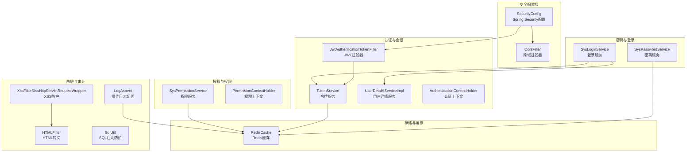
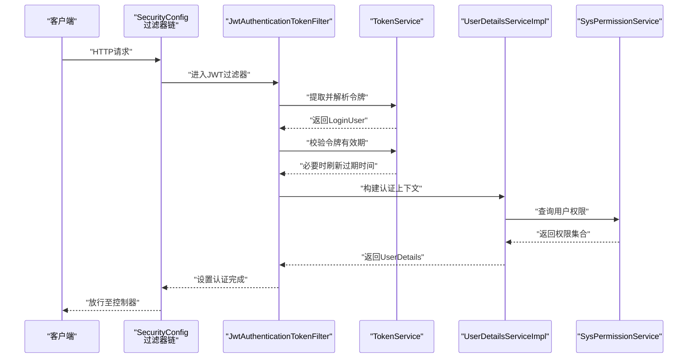
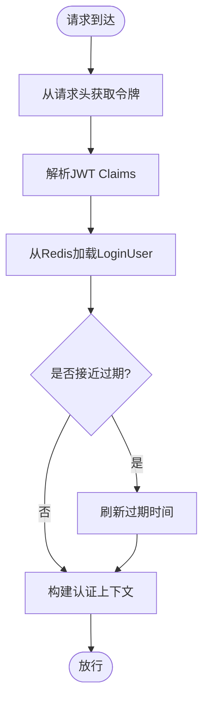
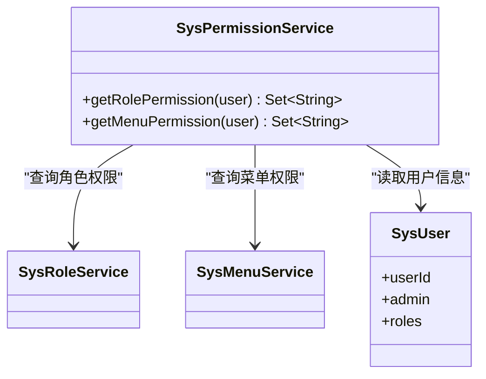
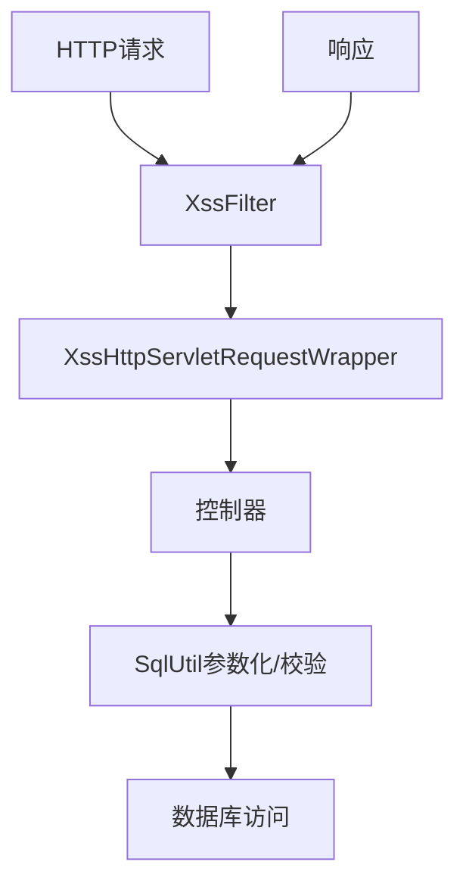
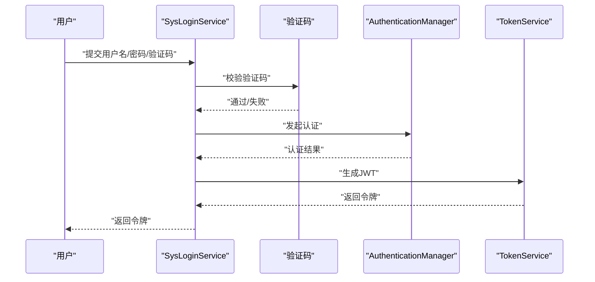
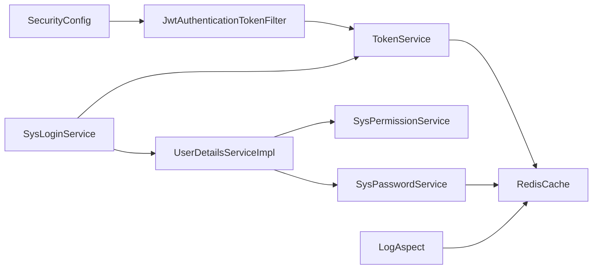

# 安全架构设计

<cite>
**本文引用的文件**
- [SecurityConfig.java](file://XingChen-Vue/xingchen-framework/src/main/java/com/xingchen/framework/config/SecurityConfig.java)
- [JwtAuthenticationTokenFilter.java](file://XingChen-Vue/xingchen-framework/src/main/java/com/xingchen/framework/security/filter/JwtAuthenticationTokenFilter.java)
- [TokenService.java](file://XingChen-Vue/xingchen-framework/src/main/java/com/xingchen/framework/web/service/TokenService.java)
- [UserDetailsServiceImpl.java](file://XingChen-Vue/xingchen-framework/src/main/java/com/xingchen/framework/web/service/UserDetailsServiceImpl.java)
- [SysLoginService.java](file://XingChen-Vue/xingchen-framework/src/main/java/com/xingchen/framework/web/service/SysLoginService.java)
- [SysPasswordService.java](file://XingChen-Vue/xingchen-framework/src/main/java/com/xingchen/framework/web/service/SysPasswordService.java)
- [SysPermissionService.java](file://XingChen-Vue/xingchen-framework/src/main/java/com/xingchen/framework/web/service/SysPermissionService.java)
- [AuthenticationContextHolder.java](file://XingChen-Vue/xingchen-framework/src/main/java/com/xingchen/framework/security/context/AuthenticationContextHolder.java)
- [PermissionContextHolder.java](file://XingChen-Vue/xingchen-framework/src/main/java/com/xingchen/framework/security/context/PermissionContextHolder.java)
- [LogAspect.java](file://XingChen-Vue/xingchen-framework/src/main/java/com/xingchen/framework/aspectj/LogAspect.java)
- [XssFilter.java](file://XingChen-Vue/xingchen-common/src/main/java/com/xingchen/common/filter/XssFilter.java)
- [XssHttpServletRequestWrapper.java](file://XingChen-Vue/xingchen-common/src/main/java/com/xingchen/common/filter/XssHttpServletRequestWrapper.java)
- [HTMLFilter.java](file://XingChen-Vue/xingchen-common/src/main/java/com/xingchen/common/utils/html/HTMLFilter.java)
- [SqlUtil.java](file://XingChen-Vue/xingchen-common/src/main/java/com/xingchen/common/utils/sql/SqlUtil.java)
- [application.yml](file://XingChen-Vue/xingchen-admin/src/main/resources/application.yml)
- [RedisCache.java](file://XingChen-Vue/xingchen-common/src/main/java/com/xingchen/common/core/redis/RedisCache.java)
</cite>

## 目录
1. [引言](#引言)
2. [项目结构](#项目结构)
3. [核心组件](#核心组件)
4. [架构总览](#架构总览)
5. [详细组件分析](#详细组件分析)
6. [依赖分析](#依赖分析)
7. [性能考虑](#性能考虑)
8. [故障排查指南](#故障排查指南)
9. [结论](#结论)
10. [附录](#附录)

## 引言
本文件系统性梳理健康管理系统在Spring Security框架下的安全架构设计，重点覆盖以下方面：
- JWT Token认证机制与会话管理策略
- RBAC权限控制模型与权限注解使用
- 多层安全防护体系：XSS、SQL注入、CSRF等
- 用户密码加密策略与登录防护
- 日志审计、操作追踪与安全事件监控
- 安全配置最佳实践与漏洞防护指导

## 项目结构
后端采用分层架构，安全相关能力主要集中在framework模块（配置、过滤器、服务）与common模块（工具、过滤器、常量）：
- framework/config：Spring Security全局配置
- framework/security/filter：JWT过滤器链
- framework/web/service：认证、授权、密码、权限服务
- framework/aspectj：操作日志切面
- common/filter：XSS过滤器与包装器
- common/utils/html：HTML转义工具
- common/utils/sql：SQL注入防护工具
- common/core/redis：Redis缓存封装

图表来源
- [SecurityConfig.java:85-118](file://XingChen-Vue/xingchen-framework/src/main/java/com/xingchen/framework/config/SecurityConfig.java#L85-L118)
- [JwtAuthenticationTokenFilter.java:30-43](file://XingChen-Vue/xingchen-framework/src/main/java/com/xingchen/framework/security/filter/JwtAuthenticationTokenFilter.java#L30-L43)
- [TokenService.java:62-83](file://XingChen-Vue/xingchen-framework/src/main/java/com/xingchen/framework/web/service/TokenService.java#L62-L83)
- [UserDetailsServiceImpl.java:37-60](file://XingChen-Vue/xingchen-framework/src/main/java/com/xingchen/framework/web/service/UserDetailsServiceImpl.java#L37-L60)
- [SysLoginService.java:63-100](file://XingChen-Vue/xingchen-framework/src/main/java/com/xingchen/framework/web/service/SysLoginService.java#L63-L100)
- [SysPasswordService.java:44-77](file://XingChen-Vue/xingchen-framework/src/main/java/com/xingchen/framework/web/service/SysPasswordService.java#L44-L77)
- [SysPermissionService.java:37-88](file://XingChen-Vue/xingchen-framework/src/main/java/com/xingchen/framework/web/service/SysPermissionService.java#L37-L88)
- [XssFilter.java](file://XingChen-Vue/xingchen-common/src/main/java/com/xingchen/common/filter/XssFilter.java)
- [XssHttpServletRequestWrapper.java](file://XingChen-Vue/xingchen-common/src/main/java/com/xingchen/common/filter/XssHttpServletRequestWrapper.java)
- [HTMLFilter.java](file://XingChen-Vue/xingchen-common/src/main/java/com/xingchen/common/utils/html/HTMLFilter.java)
- [SqlUtil.java](file://XingChen-Vue/xingchen-common/src/main/java/com/xingchen/common/utils/sql/SqlUtil.java)
- [LogAspect.java:88-140](file://XingChen-Vue/xingchen-framework/src/main/java/com/xingchen/framework/aspectj/LogAspect.java#L88-L140)
- [RedisCache.java](file://XingChen-Vue/xingchen-common/src/main/java/com/xingchen/common/core/redis/RedisCache.java)

章节来源
- [SecurityConfig.java:27-128](file://XingChen-Vue/xingchen-framework/src/main/java/com/xingchen/framework/config/SecurityConfig.java#L27-L128)

## 核心组件
- Spring Security全局配置：禁用CSRF、基于状态的无状态会话、统一异常处理、CORS集成、JWT过滤器链注册、匿名放行URL配置。
- JWT认证过滤器：从请求头解析令牌，解析用户信息，校验令牌有效期并在必要时刷新，构建认证上下文。
- 令牌服务：令牌签发、解析、刷新、用户代理与地理位置信息注入、Redis缓存管理。
- 用户详情服务：加载用户、状态校验、密码校验、权限装配。
- 登录服务：验证码校验、前置校验、认证流程、登录成功后的令牌生成与登录信息记录。
- 密码服务：密码匹配、重试次数限制、锁定时间、缓存清理。
- 权限服务：基于角色与菜单的RBAC权限计算，管理员特殊权限处理。
- XSS防护：过滤器与请求包装器，HTML转义工具。
- SQL注入防护：SQL工具类进行参数化与白名单校验。
- 操作日志切面：环绕通知记录操作日志，排除敏感字段，异步落库。

章节来源
- [SecurityConfig.java:85-118](file://XingChen-Vue/xingchen-framework/src/main/java/com/xingchen/framework/config/SecurityConfig.java#L85-L118)
- [JwtAuthenticationTokenFilter.java:30-43](file://XingChen-Vue/xingchen-framework/src/main/java/com/xingchen/framework/security/filter/JwtAuthenticationTokenFilter.java#L30-L43)
- [TokenService.java:62-155](file://XingChen-Vue/xingchen-framework/src/main/java/com/xingchen/framework/web/service/TokenService.java#L62-L155)
- [UserDetailsServiceImpl.java:37-65](file://XingChen-Vue/xingchen-framework/src/main/java/com/xingchen/framework/web/service/UserDetailsServiceImpl.java#L37-L65)
- [SysLoginService.java:63-100](file://XingChen-Vue/xingchen-framework/src/main/java/com/xingchen/framework/web/service/SysLoginService.java#L63-L100)
- [SysPasswordService.java:44-85](file://XingChen-Vue/xingchen-framework/src/main/java/com/xingchen/framework/web/service/SysPasswordService.java#L44-L85)
- [SysPermissionService.java:37-88](file://XingChen-Vue/xingchen-framework/src/main/java/com/xingchen/framework/web/service/SysPermissionService.java#L37-L88)
- [XssFilter.java](file://XingChen-Vue/xingchen-common/src/main/java/com/xingchen/common/filter/XssFilter.java)
- [XssHttpServletRequestWrapper.java](file://XingChen-Vue/xingchen-common/src/main/java/com/xingchen/common/filter/XssHttpServletRequestWrapper.java)
- [HTMLFilter.java](file://XingChen-Vue/xingchen-common/src/main/java/com/xingchen/common/utils/html/HTMLFilter.java)
- [SqlUtil.java](file://XingChen-Vue/xingchen-common/src/main/java/com/xingchen/common/utils/sql/SqlUtil.java)
- [LogAspect.java:88-140](file://XingChen-Vue/xingchen-framework/src/main/java/com/xingchen/framework/aspectj/LogAspect.java#L88-L140)

## 架构总览
系统采用“无状态+令牌”的认证模式，结合RBAC权限模型与多层防护，形成完整的安全闭环。

图表来源
- [SecurityConfig.java:85-118](file://XingChen-Vue/xingchen-framework/src/main/java/com/xingchen/framework/config/SecurityConfig.java#L85-L118)
- [JwtAuthenticationTokenFilter.java:30-43](file://XingChen-Vue/xingchen-framework/src/main/java/com/xingchen/framework/security/filter/JwtAuthenticationTokenFilter.java#L30-L43)
- [TokenService.java:62-155](file://XingChen-Vue/xingchen-framework/src/main/java/com/xingchen/framework/web/service/TokenService.java#L62-L155)
- [UserDetailsServiceImpl.java:37-65](file://XingChen-Vue/xingchen-framework/src/main/java/com/xingchen/framework/web/service/UserDetailsServiceImpl.java#L37-L65)
- [SysPermissionService.java:37-88](file://XingChen-Vue/xingchen-framework/src/main/java/com/xingchen/framework/web/service/SysPermissionService.java#L37-L88)

## 详细组件分析

### JWT认证机制与会话管理
- 令牌签发：服务端生成唯一令牌标识，写入LoginUser并签名，同时将用户对象缓存至Redis，设置过期时间。
- 令牌解析：从请求头读取令牌，去除前缀，解析Claims，根据uuid定位Redis中的用户缓存。
- 有效期校验与续期：当剩余有效期小于阈值时自动刷新，避免频繁重新登录。
- 会话策略：禁用Session，采用STATELESS策略，配合JWT实现无状态认证。

图表来源
- [TokenService.java:62-155](file://XingChen-Vue/xingchen-framework/src/main/java/com/xingchen/framework/web/service/TokenService.java#L62-L155)
- [JwtAuthenticationTokenFilter.java:30-43](file://XingChen-Vue/xingchen-framework/src/main/java/com/xingchen/framework/security/filter/JwtAuthenticationTokenFilter.java#L30-L43)

章节来源
- [TokenService.java:62-233](file://XingChen-Vue/xingchen-framework/src/main/java/com/xingchen/framework/web/service/TokenService.java#L62-L233)
- [JwtAuthenticationTokenFilter.java:30-43](file://XingChen-Vue/xingchen-framework/src/main/java/com/xingchen/framework/security/filter/JwtAuthenticationTokenFilter.java#L30-L43)

### RBAC权限控制模型
- 角色权限：管理员拥有超级权限，普通用户按角色查询权限集合。
- 菜单权限：管理员拥有全部菜单权限，普通用户按角色或直接查询菜单权限集合。
- 权限注解：启用方法级安全注解，支持@PreAuthorize、@PostAuthorize、@Secured等。

图表来源
- [SysPermissionService.java:37-88](file://XingChen-Vue/xingchen-framework/src/main/java/com/xingchen/framework/web/service/SysPermissionService.java#L37-L88)

章节来源
- [SysPermissionService.java:37-88](file://XingChen-Vue/xingchen-framework/src/main/java/com/xingchen/framework/web/service/SysPermissionService.java#L37-L88)
- [SecurityConfig.java:27](file://XingChen-Vue/xingchen-framework/src/main/java/com/xingchen/framework/config/SecurityConfig.java#L27)

### 多层安全防护体系
- XSS防护：XssFilter拦截请求，XssHttpServletRequestWrapper包装请求参数，HTMLFilter提供HTML转义工具，统一阻断恶意脚本。
- SQL注入防护：SqlUtil对输入进行白名单与参数化处理，避免动态拼接SQL。
- CSRF防护：禁用CSRF，采用JWT无状态认证，降低CSRF风险；同时通过CORS与Referer策略增强防护。

图表来源
- [XssFilter.java](file://XingChen-Vue/xingchen-common/src/main/java/com/xingchen/common/filter/XssFilter.java)
- [XssHttpServletRequestWrapper.java](file://XingChen-Vue/xingchen-common/src/main/java/com/xingchen/common/filter/XssHttpServletRequestWrapper.java)
- [HTMLFilter.java](file://XingChen-Vue/xingchen-common/src/main/java/com/xingchen/common/utils/html/HTMLFilter.java)
- [SqlUtil.java](file://XingChen-Vue/xingchen-common/src/main/java/com/xingchen/common/utils/sql/SqlUtil.java)

章节来源
- [XssFilter.java](file://XingChen-Vue/xingchen-common/src/main/java/com/xingchen/common/filter/XssFilter.java)
- [XssHttpServletRequestWrapper.java](file://XingChen-Vue/xingchen-common/src/main/java/com/xingchen/common/filter/XssHttpServletRequestWrapper.java)
- [HTMLFilter.java](file://XingChen-Vue/xingchen-common/src/main/java/com/xingchen/common/utils/html/HTMLFilter.java)
- [SqlUtil.java](file://XingChen-Vue/xingchen-common/src/main/java/com/xingchen/common/utils/sql/SqlUtil.java)
- [SecurityConfig.java:89-90](file://XingChen-Vue/xingchen-framework/src/main/java/com/xingchen/framework/config/SecurityConfig.java#L89-L90)

### 用户密码加密策略与登录防护
- 密码加密：使用BCrypt强散列算法，确保不可逆加密与加盐存储。
- 登录校验：验证码开关、前置校验（长度范围）、黑名单IP校验、失败重试次数限制与锁定时间。
- 登录流程：验证码校验→前置校验→认证→记录登录日志→生成JWT→更新登录信息。

图表来源
- [SysLoginService.java:63-100](file://XingChen-Vue/xingchen-framework/src/main/java/com/xingchen/framework/web/service/SysLoginService.java#L63-L100)
- [SysPasswordService.java:44-85](file://XingChen-Vue/xingchen-framework/src/main/java/com/xingchen/framework/web/service/SysPasswordService.java#L44-L85)
- [SecurityConfig.java:123-127](file://XingChen-Vue/xingchen-framework/src/main/java/com/xingchen/framework/config/SecurityConfig.java#L123-L127)

章节来源
- [SysLoginService.java:63-177](file://XingChen-Vue/xingchen-framework/src/main/java/com/xingchen/framework/web/service/SysLoginService.java#L63-L177)
- [SysPasswordService.java:44-85](file://XingChen-Vue/xingchen-framework/src/main/java/com/xingchen/framework/web/service/SysPasswordService.java#L44-L85)
- [SecurityConfig.java:123-127](file://XingChen-Vue/xingchen-framework/src/main/java/com/xingchen/framework/config/SecurityConfig.java#L123-L127)

### 权限注解使用与上下文管理
- 方法级安全：启用@EnableMethodSecurity，支持@PreAuthorize、@PostAuthorize、@Secured等注解。
- 认证上下文：AuthenticationContextHolder在线程级别保存认证信息，便于业务层获取当前用户。
- 权限上下文：PermissionContextHolder在请求作用域保存权限字符串，便于切面与业务使用。

章节来源
- [SecurityConfig.java:27](file://XingChen-Vue/xingchen-framework/src/main/java/com/xingchen/framework/config/SecurityConfig.java#L27)
- [AuthenticationContextHolder.java:10-28](file://XingChen-Vue/xingchen-framework/src/main/java/com/xingchen/framework/security/context/AuthenticationContextHolder.java#L10-L28)
- [PermissionContextHolder.java:12-27](file://XingChen-Vue/xingchen-framework/src/main/java/com/xingchen/framework/security/context/PermissionContextHolder.java#L12-L27)

### 日志审计、操作追踪与安全事件监控
- 操作日志：LogAspect环绕通知，记录请求/响应、异常、耗时、用户信息、部门信息等，异步写入数据库。
- 敏感字段过滤：排除password、confirmPassword等敏感字段，防止泄露。
- 登录事件：登录成功/失败、验证码错误/过期、黑名单拦截等事件异步记录。

章节来源
- [LogAspect.java:88-140](file://XingChen-Vue/xingchen-framework/src/main/java/com/xingchen/framework/aspectj/LogAspect.java#L88-L140)
- [SysLoginService.java:82-95](file://XingChen-Vue/xingchen-framework/src/main/java/com/xingchen/framework/web/service/SysLoginService.java#L82-L95)

## 依赖分析
- 组件耦合：SecurityConfig集中配置过滤器链；JwtAuthenticationTokenFilter依赖TokenService；UserDetailsServiceImpl依赖SysPermissionService与SysPasswordService；SysLoginService贯穿认证与令牌生成。
- 外部依赖：RedisCache用于令牌与验证码、密码错误计数等缓存；BCryptPasswordEncoder用于密码加密。
- 循环依赖：未发现循环依赖，职责清晰。

图表来源
- [SecurityConfig.java:85-118](file://XingChen-Vue/xingchen-framework/src/main/java/com/xingchen/framework/config/SecurityConfig.java#L85-L118)
- [JwtAuthenticationTokenFilter.java:27-28](file://XingChen-Vue/xingchen-framework/src/main/java/com/xingchen/framework/security/filter/JwtAuthenticationTokenFilter.java#L27-L28)
- [TokenService.java:54-55](file://XingChen-Vue/xingchen-framework/src/main/java/com/xingchen/framework/web/service/TokenService.java#L54-L55)
- [SysLoginService.java:39-49](file://XingChen-Vue/xingchen-framework/src/main/java/com/xingchen/framework/web/service/SysLoginService.java#L39-L49)
- [UserDetailsServiceImpl.java:28-35](file://XingChen-Vue/xingchen-framework/src/main/java/com/xingchen/framework/web/service/UserDetailsServiceImpl.java#L28-L35)
- [SysPermissionService.java:25-29](file://XingChen-Vue/xingchen-framework/src/main/java/com/xingchen/framework/web/service/SysPermissionService.java#L25-L29)
- [SysPasswordService.java:24-25](file://XingChen-Vue/xingchen-framework/src/main/java/com/xingchen/framework/web/service/SysPasswordService.java#L24-L25)
- [LogAspect.java:32-34](file://XingChen-Vue/xingchen-framework/src/main/java/com/xingchen/framework/aspectj/LogAspect.java#L32-L34)

章节来源
- [SecurityConfig.java:85-118](file://XingChen-Vue/xingchen-framework/src/main/java/com/xingchen/framework/config/SecurityConfig.java#L85-L118)
- [TokenService.java:54-55](file://XingChen-Vue/xingchen-framework/src/main/java/com/xingchen/framework/web/service/TokenService.java#L54-L55)
- [SysLoginService.java:39-49](file://XingChen-Vue/xingchen-framework/src/main/java/com/xingchen/framework/web/service/SysLoginService.java#L39-L49)
- [UserDetailsServiceImpl.java:28-35](file://XingChen-Vue/xingchen-framework/src/main/java/com/xingchen/framework/web/service/UserDetailsServiceImpl.java#L28-L35)
- [SysPermissionService.java:25-29](file://XingChen-Vue/xingchen-framework/src/main/java/com/xingchen/framework/web/service/SysPermissionService.java#L25-L29)
- [SysPasswordService.java:24-25](file://XingChen-Vue/xingchen-framework/src/main/java/com/xingchen/framework/web/service/SysPasswordService.java#L24-L25)
- [LogAspect.java:32-34](file://XingChen-Vue/xingchen-framework/src/main/java/com/xingchen/framework/aspectj/LogAspect.java#L32-L34)

## 性能考虑
- 无状态认证：避免Session存储，降低服务器内存压力。
- Redis缓存：令牌与验证码、密码错误计数均缓存，减少数据库压力；合理设置过期时间与容量。
- 过期续期：临近过期自动刷新，降低频繁登录带来的抖动。
- 异步日志：操作日志异步写库，避免阻塞主流程。
- 过滤器顺序：CORS在JWT之前，减少无效请求对认证链路的压力。

## 故障排查指南
- 认证失败
  - 检查请求头是否包含正确的令牌前缀与格式。
  - 核对令牌签名密钥与过期时间配置。
  - 查看Redis中是否存在对应uuid的用户缓存。
- 权限不足
  - 确认用户角色与菜单权限是否正确配置。
  - 检查方法级注解使用是否正确。
- 登录失败
  - 验证码是否开启、是否过期、是否匹配。
  - 黑名单IP策略是否触发。
  - 密码重试次数是否达到上限。
- XSS/SQL注入
  - 检查XssFilter与XssHttpServletRequestWrapper是否生效。
  - 核对SqlUtil参数化逻辑与白名单规则。

章节来源
- [TokenService.java:62-83](file://XingChen-Vue/xingchen-framework/src/main/java/com/xingchen/framework/web/service/TokenService.java#L62-L83)
- [SysLoginService.java:110-165](file://XingChen-Vue/xingchen-framework/src/main/java/com/xingchen/framework/web/service/SysLoginService.java#L110-L165)
- [SysPasswordService.java:44-85](file://XingChen-Vue/xingchen-framework/src/main/java/com/xingchen/framework/web/service/SysPasswordService.java#L44-L85)
- [XssFilter.java](file://XingChen-Vue/xingchen-common/src/main/java/com/xingchen/common/filter/XssFilter.java)
- [SqlUtil.java](file://XingChen-Vue/xingchen-common/src/main/java/com/xingchen/common/utils/sql/SqlUtil.java)

## 结论
本系统通过“JWT + RBAC + 多层防护 + 异步审计”的组合，构建了高可用、可扩展且符合安全规范的后端安全架构。建议持续关注令牌密钥轮换、Redis高可用、日志指标化与告警体系建设，以进一步提升整体安全性与可观测性。

## 附录
- 安全配置最佳实践
  - 使用HTTPS传输，严格管理JWT密钥与过期时间。
  - 启用CORS白名单，避免通配符暴露。
  - 对高频接口启用限流与重复提交拦截。
  - 定期轮换密钥，监控异常登录与暴力破解行为。
- 漏洞防护指导
  - XSS：统一使用XSS过滤与HTML转义，禁止内联脚本。
  - SQL注入：严格参数化查询，避免动态拼接SQL。
  - CSRF：无状态认证已降低风险，仍需配合CORS与Referer策略。
  - 信息泄露：敏感字段在日志与响应中脱敏处理。