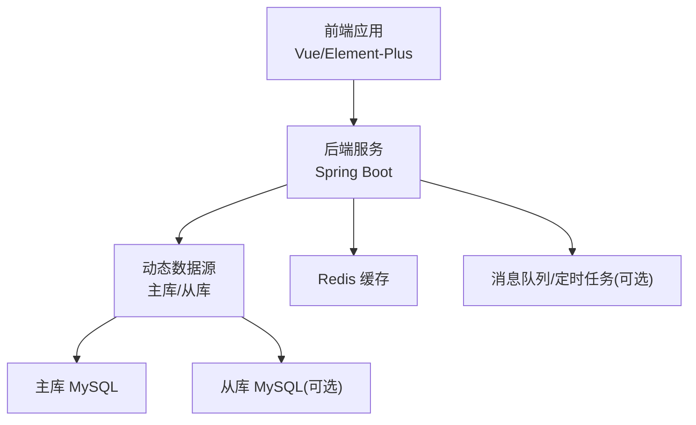
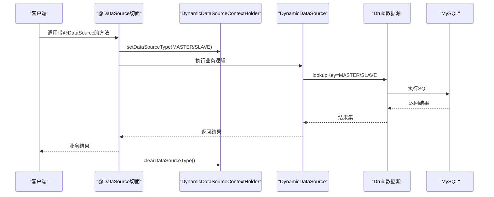
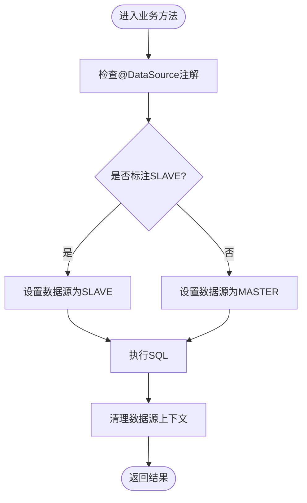
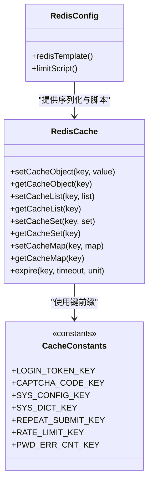
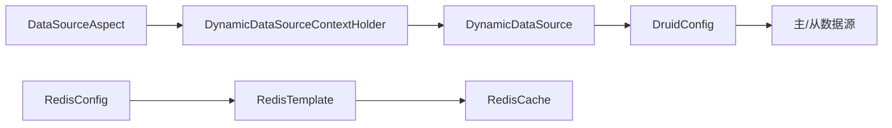

# 数据架构设计

<cite>
**本文引用的文件**
- [application.yml](file://XingChen-Vue/xingchen-admin/src/main/resources/application.yml)
- [application-druid.yml](file://XingChen-Vue/xingchen-admin/src/main/resources/application-druid.yml)
- [DruidConfig.java](file://XingChen-Vue/xingchen-framework/src/main/java/com/xingchen/framework/config/DruidConfig.java)
- [MyBatisConfig.java](file://XingChen-Vue/xingchen-framework/src/main/java/com/xingchen/framework/config/MyBatisConfig.java)
- [RedisConfig.java](file://XingChen-Vue/xingchen-framework/src/main/java/com/xingchen/framework/config/RedisConfig.java)
- [DynamicDataSource.java](file://XingChen-Vue/xingchen-framework/src/main/java/com/xingchen/framework/datasource/DynamicDataSource.java)
- [DynamicDataSourceContextHolder.java](file://XingChen-Vue/xingchen-framework/src/main/java/com/xingchen/framework/datasource/DynamicDataSourceContextHolder.java)
- [DataSourceAspect.java](file://XingChen-Vue/xingchen-framework/src/main/java/com/xingchen/framework/aspectj/DataSourceAspect.java)
- [DataSource.java](file://XingChen-Vue/xingchen-common/src/main/java/com/xingchen/common/annotation/DataSource.java)
- [DataSourceType.java](file://XingChen-Vue/xingchen-common/src/main/java/com/xingchen/common/enums/DataSourceType.java)
- [RedisCache.java](file://XingChen-Vue/xingchen-common/src/main/java/com/xingchen/common/core/redis/RedisCache.java)
- [CacheConstants.java](file://XingChen-Vue/xingchen-common/src/main/java/com/xingchen/common/constant/CacheConstants.java)
- [ry_20260321.sql](file://XingChen-Vue/sql/ry_20260321.sql)
</cite>

## 目录
1. [简介](#简介)
2. [项目结构](#项目结构)
3. [核心组件](#核心组件)
4. [架构总览](#架构总览)
5. [详细组件分析](#详细组件分析)
6. [依赖分析](#依赖分析)
7. [性能考虑](#性能考虑)
8. [故障排查指南](#故障排查指南)
9. [结论](#结论)
10. [附录](#附录)

## 简介
本文件面向“健康管理平台”的数据架构设计，围绕数据库设计模式、主从与读写分离、分布式事务、缓存策略、Redis集群与一致性、数据迁移与版本管理、备份恢复、数据流与存储架构以及监控与故障排查等方面进行系统化梳理。文档基于仓库现有配置与代码实现进行分析，并提供可落地的优化建议与可视化图示。

## 项目结构
项目采用前后端分离架构，后端基于Spring Boot + MyBatis，通过Druid连接池与动态数据源实现主从读写分离；缓存采用Redis并提供统一的RedisCache封装；数据库初始化脚本位于sql目录。

图表来源
- [application.yml:16-148](file://XingChen-Vue/xingchen-admin/src/main/resources/application.yml#L16-L148)
- [application-druid.yml:1-61](file://XingChen-Vue/xingchen-admin/src/main/resources/application-druid.yml#L1-L61)
- [DruidConfig.java:32-127](file://XingChen-Vue/xingchen-framework/src/main/java/com/xingchen/framework/config/DruidConfig.java#L32-L127)
- [RedisConfig.java:17-71](file://XingChen-Vue/xingchen-framework/src/main/java/com/xingchen/framework/config/RedisConfig.java#L17-L71)

章节来源
- [application.yml:16-148](file://XingChen-Vue/xingchen-admin/src/main/resources/application.yml#L16-L148)
- [application-druid.yml:1-61](file://XingChen-Vue/xingchen-admin/src/main/resources/application-druid.yml#L1-L61)

## 核心组件
- 动态数据源与读写分离
  - 通过DruidConfig装配主库与可选从库，DynamicDataSource根据上下文路由至不同数据源。
  - DataSourceAspect结合@DataSource注解实现方法级主从切换。
- 缓存层
  - RedisConfig提供序列化与脚本支持；RedisCache封装常用KV/List/Set/Hash操作。
- ORM与SQL映射
  - MyBatisConfig集中配置别名包与Mapper扫描路径，配合application.yml中的MyBatis配置。

章节来源
- [DruidConfig.java:32-127](file://XingChen-Vue/xingchen-framework/src/main/java/com/xingchen/framework/config/DruidConfig.java#L32-L127)
- [DynamicDataSource.java:12-26](file://XingChen-Vue/xingchen-framework/src/main/java/com/xingchen/framework/datasource/DynamicDataSource.java#L12-L26)
- [DynamicDataSourceContextHolder.java:11-46](file://XingChen-Vue/xingchen-framework/src/main/java/com/xingchen/framework/datasource/DynamicDataSourceContextHolder.java#L11-L46)
- [DataSourceAspect.java:26-73](file://XingChen-Vue/xingchen-framework/src/main/java/com/xingchen/framework/aspectj/DataSourceAspect.java#L26-L73)
- [DataSource.java:22-29](file://XingChen-Vue/xingchen-common/src/main/java/com/xingchen/common/annotation/DataSource.java#L22-L29)
- [DataSourceType.java:8-20](file://XingChen-Vue/xingchen-common/src/main/java/com/xingchen/common/enums/DataSourceType.java#L8-L20)
- [MyBatisConfig.java:32-132](file://XingChen-Vue/xingchen-framework/src/main/java/com/xingchen/framework/config/MyBatisConfig.java#L32-L132)
- [RedisConfig.java:17-71](file://XingChen-Vue/xingchen-framework/src/main/java/com/xingchen/framework/config/RedisConfig.java#L17-L71)
- [RedisCache.java:23-269](file://XingChen-Vue/xingchen-common/src/main/java/com/xingchen/common/core/redis/RedisCache.java#L23-L269)

## 架构总览
系统采用“主库写入 + 从库读取”的读写分离架构，结合注解驱动的数据源切换与Druid监控能力，形成高可用、可观测的数据层。

图表来源
- [DataSourceAspect.java:37-56](file://XingChen-Vue/xingchen-framework/src/main/java/com/xingchen/framework/aspectj/DataSourceAspect.java#L37-L56)
- [DynamicDataSourceContextHolder.java:24-44](file://XingChen-Vue/xingchen-framework/src/main/java/com/xingchen/framework/datasource/DynamicDataSourceContextHolder.java#L24-L44)
- [DynamicDataSource.java:21-25](file://XingChen-Vue/xingchen-framework/src/main/java/com/xingchen/framework/datasource/DynamicDataSource.java#L21-L25)
- [DruidConfig.java:52-60](file://XingChen-Vue/xingchen-framework/src/main/java/com/xingchen/framework/config/DruidConfig.java#L52-L60)

## 详细组件分析

### 数据库设计模式与ER关系图
基于初始化脚本，系统包含用户、角色、菜单、部门、岗位、字典、参数、定时任务、公告、日志等核心业务表。以下为简化ER图，展示主要实体与关系：

```mermaid
erDiagram
SYS_USER {
bigint user_id PK
bigint dept_id
varchar user_name
varchar nick_name
varchar password
char status
datetime create_time
datetime update_time
}
SYS_DEPT {
bigint dept_id PK
bigint parent_id
varchar ancestors
varchar dept_name
int order_num
char status
datetime create_time
datetime update_time
}
SYS_ROLE {
bigint role_id PK
varchar role_name
varchar role_key
int role_sort
char status
datetime create_time
datetime update_time
}
SYS_MENU {
bigint menu_id PK
bigint parent_id
varchar menu_name
varchar path
char menu_type
char status
datetime create_time
datetime update_time
}
SYS_POST {
bigint post_id PK
varchar post_code
varchar post_name
int post_sort
char status
datetime create_time
datetime update_time
}
SYS_DICT_TYPE {
bigint dict_id PK
varchar dict_name
varchar dict_type UK
char status
datetime create_time
datetime update_time
}
SYS_DICT_DATA {
bigint dict_code PK
int dict_sort
varchar dict_label
varchar dict_value
varchar dict_type
char status
datetime create_time
datetime update_time
}
SYS_CONFIG {
int config_id PK
varchar config_name
varchar config_key UK
varchar config_value
char config_type
datetime create_time
datetime update_time
}
SYS_NOTICE {
int notice_id PK
varchar notice_title
char notice_type
blob notice_content
char status
datetime create_time
datetime update_time
}
SYS_NOTICE_READ {
bigint read_id PK
int notice_id
bigint user_id
datetime read_time
}
SYS_JOB {
bigint job_id PK
varchar job_name
varchar job_group
varchar invoke_target
varchar cron_expression
char status
datetime create_time
datetime update_time
}
SYS_OPER_LOG {
bigint oper_id PK
varchar title
int business_type
datetime oper_time
char status
bigint cost_time
}
SYS_LOGININFOR {
bigint info_id PK
varchar user_name
varchar ipaddr
char status
datetime login_time
}
SYS_USER_ROLE {
bigint user_id PK
bigint role_id PK
}
SYS_ROLE_MENU {
bigint role_id PK
bigint menu_id PK
}
SYS_ROLE_DEPT {
bigint role_id PK
bigint dept_id PK
}
SYS_USER_POST {
bigint user_id PK
bigint post_id PK
}
SYS_USER }o--o{ SYS_USER_ROLE : "拥有"
SYS_ROLE }o--o{ SYS_ROLE_MENU : "授权"
SYS_ROLE }o--o{ SYS_ROLE_DEPT : "管辖"
SYS_USER }o--o{ SYS_USER_POST : "担任"
SYS_USER }o--o{ SYS_NOTICE_READ : "已读"
```

图表来源
- [ry_20260321.sql:4-722](file://XingChen-Vue/sql/ry_20260321.sql#L4-L722)

章节来源
- [ry_20260321.sql:4-722](file://XingChen-Vue/sql/ry_20260321.sql#L4-L722)

### 表结构设计与索引优化策略
- 用户与角色关联表、角色与菜单/部门关联表、用户与岗位关联表均采用复合主键，确保唯一性与查询效率。
- 日志表（操作日志、登录日志）建立按业务类型、状态、时间等维度的索引，便于快速筛选与统计。
- 字典类型表以dict_type为唯一索引，避免重复类型定义。
- 建议补充：
  - 对高频查询字段（如sys_user.user_name、sys_dept.parent_id、sys_menu.parent_id）建立合适索引。
  - 对时间字段（oper_time、login_time）建立范围查询索引，配合分区或归档策略。
  - 对公告已读记录表uk_user_notice建立唯一索引，避免重复记录。

章节来源
- [ry_20260321.sql:268-325](file://XingChen-Vue/sql/ry_20260321.sql#L268-L325)
- [ry_20260321.sql:419-442](file://XingChen-Vue/sql/ry_20260321.sql#L419-L442)
- [ry_20260321.sql:561-576](file://XingChen-Vue/sql/ry_20260321.sql#L561-L576)
- [ry_20260321.sql:449-497](file://XingChen-Vue/sql/ry_20260321.sql#L449-L497)

### 主从数据库配置与读写分离
- 数据源配置
  - 主库：spring.datasource.druid.master.*，包含URL、用户名、密码、连接池参数。
  - 从库：spring.datasource.druid.slave.*，默认关闭（enabled=false），可通过配置启用。
- 动态数据源
  - DruidConfig装配master与可选slave，DynamicDataSource根据lookupKey路由。
  - DynamicDataSourceContextHolder使用ThreadLocal保存当前数据源类型。
  - DataSourceAspect通过@DataSource注解在方法级别切换数据源。
- 读写分离流程
  - 默认使用主库写入；在查询方法上标注@DataSource(SLAVE)可切换至从库读取。

图表来源
- [DataSourceAspect.java:37-56](file://XingChen-Vue/xingchen-framework/src/main/java/com/xingchen/framework/aspectj/DataSourceAspect.java#L37-L56)
- [DynamicDataSourceContextHolder.java:24-44](file://XingChen-Vue/xingchen-framework/src/main/java/com/xingchen/framework/datasource/DynamicDataSourceContextHolder.java#L24-L44)

章节来源
- [application-druid.yml:7-18](file://XingChen-Vue/xingchen-admin/src/main/resources/application-druid.yml#L7-L18)
- [DruidConfig.java:52-60](file://XingChen-Vue/xingchen-framework/src/main/java/com/xingchen/framework/config/DruidConfig.java#L52-L60)
- [DynamicDataSource.java:21-25](file://XingChen-Vue/xingchen-framework/src/main/java/com/xingchen/framework/datasource/DynamicDataSource.java#L21-L25)
- [DataSourceAspect.java:37-56](file://XingChen-Vue/xingchen-framework/src/main/java/com/xingchen/framework/aspectj/DataSourceAspect.java#L37-L56)
- [DataSource.java:22-29](file://XingChen-Vue/xingchen-common/src/main/java/com/xingchen/common/annotation/DataSource.java#L22-L29)

### 分布式事务处理
- 当前代码未发现分布式事务实现（如Atomikos、Seata等）。读写分离场景下，建议：
  - 写入主库后，确保后续读取在同一事务或会话内命中主库，避免脏读。
  - 对跨库强一致需求，采用最终一致性方案（消息队列+补偿机制）或引入分布式事务中间件。
- 事务边界控制
  - 在@DataSource标注的业务方法内，确保同一请求生命周期内数据源不变，避免跨库事务。

[本节为通用实践建议，不直接分析具体文件]

### 数据缓存策略、Redis集群与一致性
- 缓存配置
  - RedisConfig使用FastJson2序列化器，键与Hash键采用StringRedisSerializer，保证可读性与兼容性。
  - 提供限流脚本（DefaultRedisScript）用于高并发防护。
- 缓存封装
  - RedisCache提供对象、List、Set、Hash等常用操作，支持过期时间设置与批量操作。
- 缓存键命名
  - CacheConstants定义了登录令牌、验证码、系统配置、字典、防重提交、限流、密码错误计数等键前缀。
- 一致性保障
  - 写操作先更新数据库，再删除或失效相关缓存键，避免脏读。
  - 对热点数据设置合理TTL，结合LFU/LRU淘汰策略，避免缓存雪崩。

图表来源
- [RedisConfig.java:22-71](file://XingChen-Vue/xingchen-framework/src/main/java/com/xingchen/framework/config/RedisConfig.java#L22-L71)
- [RedisCache.java:23-269](file://XingChen-Vue/xingchen-common/src/main/java/com/xingchen/common/core/redis/RedisCache.java#L23-L269)
- [CacheConstants.java:8-45](file://XingChen-Vue/xingchen-common/src/main/java/com/xingchen/common/constant/CacheConstants.java#L8-L45)

章节来源
- [RedisConfig.java:22-71](file://XingChen-Vue/xingchen-framework/src/main/java/com/xingchen/framework/config/RedisConfig.java#L22-L71)
- [RedisCache.java:23-269](file://XingChen-Vue/xingchen-common/src/main/java/com/xingchen/common/core/redis/RedisCache.java#L23-L269)
- [CacheConstants.java:8-45](file://XingChen-Vue/xingchen-common/src/main/java/com/xingchen/common/constant/CacheConstants.java#L8-L45)

### 数据迁移方案、版本管理与备份恢复
- 迁移与版本
  - 使用初始化SQL脚本（ry_20260321.sql）进行数据库初始化，建议在生产环境采用受控的数据库变更管理工具（如Flyway/liquibase）进行版本化迁移。
- 备份与恢复
  - 建议制定全量+增量备份策略，定期校验备份完整性；对关键表（用户、角色、字典、配置、日志）增加备份频率。
- 运维建议
  - 从库延迟监控与自动切换预案；主库故障时快速切流与回滚策略。

[本节为通用实践建议，不直接分析具体文件]

## 依赖分析
- 组件耦合
  - DataSourceAspect依赖DynamicDataSourceContextHolder与@DataSource注解，实现AOP层面的数据源切换。
  - DruidConfig装配DynamicDataSource并注入主/从数据源，耦合Druid与Spring容器。
  - RedisConfig与RedisCache共同构成缓存层，RedisConfig负责序列化与脚本，RedisCache提供业务操作封装。
- 外部依赖
  - MySQL（主/从）、Redis、Druid监控面板。

图表来源
- [DataSourceAspect.java:26-73](file://XingChen-Vue/xingchen-framework/src/main/java/com/xingchen/framework/aspectj/DataSourceAspect.java#L26-L73)
- [DynamicDataSourceContextHolder.java:11-46](file://XingChen-Vue/xingchen-framework/src/main/java/com/xingchen/framework/datasource/DynamicDataSourceContextHolder.java#L11-L46)
- [DynamicDataSource.java:12-26](file://XingChen-Vue/xingchen-framework/src/main/java/com/xingchen/framework/datasource/DynamicDataSource.java#L12-L26)
- [DruidConfig.java:52-60](file://XingChen-Vue/xingchen-framework/src/main/java/com/xingchen/framework/config/DruidConfig.java#L52-L60)
- [RedisConfig.java:22-41](file://XingChen-Vue/xingchen-framework/src/main/java/com/xingchen/framework/config/RedisConfig.java#L22-L41)
- [RedisCache.java:25-26](file://XingChen-Vue/xingchen-common/src/main/java/com/xingchen/common/core/redis/RedisCache.java#L25-L26)

章节来源
- [DataSourceAspect.java:26-73](file://XingChen-Vue/xingchen-framework/src/main/java/com/xingchen/framework/aspectj/DataSourceAspect.java#L26-L73)
- [DruidConfig.java:52-60](file://XingChen-Vue/xingchen-framework/src/main/java/com/xingchen/framework/config/DruidConfig.java#L52-L60)
- [RedisConfig.java:22-41](file://XingChen-Vue/xingchen-framework/src/main/java/com/xingchen/framework/config/RedisConfig.java#L22-L41)
- [RedisCache.java:25-26](file://XingChen-Vue/xingchen-common/src/main/java/com/xingchen/common/core/redis/RedisCache.java#L25-L26)

## 性能考虑
- 连接池与SQL监控
  - Druid连接池参数（initialSize、minIdle、maxActive、maxWait、validationQuery等）需结合QPS与RT调优。
  - 开启stat与wall监控，记录慢SQL与安全策略。
- 读写分离
  - 将只读查询标记为SLAVE，写操作保持MASTER；避免跨库事务。
- 缓存策略
  - 热点数据（配置、字典、验证码）设置短TTL并预热；长尾数据设置较长TTL。
  - 使用Hash存储结构化数据，减少键数量与内存碎片。
- 索引优化
  - 针对高频查询字段建立索引；避免全表扫描；定期分析执行计划。

章节来源
- [application-druid.yml:19-61](file://XingChen-Vue/xingchen-admin/src/main/resources/application-druid.yml#L19-L61)
- [MyBatisConfig.java:116-132](file://XingChen-Vue/xingchen-framework/src/main/java/com/xingchen/framework/config/MyBatisConfig.java#L116-L132)

## 故障排查指南
- 数据库连接问题
  - 检查Druid主/从库URL、用户名、密码与网络连通性；查看Druid控制台（statViewServlet）与慢SQL日志。
- 读写分离异常
  - 确认@DataSource注解使用正确；检查DynamicDataSourceContextHolder是否在finally中清理。
- 缓存异常
  - 校验Redis连接参数与序列化配置；确认键空间是否被清理；检查限流脚本是否生效。
- 日志与监控
  - 关注操作日志与登录日志的异常状态与耗时；结合索引与慢查询定位瓶颈。

章节来源
- [application-druid.yml:44-61](file://XingChen-Vue/xingchen-admin/src/main/resources/application-druid.yml#L44-L61)
- [DataSourceAspect.java:51-56](file://XingChen-Vue/xingchen-framework/src/main/java/com/xingchen/framework/aspectj/DataSourceAspect.java#L51-L56)
- [RedisConfig.java:43-71](file://XingChen-Vue/xingchen-framework/src/main/java/com/xingchen/framework/config/RedisConfig.java#L43-L71)

## 结论
本项目已具备完善的读写分离与缓存基础，建议在生产环境中进一步完善分布式事务治理、数据库版本化迁移与备份恢复策略，并持续优化索引与连接池参数，以满足高并发与高可用需求。

## 附录
- 关键配置入口
  - application.yml：服务端口、MyBatis、Redis、分页等。
  - application-druid.yml：数据源与Druid监控配置。
- 初始化脚本
  - ry_20260321.sql：系统核心表结构与初始化数据。

章节来源
- [application.yml:16-148](file://XingChen-Vue/xingchen-admin/src/main/resources/application.yml#L16-L148)
- [application-druid.yml:1-61](file://XingChen-Vue/xingchen-admin/src/main/resources/application-druid.yml#L1-L61)
- [ry_20260321.sql:1-722](file://XingChen-Vue/sql/ry_20260321.sql#L1-L722)