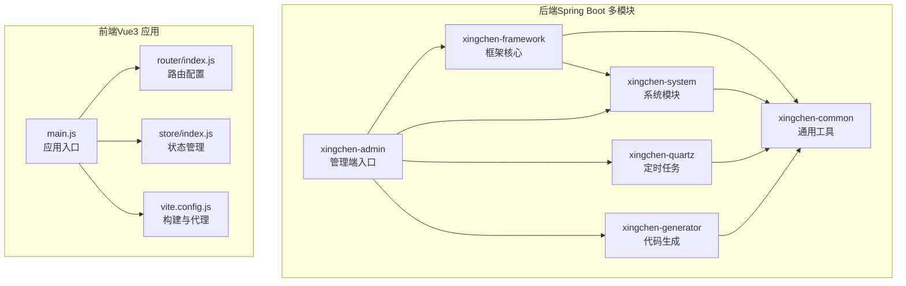
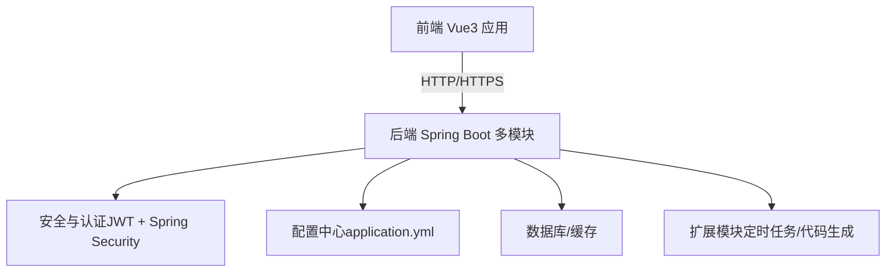
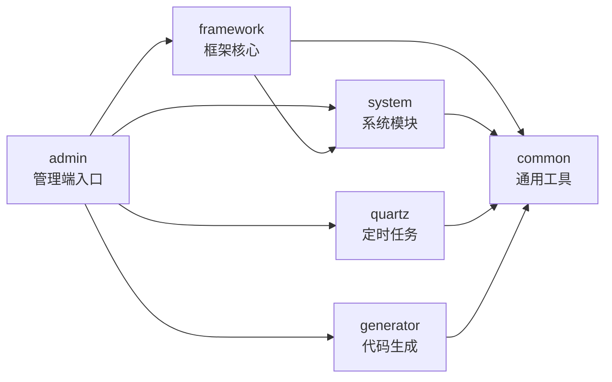
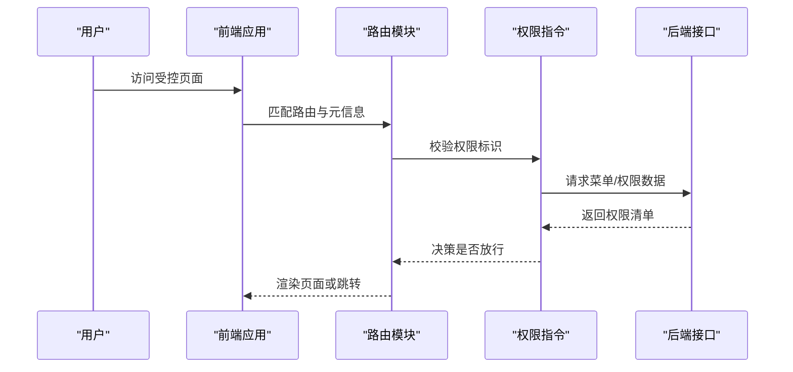
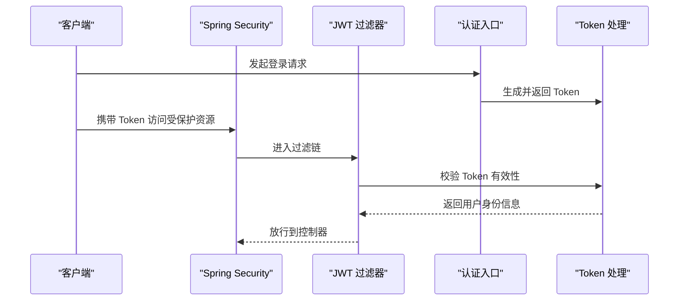
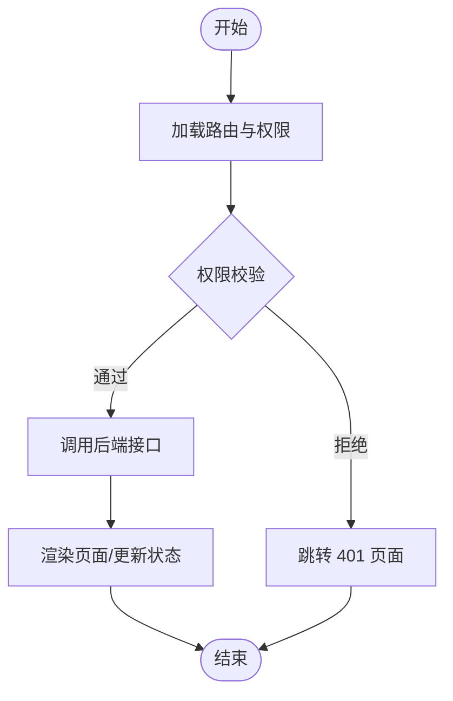
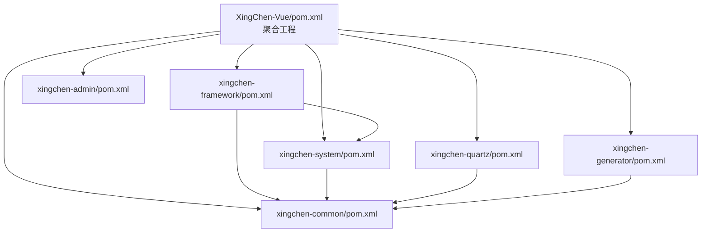

# 整体架构设计

<cite>
**本文引用的文件**
- [XingChen-Vue/pom.xml](file://XingChen-Vue/pom.xml)
- [XingChen-Vue3/package.json](file://XingChen-Vue3/package.json)
- [XingChen-Vue/xingchen-admin/src/main/java/com/xingchen/XingChenApplication.java](file://XingChen-Vue/xingchen-admin/src/main/java/com/xingchen/XingChenApplication.java)
- [XingChen-Vue/xingchen-admin/src/main/resources/application.yml](file://XingChen-Vue/xingchen-admin/src/main/resources/application.yml)
- [XingChen-Vue/xingchen-framework/src/main/java/com/xingchen/framework/config/SecurityConfig.java](file://XingChen-Vue/xingchen-framework/src/main/java/com/xingchen/framework/config/SecurityConfig.java)
- [XingChen-Vue3/src/main.js](file://XingChen-Vue3/src/main.js)
- [XingChen-Vue3/src/router/index.js](file://XingChen-Vue3/src/router/index.js)
- [XingChen-Vue3/vite.config.js](file://XingChen-Vue3/vite.config.js)
- [XingChen-Vue/xingchen-system/src/main/java/com/xingchen/system/service/ISysUserService.java](file://XingChen-Vue/xingchen-system/src/main/java/com/xingchen/system/service/ISysUserService.java)
- [XingChen-Vue/xingchen-common/pom.xml](file://XingChen-Vue/xingchen-common/pom.xml)
- [XingChen-Vue/xingchen-framework/pom.xml](file://XingChen-Vue/xingchen-framework/pom.xml)
- [XingChen-Vue/xingchen-system/pom.xml](file://XingChen-Vue/xingchen-system/pom.xml)
- [XingChen-Vue/xingchen-quartz/pom.xml](file://XingChen-Vue/xingchen-quartz/pom.xml)
- [XingChen-Vue/xingchen-generator/pom.xml](file://XingChen-Vue/xingchen-generator/pom.xml)
</cite>

## 目录
1. [简介](#简介)
2. [项目结构](#项目结构)
3. [核心组件](#核心组件)
4. [架构总览](#架构总览)
5. [详细组件分析](#详细组件分析)
6. [依赖分析](#依赖分析)
7. [性能考虑](#性能考虑)
8. [故障排查指南](#故障排查指南)
9. [结论](#结论)
10. [附录](#附录)

## 简介
本文件面向“健康管理平台”项目，提供整体架构设计文档。系统采用前后端分离架构：后端基于 Spring Boot 多模块聚合工程，前端采用 Vue3 + Vite 技术栈。后端通过模块化组织实现能力复用与职责分离，前端通过组件化与路由权限控制实现清晰的业务边界与用户体验。本文将从系统边界、组件交互、技术栈选型、架构演进等方面进行系统性阐述，并给出架构决策依据与最佳实践建议。

## 项目结构
系统分为两个主要部分：
- 后端（Spring Boot 多模块）：以 Maven 聚合工程形式组织，包含 admin 管理端、framework 框架核心、system 系统模块、quartz 定时任务、generator 代码生成、common 通用工具等模块。
- 前端（Vue3 应用）：基于 Vite 构建，采用 Vue Router 路由与 Pinia 状态管理，Element Plus 组件库，统一的权限控制与拦截器体系。

图表来源
- [XingChen-Vue/pom.xml:176-183](file://XingChen-Vue/pom.xml#L176-L183)
- [XingChen-Vue/xingchen-framework/pom.xml:56-61](file://XingChen-Vue/xingchen-framework/pom.xml#L56-L61)
- [XingChen-Vue/xingchen-system/pom.xml:18-26](file://XingChen-Vue/xingchen-system/pom.xml#L18-L26)
- [XingChen-Vue/xingchen-quartz/pom.xml:18-31](file://XingChen-Vue/xingchen-quartz/pom.xml#L18-L31)
- [XingChen-Vue/xingchen-generator/pom.xml:18-37](file://XingChen-Vue/xingchen-generator/pom.xml#L18-L37)
- [XingChen-Vue3/src/main.js:1-85](file://XingChen-Vue3/src/main.js#L1-L85)
- [XingChen-Vue3/src/router/index.js:1-197](file://XingChen-Vue3/src/router/index.js#L1-L197)
- [XingChen-Vue3/vite.config.js:1-80](file://XingChen-Vue3/vite.config.js#L1-L80)

章节来源
- [XingChen-Vue/pom.xml:176-183](file://XingChen-Vue/pom.xml#L176-L183)
- [XingChen-Vue3/package.json:1-54](file://XingChen-Vue3/package.json#L1-L54)

## 核心组件
- 后端启动与配置
  - 启动类位于管理端模块，排除数据源自动装配，便于按需引入数据源与多数据源场景。
  - 应用配置集中于 YAML，涵盖服务端口、Tomcat 线程池、日志级别、文件上传、Redis、JWT、MyBatis、分页插件、OpenAPI 文档、XSS 过滤等。
- 安全与认证
  - 基于 Spring Security + JWT 实现无状态认证；开启方法级安全注解；配置跨域与 CORS 过滤器；开放匿名访问白名单。
- 前端入口与运行
  - Vue3 应用入口注册 Element Plus、全局组件、指令、插件与权限控制；路由采用 history 模式，支持动态权限路由；Vite 提供开发代理与构建优化。
- 模块化与依赖
  - 后端通过模块化拆分，common 提供通用能力，framework 聚合框架能力，system 提供业务域能力，quartz/generator 独立扩展。

章节来源
- [XingChen-Vue/xingchen-admin/src/main/java/com/xingchen/XingChenApplication.java:12-18](file://XingChen-Vue/xingchen-admin/src/main/java/com/xingchen/XingChenApplication.java#L12-L18)
- [XingChen-Vue/xingchen-admin/src/main/resources/application.yml:16-148](file://XingChen-Vue/xingchen-admin/src/main/resources/application.yml#L16-L148)
- [XingChen-Vue/xingchen-framework/src/main/java/com/xingchen/framework/config/SecurityConfig.java:27-128](file://XingChen-Vue/xingchen-framework/src/main/java/com/xingchen/framework/config/SecurityConfig.java#L27-L128)
- [XingChen-Vue3/src/main.js:1-85](file://XingChen-Vue3/src/main.js#L1-L85)
- [XingChen-Vue3/src/router/index.js:1-197](file://XingChen-Vue3/src/router/index.js#L1-L197)
- [XingChen-Vue3/vite.config.js:44-61](file://XingChen-Vue3/vite.config.js#L44-L61)

## 架构总览
系统采用前后端分离架构，后端以 Spring Boot 多模块组织，前端以 Vue3 生态为核心，通过 RESTful API 通信。后端通过框架模块统一安全、缓存、分页、校验、异常处理等横切能力，业务能力集中在 system 模块，扩展能力通过 quartz 与 generator 模块实现。

图表来源
- [XingChen-Vue/xingchen-admin/src/main/resources/application.yml:48-148](file://XingChen-Vue/xingchen-admin/src/main/resources/application.yml#L48-L148)
- [XingChen-Vue/xingchen-framework/src/main/java/com/xingchen/framework/config/SecurityConfig.java:85-118](file://XingChen-Vue/xingchen-framework/src/main/java/com/xingchen/framework/config/SecurityConfig.java#L85-L118)
- [XingChen-Vue3/vite.config.js:48-60](file://XingChen-Vue3/vite.config.js#L48-L60)

## 详细组件分析

### 后端模块关系与职责
- xingchen-common：提供通用工具、安全、缓存、分页、校验、JSON 工具、Redis、Excel、Token、Yauaa、Servlet 等基础能力。
- xingchen-framework：封装 Web 容器、AOP 切面、拦截器、异步任务、安全过滤器、全局异常处理、动态数据源等核心框架能力，并依赖 system 模块。
- xingchen-system：系统业务模块，提供用户、角色、菜单、字典、通知、操作日志、配置等系统能力，依赖 common。
- xingchen-quartz：基于 Quartz 的定时任务模块，依赖 common。
- xingchen-generator：代码生成模块，依赖 common 与 Druid。
- xingchen-admin：管理端入口模块，聚合其他模块并排除数据源自动装配，便于按需配置。

图表来源
- [XingChen-Vue/xingchen-common/pom.xml:18-121](file://XingChen-Vue/xingchen-common/pom.xml#L18-L121)
- [XingChen-Vue/xingchen-framework/pom.xml:18-62](file://XingChen-Vue/xingchen-framework/pom.xml#L18-L62)
- [XingChen-Vue/xingchen-system/pom.xml:18-26](file://XingChen-Vue/xingchen-system/pom.xml#L18-L26)
- [XingChen-Vue/xingchen-quartz/pom.xml:18-31](file://XingChen-Vue/xingchen-quartz/pom.xml#L18-L31)
- [XingChen-Vue/xingchen-generator/pom.xml:18-37](file://XingChen-Vue/xingchen-generator/pom.xml#L18-L37)
- [XingChen-Vue/pom.xml:176-183](file://XingChen-Vue/pom.xml#L176-L183)

章节来源
- [XingChen-Vue/xingchen-common/pom.xml:18-121](file://XingChen-Vue/xingchen-common/pom.xml#L18-L121)
- [XingChen-Vue/xingchen-framework/pom.xml:18-62](file://XingChen-Vue/xingchen-framework/pom.xml#L18-L62)
- [XingChen-Vue/xingchen-system/pom.xml:18-26](file://XingChen-Vue/xingchen-system/pom.xml#L18-L26)
- [XingChen-Vue/xingchen-quartz/pom.xml:18-31](file://XingChen-Vue/xingchen-quartz/pom.xml#L18-L31)
- [XingChen-Vue/xingchen-generator/pom.xml:18-37](file://XingChen-Vue/xingchen-generator/pom.xml#L18-L37)
- [XingChen-Vue/pom.xml:176-183](file://XingChen-Vue/pom.xml#L176-L183)

### 前端路由与权限控制
- 路由采用常量路由与动态路由分离：常量路由包含登录、401/404、首页、锁定屏等；动态路由基于用户权限加载。
- 权限控制结合路由元信息与后端接口返回的菜单/权限信息，实现细粒度的页面与按钮级权限。
- Vite 提供开发代理，将 /dev-api 前缀转发至后端服务，同时代理 OpenAPI 文档路径。

图表来源
- [XingChen-Vue3/src/router/index.js:27-109](file://XingChen-Vue3/src/router/index.js#L27-L109)
- [XingChen-Vue3/src/router/index.js:111-183](file://XingChen-Vue3/src/router/index.js#L111-L183)
- [XingChen-Vue3/vite.config.js:48-60](file://XingChen-Vue3/vite.config.js#L48-L60)

章节来源
- [XingChen-Vue3/src/router/index.js:1-197](file://XingChen-Vue3/src/router/index.js#L1-L197)
- [XingChen-Vue3/vite.config.js:1-80](file://XingChen-Vue3/vite.config.js#L1-L80)

### 安全与认证流程
- 前端登录后获取 Token，后续请求携带在请求头中；后端通过 JWT 过滤器解析与校验 Token，完成身份认证与权限判定。
- Spring Security 配置无状态会话策略，禁用 CSRF，开放匿名访问白名单，集成 CORS 与 XSS 过滤器。

图表来源
- [XingChen-Vue/xingchen-framework/src/main/java/com/xingchen/framework/config/SecurityConfig.java:85-118](file://XingChen-Vue/xingchen-framework/src/main/java/com/xingchen/framework/config/SecurityConfig.java#L85-L118)

章节来源
- [XingChen-Vue/xingchen-framework/src/main/java/com/xingchen/framework/config/SecurityConfig.java:27-128](file://XingChen-Vue/xingchen-framework/src/main/java/com/xingchen/framework/config/SecurityConfig.java#L27-L128)

### 数据流与处理逻辑
- 用户服务接口定义了用户增删改查、导入导出、角色授权、状态变更、登录信息更新等完整能力，体现清晰的业务边界与职责分离。
- 前端通过 API 层调用后端接口，配合路由与权限控制，形成完整的用户管理闭环。

图表来源
- [XingChen-Vue3/src/router/index.js:27-109](file://XingChen-Vue3/src/router/index.js#L27-L109)
- [XingChen-Vue/xingchen-system/src/main/java/com/xingchen/system/service/ISysUserService.java:12-218](file://XingChen-Vue/xingchen-system/src/main/java/com/xingchen/system/service/ISysUserService.java#L12-L218)

章节来源
- [XingChen-Vue/xingchen-system/src/main/java/com/xingchen/system/service/ISysUserService.java:12-218](file://XingChen-Vue/xingchen-system/src/main/java/com/xingchen/system/service/ISysUserService.java#L12-L218)

## 依赖分析
- 后端模块依赖
  - framework 依赖 system 与 common，system 依赖 common，quartz 与 generator 依赖 common，admin 聚合其余模块。
- 前端依赖
  - Vue3、Element Plus、Vue Router、Pinia、Axios、ECharts、Fuse.js、JSEncrypt、NProgress 等生态库，构建阶段使用 Vite 插件与 SVG 图标注册。

图表来源
- [XingChen-Vue/pom.xml:176-183](file://XingChen-Vue/pom.xml#L176-L183)
- [XingChen-Vue/xingchen-framework/pom.xml:56-61](file://XingChen-Vue/xingchen-framework/pom.xml#L56-L61)
- [XingChen-Vue/xingchen-system/pom.xml:18-26](file://XingChen-Vue/xingchen-system/pom.xml#L18-L26)
- [XingChen-Vue/xingchen-quartz/pom.xml:18-31](file://XingChen-Vue/xingchen-quartz/pom.xml#L18-L31)
- [XingChen-Vue/xingchen-generator/pom.xml:18-37](file://XingChen-Vue/xingchen-generator/pom.xml#L18-L37)

章节来源
- [XingChen-Vue/pom.xml:176-183](file://XingChen-Vue/pom.xml#L176-L183)
- [XingChen-Vue3/package.json:18-46](file://XingChen-Vue3/package.json#L18-L46)

## 性能考虑
- 后端
  - 使用 Druid 连接池与监控，结合 PageHelper 分页减少一次性数据传输；MyBatis Mapper 扫描与全局配置文件提升 ORM 性能；Redis 缓存热点数据与 Token 存储。
  - Springdoc OpenAPI 在开发阶段启用，便于联调与文档化。
- 前端
  - Vite 构建优化、按需加载与组件注册、SVG 图标按需引入；路由懒加载与 keep-alive 缓存策略降低首屏与切换开销。
- 安全与防护
  - 启用 XSS 过滤与 CORS 配置，限制静态资源与匿名访问范围，避免敏感接口暴露。

## 故障排查指南
- 启动与配置
  - 后端启动类排除数据源自动装配，若出现连接异常，检查 application.yml 中 Redis、数据库与连接池配置。
  - 前端开发代理未生效时，确认 vite.config.js 中代理配置与后端端口一致。
- 安全与认证
  - Token 失效或权限不足导致 401，检查 JWT 密钥、过期时间与前端请求头携带情况；确认匿名白名单配置是否覆盖目标路径。
- 路由与权限
  - 动态路由未加载或按钮权限不生效，核对后端返回的菜单/权限标识与前端路由 meta 与指令配置是否一致。

章节来源
- [XingChen-Vue/xingchen-admin/src/main/resources/application.yml:95-148](file://XingChen-Vue/xingchen-admin/src/main/resources/application.yml#L95-L148)
- [XingChen-Vue3/vite.config.js:48-60](file://XingChen-Vue3/vite.config.js#L48-L60)
- [XingChen-Vue/xingchen-framework/src/main/java/com/xingchen/framework/config/SecurityConfig.java:100-118](file://XingChen-Vue/xingchen-framework/src/main/java/com/xingchen/framework/config/SecurityConfig.java#L100-L118)

## 结论
本系统通过前后端分离与 Spring Boot 多模块设计，实现了清晰的职责边界与良好的可维护性。后端以 common 为基础、framework 为核心、system 为业务主体，quartz 与 generator 作为扩展能力，admin 作为入口聚合。前端以 Vue3 生态为核心，结合路由与权限控制，提供一致的用户体验。建议在后续演进中持续完善监控告警、灰度发布与可观测性建设，进一步提升系统稳定性与可运维性。

## 附录
- 架构演进规划建议
  - 微服务化：在业务成熟后，可将 system 模块拆分为独立服务，配合网关与注册中心实现服务治理。
  - 容器化与 CI/CD：引入 Docker 与流水线，实现自动化构建与部署。
  - 监控与日志：接入分布式追踪与日志聚合，完善告警机制。
  - 安全加固：强化密码策略、二次认证与审计日志，定期进行安全评估。