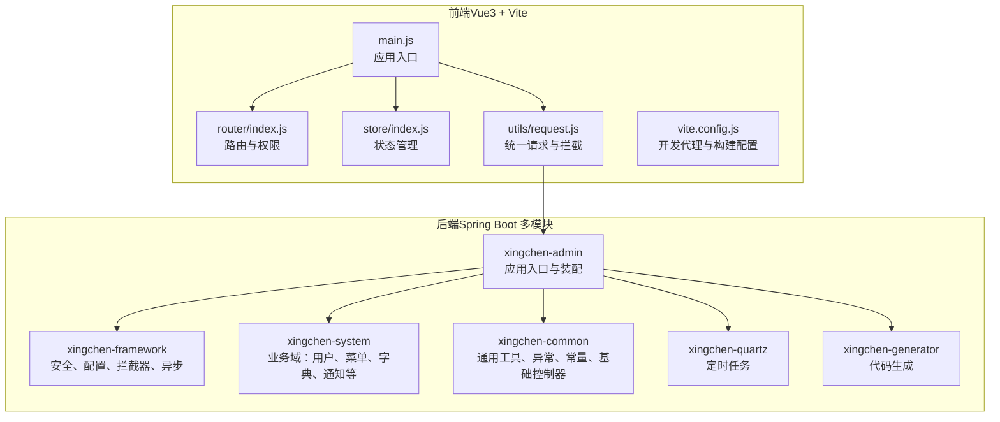
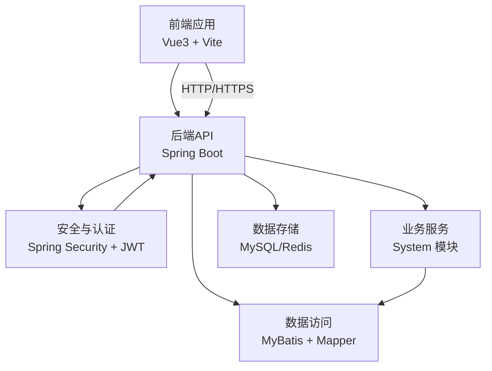
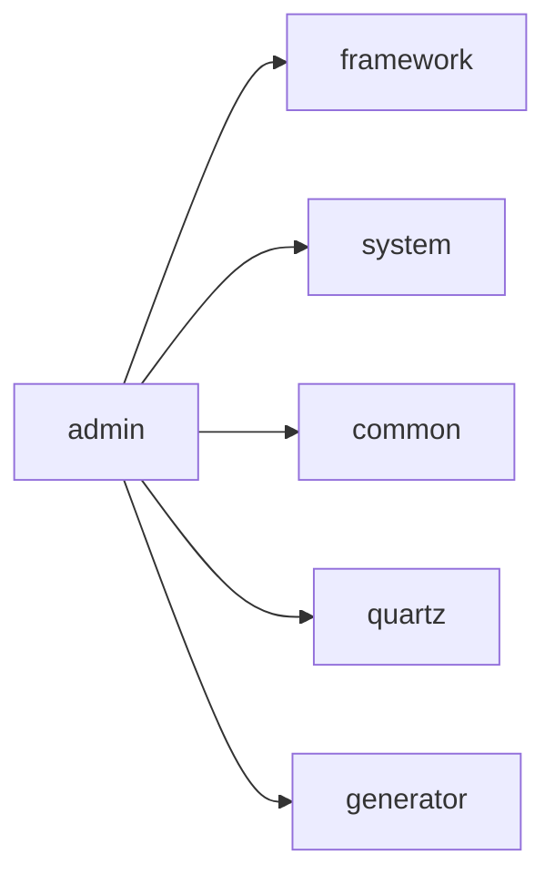
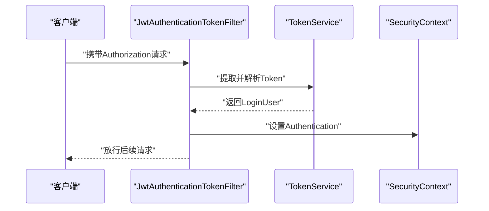
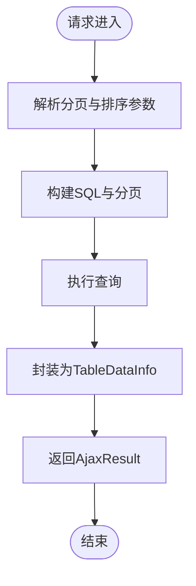
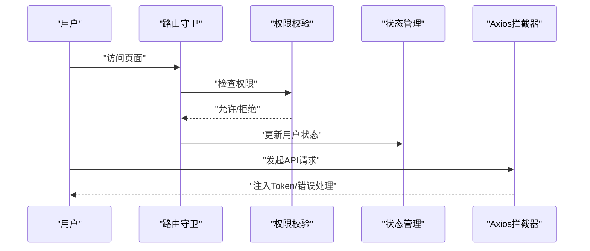
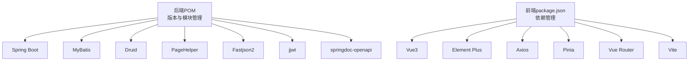

# 架构设计

<cite>
**本文引用的文件**   
- [XingChen-Vue/pom.xml](file://XingChen-Vue/pom.xml)
- [XingChen-Vue/xingchen-admin/src/main/java/com/xingchen/XingChenApplication.java](file://XingChen-Vue/xingchen-admin/src/main/java/com/xingchen/XingChenApplication.java)
- [XingChen-Vue/xingchen-admin/src/main/resources/application.yml](file://XingChen-Vue/xingchen-admin/src/main/resources/application.yml)
- [XingChen-Vue/xingchen-framework/src/main/java/com/xingchen/framework/config/SecurityConfig.java](file://XingChen-Vue/xingchen-framework/src/main/java/com/xingchen/framework/config/SecurityConfig.java)
- [XingChen-Vue/xingchen-framework/src/main/java/com/xingchen/framework/security/filter/JwtAuthenticationTokenFilter.java](file://XingChen-Vue/xingchen-framework/src/main/java/com/xingchen/framework/security/filter/JwtAuthenticationTokenFilter.java)
- [XingChen-Vue/xingchen-framework/src/main/java/com/xingchen/framework/config/MyBatisConfig.java](file://XingChen-Vue/xingchen-framework/src/main/java/com/xingchen/framework/config/MyBatisConfig.java)
- [XingChen-Vue/xingchen-system/src/main/java/com/xingchen/system/service/ISysUserService.java](file://XingChen-Vue/xingchen-system/src/main/java/com/xingchen/system/service/ISysUserService.java)
- [XingChen-Vue/xingchen-common/src/main/java/com/xingchen/common/core/controller/BaseController.java](file://XingChen-Vue/xingchen-common/src/main/java/com/xingchen/common/core/controller/BaseController.java)
- [XingChen-Vue/xingchen-common/src/main/java/com/xingchen/common/core/domain/AjaxResult.java](file://XingChen-Vue/xingchen-common/src/main/java/com/xingchen/common/core/domain/AjaxResult.java)
- [XingChen-Vue3/src/main.js](file://XingChen-Vue3/src/main.js)
- [XingChen-Vue3/src/router/index.js](file://XingChen-Vue3/src/router/index.js)
- [XingChen-Vue3/src/store/index.js](file://XingChen-Vue3/src/store/index.js)
- [XingChen-Vue3/vite.config.js](file://XingChen-Vue3/vite.config.js)
- [XingChen-Vue3/package.json](file://XingChen-Vue3/package.json)
- [XingChen-Vue3/src/utils/request.js](file://XingChen-Vue3/src/utils/request.js)
- [XingChen-Vue3/src/settings.js](file://XingChen-Vue3/src/settings.js)
</cite>

## 目录
1. [简介](#简介)
2. [项目结构](#项目结构)
3. [核心组件](#核心组件)
4. [架构总览](#架构总览)
5. [详细组件分析](#详细组件分析)
6. [依赖分析](#依赖分析)
7. [性能考虑](#性能考虑)
8. [故障排查指南](#故障排查指南)
9. [结论](#结论)
10. [附录](#附录)

## 简介
本技术架构文档面向“健康管理系统”，系统采用前后端分离架构：后端基于 Spring Boot 多模块聚合工程，前端采用 Vue3 + Vite 技术栈。后端以 admin、framework、system、common、quartz、generator 等模块划分职责，形成清晰的分层与模块化组织；前端通过路由、状态管理、插件体系与统一请求封装实现一致的用户体验与安全控制。系统同时具备安全认证（JWT）、数据持久化（MyBatis）、定时任务（Quartz）、代码生成（Generator）等能力，并提供可扩展的微服务化思路与性能优化策略。

## 项目结构
系统采用 Maven 多模块聚合管理，后端模块按领域与基础设施分层组织，前端采用 Vite 工程化构建与开发代理。

**图表来源**
- [XingChen-Vue/pom.xml:176-183](file://XingChen-Vue/pom.xml#L176-L183)
- [XingChen-Vue/xingchen-admin/src/main/java/com/xingchen/XingChenApplication.java:12-19](file://XingChen-Vue/xingchen-admin/src/main/java/com/xingchen/XingChenApplication.java#L12-L19)
- [XingChen-Vue3/src/main.js:47-84](file://XingChen-Vue3/src/main.js#L47-L84)

**章节来源**
- [XingChen-Vue/pom.xml:176-183](file://XingChen-Vue/pom.xml#L176-L183)
- [XingChen-Vue/xingchen-admin/src/main/java/com/xingchen/XingChenApplication.java:12-19](file://XingChen-Vue/xingchen-admin/src/main/java/com/xingchen/XingChenApplication.java#L12-L19)
- [XingChen-Vue3/src/main.js:47-84](file://XingChen-Vue3/src/main.js#L47-L84)

## 核心组件
- 后端应用入口与装配：通过排除数据源自动装配的启动类集中管理模块装配与运行入口。
- 安全与认证：基于 Spring Security + JWT 的无状态认证，结合 CORS、匿名放行白名单与统一异常处理。
- 数据访问：MyBatis 配置支持包扫描别名与 Mapper XML 扫描，配合分页与 SQL 安全校验工具。
- 统一响应：AjaxResult 统一返回结构，BaseController 提供分页、权限用户上下文等通用能力。
- 前端应用入口：注册全局组件、指令、插件与 Element Plus，挂载路由与状态管理。
- 前端路由与权限：常量路由与动态路由分离，基于权限元信息控制菜单与页面访问。
- 前端状态管理：Pinia 管理用户、权限、设置等状态。
- 前端请求封装：Axios 拦截器统一注入 Token、重复提交防护、错误提示与下载处理。

**章节来源**
- [XingChen-Vue/xingchen-admin/src/main/java/com/xingchen/XingChenApplication.java:12-19](file://XingChen-Vue/xingchen-admin/src/main/java/com/xingchen/XingChenApplication.java#L12-L19)
- [XingChen-Vue/xingchen-framework/src/main/java/com/xingchen/framework/config/SecurityConfig.java:86-118](file://XingChen-Vue/xingchen-framework/src/main/java/com/xingchen/framework/config/SecurityConfig.java#L86-L118)
- [XingChen-Vue/xingchen-framework/src/main/java/com/xingchen/framework/security/filter/JwtAuthenticationTokenFilter.java:30-43](file://XingChen-Vue/xingchen-framework/src/main/java/com/xingchen/framework/security/filter/JwtAuthenticationTokenFilter.java#L30-L43)
- [XingChen-Vue/xingchen-framework/src/main/java/com/xingchen/framework/config/MyBatisConfig.java:116-131](file://XingChen-Vue/xingchen-framework/src/main/java/com/xingchen/framework/config/MyBatisConfig.java#L116-L131)
- [XingChen-Vue/xingchen-common/src/main/java/com/xingchen/common/core/domain/AjaxResult.java:67-103](file://XingChen-Vue/xingchen-common/src/main/java/com/xingchen/common/core/domain/AjaxResult.java#L67-L103)
- [XingChen-Vue/xingchen-common/src/main/java/com/xingchen/common/core/controller/BaseController.java:53-91](file://XingChen-Vue/xingchen-common/src/main/java/com/xingchen/common/core/controller/BaseController.java#L53-L91)
- [XingChen-Vue3/src/main.js:47-84](file://XingChen-Vue3/src/main.js#L47-L84)
- [XingChen-Vue3/src/router/index.js:28-109](file://XingChen-Vue3/src/router/index.js#L28-L109)
- [XingChen-Vue3/src/store/index.js:1-4](file://XingChen-Vue3/src/store/index.js#L1-L4)
- [XingChen-Vue3/src/utils/request.js:23-73](file://XingChen-Vue3/src/utils/request.js#L23-L73)

## 架构总览
系统采用前后端分离的三层架构：前端负责视图与交互，后端提供 REST API 与业务逻辑，数据库与缓存作为基础设施层。安全方面通过 JWT 实现无状态认证，路由与权限控制确保菜单与页面访问合规。

**图表来源**
- [XingChen-Vue3/src/utils/request.js:16-21](file://XingChen-Vue3/src/utils/request.js#L16-L21)
- [XingChen-Vue/xingchen-framework/src/main/java/com/xingchen/framework/config/SecurityConfig.java:86-118](file://XingChen-Vue/xingchen-framework/src/main/java/com/xingchen/framework/config/SecurityConfig.java#L86-L118)
- [XingChen-Vue/xingchen-system/src/main/java/com/xingchen/system/service/ISysUserService.java:12-218](file://XingChen-Vue/xingchen-system/src/main/java/com/xingchen/system/service/ISysUserService.java#L12-L218)
- [XingChen-Vue/xingchen-framework/src/main/java/com/xingchen/framework/config/MyBatisConfig.java:116-131](file://XingChen-Vue/xingchen-framework/src/main/java/com/xingchen/framework/config/MyBatisConfig.java#L116-L131)

## 详细组件分析

### 后端模块与分层
- admin：应用入口模块，聚合其他模块，负责装配与启动。
- framework：安全、配置、拦截器、异步任务、动态数据源等基础设施。
- system：业务域模块，包含用户、菜单、字典、通知、岗位、角色等业务实体与服务。
- common：通用工具、异常、常量、基础控制器、分页、Redis 缓存等。
- quartz：定时任务模块，提供调度、日志与执行工具。
- generator：代码生成模块，基于模板引擎生成前后端代码。

**图表来源**
- [XingChen-Vue/pom.xml:176-183](file://XingChen-Vue/pom.xml#L176-L183)

**章节来源**
- [XingChen-Vue/pom.xml:176-183](file://XingChen-Vue/pom.xml#L176-L183)

### 安全与认证流程（JWT）
系统通过 Spring Security + JWT 实现无状态认证，请求进入时先经 CORS 过滤，再由 JWT 过滤器解析与校验 Token，最后由方法级注解控制权限。

**图表来源**
- [XingChen-Vue/xingchen-framework/src/main/java/com/xingchen/framework/security/filter/JwtAuthenticationTokenFilter.java:30-43](file://XingChen-Vue/xingchen-framework/src/main/java/com/xingchen/framework/security/filter/JwtAuthenticationTokenFilter.java#L30-L43)

**章节来源**
- [XingChen-Vue/xingchen-framework/src/main/java/com/xingchen/framework/config/SecurityConfig.java:86-118](file://XingChen-Vue/xingchen-framework/src/main/java/com/xingchen/framework/config/SecurityConfig.java#L86-L118)
- [XingChen-Vue/xingchen-framework/src/main/java/com/xingchen/framework/security/filter/JwtAuthenticationTokenFilter.java:30-43](file://XingChen-Vue/xingchen-framework/src/main/java/com/xingchen/framework/security/filter/JwtAuthenticationTokenFilter.java#L30-L43)

### 数据访问与分页
MyBatis 配置支持多包别名扫描与 Mapper XML 扫描，BaseController 提供分页与排序参数构建，AjaxResult 统一返回结构。

**图表来源**
- [XingChen-Vue/xingchen-common/src/main/java/com/xingchen/common/core/controller/BaseController.java:53-91](file://XingChen-Vue/xingchen-common/src/main/java/com/xingchen/common/core/controller/BaseController.java#L53-L91)
- [XingChen-Vue/xingchen-common/src/main/java/com/xingchen/common/core/domain/AjaxResult.java:67-103](file://XingChen-Vue/xingchen-common/src/main/java/com/xingchen/common/core/domain/AjaxResult.java#L67-L103)
- [XingChen-Vue/xingchen-framework/src/main/java/com/xingchen/framework/config/MyBatisConfig.java:116-131](file://XingChen-Vue/xingchen-framework/src/main/java/com/xingchen/framework/config/MyBatisConfig.java#L116-L131)

**章节来源**
- [XingChen-Vue/xingchen-common/src/main/java/com/xingchen/common/core/controller/BaseController.java:53-91](file://XingChen-Vue/xingchen-common/src/main/java/com/xingchen/common/core/controller/BaseController.java#L53-L91)
- [XingChen-Vue/xingchen-common/src/main/java/com/xingchen/common/core/domain/AjaxResult.java:67-103](file://XingChen-Vue/xingchen-common/src/main/java/com/xingchen/common/core/domain/AjaxResult.java#L67-L103)
- [XingChen-Vue/xingchen-framework/src/main/java/com/xingchen/framework/config/MyBatisConfig.java:116-131](file://XingChen-Vue/xingchen-framework/src/main/java/com/xingchen/framework/config/MyBatisConfig.java#L116-L131)

### 前端路由与权限
前端通过常量路由与动态路由分离，结合权限元信息控制菜单与页面访问；Pinia 管理用户与设置状态；Axios 拦截器统一处理 Token、重复提交与错误提示。

**图表来源**
- [XingChen-Vue3/src/router/index.js:28-109](file://XingChen-Vue3/src/router/index.js#L28-L109)
- [XingChen-Vue3/src/store/index.js:1-4](file://XingChen-Vue3/src/store/index.js#L1-L4)
- [XingChen-Vue3/src/utils/request.js:23-73](file://XingChen-Vue3/src/utils/request.js#L23-L73)

**章节来源**
- [XingChen-Vue3/src/router/index.js:28-109](file://XingChen-Vue3/src/router/index.js#L28-L109)
- [XingChen-Vue3/src/store/index.js:1-4](file://XingChen-Vue3/src/store/index.js#L1-L4)
- [XingChen-Vue3/src/utils/request.js:23-73](file://XingChen-Vue3/src/utils/request.js#L23-L73)

### 微服务化思路
- 边界划分：以业务域为边界拆分服务（如用户中心、内容中心），后端可按模块抽取为独立服务，前端通过网关或直连暴露 API。
- 通信协议：保持 REST API 不变，便于前端复用；引入 OpenAPI/Swagger 文档统一契约。
- 数据一致性：跨服务事务采用 Saga 或事件驱动，本地事务仍由各服务内 MyBatis 管理。
- 安全与限流：在网关层统一鉴权与限流，服务内部保留细粒度权限控制。
- 配置与注册：引入 Spring Cloud Config 与 Nacos/Eureka，实现配置与服务发现。

[本节为概念性说明，无需“章节来源”]

## 依赖分析
后端通过 Maven 管理版本与模块依赖，核心依赖包括 Spring Boot、MyBatis、Druid、PageHelper、Fastjson、JWT、Kaptcha、OpenAPI 等；前端通过 Vite 插件体系与 Axios 实现开发与构建优化。

**图表来源**
- [XingChen-Vue/pom.xml:37-174](file://XingChen-Vue/pom.xml#L37-L174)
- [XingChen-Vue3/package.json:18-46](file://XingChen-Vue3/package.json#L18-L46)

**章节来源**
- [XingChen-Vue/pom.xml:37-174](file://XingChen-Vue/pom.xml#L37-L174)
- [XingChen-Vue3/package.json:18-46](file://XingChen-Vue3/package.json#L18-L46)

## 性能考虑
- 前端
  - 构建优化：启用压缩插件与产物分包策略，合理拆分第三方库与业务代码。
  - 请求优化：Axios 拦截器内置重复提交防护与超时控制，避免无效请求。
  - 代理与缓存：开发阶段通过 Vite 代理转发后端接口，减少跨域与网络往返。
- 后端
  - 数据库连接池：使用 Druid，合理配置连接数与超时。
  - 分页与排序：MyBatis + PageHelper，避免一次性加载大结果集。
  - 序列化：Fastjson2 提升序列化性能，注意敏感字段脱敏。
  - 缓存：Redis 缓存热点数据与会话信息，降低数据库压力。
- 安全与限流
  - JWT 无状态认证减少会话开销；结合限流注解与过滤器控制突发流量。

[本节提供一般性建议，无需“章节来源”]

## 故障排查指南
- 前端常见问题
  - 接口 401/403：检查 Axios 是否注入 Token，确认后端 JWT 校验与权限配置。
  - 代理不通：确认 Vite 代理目标地址与路径重写规则。
  - 重复提交：查看拦截器对请求体与时间间隔的判断。
- 后端常见问题
  - 认证失败：检查 SecurityConfig 中匿名放行列表与过滤器顺序。
  - 分页异常：确认分页参数与 SQL 排序注入防护。
  - MyBatis 映射：核对 typeAliasesPackage 与 mapperLocations 配置。
- 统一处理
  - AjaxResult 统一返回结构，便于前端统一处理错误码与提示。

**章节来源**
- [XingChen-Vue3/src/utils/request.js:75-124](file://XingChen-Vue3/src/utils/request.js#L75-L124)
- [XingChen-Vue/xingchen-framework/src/main/java/com/xingchen/framework/config/SecurityConfig.java:86-118](file://XingChen-Vue/xingchen-framework/src/main/java/com/xingchen/framework/config/SecurityConfig.java#L86-L118)
- [XingChen-Vue/xingchen-common/src/main/java/com/xingchen/common/core/domain/AjaxResult.java:168-201](file://XingChen-Vue/xingchen-common/src/main/java/com/xingchen/common/core/domain/AjaxResult.java#L168-L201)

## 结论
系统通过前后端分离与多模块后端架构实现了清晰的职责划分与良好的可维护性；安全、数据访问与前端交互均采用统一的约定与封装，具备进一步向微服务演进的基础。建议在后续版本中引入服务治理与配置中心，持续优化性能与可观测性。

## 附录
- 配置要点
  - 后端 application.yml：端口、文件上传、Redis、JWT、MyBatis、PageHelper、OpenAPI 等。
  - 前端 vite.config.js：开发代理、构建输出与插件配置。
  - 前端 settings.js：主题、导航模式、标签页等界面配置。
- 最佳实践
  - 后端：统一异常处理、参数校验、SQL 注入防护、日志分级。
  - 前端：路由权限与菜单联动、状态持久化、组件化与可复用工具函数。

**章节来源**
- [XingChen-Vue/xingchen-admin/src/main/resources/application.yml:16-148](file://XingChen-Vue/xingchen-admin/src/main/resources/application.yml#L16-L148)
- [XingChen-Vue3/vite.config.js:8-79](file://XingChen-Vue3/vite.config.js#L8-L79)
- [XingChen-Vue3/src/settings.js:1-63](file://XingChen-Vue3/src/settings.js#L1-L63)