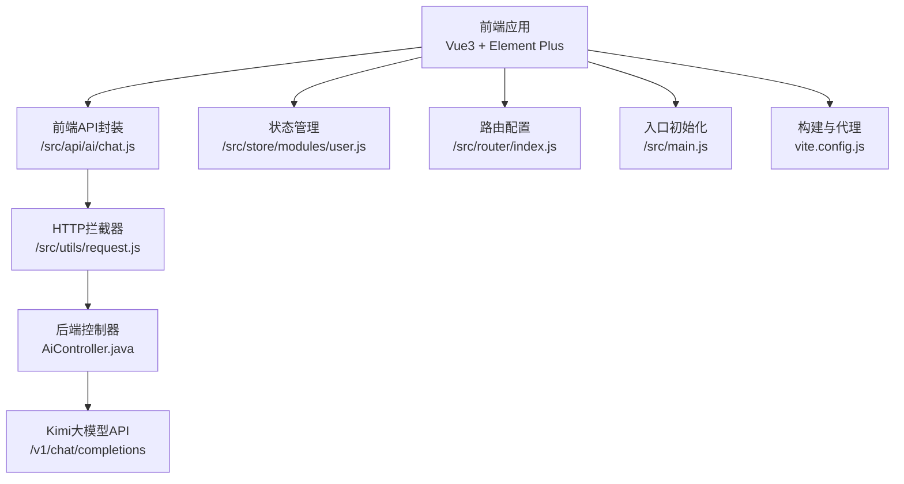
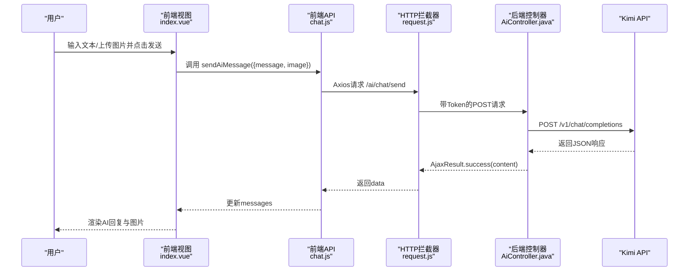
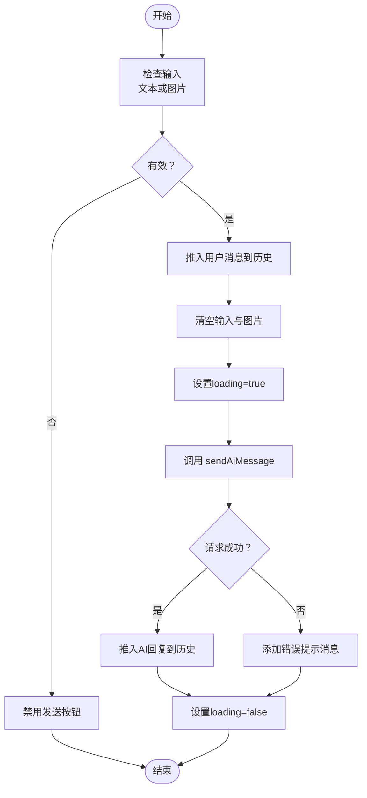
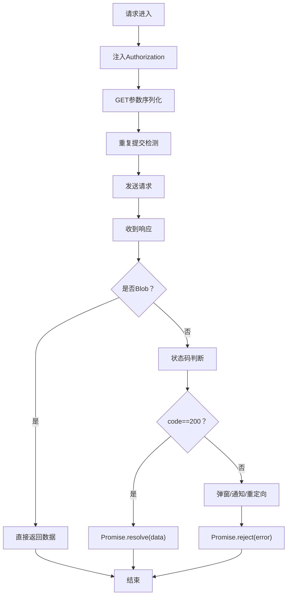
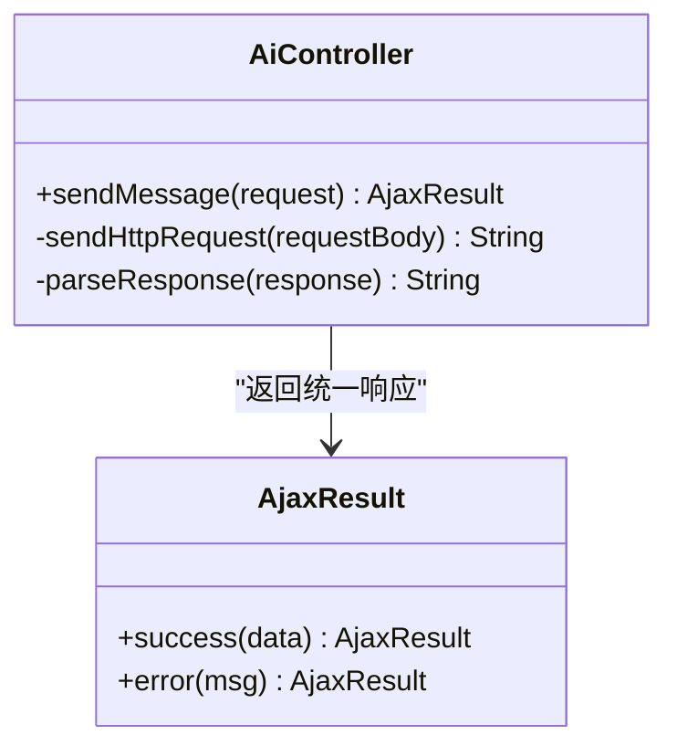
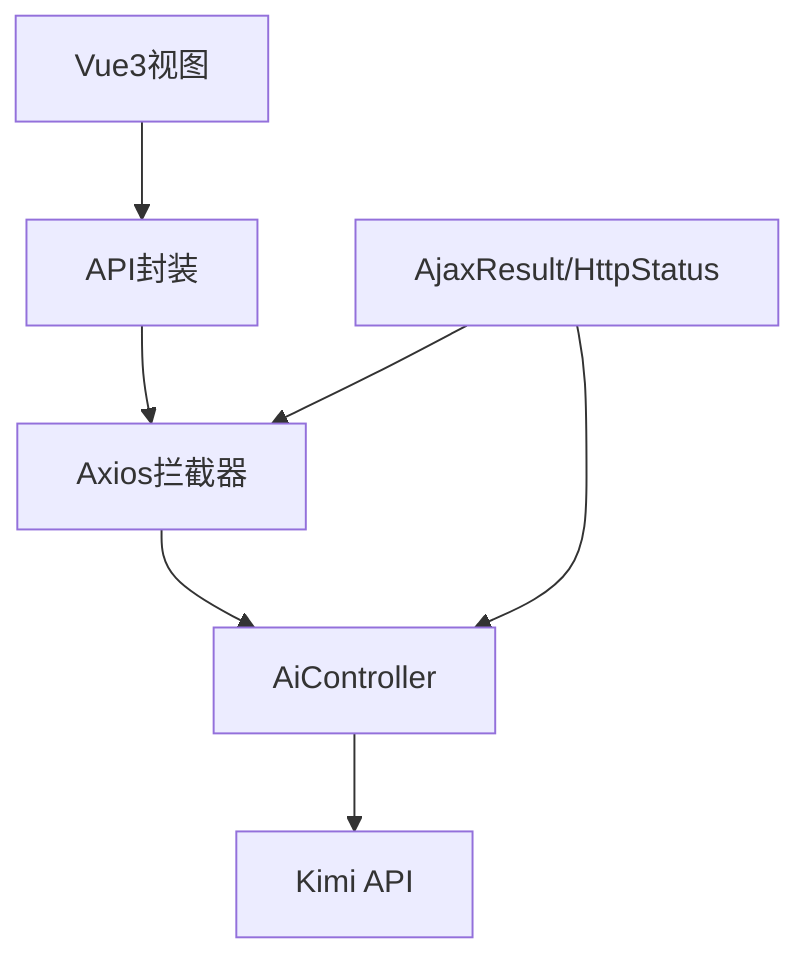

# AI健康助手

<cite>
**本文引用的文件**
- [XingChen-Vue3/src/views/ai/chat/index.vue](file://XingChen-Vue3/src/views/ai/chat/index.vue)
- [XingChen-Vue3/src/api/ai/chat.js](file://XingChen-Vue3/src/api/ai/chat.js)
- [XingChen-Vue3/src/utils/request.js](file://XingChen-Vue3/src/utils/request.js)
- [XingChen-Vue3/src/store/modules/user.js](file://XingChen-Vue3/src/store/modules/user.js)
- [XingChen-Vue3/src/utils/auth.js](file://XingChen-Vue3/src/utils/auth.js)
- [XingChen-Vue3/src/router/index.js](file://XingChen-Vue3/src/router/index.js)
- [XingChen-Vue3/src/main.js](file://XingChen-Vue3/src/main.js)
- [XingChen-Vue3/vite.config.js](file://XingChen-Vue3/vite.config.js)
- [XingChen-Vue/xingchen-admin/src/main/java/com/xingchen/web/controller/al/AiController.java](file://XingChen-Vue/xingchen-admin/src/main/java/com/xingchen/web/controller/al/AiController.java)
- [XingChen-Vue/xingchen-common/src/main/java/com/xingchen/common/core/domain/AjaxResult.java](file://XingChen-Vue/xingchen-common/src/main/java/com/xingchen/common/core/domain/AjaxResult.java)
- [XingChen-Vue/xingchen-common/src/main/java/com/xingchen/common/constant/HttpStatus.java](file://XingChen-Vue/xingchen-common/src/main/java/com/xingchen/common/constant/HttpStatus.java)
- [XingChen-Vue3/src/utils/errorCode.js](file://XingChen-Vue3/src/utils/errorCode.js)
</cite>

## 目录
1. [简介](#简介)
2. [项目结构](#项目结构)
3. [核心组件](#核心组件)
4. [架构总览](#架构总览)
5. [详细组件分析](#详细组件分析)
6. [依赖分析](#依赖分析)
7. [性能考虑](#性能考虑)
8. [故障排查指南](#故障排查指南)
9. [结论](#结论)
10. [附录](#附录)

## 简介
本项目为“AI健康助手”，提供多模态对话能力（文本与图片），前端采用Vue3 + Element Plus，后端采用Spring Boot，通过Kimi（Moonshot）大模型API实现智能问答与图像分析。系统包含完整的前端聊天界面、消息历史渲染、图片上传与预览、前后端交互协议与错误处理，以及统一的响应封装与状态码约定。

## 项目结构
- 前端工程位于 XingChen-Vue3，包含视图层、API封装、HTTP拦截器、状态管理、路由与构建配置。
- 后端工程位于 XingChen-Vue/xingchen-admin，包含AI聊天控制器与Kimi API对接逻辑。
- 通用模块 XingChen-Vue/xingchen-common 提供统一响应结构与状态码常量。

图表来源
- [XingChen-Vue3/src/views/ai/chat/index.vue:108-228](file://XingChen-Vue3/src/views/ai/chat/index.vue#L108-L228)
- [XingChen-Vue3/src/api/ai/chat.js:1-11](file://XingChen-Vue3/src/api/ai/chat.js#L1-L11)
- [XingChen-Vue3/src/utils/request.js:1-154](file://XingChen-Vue3/src/utils/request.js#L1-L154)
- [XingChen-Vue/xingchen-admin/src/main/java/com/xingchen/web/controller/al/AiController.java:23-93](file://XingChen-Vue/xingchen-admin/src/main/java/com/xingchen/web/controller/al/AiController.java#L23-L93)
- [XingChen-Vue3/src/store/modules/user.js:1-94](file://XingChen-Vue3/src/store/modules/user.js#L1-L94)
- [XingChen-Vue3/src/router/index.js:1-197](file://XingChen-Vue3/src/router/index.js#L1-L197)
- [XingChen-Vue3/src/main.js:1-85](file://XingChen-Vue3/src/main.js#L1-L85)
- [XingChen-Vue3/vite.config.js:1-80](file://XingChen-Vue3/vite.config.js#L1-L80)

章节来源
- [XingChen-Vue3/src/views/ai/chat/index.vue:1-527](file://XingChen-Vue3/src/views/ai/chat/index.vue#L1-L527)
- [XingChen-Vue3/src/api/ai/chat.js:1-11](file://XingChen-Vue3/src/api/ai/chat.js#L1-L11)
- [XingChen-Vue3/src/utils/request.js:1-154](file://XingChen-Vue3/src/utils/request.js#L1-L154)
- [XingChen-Vue/xingchen-admin/src/main/java/com/xingchen/web/controller/al/AiController.java:1-165](file://XingChen-Vue/xingchen-admin/src/main/java/com/xingchen/web/controller/al/AiController.java#L1-L165)
- [XingChen-Vue3/src/store/modules/user.js:1-94](file://XingChen-Vue3/src/store/modules/user.js#L1-L94)
- [XingChen-Vue3/src/router/index.js:1-197](file://XingChen-Vue3/src/router/index.js#L1-L197)
- [XingChen-Vue3/src/main.js:1-85](file://XingChen-Vue3/src/main.js#L1-L85)
- [XingChen-Vue3/vite.config.js:1-80](file://XingChen-Vue3/vite.config.js#L1-L80)

## 核心组件
- 前端聊天视图：负责用户输入、图片上传与预览、消息渲染、滚动控制、加载态与错误提示。
- 前端API封装：统一调用后端AI聊天接口，传入文本与可选图片（Base64）。
- HTTP拦截器：统一设置请求头、Token注入、重复提交拦截、响应状态码处理与错误提示。
- 后端控制器：接收前端请求，构造Kimi API请求体，调用外部API并解析返回。
- 统一响应封装：AjaxResult与状态码常量，保证前后端一致的返回结构。
- 状态管理与鉴权：用户信息、Token管理与路由守卫相关能力。
- 构建与代理：Vite开发服务器代理后端接口，便于本地联调。

章节来源
- [XingChen-Vue3/src/views/ai/chat/index.vue:108-228](file://XingChen-Vue3/src/views/ai/chat/index.vue#L108-L228)
- [XingChen-Vue3/src/api/ai/chat.js:1-11](file://XingChen-Vue3/src/api/ai/chat.js#L1-L11)
- [XingChen-Vue3/src/utils/request.js:23-124](file://XingChen-Vue3/src/utils/request.js#L23-L124)
- [XingChen-Vue/xingchen-admin/src/main/java/com/xingchen/web/controller/al/AiController.java:37-93](file://XingChen-Vue/xingchen-admin/src/main/java/com/xingchen/web/controller/al/AiController.java#L37-L93)
- [XingChen-Vue/xingchen-common/src/main/java/com/xingchen/common/core/domain/AjaxResult.java:1-217](file://XingChen-Vue/xingchen-common/src/main/java/com/xingchen/common/core/domain/AjaxResult.java#L1-L217)
- [XingChen-Vue/xingchen-common/src/main/java/com/xingchen/common/constant/HttpStatus.java:1-95](file://XingChen-Vue/xingchen-common/src/main/java/com/xingchen/common/constant/HttpStatus.java#L1-L95)
- [XingChen-Vue3/src/store/modules/user.js:1-94](file://XingChen-Vue3/src/store/modules/user.js#L1-L94)
- [XingChen-Vue3/src/utils/auth.js:1-16](file://XingChen-Vue3/src/utils/auth.js#L1-L16)
- [XingChen-Vue3/src/router/index.js:1-197](file://XingChen-Vue3/src/router/index.js#L1-L197)
- [XingChen-Vue3/src/main.js:1-85](file://XingChen-Vue3/src/main.js#L1-L85)
- [XingChen-Vue3/vite.config.js:44-61](file://XingChen-Vue3/vite.config.js#L44-L61)

## 架构总览
系统采用前后端分离架构，前端通过Axios发起请求，经HTTP拦截器统一处理后转发至后端控制器；后端控制器调用Kimi大模型API，解析响应后以统一结构返回前端。

图表来源
- [XingChen-Vue3/src/views/ai/chat/index.vue:182-227](file://XingChen-Vue3/src/views/ai/chat/index.vue#L182-L227)
- [XingChen-Vue3/src/api/ai/chat.js:4-10](file://XingChen-Vue3/src/api/ai/chat.js#L4-L10)
- [XingChen-Vue3/src/utils/request.js:24-124](file://XingChen-Vue3/src/utils/request.js#L24-L124)
- [XingChen-Vue/xingchen-admin/src/main/java/com/xingchen/web/controller/al/AiController.java:37-93](file://XingChen-Vue/xingchen-admin/src/main/java/com/xingchen/web/controller/al/AiController.java#L37-L93)

## 详细组件分析

### 前端聊天视图（index.vue）
- 多模态输入：支持纯文本与图片（Base64）混合输入；图片大小限制与类型校验。
- 消息渲染：区分用户与AI消息，支持图片预览与富文本换行。
- 交互行为：Enter发送、Shift+Enter换行；自动滚动到底部；加载态与错误态提示。
- 数据结构：messages数组保存历史；loading控制发送状态。

图表来源
- [XingChen-Vue3/src/views/ai/chat/index.vue:182-227](file://XingChen-Vue3/src/views/ai/chat/index.vue#L182-L227)

章节来源
- [XingChen-Vue3/src/views/ai/chat/index.vue:108-228](file://XingChen-Vue3/src/views/ai/chat/index.vue#L108-L228)

### 前端API封装（chat.js）
- 封装发送AI消息的函数，统一请求路径与方法，便于复用与测试。

章节来源
- [XingChen-Vue3/src/api/ai/chat.js:1-11](file://XingChen-Vue3/src/api/ai/chat.js#L1-L11)

### HTTP拦截器（request.js）
- 请求拦截：注入Token、GET参数序列化、重复提交防抖（内存缓存最近一次请求）。
- 响应拦截：二进制数据透传、状态码映射、401重定向登录、错误提示与统一异常抛出。
- 下载辅助：支持Blob下载与错误提示。

图表来源
- [XingChen-Vue3/src/utils/request.js:23-124](file://XingChen-Vue3/src/utils/request.js#L23-L124)

章节来源
- [XingChen-Vue3/src/utils/request.js:1-154](file://XingChen-Vue3/src/utils/request.js#L1-L154)
- [XingChen-Vue3/src/utils/errorCode.js:1-7](file://XingChen-Vue3/src/utils/errorCode.js#L1-L7)

### 后端控制器（AiController.java）
- 接收前端请求，解析message与image字段。
- 构造Kimi请求体：纯文本使用标准模型，带图片使用视觉模型；设置温度与最大token。
- 调用Kimi API并解析响应，提取content作为AI回复。
- 统一返回AjaxResult.success(content)。

图表来源
- [XingChen-Vue/xingchen-admin/src/main/java/com/xingchen/web/controller/al/AiController.java:23-93](file://XingChen-Vue/xingchen-admin/src/main/java/com/xingchen/web/controller/al/AiController.java#L23-L93)
- [XingChen-Vue/xingchen-common/src/main/java/com/xingchen/common/core/domain/AjaxResult.java:67-103](file://XingChen-Vue/xingchen-common/src/main/java/com/xingchen/common/core/domain/AjaxResult.java#L67-L103)

章节来源
- [XingChen-Vue/xingchen-admin/src/main/java/com/xingchen/web/controller/al/AiController.java:1-165](file://XingChen-Vue/xingchen-admin/src/main/java/com/xingchen/web/controller/al/AiController.java#L1-L165)
- [XingChen-Vue/xingchen-common/src/main/java/com/xingchen/common/core/domain/AjaxResult.java:1-217](file://XingChen-Vue/xingchen-common/src/main/java/com/xingchen/common/core/domain/AjaxResult.java#L1-L217)
- [XingChen-Vue/xingchen-common/src/main/java/com/xingchen/common/constant/HttpStatus.java:1-95](file://XingChen-Vue/xingchen-common/src/main/java/com/xingchen/common/constant/HttpStatus.java#L1-L95)

### 统一响应与状态码
- AjaxResult提供success/warn/error多种静态工厂方法，统一返回结构（code/msg/data）。
- HttpStatus定义常用状态码，前端通过响应拦截器映射提示信息。

章节来源
- [XingChen-Vue/xingchen-common/src/main/java/com/xingchen/common/core/domain/AjaxResult.java:67-171](file://XingChen-Vue/xingchen-common/src/main/java/com/xingchen/common/core/domain/AjaxResult.java#L67-L171)
- [XingChen-Vue/xingchen-common/src/main/java/com/xingchen/common/constant/HttpStatus.java:13-93](file://XingChen-Vue/xingchen-common/src/main/java/com/xingchen/common/constant/HttpStatus.java#L13-L93)
- [XingChen-Vue3/src/utils/errorCode.js:1-7](file://XingChen-Vue3/src/utils/errorCode.js#L1-L7)

### 状态管理与鉴权
- 用户状态：token、角色、权限等；登录/登出/获取信息动作。
- 鉴权：从Cookie读取Token并在请求拦截器中注入Authorization。
- 路由：公共路由与动态路由配置，支持权限控制与面包屑导航。

章节来源
- [XingChen-Vue3/src/store/modules/user.js:1-94](file://XingChen-Vue3/src/store/modules/user.js#L1-L94)
- [XingChen-Vue3/src/utils/auth.js:1-16](file://XingChen-Vue3/src/utils/auth.js#L1-L16)
- [XingChen-Vue3/src/router/index.js:28-197](file://XingChen-Vue3/src/router/index.js#L28-L197)

### 构建与代理（Vite）
- 本地开发：通过proxy将/dev-api前缀转发到后端地址，避免跨域。
- 资源打包：输出目录与命名策略，按需开启SourceMap。

章节来源
- [XingChen-Vue3/vite.config.js:44-61](file://XingChen-Vue3/vite.config.js#L44-L61)

## 依赖分析
- 前端依赖：Element Plus UI、Axios、Element Icons、文件下载工具等。
- 后端依赖：Fastjson2用于JSON序列化与解析，Spring Web用于REST接口。
- 通信协议：HTTP/HTTPS，JSON请求体与响应体，统一状态码与消息结构。

图表来源
- [XingChen-Vue3/src/views/ai/chat/index.vue:108-228](file://XingChen-Vue3/src/views/ai/chat/index.vue#L108-L228)
- [XingChen-Vue3/src/api/ai/chat.js:1-11](file://XingChen-Vue3/src/api/ai/chat.js#L1-L11)
- [XingChen-Vue3/src/utils/request.js:1-154](file://XingChen-Vue3/src/utils/request.js#L1-L154)
- [XingChen-Vue/xingchen-admin/src/main/java/com/xingchen/web/controller/al/AiController.java:1-165](file://XingChen-Vue/xingchen-admin/src/main/java/com/xingchen/web/controller/al/AiController.java#L1-L165)
- [XingChen-Vue/xingchen-common/src/main/java/com/xingchen/common/core/domain/AjaxResult.java:1-217](file://XingChen-Vue/xingchen-common/src/main/java/com/xingchen/common/core/domain/AjaxResult.java#L1-L217)
- [XingChen-Vue/xingchen-common/src/main/java/com/xingchen/common/constant/HttpStatus.java:1-95](file://XingChen-Vue/xingchen-common/src/main/java/com/xingchen/common/constant/HttpStatus.java#L1-L95)

## 性能考虑
- 前端
  - 图片Base64上传：注意大图导致的体积膨胀与内存占用，建议在移动端谨慎使用。
  - 消息渲染：大量历史消息时，建议虚拟滚动或分页加载。
  - 加载态：合理使用loading减少重复提交，提升交互体验。
- 后端
  - 请求体构造：避免不必要的字符串拼接，优先使用结构化对象。
  - 超时与重试：对外部API调用设置合理超时与幂等策略。
  - 日志与监控：记录关键链路日志，便于定位性能瓶颈。
- 网络
  - 代理与跨域：开发阶段使用Vite代理，生产环境确保CORS配置正确。
  - CDN与缓存：静态资源启用CDN与缓存策略，减少首屏加载时间。

## 故障排查指南
- 前端常见问题
  - 无法发送：检查输入是否为空且无图片；确认loading状态；查看控制台错误。
  - 图片上传失败：确认文件类型为图片且小于5MB；检查浏览器兼容性。
  - 401/403：检查Token是否过期或未注入；确认后端鉴权策略。
- 后端常见问题
  - 外部API异常：Kimi API返回错误时，控制器会解析错误消息并返回统一结构。
  - JSON解析异常：确保请求体字段完整（message/image）。
- 统一处理
  - 响应拦截器会根据状态码映射提示信息，并在401时触发重新登录流程。

章节来源
- [XingChen-Vue3/src/views/ai/chat/index.vue:146-169](file://XingChen-Vue3/src/views/ai/chat/index.vue#L146-L169)
- [XingChen-Vue3/src/utils/request.js:76-124](file://XingChen-Vue3/src/utils/request.js#L76-L124)
- [XingChen-Vue/xingchen-admin/src/main/java/com/xingchen/web/controller/al/AiController.java:139-163](file://XingChen-Vue/xingchen-admin/src/main/java/com/xingchen/web/controller/al/AiController.java#L139-L163)

## 结论
本项目通过清晰的前后端职责划分与统一的响应结构，实现了多模态AI助手的核心能力。前端提供友好的交互与实时渲染，后端完成与Kimi API的对接与结果解析。结合拦截器与状态管理，系统具备良好的可维护性与扩展性。后续可在消息历史持久化、流式响应、多轮上下文管理等方面进一步增强。

## 附录
- 开发与运行
  - 前端：使用Vite启动，代理指向后端地址；确保后端接口可用。
  - 后端：启动Spring Boot应用，确保Kimi API密钥与网络可达。
- 安全建议
  - 生产环境替换硬编码的API密钥，使用配置中心或环境变量。
  - 对外暴露的接口增加限流与白名单校验。
- 扩展方向
  - 历史记录持久化：引入数据库存储消息历史，支持查询与导出。
  - 实时通信：WebSocket或Server-Sent Events实现流式输出。
  - 多模型切换：根据场景选择不同模型，动态调整temperature与max_tokens。
  - 会话状态管理：引入会话ID与上下文窗口，提升多轮对话质量。