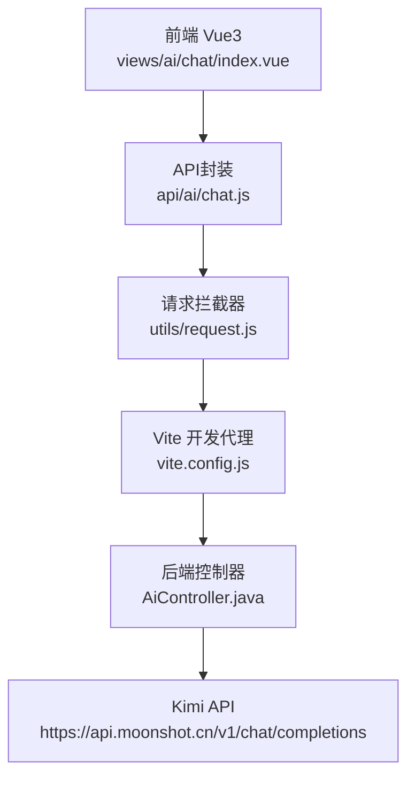
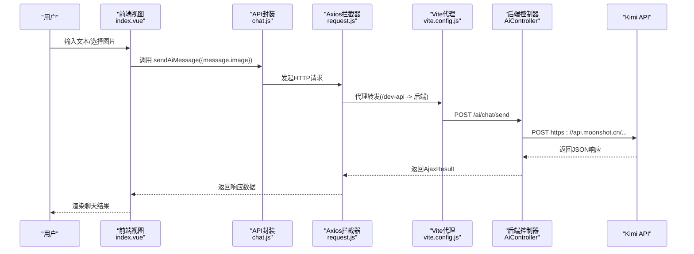
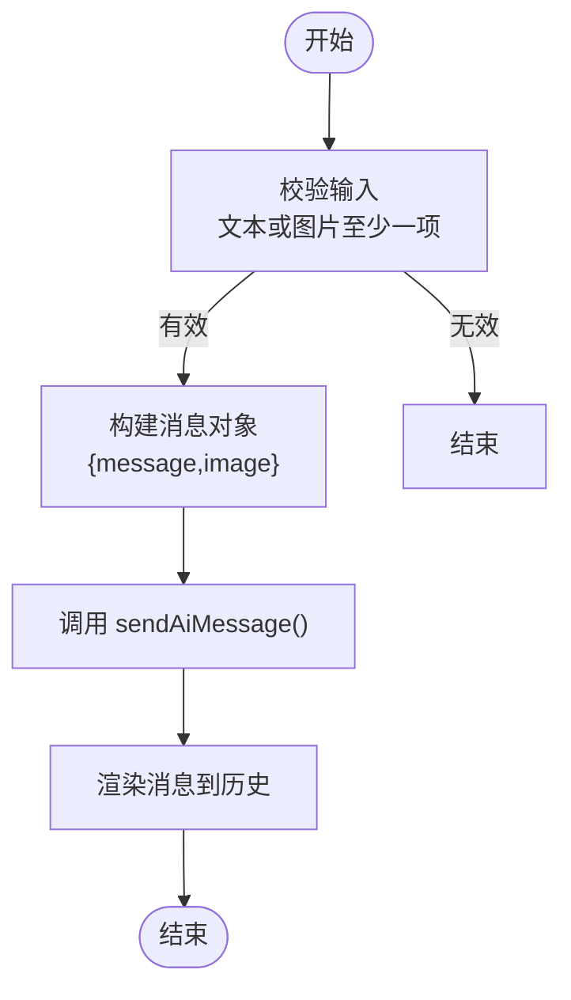
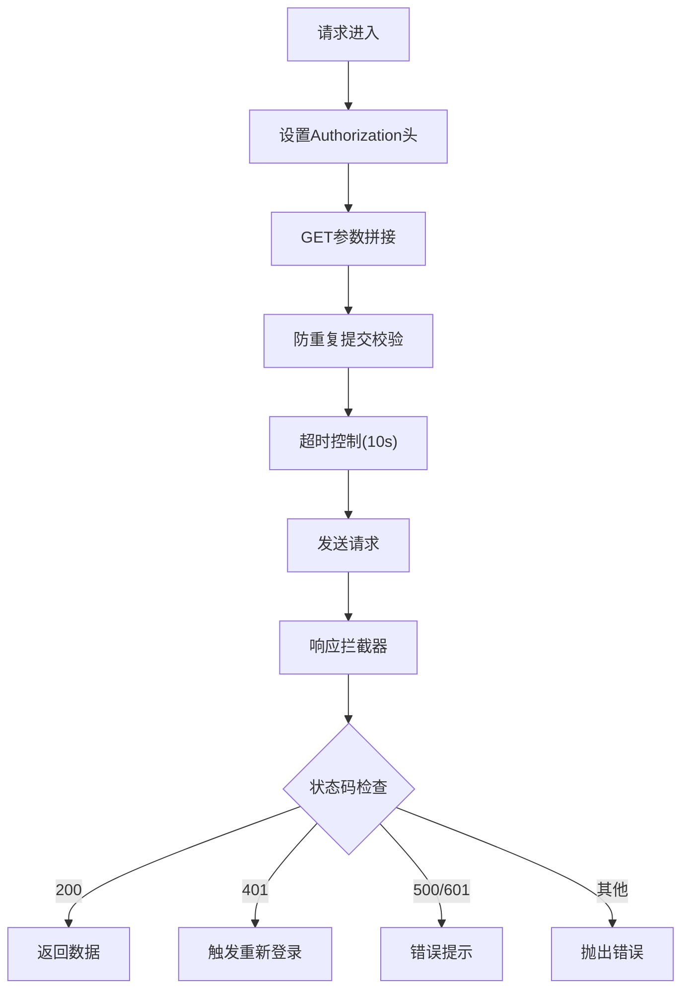
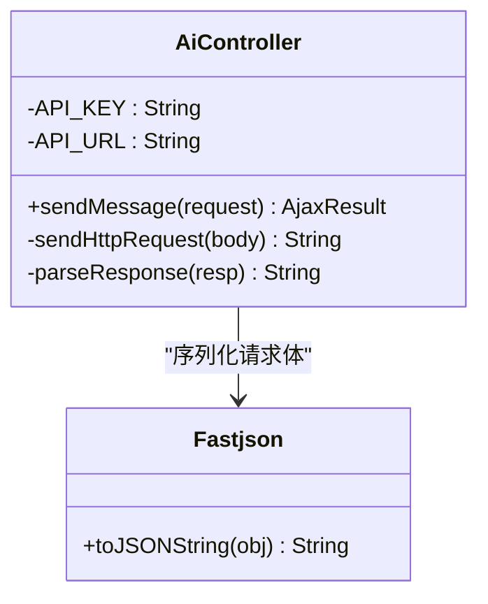
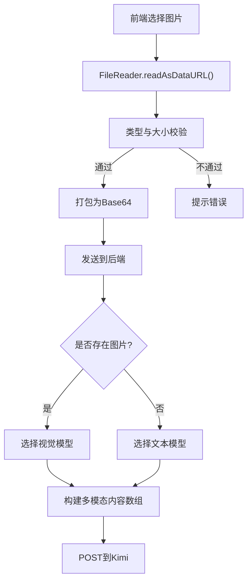
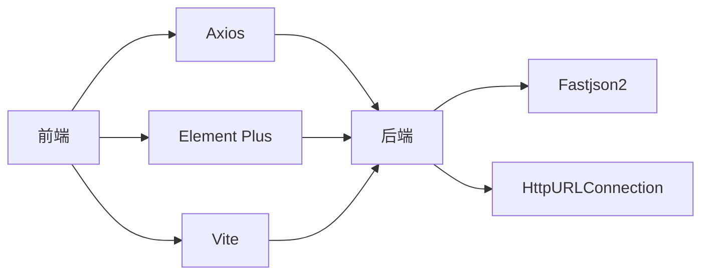

# AI集成架构

<cite>
**本文引用的文件**   
- [AiController.java](file://XingChen-Vue/xingchen-admin/src/main/java/com/xingchen/web/controller/al/AiController.java)
- [chat.js](file://XingChen-Vue3/src/api/ai/chat.js)
- [index.vue](file://XingChen-Vue3/src/views/ai/chat/index.vue)
- [request.js](file://XingChen-Vue3/src/utils/request.js)
- [vite.config.js](file://XingChen-Vue3/vite.config.js)
- [application.yml](file://XingChen-Vue/xingchen-admin/src/main/resources/application.yml)
- [SwaggerConfig.java](file://XingChen-Vue/xingchen-admin/src/main/java/com/xingchen/web/core/config/SwaggerConfig.java)
</cite>

## 目录
1. [简介](#简介)
2. [项目结构](#项目结构)
3. [核心组件](#核心组件)
4. [架构总览](#架构总览)
5. [详细组件分析](#详细组件分析)
6. [依赖分析](#依赖分析)
7. [性能考虑](#性能考虑)
8. [故障排查指南](#故障排查指南)
9. [结论](#结论)
10. [附录](#附录)

## 简介
本文件面向“AI集成架构”的技术文档，聚焦于前端Vue3应用与后端Spring Boot控制器之间的AI助手集成，以及与Kimi（Moonshot）大模型API的对接。文档覆盖以下要点：
- HTTP请求构建与认证机制
- 多模态输入处理（文本+图片）
- 数据格式转换与响应处理
- API密钥管理、请求超时、错误重试与性能优化
- 前后端交互协议与数据传输格式
- 架构图与数据流图

## 项目结构
本项目采用前后端分离架构：
- 前端（XingChen-Vue3）：基于Vue3 + Element Plus，负责用户界面、图片Base64编码、请求封装与展示
- 后端（XingChen-Vue）：基于Spring Boot，提供REST接口，转发Kimi API请求并解析响应
- 代理与环境：Vite开发代理将前端请求转发至后端；后端通过application.yml配置端口与日志等

图表来源
- [index.vue:108-227](file://XingChen-Vue3/src/views/ai/chat/index.vue#L108-L227)
- [chat.js:1-11](file://XingChen-Vue3/src/api/ai/chat.js#L1-L11)
- [request.js:1-154](file://XingChen-Vue3/src/utils/request.js#L1-L154)
- [vite.config.js:44-61](file://XingChen-Vue3/vite.config.js#L44-L61)
- [AiController.java:27-29](file://XingChen-Vue/xingchen-admin/src/main/java/com/xingchen/web/controller/al/AiController.java#L27-L29)

章节来源
- [index.vue:1-527](file://XingChen-Vue3/src/views/ai/chat/index.vue#L1-L527)
- [chat.js:1-11](file://XingChen-Vue3/src/api/ai/chat.js#L1-L11)
- [request.js:1-154](file://XingChen-Vue3/src/utils/request.js#L1-L154)
- [vite.config.js:1-80](file://XingChen-Vue3/vite.config.js#L1-L80)

## 核心组件
- 前端聊天视图：负责图片选择与Base64编码、文本输入、消息渲染与发送
- API封装：统一调用后端接口
- 请求拦截器：统一设置Authorization头、超时控制、重复提交防护
- 后端控制器：接收前端请求，构造Kimi请求体，发送HTTP请求并解析响应
- Swagger配置：定义Authorization头的API Key安全方案

章节来源
- [index.vue:145-227](file://XingChen-Vue3/src/views/ai/chat/index.vue#L145-L227)
- [chat.js:1-11](file://XingChen-Vue3/src/api/ai/chat.js#L1-L11)
- [request.js:23-124](file://XingChen-Vue3/src/utils/request.js#L23-L124)
- [AiController.java:37-163](file://XingChen-Vue/xingchen-admin/src/main/java/com/xingchen/web/controller/al/AiController.java#L37-L163)
- [SwaggerConfig.java:39-47](file://XingChen-Vue/xingchen-admin/src/main/java/com/xingchen/web/core/config/SwaggerConfig.java#L39-L47)

## 架构总览
整体交互流程如下：
- 前端将用户输入（文本、可选图片）打包为请求体，经API封装与Axios拦截器发送
- 开发环境下，Vite代理将/dev-api前缀的请求转发到后端
- 后端控制器根据是否存在图片选择不同模型，并构造Kimi请求体
- 后端向Kimi发起HTTP请求，读取响应并解析，最终返回给前端
- 前端接收后更新聊天历史并展示

图表来源
- [index.vue:181-227](file://XingChen-Vue3/src/views/ai/chat/index.vue#L181-L227)
- [chat.js:1-11](file://XingChen-Vue3/src/api/ai/chat.js#L1-L11)
- [request.js:16-21](file://XingChen-Vue3/src/utils/request.js#L16-L21)
- [vite.config.js:48-54](file://XingChen-Vue3/vite.config.js#L48-L54)
- [AiController.java:37-134](file://XingChen-Vue/xingchen-admin/src/main/java/com/xingchen/web/controller/al/AiController.java#L37-L134)

## 详细组件分析

### 前端组件：多模态聊天界面
- 图片处理：使用FileReader将图片转为Base64，限制大小与类型，支持移除
- 文本输入：支持多行输入与回车发送
- 消息渲染：区分用户与AI角色，支持图片预览与富文本换行
- 发送流程：将当前文本与Base64图片打包，调用API封装，捕获错误并提示

图表来源
- [index.vue:181-227](file://XingChen-Vue3/src/views/ai/chat/index.vue#L181-L227)

章节来源
- [index.vue:145-227](file://XingChen-Vue3/src/views/ai/chat/index.vue#L145-L227)

### API封装与请求拦截器
- API封装：统一路径与方法，便于后续扩展
- Axios拦截器：
  - 设置Authorization头（如存在）
  - GET参数拼接
  - 防重复提交（基于session缓存与时间间隔）
  - 统一响应处理与错误提示
  - 超时控制（默认10秒）

图表来源
- [request.js:23-124](file://XingChen-Vue3/src/utils/request.js#L23-L124)

章节来源
- [chat.js:1-11](file://XingChen-Vue3/src/api/ai/chat.js#L1-L11)
- [request.js:1-154](file://XingChen-Vue3/src/utils/request.js#L1-L154)

### 后端控制器：Kimi集成
- 模型选择策略：
  - 存在图片：使用支持视觉的模型
  - 仅文本：使用标准模型
- 请求体构建：
  - 角色与内容（文本或多模态数组）
  - 温度与最大token等参数
- 认证与转发：
  - 设置Content-Type与Authorization头
  - 使用Fastjson序列化请求体
  - 读取Kimi响应并解析
- 错误处理：
  - 解析Kimi错误字段并返回友好提示
  - 异常兜底返回错误信息

图表来源
- [AiController.java:37-163](file://XingChen-Vue/xingchen-admin/src/main/java/com/xingchen/web/controller/al/AiController.java#L37-L163)

章节来源
- [AiController.java:27-163](file://XingChen-Vue/xingchen-admin/src/main/java/com/xingchen/web/controller/al/AiController.java#L27-L163)

### 多模态输入处理（文本+图片）
- 前端：Base64编码、大小与类型校验
- 后端：根据是否存在图片动态选择模型与内容结构
- 数据格式：
  - 纯文本：content为字符串
  - 多模态：content为包含text与image_url的数组

图表来源
- [index.vue:145-165](file://XingChen-Vue3/src/views/ai/chat/index.vue#L145-L165)
- [AiController.java:50-79](file://XingChen-Vue/xingchen-admin/src/main/java/com/xingchen/web/controller/al/AiController.java#L50-L79)

章节来源
- [index.vue:145-165](file://XingChen-Vue3/src/views/ai/chat/index.vue#L145-L165)
- [AiController.java:50-79](file://XingChen-Vue/xingchen-admin/src/main/java/com/xingchen/web/controller/al/AiController.java#L50-L79)

### 认证机制与安全
- Swagger安全方案：定义API Key（Authorization头，Bearer）
- 前端Axios拦截器：可注入Authorization头（若存在token）
- 后端Kimi请求：显式设置Authorization头

章节来源
- [SwaggerConfig.java:39-47](file://XingChen-Vue/xingchen-admin/src/main/java/com/xingchen/web/core/config/SwaggerConfig.java#L39-L47)
- [request.js:31-33](file://XingChen-Vue3/src/utils/request.js#L31-L33)
- [AiController.java:103-104](file://XingChen-Vue/xingchen-admin/src/main/java/com/xingchen/web/controller/al/AiController.java#L103-L104)

### 响应处理与错误恢复
- 后端解析Kimi响应，优先读取choices.message.content
- 若返回error字段，提取message作为提示
- 前端统一捕获异常并提示“AI服务暂时不可用”
- Axios层对超时、网络错误进行统一提示

章节来源
- [AiController.java:139-163](file://XingChen-Vue/xingchen-admin/src/main/java/com/xingchen/web/controller/al/AiController.java#L139-L163)
- [index.vue:214-226](file://XingChen-Vue3/src/views/ai/chat/index.vue#L214-L226)
- [request.js:111-124](file://XingChen-Vue3/src/utils/request.js#L111-L124)

## 依赖分析
- 前端依赖
  - Axios：统一HTTP请求与拦截器
  - Element Plus：UI组件与消息提示
  - Vite：开发代理与构建工具
- 后端依赖
  - Fastjson2：JSON序列化与反序列化
  - Java HttpURLConnection：向Kimi发起HTTP请求
  - Spring Boot Web：REST接口与自动配置

图表来源
- [request.js:1-154](file://XingChen-Vue3/src/utils/request.js#L1-L154)
- [AiController.java:3-16](file://XingChen-Vue/xingchen-admin/src/main/java/com/xingchen/web/controller/al/AiController.java#L3-L16)

章节来源
- [request.js:1-154](file://XingChen-Vue3/src/utils/request.js#L1-L154)
- [AiController.java:1-16](file://XingChen-Vue/xingchen-admin/src/main/java/com/xingchen/web/controller/al/AiController.java#L1-L16)

## 性能考虑
- 前端
  - 图片Base64体积较大，建议在移动端谨慎使用；可考虑服务端直传或CDN
  - 防重复提交：拦截器基于session存储请求对象，避免短时间内重复提交
- 后端
  - 使用HttpURLConnection同步IO，适合轻量场景；高并发建议引入异步或连接池
  - JSON序列化使用Fastjson2，性能稳定
- 代理与超时
  - Vite开发代理简化跨域；生产环境建议由Nginx统一代理
  - Axios默认10秒超时，可根据网络状况调整

章节来源
- [index.vue:145-165](file://XingChen-Vue3/src/views/ai/chat/index.vue#L145-L165)
- [request.js:19-21](file://XingChen-Vue3/src/utils/request.js#L19-L21)
- [AiController.java:98-134](file://XingChen-Vue/xingchen-admin/src/main/java/com/xingchen/web/controller/al/AiController.java#L98-L134)

## 故障排查指南
- 网络与代理
  - 开发环境确认Vite代理规则是否正确匹配后端端口
  - 生产环境检查Nginx代理与CORS配置
- 认证与密钥
  - 后端Kimi API Key硬编码在控制器中，需替换为安全配置方式
  - Swagger安全方案与前端Authorization头保持一致
- 超时与重试
  - Axios层已内置超时提示；可在前端调用处增加重试逻辑（建议指数退避）
- 响应解析
  - 后端对Kimi错误字段有兜底提示；若仍为空，检查网络与模型选择

章节来源
- [vite.config.js:48-54](file://XingChen-Vue3/vite.config.js#L48-L54)
- [AiController.java:27-29](file://XingChen-Vue/xingchen-admin/src/main/java/com/xingchen/web/controller/al/AiController.java#L27-L29)
- [SwaggerConfig.java:39-47](file://XingChen-Vue/xingchen-admin/src/main/java/com/xingchen/web/core/config/SwaggerConfig.java#L39-L47)
- [request.js:111-124](file://XingChen-Vue3/src/utils/request.js#L111-L124)

## 结论
本架构以简洁清晰的方式实现了前端多模态输入与后端Kimi API的对接，具备良好的可扩展性。建议后续在以下方面持续优化：
- 安全：将API Key纳入配置中心或环境变量
- 性能：后端引入连接池与异步处理，前端优化图片传输
- 可靠性：前端增加指数退避重试与断网提示
- 可维护性：统一错误码与提示文案，完善接口文档

## 附录

### 前后端交互协议与数据传输格式
- 请求路径
  - 前端：/ai/chat/send
  - 后端：/ai/chat/send
- 请求方法：POST
- Content-Type：application/json
- 请求体字段
  - message：字符串（可选）
  - image：Base64字符串（可选）
- 响应体字段
  - data：AI回复内容
  - code/msg：状态码与提示信息

章节来源
- [chat.js:1-11](file://XingChen-Vue3/src/api/ai/chat.js#L1-L11)
- [AiController.java:37-93](file://XingChen-Vue/xingchen-admin/src/main/java/com/xingchen/web/controller/al/AiController.java#L37-L93)