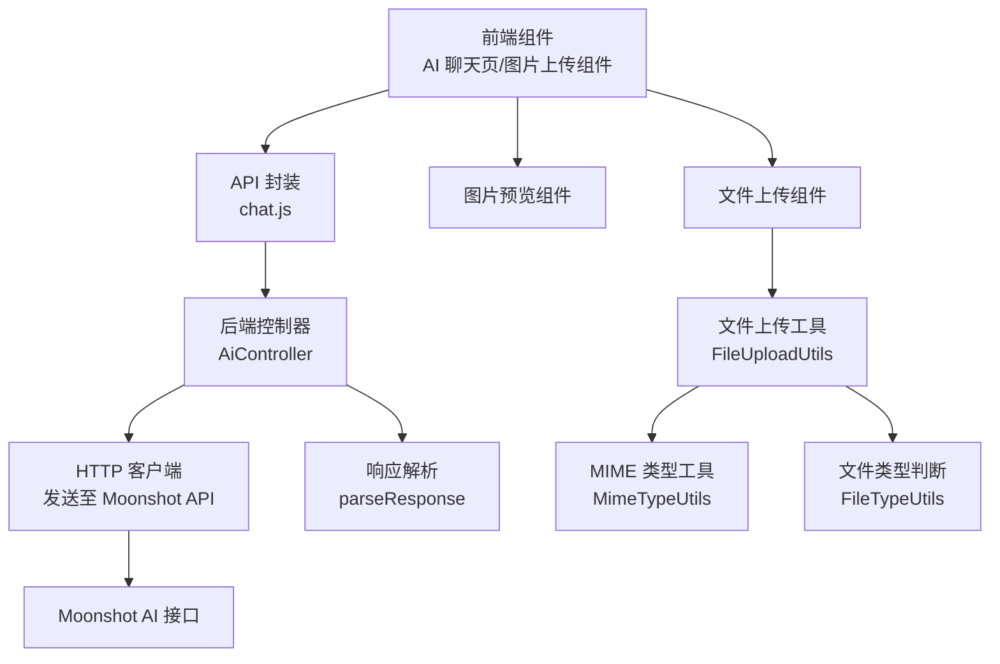
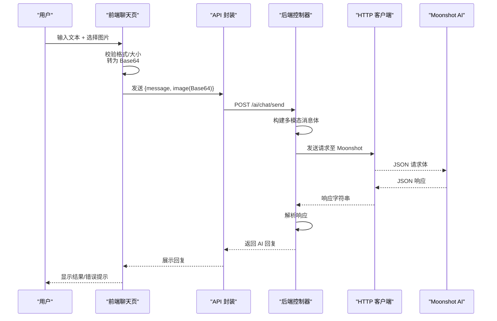
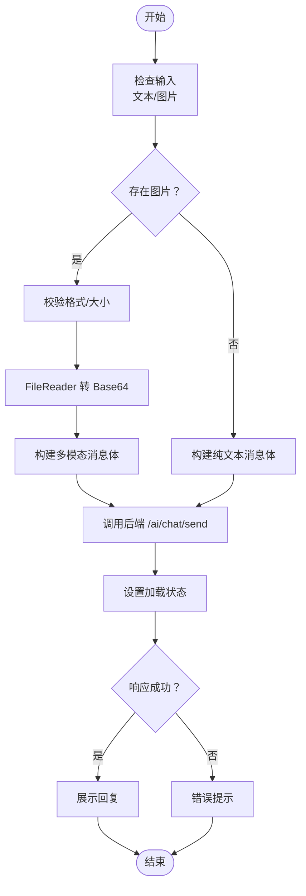
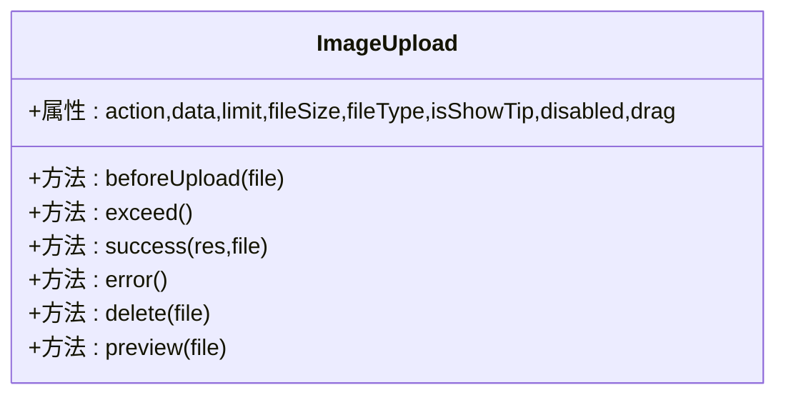
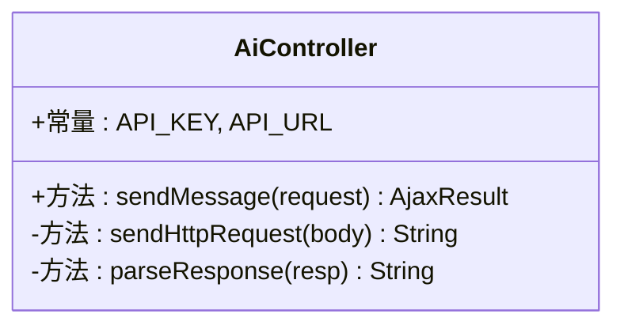
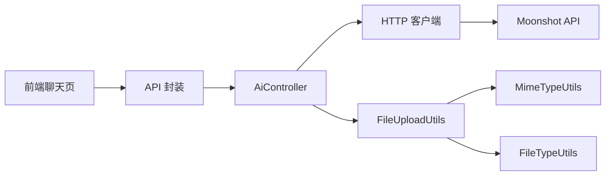

# 多模态处理

<cite>
**本文引用的文件**
- [AiController.java](file://XingChen-Vue/xingchen-admin/src/main/java/com/xingchen/web/controller/al/AiController.java)
- [index.vue（AI 聊天页）](file://XingChen-Vue3/src/views/ai/chat/index.vue)
- [chat.js（AI 聊天 API 封装）](file://XingChen-Vue3/src/api/ai/chat.js)
- [index.vue（图片上传组件）](file://XingChen-Vue3/src/components/ImageUpload/index.vue)
- [index.vue（图片预览组件）](file://XingChen-Vue3/src/components/ImagePreview/index.vue)
- [index.vue（文件上传组件）](file://XingChen-Vue3/src/components/FileUpload/index.vue)
- [FileUploadUtils.java（文件上传工具）](file://XingChen-Vue/xingchen-common/src/main/java/com/xingchen/common/utils/file/FileUploadUtils.java)
- [MimeTypeUtils.java（MIME 类型工具）](file://XingChen-Vue/xingchen-common/src/main/java/com/xingchen/common/utils/file/MimeTypeUtils.java)
- [FileTypeUtils.java（文件类型判断）](file://XingChen-Vue/xingchen-common/src/main/java/com/xingchen/common/utils/file/FileTypeUtils.java)
- [ImageUtils.java（图片读取工具）](file://XingChen-Vue/xingchen-common/src/main/java/com/xingchen/common/utils/file/ImageUtils.java)
- [InvalidExtensionException.java（无效扩展名异常）](file://XingChen-Vue/xingchen-common/src/main/java/com/xingchen/common/exception/file/InvalidExtensionException.java)
- [FileSizeLimitExceededException.java（文件大小超限异常）](file://XingChen-Vue/xingchen-common/src/main/java/com/xingchen/common/exception/file/FileSizeLimitExceededException.java)
- [GlobalExceptionHandler.java（全局异常处理）](file://XingChen-Vue/xingchen-framework/src/main/java/com/xingchen/framework/web/exception/GlobalExceptionHandler.java)
</cite>

## 目录
1. [简介](#简介)
2. [项目结构](#项目结构)
3. [核心组件](#核心组件)
4. [架构总览](#架构总览)
5. [详细组件分析](#详细组件分析)
6. [依赖关系分析](#依赖关系分析)
7. [性能考量](#性能考量)
8. [故障排查指南](#故障排查指南)
9. [结论](#结论)
10. [附录](#附录)

## 简介
本技术文档围绕“多模态处理”能力展开，重点说明文本与图片混合输入的处理机制，涵盖以下方面：
- Base64 图片格式转换与传输
- 多模态消息内容数组构建
- 多模态模型选择策略
- 不同输入场景的处理策略：纯文本对话、带图片描述、纯图片分析
- 图片上传限制、格式验证、大小控制与压缩优化建议
- 前端图片选择组件、后端图片处理逻辑与错误处理机制
- 多模态消息的 JSON 结构示例与最佳实践

## 项目结构
多模态处理涉及前后端协同：
- 前端负责图片选择、Base64 转换、消息组装与发送
- 后端负责接收请求、构建多模态消息体、调用第三方 AI 接口并解析响应
- 通用模块提供文件上传与图片读取能力

图表来源
- [index.vue（AI 聊天页）:145-165](file://XingChen-Vue3/src/views/ai/chat/index.vue#L145-L165)
- [chat.js（AI 聊天 API 封装）:1-11](file://XingChen-Vue3/src/api/ai/chat.js#L1-L11)
- [AiController.java:37-93](file://XingChen-Vue/xingchen-admin/src/main/java/com/xingchen/web/controller/al/AiController.java#L37-L93)
- [FileUploadUtils.java（文件上传工具）:102-139](file://XingChen-Vue/xingchen-common/src/main/java/com/xingchen/common/utils/file/FileUploadUtils.java#L102-L139)
- [MimeTypeUtils.java（MIME 类型工具）:40-59](file://XingChen-Vue/xingchen-common/src/main/java/com/xingchen/common/utils/file/MimeTypeUtils.java#L40-L59)
- [FileTypeUtils.java（文件类型判断）:53-76](file://XingChen-Vue/xingchen-common/src/main/java/com/xingchen/common/utils/file/FileTypeUtils.java#L53-L76)

章节来源
- [index.vue（AI 聊天页）:1-263](file://XingChen-Vue3/src/views/ai/chat/index.vue#L1-L263)
- [AiController.java:1-165](file://XingChen-Vue/xingchen-admin/src/main/java/com/xingchen/web/controller/al/AiController.java#L1-L165)
- [FileUploadUtils.java（文件上传工具）:1-261](file://XingChen-Vue/xingchen-common/src/main/java/com/xingchen/common/utils/file/FileUploadUtils.java#L1-L261)

## 核心组件
- 前端聊天页组件：负责图片选择与 Base64 转换、消息组装与发送、错误提示与加载状态管理
- 前端图片上传组件：封装图片上传、格式与大小校验、拖拽排序、预览与删除
- 前端文件上传组件：封装文件上传、格式与大小校验、列表展示与删除
- 后端控制器：接收请求、构建多模态消息体、调用 Moonshot API 并解析响应
- 通用文件上传工具：统一的文件上传、大小与扩展名校验、命名策略
- 通用图片工具：图片读取与流式输出

章节来源
- [index.vue（AI 聊天页）:108-227](file://XingChen-Vue3/src/views/ai/chat/index.vue#L108-L227)
- [index.vue（图片上传组件）:55-96](file://XingChen-Vue3/src/components/ImageUpload/index.vue#L55-L96)
- [index.vue（文件上传组件）:47-88](file://XingChen-Vue3/src/components/FileUpload/index.vue#L47-L88)
- [AiController.java:37-163](file://XingChen-Vue/xingchen-admin/src/main/java/com/xingchen/web/controller/al/AiController.java#L37-L163)
- [FileUploadUtils.java（文件上传工具）:102-139](file://XingChen-Vue/xingchen-common/src/main/java/com/xingchen/common/utils/file/FileUploadUtils.java#L102-L139)
- [ImageUtils.java（图片读取工具）:25-56](file://XingChen-Vue/xingchen-common/src/main/java/com/xingchen/common/utils/file/ImageUtils.java#L25-L56)

## 架构总览
多模态处理的端到端流程如下：

图表来源
- [index.vue（AI 聊天页）:182-227](file://XingChen-Vue3/src/views/ai/chat/index.vue#L182-L227)
- [chat.js（AI 聊天 API 封装）:4-10](file://XingChen-Vue3/src/api/ai/chat.js#L4-L10)
- [AiController.java:37-93](file://XingChen-Vue/xingchen-admin/src/main/java/com/xingchen/web/controller/al/AiController.java#L37-L93)
- [AiController.java:98-134](file://XingChen-Vue/xingchen-admin/src/main/java/com/xingchen/web/controller/al/AiController.java#L98-L134)
- [AiController.java:139-163](file://XingChen-Vue/xingchen-admin/src/main/java/com/xingchen/web/controller/al/AiController.java#L139-L163)

## 详细组件分析

### 前端聊天页（多模态消息发送）
- 图片选择与 Base64 转换：通过原生 FileReader 将所选图片转为 Base64，并在前端进行格式与大小校验
- 消息组装：将文本与 Base64 图片组合为多模态消息体，调用后端接口
- 错误处理：捕获异常并提示用户；加载状态控制发送按钮禁用

图表来源
- [index.vue（AI 聊天页）:145-165](file://XingChen-Vue3/src/views/ai/chat/index.vue#L145-L165)
- [index.vue（AI 聊天页）:182-227](file://XingChen-Vue3/src/views/ai/chat/index.vue#L182-L227)

章节来源
- [index.vue（AI 聊天页）:145-165](file://XingChen-Vue3/src/views/ai/chat/index.vue#L145-L165)
- [index.vue（AI 聊天页）:182-227](file://XingChen-Vue3/src/views/ai/chat/index.vue#L182-L227)

### 前端图片上传组件
- 支持多图上传、格式与大小限制、拖拽排序、预览与删除
- 组件属性灵活配置：上传地址、数量限制、文件大小、允许类型、是否显示提示、禁用状态等
- 上传成功后将文件名列表回传给父组件

图表来源
- [index.vue（图片上传组件）:55-96](file://XingChen-Vue3/src/components/ImageUpload/index.vue#L55-L96)
- [index.vue（图片上传组件）:134-166](file://XingChen-Vue3/src/components/ImageUpload/index.vue#L134-L166)
- [index.vue（图片上传组件）:174-212](file://XingChen-Vue3/src/components/ImageUpload/index.vue#L174-L212)

章节来源
- [index.vue（图片上传组件）:1-258](file://XingChen-Vue3/src/components/ImageUpload/index.vue#L1-L258)

### 前端文件上传组件
- 支持多文件上传、格式与大小限制、列表展示与删除
- 适用于非图片文件的上传场景

章节来源
- [index.vue（文件上传组件）:1-257](file://XingChen-Vue3/src/components/FileUpload/index.vue#L1-L257)

### 后端控制器（多模态消息构建与转发）
- 接收前端请求，区分纯文本与多模态输入
- 构建消息数组：文本与图片（Base64）分别作为独立条目
- 选择模型：多模态使用支持视觉的模型，纯文本使用标准模型
- 调用 Moonshot API 并解析响应，返回 AI 回复

图表来源
- [AiController.java:27-29](file://XingChen-Vue/xingchen-admin/src/main/java/com/xingchen/web/controller/al/AiController.java#L27-L29)
- [AiController.java:37-93](file://XingChen-Vue/xingchen-admin/src/main/java/com/xingchen/web/controller/al/AiController.java#L37-L93)
- [AiController.java:98-134](file://XingChen-Vue/xingchen-admin/src/main/java/com/xingchen/web/controller/al/AiController.java#L98-L134)
- [AiController.java:139-163](file://XingChen-Vue/xingchen-admin/src/main/java/com/xingchen/web/controller/al/AiController.java#L139-L163)

章节来源
- [AiController.java:37-93](file://XingChen-Vue/xingchen-admin/src/main/java/com/xingchen/web/controller/al/AiController.java#L37-L93)
- [AiController.java:98-134](file://XingChen-Vue/xingchen-admin/src/main/java/com/xingchen/web/controller/al/AiController.java#L98-L134)
- [AiController.java:139-163](file://XingChen-Vue/xingchen-admin/src/main/java/com/xingchen/web/controller/al/AiController.java#L139-L163)

### 通用文件上传工具与图片工具
- 文件上传工具：统一的文件上传入口、大小与扩展名校验、命名策略（日期目录 + 唯一文件名）
- 图片读取工具：支持本地与网络图片读取，返回字节数组或输入流

章节来源
- [FileUploadUtils.java（文件上传工具）:102-139](file://XingChen-Vue/xingchen-common/src/main/java/com/xingchen/common/utils/file/FileUploadUtils.java#L102-L139)
- [FileUploadUtils.java（文件上传工具）:186-224](file://XingChen-Vue/xingchen-common/src/main/java/com/xingchen/common/utils/file/FileUploadUtils.java#L186-L224)
- [ImageUtils.java（图片读取工具）:25-56](file://XingChen-Vue/xingchen-common/src/main/java/com/xingchen/common/utils/file/ImageUtils.java#L25-L56)

## 依赖关系分析
- 前端聊天页依赖 API 封装与 Element Plus 组件库
- API 封装调用后端控制器
- 后端控制器依赖 HTTP 客户端与 Moonshot API
- 通用工具类提供文件与图片处理能力

图表来源
- [chat.js（AI 聊天 API 封装）:1-11](file://XingChen-Vue3/src/api/ai/chat.js#L1-L11)
- [AiController.java:98-134](file://XingChen-Vue/xingchen-admin/src/main/java/com/xingchen/web/controller/al/AiController.java#L98-L134)
- [FileUploadUtils.java（文件上传工具）:102-139](file://XingChen-Vue/xingchen-common/src/main/java/com/xingchen/common/utils/file/FileUploadUtils.java#L102-L139)
- [MimeTypeUtils.java（MIME 类型工具）:40-59](file://XingChen-Vue/xingchen-common/src/main/java/com/xingchen/common/utils/file/MimeTypeUtils.java#L40-L59)
- [FileTypeUtils.java（文件类型判断）:53-76](file://XingChen-Vue/xingchen-common/src/main/java/com/xingchen/common/utils/file/FileTypeUtils.java#L53-L76)

章节来源
- [index.vue（AI 聊天页）:1-263](file://XingChen-Vue3/src/views/ai/chat/index.vue#L1-L263)
- [AiController.java:1-165](file://XingChen-Vue/xingchen-admin/src/main/java/com/xingchen/web/controller/al/AiController.java#L1-L165)
- [FileUploadUtils.java（文件上传工具）:1-261](file://XingChen-Vue/xingchen-common/src/main/java/com/xingchen/common/utils/file/FileUploadUtils.java#L1-L261)

## 性能考量
- 前端 Base64 转换：大图会显著增加请求体体积，建议在前端进行压缩或尺寸裁剪后再上传
- 后端请求体大小：多模态消息包含 Base64 数据，需关注网络传输与解析开销
- 模型选择：多模态模型通常更重，建议在需要视觉理解时才启用，纯文本场景使用轻量模型
- 缓存与预览：图片预览与列表渲染应避免重复计算，保持组件状态稳定

## 故障排查指南
- 前端错误处理
  - 图片格式不正确：检查组件的 fileType 配置与文件类型判断逻辑
  - 图片大小超限：根据 fileSize 限制提示用户
  - 发送按钮禁用：确认 loading 状态与输入合法性
- 后端错误处理
  - 请求解析异常：检查请求体结构与字段
  - Moonshot API 异常：解析响应中的 error 字段并提示用户
  - 全局异常：框架层统一捕获并返回标准化错误信息
- 文件上传异常
  - 无效扩展名：检查 allowedExtension 与 MIME 类型映射
  - 文件大小超限：调整 DEFAULT_MAX_SIZE 或提示用户

章节来源
- [index.vue（AI 聊天页）:145-165](file://XingChen-Vue3/src/views/ai/chat/index.vue#L145-L165)
- [AiController.java:89-92](file://XingChen-Vue/xingchen-admin/src/main/java/com/xingchen/web/controller/al/AiController.java#L89-L92)
- [AiController.java:139-163](file://XingChen-Vue/xingchen-admin/src/main/java/com/xingchen/web/controller/al/AiController.java#L139-L163)
- [InvalidExtensionException.java（无效扩展名异常）:18-24](file://XingChen-Vue/xingchen-common/src/main/java/com/xingchen/common/exception/file/InvalidExtensionException.java#L18-L24)
- [FileSizeLimitExceededException.java（文件大小超限异常）:12-15](file://XingChen-Vue/xingchen-common/src/main/java/com/xingchen/common/exception/file/FileSizeLimitExceededException.java#L12-L15)
- [GlobalExceptionHandler.java（全局异常处理）:140-144](file://XingChen-Vue/xingchen-framework/src/main/java/com/xingchen/framework/web/exception/GlobalExceptionHandler.java#L140-L144)

## 结论
本项目实现了从前端到后端的完整多模态处理链路：前端负责图片选择与 Base64 转换、消息组装与发送；后端负责多模态消息构建与 Moonshot API 调用；通用工具提供文件与图片处理能力。通过合理的上传限制、格式验证与错误处理，系统在可用性与稳定性之间取得平衡。建议在生产环境中进一步引入前端图片压缩与尺寸裁剪策略，以提升传输效率与用户体验。

## 附录

### 多模态消息 JSON 结构示例
- 纯文本对话
  - 请求体字段：message（字符串），image（可选）
  - 后端消息数组：单条文本内容
  - 模型选择：标准模型
- 带图片描述
  - 请求体字段：message（字符串），image（Base64）
  - 后端消息数组：文本条目 + 图片条目（image_url）
  - 模型选择：支持视觉的模型
- 纯图片分析
  - 请求体字段：message（可为空），image（Base64）
  - 后端消息数组：文本条目（默认提示） + 图片条目
  - 模型选择：支持视觉的模型

章节来源
- [AiController.java:50-74](file://XingChen-Vue/xingchen-admin/src/main/java/com/xingchen/web/controller/al/AiController.java#L50-L74)

### 最佳实践
- 前端
  - 在上传前进行格式与大小校验，避免无效请求
  - 对大图进行压缩或尺寸裁剪，降低 Base64 体积
  - 提供清晰的错误提示与加载状态反馈
- 后端
  - 明确区分纯文本与多模态场景，选择合适的模型
  - 对 Moonshot API 响应进行健壮解析，兜底错误信息
  - 统一异常处理，保证对外返回一致的错误格式
- 通用工具
  - 使用统一的文件上传工具，确保命名与存储策略一致
  - 对图片读取进行容错处理，避免异常中断