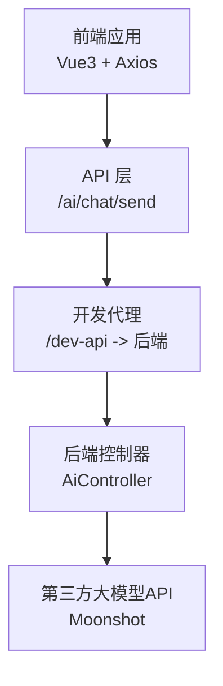
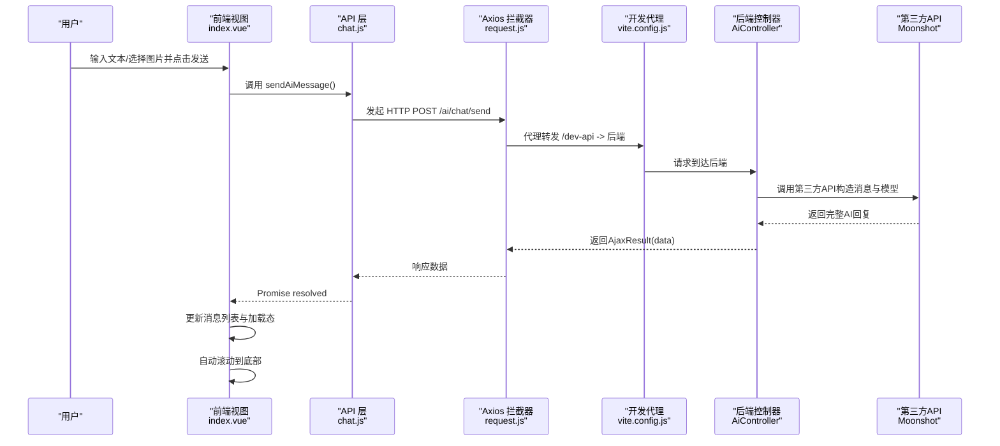
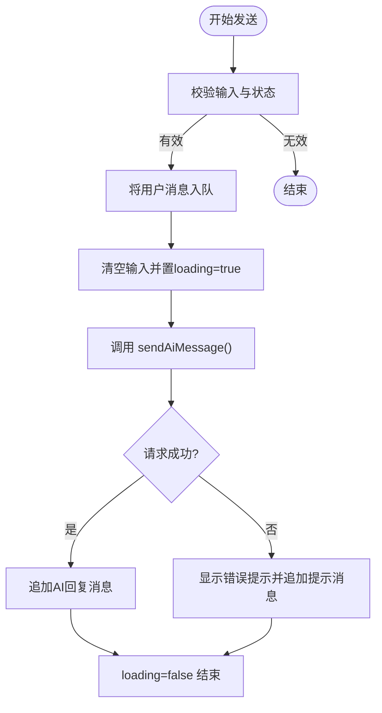
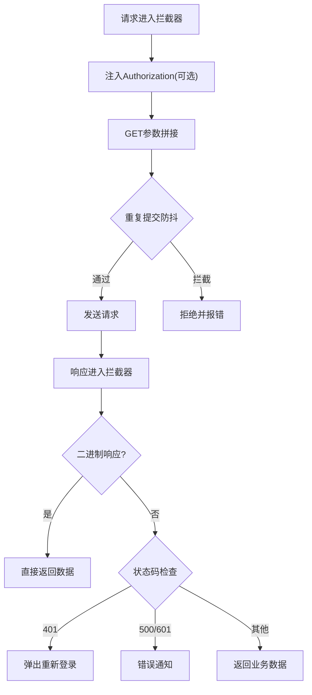
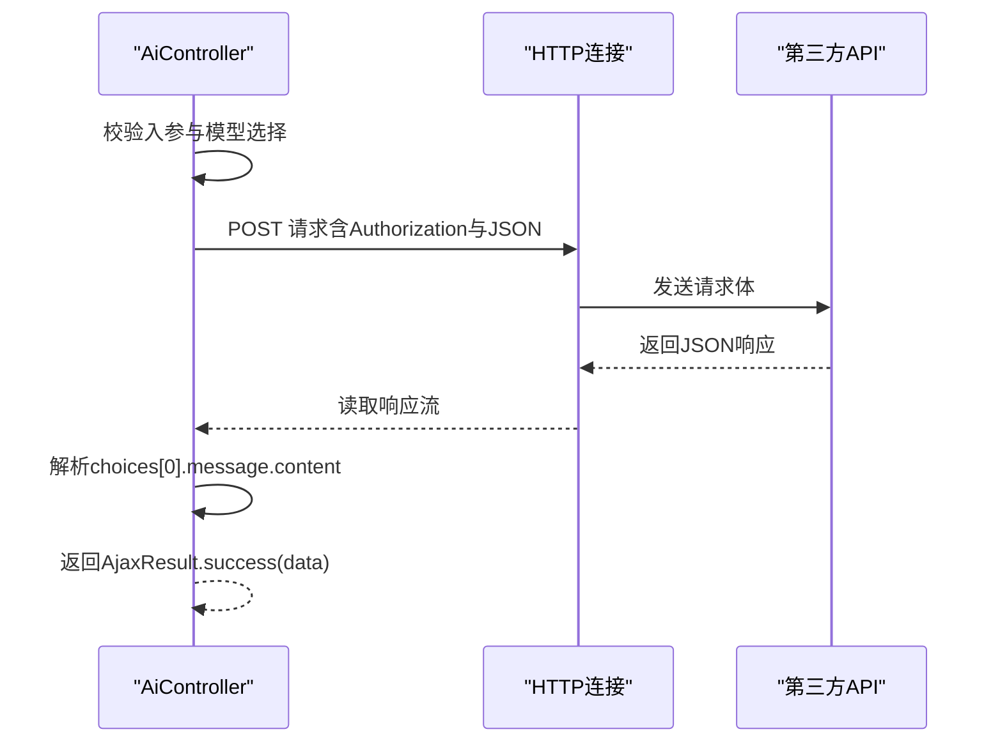
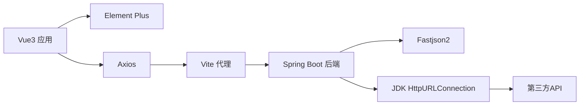

# 实时通信

<cite>
**本文引用的文件**
- [XingChen-Vue3/src/views/ai/chat/index.vue](file://XingChen-Vue3/src/views/ai/chat/index.vue)
- [XingChen-Vue3/src/api/ai/chat.js](file://XingChen-Vue3/src/api/ai/chat.js)
- [XingChen-Vue3/src/utils/request.js](file://XingChen-Vue3/src/utils/request.js)
- [XingChen-Vue3/vite.config.js](file://XingChen-Vue3/vite.config.js)
- [XingChen-Vue/xingchen-admin/src/main/java/com/xingchen/web/controller/al/AiController.java](file://XingChen-Vue/xingchen-admin/src/main/java/com/xingchen/web/controller/al/AiController.java)
</cite>

## 目录
1. [简介](#简介)
2. [项目结构](#项目结构)
3. [核心组件](#核心组件)
4. [架构总览](#架构总览)
5. [详细组件分析](#详细组件分析)
6. [依赖分析](#依赖分析)
7. [性能考虑](#性能考虑)
8. [故障排查指南](#故障排查指南)
9. [结论](#结论)
10. [附录](#附录)

## 简介
本文件面向“实时通信”的技术文档目标，聚焦于AI回复的“近实时”交互体验。当前仓库实现采用“短轮询式近实时”方案：前端通过HTTP请求向后端发起对话请求，后端对接第三方大模型API获取回复，后端一次性返回完整结果，前端在收到响应后即时更新UI。该方案未使用长轮询、WebSocket或Server-Sent Events，而是通过快速的HTTP往返实现接近实时的交互体验。

本方案的优势在于实现简单、兼容性强；劣势在于每次对话均需一次完整请求，无法实现“边生成边显示”的流式增量渲染。后续如需升级为真正的流式传输（如SSE或WebSocket），可在现有HTTP接口基础上扩展。

## 项目结构
围绕AI聊天的前端与后端模块如下：
- 前端
  - 视图层：AI聊天页面负责用户输入、图片上传、消息渲染与滚动
  - API层：封装对后端“/ai/chat/send”的POST请求
  - 工具层：基于Axios的请求封装，统一拦截器、超时与错误处理
  - 开发代理：Vite配置将/dev-api前缀代理至后端服务
- 后端
  - 控制器：接收前端消息与可选图片，构造请求体并调用第三方大模型API，解析响应后返回给前端

图表来源
- [XingChen-Vue3/src/views/ai/chat/index.vue](file://XingChen-Vue3/src/views/ai/chat/index.vue)
- [XingChen-Vue3/src/api/ai/chat.js](file://XingChen-Vue3/src/api/ai/chat.js)
- [XingChen-Vue3/src/utils/request.js](file://XingChen-Vue3/src/utils/request.js)
- [XingChen-Vue3/vite.config.js](file://XingChen-Vue3/vite.config.js)
- [XingChen-Vue/xingchen-admin/src/main/java/com/xingchen/web/controller/al/AiController.java](file://XingChen-Vue/xingchen-admin/src/main/java/com/xingchen/web/controller/al/AiController.java)

章节来源
- [XingChen-Vue3/src/views/ai/chat/index.vue](file://XingChen-Vue3/src/views/ai/chat/index.vue)
- [XingChen-Vue3/src/api/ai/chat.js](file://XingChen-Vue3/src/api/ai/chat.js)
- [XingChen-Vue3/src/utils/request.js](file://XingChen-Vue3/src/utils/request.js)
- [XingChen-Vue3/vite.config.js](file://XingChen-Vue3/vite.config.js)
- [XingChen-Vue/xingchen-admin/src/main/java/com/xingchen/web/controller/al/AiController.java](file://XingChen-Vue/xingchen-admin/src/main/java/com/xingchen/web/controller/al/AiController.java)

## 核心组件
- 前端聊天视图
  - 维护消息列表、输入框、图片预览与加载态
  - 监听消息与加载状态变化，自动滚动至底部
  - 支持回车发送、Shift+Enter换行、图片Base64上传
- 前端API封装
  - 对“/ai/chat/send”进行POST请求封装
- 请求拦截器
  - 统一设置基础URL、超时、Token、重复提交防抖
  - 统一错误提示与状态码处理
- 后端控制器
  - 接收消息与图片，动态选择模型（纯文本/多模态）
  - 调用第三方API，解析响应并返回给前端

章节来源
- [XingChen-Vue3/src/views/ai/chat/index.vue](file://XingChen-Vue3/src/views/ai/chat/index.vue)
- [XingChen-Vue3/src/api/ai/chat.js](file://XingChen-Vue3/src/api/ai/chat.js)
- [XingChen-Vue3/src/utils/request.js](file://XingChen-Vue3/src/utils/request.js)
- [XingChen-Vue/xingchen-admin/src/main/java/com/xingchen/web/controller/al/AiController.java](file://XingChen-Vue/xingchen-admin/src/main/java/com/xingchen/web/controller/al/AiController.java)

## 架构总览
下图展示了从用户输入到AI回复的端到端流程，以及前后端交互的关键节点。

图表来源
- [XingChen-Vue3/src/views/ai/chat/index.vue](file://XingChen-Vue3/src/views/ai/chat/index.vue)
- [XingChen-Vue3/src/api/ai/chat.js](file://XingChen-Vue3/src/api/ai/chat.js)
- [XingChen-Vue3/src/utils/request.js](file://XingChen-Vue3/src/utils/request.js)
- [XingChen-Vue3/vite.config.js](file://XingChen-Vue3/vite.config.js)
- [XingChen-Vue/xingchen-admin/src/main/java/com/xingchen/web/controller/al/AiController.java](file://XingChen-Vue/xingchen-admin/src/main/java/com/xingchen/web/controller/al/AiController.java)

## 详细组件分析

### 前端聊天视图（消息流与UI）
- 数据与状态
  - messages：消息数组，包含role、content、image字段
  - inputText：文本输入
  - selectedImageBase64：图片Base64
  - loading：请求中状态
  - chatHistoryRef：滚动容器引用
- 关键逻辑
  - 监听messages与loading变化，触发nextTick后滚动到底部
  - 格式化文本内容，将换行符转换为HTML换行
  - 图片上传校验（类型与大小），读取为Base64并预览
  - 回车发送：仅Enter发送，Shift+Enter换行
  - 发送流程：将用户消息入队 → 清空输入 → loading=true → 调用API → 成功后追加AI回复 → 失败时提示并追加错误消息 → loading=false
- 增量显示与流式传输
  - 当前实现为一次性接收完整回复，不支持边生成边显示
  - 若需流式传输，可在API层改为事件流解析或WebSocket订阅，并在视图层逐段追加内容

图表来源
- [XingChen-Vue3/src/views/ai/chat/index.vue](file://XingChen-Vue3/src/views/ai/chat/index.vue)

章节来源
- [XingChen-Vue3/src/views/ai/chat/index.vue](file://XingChen-Vue3/src/views/ai/chat/index.vue)

### 前端API与请求拦截器
- API封装
  - 对“/ai/chat/send”进行POST请求封装，传入message与image
- Axios拦截器
  - 基础配置：baseURL来自环境变量、超时10秒
  - 请求拦截：注入Token、GET参数拼接、重复提交防抖（5MB限制）
  - 响应拦截：统一状态码处理、错误提示、401重定向登录
  - 错误分类：网络错误、超时、状态码异常等统一提示

图表来源
- [XingChen-Vue3/src/utils/request.js](file://XingChen-Vue3/src/utils/request.js)

章节来源
- [XingChen-Vue3/src/api/ai/chat.js](file://XingChen-Vue3/src/api/ai/chat.js)
- [XingChen-Vue3/src/utils/request.js](file://XingChen-Vue3/src/utils/request.js)

### 后端控制器（第三方API对接）
- 入参处理
  - 读取message与可选image
- 模型选择
  - 存在图片：使用支持视觉的模型
  - 无图片：使用标准模型
- 请求构造
  - 构造messages数组与模型参数（temperature、max_tokens）
  - 设置Authorization头与JSON内容类型
- 响应解析
  - 解析choices[0].message.content作为回复
  - 异常时返回错误信息

图表来源
- [XingChen-Vue/xingchen-admin/src/main/java/com/xingchen/web/controller/al/AiController.java](file://XingChen-Vue/xingchen-admin/src/main/java/com/xingchen/web/controller/al/AiController.java)

章节来源
- [XingChen-Vue/xingchen-admin/src/main/java/com/xingchen/web/controller/al/AiController.java](file://XingChen-Vue/xingchen-admin/src/main/java/com/xingchen/web/controller/al/AiController.java)

### 开发代理与跨域
- Vite开发代理
  - 将/dev-api前缀转发至后端服务地址
  - 便于前端在本地开发时避免跨域问题
- 生产部署
  - 通过Nginx或其他网关统一代理后端接口，确保同源或正确CORS

章节来源
- [XingChen-Vue3/vite.config.js](file://XingChen-Vue3/vite.config.js)

## 依赖分析
- 前端依赖
  - Vue3：响应式与组件化
  - Element Plus：UI组件库
  - Axios：HTTP请求封装
  - Vite：开发与打包工具
- 后端依赖
  - Spring Boot Web：REST控制器
  - Fastjson2：JSON序列化与解析
  - JDK HttpURLConnection：对外部API调用

图表来源
- [XingChen-Vue3/src/views/ai/chat/index.vue](file://XingChen-Vue3/src/views/ai/chat/index.vue)
- [XingChen-Vue3/src/utils/request.js](file://XingChen-Vue3/src/utils/request.js)
- [XingChen-Vue3/vite.config.js](file://XingChen-Vue3/vite.config.js)
- [XingChen-Vue/xingchen-admin/src/main/java/com/xingchen/web/controller/al/AiController.java](file://XingChen-Vue/xingchen-admin/src/main/java/com/xingchen/web/controller/al/AiController.java)

章节来源
- [XingChen-Vue3/src/views/ai/chat/index.vue](file://XingChen-Vue3/src/views/ai/chat/index.vue)
- [XingChen-Vue3/src/utils/request.js](file://XingChen-Vue3/src/utils/request.js)
- [XingChen-Vue3/vite.config.js](file://XingChen-Vue3/vite.config.js)
- [XingChen-Vue/xingchen-admin/src/main/java/com/xingchen/web/controller/al/AiController.java](file://XingChen-Vue/xingchen-admin/src/main/java/com/xingchen/web/controller/al/AiController.java)

## 性能考虑
- 前端
  - 避免在消息列表中存储大型图片对象，已使用Base64字符串，注意内存占用
  - 自动滚动使用nextTick保证DOM更新后再滚动，减少重排
  - 重复提交防抖：对POST/PUT请求进行时间窗口内的重复提交拦截
- 后端
  - 单次请求完成AI回复，避免长连接带来的资源开销
  - 响应解析仅提取必要字段，降低序列化成本
- 网络
  - Axios超时10秒，可根据实际场景调整
  - 开发代理简化跨域，生产环境建议由网关统一处理

[本节为通用指导，无需特定文件引用]

## 故障排查指南
- 常见错误与定位
  - 网络错误：Axios拦截器将“Network Error”归因为后端接口连接异常
  - 超时：拦截器将包含“timeout”的错误信息归因为系统接口请求超时
  - 状态码异常：拦截器将包含“Request failed with status code”的错误映射为对应状态码提示
  - 401：拦截器触发重新登录流程
- 前端UI反馈
  - 发送失败时在消息列表追加错误提示，避免用户困惑
- 后端异常
  - 第三方API返回错误时，控制器解析错误并返回友好提示
- 建议排查步骤
  - 检查前端控制台与拦截器错误提示
  - 确认开发代理配置与后端服务可达性
  - 核对Authorization头与请求体格式
  - 查看后端日志与第三方API返回状态

章节来源
- [XingChen-Vue3/src/utils/request.js](file://XingChen-Vue3/src/utils/request.js)
- [XingChen-Vue/xingchen-admin/src/main/java/com/xingchen/web/controller/al/AiController.java](file://XingChen-Vue/xingchen-admin/src/main/java/com/xingchen/web/controller/al/AiController.java)

## 结论
当前实现以“短轮询式近实时”满足AI聊天的交互需求：前端发送请求，后端一次性返回完整回复，前端即时渲染。该方案简单可靠，适合快速迭代与稳定运行。若未来需要更流畅的“边生成边显示”体验，可在现有HTTP接口基础上引入SSE或WebSocket，以事件流或双向通道实现真正的流式传输与增量渲染。

[本节为总结性内容，无需特定文件引用]

## 附录

### 近实时方案对比与演进建议
- 现状
  - 方式：HTTP短轮询
  - 特点：实现简单、兼容好、延迟取决于网络与第三方API响应
- 可选演进
  - SSE（Server-Sent Events）
    - 优点：单向推送、实现相对简单
    - 缺点：浏览器兼容性、断线需重连
  - WebSocket
    - 优点：双向、低延迟、可扩展
    - 缺点：实现复杂度较高
  - 长轮询
    - 优点：兼容性好
    - 缺点：频繁建立连接，资源消耗较大
- 建议
  - 若第三方API支持流式输出，优先采用SSE；否则可先维持现状，后续再评估升级

[本节为概念性内容，无需特定文件引用]