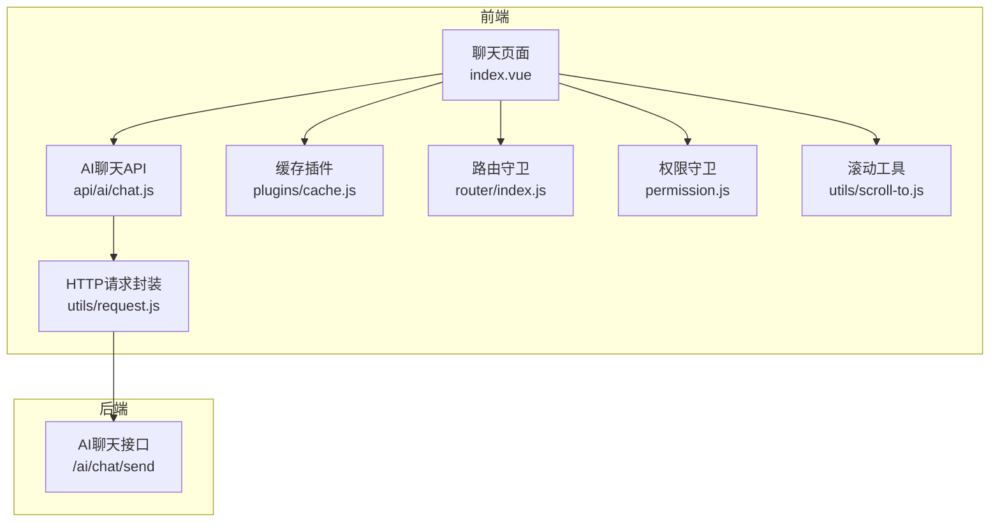
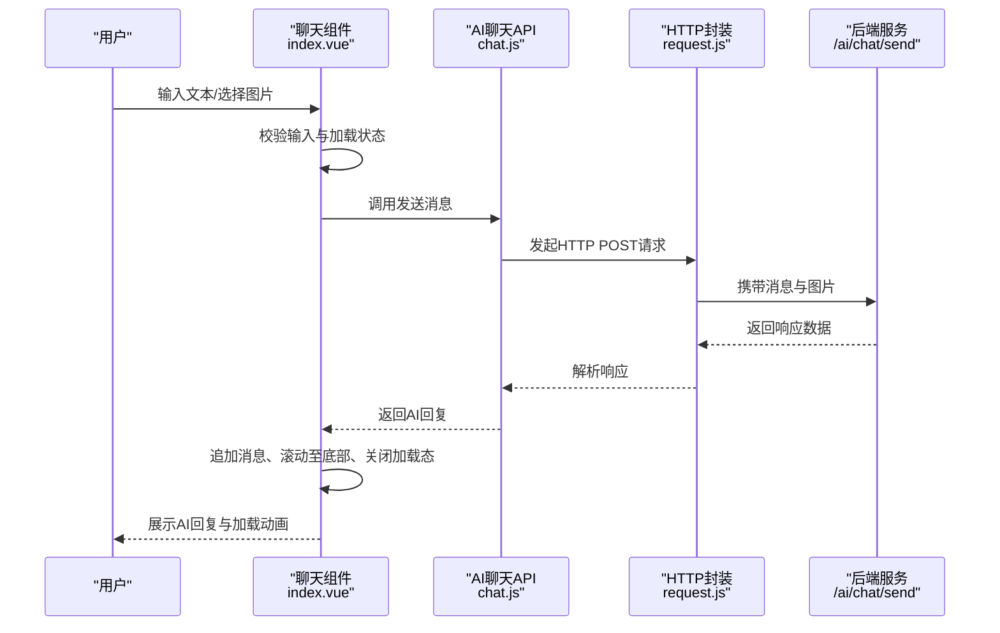
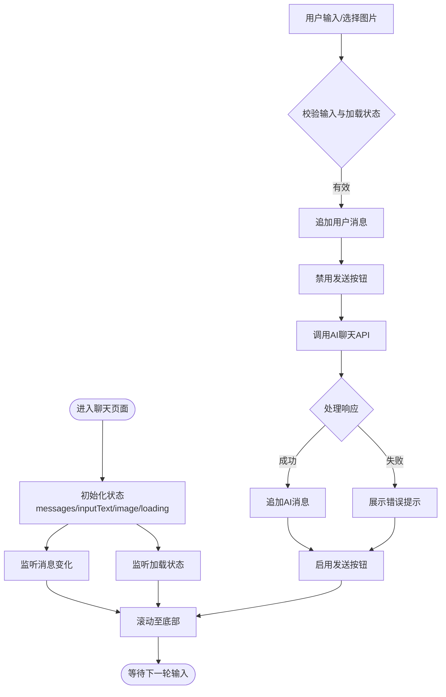
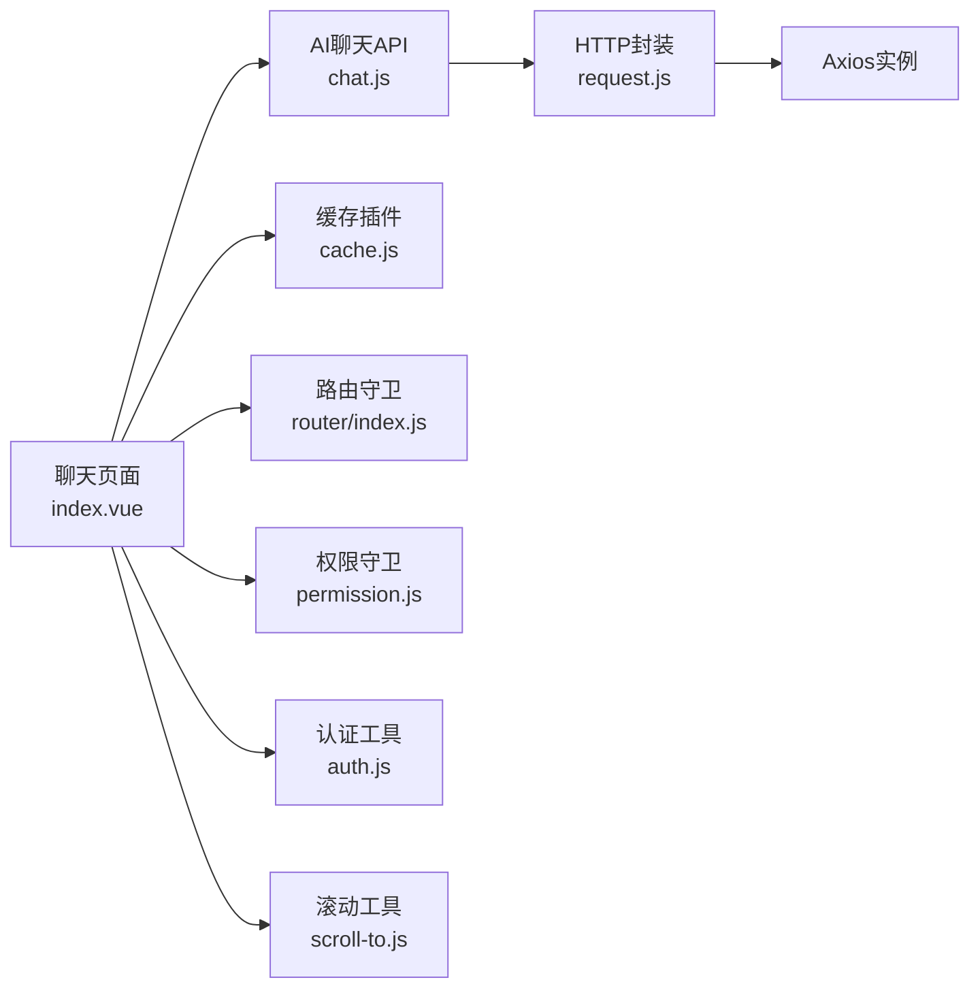

# 对话管理

<cite>
**本文引用的文件**
- [index.vue](file://XingChen-Vue3/src/views/ai/chat/index.vue)
- [chat.js](file://XingChen-Vue3/src/api/ai/chat.js)
- [request.js](file://XingChen-Vue3/src/utils/request.js)
- [cache.js](file://XingChen-Vue3/src/plugins/cache.js)
- [auth.js](file://XingChen-Vue3/src/utils/auth.js)
- [router/index.js](file://XingChen-Vue3/src/router/index.js)
- [permission.js](file://XingChen-Vue3/src/permission.js)
- [scroll-to.js](file://XingChen-Vue3/src/utils/scroll-to.js)
</cite>

## 目录
1. [简介](#简介)
2. [项目结构](#项目结构)
3. [核心组件](#核心组件)
4. [架构总览](#架构总览)
5. [详细组件分析](#详细组件分析)
6. [依赖关系分析](#依赖关系分析)
7. [性能考量](#性能考量)
8. [故障排查指南](#故障排查指南)
9. [结论](#结论)
10. [附录](#附录)

## 简介
本文件面向“对话管理系统”的前端实现，聚焦于AI对话的前端交互设计与工程化实践，涵盖以下关键主题：
- 消息列表渲染：用户消息与AI助手消息的差异化展示、图片消息支持、空状态提示。
- 用户输入处理：文本输入、图片上传预览、回车键行为控制（Enter发送、Shift+Enter换行）。
- 发送状态管理：加载态显示、禁用态控制、错误提示与兜底文案。
- 实时响应显示：滚动至底部、加载动画点阵、消息气泡样式。
- 历史存储策略：会话级与本地级缓存的使用建议与边界。
- 通信方式选择：当前实现采用HTTP短连接（POST），未使用WebSocket；可选策略与迁移建议。
- 组件结构、事件处理与状态管理最佳实践。

## 项目结构
对话界面位于Vue 3单文件组件中，通过API模块发起HTTP请求，借助Element Plus组件库完成UI呈现与交互反馈，Axios封装统一处理请求/响应拦截与错误提示。

图表来源
- [index.vue:1-106](file://XingChen-Vue3/src/views/ai/chat/index.vue#L1-L106)
- [chat.js:1-11](file://XingChen-Vue3/src/api/ai/chat.js#L1-L11)
- [request.js:1-154](file://XingChen-Vue3/src/utils/request.js#L1-L154)
- [cache.js:1-80](file://XingChen-Vue3/src/plugins/cache.js#L1-L80)
- [router/index.js:1-197](file://XingChen-Vue3/src/router/index.js#L1-L197)
- [permission.js:39-77](file://XingChen-Vue3/src/permission.js#L39-L77)
- [scroll-to.js:1-43](file://XingChen-Vue3/src/utils/scroll-to.js#L1-L43)

章节来源
- [index.vue:1-106](file://XingChen-Vue3/src/views/ai/chat/index.vue#L1-L106)
- [chat.js:1-11](file://XingChen-Vue3/src/api/ai/chat.js#L1-L11)
- [request.js:1-154](file://XingChen-Vue3/src/utils/request.js#L1-L154)
- [cache.js:1-80](file://XingChen-Vue3/src/plugins/cache.js#L1-L80)
- [router/index.js:1-197](file://XingChen-Vue3/src/router/index.js#L1-L197)
- [permission.js:39-77](file://XingChen-Vue3/src/permission.js#L39-L77)
- [scroll-to.js:1-43](file://XingChen-Vue3/src/utils/scroll-to.js#L1-L43)

## 核心组件
- 聊天页面组件：负责消息列表渲染、输入区交互、发送流程、滚动控制与加载态展示。
- AI聊天API：封装对后端“发送AI消息”接口的调用。
- HTTP请求封装：统一处理请求头、Token注入、重复提交防护、响应错误提示与超时处理。
- 缓存插件：提供会话级与本地级缓存能力，可用于持久化对话上下文或临时状态。
- 路由与权限：确保用户登录态与访问权限，保障对话入口安全。
- 滚动工具：提供平滑滚动能力，辅助自动滚动至底部。

章节来源
- [index.vue:108-228](file://XingChen-Vue3/src/views/ai/chat/index.vue#L108-L228)
- [chat.js:1-11](file://XingChen-Vue3/src/api/ai/chat.js#L1-L11)
- [request.js:1-154](file://XingChen-Vue3/src/utils/request.js#L1-L154)
- [cache.js:1-80](file://XingChen-Vue3/src/plugins/cache.js#L1-L80)
- [router/index.js:1-197](file://XingChen-Vue3/src/router/index.js#L1-L197)
- [permission.js:39-77](file://XingChen-Vue3/src/permission.js#L39-L77)
- [scroll-to.js:1-43](file://XingChen-Vue3/src/utils/scroll-to.js#L1-L43)

## 架构总览
前端采用“组件-API-HTTP封装-后端接口”的分层架构。组件负责视图与交互，API负责参数组织与调用，HTTP封装负责网络层策略，后端提供AI聊天服务。

图表来源
- [index.vue:182-227](file://XingChen-Vue3/src/views/ai/chat/index.vue#L182-L227)
- [chat.js:4-10](file://XingChen-Vue3/src/api/ai/chat.js#L4-L10)
- [request.js:16-21](file://XingChen-Vue3/src/utils/request.js#L16-L21)

章节来源
- [index.vue:182-227](file://XingChen-Vue3/src/views/ai/chat/index.vue#L182-L227)
- [chat.js:4-10](file://XingChen-Vue3/src/api/ai/chat.js#L4-L10)
- [request.js:16-21](file://XingChen-Vue3/src/utils/request.js#L16-L21)

## 详细组件分析

### 组件结构与状态管理
- 数据模型
  - messages：消息数组，元素包含角色、内容、可选图片。
  - inputText：用户输入文本。
  - selectedImageBase64：选中图片的Base64数据。
  - loading：发送过程中的加载态。
  - chatHistoryRef：聊天历史容器DOM引用，用于滚动控制。
- 生命周期与副作用
  - 使用watch监听messages与loading，触发滚动至底部。
  - 使用nextTick确保DOM更新后再滚动，避免高度计算不准确。
- 事件处理
  - 图片上传：限制类型与大小，读取为Base64并预览。
  - 文本输入：支持Enter发送、Shift+Enter换行。
  - 发送按钮：禁用条件为无输入且无图片，或处于加载中。
- UI样式
  - 用户消息与AI消息分别使用不同气泡背景与圆角方向。
  - 加载态采用三点动画，提升交互感知。
  - 图片消息支持预览与移除。

图表来源
- [index.vue:114-137](file://XingChen-Vue3/src/views/ai/chat/index.vue#L114-L137)
- [index.vue:146-169](file://XingChen-Vue3/src/views/ai/chat/index.vue#L146-L169)
- [index.vue:172-179](file://XingChen-Vue3/src/views/ai/chat/index.vue#L172-L179)
- [index.vue:182-227](file://XingChen-Vue3/src/views/ai/chat/index.vue#L182-L227)

章节来源
- [index.vue:114-137](file://XingChen-Vue3/src/views/ai/chat/index.vue#L114-L137)
- [index.vue:146-169](file://XingChen-Vue3/src/views/ai/chat/index.vue#L146-L169)
- [index.vue:172-179](file://XingChen-Vue3/src/views/ai/chat/index.vue#L172-L179)
- [index.vue:182-227](file://XingChen-Vue3/src/views/ai/chat/index.vue#L182-L227)

### 消息列表渲染与样式
- 差异化布局：用户消息右向排列，AI消息左向排列；气泡圆角方向随角色变化。
- 图片消息：支持预览、缩放与移除；图片尺寸限制在240×240以内。
- 空状态：首次进入显示欢迎语与提示，增强可用性。
- 滚动条：自定义滚动条样式，提升视觉一致性。

章节来源
- [index.vue:21-56](file://XingChen-Vue3/src/views/ai/chat/index.vue#L21-L56)
- [index.vue:29-36](file://XingChen-Vue3/src/views/ai/chat/index.vue#L29-L36)
- [index.vue:324-361](file://XingChen-Vue3/src/views/ai/chat/index.vue#L324-L361)
- [index.vue:385-398](file://XingChen-Vue3/src/views/ai/chat/index.vue#L385-L398)
- [index.vue:299-322](file://XingChen-Vue3/src/views/ai/chat/index.vue#L299-L322)
- [index.vue:279-297](file://XingChen-Vue3/src/views/ai/chat/index.vue#L279-L297)

### 用户输入处理与发送流程
- 输入校验：去除首尾空白，禁止同时无文本与无图片发送。
- 图片处理：类型校验（仅图片）、大小校验（≤5MB）、Base64转换与预览。
- 回车行为：Enter发送，Shift+Enter换行。
- 发送流程：追加用户消息、清空输入、开启加载态、调用API、追加AI消息、关闭加载态；异常时追加错误提示。

章节来源
- [index.vue:182-227](file://XingChen-Vue3/src/views/ai/chat/index.vue#L182-L227)
- [index.vue:146-169](file://XingChen-Vue3/src/views/ai/chat/index.vue#L146-L169)
- [index.vue:172-179](file://XingChen-Vue3/src/views/ai/chat/index.vue#L172-L179)

### 发送状态管理与错误处理
- 状态管理：loading布尔值控制发送态与按钮禁用；watch驱动滚动。
- 错误处理：捕获异常、提示错误消息、追加兜底AI消息；响应拦截器统一处理超时、网络错误与业务错误码。
- 重复提交防护：请求拦截器对POST/PUT请求进行防抖与重复提交检测。

章节来源
- [index.vue:120-130](file://XingChen-Vue3/src/views/ai/chat/index.vue#L120-L130)
- [index.vue:214-226](file://XingChen-Vue3/src/views/ai/chat/index.vue#L214-L226)
- [request.js:41-67](file://XingChen-Vue3/src/utils/request.js#L41-L67)
- [request.js:111-123](file://XingChen-Vue3/src/utils/request.js#L111-L123)

### 实时响应显示与滚动控制
- 自动滚动：watch监听消息与加载状态，nextTick后scrollTop设为scrollHeight。
- 平滑滚动：可引入scrollTo工具实现更顺滑的滚动体验。
- 加载动画：三点跳动动画，配合AI头像与气泡布局。

章节来源
- [index.vue:120-137](file://XingChen-Vue3/src/views/ai/chat/index.vue#L120-L137)
- [scroll-to.js:34-43](file://XingChen-Vue3/src/utils/scroll-to.js#L34-L43)
- [index.vue:401-419](file://XingChen-Vue3/src/views/ai/chat/index.vue#L401-L419)

### 对话历史存储策略
- 当前实现：消息数组保存在组件局部状态，刷新即丢失。
- 建议策略：
  - 会话级缓存：使用缓存插件的session对象，保存messages与光标位置，页面刷新后恢复。
  - 本地级缓存：使用local对象，持久化历史对话摘要，便于“最近对话”列表。
  - 注意事项：避免将大图片以Base64长期缓存，建议仅缓存文本与图片URL；对敏感信息进行脱敏处理。

章节来源
- [index.vue:114-118](file://XingChen-Vue3/src/views/ai/chat/index.vue#L114-L118)
- [cache.js:1-80](file://XingChen-Vue3/src/plugins/cache.js#L1-L80)

### 通信方式选择与迁移建议
- 当前实现：HTTP短连接（POST /ai/chat/send），简单可靠，适合大多数场景。
- WebSocket适用场景：需要服务端持续推送、低延迟、高并发；需考虑握手、心跳、断线重连与消息去重。
- 轮询/长连接：适用于弱网环境或服务端不支持WebSocket时的降级方案。
- 迁移建议：
  - 若决定采用WebSocket，需在组件中增加连接建立、消息订阅、断线重连与状态同步逻辑。
  - 保持API层接口签名不变，前端通过适配器切换底层传输协议。

章节来源
- [chat.js:4-10](file://XingChen-Vue3/src/api/ai/chat.js#L4-L10)
- [request.js:16-21](file://XingChen-Vue3/src/utils/request.js#L16-L21)

## 依赖关系分析

图表来源
- [index.vue:108-228](file://XingChen-Vue3/src/views/ai/chat/index.vue#L108-L228)
- [chat.js:1-11](file://XingChen-Vue3/src/api/ai/chat.js#L1-L11)
- [request.js:1-154](file://XingChen-Vue3/src/utils/request.js#L1-L154)
- [cache.js:1-80](file://XingChen-Vue3/src/plugins/cache.js#L1-L80)
- [router/index.js:1-197](file://XingChen-Vue3/src/router/index.js#L1-L197)
- [permission.js:39-77](file://XingChen-Vue3/src/permission.js#L39-L77)
- [auth.js:1-15](file://XingChen-Vue3/src/utils/auth.js#L1-L15)
- [scroll-to.js:1-43](file://XingChen-Vue3/src/utils/scroll-to.js#L1-L43)

章节来源
- [index.vue:108-228](file://XingChen-Vue3/src/views/ai/chat/index.vue#L108-L228)
- [chat.js:1-11](file://XingChen-Vue3/src/api/ai/chat.js#L1-L11)
- [request.js:1-154](file://XingChen-Vue3/src/utils/request.js#L1-L154)
- [cache.js:1-80](file://XingChen-Vue3/src/plugins/cache.js#L1-L80)
- [router/index.js:1-197](file://XingChen-Vue3/src/router/index.js#L1-L197)
- [permission.js:39-77](file://XingChen-Vue3/src/permission.js#L39-L77)
- [auth.js:1-15](file://XingChen-Vue3/src/utils/auth.js#L1-L15)
- [scroll-to.js:1-43](file://XingChen-Vue3/src/utils/scroll-to.js#L1-L43)

## 性能考量
- DOM操作优化：使用nextTick确保滚动时机正确，避免频繁重排。
- 图片处理：Base64仅用于预览，避免在消息数组中长期保存大体积数据；必要时改为URL并缓存缩略图。
- 请求防抖：利用请求拦截器的重复提交防护，减少无效请求。
- 滚动性能：若消息量较大，可考虑虚拟滚动或分页加载。

## 故障排查指南
- 发送按钮不可用
  - 检查输入是否为空且无图片，确认loading状态。
  - 章节来源: [index.vue:182-198](file://XingChen-Vue3/src/views/ai/chat/index.vue#L182-L198)
- 图片上传失败
  - 检查文件类型与大小限制，确认Base64转换是否成功。
  - 章节来源: [index.vue:146-165](file://XingChen-Vue3/src/views/ai/chat/index.vue#L146-L165)
- 无法自动滚动
  - 确认watch与nextTick执行顺序，检查容器高度是否正确计算。
  - 章节来源: [index.vue:120-137](file://XingChen-Vue3/src/views/ai/chat/index.vue#L120-L137)
- 网络错误或超时
  - 查看响应拦截器错误提示，确认后端接口可达与Token有效性。
  - 章节来源: [request.js:111-123](file://XingChen-Vue3/src/utils/request.js#L111-L123)
- 登录态失效
  - 路由守卫与权限守卫会拦截未授权访问，引导至登录页。
  - 章节来源: [router/index.js:39-46](file://XingChen-Vue3/src/router/index.js#L39-L46), [permission.js:64-72](file://XingChen-Vue3/src/permission.js#L64-L72)

## 结论
该对话管理实现以简洁可靠的HTTP短连接为核心，结合组件化的状态管理与UI交互，提供了良好的用户体验。对于历史持久化与实时性需求，可在现有API层基础上扩展缓存策略与传输协议适配器，以满足未来演进目标。

## 附录
- 最佳实践清单
  - 输入校验与容错：始终进行类型与大小校验，提供明确的错误提示。
  - 状态同步：watch与nextTick配合，保证DOM更新后立即滚动。
  - 缓存策略：区分会话级与本地级缓存，避免存储大体积数据。
  - 安全与权限：确保路由与权限守卫生效，Token注入与校验一致。
  - 可维护性：保持API层接口稳定，前端通过适配器切换底层传输。