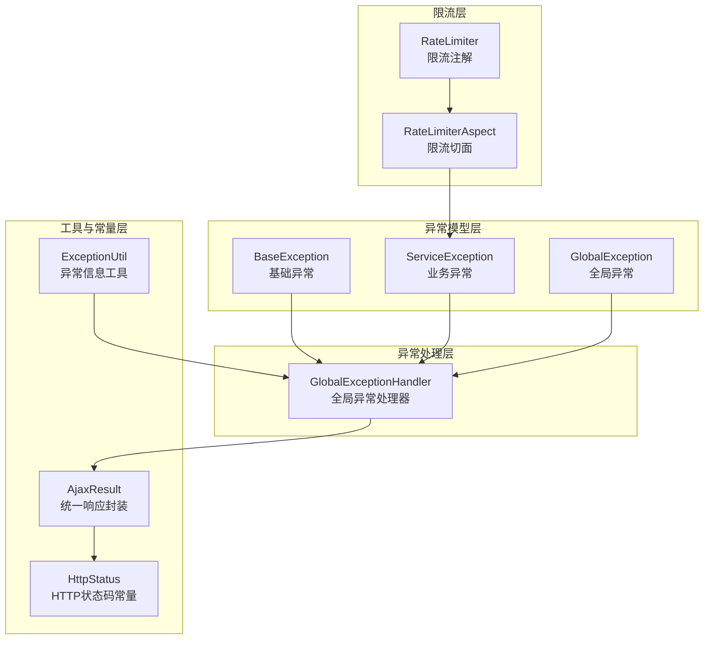
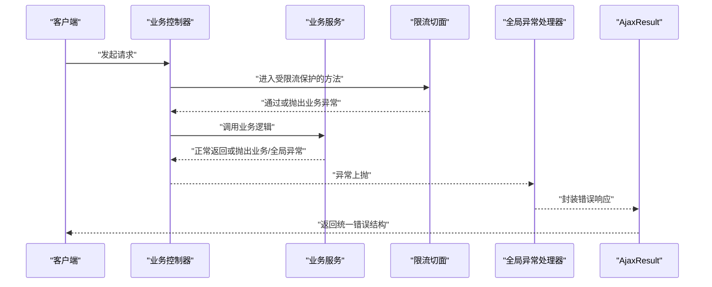
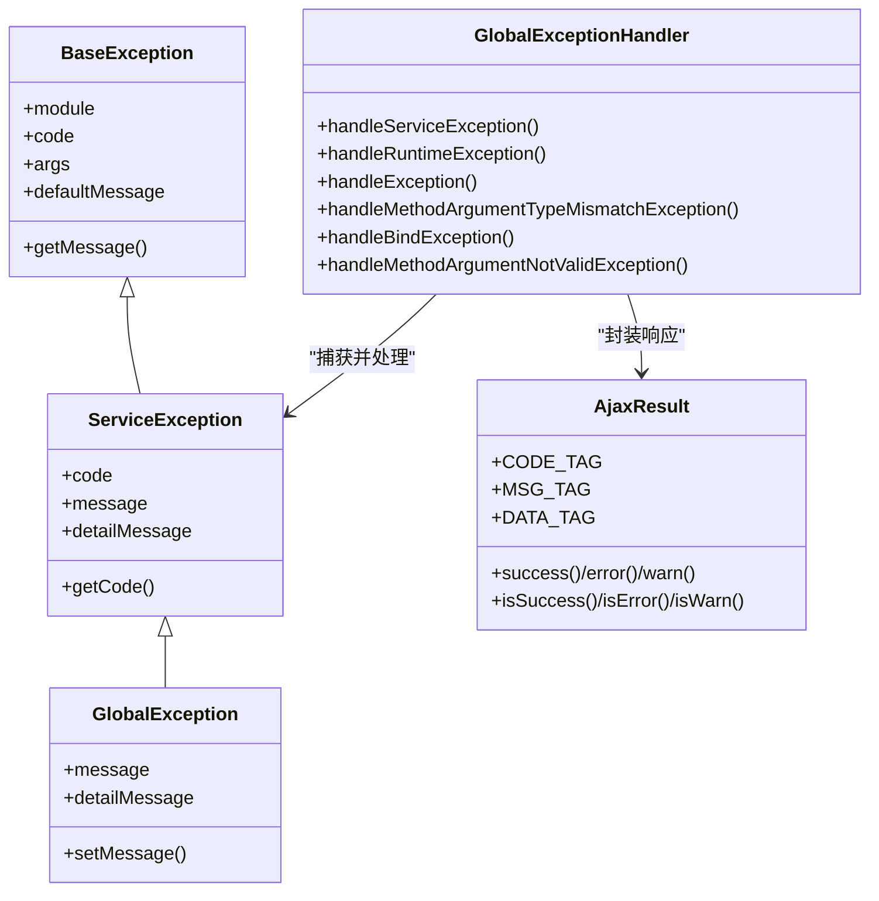
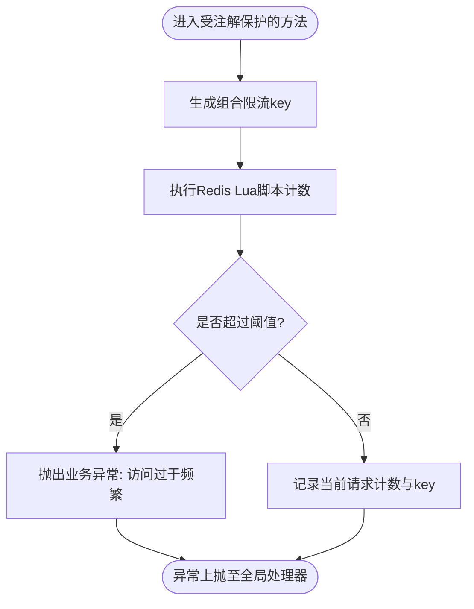
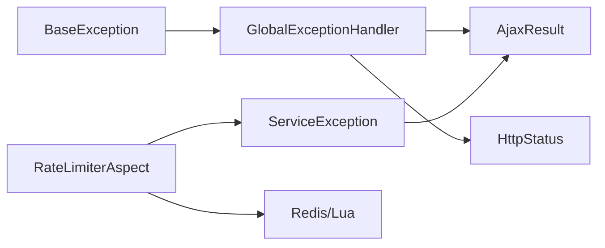

# 错误处理与恢复

<cite>
**本文引用的文件**
- [全局异常类 GlobalException.java](file://XingChen-Vue/xingchen-common/src/main/java/com/xingchen/common/exception/GlobalException.java)
- [业务异常类 ServiceException.java](file://XingChen-Vue/xingchen-common/src/main/java/com/xingchen/common/exception/ServiceException.java)
- [基础异常类 BaseException.java](file://XingChen-Vue/xingchen-common/src/main/java/com/xingchen/common/exception/base/BaseException.java)
- [全局异常处理器 GlobalExceptionHandler.java](file://XingChen-Vue/xingchen-framework/src/main/java/com/xingchen/framework/web/exception/GlobalExceptionHandler.java)
- [HTTP状态码常量 HttpStatus.java](file://XingChen-Vue/xingchen-common/src/main/java/com/xingchen/common/constant/HttpStatus.java)
- [Ajax结果封装 AjaxResult.java](file://XingChen-Vue/xingchen-common/src/main/java/com/xingchen/common/core/domain/AjaxResult.java)
- [异常信息工具 ExceptionUtil.java](file://XingChen-Vue/xingchen-common/src/main/java/com/xingchen/common/utils/ExceptionUtil.java)
- [限流注解 RateLimiter.java](file://XingChen-Vue/xingchen-common/src/main/java/com/xingchen/common/annotation/RateLimiter.java)
- [限流切面 RateLimiterAspect.java](file://XingChen-Vue/xingchen-framework/src/main/java/com/xingchen/framework/aspectj/RateLimiterAspect.java)
</cite>

## 目录
1. [简介](#简介)
2. [项目结构](#项目结构)
3. [核心组件](#核心组件)
4. [架构总览](#架构总览)
5. [详细组件分析](#详细组件分析)
6. [依赖分析](#依赖分析)
7. [性能考虑](#性能考虑)
8. [故障排查指南](#故障排查指南)
9. [结论](#结论)
10. [附录](#附录)

## 简介
本文件聚焦于健康管理系统中“AI助手”相关功能的错误处理与恢复机制，系统性梳理异常分类、错误码定义、用户友好提示、自动重试策略、API限流与降级、以及日志监控与故障诊断。目标是帮助开发者在面对网络超时、API调用失败、响应解析错误、业务逻辑异常等场景时，能够快速定位问题、稳定恢复服务，并提供良好的用户体验。

## 项目结构
围绕错误处理与恢复的关键代码分布在以下模块：
- 异常模型层：定义基础异常、业务异常与全局异常
- 异常处理层：统一捕获并转换为标准响应
- 工具与常量层：HTTP状态码、Ajax结果封装、异常信息提取
- 限流层：基于注解与切面的限流与降级
- 前端交互层：通过AjaxResult统一接收后端错误信息

图表来源
- [基础异常类 BaseException.java:1-98](file://XingChen-Vue/xingchen-common/src/main/java/com/xingchen/common/exception/base/BaseException.java#L1-L98)
- [业务异常类 ServiceException.java:1-74](file://XingChen-Vue/xingchen-common/src/main/java/com/xingchen/common/exception/ServiceException.java#L1-L74)
- [全局异常类 GlobalException.java:1-58](file://XingChen-Vue/xingchen-common/src/main/java/com/xingchen/common/exception/GlobalException.java#L1-L58)
- [全局异常处理器 GlobalExceptionHandler.java:1-146](file://XingChen-Vue/xingchen-framework/src/main/java/com/xingchen/framework/web/exception/GlobalExceptionHandler.java#L1-L146)
- [Ajax结果封装 AjaxResult.java:1-217](file://XingChen-Vue/xingchen-common/src/main/java/com/xingchen/common/core/domain/AjaxResult.java#L1-L217)
- [HTTP状态码常量 HttpStatus.java:1-95](file://XingChen-Vue/xingchen-common/src/main/java/com/xingchen/common/constant/HttpStatus.java#L1-L95)
- [异常信息工具 ExceptionUtil.java:1-40](file://XingChen-Vue/xingchen-common/src/main/java/com/xingchen/common/utils/ExceptionUtil.java#L1-L40)
- [限流注解 RateLimiter.java:1-41](file://XingChen-Vue/xingchen-common/src/main/java/com/xingchen/common/annotation/RateLimiter.java#L1-L41)
- [限流切面 RateLimiterAspect.java:1-90](file://XingChen-Vue/xingchen-framework/src/main/java/com/xingchen/framework/aspectj/RateLimiterAspect.java#L1-L90)

章节来源
- [全局异常处理器 GlobalExceptionHandler.java:1-146](file://XingChen-Vue/xingchen-framework/src/main/java/com/xingchen/framework/web/exception/GlobalExceptionHandler.java#L1-L146)
- [Ajax结果封装 AjaxResult.java:1-217](file://XingChen-Vue/xingchen-common/src/main/java/com/xingchen/common/core/domain/AjaxResult.java#L1-L217)
- [HTTP状态码常量 HttpStatus.java:1-95](file://XingChen-Vue/xingchen-common/src/main/java/com/xingchen/common/constant/HttpStatus.java#L1-L95)

## 核心组件
- 异常模型
  - 基础异常：支持模块化、国际化消息键与默认消息，便于统一处理与扩展
  - 业务异常：携带业务错误码与消息，用于精确反馈业务失败原因
  - 全局异常：通用运行时异常包装，便于兜底处理
- 统一异常处理
  - 全局异常处理器：拦截各类异常，记录日志并返回AjaxResult标准化响应
- 统一响应封装
  - AjaxResult：统一返回结构，包含状态码、消息与可选数据，便于前端解析
- 限流与降级
  - 注解+切面：基于Redis Lua脚本实现原子计数与限流，超限抛出业务异常进行统一处理
- 异常信息工具
  - 提供根因消息与完整堆栈字符串，辅助日志与监控

章节来源
- [基础异常类 BaseException.java:1-98](file://XingChen-Vue/xingchen-common/src/main/java/com/xingchen/common/exception/base/BaseException.java#L1-L98)
- [业务异常类 ServiceException.java:1-74](file://XingChen-Vue/xingchen-common/src/main/java/com/xingchen/common/exception/ServiceException.java#L1-L74)
- [全局异常类 GlobalException.java:1-58](file://XingChen-Vue/xingchen-common/src/main/java/com/xingchen/common/exception/GlobalException.java#L1-L58)
- [全局异常处理器 GlobalExceptionHandler.java:1-146](file://XingChen-Vue/xingchen-framework/src/main/java/com/xingchen/framework/web/exception/GlobalExceptionHandler.java#L1-L146)
- [Ajax结果封装 AjaxResult.java:1-217](file://XingChen-Vue/xingchen-common/src/main/java/com/xingchen/common/core/domain/AjaxResult.java#L1-L217)
- [异常信息工具 ExceptionUtil.java:1-40](file://XingChen-Vue/xingchen-common/src/main/java/com/xingchen/common/utils/ExceptionUtil.java#L1-L40)
- [限流注解 RateLimiter.java:1-41](file://XingChen-Vue/xingchen-common/src/main/java/com/xingchen/common/annotation/RateLimiter.java#L1-L41)
- [限流切面 RateLimiterAspect.java:1-90](file://XingChen-Vue/xingchen-framework/src/main/java/com/xingchen/framework/aspectj/RateLimiterAspect.java#L1-L90)

## 架构总览
下图展示了从控制器到异常处理、再到统一响应的整体流程，以及限流切面对业务接口的前置保护。

图表来源
- [全局异常处理器 GlobalExceptionHandler.java:1-146](file://XingChen-Vue/xingchen-framework/src/main/java/com/xingchen/framework/web/exception/GlobalExceptionHandler.java#L1-L146)
- [限流切面 RateLimiterAspect.java:1-90](file://XingChen-Vue/xingchen-framework/src/main/java/com/xingchen/framework/aspectj/RateLimiterAspect.java#L1-L90)
- [Ajax结果封装 AjaxResult.java:1-217](file://XingChen-Vue/xingchen-common/src/main/java/com/xingchen/common/core/domain/AjaxResult.java#L1-L217)

## 详细组件分析

### 异常分类与错误码定义
- 基础异常 BaseException
  - 支持模块化与国际化消息键，优先根据键与参数解析消息，否则回退到默认消息
  - 适合在各领域模块中复用，保证消息一致性
- 业务异常 ServiceException
  - 携带业务错误码与消息，便于前端按码做差异化提示与引导
  - 可与AjaxResult配合，直接返回指定状态码
- 全局异常 GlobalException
  - 通用运行时异常包装，用于兜底未预期异常
- HTTP状态码常量 HttpStatus
  - 定义标准HTTP语义状态码，统一错误/警告/成功标识

章节来源
- [基础异常类 BaseException.java:1-98](file://XingChen-Vue/xingchen-common/src/main/java/com/xingchen/common/exception/base/BaseException.java#L1-L98)
- [业务异常类 ServiceException.java:1-74](file://XingChen-Vue/xingchen-common/src/main/java/com/xingchen/common/exception/ServiceException.java#L1-L74)
- [全局异常类 GlobalException.java:1-58](file://XingChen-Vue/xingchen-common/src/main/java/com/xingchen/common/exception/GlobalException.java#L1-L58)
- [HTTP状态码常量 HttpStatus.java:1-95](file://XingChen-Vue/xingchen-common/src/main/java/com/xingchen/common/constant/HttpStatus.java#L1-L95)

### 统一异常处理与用户友好提示
- 全局异常处理器 GlobalExceptionHandler
  - 权限不足、请求方式不支持、参数类型不匹配、绑定异常、运行时异常、系统异常等均有专门处理
  - 统一记录日志并返回AjaxResult，确保前后端交互的一致性
  - 业务异常 ServiceException 将携带的错误码透传，便于前端精准提示
- Ajax结果封装 AjaxResult
  - 固定字段：code、msg、data
  - 提供success/error/warn系列静态方法，简化响应构造
  - 提供isSuccess/isError/isWarn判断，便于前端分支处理

图表来源
- [基础异常类 BaseException.java:1-98](file://XingChen-Vue/xingchen-common/src/main/java/com/xingchen/common/exception/base/BaseException.java#L1-L98)
- [业务异常类 ServiceException.java:1-74](file://XingChen-Vue/xingchen-common/src/main/java/com/xingchen/common/exception/ServiceException.java#L1-L74)
- [全局异常类 GlobalException.java:1-58](file://XingChen-Vue/xingchen-common/src/main/java/com/xingchen/common/exception/GlobalException.java#L1-L58)
- [全局异常处理器 GlobalExceptionHandler.java:1-146](file://XingChen-Vue/xingchen-framework/src/main/java/com/xingchen/framework/web/exception/GlobalExceptionHandler.java#L1-L146)
- [Ajax结果封装 AjaxResult.java:1-217](file://XingChen-Vue/xingchen-common/src/main/java/com/xingchen/common/core/domain/AjaxResult.java#L1-L217)

章节来源
- [全局异常处理器 GlobalExceptionHandler.java:1-146](file://XingChen-Vue/xingchen-framework/src/main/java/com/xingchen/framework/web/exception/GlobalExceptionHandler.java#L1-L146)
- [Ajax结果封装 AjaxResult.java:1-217](file://XingChen-Vue/xingchen-common/src/main/java/com/xingchen/common/core/domain/AjaxResult.java#L1-L217)

### API限流与优雅降级
- 限流注解 RateLimiter
  - 支持自定义限流key、时间窗口、最大请求数、限流类型（如按IP聚合）
- 限流切面 RateLimiterAspect
  - 基于Redis与Lua脚本实现原子计数与限流判断
  - 超限时抛出业务异常 ServiceException，交由全局异常处理器统一处理
  - 对Redis异常进行兜底，抛出运行时异常提示“服务器限流异常，请稍候再试”

图表来源
- [限流注解 RateLimiter.java:1-41](file://XingChen-Vue/xingchen-common/src/main/java/com/xingchen/common/annotation/RateLimiter.java#L1-L41)
- [限流切面 RateLimiterAspect.java:1-90](file://XingChen-Vue/xingchen-framework/src/main/java/com/xingchen/framework/aspectj/RateLimiterAspect.java#L1-L90)

章节来源
- [限流注解 RateLimiter.java:1-41](file://XingChen-Vue/xingchen-common/src/main/java/com/xingchen/common/annotation/RateLimiter.java#L1-L41)
- [限流切面 RateLimiterAspect.java:1-90](file://XingChen-Vue/xingchen-framework/src/main/java/com/xingchen/framework/aspectj/RateLimiterAspect.java#L1-L90)

### 自动重试机制与恢复策略
- 适用范围
  - 针对网络超时、临时性服务不可用等瞬时故障，可在调用方实现指数退避重试
- 实施建议
  - 在调用第三方AI服务前，设置合理的超时与重试上限
  - 区分幂等与非幂等操作；对非幂等请求谨慎重试
  - 使用唯一请求ID关联重试批次，便于追踪与去重
- 与现有异常体系的衔接
  - 将网络超时与解析错误包装为业务异常 ServiceException，确保统一处理与提示
  - 通过AjaxResult返回明确的错误码与消息，前端据此决定是否提示用户或自动重试

[本节为通用实践建议，不直接分析具体文件，故无章节来源]

### 错误日志记录、监控告警与故障诊断
- 日志记录
  - 全局异常处理器统一记录请求URI与异常堆栈，便于定位问题
  - 异常信息工具 ExceptionUtil 提供根因消息与完整堆栈字符串，便于采集与检索
- 监控告警
  - 建议结合业务错误码与异常类型建立指标，如“业务异常率”、“限流触发次数”
  - 对高频异常与根因异常进行分级告警
- 故障诊断
  - 前端依据AjaxResult中的code/msg/data进行诊断与提示
  - 后端结合日志与异常工具输出进行根因分析

章节来源
- [全局异常处理器 GlobalExceptionHandler.java:1-146](file://XingChen-Vue/xingchen-framework/src/main/java/com/xingchen/framework/web/exception/GlobalExceptionHandler.java#L1-L146)
- [异常信息工具 ExceptionUtil.java:1-40](file://XingChen-Vue/xingchen-common/src/main/java/com/xingchen/common/utils/ExceptionUtil.java#L1-L40)
- [Ajax结果封装 AjaxResult.java:1-217](file://XingChen-Vue/xingchen-common/src/main/java/com/xingchen/common/core/domain/AjaxResult.java#L1-L217)

## 依赖分析
- 组件耦合
  - 全局异常处理器依赖AjaxResult与HttpStatus，形成稳定的响应契约
  - 业务异常与基础异常向上游服务暴露，便于在各模块中复用
  - 限流切面依赖Redis与Lua脚本，对外仅暴露业务异常，降低复杂度
- 外部依赖
  - Redis用于限流计数与原子脚本执行
  - Spring MVC与Spring AOP用于异常拦截与切面织入

图表来源
- [全局异常处理器 GlobalExceptionHandler.java:1-146](file://XingChen-Vue/xingchen-framework/src/main/java/com/xingchen/framework/web/exception/GlobalExceptionHandler.java#L1-L146)
- [Ajax结果封装 AjaxResult.java:1-217](file://XingChen-Vue/xingchen-common/src/main/java/com/xingchen/common/core/domain/AjaxResult.java#L1-L217)
- [HTTP状态码常量 HttpStatus.java:1-95](file://XingChen-Vue/xingchen-common/src/main/java/com/xingchen/common/constant/HttpStatus.java#L1-L95)
- [业务异常类 ServiceException.java:1-74](file://XingChen-Vue/xingchen-common/src/main/java/com/xingchen/common/exception/ServiceException.java#L1-L74)
- [基础异常类 BaseException.java:1-98](file://XingChen-Vue/xingchen-common/src/main/java/com/xingchen/common/exception/base/BaseException.java#L1-L98)
- [限流切面 RateLimiterAspect.java:1-90](file://XingChen-Vue/xingchen-framework/src/main/java/com/xingchen/framework/aspectj/RateLimiterAspect.java#L1-L90)

章节来源
- [全局异常处理器 GlobalExceptionHandler.java:1-146](file://XingChen-Vue/xingchen-framework/src/main/java/com/xingchen/framework/web/exception/GlobalExceptionHandler.java#L1-L146)
- [限流切面 RateLimiterAspect.java:1-90](file://XingChen-Vue/xingchen-framework/src/main/java/com/xingchen/framework/aspectj/RateLimiterAspect.java#L1-L90)

## 性能考虑
- 限流性能
  - Lua脚本在Redis侧原子计数，避免分布式锁与并发竞争带来的额外开销
  - key设计需平衡粒度与数量，避免过多key导致内存压力
- 异常处理性能
  - 统一异常处理减少分支判断与重复封装逻辑
  - AjaxResult采用HashMap结构，字段固定，序列化成本低
- 日志性能
  - 建议异步化日志写入，避免阻塞主线程
  - 控制异常堆栈打印频率，必要时采样记录

[本节提供通用指导，不直接分析具体文件，故无章节来源]

## 故障排查指南
- 快速定位
  - 查看全局异常处理器记录的请求URI与异常类型
  - 使用异常信息工具提取根因消息，缩小问题范围
- 常见问题与处理
  - 权限不足：检查安全配置与用户授权
  - 参数类型不匹配：核对前端请求与后端参数类型
  - 业务异常：依据错误码与消息提示，前端引导用户修正或稍后重试
  - 限流触发：调整限流阈值或提示用户稍后再试
- 诊断工具
  - 前端：依据AjaxResult的code/msg/data进行分支提示与埋点
  - 后端：结合日志与异常工具输出进行根因分析

章节来源
- [全局异常处理器 GlobalExceptionHandler.java:1-146](file://XingChen-Vue/xingchen-framework/src/main/java/com/xingchen/framework/web/exception/GlobalExceptionHandler.java#L1-L146)
- [异常信息工具 ExceptionUtil.java:1-40](file://XingChen-Vue/xingchen-common/src/main/java/com/xingchen/common/utils/ExceptionUtil.java#L1-L40)
- [Ajax结果封装 AjaxResult.java:1-217](file://XingChen-Vue/xingchen-common/src/main/java/com/xingchen/common/core/domain/AjaxResult.java#L1-L217)

## 结论
本系统通过“异常模型—统一处理—统一响应—限流降级”的闭环设计，实现了对网络超时、API失败、解析错误与业务异常的高效处理与恢复。配合AjaxResult与HttpStatus，前端可获得一致且可解析的错误信息；通过限流切面与业务异常，系统在高并发下仍能保持稳定与可控。建议在调用方补充自动重试与幂等控制，并完善监控与告警，以进一步提升可用性与可观测性。

## 附录
- 最佳实践清单
  - 明确异常分类与错误码，避免混用
  - 统一使用AjaxResult返回，前端按code分支处理
  - 对瞬时故障实现指数退避重试，对非幂等请求谨慎重试
  - 限流阈值与key设计要兼顾准确性与性能
  - 异步化日志与监控，保障线上稳定性

[本节为通用总结，不直接分析具体文件，故无章节来源]