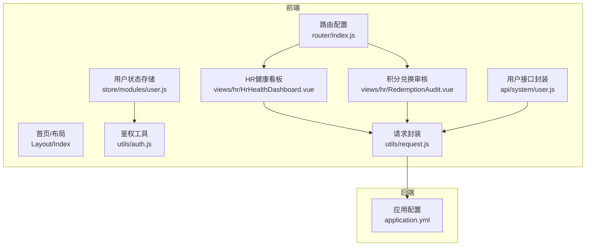
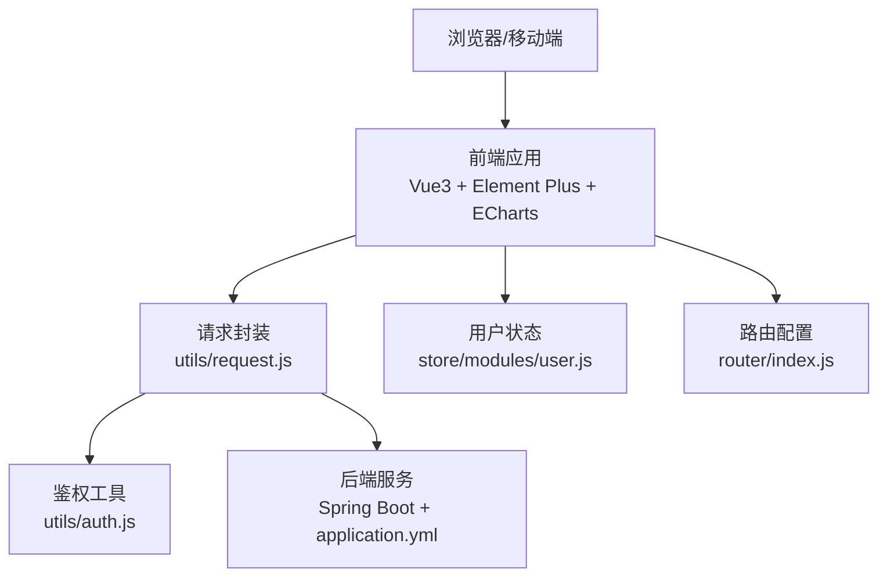
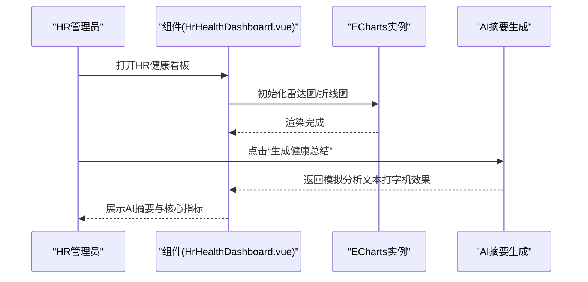
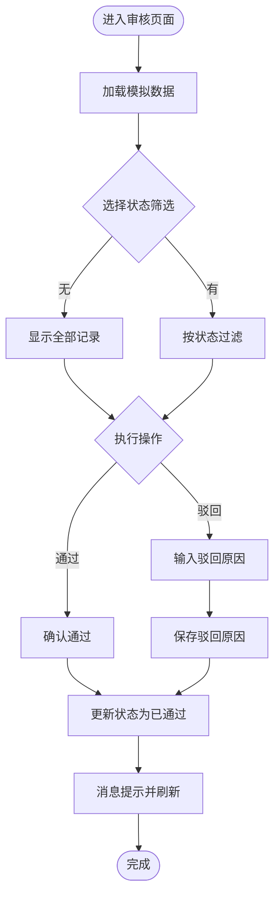
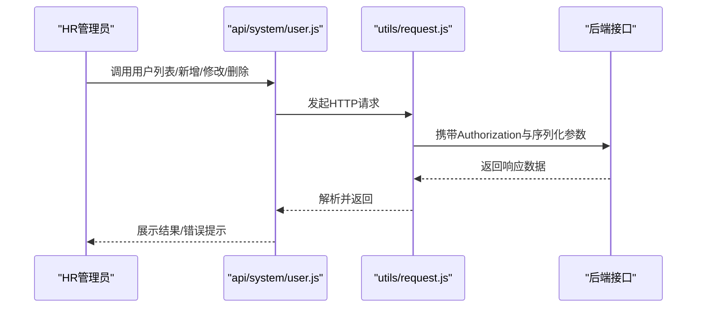
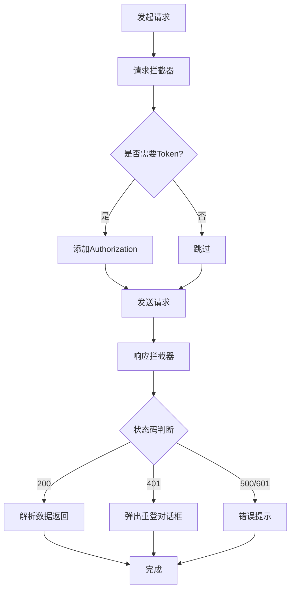
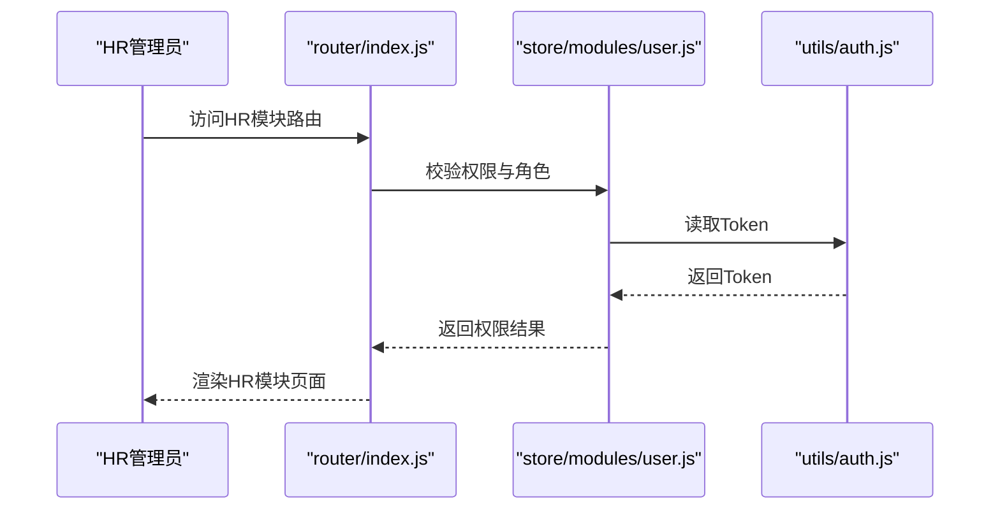
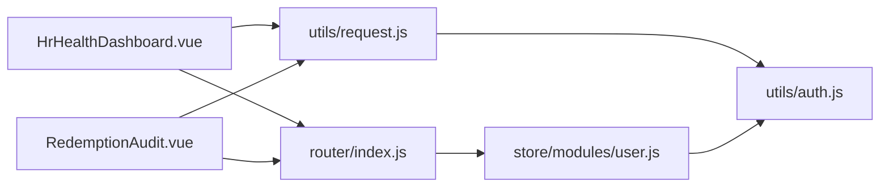

# HR健康监控

<cite>
**本文引用的文件**
- [HrHealthDashboard.vue](file://XingChen-Vue3/src/views/hr/HrHealthDashboard.vue)
- [dashboard.vue](file://XingChen-Vue3/src/views/hr/dashboard.vue)
- [RedemptionAudit.vue](file://XingChen-Vue3/src/views/hr/RedemptionAudit.vue)
- [user.js](file://XingChen-Vue3/src/api/system/user.js)
- [request.js](file://XingChen-Vue3/src/utils/request.js)
- [index.js（路由）](file://XingChen-Vue3/src/router/index.js)
- [user.js（用户仓库）](file://XingChen-Vue3/src/store/modules/user.js)
- [auth.js](file://XingChen-Vue3/src/utils/auth.js)
- [application.yml](file://XingChen-Vue/xingchen-admin/src/main/resources/application.yml)
</cite>

## 目录
1. [简介](#简介)
2. [项目结构](#项目结构)
3. [核心组件](#核心组件)
4. [架构总览](#架构总览)
5. [详细组件分析](#详细组件分析)
6. [依赖关系分析](#依赖关系分析)
7. [性能考虑](#性能考虑)
8. [故障排查指南](#故障排查指南)
9. [结论](#结论)
10. [附录](#附录)

## 简介
本文件面向HR健康监控系统，围绕HR看板的数据可视化设计、健康数据分析算法、预警系统实现与员工管理功能展开，解释监控数据的采集流程、统计计算方法、图表展示技术与实时更新机制，并覆盖HR管理员的操作界面设计、数据权限控制、报表生成与导出能力。同时提供系统性能优化、数据安全与扩展开发方案，帮助读者快速理解并高效使用与二次开发。

## 项目结构
系统采用前后端分离架构，前端基于Vue3 + Element Plus + ECharts构建，HR健康看板位于HR模块；后端基于Spring Boot，配置文件集中于application.yml；统一通过Axios封装的请求工具与鉴权体系进行交互。

**图表来源**
- [index.js（路由）:95-108](file://XingChen-Vue3/src/router/index.js#L95-L108)
- [HrHealthDashboard.vue:1-481](file://XingChen-Vue3/src/views/hr/HrHealthDashboard.vue#L1-L481)
- [RedemptionAudit.vue:1-250](file://XingChen-Vue3/src/views/hr/RedemptionAudit.vue#L1-L250)
- [user.js:1-137](file://XingChen-Vue3/src/api/system/user.js#L1-L137)
- [request.js:1-154](file://XingChen-Vue3/src/utils/request.js#L1-L154)
- [user.js（用户仓库）:1-94](file://XingChen-Vue3/src/store/modules/user.js#L1-L94)
- [auth.js:1-16](file://XingChen-Vue3/src/utils/auth.js#L1-L16)
- [application.yml:1-148](file://XingChen-Vue/xingchen-admin/src/main/resources/application.yml#L1-L148)

**章节来源**
- [index.js（路由）:28-108](file://XingChen-Vue3/src/router/index.js#L28-L108)
- [HrHealthDashboard.vue:1-130](file://XingChen-Vue3/src/views/hr/HrHealthDashboard.vue#L1-L130)
- [RedemptionAudit.vue:1-87](file://XingChen-Vue3/src/views/hr/RedemptionAudit.vue#L1-L87)
- [user.js:1-137](file://XingChen-Vue3/src/api/system/user.js#L1-L137)
- [request.js:1-73](file://XingChen-Vue3/src/utils/request.js#L1-L73)
- [user.js（用户仓库）:1-94](file://XingChen-Vue3/src/store/modules/user.js#L1-L94)
- [auth.js:1-16](file://XingChen-Vue3/src/utils/auth.js#L1-L16)
- [application.yml:1-148](file://XingChen-Vue/xingchen-admin/src/main/resources/application.yml#L1-L148)

## 核心组件
- HR健康看板：提供核心指标卡片、雷达图、折线图与实时预警时间轴，支持AI健康分析摘要生成与图表自适应。
- 积分兑换审核：提供员工积分兑换申请的列表、筛选、通过/驳回操作与原因记录。
- 用户管理接口：封装用户增删改查、状态变更、角色授权、个人信息维护等REST接口。
- 请求与鉴权：统一Axios拦截器、Token注入、重复提交防护、下载导出、错误提示与登出处理。
- 路由与权限：公共路由与动态路由配置，结合菜单权限控制HR模块可见性。

**章节来源**
- [HrHealthDashboard.vue:132-365](file://XingChen-Vue3/src/views/hr/HrHealthDashboard.vue#L132-L365)
- [RedemptionAudit.vue:89-228](file://XingChen-Vue3/src/views/hr/RedemptionAudit.vue#L89-L228)
- [user.js:1-137](file://XingChen-Vue3/src/api/system/user.js#L1-L137)
- [request.js:23-124](file://XingChen-Vue3/src/utils/request.js#L23-L124)
- [index.js（路由）:95-108](file://XingChen-Vue3/src/router/index.js#L95-L108)

## 架构总览
系统采用“前端Vue3 + 后端Spring Boot”的典型微服务/单体架构。前端通过Axios与后端交互，后端负责业务处理与数据持久化。HR模块通过路由挂载至系统侧边栏，具备独立的HR入口与权限控制。

**图表来源**
- [request.js:1-154](file://XingChen-Vue3/src/utils/request.js#L1-L154)
- [auth.js:1-16](file://XingChen-Vue3/src/utils/auth.js#L1-L16)
- [user.js（用户仓库）:1-94](file://XingChen-Vue3/src/store/modules/user.js#L1-L94)
- [index.js（路由）:28-108](file://XingChen-Vue3/src/router/index.js#L28-L108)
- [application.yml:1-148](file://XingChen-Vue/xingchen-admin/src/main/resources/application.yml#L1-L148)

## 详细组件分析

### HR健康看板（HrHealthDashboard.vue）
- 数据可视化设计
  - 核心指标卡片：异常预警部门数、高压预警人数、打卡人数等，采用Element Card布局与图标区分。
  - 部门健康画像（雷达图）：展示颈椎风险、眼部疲劳、压力指数、久坐时长、借款异常等维度，支持多部门对比。
  - 全公司压力趋势（折线图）：展示周一至周五的压力指数变化，平滑曲线与面积填充增强可读性。
  - 实时预警时间轴：以Timeline形式展示健康异常事件，按类型标注颜色与尺寸。
- 健康数据分析算法
  - 指标聚合：通过雷达图与折线图的数据点进行统计与归一化展示，便于跨部门横向比较。
  - AI健康分析摘要：提供打字机效果的模拟生成流程，提升交互体验。
- 预警系统实现
  - 时间轴动态展示：按时间倒序排列，支持不同类型（危险/警告/成功）的视觉提示。
- 实时更新机制
  - 图表自适应：监听窗口resize与侧边栏展开/收起，延迟触发图表resize，保证渲染一致性。
- 操作界面设计
  - 响应式布局：基于Element Grid实现卡片与图表的自适应排布。
  - 主题样式：通过scoped样式与CSS变量实现统一风格与颜色体系。

**图表来源**
- [HrHealthDashboard.vue:159-185](file://XingChen-Vue3/src/views/hr/HrHealthDashboard.vue#L159-L185)
- [HrHealthDashboard.vue:210-337](file://XingChen-Vue3/src/views/hr/HrHealthDashboard.vue#L210-L337)

**章节来源**
- [HrHealthDashboard.vue:1-481](file://XingChen-Vue3/src/views/hr/HrHealthDashboard.vue#L1-L481)

### 积分兑换审核（RedemptionAudit.vue）
- 员工积分兑换申请管理
  - 列表展示：申请时间、员工姓名与部门、商品名称、消耗积分、状态标签。
  - 状态筛选：支持“全部/待审核/已通过/已驳回”筛选。
  - 审核操作：通过/驳回按钮，驳回时弹窗输入原因并回显。
- 交互与校验
  - 使用ElMessageBox确认通过/驳回，ElMessage反馈结果。
  - computed属性驱动列表过滤，减少不必要的渲染。

**图表来源**
- [RedemptionAudit.vue:149-228](file://XingChen-Vue3/src/views/hr/RedemptionAudit.vue#L149-L228)

**章节来源**
- [RedemptionAudit.vue:1-250](file://XingChen-Vue3/src/views/hr/RedemptionAudit.vue#L1-L250)

### 用户管理接口（api/system/user.js）
- 能力范围
  - 用户列表查询、详情获取、新增、修改、删除、密码重置、状态变更、个人信息维护、头像上传、授权角色查询与保存、部门树结构查询等。
- 使用方式
  - 通过封装的request工具发起HTTP请求，自动注入Token与参数序列化。
- 权限与安全
  - 结合后端接口与前端路由权限，确保HR管理员仅能访问授权功能。

**图表来源**
- [user.js:1-137](file://XingChen-Vue3/src/api/system/user.js#L1-L137)
- [request.js:23-124](file://XingChen-Vue3/src/utils/request.js#L23-L124)

**章节来源**
- [user.js:1-137](file://XingChen-Vue3/src/api/system/user.js#L1-L137)
- [request.js:1-154](file://XingChen-Vue3/src/utils/request.js#L1-L154)

### 请求与鉴权（utils/request.js 与 utils/auth.js）
- 请求拦截
  - 自动注入Token、GET参数拼接、重复提交防护（基于session缓存与时间间隔）、超时与错误提示。
- 响应拦截
  - 统一处理401重登、500/601错误提示、Blob下载、默认错误码映射。
- 下载导出
  - 支持Blob下载与文件保存，失败时提示并关闭加载遮罩。
- 鉴权工具
  - Cookie中读取/设置/移除Token，作为后端JWT认证的凭证。

**图表来源**
- [request.js:23-124](file://XingChen-Vue3/src/utils/request.js#L23-L124)
- [auth.js:1-16](file://XingChen-Vue3/src/utils/auth.js#L1-L16)

**章节来源**
- [request.js:1-154](file://XingChen-Vue3/src/utils/request.js#L1-L154)
- [auth.js:1-16](file://XingChen-Vue3/src/utils/auth.js#L1-L16)

### 路由与权限（router/index.js 与 store/modules/user.js）
- 路由配置
  - HR模块路由挂载至系统侧边栏，包含积分兑换审核等子路由，meta中设置标题与图标。
  - 动态路由示例展示了权限控制与高亮菜单的配置方式。
- 用户状态与权限
  - 用户登录后从后端获取角色与权限，用于前端菜单与按钮级权限控制。
  - 登出时清理Token与权限，避免越权访问。

**图表来源**
- [index.js（路由）:95-108](file://XingChen-Vue3/src/router/index.js#L95-L108)
- [user.js（用户仓库）:1-94](file://XingChen-Vue3/src/store/modules/user.js#L1-L94)
- [auth.js:1-16](file://XingChen-Vue3/src/utils/auth.js#L1-L16)

**章节来源**
- [index.js（路由）:28-108](file://XingChen-Vue3/src/router/index.js#L28-L108)
- [user.js（用户仓库）:1-94](file://XingChen-Vue3/src/store/modules/user.js#L1-L94)

## 依赖关系分析
- 组件耦合
  - HR健康看板与积分兑换审核均依赖utils/request.js进行HTTP通信，降低重复封装成本。
  - 路由与权限通过store/modules/user.js与utils/auth.js解耦，便于扩展与维护。
- 外部依赖
  - Axios、Element Plus、ECharts、js-cookie等第三方库支撑UI与可视化需求。
- 潜在风险
  - 重复提交防护依赖session缓存，需关注大对象请求的限制与性能影响。
  - 登录过期处理依赖后端返回码，需确保后端与前端错误码一致。

**图表来源**
- [HrHealthDashboard.vue:132-136](file://XingChen-Vue3/src/views/hr/HrHealthDashboard.vue#L132-L136)
- [RedemptionAudit.vue:89-91](file://XingChen-Vue3/src/views/hr/RedemptionAudit.vue#L89-L91)
- [request.js:1-154](file://XingChen-Vue3/src/utils/request.js#L1-L154)
- [auth.js:1-16](file://XingChen-Vue3/src/utils/auth.js#L1-L16)
- [index.js（路由）:28-108](file://XingChen-Vue3/src/router/index.js#L28-L108)
- [user.js（用户仓库）:1-94](file://XingChen-Vue3/src/store/modules/user.js#L1-L94)

**章节来源**
- [HrHealthDashboard.vue:132-136](file://XingChen-Vue3/src/views/hr/HrHealthDashboard.vue#L132-L136)
- [RedemptionAudit.vue:89-91](file://XingChen-Vue3/src/views/hr/RedemptionAudit.vue#L89-L91)
- [request.js:1-154](file://XingChen-Vue3/src/utils/request.js#L1-L154)
- [auth.js:1-16](file://XingChen-Vue3/src/utils/auth.js#L1-L16)
- [index.js（路由）:28-108](file://XingChen-Vue3/src/router/index.js#L28-L108)
- [user.js（用户仓库）:1-94](file://XingChen-Vue3/src/store/modules/user.js#L1-L94)

## 性能考虑
- 图表渲染优化
  - 在窗口resize与侧边栏切换时延时触发图表resize，避免频繁重绘。
  - 折线图启用平滑曲线与面积渐变，注意大数据量时的内存占用。
- 请求与缓存
  - 重复提交防护对请求体大小有限制，避免大体积POST导致防护失效。
  - 下载导出使用Blob与文件保存，避免内存峰值过高。
- 前端分页与懒加载
  - 对于用户列表与审核记录，建议后端分页，前端仅做轻量过滤与本地高亮。
- 服务端配置
  - application.yml中配置了Tomcat线程池、Redis连接池与Jackson时区，建议结合压测调优。

**章节来源**
- [HrHealthDashboard.vue:342-364](file://XingChen-Vue3/src/views/hr/HrHealthDashboard.vue#L342-L364)
- [request.js:41-68](file://XingChen-Vue3/src/utils/request.js#L41-L68)
- [request.js:126-151](file://XingChen-Vue3/src/utils/request.js#L126-L151)
- [application.yml:17-33](file://XingChen-Vue/xingchen-admin/src/main/resources/application.yml#L17-L33)
- [application.yml:72-94](file://XingChen-Vue/xingchen-admin/src/main/resources/application.yml#L72-L94)

## 故障排查指南
- 登录过期/无效会话
  - 响应拦截器检测到401时弹出重登对话框，确认后清空状态并跳转首页。
- 接口超时/网络异常
  - 统一错误提示与日志输出，检查后端服务连通性与Nginx代理配置。
- 重复提交保护触发
  - 检查请求体大小与时间间隔，避免短时间内重复相同请求。
- 下载导出失败
  - 确认后端返回Blob格式与文件名，前端弹出错误提示并关闭加载遮罩。
- 权限不足
  - 确认用户角色与菜单权限，检查路由meta中的permissions配置。

**章节来源**
- [request.js:75-124](file://XingChen-Vue3/src/utils/request.js#L75-L124)
- [request.js:126-151](file://XingChen-Vue3/src/utils/request.js#L126-L151)
- [user.js（用户仓库）:76-89](file://XingChen-Vue3/src/store/modules/user.js#L76-L89)

## 结论
HR健康监控系统通过清晰的前端组件划分与完善的请求/鉴权体系，实现了健康数据的可视化呈现、员工行为的实时预警与积分兑换的规范化管理。结合后端配置与权限控制，系统具备良好的可维护性与扩展性。建议后续在数据采集与算法层面引入真实指标与模型，完善报表导出与审计追踪，持续优化用户体验与系统性能。

## 附录
- 操作界面设计要点
  - 统一使用Element组件库，保持图标、颜色与间距一致。
  - 关键操作提供确认与提示，保障HR管理员操作安全。
- 数据权限控制
  - 基于角色与菜单权限，限制HR模块访问范围，避免越权。
- 报表生成与导出
  - 借助下载导出能力，支持Excel/PDF等格式，满足HR汇报与归档需求。
- 扩展开发建议
  - 将Mock数据替换为真实API，接入后端健康指标与预警规则。
  - 引入WebSocket或轮询机制，实现看板数据的近实时更新。
  - 增加数据脱敏与审计日志，强化数据安全与合规。