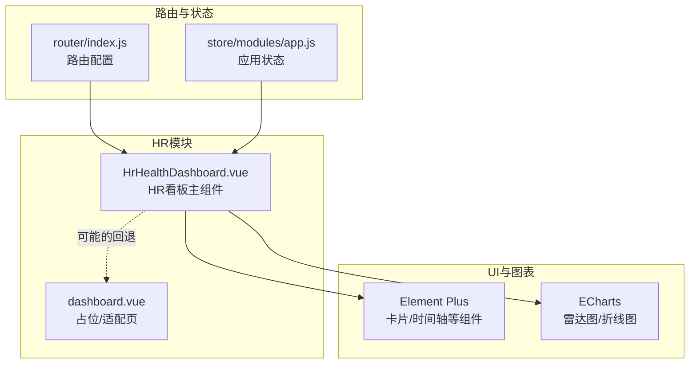
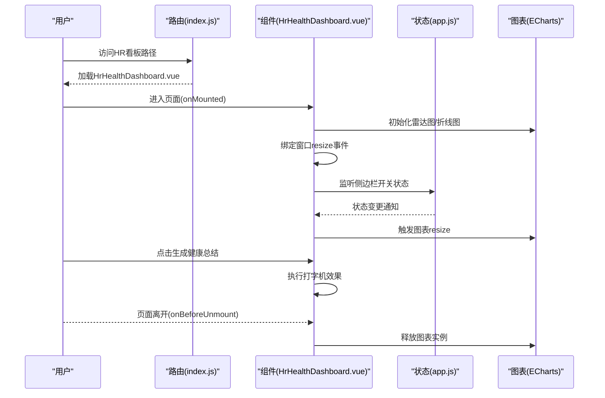
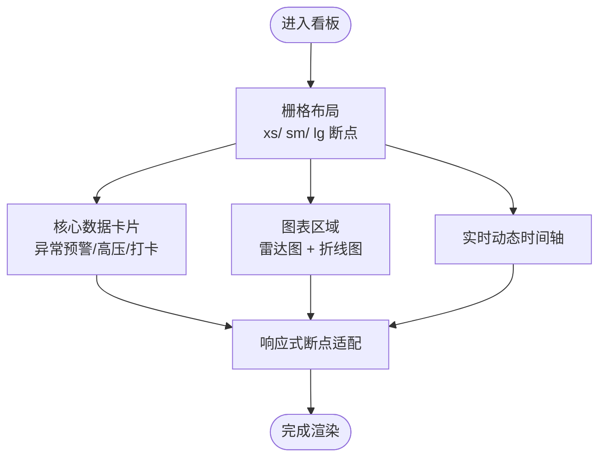
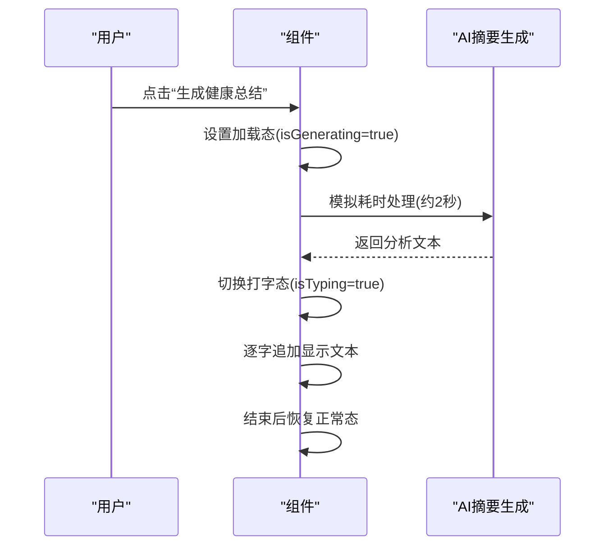
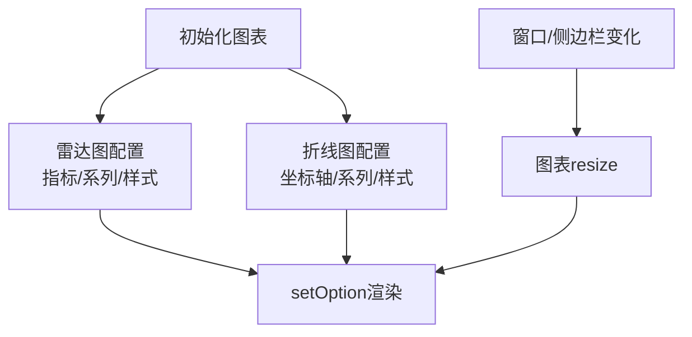
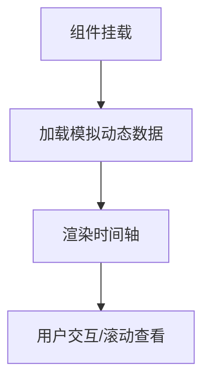
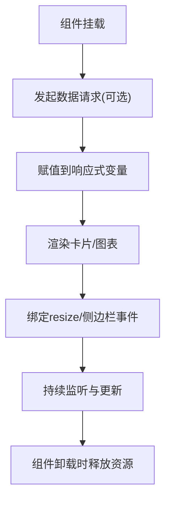
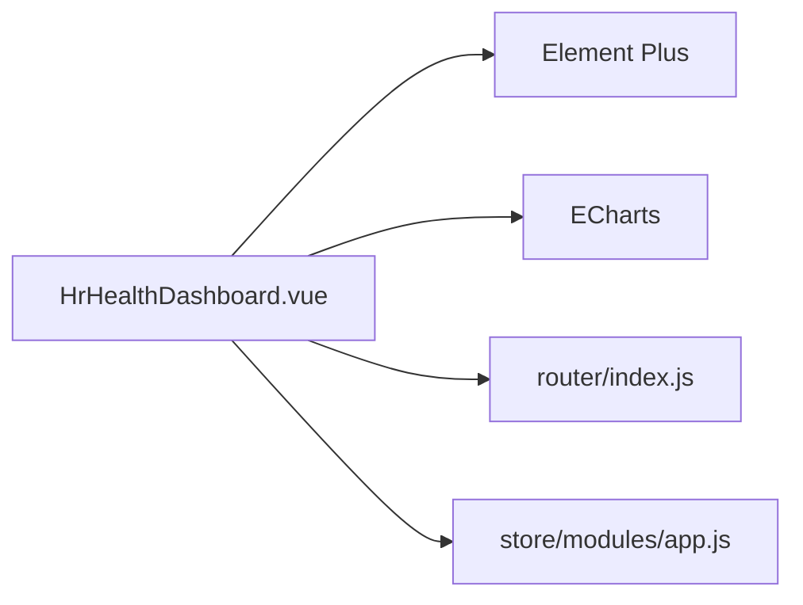

# HR看板概览

<cite>
**本文引用的文件**
- [HrHealthDashboard.vue](file://XingChen-Vue3/src/views/hr/HrHealthDashboard.vue)
- [dashboard.vue](file://XingChen-Vue3/src/views/hr/dashboard.vue)
- [index.js](file://XingChen-Vue3/src/router/index.js)
- [app.js](file://XingChen-Vue3/src/store/modules/app.js)
- [echarts](file://XingChen-Vue3/src/views/hr/HrHealthDashboard.vue)
- [element-plus](file://XingChen-Vue3/src/views/hr/HrHealthDashboard.vue)
</cite>

## 目录
1. [简介](#简介)
2. [项目结构](#项目结构)
3. [核心组件](#核心组件)
4. [架构总览](#架构总览)
5. [详细组件分析](#详细组件分析)
6. [依赖关系分析](#依赖关系分析)
7. [性能考虑](#性能考虑)
8. [故障排查指南](#故障排查指南)
9. [结论](#结论)
10. [附录](#附录)

## 简介
本文件面向HR看板概览功能，系统性阐述看板的整体布局设计、核心数据面板的实现、实时监控指标的展示方式与交互设计；解释各统计卡片的数据来源、计算逻辑与更新机制；并提供响应式设计、图表渲染优化与用户体验设计建议，以及看板自定义配置、数据刷新策略与性能优化方案。

## 项目结构
HR看板位于前端工程的HR模块视图层，采用Vue3单文件组件（SFC）形式组织，结合Element Plus组件库与ECharts进行可视化呈现。路由与状态管理分别通过路由模块与应用状态模块进行集成。

**图表来源**
- [HrHealthDashboard.vue](file://XingChen-Vue3/src/views/hr/HrHealthDashboard.vue)
- [dashboard.vue](file://XingChen-Vue3/src/views/hr/dashboard.vue)
- [index.js](file://XingChen-Vue3/src/router/index.js)
- [app.js](file://XingChen-Vue3/src/store/modules/app.js)

**章节来源**
- [HrHealthDashboard.vue](file://XingChen-Vue3/src/views/hr/HrHealthDashboard.vue)
- [dashboard.vue](file://XingChen-Vue3/src/views/hr/dashboard.vue)
- [index.js](file://XingChen-Vue3/src/router/index.js)
- [app.js](file://XingChen-Vue3/src/store/modules/app.js)

## 核心组件
- 主看板组件：负责整体布局、数据面板渲染、图表初始化与交互、响应式处理。
- 占位适配页：用于路由占位与引导，确保入口正确加载。
- 路由与状态：路由负责导航至看板，应用状态用于监听侧边栏变化以触发图表重绘。

关键职责与实现要点：
- 数据面板：包含AI健康分析摘要、异常预警部门数、高压预警人数、打卡人数等卡片。
- 图表区域：左侧雷达图展示部门健康画像，右侧折线图展示全公司压力趋势。
- 实时动态：使用时间轴组件展示系统警报与健康预警动态。
- 响应式与交互：基于Element Plus栅格系统与ECharts自适应，监听窗口尺寸变化与侧边栏开关事件。

**章节来源**
- [HrHealthDashboard.vue](file://XingChen-Vue3/src/views/hr/HrHealthDashboard.vue)
- [dashboard.vue](file://XingChen-Vue3/src/views/hr/dashboard.vue)

## 架构总览
看板采用“视图组件 + 可视化引擎 + UI框架”的分层架构。组件生命周期内完成图表初始化、事件绑定与资源释放；状态模块提供侧边栏开关状态，驱动图表重绘。

**图表来源**
- [HrHealthDashboard.vue](file://XingChen-Vue3/src/views/hr/HrHealthDashboard.vue)
- [index.js](file://XingChen-Vue3/src/router/index.js)
- [app.js](file://XingChen-Vue3/src/store/modules/app.js)

## 详细组件分析

### 布局与响应式设计
- 使用Element Plus栅格系统实现响应式布局：移动端（xs）与桌面端（lg）断点不同列宽组合，保证在不同屏幕下的可读性与紧凑度。
- 卡片容器统一采用卡片组件，具备阴影与圆角，提升信息层级感。
- 时间轴组件用于展示实时动态，支持多种类型与颜色，便于快速识别风险等级。

**图表来源**
- [HrHealthDashboard.vue](file://XingChen-Vue3/src/views/hr/HrHealthDashboard.vue)

**章节来源**
- [HrHealthDashboard.vue](file://XingChen-Vue3/src/views/hr/HrHealthDashboard.vue)

### 核心数据面板与交互
- AI健康分析摘要：提供按钮触发生成流程，包含加载态与打字机效果，模拟AI分析过程。
- 异常预警部门数、高压预警人数、打卡人数：以数值卡片形式展示，图标颜色区分风险等级。
- 交互行为：按钮禁用状态避免重复触发，打字机逐字输出提升阅读体验。

**图表来源**
- [HrHealthDashboard.vue](file://XingChen-Vue3/src/views/hr/HrHealthDashboard.vue)

**章节来源**
- [HrHealthDashboard.vue](file://XingChen-Vue3/src/views/hr/HrHealthDashboard.vue)

### 图表渲染与更新机制
- 雷达图：展示部门健康画像，包含指标项与多系列对比，支持提示框与图例。
- 折线图：展示全公司压力指数周趋势，平滑曲线与渐变填充增强视觉表现。
- 更新机制：窗口尺寸变化与侧边栏开关事件触发图表resize，确保图表在布局变化后保持最佳显示效果。

**图表来源**
- [HrHealthDashboard.vue](file://XingChen-Vue3/src/views/hr/HrHealthDashboard.vue)

**章节来源**
- [HrHealthDashboard.vue](file://XingChen-Vue3/src/views/hr/HrHealthDashboard.vue)

### 实时监控与动态展示
- 使用时间轴组件展示系统警报与健康预警动态，支持按类型设置颜色与尺寸，便于快速识别风险等级。
- 动态内容来源于本地模拟数据，实际场景可替换为后端推送或轮询获取。

**图表来源**
- [HrHealthDashboard.vue](file://XingChen-Vue3/src/views/hr/HrHealthDashboard.vue)

**章节来源**
- [HrHealthDashboard.vue](file://XingChen-Vue3/src/views/hr/HrHealthDashboard.vue)

### 数据来源、计算逻辑与更新机制
- 当前实现为前端模拟数据，包括健康评分、异常预警部门数、高压预警人数、打卡人数、雷达图数据与折线图数据。
- 计算逻辑：无复杂计算，直接赋值或简单统计；如需接入真实数据，可在组件挂载时发起API请求，将返回数据写入对应响应式变量。
- 更新机制：组件生命周期控制图表初始化与销毁；窗口与侧边栏事件驱动图表重绘；AI摘要按钮触发状态切换与文本渲染。

**图表来源**
- [HrHealthDashboard.vue](file://XingChen-Vue3/src/views/hr/HrHealthDashboard.vue)

**章节来源**
- [HrHealthDashboard.vue](file://XingChen-Vue3/src/views/hr/HrHealthDashboard.vue)

## 依赖关系分析
- 组件依赖：HrHealthDashboard.vue依赖Element Plus组件库与ECharts；路由模块负责导航；应用状态模块提供侧边栏状态。
- 外部依赖：ECharts用于图表渲染；Element Plus用于UI组件与栅格系统；Vue3响应式系统用于数据驱动视图。

**图表来源**
- [HrHealthDashboard.vue](file://XingChen-Vue3/src/views/hr/HrHealthDashboard.vue)
- [index.js](file://XingChen-Vue3/src/router/index.js)
- [app.js](file://XingChen-Vue3/src/store/modules/app.js)

**章节来源**
- [HrHealthDashboard.vue](file://XingChen-Vue3/src/views/hr/HrHealthDashboard.vue)
- [index.js](file://XingChen-Vue3/src/router/index.js)
- [app.js](file://XingChen-Vue3/src/store/modules/app.js)

## 性能考虑
- 图表渲染优化
  - 避免频繁重绘：仅在窗口尺寸变化或侧边栏状态变化时触发resize。
  - 延迟重绘：侧边栏动画结束后再执行resize，减少抖动。
  - 资源释放：组件卸载时销毁图表实例，防止内存泄漏。
- 交互性能
  - AI摘要按钮加入防抖与状态锁，避免重复触发。
  - 打字机效果采用定时器逐字输出，降低一次性渲染压力。
- 响应式性能
  - 使用Element Plus栅格系统，减少自定义CSS计算。
  - 控制图表尺寸与容器比例，避免超大画布导致的渲染开销。

**章节来源**
- [HrHealthDashboard.vue](file://XingChen-Vue3/src/views/hr/HrHealthDashboard.vue)

## 故障排查指南
- 看板无法加载
  - 检查路由是否正确指向HrHealthDashboard.vue；若出现占位页，确认路由配置与组件名称一致。
- 图表不显示或显示异常
  - 确认图表容器DOM存在且可见；检查初始化函数是否被调用；验证resize事件绑定与移除。
- 侧边栏切换后图表变形
  - 确保侧边栏状态监听生效；等待动画结束后再触发resize；检查容器高度与宽度计算。
- AI摘要按钮无效
  - 检查按钮状态锁与加载态逻辑；确认打字机定时器正确清理；避免重复点击。

**章节来源**
- [HrHealthDashboard.vue](file://XingChen-Vue3/src/views/hr/HrHealthDashboard.vue)
- [dashboard.vue](file://XingChen-Vue3/src/views/hr/dashboard.vue)

## 结论
HR看板概览通过清晰的布局与丰富的可视化组件，实现了对健康数据的直观呈现与交互体验优化。当前版本以模拟数据为主，具备良好的扩展性：接入真实数据源、完善数据刷新策略与图表性能优化，即可满足生产环境需求。

## 附录
- 自定义配置建议
  - 卡片与图表：通过props或配置对象注入指标项、颜色与样式，便于主题切换与业务定制。
  - 数据刷新：引入定时任务或WebSocket订阅，按需刷新核心指标与图表数据。
  - 交互增强：为卡片添加跳转能力，连接到更细粒度的健康分析页面或部门详情页。
- 数据刷新策略
  - 定时刷新：基于定时器周期拉取最新数据，更新响应式变量。
  - 事件驱动：监听全局状态变化或用户操作，触发局部刷新。
  - 缓存策略：对静态指标与历史趋势数据进行缓存，减少重复请求。
- 性能优化方案
  - 图表懒加载：在用户滚动到可视区域后再初始化图表。
  - 分帧渲染：将大量数据分批渲染，避免主线程阻塞。
  - 内存管理：及时清理定时器、事件监听器与图表实例，防止内存泄漏。