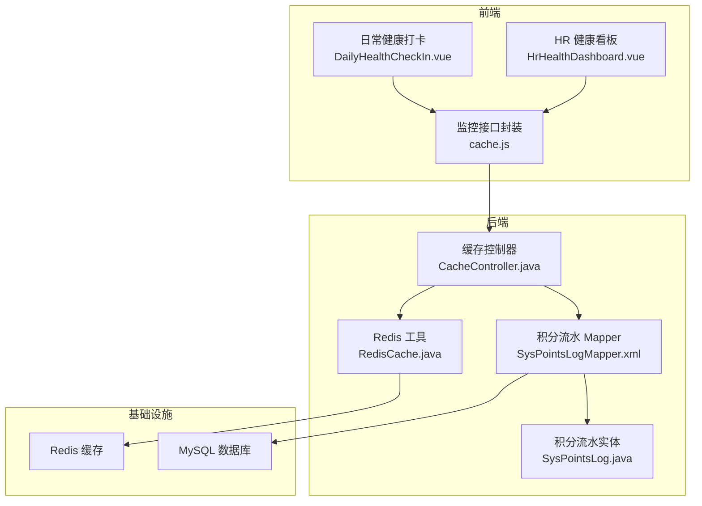
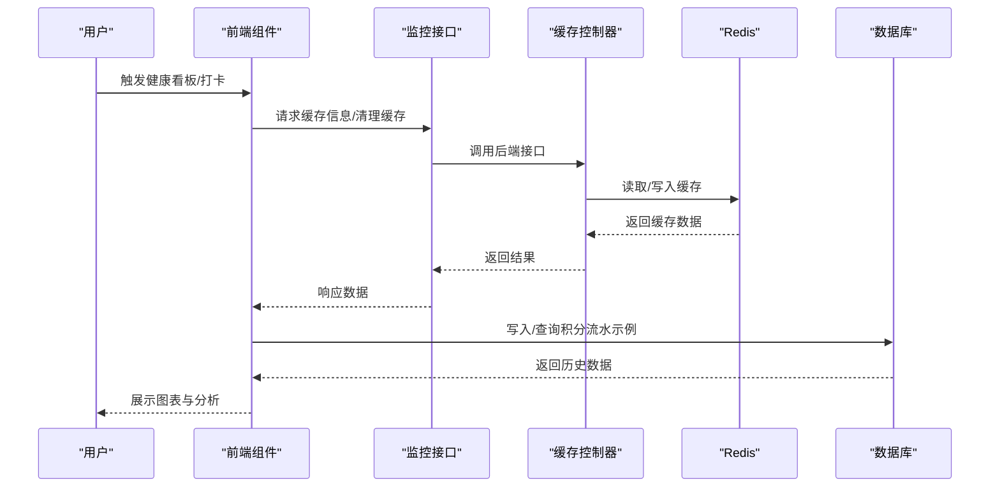
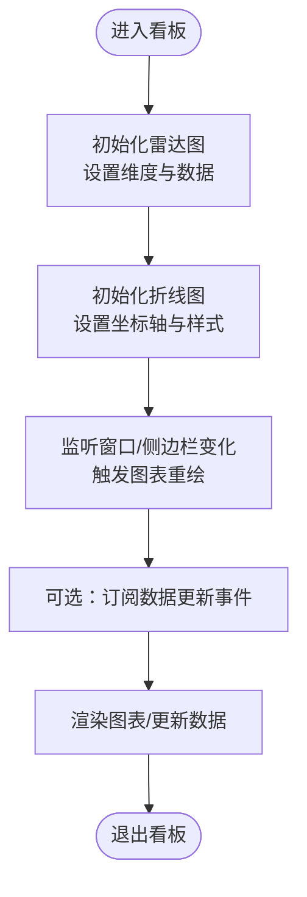
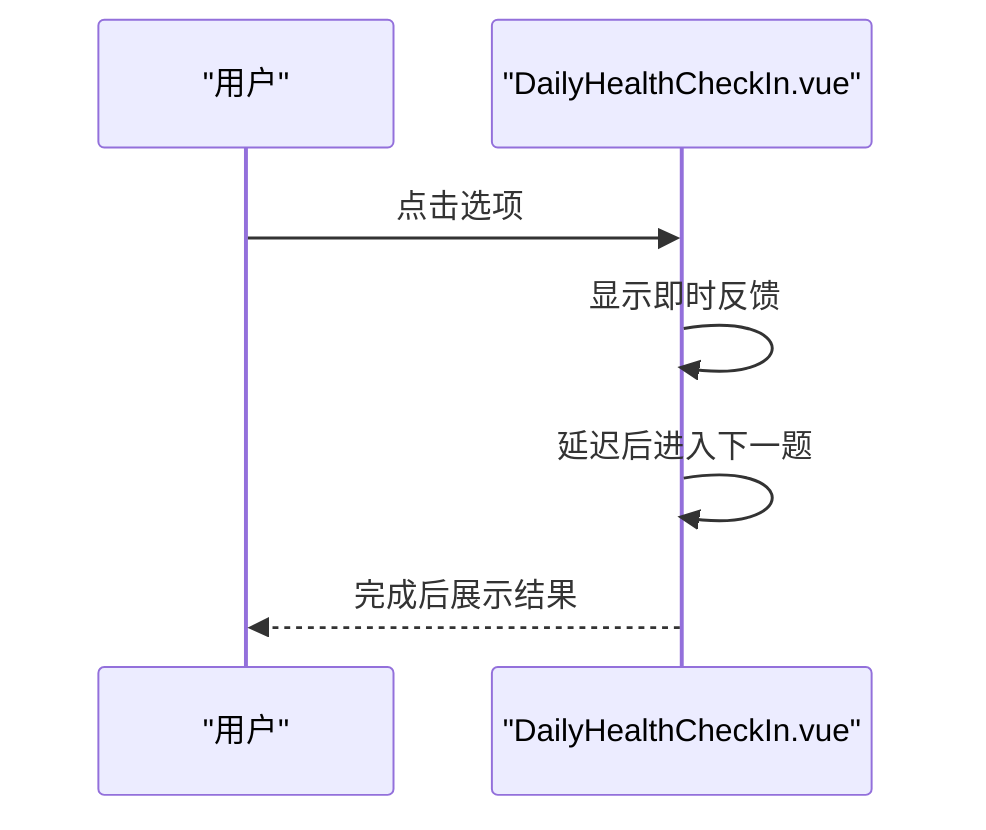
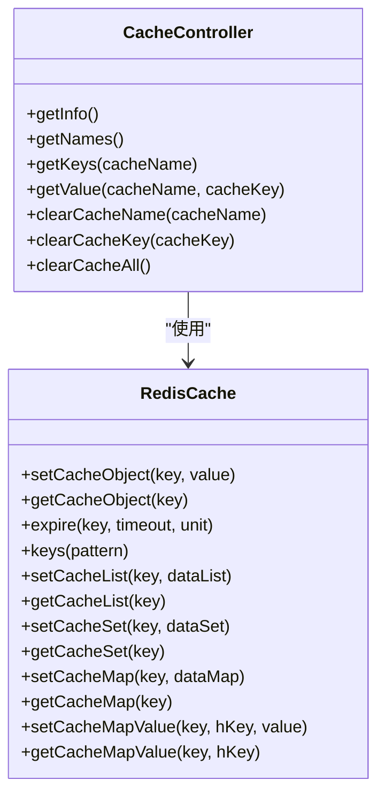
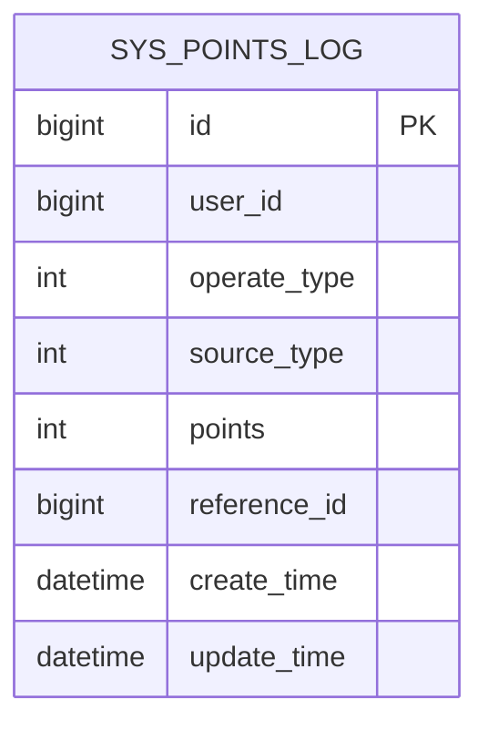
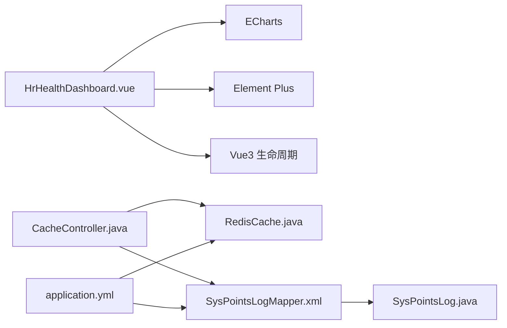

# 健康数据分析

<cite>
**本文引用的文件**   
- [HrHealthDashboard.vue](file://XingChen-Vue3/src/views/hr/HrHealthDashboard.vue)
- [DailyHealthCheckIn.vue](file://XingChen-Vue3/src/components/DailyHealthCheckIn.vue)
- [cache.js](file://XingChen-Vue3/src/api/monitor/cache.js)
- [index.vue](file://XingChen-Vue3/src/views/monitor/cache/index.vue)
- [RedisCache.java](file://XingChen-Vue/xingchen-common/src/main/java/com/xingchen/common/core/redis/RedisCache.java)
- [application.yml](file://XingChen-Vue/xingchen-admin/src/main/resources/application.yml)
- [SysPointsLog.java](file://XingChen-Vue/xingchen-system/src/main/java/com/xingchen/system/domain/SysPointsLog.java)
- [SysPointsLogMapper.xml](file://XingChen-Vue/xingchen-system/src/main/resources/mapper/system/SysPointsLogMapper.xml)
- [CacheController.java](file://XingChen-Vue/xingchen-admin/src/main/java/com/xingchen/web/controller/monitor/CacheController.java)
</cite>

## 目录
1. [简介](#简介)
2. [项目结构](#项目结构)
3. [核心组件](#核心组件)
4. [架构总览](#架构总览)
5. [详细组件分析](#详细组件分析)
6. [依赖关系分析](#依赖关系分析)
7. [性能考虑](#性能考虑)
8. [故障排查指南](#故障排查指南)
9. [结论](#结论)
10. [附录](#附录)

## 简介
本文件面向“健康数据分析”主题，系统梳理该健康管理系统中健康数据的采集流程、统计分析与聚合方法、趋势预测思路、可视化图表的数据处理与样式定制，并给出数据质量控制、异常值检测与清洗机制建议，以及性能优化、缓存策略与实时更新方案。文档以仓库现有代码为基础，结合可扩展的最佳实践进行说明。

## 项目结构
本项目采用前后端分离架构，前端基于 Vue3 + Element Plus + ECharts，后端基于 Spring Boot + MyBatis，Redis 用于缓存与监控，数据库持久化健康相关流水与配置。

**图表来源**
- [HrHealthDashboard.vue:1-200](file://XingChen-Vue3/src/views/hr/HrHealthDashboard.vue#L1-L200)
- [DailyHealthCheckIn.vue:1-140](file://XingChen-Vue3/src/components/DailyHealthCheckIn.vue#L1-L140)
- [cache.js:1-57](file://XingChen-Vue3/src/api/monitor/cache.js#L1-L57)
- [CacheController.java:38-93](file://XingChen-Vue/xingchen-admin/src/main/java/com/xingchen/web/controller/monitor/CacheController.java#L38-L93)
- [RedisCache.java:1-120](file://XingChen-Vue/xingchen-common/src/main/java/com/xingchen/common/core/redis/RedisCache.java#L1-L120)
- [SysPointsLogMapper.xml:22-46](file://XingChen-Vue/xingchen-system/src/main/resources/mapper/system/SysPointsLogMapper.xml#L22-L46)
- [SysPointsLog.java:1-105](file://XingChen-Vue/xingchen-system/src/main/java/com/xingchen/system/domain/SysPointsLog.java#L1-L105)

**章节来源**
- [HrHealthDashboard.vue:1-200](file://XingChen-Vue3/src/views/hr/HrHealthDashboard.vue#L1-L200)
- [DailyHealthCheckIn.vue:1-140](file://XingChen-Vue3/src/components/DailyHealthCheckIn.vue#L1-L140)
- [cache.js:1-57](file://XingChen-Vue3/src/api/monitor/cache.js#L1-L57)
- [CacheController.java:38-93](file://XingChen-Vue/xingchen-admin/src/main/java/com/xingchen/web/controller/monitor/CacheController.java#L38-L93)
- [RedisCache.java:1-120](file://XingChen-Vue/xingchen-common/src/main/java/com/xingchen/common/core/redis/RedisCache.java#L1-L120)
- [SysPointsLogMapper.xml:22-46](file://XingChen-Vue/xingchen-system/src/main/resources/mapper/system/SysPointsLogMapper.xml#L22-L46)
- [SysPointsLog.java:1-105](file://XingChen-Vue/xingchen-system/src/main/java/com/xingchen/system/domain/SysPointsLog.java#L1-L105)

## 核心组件
- 健康看板（HR 健康看板）：负责展示核心指标、雷达图（部门健康画像）、折线图（压力趋势）、实时预警动态。
- 日常健康打卡：提供游戏化问答与即时反馈，作为健康数据采集入口之一。
- 缓存监控与接口：提供缓存信息查询、键名列表、值读取与清理能力。
- Redis 工具：统一的 Redis 操作封装，支持对象、List、Set、Hash 等多种数据结构。
- 积分流水（SysPointsLog）：记录健康行为相关的积分变动，支撑统计与分析。

**章节来源**
- [HrHealthDashboard.vue:1-200](file://XingChen-Vue3/src/views/hr/HrHealthDashboard.vue#L1-L200)
- [DailyHealthCheckIn.vue:1-140](file://XingChen-Vue3/src/components/DailyHealthCheckIn.vue#L1-L140)
- [cache.js:1-57](file://XingChen-Vue3/src/api/monitor/cache.js#L1-L57)
- [RedisCache.java:1-120](file://XingChen-Vue/xingchen-common/src/main/java/com/xingchen/common/core/redis/RedisCache.java#L1-L120)
- [SysPointsLog.java:1-105](file://XingChen-Vue/xingchen-system/src/main/java/com/xingchen/system/domain/SysPointsLog.java#L1-L105)

## 架构总览
健康数据从采集（日常打卡、行为事件）到存储（积分流水、缓存），再到分析与可视化（看板、图表、预警），形成闭环。

**图表来源**
- [HrHealthDashboard.vue:210-365](file://XingChen-Vue3/src/views/hr/HrHealthDashboard.vue#L210-L365)
- [cache.js:1-57](file://XingChen-Vue3/src/api/monitor/cache.js#L1-L57)
- [CacheController.java:38-93](file://XingChen-Vue/xingchen-admin/src/main/java/com/xingchen/web/controller/monitor/CacheController.java#L38-L93)
- [RedisCache.java:1-120](file://XingChen-Vue/xingchen-common/src/main/java/com/xingchen/common/core/redis/RedisCache.java#L1-L120)
- [SysPointsLogMapper.xml:22-46](file://XingChen-Vue/xingchen-system/src/main/resources/mapper/system/SysPointsLogMapper.xml#L22-L46)

## 详细组件分析

### 健康看板（HR 健康看板）
- 数据采集与模拟：组件内包含健康评分、异常预警部门数、高压预警人数、打卡人数等模拟数据，用于演示看板效果。
- 可视化图表：
  - 雷达图：展示部门健康画像（颈椎风险、眼部疲劳、压力指数、久坐时长、借款异常等维度）。
  - 折线图：展示全公司压力指数周趋势，含平滑曲线、面积填充与网格布局。
- 实时预警动态：使用时间轴组件展示系统警报。
- 图表生命周期：挂载时初始化 ECharts，监听窗口尺寸变化与侧边栏展开收起，卸载时释放资源。

**图表来源**
- [HrHealthDashboard.vue:210-365](file://XingChen-Vue3/src/views/hr/HrHealthDashboard.vue#L210-L365)

**章节来源**
- [HrHealthDashboard.vue:1-200](file://XingChen-Vue3/src/views/hr/HrHealthDashboard.vue#L1-L200)
- [HrHealthDashboard.vue:210-365](file://XingChen-Vue3/src/views/hr/HrHealthDashboard.vue#L210-L365)

### 日常健康打卡（DailyHealthCheckIn）
- 采集流程：渐进式问答（睡眠、颈椎、饮水），每题有即时反馈与动画过渡。
- 数据结构：问题列表包含题目、选项与反馈类型，便于后续统计与分析。
- 使用场景：作为健康数据采集入口，可扩展为将答案持久化或写入缓存供看板使用。

**图表来源**
- [DailyHealthCheckIn.vue:60-137](file://XingChen-Vue3/src/components/DailyHealthCheckIn.vue#L60-L137)

**章节来源**
- [DailyHealthCheckIn.vue:1-140](file://XingChen-Vue3/src/components/DailyHealthCheckIn.vue#L1-L140)

### 缓存监控与接口
- 前端接口封装：提供查询缓存详情、缓存名称列表、键名列表、键值、清理指定名称/键/全部缓存等方法。
- 后端控制器：从 Redis 读取基本信息、命令统计、数据库大小，并返回给前端。
- Redis 工具：统一封装 Redis 操作（对象、List、Set、Hash、过期时间等）。

**图表来源**
- [CacheController.java:38-93](file://XingChen-Vue/xingchen-admin/src/main/java/com/xingchen/web/controller/monitor/CacheController.java#L38-L93)
- [RedisCache.java:1-120](file://XingChen-Vue/xingchen-common/src/main/java/com/xingchen/common/core/redis/RedisCache.java#L1-L120)

**章节来源**
- [cache.js:1-57](file://XingChen-Vue3/src/api/monitor/cache.js#L1-L57)
- [index.vue:1-95](file://XingChen-Vue3/src/views/monitor/cache/index.vue#L1-L95)
- [CacheController.java:38-93](file://XingChen-Vue/xingchen-admin/src/main/java/com/xingchen/web/controller/monitor/CacheController.java#L38-L93)
- [RedisCache.java:1-120](file://XingChen-Vue/xingchen-common/src/main/java/com/xingchen/common/core/redis/RedisCache.java#L1-L120)

### 积分流水（SysPointsLog）
- 数据模型：记录用户 ID、操作类型（收入/支出）、来源类型（如每日打卡、连续奖励、兑换、HR退还）、波动分值、业务关联 ID。
- 查询条件：支持按用户、来源类型、时间范围等过滤，便于统计分析与报表生成。

**图表来源**
- [SysPointsLog.java:1-105](file://XingChen-Vue/xingchen-system/src/main/java/com/xingchen/system/domain/SysPointsLog.java#L1-L105)
- [SysPointsLogMapper.xml:22-46](file://XingChen-Vue/xingchen-system/src/main/resources/mapper/system/SysPointsLogMapper.xml#L22-L46)

**章节来源**
- [SysPointsLog.java:1-105](file://XingChen-Vue/xingchen-system/src/main/java/com/xingchen/system/domain/SysPointsLog.java#L1-L105)
- [SysPointsLogMapper.xml:22-46](file://XingChen-Vue/xingchen-system/src/main/resources/mapper/system/SysPointsLogMapper.xml#L22-L46)

## 依赖关系分析
- 前端依赖：ECharts 用于图表渲染；Element Plus 提供图标与组件；Vue3 响应式与生命周期管理。
- 后端依赖：Spring Data Redis 与 RedisTemplate；MyBatis Mapper 映射；Spring MVC 控制器。
- 配置依赖：application.yml 中配置 Redis 连接、Jackson 时间格式、分页插件等。

**图表来源**
- [HrHealthDashboard.vue:1-200](file://XingChen-Vue3/src/views/hr/HrHealthDashboard.vue#L1-L200)
- [CacheController.java:38-93](file://XingChen-Vue/xingchen-admin/src/main/java/com/xingchen/web/controller/monitor/CacheController.java#L38-L93)
- [RedisCache.java:1-120](file://XingChen-Vue/xingchen-common/src/main/java/com/xingchen/common/core/redis/RedisCache.java#L1-L120)
- [SysPointsLogMapper.xml:22-46](file://XingChen-Vue/xingchen-system/src/main/resources/mapper/system/SysPointsLogMapper.xml#L22-L46)
- [application.yml:72-94](file://XingChen-Vue/xingchen-admin/src/main/resources/application.yml#L72-L94)

**章节来源**
- [application.yml:72-94](file://XingChen-Vue/xingchen-admin/src/main/resources/application.yml#L72-L94)

## 性能考虑
- 图表渲染优化
  - 避免频繁重绘：仅在数据或容器尺寸变化时调用 resize。
  - 平滑曲线与面积填充：在大数据量时可考虑采样或降维。
- 缓存策略
  - Redis 对象缓存：设置合理过期时间，热点数据短命、冷数据长命。
  - 分布式缓存：使用命名空间前缀避免键冲突。
  - 批量操作：优先使用 List/Set/Hash 的批量写入与读取。
- 数据库优化
  - 查询条件：利用时间范围、用户 ID、来源类型等建立索引。
  - 分页：PageHelper 配合 limit/offset，避免一次性加载过多数据。
- 前端性能
  - 组件懒加载与按需引入 ECharts 模块。
  - 避免不必要的响应式依赖与深层嵌套。

[本节为通用指导，不直接分析具体文件]

## 故障排查指南
- 缓存监控接口异常
  - 检查 Redis 连接配置与连通性。
  - 查看后端日志与异常栈，确认 RedisTemplate 使用是否正确。
- 图表不显示或空白
  - 确认容器尺寸与 ECharts 实例存在。
  - 检查坐标轴与数据格式是否匹配。
- 数据不更新
  - 核对缓存键与过期时间。
  - 检查数据库查询条件与时间范围。

**章节来源**
- [application.yml:72-94](file://XingChen-Vue/xingchen-admin/src/main/resources/application.yml#L72-L94)
- [CacheController.java:38-93](file://XingChen-Vue/xingchen-admin/src/main/java/com/xingchen/web/controller/monitor/CacheController.java#L38-L93)
- [RedisCache.java:1-120](file://XingChen-Vue/xingchen-common/src/main/java/com/xingchen/common/core/redis/RedisCache.java#L1-L120)

## 结论
本系统以健康看板为核心，结合日常打卡、缓存监控与积分流水，构建了从采集、存储到分析可视化的完整链路。现有实现侧重演示与集成，建议后续在以下方面深化：完善真实数据采集与清洗、引入统计分析与趋势预测算法、强化缓存与数据库性能优化、增强异常检测与自动预警机制。

[本节为总结性内容，不直接分析具体文件]

## 附录

### 可视化图表数据处理与样式定制要点
- 雷达图
  - 维度与最大值：根据业务指标设定 max，确保多部门对比一致。
  - 区域样式：透明度与渐变色提升可读性。
- 折线图
  - 坐标轴：分类轴与数值轴分离，网格与分割线提升阅读体验。
  - 曲线与面积：平滑曲线与渐变面积增强趋势表达。
- 样式定制
  - 颜色体系：统一品牌色与状态色（危险/警告/成功）。
  - 响应式：监听窗口变化，保证图表自适应。

**章节来源**
- [HrHealthDashboard.vue:210-365](file://XingChen-Vue3/src/views/hr/HrHealthDashboard.vue#L210-L365)

### 数据质量控制与异常值检测建议
- 数据质量控制
  - 缺失值：对缺失项进行标记与回填策略（均值/前向/后向填充）。
  - 重复值：按时间戳与用户 ID 去重。
  - 范围校验：对指标设置上下界，超出范围视为异常。
- 异常值检测
  - 统计法：Z-Score 或 IQR 方法识别离群点。
  - 机器学习：孤立森林或 One-Class SVM 识别异常模式。
- 数据清洗
  - 规范化：统一单位与格式。
  - 一致性：跨表关联校验（如用户 ID、业务关联 ID）。

[本节为通用指导，不直接分析具体文件]

### 趋势预测模型建议
- 时间序列模型：ARIMA/Prophet 适合短期趋势预测。
- 机器学习：随机森林/梯度提升树回归，特征可包括历史均值、方差、周期性指标。
- 在线学习：增量模型适配实时数据流。

[本节为通用指导，不直接分析具体文件]