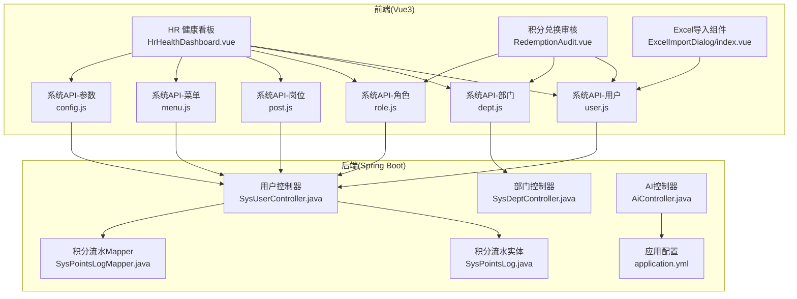
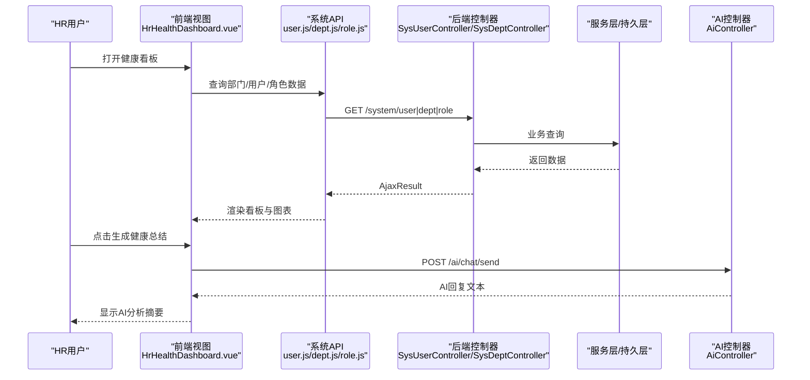
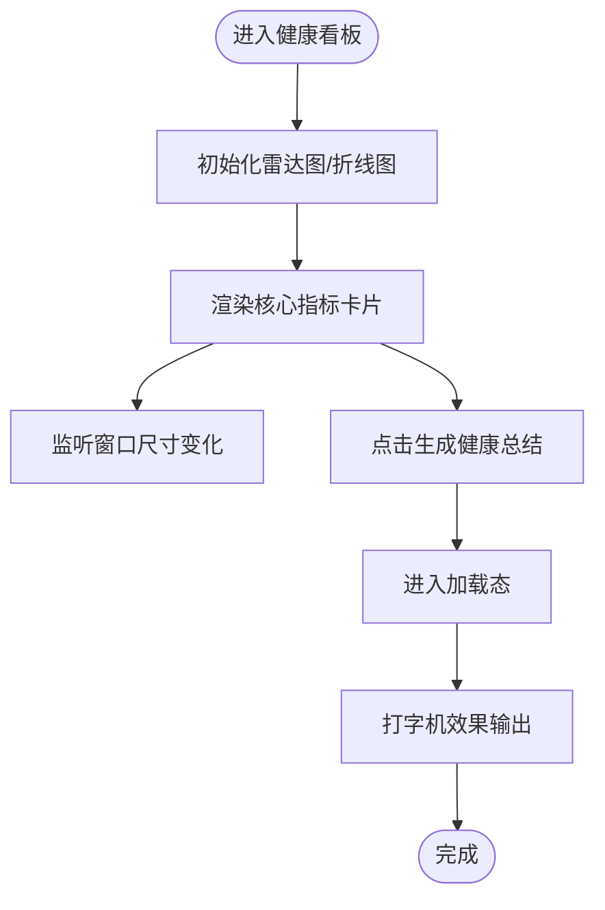
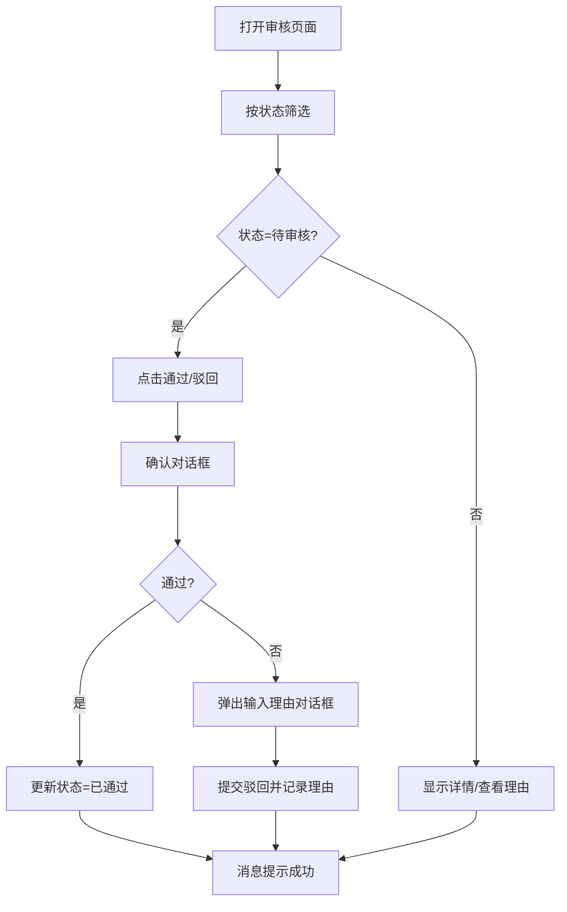
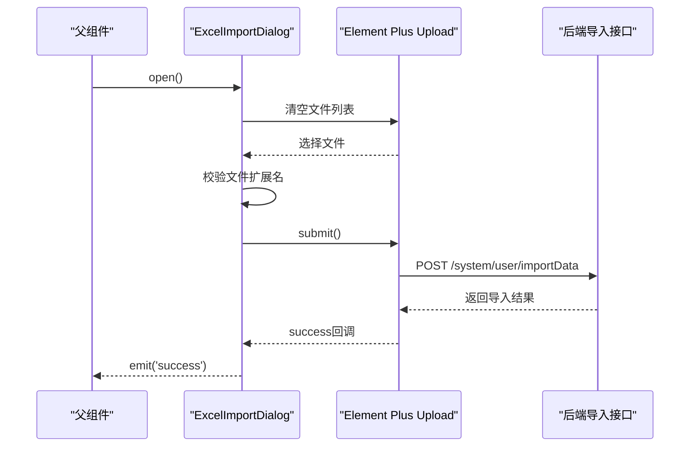
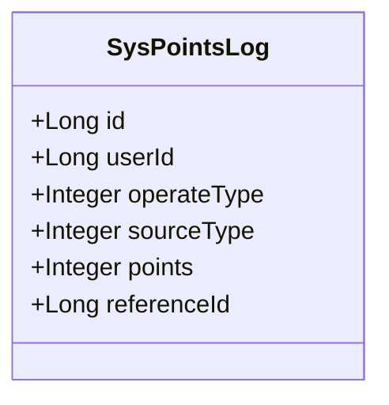
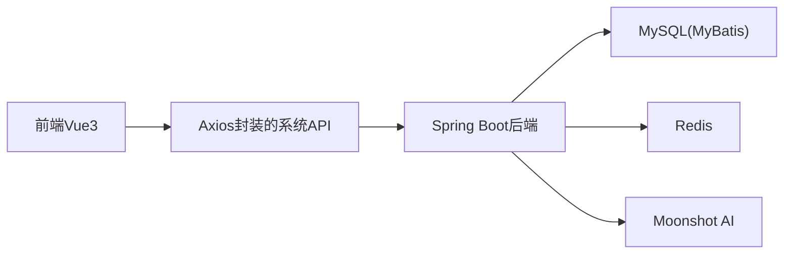

# 员工管理

<cite>
**本文引用的文件**   
- [HrHealthDashboard.vue](file://XingChen-Vue3/src/views/hr/HrHealthDashboard.vue)
- [RedemptionAudit.vue](file://XingChen-Vue3/src/views/hr/RedemptionAudit.vue)
- [user.js](file://XingChen-Vue3/src/api/system/user.js)
- [dept.js](file://XingChen-Vue3/src/api/system/dept.js)
- [role.js](file://XingChen-Vue3/src/api/system/role.js)
- [post.js](file://XingChen-Vue3/src/api/system/post.js)
- [menu.js](file://XingChen-Vue3/src/api/system/menu.js)
- [config.js](file://XingChen-Vue3/src/api/system/config.js)
- [ExcelImportDialog/index.vue](file://XingChen-Vue3/src/components/ExcelImportDialog/index.vue)
- [SysUserController.java](file://XingChen-Vue/xingchen-admin/src/main/java/com/xingchen/web/controller/system/SysUserController.java)
- [SysDeptController.java](file://XingChen-Vue/xingchen-admin/src/main/java/com/xingchen/web/controller/system/SysDeptController.java)
- [AiController.java](file://XingChen-Vue/xingchen-admin/src/main/java/com/xingchen/web/controller/al/AiController.java)
- [SysPointsLog.java](file://XingChen-Vue/xingchen-system/src/main/java/com/xingchen/system/domain/SysPointsLog.java)
- [SysPointsLogMapper.java](file://XingChen-Vue/xingchen-system/src/main/java/com/xingchen/system/mapper/SysPointsLogMapper.java)
- [application.yml](file://XingChen-Vue/xingchen-admin/src/main/resources/application.yml)
</cite>

## 目录
1. [简介](#简介)
2. [项目结构](#项目结构)
3. [核心组件](#核心组件)
4. [架构总览](#架构总览)
5. [详细组件分析](#详细组件分析)
6. [依赖分析](#依赖分析)
7. [性能考虑](#性能考虑)
8. [故障排查指南](#故障排查指南)
9. [结论](#结论)
10. [附录](#附录)

## 简介
本文件面向“员工管理”功能域，系统性梳理员工信息维护、健康档案与行为追踪、积分兑换审核、部门组织架构管理、角色权限分配、异常预警与处理、数据安全与批量导入导出等能力。文档以前后端分离架构为基础，结合前端 Vue3 + Element Plus 的可视化界面与后端 Spring Boot + MyBatis 的服务层实现，提供从数据模型到业务流程的全景式说明，并辅以可视化图示帮助不同背景读者快速理解。

## 项目结构
- 前端采用 Vue3 技术栈，HR 专区包含健康看板与积分兑换审核两大视图；系统管理 API 覆盖用户、部门、角色、岗位、菜单、参数等；通用组件包括 Excel 导入对话框。
- 后端采用 Spring Boot + MyBatis，系统模块提供用户、部门、角色、菜单、参数等管理接口；AI 控制器对接第三方大模型服务；积分流水实体与 Mapper 支撑积分业务。

**图示来源**
- [HrHealthDashboard.vue:1-481](file://XingChen-Vue3/src/views/hr/HrHealthDashboard.vue#L1-L481)
- [RedemptionAudit.vue:1-250](file://XingChen-Vue3/src/views/hr/RedemptionAudit.vue#L1-L250)
- [user.js:1-137](file://XingChen-Vue3/src/api/system/user.js#L1-L137)
- [dept.js:1-61](file://XingChen-Vue3/src/api/system/dept.js#L1-L61)
- [role.js:1-120](file://XingChen-Vue3/src/api/system/role.js#L1-L120)
- [post.js:1-45](file://XingChen-Vue3/src/api/system/post.js#L1-L45)
- [menu.js:1-69](file://XingChen-Vue3/src/api/system/menu.js#L1-L69)
- [config.js:1-61](file://XingChen-Vue3/src/api/system/config.js#L1-L61)
- [ExcelImportDialog/index.vue:1-138](file://XingChen-Vue3/src/components/ExcelImportDialog/index.vue#L1-L138)
- [SysUserController.java:1-257](file://XingChen-Vue/xingchen-admin/src/main/java/com/xingchen/web/controller/system/SysUserController.java#L1-L257)
- [SysDeptController.java:1-148](file://XingChen-Vue/xingchen-admin/src/main/java/com/xingchen/web/controller/system/SysDeptController.java#L1-L148)
- [AiController.java:1-165](file://XingChen-Vue/xingchen-admin/src/main/java/com/xingchen/web/controller/al/AiController.java#L1-L165)
- [SysPointsLog.java:1-105](file://XingChen-Vue/xingchen-system/src/main/java/com/xingchen/system/domain/SysPointsLog.java#L1-L105)
- [SysPointsLogMapper.java:1-61](file://XingChen-Vue/xingchen-system/src/main/java/com/xingchen/system/mapper/SysPointsLogMapper.java#L1-L61)
- [application.yml:1-148](file://XingChen-Vue/xingchen-admin/src/main/resources/application.yml#L1-L148)

**章节来源**
- [HrHealthDashboard.vue:1-481](file://XingChen-Vue3/src/views/hr/HrHealthDashboard.vue#L1-L481)
- [RedemptionAudit.vue:1-250](file://XingChen-Vue3/src/views/hr/RedemptionAudit.vue#L1-L250)
- [user.js:1-137](file://XingChen-Vue3/src/api/system/user.js#L1-L137)
- [dept.js:1-61](file://XingChen-Vue3/src/api/system/dept.js#L1-L61)
- [role.js:1-120](file://XingChen-Vue3/src/api/system/role.js#L1-L120)
- [post.js:1-45](file://XingChen-Vue3/src/api/system/post.js#L1-L45)
- [menu.js:1-69](file://XingChen-Vue3/src/api/system/menu.js#L1-L69)
- [config.js:1-61](file://XingChen-Vue3/src/api/system/config.js#L1-L61)
- [ExcelImportDialog/index.vue:1-138](file://XingChen-Vue3/src/components/ExcelImportDialog/index.vue#L1-L138)
- [SysUserController.java:1-257](file://XingChen-Vue/xingchen-admin/src/main/java/com/xingchen/web/controller/system/SysUserController.java#L1-L257)
- [SysDeptController.java:1-148](file://XingChen-Vue/xingchen-admin/src/main/java/com/xingchen/web/controller/system/SysDeptController.java#L1-L148)
- [AiController.java:1-165](file://XingChen-Vue/xingchen-admin/src/main/java/com/xingchen/web/controller/al/AiController.java#L1-L165)
- [SysPointsLog.java:1-105](file://XingChen-Vue/xingchen-system/src/main/java/com/xingchen/system/domain/SysPointsLog.java#L1-L105)
- [SysPointsLogMapper.java:1-61](file://XingChen-Vue/xingchen-system/src/main/java/com/xingchen/system/mapper/SysPointsLogMapper.java#L1-L61)
- [application.yml:1-148](file://XingChen-Vue/xingchen-admin/src/main/resources/application.yml#L1-L148)

## 核心组件
- 健康看板组件：提供部门健康画像雷达图、全公司压力趋势折线图、实时预警动态时间轴，支持 AI 健康分析总结生成。
- 积分兑换审核组件：支持按状态筛选、通过/驳回操作、查看驳回理由，模拟数据驱动的审核流程。
- 系统管理 API：统一封装用户、部门、角色、岗位、菜单、参数等 CRUD 与授权相关接口。
- Excel 导入组件：提供模板下载、文件校验、覆盖更新选项、上传进度与结果弹窗。
- 后端控制器：用户、部门、AI 控制器分别负责员工信息、组织架构与外部 AI 服务集成。
- 积分流水实体与 Mapper：支撑积分收入/支出、场景分类、业务关联等字段。

**章节来源**
- [HrHealthDashboard.vue:1-481](file://XingChen-Vue3/src/views/hr/HrHealthDashboard.vue#L1-L481)
- [RedemptionAudit.vue:1-250](file://XingChen-Vue3/src/views/hr/RedemptionAudit.vue#L1-L250)
- [user.js:1-137](file://XingChen-Vue3/src/api/system/user.js#L1-L137)
- [dept.js:1-61](file://XingChen-Vue3/src/api/system/dept.js#L1-L61)
- [role.js:1-120](file://XingChen-Vue3/src/api/system/role.js#L1-L120)
- [post.js:1-45](file://XingChen-Vue3/src/api/system/post.js#L1-L45)
- [menu.js:1-69](file://XingChen-Vue3/src/api/system/menu.js#L1-L69)
- [config.js:1-61](file://XingChen-Vue3/src/api/system/config.js#L1-L61)
- [ExcelImportDialog/index.vue:1-138](file://XingChen-Vue3/src/components/ExcelImportDialog/index.vue#L1-L138)
- [SysUserController.java:1-257](file://XingChen-Vue/xingchen-admin/src/main/java/com/xingchen/web/controller/system/SysUserController.java#L1-L257)
- [SysDeptController.java:1-148](file://XingChen-Vue/xingchen-admin/src/main/java/com/xingchen/web/controller/system/SysDeptController.java#L1-L148)
- [AiController.java:1-165](file://XingChen-Vue/xingchen-admin/src/main/java/com/xingchen/web/controller/al/AiController.java#L1-L165)
- [SysPointsLog.java:1-105](file://XingChen-Vue/xingchen-system/src/main/java/com/xingchen/system/domain/SysPointsLog.java#L1-L105)
- [SysPointsLogMapper.java:1-61](file://XingChen-Vue/xingchen-system/src/main/java/com/xingchen/system/mapper/SysPointsLogMapper.java#L1-L61)

## 架构总览
系统采用前后端分离架构，前端通过 Axios 封装的 API 模块调用后端 REST 接口；后端控制器基于注解鉴权与日志埋点，结合服务层与持久层完成业务处理；AI 控制器对接第三方大模型服务用于健康分析摘要生成；Excel 导入导出由后端服务统一处理，前端提供交互与模板下载。

**图示来源**
- [HrHealthDashboard.vue:132-365](file://XingChen-Vue3/src/views/hr/HrHealthDashboard.vue#L132-L365)
- [user.js:1-137](file://XingChen-Vue3/src/api/system/user.js#L1-L137)
- [dept.js:1-61](file://XingChen-Vue3/src/api/system/dept.js#L1-L61)
- [role.js:1-120](file://XingChen-Vue3/src/api/system/role.js#L1-L120)
- [SysUserController.java:56-117](file://XingChen-Vue/xingchen-admin/src/main/java/com/xingchen/web/controller/system/SysUserController.java#L56-L117)
- [SysDeptController.java:38-70](file://XingChen-Vue/xingchen-admin/src/main/java/com/xingchen/web/controller/system/SysDeptController.java#L38-L70)
- [AiController.java:37-93](file://XingChen-Vue/xingchen-admin/src/main/java/com/xingchen/web/controller/al/AiController.java#L37-L93)

## 详细组件分析

### 健康看板组件（HR 健康看板）
- 功能要点
  - 核心指标卡片：异常预警部门数、高压预警人数、打卡人数。
  - 图表展示：部门健康画像雷达图、全公司压力趋势折线图。
  - 实时预警：时间轴展示健康异常事件。
  - AI 分析：模拟生成健康总结，打字机效果展示。
- 数据流
  - 组件初始化时渲染图表并监听窗口尺寸变化；AI 生成流程包含加载态与打字机效果控制。
- 可视化

**图示来源**
- [HrHealthDashboard.vue:210-365](file://XingChen-Vue3/src/views/hr/HrHealthDashboard.vue#L210-L365)

**章节来源**
- [HrHealthDashboard.vue:1-481](file://XingChen-Vue3/src/views/hr/HrHealthDashboard.vue#L1-L481)

### 积分兑换审核组件（RedemptionAudit）
- 功能要点
  - 状态筛选：待审核/已通过/已驳回。
  - 审核操作：通过/驳回；驳回时输入理由。
  - 结果反馈：消息提示与表格状态变更。
- 流程图

**图示来源**
- [RedemptionAudit.vue:176-228](file://XingChen-Vue3/src/views/hr/RedemptionAudit.vue#L176-L228)

**章节来源**
- [RedemptionAudit.vue:1-250](file://XingChen-Vue3/src/views/hr/RedemptionAudit.vue#L1-L250)

### 系统管理 API（用户/部门/角色/岗位/菜单/参数）
- 用户管理 API
  - 列表、详情、新增、修改、删除、重置密码、状态变更、授权角色、部门树等。
- 部门管理 API
  - 列表、详情、新增、修改、排序、删除、排除子节点等。
- 角色/岗位/菜单/参数 API
  - 列表、详情、新增、修改、删除、数据权限、授权用户等。
- 作用
  - 为前端视图提供统一数据通道，支撑员工信息维护、组织架构管理、权限分配与系统配置。

**章节来源**
- [user.js:1-137](file://XingChen-Vue3/src/api/system/user.js#L1-L137)
- [dept.js:1-61](file://XingChen-Vue3/src/api/system/dept.js#L1-L61)
- [role.js:1-120](file://XingChen-Vue3/src/api/system/role.js#L1-L120)
- [post.js:1-45](file://XingChen-Vue3/src/api/system/post.js#L1-L45)
- [menu.js:1-69](file://XingChen-Vue3/src/api/system/menu.js#L1-L69)
- [config.js:1-61](file://XingChen-Vue3/src/api/system/config.js#L1-L61)

### Excel 导入组件（ExcelImportDialog）
- 功能要点
  - 模板下载、文件选择与校验、覆盖更新选项、上传进度、成功结果弹窗。
- 交互流程

**图示来源**
- [ExcelImportDialog/index.vue:78-134](file://XingChen-Vue3/src/components/ExcelImportDialog/index.vue#L78-L134)

**章节来源**
- [ExcelImportDialog/index.vue:1-138](file://XingChen-Vue3/src/components/ExcelImportDialog/index.vue#L1-L138)

### 后端控制器与业务流程
- 用户控制器（SysUserController）
  - 列表、导出、导入、详情、新增、修改、删除、重置密码、状态变更、授权角色、部门树等。
  - 导入导出使用 ExcelUtil 工具类，支持覆盖更新策略。
- 部门控制器（SysDeptController）
  - 列表、排除子节点、详情、新增、修改、排序、删除等；含数据范围校验与业务约束检查。
- AI 控制器（AiController）
  - 对接 Moonshot API，支持文本与多模态消息，解析并返回 AI 回复。
- 配置文件（application.yml）
  - 包含服务器、日志、Redis、MyBatis、分页、Swagger 等配置项。

**章节来源**
- [SysUserController.java:56-256](file://XingChen-Vue/xingchen-admin/src/main/java/com/xingchen/web/controller/system/SysUserController.java#L56-L256)
- [SysDeptController.java:38-146](file://XingChen-Vue/xingchen-admin/src/main/java/com/xingchen/web/controller/system/SysDeptController.java#L38-L146)
- [AiController.java:37-163](file://XingChen-Vue/xingchen-admin/src/main/java/com/xingchen/web/controller/al/AiController.java#L37-L163)
- [application.yml:1-148](file://XingChen-Vue/xingchen-admin/src/main/resources/application.yml#L1-L148)

### 积分流水数据模型
- 字段说明
  - 用户ID、操作类型（收入/支出）、来源类型（打卡/奖励/兑换/退还）、波动分值、业务关联ID。
- 用途
  - 记录员工积分变动轨迹，支撑积分统计与审计。

**图示来源**
- [SysPointsLog.java:11-91](file://XingChen-Vue/xingchen-system/src/main/java/com/xingchen/system/domain/SysPointsLog.java#L11-L91)

**章节来源**
- [SysPointsLog.java:1-105](file://XingChen-Vue/xingchen-system/src/main/java/com/xingchen/system/domain/SysPointsLog.java#L1-L105)
- [SysPointsLogMapper.java:11-60](file://XingChen-Vue/xingchen-system/src/main/java/com/xingchen/system/mapper/SysPointsLogMapper.java#L11-L60)

## 依赖分析
- 前端依赖
  - Vue3 + Element Plus + ECharts：用于视图渲染、图表绘制与交互。
  - Axios：封装系统管理 API。
  - ExcelImportDialog：复用上传组件，统一导入体验。
- 后端依赖
  - Spring Security 注解鉴权、日志注解、MyBatis、PageHelper 分页、Redis 缓存、Swagger 文档。
  - ExcelUtil：导入导出工具类。
- 外部依赖
  - Moonshot AI API：用于健康分析摘要生成。

**图示来源**
- [user.js:1-137](file://XingChen-Vue3/src/api/system/user.js#L1-L137)
- [SysUserController.java:1-257](file://XingChen-Vue/xingchen-admin/src/main/java/com/xingchen/web/controller/system/SysUserController.java#L1-L257)
- [application.yml:1-148](file://XingChen-Vue/xingchen-admin/src/main/resources/application.yml#L1-L148)
- [AiController.java:27-93](file://XingChen-Vue/xingchen-admin/src/main/java/com/xingchen/web/controller/al/AiController.java#L27-L93)

**章节来源**
- [user.js:1-137](file://XingChen-Vue3/src/api/system/user.js#L1-L137)
- [SysUserController.java:1-257](file://XingChen-Vue/xingchen-admin/src/main/java/com/xingchen/web/controller/system/SysUserController.java#L1-L257)
- [application.yml:1-148](file://XingChen-Vue/xingchen-admin/src/main/resources/application.yml#L1-L148)
- [AiController.java:1-165](file://XingChen-Vue/xingchen-admin/src/main/java/com/xingchen/web/controller/al/AiController.java#L1-L165)

## 性能考虑
- 前端
  - 图表渲染：按需初始化与窗口 resize 适配，避免重复实例化。
  - 表格与筛选：使用 computed 过滤减少不必要的重渲染。
  - Excel 导入：限制文件大小与类型，上传进度反馈优化用户体验。
- 后端
  - 分页插件 PageHelper：对用户列表等大数据集进行分页查询。
  - Redis 缓存：配置缓存键空间与过期策略，降低热点查询压力。
  - Swagger 文档：按组启用，减少生产环境暴露面。
- 安全
  - XSS 过滤、URL 白名单、防盜鏈开关等配置，降低常见 Web 攻击风险。

[本节为通用指导，不直接分析具体文件]

## 故障排查指南
- 健康看板图表不显示
  - 检查 ECharts 初始化与容器尺寸；确认窗口 resize 监听与卸载。
  - 参考：[HrHealthDashboard.vue:342-365](file://XingChen-Vue3/src/views/hr/HrHealthDashboard.vue#L342-L365)
- 积分兑换审核操作无效
  - 检查状态判断与按钮可见性；确认 ElMessageBox 与提示消息。
  - 参考：[RedemptionAudit.vue:176-228](file://XingChen-Vue3/src/views/hr/RedemptionAudit.vue#L176-L228)
- Excel 导入失败
  - 校验文件扩展名、上传进度与后端返回消息；确认模板下载与覆盖更新选项。
  - 参考：[ExcelImportDialog/index.vue:106-134](file://XingChen-Vue3/src/components/ExcelImportDialog/index.vue#L106-L134)
- 用户/部门/角色接口报错
  - 检查鉴权注解与数据范围校验；确认请求参数与业务约束。
  - 参考：[SysUserController.java:56-256](file://XingChen-Vue/xingchen-admin/src/main/java/com/xingchen/web/controller/system/SysUserController.java#L56-L256)，[SysDeptController.java:38-146](file://XingChen-Vue/xingchen-admin/src/main/java/com/xingchen/web/controller/system/SysDeptController.java#L38-L146)
- AI 摘要生成异常
  - 检查 API Key 与请求体构造；确认响应解析与错误分支。
  - 参考：[AiController.java:37-163](file://XingChen-Vue/xingchen-admin/src/main/java/com/xingchen/web/controller/al/AiController.java#L37-L163)

**章节来源**
- [HrHealthDashboard.vue:342-365](file://XingChen-Vue3/src/views/hr/HrHealthDashboard.vue#L342-L365)
- [RedemptionAudit.vue:176-228](file://XingChen-Vue3/src/views/hr/RedemptionAudit.vue#L176-L228)
- [ExcelImportDialog/index.vue:106-134](file://XingChen-Vue3/src/components/ExcelImportDialog/index.vue#L106-L134)
- [SysUserController.java:56-256](file://XingChen-Vue/xingchen-admin/src/main/java/com/xingchen/web/controller/system/SysUserController.java#L56-L256)
- [SysDeptController.java:38-146](file://XingChen-Vue/xingchen-admin/src/main/java/com/xingchen/web/controller/system/SysDeptController.java#L38-L146)
- [AiController.java:37-163](file://XingChen-Vue/xingchen-admin/src/main/java/com/xingchen/web/controller/al/AiController.java#L37-L163)

## 结论
本系统围绕“员工管理”主线，提供了从组织架构、角色权限、员工信息到健康行为与积分体系的完整能力闭环。前端通过可视化看板与交互组件提升 HR 管理效率，后端通过控制器与数据模型保障业务稳定性与可扩展性。AI 能力与 Excel 导入导出进一步增强了系统的智能化与自动化水平。后续可在数据安全、性能优化与异常监控方面持续增强。

[本节为总结性内容，不直接分析具体文件]

## 附录
- 健康看板核心指标与图表
  - 指标：异常预警部门数、高压预警人数、打卡人数。
  - 图表：部门健康画像雷达图、全公司压力趋势折线图、实时预警时间轴。
  - 参考：[HrHealthDashboard.vue:8-129](file://XingChen-Vue3/src/views/hr/HrHealthDashboard.vue#L8-L129)
- 积分兑换审核流程
  - 状态筛选、通过/驳回、查看理由。
  - 参考：[RedemptionAudit.vue:10-86](file://XingChen-Vue3/src/views/hr/RedemptionAudit.vue#L10-L86)
- 系统管理 API 覆盖范围
  - 用户、部门、角色、岗位、菜单、参数。
  - 参考：[user.js:1-137](file://XingChen-Vue3/src/api/system/user.js#L1-L137)，[dept.js:1-61](file://XingChen-Vue3/src/api/system/dept.js#L1-L61)，[role.js:1-120](file://XingChen-Vue3/src/api/system/role.js#L1-L120)，[post.js:1-45](file://XingChen-Vue3/src/api/system/post.js#L1-L45)，[menu.js:1-69](file://XingChen-Vue3/src/api/system/menu.js#L1-L69)，[config.js:1-61](file://XingChen-Vue3/src/api/system/config.js#L1-L61)
- Excel 导入导出
  - 模板下载、文件校验、覆盖更新、上传进度与结果弹窗。
  - 参考：[ExcelImportDialog/index.vue:1-138](file://XingChen-Vue3/src/components/ExcelImportDialog/index.vue#L1-L138)
- 后端集成点
  - 用户/部门控制器、AI 控制器、应用配置。
  - 参考：[SysUserController.java:1-257](file://XingChen-Vue/xingchen-admin/src/main/java/com/xingchen/web/controller/system/SysUserController.java#L1-L257)，[SysDeptController.java:1-148](file://XingChen-Vue/xingchen-admin/src/main/java/com/xingchen/web/controller/system/SysDeptController.java#L1-L148)，[AiController.java:1-165](file://XingChen-Vue/xingchen-admin/src/main/java/com/xingchen/web/controller/al/AiController.java#L1-L165)，[application.yml:1-148](file://XingChen-Vue/xingchen-admin/src/main/resources/application.yml#L1-L148)