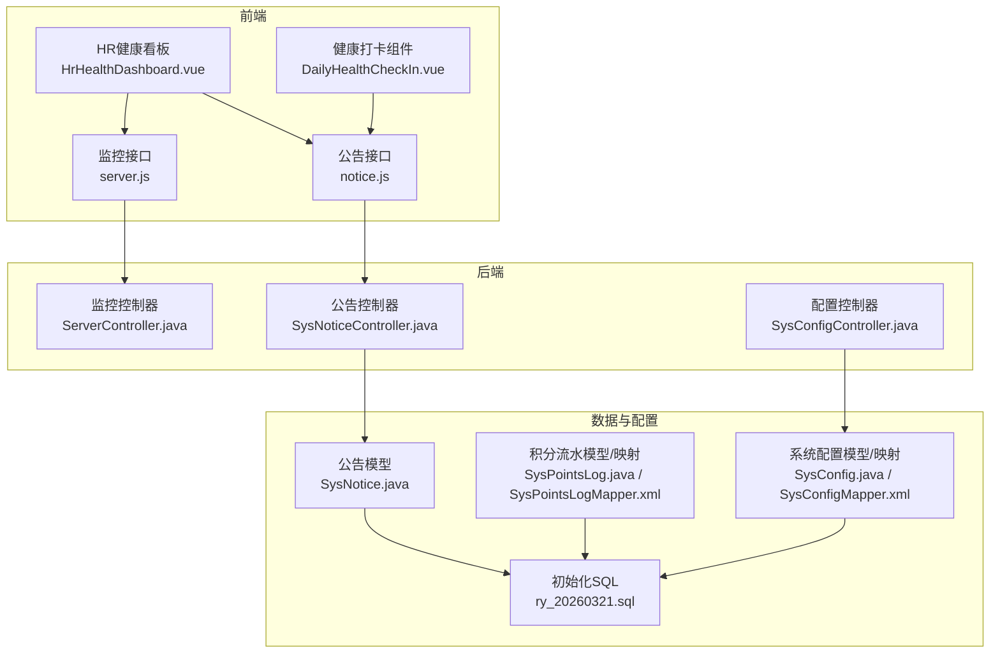
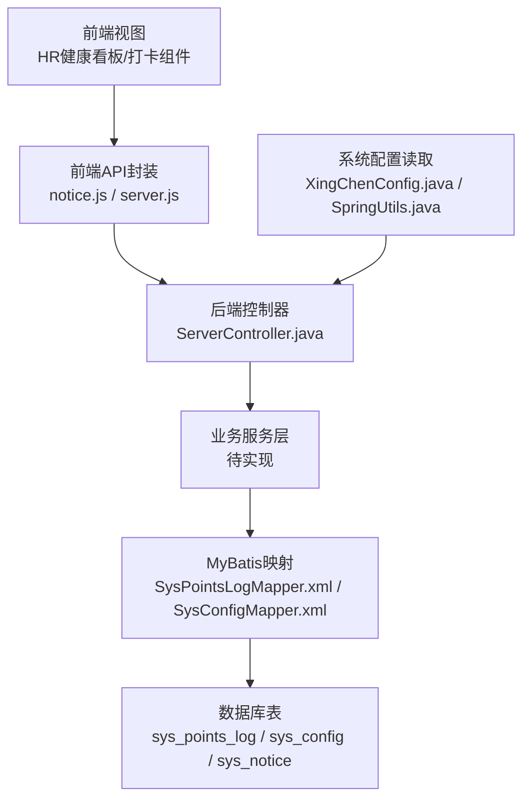
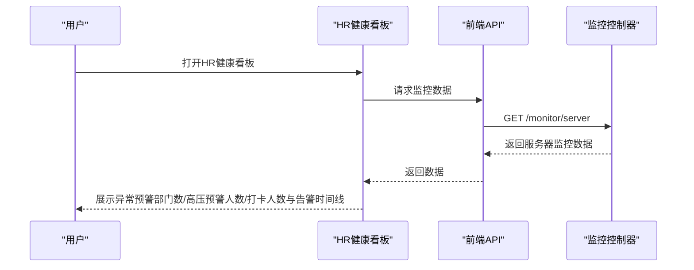
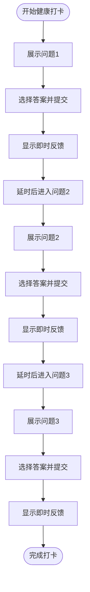
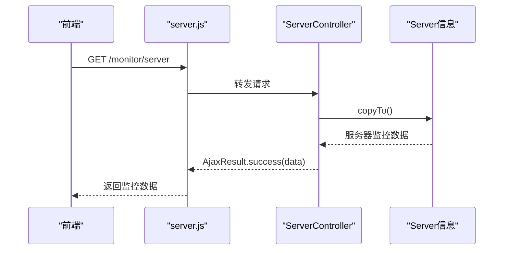
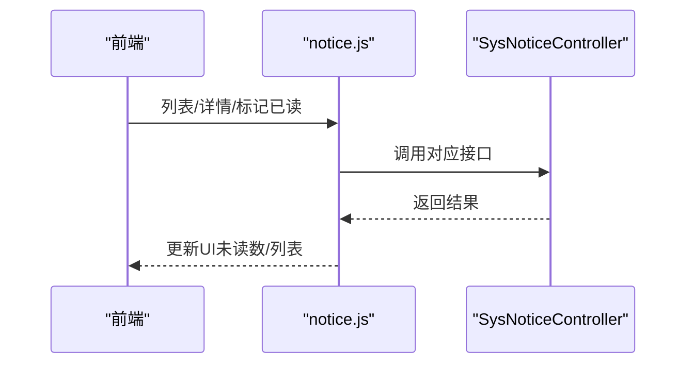
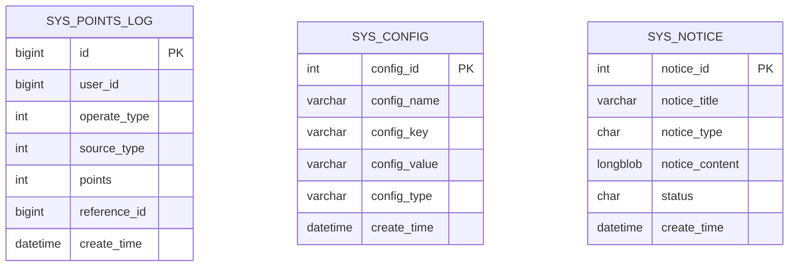
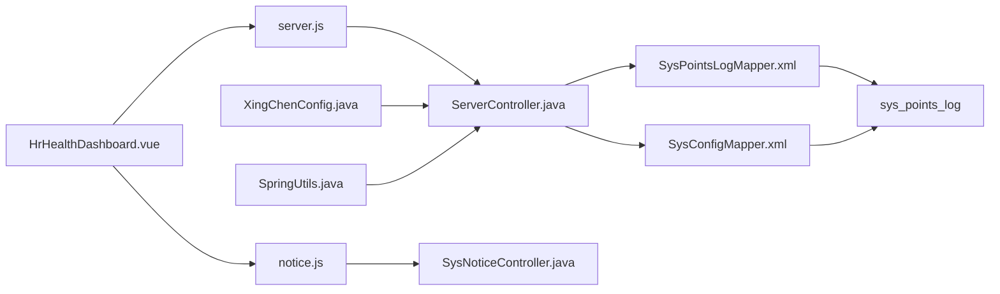

# 预警系统

<cite>
**本文引用的文件**
- [HrHealthDashboard.vue](file://XingChen-Vue3/src/views/hr/HrHealthDashboard.vue)
- [DailyHealthCheckIn.vue（Vue3）](file://XingChen-Vue3/src/components/DailyHealthCheckIn.vue)
- [DailyHealthCheckIn.vue（Vue2）](file://XingChen-Vue/xingchen-ui-user/src/components/DailyHealthCheckIn.vue)
- [ServerController.java](file://XingChen-Vue/xingchen-admin/src/main/java/com/xingchen/web/controller/monitor/ServerController.java)
- [server.js](file://XingChen-Vue3/src/api/monitor/server.js)
- [SysPointsLog.java](file://XingChen-Vue/xingchen-system/src/main/java/com/xingchen/system/domain/SysPointsLog.java)
- [SysPointsLogMapper.xml](file://XingChen-Vue/xingchen-system/src/main/resources/mapper/system/SysPointsLogMapper.xml)
- [SysConfig.java](file://XingChen-Vue/xingchen-system/src/main/java/com/xingchen/system/domain/SysConfig.java)
- [SysConfigMapper.xml](file://XingChen-Vue/xingchen-system/src/main/resources/mapper/system/SysConfigMapper.xml)
- [SysNotice.java](file://XingChen-Vue/xingchen-system/src/main/java/com/xingchen/system/domain/SysNotice.java)
- [notice.js](file://XingChen-Vue3/src/api/system/notice.js)
- [index.vue](file://XingChen-Vue/xingchen-ui-user/src/views/index.vue)
- [ry_20260321.sql](file://XingChen-Vue/sql/ry_20260321.sql)
- [XingChenConfig.java](file://XingChen-Vue/xingchen-common/src/main/java/com/xingchen/common/config/XingChenConfig.java)
- [SpringUtils.java](file://XingChen-Vue/xingchen-common/src/main/java/com/xingchen/common/utils/spring/SpringUtils.java)
</cite>

## 目录
1. [简介](#简介)
2. [项目结构](#项目结构)
3. [核心组件](#核心组件)
4. [架构总览](#架构总览)
5. [详细组件分析](#详细组件分析)
6. [依赖关系分析](#依赖关系分析)
7. [性能考量](#性能考量)
8. [故障排查指南](#故障排查指南)
9. [结论](#结论)
10. [附录](#附录)

## 简介
本文件面向“预警系统”的设计与实现，结合仓库中现有的健康监测、打卡、积分流水、系统配置与公告等模块，系统化阐述预警规则的设计原理、阈值设定策略、预警级别分类与通知机制；解释实时监控数据的异常检测思路、预警触发条件与告警处理流程；并覆盖预警历史记录管理、统计分析与效果评估的实现路径与扩展方向。同时给出可配置性、扩展性与性能监控方案，帮助读者快速理解与落地。

## 项目结构
从仓库中可以看到，预警系统相关能力主要分布在以下层次：
- 前端视图层：HR健康看板、健康打卡组件、公告与通知接口
- 后端控制层：监控服务接口、系统配置与公告接口
- 数据模型与持久层：积分流水、系统配置、公告等表结构与映射
- 配置与工具：系统配置读取、环境与配置工具类

**图表来源**
- [HrHealthDashboard.vue:1-154](file://XingChen-Vue3/src/views/hr/HrHealthDashboard.vue#L1-L154)
- [DailyHealthCheckIn.vue（Vue3）:1-281](file://XingChen-Vue3/src/components/DailyHealthCheckIn.vue#L1-L281)
- [notice.js:1-70](file://XingChen-Vue3/src/api/system/notice.js#L1-L70)
- [server.js:1-9](file://XingChen-Vue3/src/api/monitor/server.js#L1-L9)
- [ServerController.java:1-27](file://XingChen-Vue/xingchen-admin/src/main/java/com/xingchen/web/controller/monitor/ServerController.java#L1-L27)
- [SysPointsLog.java:1-105](file://XingChen-Vue/xingchen-system/src/main/java/com/xingchen/system/domain/SysPointsLog.java#L1-L105)
- [SysPointsLogMapper.xml:1-92](file://XingChen-Vue/xingchen-system/src/main/resources/mapper/system/SysPointsLogMapper.xml#L1-L92)
- [SysConfig.java:1-112](file://XingChen-Vue/xingchen-system/src/main/java/com/xingchen/system/domain/SysConfig.java#L1-L112)
- [SysConfigMapper.xml:1-117](file://XingChen-Vue/xingchen-system/src/main/resources/mapper/system/SysConfigMapper.xml#L1-L117)
- [SysNotice.java:52-117](file://XingChen-Vue/xingchen-system/src/main/java/com/xingchen/system/domain/SysNotice.java#L52-L117)
- [ry_20260321.sql:626-645](file://XingChen-Vue/sql/ry_20260321.sql#L626-L645)

**章节来源**
- [HrHealthDashboard.vue:1-154](file://XingChen-Vue3/src/views/hr/HrHealthDashboard.vue#L1-L154)
- [ServerController.java:1-27](file://XingChen-Vue/xingchen-admin/src/main/java/com/xingchen/web/controller/monitor/ServerController.java#L1-L27)
- [SysPointsLog.java:1-105](file://XingChen-Vue/xingchen-system/src/main/java/com/xingchen/system/domain/SysPointsLog.java#L1-L105)
- [SysConfig.java:1-112](file://XingChen-Vue/xingchen-system/src/main/java/com/xingchen/system/domain/SysConfig.java#L1-L112)
- [SysNotice.java:52-117](file://XingChen-Vue/xingchen-system/src/main/java/com/xingchen/system/domain/SysNotice.java#L52-L117)

## 核心组件
- HR健康看板：提供异常预警部门数、高压预警人数、打卡人数等指标展示，并包含“系统警报/健康异常预警”的时间线展示区域，用于呈现实时告警动态。
- 健康打卡组件：通过问答式交互引导用户进行日常健康自检，提供即时反馈，作为健康数据采集与预警前置环节。
- 监控接口：提供服务器资源使用情况等监控数据，可作为系统级预警的数据源之一。
- 公告与通知：提供公告列表、已读标记等能力，作为预警通知的承载通道。
- 积分流水与配置：为后续预警激励与阈值配置提供数据基础与可配置性支撑。

**章节来源**
- [HrHealthDashboard.vue:29-128](file://XingChen-Vue3/src/views/hr/HrHealthDashboard.vue#L29-L128)
- [DailyHealthCheckIn.vue（Vue3）:60-137](file://XingChen-Vue3/src/components/DailyHealthCheckIn.vue#L60-L137)
- [DailyHealthCheckIn.vue（Vue2）:73-152](file://XingChen-Vue/xingchen-ui-user/src/components/DailyHealthCheckIn.vue#L73-L152)
- [server.js:1-9](file://XingChen-Vue3/src/api/monitor/server.js#L1-L9)
- [notice.js:1-70](file://XingChen-Vue3/src/api/system/notice.js#L1-L70)
- [SysPointsLog.java:1-105](file://XingChen-Vue/xingchen-system/src/main/java/com/xingchen/system/domain/SysPointsLog.java#L1-L105)
- [SysConfig.java:1-112](file://XingChen-Vue/xingchen-system/src/main/java/com/xingchen/system/domain/SysConfig.java#L1-L112)

## 架构总览
预警系统采用“前端展示 + 后端接口 + 数据模型 + 配置管理”的分层架构。前端通过API调用后端接口，后端控制器负责业务编排与数据访问，数据层通过MyBatis映射访问数据库表，系统配置支持运行期参数化调整。

**图表来源**
- [HrHealthDashboard.vue:1-154](file://XingChen-Vue3/src/views/hr/HrHealthDashboard.vue#L1-L154)
- [notice.js:1-70](file://XingChen-Vue3/src/api/system/notice.js#L1-L70)
- [server.js:1-9](file://XingChen-Vue3/src/api/monitor/server.js#L1-L9)
- [ServerController.java:1-27](file://XingChen-Vue/xingchen-admin/src/main/java/com/xingchen/web/controller/monitor/ServerController.java#L1-L27)
- [SysPointsLogMapper.xml:1-92](file://XingChen-Vue/xingchen-system/src/main/resources/mapper/system/SysPointsLogMapper.xml#L1-L92)
- [SysConfigMapper.xml:1-117](file://XingChen-Vue/xingchen-system/src/main/resources/mapper/system/SysConfigMapper.xml#L1-L117)
- [XingChenConfig.java:1-69](file://XingChen-Vue/xingchen-common/src/main/java/com/xingchen/common/config/XingChenConfig.java#L1-L69)
- [SpringUtils.java:126-164](file://XingChen-Vue/xingchen-common/src/main/java/com/xingchen/common/utils/spring/SpringUtils.java#L126-L164)

## 详细组件分析

### HR健康看板（预警展示与统计）
- 指标展示：异常预警部门数、高压预警人数、打卡人数等，用于宏观健康态势感知。
- 实时告警时间线：以时间轴形式展示系统警报与健康异常预警事件，便于追溯与复盘。
- AI健康分析总结：提供一键生成健康分析摘要的能力，辅助HR进行预警趋势判断。

**图表来源**
- [HrHealthDashboard.vue:100-128](file://XingChen-Vue3/src/views/hr/HrHealthDashboard.vue#L100-L128)
- [server.js:1-9](file://XingChen-Vue3/src/api/monitor/server.js#L1-L9)
- [ServerController.java:1-27](file://XingChen-Vue/xingchen-admin/src/main/java/com/xingchen/web/controller/monitor/ServerController.java#L1-L27)

**章节来源**
- [HrHealthDashboard.vue:29-128](file://XingChen-Vue3/src/views/hr/HrHealthDashboard.vue#L29-L128)
- [ServerController.java:1-27](file://XingChen-Vue/xingchen-admin/src/main/java/com/xingchen/web/controller/monitor/ServerController.java#L1-L27)

### 健康打卡组件（数据采集与预警前置）
- 交互流程：逐题作答，即时反馈，完成后进入结果页。
- 反馈类型：success/warning/danger三档，用于引导用户关注健康风险。
- 与预警的关系：作为健康数据采集入口，为后续基于阈值的预警提供原始数据。

**图表来源**
- [DailyHealthCheckIn.vue（Vue3）:109-129](file://XingChen-Vue3/src/components/DailyHealthCheckIn.vue#L109-L129)
- [DailyHealthCheckIn.vue（Vue2）:122-142](file://XingChen-Vue/xingchen-ui-user/src/components/DailyHealthCheckIn.vue#L122-L142)

**章节来源**
- [DailyHealthCheckIn.vue（Vue3）:60-137](file://XingChen-Vue3/src/components/DailyHealthCheckIn.vue#L60-L137)
- [DailyHealthCheckIn.vue（Vue2）:73-152](file://XingChen-Vue/xingchen-ui-user/src/components/DailyHealthCheckIn.vue#L73-L152)
- [index.vue:44-68](file://XingChen-Vue/xingchen-ui-user/src/views/index.vue#L44-L68)

### 监控接口与服务器监控（系统级预警数据源）
- 接口定义：提供获取服务器监控信息的REST接口。
- 控制器实现：负责调用底层Server信息复制逻辑并返回AjaxResult。

**图表来源**
- [server.js:1-9](file://XingChen-Vue3/src/api/monitor/server.js#L1-L9)
- [ServerController.java:1-27](file://XingChen-Vue/xingchen-admin/src/main/java/com/xingchen/web/controller/monitor/ServerController.java#L1-L27)

**章节来源**
- [server.js:1-9](file://XingChen-Vue3/src/api/monitor/server.js#L1-L9)
- [ServerController.java:1-27](file://XingChen-Vue/xingchen-admin/src/main/java/com/xingchen/web/controller/monitor/ServerController.java#L1-L27)

### 公告与通知（预警通知通道）
- 公告接口：提供列表查询、详情查询、新增、修改、删除、标记已读等能力。
- 已读状态：支持单条与批量标记已读，便于统计未读预警数量。
- 与预警联动：可将预警事件转化为公告或消息，实现统一通知渠道。

**图表来源**
- [notice.js:1-70](file://XingChen-Vue3/src/api/system/notice.js#L1-L70)
- [SysNotice.java:52-117](file://XingChen-Vue/xingchen-system/src/main/java/com/xingchen/system/domain/SysNotice.java#L52-L117)
- [ry_20260321.sql:626-645](file://XingChen-Vue/sql/ry_20260321.sql#L626-L645)

**章节来源**
- [notice.js:1-70](file://XingChen-Vue3/src/api/system/notice.js#L1-L70)
- [SysNotice.java:52-117](file://XingChen-Vue/xingchen-system/src/main/java/com/xingchen/system/domain/SysNotice.java#L52-L117)
- [ry_20260321.sql:626-645](file://XingChen-Vue/sql/ry_20260321.sql#L626-L645)

### 积分流水与配置（预警历史与阈值配置）
- 积分流水：记录用户积分变动的来源、类型、数值与业务关联ID，可用于统计预警触发后的激励行为。
- 系统配置：提供参数键值对的存储与查询，可用于运行期调整预警阈值、通知策略等。

**图表来源**
- [SysPointsLog.java:1-105](file://XingChen-Vue/xingchen-system/src/main/java/com/xingchen/system/domain/SysPointsLog.java#L1-L105)
- [SysPointsLogMapper.xml:1-92](file://XingChen-Vue/xingchen-system/src/main/resources/mapper/system/SysPointsLogMapper.xml#L1-L92)
- [SysConfig.java:1-112](file://XingChen-Vue/xingchen-system/src/main/java/com/xingchen/system/domain/SysConfig.java#L1-L112)
- [SysConfigMapper.xml:1-117](file://XingChen-Vue/xingchen-system/src/main/resources/mapper/system/SysConfigMapper.xml#L1-L117)
- [ry_20260321.sql:626-645](file://XingChen-Vue/sql/ry_20260321.sql#L626-L645)

**章节来源**
- [SysPointsLog.java:1-105](file://XingChen-Vue/xingchen-system/src/main/java/com/xingchen/system/domain/SysPointsLog.java#L1-L105)
- [SysPointsLogMapper.xml:22-46](file://XingChen-Vue/xingchen-system/src/main/resources/mapper/system/SysPointsLogMapper.xml#L22-L46)
- [SysConfig.java:1-112](file://XingChen-Vue/xingchen-system/src/main/java/com/xingchen/system/domain/SysConfig.java#L1-L112)
- [SysConfigMapper.xml:36-70](file://XingChen-Vue/xingchen-system/src/main/resources/mapper/system/SysConfigMapper.xml#L36-L70)
- [ry_20260321.sql:626-645](file://XingChen-Vue/sql/ry_20260321.sql#L626-L645)

## 依赖关系分析
- 前端依赖后端API：HR健康看板依赖监控接口，公告接口用于展示与标记未读。
- 控制器依赖服务层：ServerController依赖Server信息复制逻辑，实际实现位于框架Web域。
- 数据层依赖MyBatis映射：SysPointsLogMapper与SysConfigMapper负责数据访问。
- 配置依赖Spring工具：XingChenConfig与SpringUtils提供配置读取与环境信息。

**图表来源**
- [HrHealthDashboard.vue:1-154](file://XingChen-Vue3/src/views/hr/HrHealthDashboard.vue#L1-L154)
- [server.js:1-9](file://XingChen-Vue3/src/api/monitor/server.js#L1-L9)
- [notice.js:1-70](file://XingChen-Vue3/src/api/system/notice.js#L1-L70)
- [ServerController.java:1-27](file://XingChen-Vue/xingchen-admin/src/main/java/com/xingchen/web/controller/monitor/ServerController.java#L1-L27)
- [SysPointsLogMapper.xml:1-92](file://XingChen-Vue/xingchen-system/src/main/resources/mapper/system/SysPointsLogMapper.xml#L1-L92)
- [SysConfigMapper.xml:1-117](file://XingChen-Vue/xingchen-system/src/main/resources/mapper/system/SysConfigMapper.xml#L1-L117)
- [XingChenConfig.java:1-69](file://XingChen-Vue/xingchen-common/src/main/java/com/xingchen/common/config/XingChenConfig.java#L1-L69)
- [SpringUtils.java:126-164](file://XingChen-Vue/xingchen-common/src/main/java/com/xingchen/common/utils/spring/SpringUtils.java#L126-L164)

**章节来源**
- [XingChenConfig.java:1-69](file://XingChen-Vue/xingchen-common/src/main/java/com/xingchen/common/config/XingChenConfig.java#L1-L69)
- [SpringUtils.java:126-164](file://XingChen-Vue/xingchen-common/src/main/java/com/xingchen/common/utils/spring/SpringUtils.java#L126-L164)

## 性能考量
- 前端渲染与交互：健康看板与打卡组件采用轻量级状态管理与过渡动画，避免频繁重绘；建议在高频刷新场景下启用节流/防抖。
- API调用频率：监控接口与公告接口应合理设置轮询间隔，避免对后端造成压力；可结合WebSocket或长连接优化推送体验。
- 数据库访问：积分流水与配置查询建议添加必要的索引与分页，避免全表扫描；对时间范围查询使用合适索引。
- 配置热更新：通过系统配置表实现阈值与策略的热更新，减少重启成本；注意缓存一致性与回滚策略。

## 故障排查指南
- 监控接口异常：检查后端ServerController是否正确调用Server信息复制逻辑；确认AjaxResult返回结构与权限注解。
- 公告未读统计不准确：核对notice.js中已读标记接口调用链路，确保后端控制器与数据库更新成功。
- 健康打卡无反馈：检查组件事件绑定与状态切换逻辑，确认反馈类型与延迟定时器执行。
- 配置读取失败：验证XingChenConfig与SpringUtils的配置前缀与环境变量是否匹配，确认active profiles正确。

**章节来源**
- [ServerController.java:1-27](file://XingChen-Vue/xingchen-admin/src/main/java/com/xingchen/web/controller/monitor/ServerController.java#L1-L27)
- [notice.js:1-70](file://XingChen-Vue3/src/api/system/notice.js#L1-L70)
- [DailyHealthCheckIn.vue（Vue3）:109-129](file://XingChen-Vue3/src/components/DailyHealthCheckIn.vue#L109-L129)
- [XingChenConfig.java:1-69](file://XingChen-Vue/xingchen-common/src/main/java/com/xingchen/common/config/XingChenConfig.java#L1-L69)
- [SpringUtils.java:126-164](file://XingChen-Vue/xingchen-common/src/main/java/com/xingchen/common/utils/spring/SpringUtils.java#L126-L164)

## 结论
本仓库现有能力为预警系统提供了良好的基础：HR看板用于展示与追溯，健康打卡用于采集数据，监控接口提供系统级数据源，公告与配置为通知与阈值管理提供支撑。后续可在业务服务层完善预警规则引擎、阈值计算与通知策略，并通过积分流水与配置表实现可配置、可评估、可扩展的预警闭环。

## 附录
- 预警规则设计要点
  - 阈值设定策略：基于历史均值与标准差、百分位数、业务基线等方法确定阈值区间；支持按部门/岗位/时间段差异化配置。
  - 预警级别分类：建议将异常划分为“提示/关注/预警/严重”四级，分别对应不同处置优先级与通知渠道。
  - 触发条件：单一指标越界、多指标组合异常、趋势突变等；需考虑滑动窗口与去噪策略。
- 告警处理流程
  - 触发 → 识别 → 分级 → 通知 → 处置 → 跟踪 → 关闭；建立工单与闭环追踪机制。
- 历史记录与统计
  - 以积分流水与配置表为基础，记录每次预警事件、处置动作与效果评估指标（响应时长、解决时长、重复率等）。
- 可配置性与扩展性
  - 通过系统配置表动态调整阈值与策略；预留插件化规则引擎与多通道通知（邮件/短信/IM）。
- 性能监控
  - 对关键接口与数据库查询进行埋点与告警；结合前端性能指标（首屏、交互延迟）持续优化。