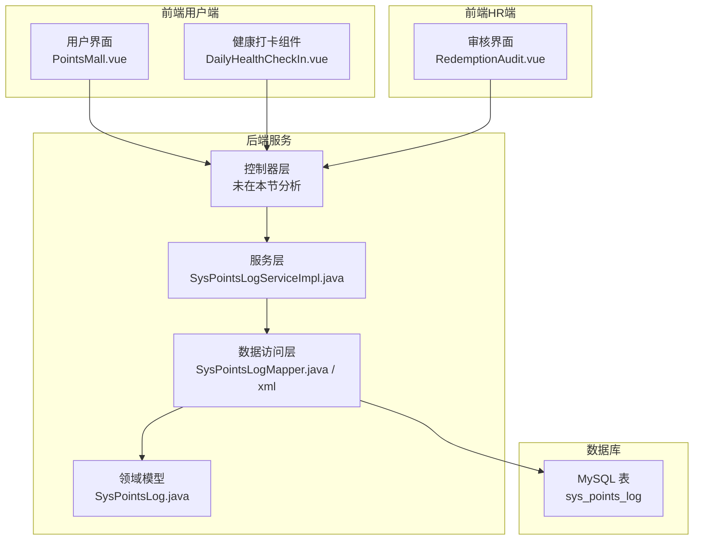
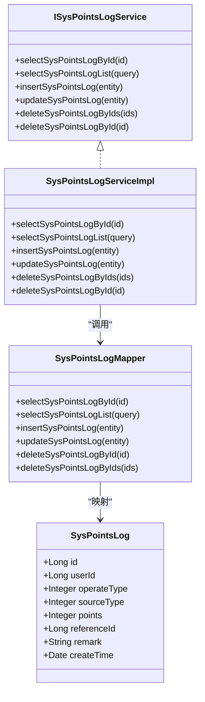
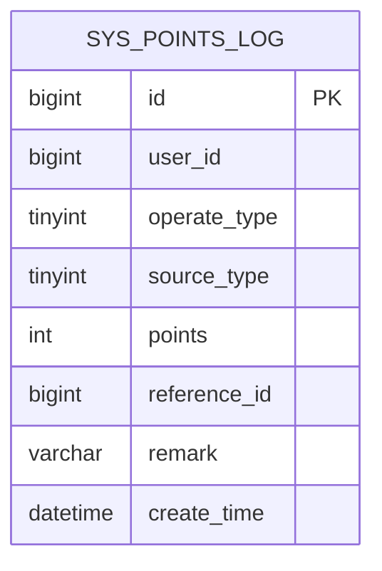
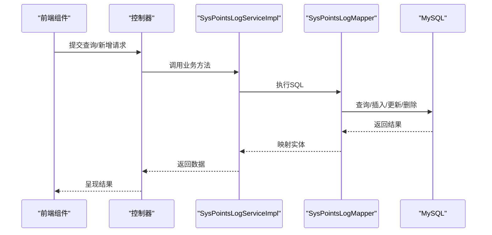
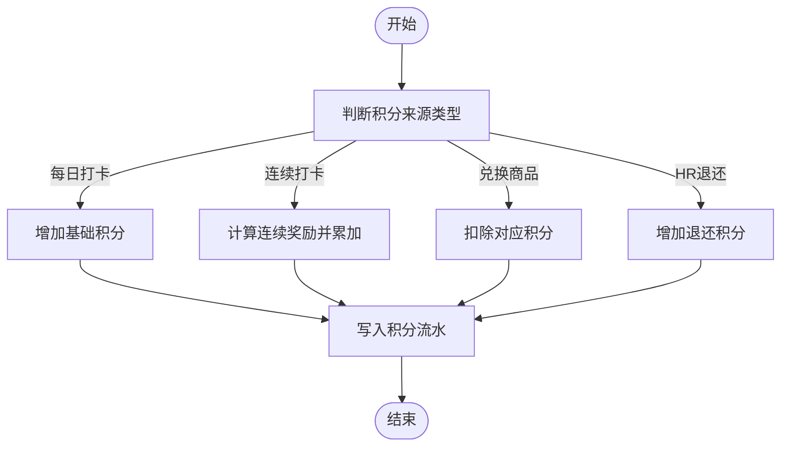
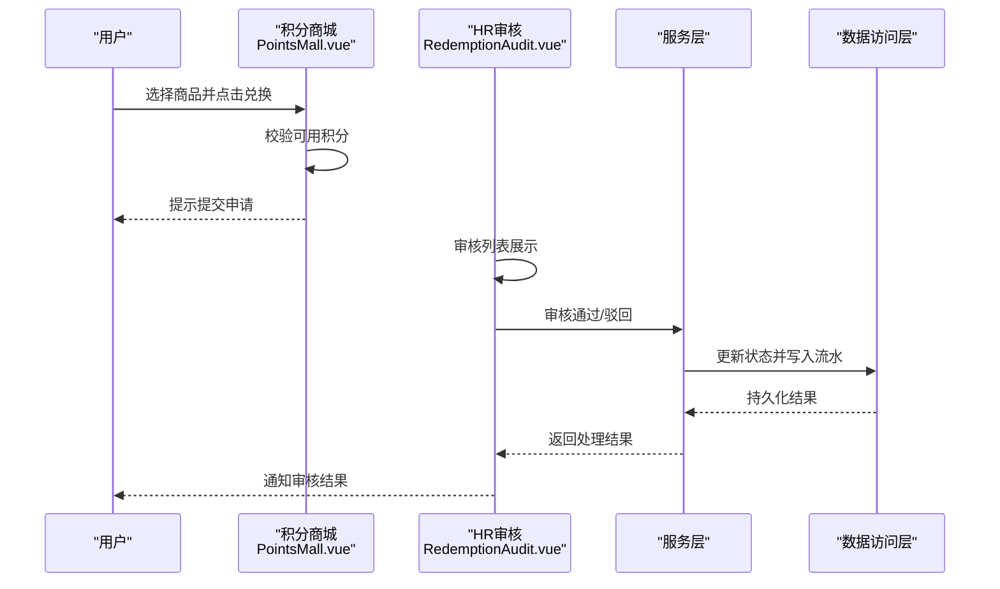
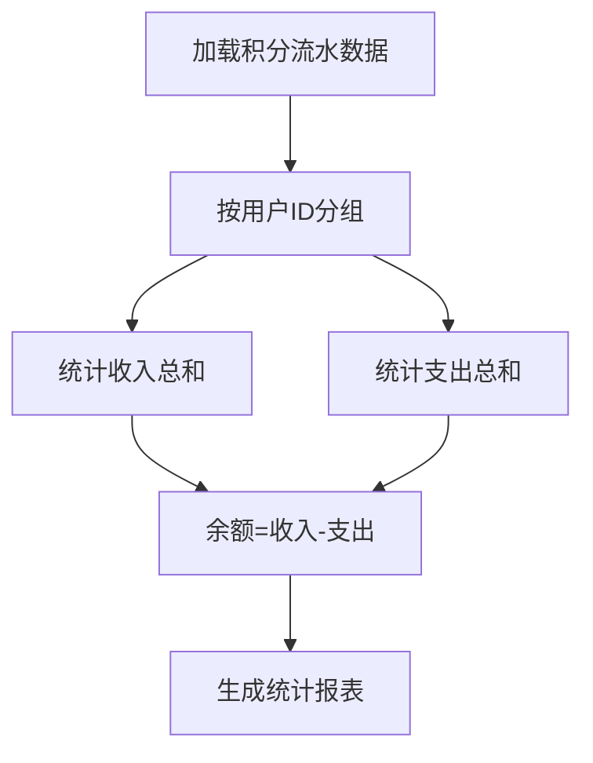
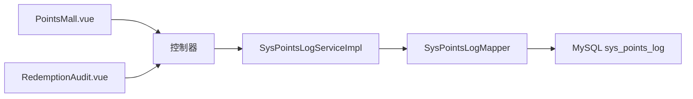

# 健康积分系统

<cite>
**本文档引用的文件**
- [points_log.sql](file://XingChen-Vue/sql/points_log.sql)
- [SysPointsLog.java](file://XingChen-Vue/xingchen-system/src/main/java/com/xingchen/system/domain/SysPointsLog.java)
- [SysPointsLogMapper.java](file://XingChen-Vue/xingchen-system/src/main/java/com/xingchen/system/mapper/SysPointsLogMapper.java)
- [SysPointsLogMapper.xml](file://XingChen-Vue/xingchen-system/src/main/resources/mapper/system/SysPointsLogMapper.xml)
- [ISysPointsLogService.java](file://XingChen-Vue/xingchen-system/src/main/java/com/xingchen/system/service/ISysPointsLogService.java)
- [SysPointsLogServiceImpl.java](file://XingChen-Vue/xingchen-system/src/main/java/com/xingchen/system/service/impl/SysPointsLogServiceImpl.java)
- [PointsMall.vue](file://XingChen-Vue/xingchen-ui-user/src/views/PointsMall.vue)
- [DailyHealthCheckIn.vue](file://XingChen-Vue/xingchen-ui-user/src/components/DailyHealthCheckIn.vue)
- [RedemptionAudit.vue](file://XingChen-Vue3/src/views/hr/RedemptionAudit.vue)
</cite>

## 目录
1. [简介](#简介)
2. [项目结构](#项目结构)
3. [核心组件](#核心组件)
4. [架构总览](#架构总览)
5. [详细组件分析](#详细组件分析)
6. [依赖关系分析](#依赖关系分析)
7. [性能考虑](#性能考虑)
8. [故障排除指南](#故障排除指南)
9. [结论](#结论)
10. [附录](#附录)

## 简介
本文件为健康积分系统的综合技术文档，覆盖积分获取规则、积分消费机制、积分流水记录与余额管理的完整实现。文档从系统架构、数据模型、业务逻辑、事务处理与并发控制策略等维度进行深入分析，并提供配置管理、异常处理与性能优化方案，帮助开发者与运维人员快速理解与维护系统。

## 项目结构
健康积分系统由前端用户端与HR管理端组成，后端采用Spring Boot + MyBatis框架，数据库为MySQL。积分相关的核心模块位于xingchen-system模块中，前端分别提供用户端积分商城与HR审核界面。

**图表来源**
- [SysPointsLogServiceImpl.java:17-94](file://XingChen-Vue/xingchen-system/src/main/java/com/xingchen/system/service/impl/SysPointsLogServiceImpl.java#L17-L94)
- [SysPointsLogMapper.java:11-60](file://XingChen-Vue/xingchen-system/src/main/java/com/xingchen/system/mapper/SysPointsLogMapper.java#L11-L60)
- [SysPointsLogMapper.xml:1-91](file://XingChen-Vue/xingchen-system/src/main/resources/mapper/system/SysPointsLogMapper.xml#L1-L91)
- [SysPointsLog.java:11-104](file://XingChen-Vue/xingchen-system/src/main/java/com/xingchen/system/domain/SysPointsLog.java#L11-L104)

**章节来源**
- [SysPointsLogServiceImpl.java:17-94](file://XingChen-Vue/xingchen-system/src/main/java/com/xingchen/system/service/impl/SysPointsLogServiceImpl.java#L17-L94)
- [SysPointsLogMapper.java:11-60](file://XingChen-Vue/xingchen-system/src/main/java/com/xingchen/system/mapper/SysPointsLogMapper.java#L11-L60)
- [SysPointsLogMapper.xml:1-91](file://XingChen-Vue/xingchen-system/src/main/resources/mapper/system/SysPointsLogMapper.xml#L1-L91)
- [SysPointsLog.java:11-104](file://XingChen-Vue/xingchen-system/src/main/java/com/xingchen/system/domain/SysPointsLog.java#L11-L104)

## 核心组件
- 积分流水实体：SysPointsLog.java，定义积分流水字段与Getter/Setter。
- 数据访问接口：SysPointsLogMapper.java，定义查询、新增、更新、删除方法。
- 数据访问映射：SysPointsLogMapper.xml，实现SQL查询、插入、更新、删除。
- 业务服务：SysPointsLogServiceImpl.java，封装业务逻辑与时间戳设置。
- 前端用户端：PointsMall.vue（积分商城）、DailyHealthCheckIn.vue（健康打卡）。
- 前端HR端：RedemptionAudit.vue（兑换审核）。

**章节来源**
- [SysPointsLog.java:11-104](file://XingChen-Vue/xingchen-system/src/main/java/com/xingchen/system/domain/SysPointsLog.java#L11-L104)
- [SysPointsLogMapper.java:11-60](file://XingChen-Vue/xingchen-system/src/main/java/com/xingchen/system/mapper/SysPointsLogMapper.java#L11-L60)
- [SysPointsLogMapper.xml:1-91](file://XingChen-Vue/xingchen-system/src/main/resources/mapper/system/SysPointsLogMapper.xml#L1-L91)
- [SysPointsLogServiceImpl.java:17-94](file://XingChen-Vue/xingchen-system/src/main/java/com/xingchen/system/service/impl/SysPointsLogServiceImpl.java#L17-L94)
- [PointsMall.vue:1-378](file://XingChen-Vue/xingchen-ui-user/src/views/PointsMall.vue#L1-L378)
- [DailyHealthCheckIn.vue:1-81](file://XingChen-Vue/xingchen-ui-user/src/components/DailyHealthCheckIn.vue#L1-L81)
- [RedemptionAudit.vue:1-250](file://XingChen-Vue3/src/views/hr/RedemptionAudit.vue#L1-L250)

## 架构总览
系统采用经典的分层架构：
- 表现层：Vue组件负责用户交互与数据展示。
- 控制器层：接收请求并协调服务层。
- 服务层：处理业务规则与事务边界。
- 数据访问层：MyBatis映射SQL，访问MySQL。
- 数据模型：SysPointsLog映射sys_points_log表。

**图表来源**
- [SysPointsLog.java:11-104](file://XingChen-Vue/xingchen-system/src/main/java/com/xingchen/system/domain/SysPointsLog.java#L11-L104)
- [SysPointsLogMapper.java:11-60](file://XingChen-Vue/xingchen-system/src/main/java/com/xingchen/system/mapper/SysPointsLogMapper.java#L11-L60)
- [ISysPointsLogService.java:11-60](file://XingChen-Vue/xingchen-system/src/main/java/com/xingchen/system/service/ISysPointsLogService.java#L11-L60)
- [SysPointsLogServiceImpl.java:17-94](file://XingChen-Vue/xingchen-system/src/main/java/com/xingchen/system/service/impl/SysPointsLogServiceImpl.java#L17-L94)

## 详细组件分析

### 数据模型与表结构
- 表名：sys_points_log
- 字段说明：
  - id：流水唯一标识（自增主键）
  - user_id：发生积分变动的员工ID
  - operate_type：操作类型（1=收入，2=支出）
  - source_type：参与场景（1=每日打卡，2=连续打卡奖励，3=兑换商品消耗，4=HR手动退还积分）
  - points：本次波动的分值（绝对值）
  - reference_id：业务关联ID（如打卡记录ID、兑换订单ID）
  - remark：波动说明
  - create_time：发生时间（默认当前时间）

**图表来源**
- [points_log.sql:4-17](file://XingChen-Vue/sql/points_log.sql#L4-L17)

**章节来源**
- [points_log.sql:4-17](file://XingChen-Vue/sql/points_log.sql#L4-L17)

### 积分流水服务层
- 查询：支持按用户ID、操作类型、场景类型、积分值、业务关联ID、创建时间范围查询。
- 新增：自动设置创建时间为当前时间。
- 更新/删除：支持单条与批量删除。

**图表来源**
- [SysPointsLogServiceImpl.java:28-57](file://XingChen-Vue/xingchen-system/src/main/java/com/xingchen/system/service/impl/SysPointsLogServiceImpl.java#L28-L57)
- [SysPointsLogMapper.xml:22-38](file://XingChen-Vue/xingchen-system/src/main/resources/mapper/system/SysPointsLogMapper.xml#L22-L38)
- [SysPointsLogMapper.xml:45-65](file://XingChen-Vue/xingchen-system/src/main/resources/mapper/system/SysPointsLogMapper.xml#L45-L65)

**章节来源**
- [SysPointsLogServiceImpl.java:28-57](file://XingChen-Vue/xingchen-system/src/main/java/com/xingchen/system/service/impl/SysPointsLogServiceImpl.java#L28-L57)
- [SysPointsLogMapper.xml:22-38](file://XingChen-Vue/xingchen-system/src/main/resources/mapper/system/SysPointsLogMapper.xml#L22-L38)
- [SysPointsLogMapper.xml:45-65](file://XingChen-Vue/xingchen-system/src/main/resources/mapper/system/SysPointsLogMapper.xml#L45-L65)

### 积分获取规则（业务逻辑）
- 每日打卡：source_type=1，operate_type=1，points为固定值（例如10分）。
- 连续打卡奖励：source_type=2，operate_type=1，points根据连续天数计算。
- 兑换商品消耗：source_type=3，operate_type=2，points为商品所需积分。
- HR手动退还积分：source_type=4，operate_type=1，points为手动退还分值。

**图表来源**
- [SysPointsLog.java:22-28](file://XingChen-Vue/xingchen-system/src/main/java/com/xingchen/system/domain/SysPointsLog.java#L22-L28)
- [SysPointsLogMapper.xml:45-65](file://XingChen-Vue/xingchen-system/src/main/resources/mapper/system/SysPointsLogMapper.xml#L45-L65)

**章节来源**
- [SysPointsLog.java:22-28](file://XingChen-Vue/xingchen-system/src/main/java/com/xingchen/system/domain/SysPointsLog.java#L22-L28)

### 积分消费机制（兑换流程）
- 用户端：PointsMall.vue展示商品与积分，点击“立即兑换”弹窗确认，前端校验余额后提示等待HR审核。
- HR端：RedemptionAudit.vue展示待审核列表，支持通过/驳回操作，记录状态变更与拒绝原因。

**图表来源**
- [PointsMall.vue:138-165](file://XingChen-Vue/xingchen-ui-user/src/views/PointsMall.vue#L138-L165)
- [RedemptionAudit.vue:181-228](file://XingChen-Vue3/src/views/hr/RedemptionAudit.vue#L181-L228)
- [SysPointsLogMapper.xml:67-79](file://XingChen-Vue/xingchen-system/src/main/resources/mapper/system/SysPointsLogMapper.xml#L67-L79)

**章节来源**
- [PointsMall.vue:138-165](file://XingChen-Vue/xingchen-ui-user/src/views/PointsMall.vue#L138-L165)
- [RedemptionAudit.vue:181-228](file://XingChen-Vue3/src/views/hr/RedemptionAudit.vue#L181-L228)

### 余额管理与统计分析
- 余额计算：基于积分流水表按user_id聚合operate_type=1与operate_type=2的差值。
- 统计分析：HR端可按状态、时间范围、部门等维度筛选与导出数据，用于健康趋势分析。

**图表来源**
- [SysPointsLogMapper.xml:22-38](file://XingChen-Vue/xingchen-system/src/main/resources/mapper/system/SysPointsLogMapper.xml#L22-L38)

**章节来源**
- [SysPointsLogMapper.xml:22-38](file://XingChen-Vue/xingchen-system/src/main/resources/mapper/system/SysPointsLogMapper.xml#L22-L38)

### 并发控制与事务处理
- 事务边界：服务层方法作为事务边界，确保新增/更新/删除的原子性。
- 并发冲突：建议在业务关键路径上引入乐观锁或分布式锁，避免超扣与重复兑付。
- 数据一致性：通过唯一索引与业务校验保证reference_id不重复，防止重复记账。

**章节来源**
- [SysPointsLogServiceImpl.java:52-57](file://XingChen-Vue/xingchen-system/src/main/java/com/xingchen/system/service/impl/SysPointsLogServiceImpl.java#L52-L57)
- [SysPointsLogMapper.xml:45-65](file://XingChen-Vue/xingchen-system/src/main/resources/mapper/system/SysPointsLogMapper.xml#L45-L65)

## 依赖关系分析
- 接口与实现：ISysPointsLogService定义服务契约，SysPointsLogServiceImpl提供具体实现。
- 数据访问：SysPointsLogMapper接口与XML映射文件解耦SQL实现。
- 前后端交互：前端组件通过HTTP请求与后端控制器交互，控制器调用服务层。

**图表来源**
- [SysPointsLogServiceImpl.java:17-94](file://XingChen-Vue/xingchen-system/src/main/java/com/xingchen/system/service/impl/SysPointsLogServiceImpl.java#L17-L94)
- [SysPointsLogMapper.java:11-60](file://XingChen-Vue/xingchen-system/src/main/java/com/xingchen/system/mapper/SysPointsLogMapper.java#L11-L60)
- [SysPointsLogMapper.xml:1-91](file://XingChen-Vue/xingchen-system/src/main/resources/mapper/system/SysPointsLogMapper.xml#L1-L91)

**章节来源**
- [SysPointsLogServiceImpl.java:17-94](file://XingChen-Vue/xingchen-system/src/main/java/com/xingchen/system/service/impl/SysPointsLogServiceImpl.java#L17-L94)
- [SysPointsLogMapper.java:11-60](file://XingChen-Vue/xingchen-system/src/main/java/com/xingchen/system/mapper/SysPointsLogMapper.java#L11-L60)
- [SysPointsLogMapper.xml:1-91](file://XingChen-Vue/xingchen-system/src/main/resources/mapper/system/SysPointsLogMapper.xml#L1-L91)

## 性能考虑
- 索引优化：为user_id与reference_id建立索引，加速查询与关联。
- 分页查询：对流水列表使用分页参数，避免一次性加载大量数据。
- SQL优化：使用动态SQL按条件拼接查询，减少不必要的字段传输。
- 缓存策略：对热点数据（如用户当前积分）进行缓存，降低数据库压力。
- 批量操作：批量删除与更新时使用IN子句，减少网络往返。

**章节来源**
- [points_log.sql:14-16](file://XingChen-Vue/sql/points_log.sql#L14-L16)
- [SysPointsLogMapper.xml:22-38](file://XingChen-Vue/xingchen-system/src/main/resources/mapper/system/SysPointsLogMapper.xml#L22-L38)
- [SysPointsLogMapper.xml:85-90](file://XingChen-Vue/xingchen-system/src/main/resources/mapper/system/SysPointsLogMapper.xml#L85-L90)

## 故障排除指南
- 常见异常：
  - 积分不足：前端在兑换前校验余额，若不足则提示错误。
  - 重复兑付：通过reference_id唯一性约束与业务校验避免重复。
  - 审核异常：HR端支持驳回并记录原因，便于追溯。
- 日志与监控：建议在服务层记录关键操作日志，结合数据库慢查询日志定位性能瓶颈。
- 数据修复：若发现数据异常，可通过服务层提供的更新接口修正，同时补充审计日志。

**章节来源**
- [PointsMall.vue:156-161](file://XingChen-Vue/xingchen-ui-user/src/views/PointsMall.vue#L156-L161)
- [RedemptionAudit.vue:206-228](file://XingChen-Vue3/src/views/hr/RedemptionAudit.vue#L206-L228)

## 结论
健康积分系统以清晰的分层架构与完善的积分流水模型为基础，实现了从积分获取、消费到审核与统计分析的闭环。通过合理的索引与SQL优化、严格的事务与并发控制策略，系统在保证数据一致性的同时具备良好的扩展性与可维护性。建议在生产环境中进一步完善分布式锁与缓存策略，并持续监控与优化关键路径性能。

## 附录
- 配置管理：后端通过application.yml与MyBatis配置管理数据源与序列化策略；前端通过路由与权限控制访问。
- 版本与兼容：系统采用前后端分离架构，版本升级时需关注接口兼容性与数据库迁移脚本。