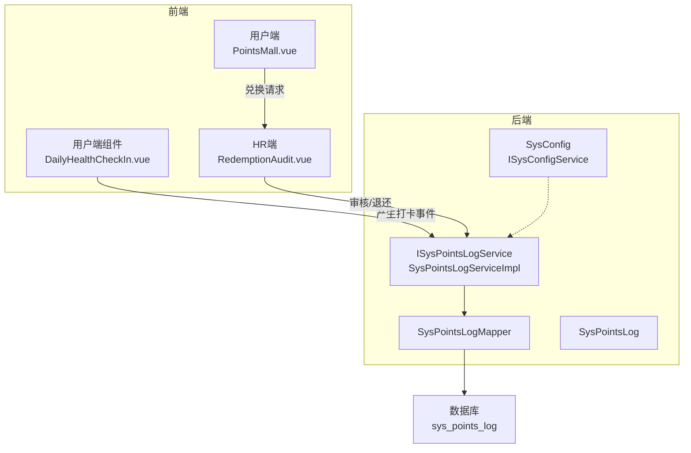
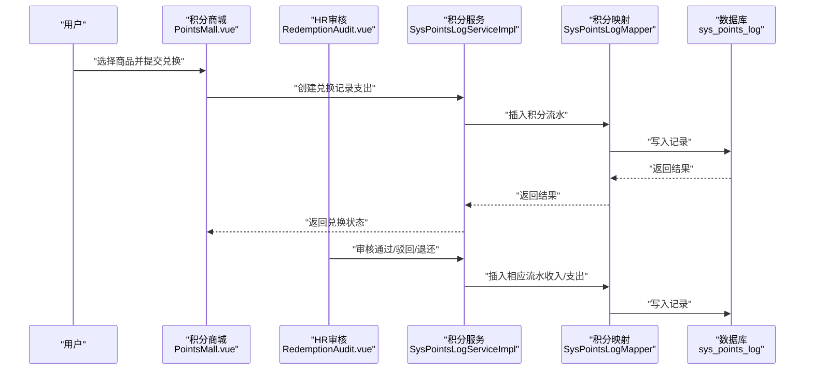
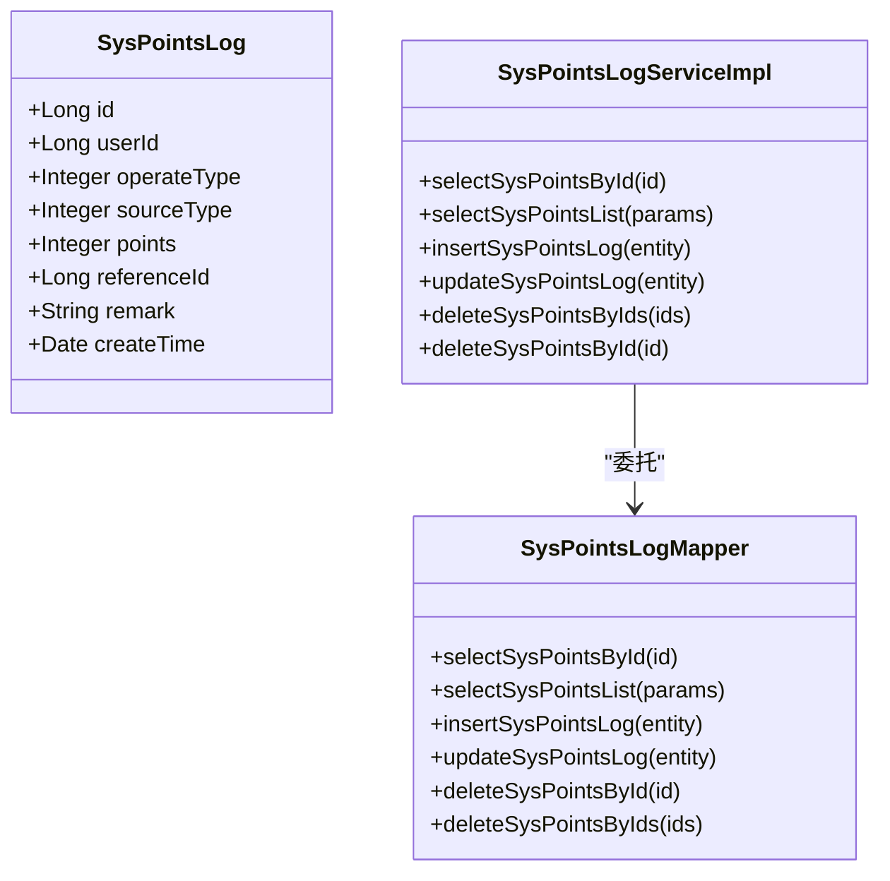
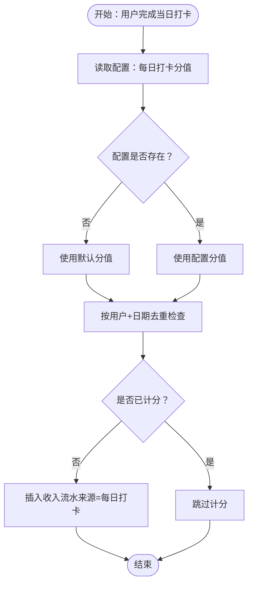
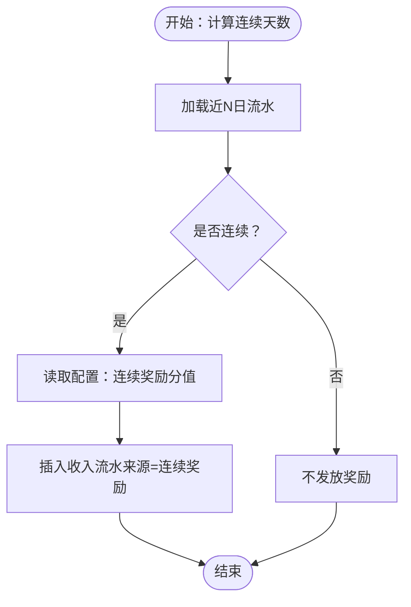
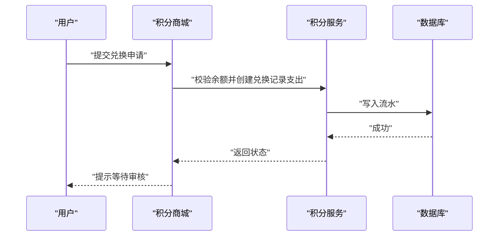
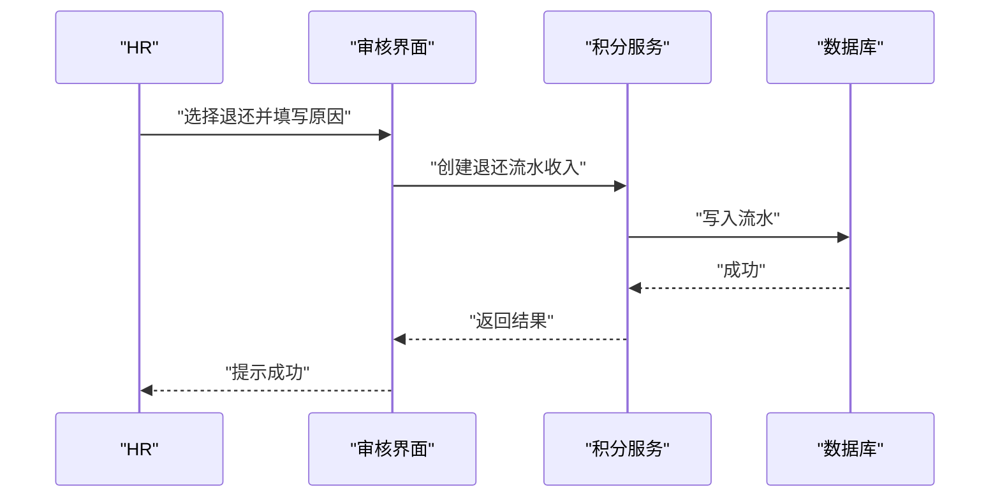
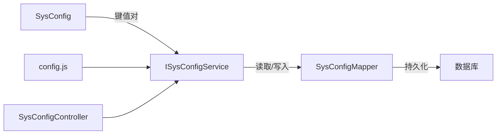
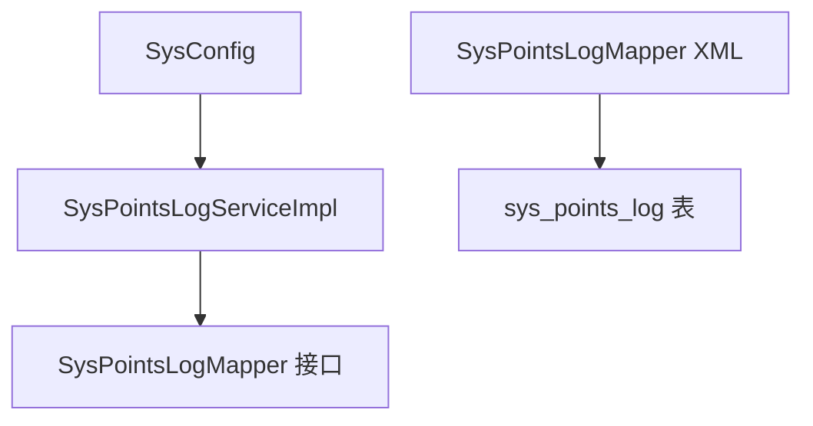
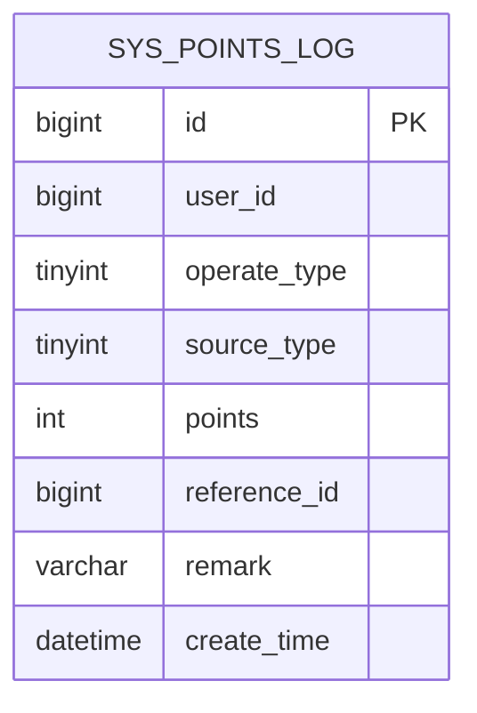

# 积分业务规则

<cite>
**本文引用的文件**
- [SysPointsLog.java](file://XingChen-Vue/xingchen-system/src/main/java/com/xingchen/system/domain/SysPointsLog.java)
- [SysPointsLogMapper.java](file://XingChen-Vue/xingchen-system/src/main/java/com/xingchen/system/mapper/SysPointsLogMapper.java)
- [SysPointsLogMapper.xml](file://XingChen-Vue/xingchen-system/src/main/resources/mapper/system/SysPointsLogMapper.xml)
- [SysPointsLogServiceImpl.java](file://XingChen-Vue/xingchen-system/src/main/java/com/xingchen/system/service/impl/SysPointsLogServiceImpl.java)
- [ISysPointsLogService.java](file://XingChen-Vue/xingchen-system/src/main/java/com/xingchen/system/service/ISysPointsLogService.java)
- [points_log.sql](file://XingChen-Vue/sql/points_log.sql)
- [PointsMall.vue](file://XingChen-Vue/xingchen-ui-user/src/views/PointsMall.vue)
- [DailyHealthCheckIn.vue（用户端）](file://XingChen-Vue/xingchen-ui-user/src/components/DailyHealthCheckIn.vue)
- [RedemptionAudit.vue](file://XingChen-Vue3/src/views/hr/RedemptionAudit.vue)
- [SysConfig.java](file://XingChen-Vue/xingchen-system/src/main/java/com/xingchen/system/domain/SysConfig.java)
- [SysConfigMapper.java](file://XingChen-Vue/xingchen-system/src/main/java/com/xingchen/system/mapper/SysConfigMapper.java)
- [ISysConfigService.java](file://XingChen-Vue/xingchen-system/src/main/java/com/xingchen/system/service/ISysConfigService.java)
- [SysConfigController.java](file://XingChen-Vue/xingchen-admin/src/main/java/com/xingchen/web/controller/system/SysConfigController.java)
- [config.js](file://XingChen-Vue3/src/api/system/config.js)
</cite>

## 目录
1. [简介](#简介)
2. [项目结构](#项目结构)
3. [核心组件](#核心组件)
4. [架构总览](#架构总览)
5. [详细组件分析](#详细组件分析)
6. [依赖关系分析](#依赖关系分析)
7. [性能考虑](#性能考虑)
8. [故障排查指南](#故障排查指南)
9. [结论](#结论)
10. [附录](#附录)

## 简介
本文件面向“积分业务规则”的设计与实现，围绕以下目标展开：
- 解释积分获取与使用的业务规则：每日打卡积分、连续打卡奖励、兑换商品消耗、HR手动退还积分。
- 明确操作类型（收入/支出）与来源类型（打卡、奖励、兑换、退还）的业务含义及处理流程。
- 提供积分规则的配置管理、规则变更与扩展机制。
- 给出积分计算算法示例与边界条件处理建议。

## 项目结构
积分相关能力由后端领域模型与前端交互界面共同组成：
- 后端领域模型与持久层：SysPointsLog（积分流水）、SysPointsLogMapper/Service 实现积分流水的增删改查。
- 前端交互：用户端“积分商城”用于兑换；HR端“兑换审核”用于审批与退还；“每日健康打卡”作为积分来源之一。
- 规则配置：SysConfig 提供可配置项，支持通过系统参数扩展积分规则。

图表来源
- [SysPointsLogServiceImpl.java:17-94](file://XingChen-Vue/xingchen-system/src/main/java/com/xingchen/system/service/impl/SysPointsLogServiceImpl.java#L17-L94)
- [SysPointsLogMapper.java:11-60](file://XingChen-Vue/xingchen-system/src/main/java/com/xingchen/system/mapper/SysPointsLogMapper.java#L11-L60)
- [SysPointsLog.java:11-104](file://XingChen-Vue/xingchen-system/src/main/java/com/xingchen/system/domain/SysPointsLog.java#L11-L104)
- [points_log.sql:4-17](file://XingChen-Vue/sql/points_log.sql#L4-L17)
- [PointsMall.vue:138-165](file://XingChen-Vue/xingchen-ui-user/src/views/PointsMall.vue#L138-L165)
- [DailyHealthCheckIn.vue（用户端）:1-81](file://XingChen-Vue/xingchen-ui-user/src/components/DailyHealthCheckIn.vue#L1-L81)
- [RedemptionAudit.vue:1-249](file://XingChen-Vue3/src/views/hr/RedemptionAudit.vue#L1-L249)
- [SysConfig.java:16-111](file://XingChen-Vue/xingchen-system/src/main/java/com/xingchen/system/domain/SysConfig.java#L16-L111)

章节来源
- [SysPointsLog.java:11-104](file://XingChen-Vue/xingchen-system/src/main/java/com/xingchen/system/domain/SysPointsLog.java#L11-L104)
- [SysPointsLogMapper.xml:1-92](file://XingChen-Vue/xingchen-system/src/main/resources/mapper/system/SysPointsLogMapper.xml#L1-L92)
- [points_log.sql:4-17](file://XingChen-Vue/sql/points_log.sql#L4-L17)

## 核心组件
- 积分流水实体：SysPointsLog，定义字段包括用户ID、操作类型（收入/支出）、来源类型（打卡/奖励/兑换/退还）、波动分值、业务关联ID等。
- 积分流水持久层：SysPointsLogMapper，提供查询、新增、更新、删除等方法。
- 积分流水服务：SysPointsLogServiceImpl，封装业务处理（如设置创建时间），并委托Mapper执行数据库操作。
- 规则配置：SysConfig，提供系统参数配置能力，支持通过键值对扩展积分规则（如每日打卡分值、连续天数阈值等）。

章节来源
- [SysPointsLog.java:11-104](file://XingChen-Vue/xingchen-system/src/main/java/com/xingchen/system/domain/SysPointsLog.java#L11-L104)
- [SysPointsLogMapper.java:11-60](file://XingChen-Vue/xingchen-system/src/main/java/com/xingchen/system/mapper/SysPointsLogMapper.java#L11-L60)
- [SysPointsLogServiceImpl.java:17-94](file://XingChen-Vue/xingchen-system/src/main/java/com/xingchen/system/service/impl/SysPointsLogServiceImpl.java#L17-L94)
- [SysConfig.java:16-111](file://XingChen-Vue/xingchen-system/src/main/java/com/xingchen/system/domain/SysConfig.java#L16-L111)

## 架构总览
积分业务遵循“前端交互—后端服务—持久层—数据库”的分层架构。前端通过API或组件事件触发业务，后端根据规则生成积分流水记录，持久层负责数据落库。

图表来源
- [PointsMall.vue:138-165](file://XingChen-Vue/xingchen-ui-user/src/views/PointsMall.vue#L138-L165)
- [RedemptionAudit.vue:181-228](file://XingChen-Vue3/src/views/hr/RedemptionAudit.vue#L181-L228)
- [SysPointsLogServiceImpl.java:52-68](file://XingChen-Vue/xingchen-system/src/main/java/com/xingchen/system/service/impl/SysPointsLogServiceImpl.java#L52-L68)
- [SysPointsLogMapper.xml:45-79](file://XingChen-Vue/xingchen-system/src/main/resources/mapper/system/SysPointsLogMapper.xml#L45-L79)
- [points_log.sql:4-17](file://XingChen-Vue/sql/points_log.sql#L4-L17)

## 详细组件分析

### 积分流水模型与数据结构
- 字段说明
  - 用户ID：标识积分变动归属。
  - 操作类型：1=收入（加/退），2=支出（扣/兑）。
  - 来源类型：1=每日打卡，2=连续打卡奖励，3=兑换商品消耗，4=HR手动退还积分。
  - 波动分值：本次变动的绝对值。
  - 业务关联ID：如打卡记录ID、兑换订单ID等，便于审计与追踪。
  - 备注与创建时间：便于运营审计与统计。

图表来源
- [SysPointsLog.java:11-104](file://XingChen-Vue/xingchen-system/src/main/java/com/xingchen/system/domain/SysPointsLog.java#L11-L104)
- [SysPointsLogMapper.java:11-60](file://XingChen-Vue/xingchen-system/src/main/java/com/xingchen/system/mapper/SysPointsLogMapper.java#L11-L60)
- [SysPointsLogServiceImpl.java:17-94](file://XingChen-Vue/xingchen-system/src/main/java/com/xingchen/system/service/impl/SysPointsLogServiceImpl.java#L17-L94)

章节来源
- [SysPointsLog.java:11-104](file://XingChen-Vue/xingchen-system/src/main/java/com/xingchen/system/domain/SysPointsLog.java#L11-L104)
- [SysPointsLogMapper.xml:7-16](file://XingChen-Vue/xingchen-system/src/main/resources/mapper/system/SysPointsLogMapper.xml#L7-L16)
- [points_log.sql:5-13](file://XingChen-Vue/sql/points_log.sql#L5-L13)

### 积分规则设计与处理流程

#### 1) 每日打卡积分
- 触发时机：用户完成每日健康打卡任务。
- 规则要点：
  - 操作类型：收入（+）。
  - 来源类型：每日打卡。
  - 分值：由系统配置决定（例如“daily_checkin_points”）。
- 边界条件：
  - 同一自然日重复打卡不应重复计分（需按日期去重）。
  - 若配置缺失，应有默认值或拒绝计分。

图表来源
- [DailyHealthCheckIn.vue（用户端）:1-81](file://XingChen-Vue/xingchen-ui-user/src/components/DailyHealthCheckIn.vue#L1-L81)
- [SysPointsLogServiceImpl.java:52-57](file://XingChen-Vue/xingchen-system/src/main/java/com/xingchen/system/service/impl/SysPointsLogServiceImpl.java#L52-L57)
- [SysPointsLogMapper.xml:45-65](file://XingChen-Vue/xingchen-system/src/main/resources/mapper/system/SysPointsLogMapper.xml#L45-L65)
- [SysConfig.java:16-111](file://XingChen-Vue/xingchen-system/src/main/java/com/xingchen/system/domain/SysConfig.java#L16-L111)

#### 2) 连续打卡奖励
- 触发时机：连续多日未中断。
- 规则要点：
  - 操作类型：收入（+）。
  - 来源类型：连续打卡奖励。
  - 分值：由配置决定（例如“streak_reward_points”），可叠加或封顶。
- 边界条件：
  - 连续性判断需基于历史流水的日期序列。
  - 奖励周期（如每周结算）需明确，避免重复发放。

图表来源
- [SysPointsLogMapper.xml:22-38](file://XingChen-Vue/xingchen-system/src/main/resources/mapper/system/SysPointsLogMapper.xml#L22-L38)
- [SysConfig.java:16-111](file://XingChen-Vue/xingchen-system/src/main/java/com/xingchen/system/domain/SysConfig.java#L16-L111)

#### 3) 兑换商品消耗
- 触发时机：用户在积分商城提交兑换申请，HR审核通过。
- 规则要点：
  - 操作类型：支出（-）。
  - 来源类型：兑换商品消耗。
  - 分值：商品所需积分。
- 边界条件：
  - 兑换前需校验用户积分余额。
  - 审核状态需与业务流一致（待审核/通过/驳回）。

图表来源
- [PointsMall.vue:138-165](file://XingChen-Vue/xingchen-ui-user/src/views/PointsMall.vue#L138-L165)
- [SysPointsLogServiceImpl.java:52-57](file://XingChen-Vue/xingchen-system/src/main/java/com/xingchen/system/service/impl/SysPointsLogServiceImpl.java#L52-L57)
- [SysPointsLogMapper.xml:45-65](file://XingChen-Vue/xingchen-system/src/main/resources/mapper/system/SysPointsLogMapper.xml#L45-L65)

#### 4) HR手动退还积分
- 触发时机：HR在审核界面进行退还操作。
- 规则要点：
  - 操作类型：收入（+）。
  - 来源类型：HR手动退还积分。
  - 分值：由HR输入或从原扣除记录反推。
- 边界条件：
  - 退还需有明确的业务关联ID（原扣除流水）。
  - 退还次数与金额需受控，防止滥用。

图表来源
- [RedemptionAudit.vue:181-228](file://XingChen-Vue3/src/views/hr/RedemptionAudit.vue#L181-L228)
- [SysPointsLogServiceImpl.java:52-57](file://XingChen-Vue/xingchen-system/src/main/java/com/xingchen/system/service/impl/SysPointsLogServiceImpl.java#L52-L57)
- [SysPointsLogMapper.xml:45-65](file://XingChen-Vue/xingchen-system/src/main/resources/mapper/system/SysPointsLogMapper.xml#L45-L65)

### 配置管理、规则变更与扩展机制
- 配置载体：SysConfig 提供参数键值对，支持系统内置标记与唯一键校验。
- 前端API：config.js 提供参数列表、详情、新增、修改、删除、刷新缓存等接口。
- 控制器：SysConfigController 提供REST接口，配合权限注解与日志注解。
- 扩展建议：
  - 新增规则：在SysConfig中增加新键（如“streak_beyond_7_days_bonus”），并在服务侧读取。
  - 规则变更：通过接口修改配置值，结合刷新缓存接口生效。
  - 规则审计：所有配置变更均通过控制器接口，便于日志与审计。

图表来源
- [SysConfig.java:16-111](file://XingChen-Vue/xingchen-system/src/main/java/com/xingchen/system/domain/SysConfig.java#L16-L111)
- [ISysConfigService.java:56-89](file://XingChen-Vue/xingchen-system/src/main/java/com/xingchen/system/service/ISysConfigService.java#L56-L89)
- [SysConfigMapper.java:11-76](file://XingChen-Vue/xingchen-system/src/main/java/com/xingchen/system/mapper/SysConfigMapper.java#L11-L76)
- [SysConfigController.java:30-34](file://XingChen-Vue/xingchen-admin/src/main/java/com/xingchen/web/controller/system/SysConfigController.java#L30-L34)
- [config.js:1-60](file://XingChen-Vue3/src/api/system/config.js#L1-L60)

章节来源
- [SysConfig.java:16-111](file://XingChen-Vue/xingchen-system/src/main/java/com/xingchen/system/domain/SysConfig.java#L16-L111)
- [ISysConfigService.java:56-89](file://XingChen-Vue/xingchen-system/src/main/java/com/xingchen/system/service/ISysConfigService.java#L56-L89)
- [SysConfigMapper.java:11-76](file://XingChen-Vue/xingchen-system/src/main/java/com/xingchen/system/mapper/SysConfigMapper.java#L11-L76)
- [SysConfigController.java:30-34](file://XingChen-Vue/xingchen-admin/src/main/java/com/xingchen/web/controller/system/SysConfigController.java#L30-L34)
- [config.js:1-60](file://XingChen-Vue3/src/api/system/config.js#L1-L60)

## 依赖关系分析
- 低耦合高内聚：积分服务仅依赖Mapper接口，便于替换实现与测试。
- 数据一致性：积分流水通过Mapper统一写入数据库，字段与索引设计支持按用户ID与业务关联ID快速检索。
- 配置驱动：规则通过SysConfig集中管理，避免硬编码，提升灵活性。

图表来源
- [SysPointsLogServiceImpl.java:17-94](file://XingChen-Vue/xingchen-system/src/main/java/com/xingchen/system/service/impl/SysPointsLogServiceImpl.java#L17-L94)
- [SysPointsLogMapper.java:11-60](file://XingChen-Vue/xingchen-system/src/main/java/com/xingchen/system/mapper/SysPointsLogMapper.java#L11-L60)
- [SysPointsLogMapper.xml:1-92](file://XingChen-Vue/xingchen-system/src/main/resources/mapper/system/SysPointsLogMapper.xml#L1-L92)
- [points_log.sql:4-17](file://XingChen-Vue/sql/points_log.sql#L4-L17)
- [SysConfig.java:16-111](file://XingChen-Vue/xingchen-system/src/main/java/com/xingchen/system/domain/SysConfig.java#L16-L111)

章节来源
- [SysPointsLogMapper.xml:1-92](file://XingChen-Vue/xingchen-system/src/main/resources/mapper/system/SysPointsLogMapper.xml#L1-L92)
- [points_log.sql:4-17](file://XingChen-Vue/sql/points_log.sql#L4-L17)

## 性能考虑
- 索引优化：用户ID与业务关联ID建立索引，有利于高频查询与审计。
- 写入批量化：批量插入与更新时注意SQL拼接与参数绑定，避免全表扫描。
- 缓存策略：规则配置可引入缓存，减少频繁读取数据库带来的压力。
- 时间范围查询：按日期格式化字段进行范围查询，确保索引命中。

## 故障排查指南
- 兑换失败
  - 现象：余额不足或状态异常。
  - 排查：检查用户当前积分、兑换记录状态、库存与限额。
  - 参考路径：[PointsMall.vue:138-165](file://XingChen-Vue/xingchen-ui-user/src/views/PointsMall.vue#L138-L165)
- 退还未到账
  - 现象：HR已退还但用户未见积分。
  - 排查：核对退还流水的操作类型与来源类型、业务关联ID、是否重复退还。
  - 参考路径：[RedemptionAudit.vue:181-228](file://XingChen-Vue3/src/views/hr/RedemptionAudit.vue#L181-L228)
- 连续奖励未发放
  - 现象：连续打卡天数满足但未计分。
  - 排查：确认连续性算法、配置项是否存在、是否已去重。
  - 参考路径：[SysPointsLogMapper.xml:22-38](file://XingChen-Vue/xingchen-system/src/main/resources/mapper/system/SysPointsLogMapper.xml#L22-L38)
- 配置不生效
  - 现象：修改配置后规则未变化。
  - 排查：确认配置键值、刷新缓存接口是否调用、服务侧是否正确读取。
  - 参考路径：[config.js:1-60](file://XingChen-Vue3/src/api/system/config.js#L1-L60)

章节来源
- [PointsMall.vue:138-165](file://XingChen-Vue/xingchen-ui-user/src/views/PointsMall.vue#L138-L165)
- [RedemptionAudit.vue:181-228](file://XingChen-Vue3/src/views/hr/RedemptionAudit.vue#L181-L228)
- [SysPointsLogMapper.xml:22-38](file://XingChen-Vue/xingchen-system/src/main/resources/mapper/system/SysPointsLogMapper.xml#L22-L38)
- [config.js:1-60](file://XingChen-Vue3/src/api/system/config.js#L1-L60)

## 结论
本方案以SysPointsLog为核心，通过清晰的来源类型与操作类型定义，覆盖了日常运营中的主要积分场景。配合SysConfig的配置化能力，实现了规则的灵活扩展与快速迭代。建议在生产环境中完善连续性计算、去重与幂等控制、以及配置缓存与审计日志，确保业务稳定与可追溯。

## 附录

### 数据模型图

图表来源
- [points_log.sql:5-17](file://XingChen-Vue/sql/points_log.sql#L5-L17)