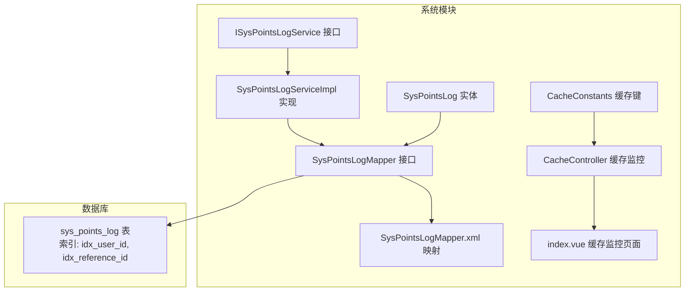
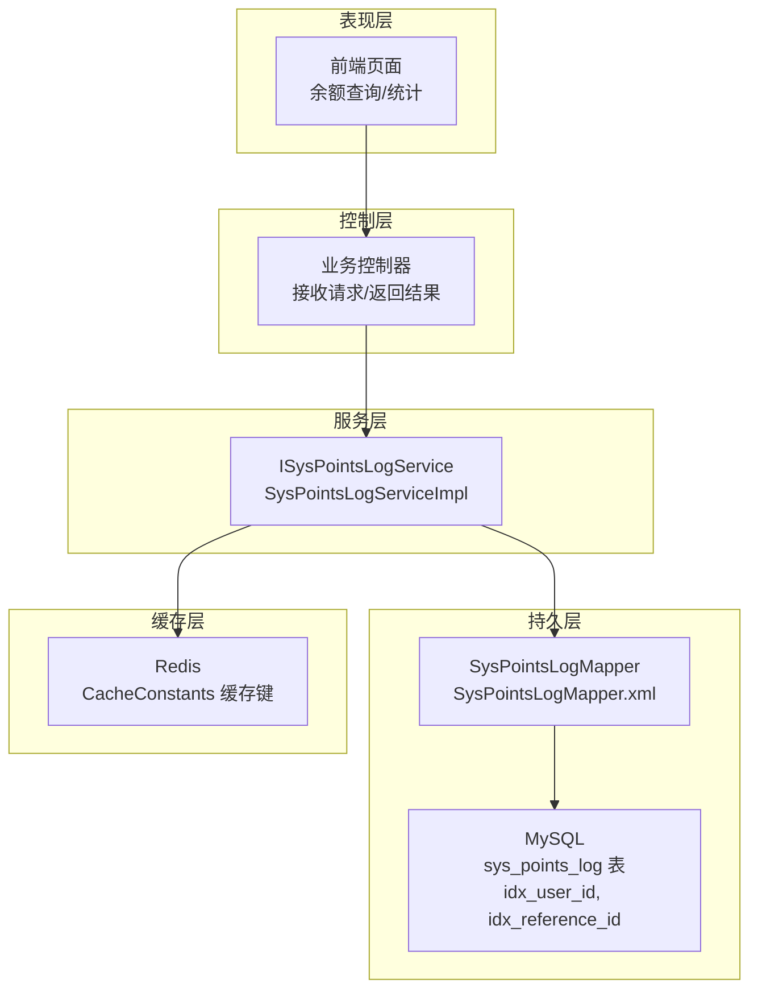
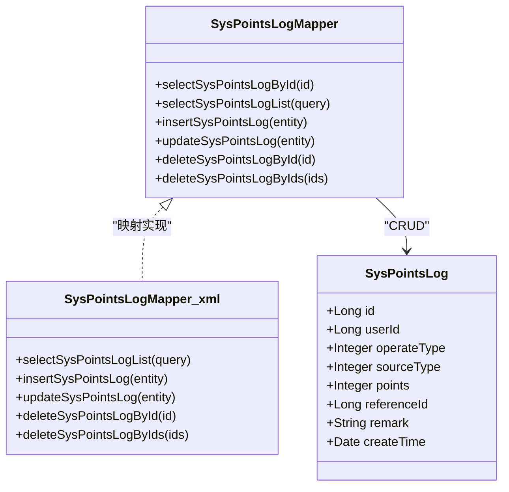
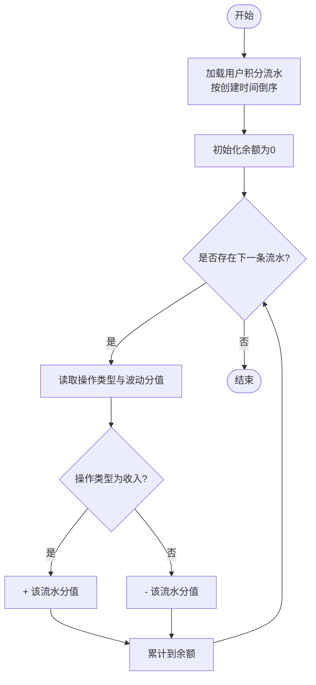
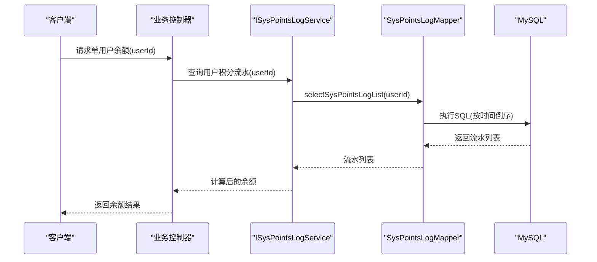
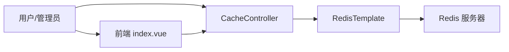
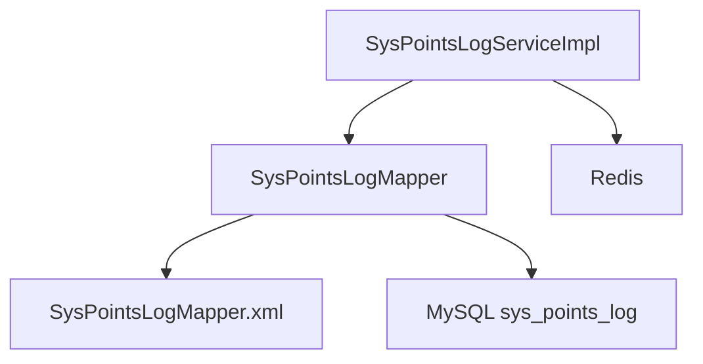

# 积分余额计算

<cite>
**本文引用的文件**
- [points_log.sql](file://sql/points_log.sql)
- [SysPointsLog.java](file://xingchen-system/src/main/java/com/xingchen/system/domain/SysPointsLog.java)
- [ISysPointsLogService.java](file://xingchen-system/src/main/java/com/xingchen/system/service/ISysPointsLogService.java)
- [SysPointsLogServiceImpl.java](file://xingchen-system/src/main/java/com/xingchen/system/service/impl/SysPointsLogServiceImpl.java)
- [SysPointsLogMapper.java](file://xingchen-system/src/main/java/com/xingchen/system/mapper/SysPointsLogMapper.java)
- [SysPointsLogMapper.xml](file://xingchen-system/src/main/resources/mapper/system/SysPointsLogMapper.xml)
- [CacheConstants.java](file://xingchen-common/src/main/java/com/xingchen/common/constant/CacheConstants.java)
- [CacheController.java](file://xingchen-admin/src/main/java/com/xingchen/web/controller/monitor/CacheController.java)
- [index.vue](file://XingChen-Vue3/src/views/monitor/cache/index.vue)
</cite>

## 目录
1. [简介](#简介)
2. [项目结构](#项目结构)
3. [核心组件](#核心组件)
4. [架构总览](#架构总览)
5. [详细组件分析](#详细组件分析)
6. [依赖关系分析](#依赖关系分析)
7. [性能考量](#性能考量)
8. [故障排查指南](#故障排查指南)
9. [结论](#结论)
10. [附录](#附录)

## 简介
本文件围绕“积分余额计算”进行系统化技术文档整理，重点覆盖以下方面：
- 实时计算算法：基于积分流水表的收入与支出累加机制，明确正负方向与累计逻辑。
- 接口实现：单用户余额查询与批量余额统计的实现思路与扩展点。
- 事务与并发：通过数据库层面的约束与索引保障一致性，结合Redis缓存提升读性能。
- 异常处理与校验：数据完整性校验、异常捕获与修复建议。
- 性能优化与缓存：索引策略、热点用户缓存、批量统计优化。

## 项目结构
积分余额相关的核心代码与资源分布如下：
- 数据模型与持久层：SysPointsLog实体类、Mapper接口与XML映射。
- 业务服务层：ISysPointsLogService接口与SysPointsLogServiceImpl实现。
- 数据库脚本：积分流水表结构定义与索引。
- 缓存常量与监控：CacheConstants缓存键前缀、Redis监控接口与前端展示。

**图表来源**
- [SysPointsLog.java:1-105](file://xingchen-system/src/main/java/com/xingchen/system/domain/SysPointsLog.java#L1-L105)
- [SysPointsLogMapper.java:1-60](file://xingchen-system/src/main/java/com/xingchen/system/mapper/SysPointsLogMapper.java#L1-L60)
- [SysPointsLogMapper.xml:22-91](file://xingchen-system/src/main/resources/mapper/system/SysPointsLogMapper.xml#L22-L91)
- [ISysPointsLogService.java:1-60](file://xingchen-system/src/main/java/com/xingchen/system/service/ISysPointsLogService.java#L1-L60)
- [SysPointsLogServiceImpl.java:1-94](file://xingchen-system/src/main/java/com/xingchen/system/service/impl/SysPointsLogServiceImpl.java#L1-L94)
- [CacheConstants.java:1-45](file://xingchen-common/src/main/java/com/xingchen/common/constant/CacheConstants.java#L1-L45)
- [CacheController.java:1-93](file://xingchen-admin/src/main/java/com/xingchen/web/controller/monitor/CacheController.java#L1-L93)
- [index.vue:1-56](file://XingChen-Vue3/src/views/monitor/cache/index.vue#L1-L56)
- [points_log.sql:1-17](file://sql/points_log.sql#L1-L17)

**章节来源**
- [SysPointsLog.java:1-105](file://xingchen-system/src/main/java/com/xingchen/system/domain/SysPointsLog.java#L1-L105)
- [SysPointsLogMapper.java:1-60](file://xingchen-system/src/main/java/com/xingchen/system/mapper/SysPointsLogMapper.java#L1-L60)
- [SysPointsLogMapper.xml:22-91](file://xingchen-system/src/main/resources/mapper/system/SysPointsLogMapper.xml#L22-L91)
- [ISysPointsLogService.java:1-60](file://xingchen-system/src/main/java/com/xingchen/system/service/ISysPointsLogService.java#L1-L60)
- [SysPointsLogServiceImpl.java:1-94](file://xingchen-system/src/main/java/com/xingchen/system/service/impl/SysPointsLogServiceImpl.java#L1-L94)
- [CacheConstants.java:1-45](file://xingchen-common/src/main/java/com/xingchen/common/constant/CacheConstants.java#L1-L45)
- [CacheController.java:1-93](file://xingchen-admin/src/main/java/com/xingchen/web/controller/monitor/CacheController.java#L1-L93)
- [index.vue:1-56](file://XingChen-Vue3/src/views/monitor/cache/index.vue#L1-L56)
- [points_log.sql:1-17](file://sql/points_log.sql#L1-L17)

## 核心组件
- 数据模型：SysPointsLog封装了积分流水字段，包括用户ID、操作类型（收入/支出）、来源类型、波动分值、业务关联ID等。
- 持久层：SysPointsLogMapper定义了查询、新增、更新、删除等方法；SysPointsLogMapper.xml实现SQL映射与条件查询。
- 业务服务：ISysPointsLogService定义服务契约；SysPointsLogServiceImpl负责新增时的时间戳设置与调用Mapper。
- 缓存：CacheConstants提供缓存键前缀；CacheController与前端index.vue用于Redis监控与可视化。

**章节来源**
- [SysPointsLog.java:1-105](file://xingchen-system/src/main/java/com/xingchen/system/domain/SysPointsLog.java#L1-L105)
- [SysPointsLogMapper.java:1-60](file://xingchen-system/src/main/java/com/xingchen/system/mapper/SysPointsLogMapper.java#L1-L60)
- [SysPointsLogMapper.xml:22-91](file://xingchen-system/src/main/resources/mapper/system/SysPointsLogMapper.xml#L22-L91)
- [ISysPointsLogService.java:1-60](file://xingchen-system/src/main/java/com/xingchen/system/service/ISysPointsLogService.java#L1-L60)
- [SysPointsLogServiceImpl.java:1-94](file://xingchen-system/src/main/java/com/xingchen/system/service/impl/SysPointsLogServiceImpl.java#L1-L94)
- [CacheConstants.java:1-45](file://xingchen-common/src/main/java/com/xingchen/common/constant/CacheConstants.java#L1-L45)
- [CacheController.java:1-93](file://xingchen-admin/src/main/java/com/xingchen/web/controller/monitor/CacheController.java#L1-L93)
- [index.vue:1-56](file://XingChen-Vue3/src/views/monitor/cache/index.vue#L1-L56)

## 架构总览
积分余额计算采用“流水驱动”的架构：所有积分变动均以流水形式落库，余额通过汇总计算得出。系统通过数据库索引保证查询效率，通过Redis缓存热点用户的余额结果，减少数据库压力。

**图表来源**
- [SysPointsLogServiceImpl.java:1-94](file://xingchen-system/src/main/java/com/xingchen/system/service/impl/SysPointsLogServiceImpl.java#L1-L94)
- [SysPointsLogMapper.xml:22-91](file://xingchen-system/src/main/resources/mapper/system/SysPointsLogMapper.xml#L22-L91)
- [points_log.sql:1-17](file://sql/points_log.sql#L1-L17)
- [CacheConstants.java:1-45](file://xingchen-common/src/main/java/com/xingchen/common/constant/CacheConstants.java#L1-L45)

## 详细组件分析

### 数据模型与映射
- SysPointsLog实体包含用户ID、操作类型、来源类型、波动分值、业务关联ID等字段，便于后续按用户维度聚合。
- Mapper XML提供按用户ID、操作类型、来源类型、时间范围等条件的查询能力，并按创建时间倒序排列，满足流水查询与余额计算的顺序要求。

**图表来源**
- [SysPointsLog.java:1-105](file://xingchen-system/src/main/java/com/xingchen/system/domain/SysPointsLog.java#L1-L105)
- [SysPointsLogMapper.java:1-60](file://xingchen-system/src/main/java/com/xingchen/system/mapper/SysPointsLogMapper.java#L1-L60)
- [SysPointsLogMapper.xml:22-91](file://xingchen-system/src/main/resources/mapper/system/SysPointsLogMapper.xml#L22-L91)

**章节来源**
- [SysPointsLog.java:1-105](file://xingchen-system/src/main/java/com/xingchen/system/domain/SysPointsLog.java#L1-L105)
- [SysPointsLogMapper.java:1-60](file://xingchen-system/src/main/java/com/xingchen/system/mapper/SysPointsLogMapper.java#L1-L60)
- [SysPointsLogMapper.xml:22-91](file://xingchen-system/src/main/resources/mapper/system/SysPointsLogMapper.xml#L22-L91)

### 余额计算算法（实时累加）
- 收入与支出累加：根据操作类型区分收入（+）与支出（-），对同一用户的所有流水按时间顺序累加，得到当前余额。
- 时间顺序：流水按创建时间倒序，确保最新流水优先参与计算。
- 聚合方式：按用户ID分组，分别统计收入合计与支出合计，再相减得到余额。

**图表来源**
- [SysPointsLogMapper.xml:22-38](file://xingchen-system/src/main/resources/mapper/system/SysPointsLogMapper.xml#L22-L38)

**章节来源**
- [SysPointsLogMapper.xml:22-38](file://xingchen-system/src/main/resources/mapper/system/SysPointsLogMapper.xml#L22-L38)

### 余额查询接口实现
- 单用户余额查询：通过用户ID查询其积分流水，按上述算法累加得到余额；可结合Redis缓存命中率优化。
- 批量余额统计：对多个用户或全量用户执行相同聚合逻辑，支持分页与条件过滤（如时间范围、来源类型）。

**图表来源**
- [ISysPointsLogService.java:1-60](file://xingchen-system/src/main/java/com/xingchen/system/service/ISysPointsLogService.java#L1-L60)
- [SysPointsLogMapper.xml:22-38](file://xingchen-system/src/main/resources/mapper/system/SysPointsLogMapper.xml#L22-L38)
- [SysPointsLogServiceImpl.java:1-94](file://xingchen-system/src/main/java/com/xingchen/system/service/impl/SysPointsLogServiceImpl.java#L1-L94)

**章节来源**
- [ISysPointsLogService.java:1-60](file://xingchen-system/src/main/java/com/xingchen/system/service/ISysPointsLogService.java#L1-L60)
- [SysPointsLogMapper.xml:22-38](file://xingchen-system/src/main/resources/mapper/system/SysPointsLogMapper.xml#L22-L38)
- [SysPointsLogServiceImpl.java:1-94](file://xingchen-system/src/main/java/com/xingchen/system/service/impl/SysPointsLogServiceImpl.java#L1-L94)

### 事务处理与并发控制
- 事务：积分流水写入应处于独立事务中，确保原子性与一致性。
- 并发：通过数据库索引与唯一约束避免重复与脏读；在高并发场景下，建议对关键路径增加适当的锁或乐观并发控制。
- 一致性：余额由流水汇总计算，不直接存储冗余余额，避免“账实不符”。

**章节来源**
- [points_log.sql:1-17](file://sql/points_log.sql#L1-L17)

### 缓存策略与监控
- 缓存键：使用CacheConstants提供的统一前缀，便于命名空间隔离与清理。
- 缓存内容：可缓存单用户余额与热门统计结果，设置合理TTL与失效策略。
- 监控：通过CacheController与前端index.vue查看Redis状态、Key数量与命令统计，辅助容量规划与问题定位。

**图表来源**
- [CacheConstants.java:1-45](file://xingchen-common/src/main/java/com/xingchen/common/constant/CacheConstants.java#L1-L45)
- [CacheController.java:1-93](file://xingchen-admin/src/main/java/com/xingchen/web/controller/monitor/CacheController.java#L1-L93)
- [index.vue:1-56](file://XingChen-Vue3/src/views/monitor/cache/index.vue#L1-L56)

**章节来源**
- [CacheConstants.java:1-45](file://xingchen-common/src/main/java/com/xingchen/common/constant/CacheConstants.java#L1-L45)
- [CacheController.java:1-93](file://xingchen-admin/src/main/java/com/xingchen/web/controller/monitor/CacheController.java#L1-L93)
- [index.vue:1-56](file://XingChen-Vue3/src/views/monitor/cache/index.vue#L1-L56)

## 依赖关系分析
- 组件耦合：服务层依赖Mapper接口，实体作为数据载体贯穿各层；缓存层与服务层松耦合。
- 外部依赖：MySQL提供数据持久化，Redis提供高性能缓存；前端通过控制器暴露的接口访问缓存与余额数据。

**图表来源**
- [SysPointsLogServiceImpl.java:1-94](file://xingchen-system/src/main/java/com/xingchen/system/service/impl/SysPointsLogServiceImpl.java#L1-L94)
- [SysPointsLogMapper.java:1-60](file://xingchen-system/src/main/java/com/xingchen/system/mapper/SysPointsLogMapper.java#L1-L60)
- [SysPointsLogMapper.xml:22-91](file://xingchen-system/src/main/resources/mapper/system/SysPointsLogMapper.xml#L22-L91)
- [points_log.sql:1-17](file://sql/points_log.sql#L1-L17)

**章节来源**
- [SysPointsLogServiceImpl.java:1-94](file://xingchen-system/src/main/java/com/xingchen/system/service/impl/SysPointsLogServiceImpl.java#L1-L94)
- [SysPointsLogMapper.java:1-60](file://xingchen-system/src/main/java/com/xingchen/system/mapper/SysPointsLogMapper.java#L1-L60)
- [SysPointsLogMapper.xml:22-91](file://xingchen-system/src/main/resources/mapper/system/SysPointsLogMapper.xml#L22-L91)
- [points_log.sql:1-17](file://sql/points_log.sql#L1-L17)

## 性能考量
- 索引优化：表已建立用户ID与业务关联ID索引，有利于按用户与业务维度快速检索。
- 查询排序：按创建时间倒序，满足余额计算的时序需求。
- 缓存命中：对高频查询结果进行缓存，降低数据库压力；结合TTL与失效策略平衡一致性与性能。
- 批量统计：对批量余额统计增加分页与条件过滤，避免一次性扫描过多数据。

**章节来源**
- [points_log.sql:1-17](file://sql/points_log.sql#L1-L17)
- [SysPointsLogMapper.xml:22-38](file://xingchen-system/src/main/resources/mapper/system/SysPointsLogMapper.xml#L22-L38)
- [CacheConstants.java:1-45](file://xingchen-common/src/main/java/com/xingchen/common/constant/CacheConstants.java#L1-L45)

## 故障排查指南
- 数据不一致：检查流水是否正确写入、操作类型是否正确、时间顺序是否被破坏。
- 查询异常：确认Mapper条件拼接是否正确、时间范围参数是否传入、排序是否生效。
- 缓存问题：通过CacheController列出缓存键、获取指定Key值，核对TTL与序列化格式。
- Redis异常：查看前端缓存监控页面的Redis状态与命令统计，定位慢查询与内存占用。

**章节来源**
- [SysPointsLogMapper.xml:22-91](file://xingchen-system/src/main/resources/mapper/system/SysPointsLogMapper.xml#L22-L91)
- [CacheController.java:1-93](file://xingchen-admin/src/main/java/com/xingchen/web/controller/monitor/CacheController.java#L1-L93)
- [index.vue:1-56](file://XingChen-Vue3/src/views/monitor/cache/index.vue#L1-L56)

## 结论
本方案以“流水驱动余额”的设计，确保了积分计算的透明与可追溯；通过数据库索引与Redis缓存相结合，兼顾了准确性与性能。建议在高并发场景下进一步完善事务边界与缓存失效策略，并持续监控Redis状态以保障系统稳定性。

## 附录
- 数据库表结构参考：[points_log.sql:1-17](file://sql/points_log.sql#L1-L17)
- 实体与映射参考：
  - [SysPointsLog.java:1-105](file://xingchen-system/src/main/java/com/xingchen/system/domain/SysPointsLog.java#L1-L105)
  - [SysPointsLogMapper.java:1-60](file://xingchen-system/src/main/java/com/xingchen/system/mapper/SysPointsLogMapper.java#L1-L60)
  - [SysPointsLogMapper.xml:22-91](file://xingchen-system/src/main/resources/mapper/system/SysPointsLogMapper.xml#L22-L91)
- 服务与缓存参考：
  - [ISysPointsLogService.java:1-60](file://xingchen-system/src/main/java/com/xingchen/system/service/ISysPointsLogService.java#L1-L60)
  - [SysPointsLogServiceImpl.java:1-94](file://xingchen-system/src/main/java/com/xingchen/system/service/impl/SysPointsLogServiceImpl.java#L1-L94)
  - [CacheConstants.java:1-45](file://xingchen-common/src/main/java/com/xingchen/common/constant/CacheConstants.java#L1-L45)
  - [CacheController.java:1-93](file://xingchen-admin/src/main/java/com/xingchen/web/controller/monitor/CacheController.java#L1-L93)
  - [index.vue:1-56](file://XingChen-Vue3/src/views/monitor/cache/index.vue#L1-L56)