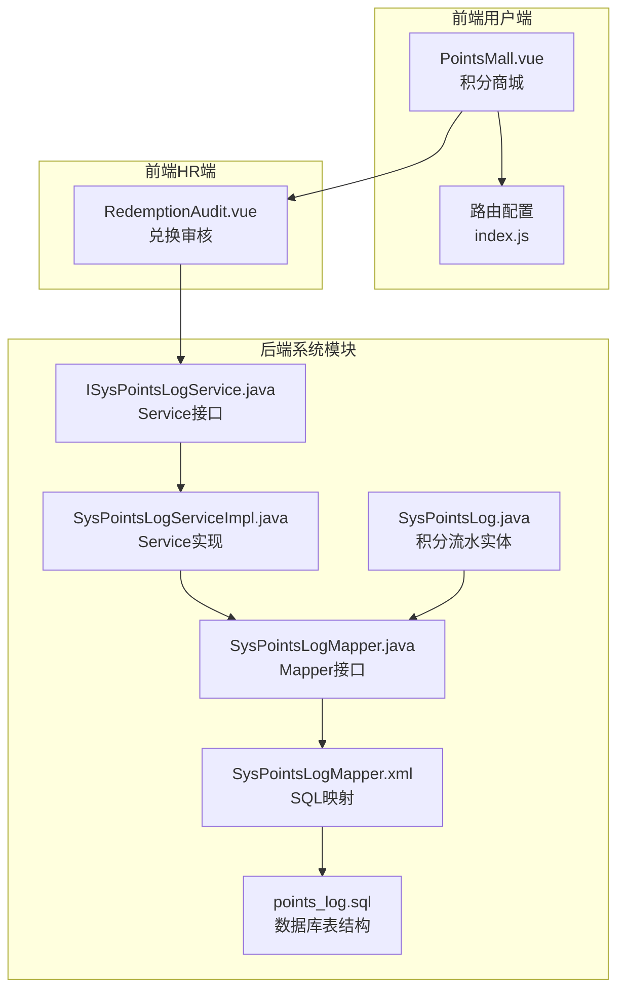
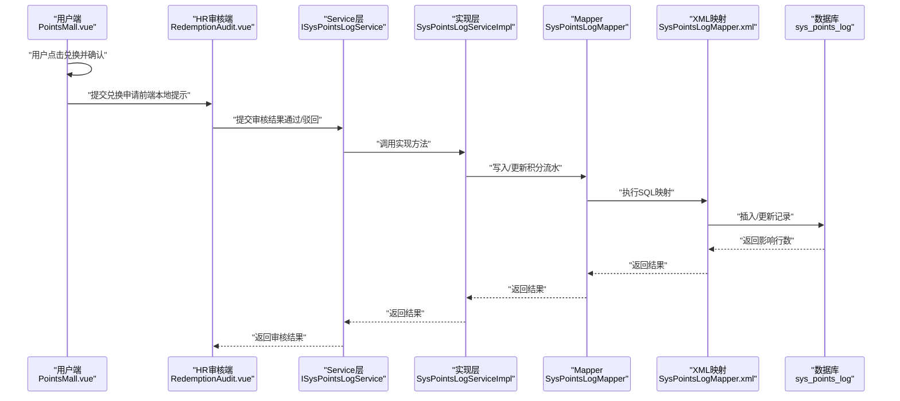
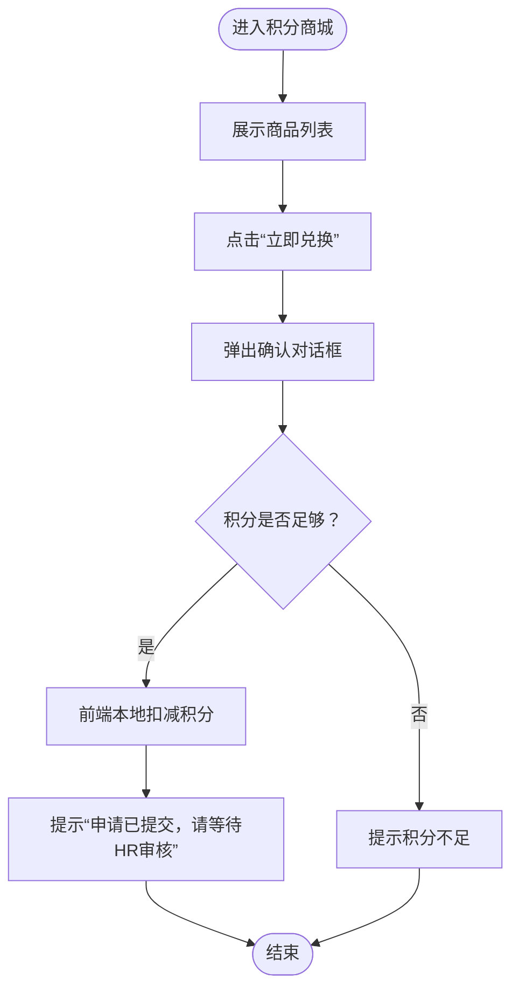
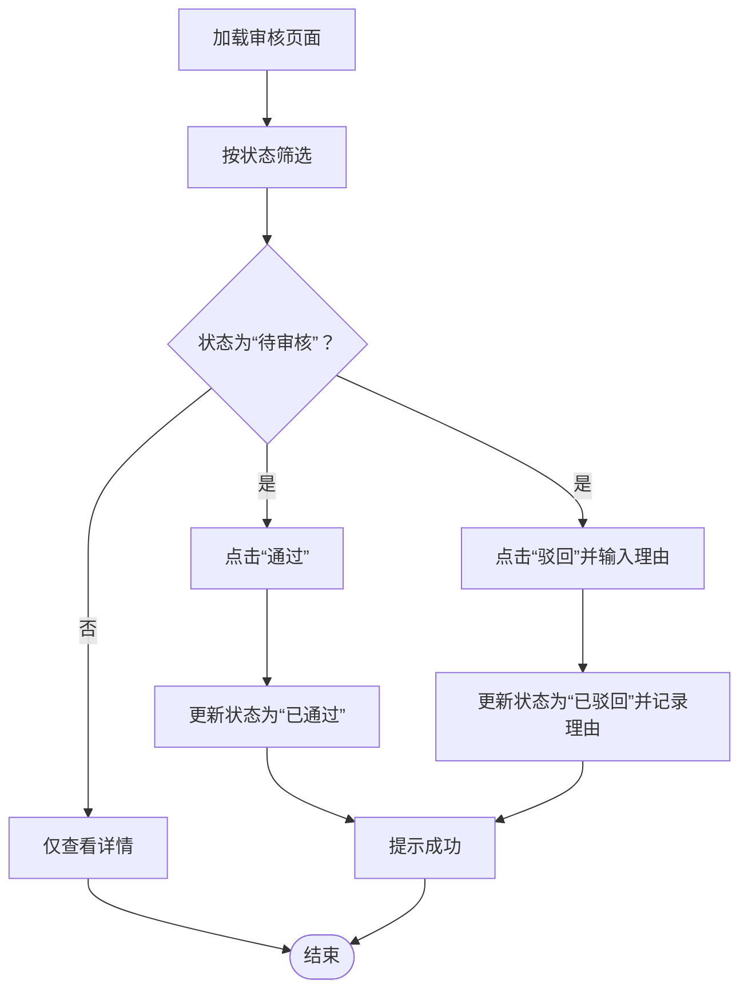
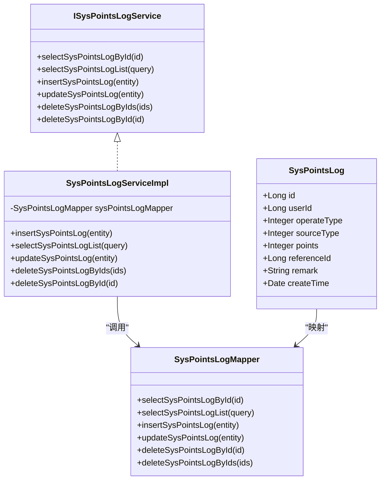
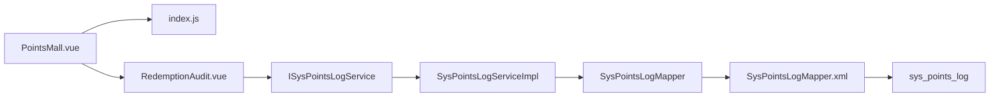
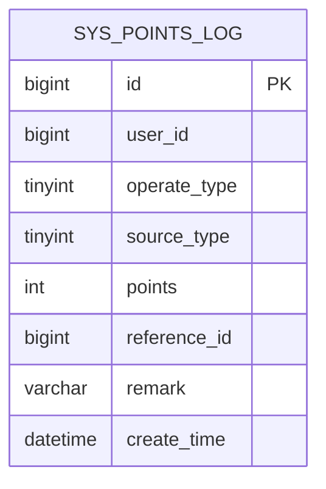

# 积分兑换机制

<cite>
**本文引用的文件**
- [项目说明文档.md](file://项目说明文档.md)
- [PointsMall.vue](file://XingChen-Vue/xingchen-ui-user/src/views/PointsMall.vue)
- [RedemptionAudit.vue](file://XingChen-Vue3/src/views/hr/RedemptionAudit.vue)
- [SysPointsLog.java](file://XingChen-Vue/xingchen-system/src/main/java/com/xingchen/system/domain/SysPointsLog.java)
- [SysPointsLogMapper.java](file://XingChen-Vue/xingchen-system/src/main/java/com/xingchen/system/mapper/SysPointsLogMapper.java)
- [SysPointsLogMapper.xml](file://XingChen-Vue/xingchen-system/src/main/resources/mapper/system/SysPointsLogMapper.xml)
- [ISysPointsLogService.java](file://XingChen-Vue/xingchen-system/src/main/java/com/xingchen/system/service/ISysPointsLogService.java)
- [SysPointsLogServiceImpl.java](file://XingChen-Vue/xingchen-system/src/main/java/com/xingchen/system/service/impl/SysPointsLogServiceImpl.java)
- [points_log.sql](file://XingChen-Vue/sql/points_log.sql)
- [index.js](file://XingChen-Vue/xingchen-ui-user/src/router/index.js)
</cite>

## 目录
1. [简介](#简介)
2. [项目结构](#项目结构)
3. [核心组件](#核心组件)
4. [架构总览](#架构总览)
5. [详细组件分析](#详细组件分析)
6. [依赖分析](#依赖分析)
7. [性能考虑](#性能考虑)
8. [故障排查指南](#故障排查指南)
9. [结论](#结论)
10. [附录](#附录)

## 简介
本文件系统化梳理健康管理系统中的“积分兑换机制”，覆盖从用户端兑换申请、HR端审核，到后端积分流水记录与统计分析的完整闭环。文档重点说明：
- 兑换业务流程：申请、审核、执行与回滚
- 兑换场景逻辑：商品兑换、服务兑换等
- 积分扣减与流水生成规则
- 兑换异常处理、库存管理与风控建议
- 统计分析与报表实现思路

## 项目结构
后端采用多模块结构，积分兑换涉及以下关键模块与文件：
- 前端用户端：积分商城页面与路由
- 前端HR端：兑换审核页面
- 后端系统模块：积分流水实体、Mapper/Service/DAO

图表来源
- [PointsMall.vue:1-200](file://XingChen-Vue/xingchen-ui-user/src/views/PointsMall.vue#L1-L200)
- [index.js:1-48](file://XingChen-Vue/xingchen-ui-user/src/router/index.js#L1-L48)
- [RedemptionAudit.vue:1-250](file://XingChen-Vue3/src/views/hr/RedemptionAudit.vue#L1-L250)
- [SysPointsLog.java:1-105](file://XingChen-Vue/xingchen-system/src/main/java/com/xingchen/system/domain/SysPointsLog.java#L1-L105)
- [SysPointsLogMapper.java:1-60](file://XingChen-Vue/xingchen-system/src/main/java/com/xingchen/system/mapper/SysPointsLogMapper.java#L1-L60)
- [SysPointsLogMapper.xml:1-92](file://XingChen-Vue/xingchen-system/src/main/resources/mapper/system/SysPointsLogMapper.xml#L1-L92)
- [ISysPointsLogService.java:1-60](file://XingChen-Vue/xingchen-system/src/main/java/com/xingchen/system/service/ISysPointsLogService.java#L1-L60)
- [SysPointsLogServiceImpl.java:1-94](file://XingChen-Vue/xingchen-system/src/main/java/com/xingchen/system/service/impl/SysPointsLogServiceImpl.java#L1-L94)
- [points_log.sql:1-17](file://XingChen-Vue/sql/points_log.sql#L1-L17)

章节来源
- [项目说明文档.md:29-47](file://项目说明文档.md#L29-L47)

## 核心组件
- 积分流水实体：定义积分变动的字段与枚举含义（操作类型、场景类型、业务关联ID等）
- Mapper/Service：提供积分流水的查询、新增、更新、删除能力
- 前端用户端：展示商品、发起兑换申请、本地提示与状态反馈
- 前端HR端：展示兑换申请、进行审核（通过/驳回）、状态变更与原因记录
- 数据库表：sys_points_log，支持按用户、场景、时间范围查询与索引优化

章节来源
- [SysPointsLog.java:1-105](file://XingChen-Vue/xingchen-system/src/main/java/com/xingchen/system/domain/SysPointsLog.java#L1-L105)
- [SysPointsLogMapper.java:1-60](file://XingChen-Vue/xingchen-system/src/main/java/com/xingchen/system/mapper/SysPointsLogMapper.java#L1-L60)
- [SysPointsLogMapper.xml:1-92](file://XingChen-Vue/xingchen-system/src/main/resources/mapper/system/SysPointsLogMapper.xml#L1-L92)
- [ISysPointsLogService.java:1-60](file://XingChen-Vue/xingchen-system/src/main/java/com/xingchen/system/service/ISysPointsLogService.java#L1-L60)
- [SysPointsLogServiceImpl.java:1-94](file://XingChen-Vue/xingchen-system/src/main/java/com/xingchen/system/service/impl/SysPointsLogServiceImpl.java#L1-L94)
- [PointsMall.vue:138-165](file://XingChen-Vue/xingchen-ui-user/src/views/PointsMall.vue#L138-L165)
- [RedemptionAudit.vue:1-250](file://XingChen-Vue3/src/views/hr/RedemptionAudit.vue#L1-L250)
- [points_log.sql:1-17](file://XingChen-Vue/sql/points_log.sql#L1-L17)

## 架构总览
下图展示从用户兑换到HR审核再到积分流水落库的整体流程。

图表来源
- [PointsMall.vue:138-165](file://XingChen-Vue/xingchen-ui-user/src/views/PointsMall.vue#L138-L165)
- [RedemptionAudit.vue:181-228](file://XingChen-Vue3/src/views/hr/RedemptionAudit.vue#L181-L228)
- [ISysPointsLogService.java:1-60](file://XingChen-Vue/xingchen-system/src/main/java/com/xingchen/system/service/ISysPointsLogService.java#L1-L60)
- [SysPointsLogServiceImpl.java:1-94](file://XingChen-Vue/xingchen-system/src/main/java/com/xingchen/system/service/impl/SysPointsLogServiceImpl.java#L1-L94)
- [SysPointsLogMapper.java:1-60](file://XingChen-Vue/xingchen-system/src/main/java/com/xingchen/system/mapper/SysPointsLogMapper.java#L1-L60)
- [SysPointsLogMapper.xml:45-79](file://XingChen-Vue/xingchen-system/src/main/resources/mapper/system/SysPointsLogMapper.xml#L45-L79)
- [points_log.sql:1-17](file://XingChen-Vue/sql/points_log.sql#L1-L17)

## 详细组件分析

### 用户端：积分商城与兑换申请
- 功能要点
  - 展示商品列表与价格
  - 用户点击“立即兑换”弹出确认框
  - 前端校验积分余额，余额不足则提示
  - 成功时提示“兑换申请已提交，请等待HR审核”
- 关键路径
  - 页面组件：[PointsMall.vue:36-68](file://XingChen-Vue/xingchen-ui-user/src/views/PointsMall.vue#L36-L68)
  - 交互逻辑：[PointsMall.vue:138-165](file://XingChen-Vue/xingchen-ui-user/src/views/PointsMall.vue#L138-L165)
  - 路由配置：[index.js:26-31](file://XingChen-Vue/xingchen-ui-user/src/router/index.js#L26-L31)

图表来源
- [PointsMall.vue:138-165](file://XingChen-Vue/xingchen-ui-user/src/views/PointsMall.vue#L138-L165)

章节来源
- [PointsMall.vue:36-68](file://XingChen-Vue/xingchen-ui-user/src/views/PointsMall.vue#L36-L68)
- [PointsMall.vue:138-165](file://XingChen-Vue/xingchen-ui-user/src/views/PointsMall.vue#L138-L165)
- [index.js:26-31](file://XingChen-Vue/xingchen-ui-user/src/router/index.js#L26-L31)

### HR端：兑换审核
- 功能要点
  - 支持按状态筛选（待审核/已通过/已驳回）
  - 提供“通过/驳回”操作
  - 驳回时要求填写理由
  - 状态变更即时反馈
- 关键路径
  - 审核页面：[RedemptionAudit.vue:1-250](file://XingChen-Vue3/src/views/hr/RedemptionAudit.vue#L1-L250)
  - 通过逻辑：[RedemptionAudit.vue:181-204](file://XingChen-Vue3/src/views/hr/RedemptionAudit.vue#L181-L204)
  - 驳回逻辑：[RedemptionAudit.vue:206-228](file://XingChen-Vue3/src/views/hr/RedemptionAudit.vue#L206-L228)

图表来源
- [RedemptionAudit.vue:14-84](file://XingChen-Vue3/src/views/hr/RedemptionAudit.vue#L14-L84)
- [RedemptionAudit.vue:181-228](file://XingChen-Vue3/src/views/hr/RedemptionAudit.vue#L181-L228)

章节来源
- [RedemptionAudit.vue:1-250](file://XingChen-Vue3/src/views/hr/RedemptionAudit.vue#L1-L250)

### 后端：积分流水模型与持久化
- 实体字段与语义
  - 操作类型：收入/支出（用于区分加/扣分）
  - 场景类型：每日打卡、连续打卡奖励、兑换商品消耗、HR手动退还积分等
  - 业务关联ID：可指向具体业务单据（如兑换订单ID）
- Mapper/Service职责
  - 查询：按用户、场景、时间范围、业务关联ID等条件过滤
  - 新增：记录积分变动流水
  - 更新/删除：支持状态变更与审计
- 数据库表结构
  - sys_points_log：包含主键、用户ID、操作类型、场景类型、积分值、业务关联ID、备注、创建时间等字段，并建立索引以优化查询

图表来源
- [SysPointsLog.java:1-105](file://XingChen-Vue/xingchen-system/src/main/java/com/xingchen/system/domain/SysPointsLog.java#L1-L105)
- [ISysPointsLogService.java:1-60](file://XingChen-Vue/xingchen-system/src/main/java/com/xingchen/system/service/ISysPointsLogService.java#L1-L60)
- [SysPointsLogServiceImpl.java:1-94](file://XingChen-Vue/xingchen-system/src/main/java/com/xingchen/system/service/impl/SysPointsLogServiceImpl.java#L1-L94)
- [SysPointsLogMapper.java:1-60](file://XingChen-Vue/xingchen-system/src/main/java/com/xingchen/system/mapper/SysPointsLogMapper.java#L1-L60)

章节来源
- [SysPointsLog.java:1-105](file://XingChen-Vue/xingchen-system/src/main/java/com/xingchen/system/domain/SysPointsLog.java#L1-L105)
- [SysPointsLogMapper.java:1-60](file://XingChen-Vue/xingchen-system/src/main/java/com/xingchen/system/mapper/SysPointsLogMapper.java#L1-L60)
- [SysPointsLogMapper.xml:1-92](file://XingChen-Vue/xingchen-system/src/main/resources/mapper/system/SysPointsLogMapper.xml#L1-L92)
- [ISysPointsLogService.java:1-60](file://XingChen-Vue/xingchen-system/src/main/java/com/xingchen/system/service/ISysPointsLogService.java#L1-L60)
- [SysPointsLogServiceImpl.java:1-94](file://XingChen-Vue/xingchen-system/src/main/java/com/xingchen/system/service/impl/SysPointsLogServiceImpl.java#L1-L94)
- [points_log.sql:1-17](file://XingChen-Vue/sql/points_log.sql#L1-L17)

### 兑换场景业务逻辑
- 商品兑换
  - 用户端：选择商品并确认兑换，前端本地扣减积分，提示等待HR审核
  - HR端：审核通过后，需要在后端完成实际积分扣减与流水生成
- 服务兑换
  - 例如“半天带薪健康假”等虚拟权益，可在HR审核通过后，对应生成相应权益记录与积分流水
- 场景类型映射
  - 兑换商品消耗：场景类型=兑换商品消耗
  - 其他场景：每日打卡、连续打卡奖励、HR手动退还积分等

章节来源
- [PointsMall.vue:138-165](file://XingChen-Vue/xingchen-ui-user/src/views/PointsMall.vue#L138-L165)
- [RedemptionAudit.vue:94-141](file://XingChen-Vue3/src/views/hr/RedemptionAudit.vue#L94-L141)
- [SysPointsLog.java:22-28](file://XingChen-Vue/xingchen-system/src/main/java/com/xingchen/system/domain/SysPointsLog.java#L22-L28)

### 兑换积分扣减与流水记录
- 扣减时机
  - 用户端仅做本地提示与状态提示，实际扣减应在HR审核通过后由后端执行
- 流水生成
  - 操作类型：支出（扣分）
  - 场景类型：兑换商品消耗
  - 业务关联ID：可指向兑换订单或业务单据ID
  - 备注：记录兑换商品名称、数量等上下文信息
- SQL映射
  - 插入与更新均通过XML映射完成，支持动态参数拼接与时间范围过滤

章节来源
- [SysPointsLogMapper.xml:45-79](file://XingChen-Vue/xingchen-system/src/main/resources/mapper/system/SysPointsLogMapper.xml#L45-L79)
- [SysPointsLogServiceImpl.java:52-57](file://XingChen-Vue/xingchen-system/src/main/java/com/xingchen/system/service/impl/SysPointsLogServiceImpl.java#L52-L57)

### 兑换异常处理、库存管理与风控
- 异常处理
  - 前端：余额不足、网络错误、审核失败等提示
  - 后端：Service层捕获异常并返回统一响应；SQL异常通过MyBatis映射抛出
- 库存管理
  - 当前代码未体现库存字段与扣减逻辑，建议在兑换流程中引入库存校验与锁定
- 风控机制
  - 建议：限制单日兑换次数/金额、异常设备/IP登录监控、重复订单幂等校验

章节来源
- [PointsMall.vue:156-161](file://XingChen-Vue/xingchen-ui-user/src/views/PointsMall.vue#L156-L161)
- [RedemptionAudit.vue:181-228](file://XingChen-Vue3/src/views/hr/RedemptionAudit.vue#L181-L228)
- [SysPointsLogMapper.xml:22-38](file://XingChen-Vue/xingchen-system/src/main/resources/mapper/system/SysPointsLogMapper.xml#L22-L38)

### 统计分析与报表
- 查询维度
  - 用户维度：按用户ID统计收入/支出明细与余额变化
  - 场景维度：按场景类型统计兑换次数与总积分消耗
  - 时间维度：按日/周/月统计兑换趋势
- 报表建议
  - 兑换TOP商品排行、HR审核通过率、异常订单占比等指标
  - 使用Mapper提供的条件查询能力，结合后端聚合服务输出报表

章节来源
- [SysPointsLogMapper.xml:22-38](file://XingChen-Vue/xingchen-system/src/main/resources/mapper/system/SysPointsLogMapper.xml#L22-L38)
- [SysPointsLogServiceImpl.java:40-44](file://XingChen-Vue/xingchen-system/src/main/java/com/xingchen/system/service/impl/SysPointsLogServiceImpl.java#L40-L44)

## 依赖分析
- 前端依赖
  - 用户端路由依赖：[index.js:1-48](file://XingChen-Vue/xingchen-ui-user/src/router/index.js#L1-L48)
  - 用户端组件：[PointsMall.vue:1-200](file://XingChen-Vue/xingchen-ui-user/src/views/PointsMall.vue#L1-L200)
  - HR端组件：[RedemptionAudit.vue:1-250](file://XingChen-Vue3/src/views/hr/RedemptionAudit.vue#L1-L250)
- 后端依赖
  - Service接口与实现：[ISysPointsLogService.java:1-60](file://XingChen-Vue/xingchen-system/src/main/java/com/xingchen/system/service/ISysPointsLogService.java#L1-L60)、[SysPointsLogServiceImpl.java:1-94](file://XingChen-Vue/xingchen-system/src/main/java/com/xingchen/system/service/impl/SysPointsLogServiceImpl.java#L1-L94)
  - Mapper接口与XML映射：[SysPointsLogMapper.java:1-60](file://XingChen-Vue/xingchen-system/src/main/java/com/xingchen/system/mapper/SysPointsLogMapper.java#L1-L60)、[SysPointsLogMapper.xml:1-92](file://XingChen-Vue/xingchen-system/src/main/resources/mapper/system/SysPointsLogMapper.xml#L1-L92)
  - 数据库表：[points_log.sql:1-17](file://XingChen-Vue/sql/points_log.sql#L1-L17)

图表来源
- [index.js:1-48](file://XingChen-Vue/xingchen-ui-user/src/router/index.js#L1-L48)
- [PointsMall.vue:1-200](file://XingChen-Vue/xingchen-ui-user/src/views/PointsMall.vue#L1-L200)
- [RedemptionAudit.vue:1-250](file://XingChen-Vue3/src/views/hr/RedemptionAudit.vue#L1-L250)
- [ISysPointsLogService.java:1-60](file://XingChen-Vue/xingchen-system/src/main/java/com/xingchen/system/service/ISysPointsLogService.java#L1-L60)
- [SysPointsLogServiceImpl.java:1-94](file://XingChen-Vue/xingchen-system/src/main/java/com/xingchen/system/service/impl/SysPointsLogServiceImpl.java#L1-L94)
- [SysPointsLogMapper.java:1-60](file://XingChen-Vue/xingchen-system/src/main/java/com/xingchen/system/mapper/SysPointsLogMapper.java#L1-L60)
- [SysPointsLogMapper.xml:1-92](file://XingChen-Vue/xingchen-system/src/main/resources/mapper/system/SysPointsLogMapper.xml#L1-L92)
- [points_log.sql:1-17](file://XingChen-Vue/sql/points_log.sql#L1-L17)

## 性能考虑
- 查询性能
  - 建议对用户ID与业务关联ID建立索引，优化高频查询
  - 使用时间范围过滤时，避免全表扫描
- 写入性能
  - 批量插入/更新时注意事务边界与锁粒度
- 前端体验
  - 列表分页与懒加载，减少一次性渲染压力

## 故障排查指南
- 常见问题
  - 兑换申请未生效：检查HR端状态是否已更新，后端是否写入积分流水
  - 积分扣减异常：核对操作类型与场景类型是否正确，业务关联ID是否一致
  - 查询不到流水：确认查询条件（用户ID、场景类型、时间范围）是否匹配
- 排查步骤
  - 前端：确认路由与组件加载、消息提示
  - 后端：查看Service/Impl日志、Mapper执行SQL、数据库记录
- 相关文件定位
  - 前端组件与路由：[PointsMall.vue:1-200](file://XingChen-Vue/xingchen-ui-user/src/views/PointsMall.vue#L1-L200)、[index.js:1-48](file://XingChen-Vue/xingchen-ui-user/src/router/index.js#L1-L48)、[RedemptionAudit.vue:1-250](file://XingChen-Vue3/src/views/hr/RedemptionAudit.vue#L1-L250)
  - 后端服务与持久化：[ISysPointsLogService.java:1-60](file://XingChen-Vue/xingchen-system/src/main/java/com/xingchen/system/service/ISysPointsLogService.java#L1-L60)、[SysPointsLogServiceImpl.java:1-94](file://XingChen-Vue/xingchen-system/src/main/java/com/xingchen/system/service/impl/SysPointsLogServiceImpl.java#L1-L94)、[SysPointsLogMapper.xml:1-92](file://XingChen-Vue/xingchen-system/src/main/resources/mapper/system/SysPointsLogMapper.xml#L1-L92)

章节来源
- [PointsMall.vue:138-165](file://XingChen-Vue/xingchen-ui-user/src/views/PointsMall.vue#L138-L165)
- [RedemptionAudit.vue:181-228](file://XingChen-Vue3/src/views/hr/RedemptionAudit.vue#L181-L228)
- [SysPointsLogMapper.xml:22-38](file://XingChen-Vue/xingchen-system/src/main/resources/mapper/system/SysPointsLogMapper.xml#L22-L38)

## 结论
本项目已具备完整的积分流水模型与前后端交互骨架，能够支撑“用户兑换申请—HR审核—后端扣减与记账”的基本闭环。后续建议完善：
- 在HR审核通过后，后端执行实际积分扣减与库存校验
- 引入风控策略与异常告警
- 增强统计分析与报表能力，提升运营决策效率

## 附录
- 数据模型ER图

图表来源
- [points_log.sql:1-17](file://XingChen-Vue/sql/points_log.sql#L1-L17)