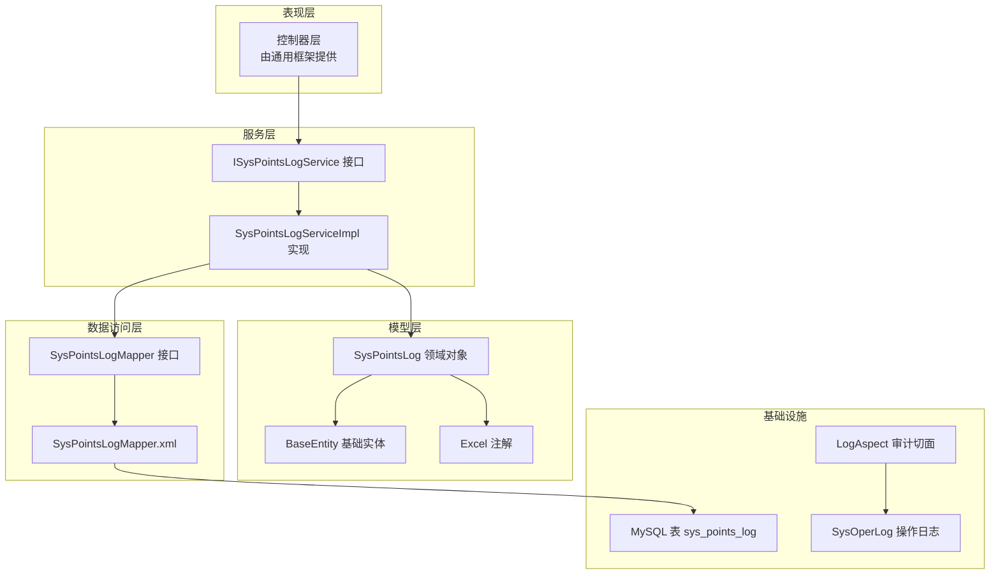
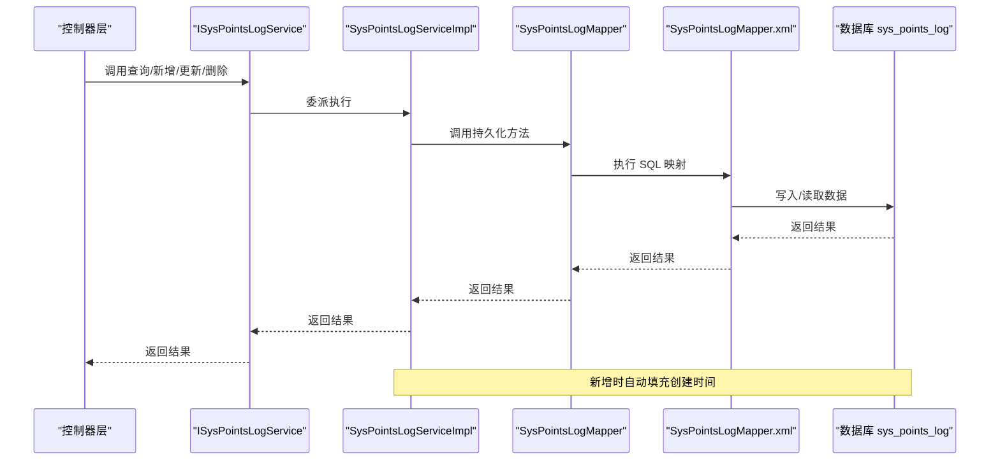
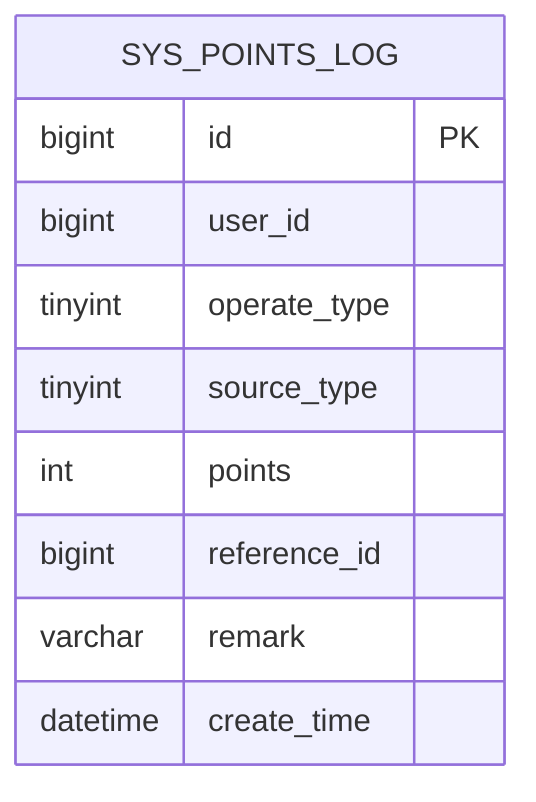
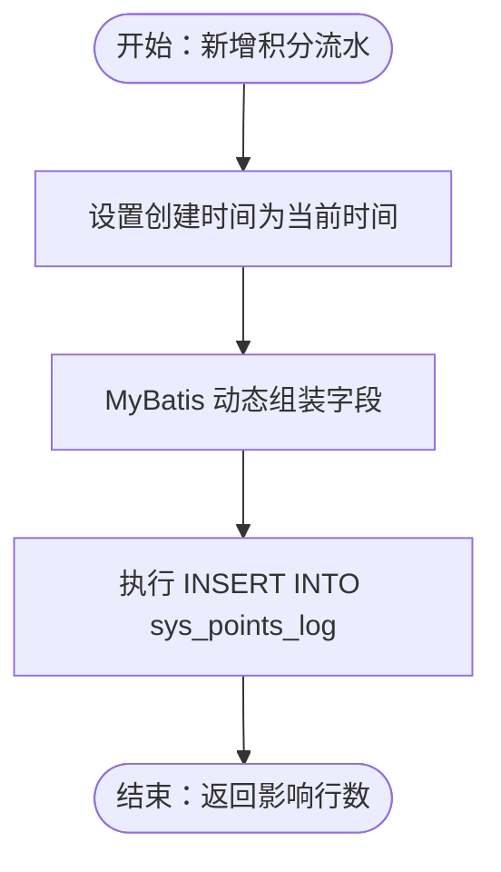
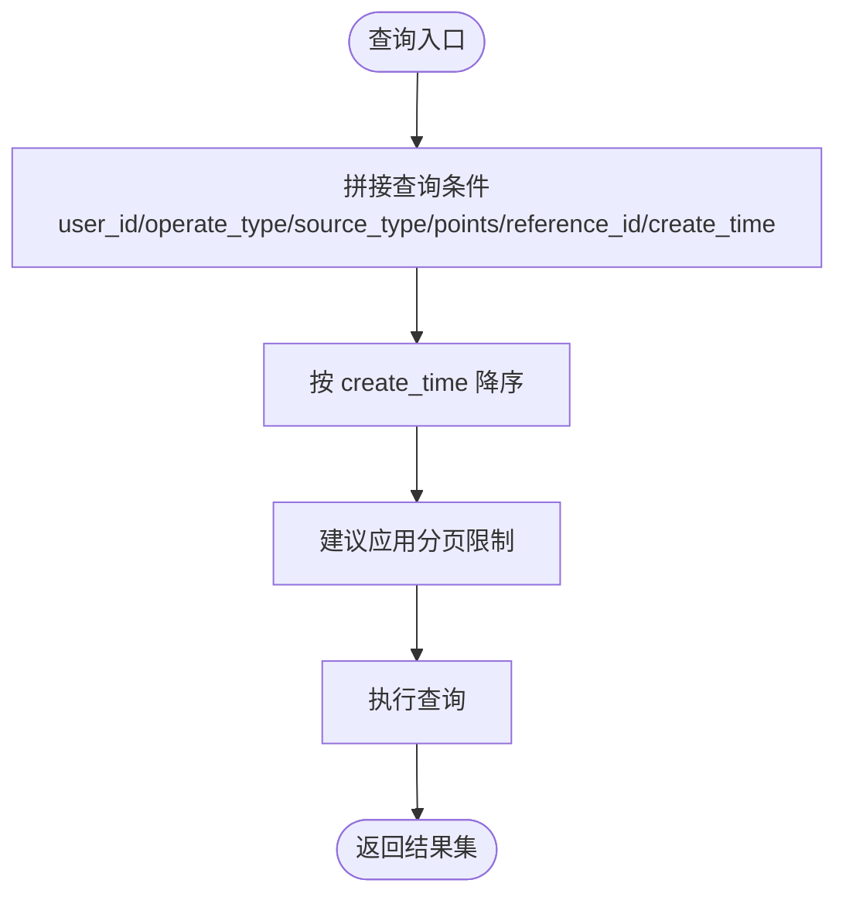
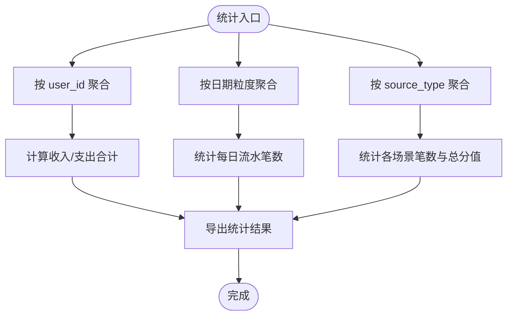
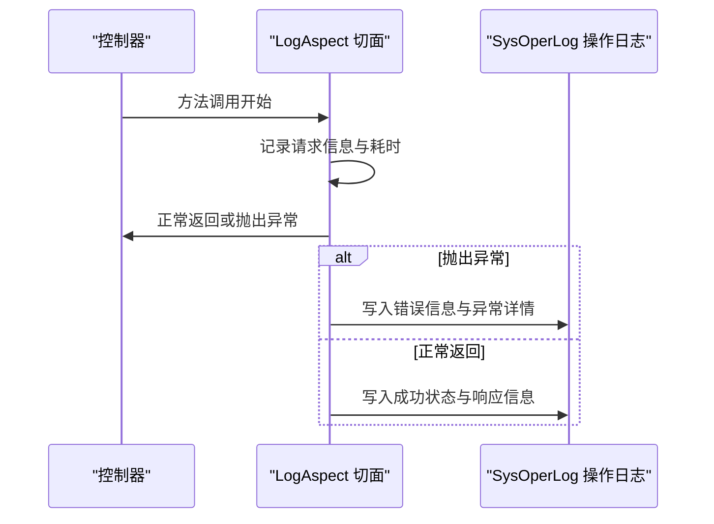
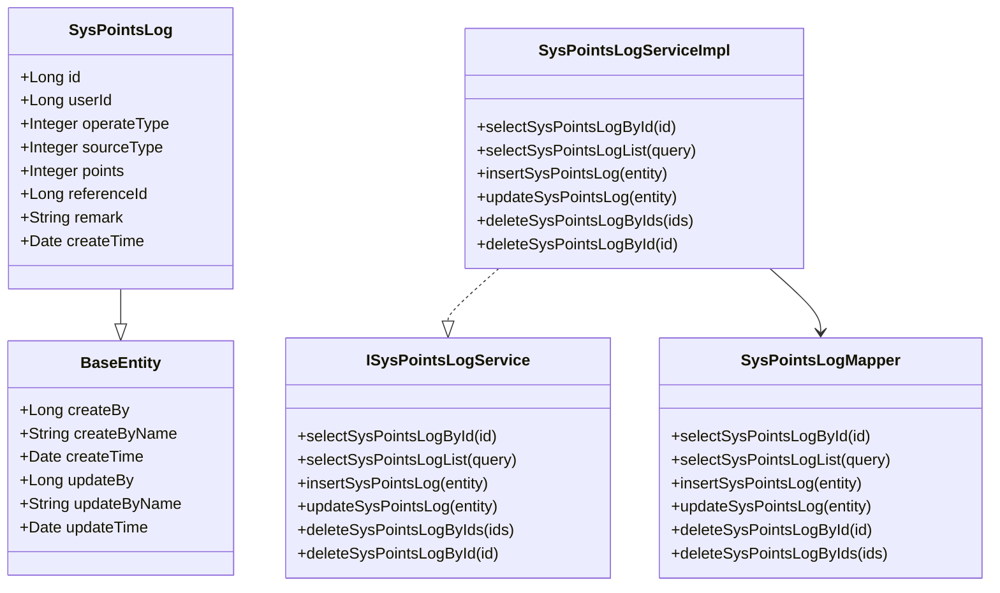

# 积分流水管理

<cite>
**本文引用的文件**
- [points_log.sql](file://XingChen-Vue/sql/points_log.sql)
- [SysPointsLog.java](file://XingChen-Vue/xingchen-system/src/main/java/com/xingchen/system/domain/SysPointsLog.java)
- [SysPointsLogMapper.java](file://XingChen-Vue/xingchen-system/src/main/java/com/xingchen/system/mapper/SysPointsLogMapper.java)
- [SysPointsLogMapper.xml](file://XingChen-Vue/xingchen-system/src/main/resources/mapper/system/SysPointsLogMapper.xml)
- [ISysPointsLogService.java](file://XingChen-Vue/xingchen-system/src/main/java/com/xingchen/system/service/ISysPointsLogService.java)
- [SysPointsLogServiceImpl.java](file://XingChen-Vue/xingchen-system/src/main/java/com/xingchen/system/service/impl/SysPointsLogServiceImpl.java)
- [BaseEntity.java](file://XingChen-Vue/xingchen-common/src/main/java/com/xingchen/common/core/domain/BaseEntity.java)
- [Excel.java](file://XingChen-Vue/xingchen-common/src/main/java/com/xingchen/common/annotation/Excel.java)
- [LogAspect.java](file://XingChen-Vue/xingchen-framework/src/main/java/com/xingchen/framework/aspectj/LogAspect.java)
- [SysOperLog.java](file://XingChen-Vue/xingchen-system/src/main/java/com/xingchen/system/domain/SysOperLog.java)
</cite>

## 目录
1. [简介](#简介)
2. [项目结构](#项目结构)
3. [核心组件](#核心组件)
4. [架构总览](#架构总览)
5. [详细组件分析](#详细组件分析)
6. [依赖关系分析](#依赖关系分析)
7. [性能考虑](#性能考虑)
8. [故障排查指南](#故障排查指南)
9. [结论](#结论)
10. [附录](#附录)

## 简介
本文件系统化梳理“积分流水管理”的数据模型、生成机制、查询与分页、统计分析、导入导出与批量处理、以及审计追踪与异常处理机制。目标是帮助开发者与运维人员快速理解并高效使用该模块。

## 项目结构
围绕积分流水的核心代码采用经典的分层架构：
- 数据模型层：领域对象与注解
- 数据访问层：MyBatis 映射 XML
- 服务层：接口与实现类
- 控制器层：由通用框架提供统一入口（本仓库未直接展示具体控制器，但查询接口已通过服务层暴露）
- 公共工具与注解：Excel 导出、基础实体等
- 审计与异常：全局日志切面与操作日志实体

图表来源
- [SysPointsLogServiceImpl.java:1-95](file://XingChen-Vue/xingchen-system/src/main/java/com/xingchen/system/service/impl/SysPointsLogServiceImpl.java#L1-95)
- [SysPointsLogMapper.java:1-61](file://XingChen-Vue/xingchen-system/src/main/java/com/xingchen/system/mapper/SysPointsLogMapper.java#L1-61)
- [SysPointsLogMapper.xml:1-92](file://XingChen-Vue/xingchen-system/src/main/resources/mapper/system/SysPointsLogMapper.xml#L1-92)
- [SysPointsLog.java:1-105](file://XingChen-Vue/xingchen-system/src/main/java/com/xingchen/system/domain/SysPointsLog.java#L1-105)
- [BaseEntity.java](file://XingChen-Vue/xingchen-common/src/main/java/com/xingchen/common/core/domain/BaseEntity.java)
- [Excel.java](file://XingChen-Vue/xingchen-common/src/main/java/com/xingchen/common/annotation/Excel.java)
- [LogAspect.java:71-165](file://XingChen-Vue/xingchen-framework/src/main/java/com/xingchen/framework/aspectj/LogAspect.java#L71-165)
- [SysOperLog.java](file://XingChen-Vue/xingchen-system/src/main/java/com/xingchen/system/domain/SysOperLog.java)

章节来源
- [SysPointsLog.java:1-105](file://XingChen-Vue/xingchen-system/src/main/java/com/xingchen/system/domain/SysPointsLog.java#L1-105)
- [SysPointsLogMapper.java:1-61](file://XingChen-Vue/xingchen-system/src/main/java/com/xingchen/system/mapper/SysPointsLogMapper.java#L1-61)
- [SysPointsLogMapper.xml:1-92](file://XingChen-Vue/xingchen-system/src/main/resources/mapper/system/SysPointsLogMapper.xml#L1-92)
- [ISysPointsLogService.java:1-61](file://XingChen-Vue/xingchen-system/src/main/java/com/xingchen/system/service/ISysPointsLogService.java#L1-61)
- [SysPointsLogServiceImpl.java:1-95](file://XingChen-Vue/xingchen-system/src/main/java/com/xingchen/system/service/impl/SysPointsLogServiceImpl.java#L1-95)
- [points_log.sql:1-18](file://XingChen-Vue/sql/points_log.sql#L1-18)
- [BaseEntity.java](file://XingChen-Vue/xingchen-common/src/main/java/com/xingchen/common/core/domain/BaseEntity.java)
- [Excel.java](file://XingChen-Vue/xingchen-common/src/main/java/com/xingchen/common/annotation/Excel.java)
- [LogAspect.java:71-165](file://XingChen-Vue/xingchen-framework/src/main/java/com/xingchen/framework/aspectj/LogAspect.java#L71-165)
- [SysOperLog.java](file://XingChen-Vue/xingchen-system/src/main/java/com/xingchen/system/domain/SysOperLog.java)

## 核心组件
- 数据模型：SysPointsLog，封装积分流水的全部字段，并继承基础实体以具备通用审计属性；通过 Excel 注解支持导出。
- 数据访问：SysPointsLogMapper 接口与 MyBatis XML 映射，提供按多维条件查询、插入、更新、删除能力。
- 服务层：ISysPointsLogService 定义对外接口；SysPointsLogServiceImpl 实现新增时自动填充创建时间。
- 基础设施：points_log.sql 定义表结构与索引；LogAspect 提供统一审计埋点；SysOperLog 为操作日志实体。

章节来源
- [SysPointsLog.java:1-105](file://XingChen-Vue/xingchen-system/src/main/java/com/xingchen/system/domain/SysPointsLog.java#L1-105)
- [SysPointsLogMapper.java:1-61](file://XingChen-Vue/xingchen-system/src/main/java/com/xingchen/system/mapper/SysPointsLogMapper.java#L1-61)
- [SysPointsLogMapper.xml:1-92](file://XingChen-Vue/xingchen-system/src/main/resources/mapper/system/SysPointsLogMapper.xml#L1-92)
- [ISysPointsLogService.java:1-61](file://XingChen-Vue/xingchen-system/src/main/java/com/xingchen/system/service/ISysPointsLogService.java#L1-61)
- [SysPointsLogServiceImpl.java:1-95](file://XingChen-Vue/xingchen-system/src/main/java/com/xingchen/system/service/impl/SysPointsLogServiceImpl.java#L1-95)
- [points_log.sql:1-18](file://XingChen-Vue/sql/points_log.sql#L1-18)
- [LogAspect.java:71-165](file://XingChen-Vue/xingchen-framework/src/main/java/com/xingchen/framework/aspectj/LogAspect.java#L71-165)
- [SysOperLog.java](file://XingChen-Vue/xingchen-system/src/main/java/com/xingchen/system/domain/SysOperLog.java)

## 架构总览
下图展示了从控制器到数据库的完整调用链路，以及审计切面如何介入记录操作日志。

图表来源
- [SysPointsLogServiceImpl.java:52-57](file://XingChen-Vue/xingchen-system/src/main/java/com/xingchen/system/service/impl/SysPointsLogServiceImpl.java#L52-57)
- [SysPointsLogMapper.xml:45-65](file://XingChen-Vue/xingchen-system/src/main/resources/mapper/system/SysPointsLogMapper.xml#L45-65)
- [SysPointsLogMapper.java:19-27](file://XingChen-Vue/xingchen-system/src/main/java/com/xingchen/system/mapper/SysPointsLogMapper.java#L19-27)

## 详细组件分析

### 数据模型设计
- 字段定义与含义
  - id：流水唯一标识，自增主键
  - user_id：发生积分变动的员工ID
  - operate_type：操作类型，1=收入（加分），2=支出（扣分）
  - source_type：参与场景，1=每日打卡，2=连续打卡奖励，3=兑换商品消耗，4=HR手动退还积分
  - points：本次波动的分值（绝对值）
  - reference_id：业务关联ID（如打卡记录ID、兑换订单ID）
  - remark：波动说明
  - create_time：发生时间，默认当前时间
- 数据类型与约束
  - 主键与自增：id bigint(20) PK AUTO_INCREMENT
  - 用户与场景：user_id bigint(20)，source_type tinyint(4)
  - 操作类型：operate_type tinyint(4)
  - 分值：points int(11)
  - 关联ID：reference_id bigint(20)（可空）
  - 时间：create_time datetime 默认 CURRENT_TIMESTAMP
  - 索引：idx_user_id(user_id)，idx_reference_id(reference_id)
- 继承与扩展
  - SysPointsLog 继承 BaseEntity，具备通用审计字段（创建人、更新人、创建时间、更新时间等）
  - 使用 Excel 注解标注导出字段，便于导出统计

图表来源
- [points_log.sql:5-17](file://XingChen-Vue/sql/points_log.sql#L5-17)
- [SysPointsLog.java:15-36](file://XingChen-Vue/xingchen-system/src/main/java/com/xingchen/system/domain/SysPointsLog.java#L15-36)
- [BaseEntity.java](file://XingChen-Vue/xingchen-common/src/main/java/com/xingchen/common/core/domain/BaseEntity.java)

章节来源
- [points_log.sql:1-18](file://XingChen-Vue/sql/points_log.sql#L1-18)
- [SysPointsLog.java:1-105](file://XingChen-Vue/xingchen-system/src/main/java/com/xingchen/system/domain/SysPointsLog.java#L1-105)
- [BaseEntity.java](file://XingChen-Vue/xingchen-common/src/main/java/com/xingchen/common/core/domain/BaseEntity.java)
- [Excel.java](file://XingChen-Vue/xingchen-common/src/main/java/com/xingchen/common/annotation/Excel.java)

### 流水记录生成机制
- 新增流程
  - 服务层在插入前设置创建时间为当前时间
  - MyBatis XML 动态组装字段，仅写入非空字段
- 关键路径
  - Service 层：设置创建时间并调用 Mapper 插入
  - Mapper/XML：动态 SQL 插入，返回影响行数

图表来源
- [SysPointsLogServiceImpl.java:52-57](file://XingChen-Vue/xingchen-system/src/main/java/com/xingchen/system/service/impl/SysPointsLogServiceImpl.java#L52-57)
- [SysPointsLogMapper.xml:45-65](file://XingChen-Vue/xingchen-system/src/main/resources/mapper/system/SysPointsLogMapper.xml#L45-65)

章节来源
- [SysPointsLogServiceImpl.java:52-57](file://XingChen-Vue/xingchen-system/src/main/java/com/xingchen/system/service/impl/SysPointsLogServiceImpl.java#L52-57)
- [SysPointsLogMapper.xml:45-65](file://XingChen-Vue/xingchen-system/src/main/resources/mapper/system/SysPointsLogMapper.xml#L45-65)

### 查询接口与分页处理
- 支持的查询条件
  - user_id：员工ID
  - operate_type：操作类型
  - source_type：参与场景
  - points：分值
  - reference_id：业务关联ID
  - create_time：按日期范围过滤（基于 date_format(create_time,'%y%m%d') 的比较）
- 排序规则
  - 按 create_time 降序排列
- 分页建议
  - 建议在控制器或上层封装分页参数（如当前页、每页条数），并在 SQL 中增加 limit offset 或使用 MyBatis 分页插件
  - 当前 XML 已提供排序，可在上层接入分页逻辑

图表来源
- [SysPointsLogMapper.xml:22-38](file://XingChen-Vue/xingchen-system/src/main/resources/mapper/system/SysPointsLogMapper.xml#L22-38)

章节来源
- [SysPointsLogMapper.xml:22-38](file://XingChen-Vue/xingchen-system/src/main/resources/mapper/system/SysPointsLogMapper.xml#L22-38)
- [SysPointsLogMapper.java:21-27](file://XingChen-Vue/xingchen-system/src/main/java/com/xingchen/system/mapper/SysPointsLogMapper.java#L21-27)

### 统计分析功能
- 按用户统计
  - 可通过 group by user_id 聚合统计收入/支出总和与次数
- 按时间统计
  - 基于 create_time 的日期粒度（日/月）进行聚合
- 按场景统计
  - 按 source_type 分组统计各场景的流水笔数与金额（分值）合计
- 建议实现位置
  - 在服务层新增统计接口，或在 XML 中补充对应的聚合查询语句

图表来源
- [SysPointsLogMapper.xml:18-20](file://XingChen-Vue/xingchen-system/src/main/resources/mapper/system/SysPointsLogMapper.xml#L18-20)

章节来源
- [SysPointsLogMapper.xml:18-20](file://XingChen-Vue/xingchen-system/src/main/resources/mapper/system/SysPointsLogMapper.xml#L18-20)

### 导入导出、批量处理与数据迁移
- 导出
  - SysPointsLog 使用 Excel 注解，可直接对接通用导出工具进行导出
- 批量处理
  - Mapper 提供批量删除接口，可用于清理或迁移前的数据整理
- 数据迁移
  - 建议先在新库创建相同结构的表，再通过批量插入或数据库迁移工具进行数据迁移
  - 迁移前后需校验关键字段一致性与索引完整性

章节来源
- [SysPointsLog.java:19-36](file://XingChen-Vue/xingchen-system/src/main/java/com/xingchen/system/domain/SysPointsLog.java#L19-36)
- [SysPointsLogMapper.java:53-59](file://XingChen-Vue/xingchen-system/src/main/java/com/xingchen/system/mapper/SysPointsLogMapper.java#L53-59)
- [points_log.sql:5-17](file://XingChen-Vue/sql/points_log.sql#L5-17)

### 审计追踪与异常处理
- 审计追踪
  - LogAspect 切面拦截控制器方法，记录操作日志（IP、URL、耗时、异常信息等）
  - SysOperLog 为操作日志实体，用于持久化审计信息
- 异常处理
  - 切面在捕获异常后，会将错误信息写入操作日志，便于问题定位
  - 建议在服务层对关键业务异常进行包装与分类处理

图表来源
- [LogAspect.java:88-140](file://XingChen-Vue/xingchen-framework/src/main/java/com/xingchen/framework/aspectj/LogAspect.java#L88-140)
- [SysOperLog.java](file://XingChen-Vue/xingchen-system/src/main/java/com/xingchen/system/domain/SysOperLog.java)

章节来源
- [LogAspect.java:71-165](file://XingChen-Vue/xingchen-framework/src/main/java/com/xingchen/framework/aspectj/LogAspect.java#L71-165)
- [SysOperLog.java](file://XingChen-Vue/xingchen-system/src/main/java/com/xingchen/system/domain/SysOperLog.java)

## 依赖关系分析
- 组件耦合
  - Service 实现依赖 Mapper 接口，保持低耦合高内聚
  - Model 依赖 BaseEntity 与 Excel 注解，增强可复用性与可导出性
- 外部依赖
  - MyBatis XML 映射依赖数据库表结构
  - 审计切面依赖安全上下文与异步任务管理器

图表来源
- [SysPointsLog.java:11-105](file://XingChen-Vue/xingchen-system/src/main/java/com/xingchen/system/domain/SysPointsLog.java#L11-105)
- [BaseEntity.java](file://XingChen-Vue/xingchen-common/src/main/java/com/xingchen/common/core/domain/BaseEntity.java)
- [SysPointsLogMapper.java:11-60](file://XingChen-Vue/xingchen-system/src/main/java/com/xingchen/system/mapper/SysPointsLogMapper.java#L11-60)
- [ISysPointsLogService.java:11-60](file://XingChen-Vue/xingchen-system/src/main/java/com/xingchen/system/service/ISysPointsLogService.java#L11-60)
- [SysPointsLogServiceImpl.java:17-94](file://XingChen-Vue/xingchen-system/src/main/java/com/xingchen/system/service/impl/SysPointsLogServiceImpl.java#L17-94)

章节来源
- [SysPointsLog.java:1-105](file://XingChen-Vue/xingchen-system/src/main/java/com/xingchen/system/domain/SysPointsLog.java#L1-105)
- [SysPointsLogMapper.java:1-61](file://XingChen-Vue/xingchen-system/src/main/java/com/xingchen/system/mapper/SysPointsLogMapper.java#L1-61)
- [ISysPointsLogService.java:1-61](file://XingChen-Vue/xingchen-system/src/main/java/com/xingchen/system/service/ISysPointsLogService.java#L1-61)
- [SysPointsLogServiceImpl.java:1-95](file://XingChen-Vue/xingchen-system/src/main/java/com/xingchen/system/service/impl/SysPointsLogServiceImpl.java#L1-95)

## 性能考虑
- 索引优化
  - 已有 idx_user_id 与 idx_reference_id，建议根据查询热点评估是否增加复合索引（如 user_id+create_time、source_type+create_time）
- 查询优化
  - 对高频条件（如 user_id、source_type、create_time）建立合适索引
  - 控制每次查询的数据量，结合分页策略
- 写入优化
  - 批量插入与更新可减少往返开销（建议在业务侧合并提交）

## 故障排查指南
- 常见问题
  - 新增失败：检查必填字段与默认值（如 create_time 自动填充）
  - 查询无结果：确认查询条件与时间范围是否正确
  - 导出异常：检查 Excel 注解配置与字段映射
- 审计定位
  - 通过 LogAspect 记录的操作日志定位异常请求与耗时
  - 结合 SysOperLog 查看错误详情与堆栈信息

章节来源
- [SysPointsLogServiceImpl.java:52-57](file://XingChen-Vue/xingchen-system/src/main/java/com/xingchen/system/service/impl/SysPointsLogServiceImpl.java#L52-57)
- [LogAspect.java:88-140](file://XingChen-Vue/xingchen-framework/src/main/java/com/xingchen/framework/aspectj/LogAspect.java#L88-140)
- [SysOperLog.java](file://XingChen-Vue/xingchen-system/src/main/java/com/xingchen/system/domain/SysOperLog.java)

## 结论
本模块以清晰的数据模型与标准的分层架构实现了积分流水的全生命周期管理。通过完善的查询条件、可扩展的统计接口、以及统一的审计与异常处理机制，能够满足日常运营与管理需求。建议后续完善分页与复合索引策略，并在服务层补充统计与导出接口以提升可用性。

## 附录
- 表结构定义参考：[points_log.sql:5-17](file://XingChen-Vue/sql/points_log.sql#L5-17)
- 领域对象定义参考：[SysPointsLog.java:15-36](file://XingChen-Vue/xingchen-system/src/main/java/com/xingchen/system/domain/SysPointsLog.java#L15-36)
- 数据访问映射参考：[SysPointsLogMapper.xml:18-38](file://XingChen-Vue/xingchen-system/src/main/resources/mapper/system/SysPointsLogMapper.xml#L18-38)
- 服务接口与实现参考：[ISysPointsLogService.java:13-27](file://XingChen-Vue/xingchen-system/src/main/java/com/xingchen/system/service/ISysPointsLogService.java#L13-27)，[SysPointsLogServiceImpl.java:28-44](file://XingChen-Vue/xingchen-system/src/main/java/com/xingchen/system/service/impl/SysPointsLogServiceImpl.java#L28-44)