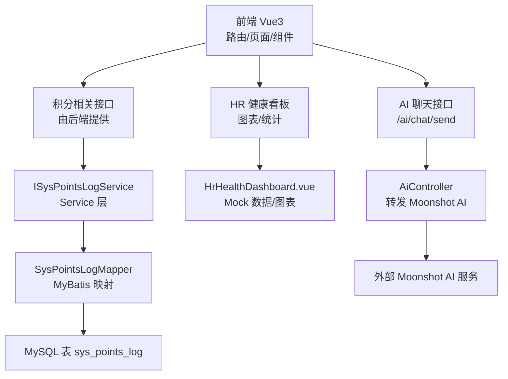
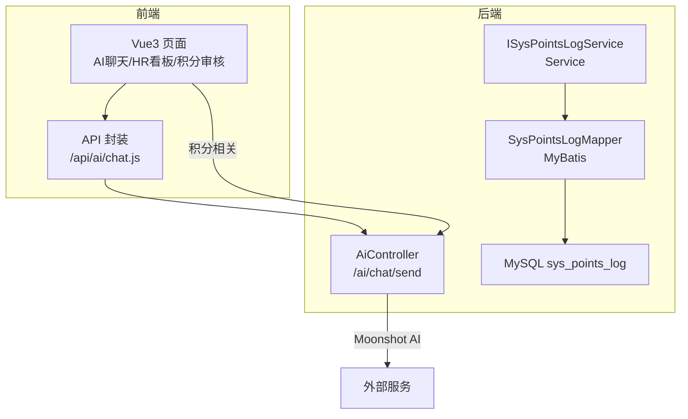
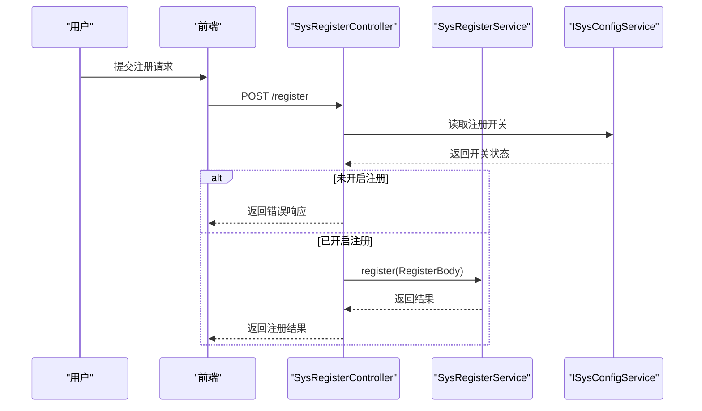
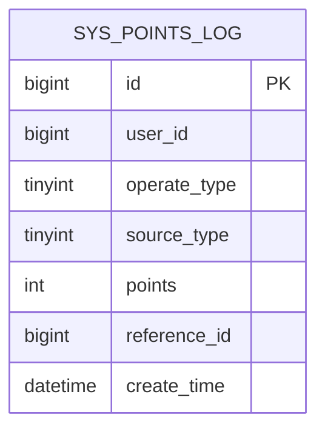
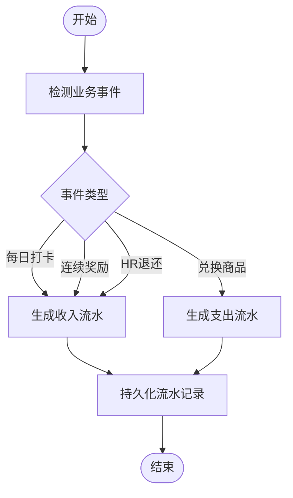
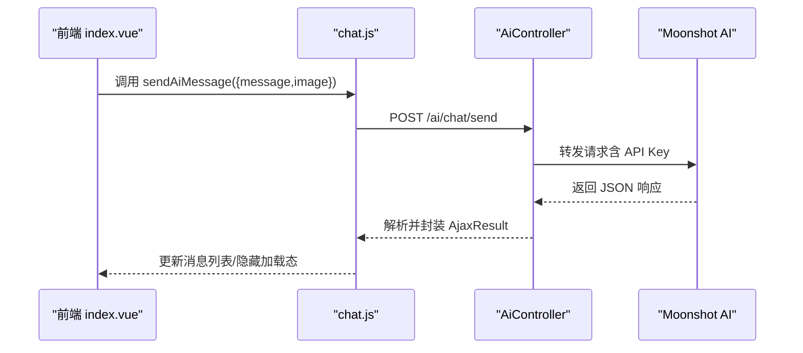
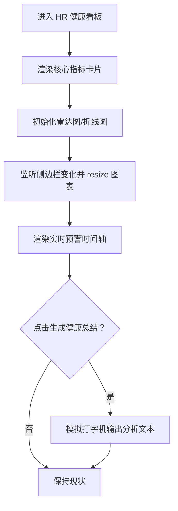
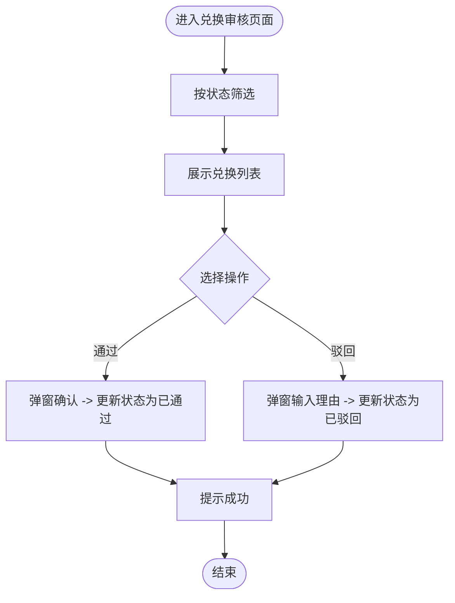
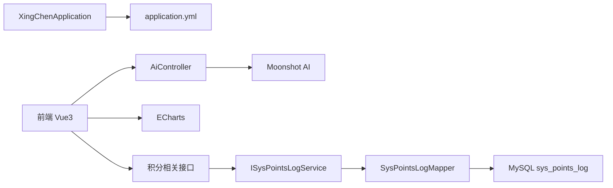

# 核心功能模块

<cite>
**本文引用的文件**   
- [XingChenApplication.java](file://XingChen-Vue/xingchen-admin/src/main/java/com/xingchen/XingChenApplication.java)
- [application.yml](file://XingChen-Vue/xingchen-admin/src/main/resources/application.yml)
- [SysPointsLog.java](file://XingChen-Vue/xingchen-system/src/main/java/com/xingchen/system/domain/SysPointsLog.java)
- [ISysPointsLogService.java](file://XingChen-Vue/xingchen-system/src/main/java/com/xingchen/system/service/ISysPointsLogService.java)
- [SysPointsLogMapper.java](file://XingChen-Vue/xingchen-system/src/main/java/com/xingchen/system/mapper/SysPointsLogMapper.java)
- [points_log.sql](file://XingChen-Vue/sql/points_log.sql)
- [AiController.java](file://XingChen-Vue/xingchen-admin/src/main/java/com/xingchen/web/controller/al/AiController.java)
- [chat.js](file://XingChen-Vue3/src/api/ai/chat.js)
- [index.vue（AI聊天）](file://XingChen-Vue3/src/views/ai/chat/index.vue)
- [HrHealthDashboard.vue](file://XingChen-Vue3/src/views/hr/HrHealthDashboard.vue)
- [RedemptionAudit.vue](file://XingChen-Vue3/src/views/hr/RedemptionAudit.vue)
- [dashboard.vue（适配）](file://XingChen-Vue3/src/views/hr/dashboard.vue)
- [UserConstants.java](file://XingChen-Vue/xingchen-common/src/main/java/com/xingchen/common/constant/UserConstants.java)
- [SysRegisterController.java](file://XingChen-Vue/xingchen-admin/src/main/java/com/xingchen/web/controller/system/SysRegisterController.java)
- [CacheController.java](file://XingChen-Vue/xingchen-admin/src/main/java/com/xingchen/web/controller/monitor/CacheController.java)
- [ServerController.java](file://XingChen-Vue/xingchen-admin/src/main/java/com/xingchen/web/controller/monitor/ServerController.java)
</cite>

## 目录
1. [简介](#简介)
2. [项目结构](#项目结构)
3. [核心组件](#核心组件)
4. [架构总览](#架构总览)
5. [详细组件分析](#详细组件分析)
6. [依赖分析](#依赖分析)
7. [性能考虑](#性能考虑)
8. [故障排查指南](#故障排查指南)
9. [结论](#结论)
10. [附录](#附录)

## 简介
本文件面向“健康管理”系统的核心功能模块，围绕以下目标展开：用户管理系统、健康积分系统、AI健康助手、HR健康监控。文档从设计理念、实现原理、业务流程、数据流转、角色权限、依赖关系、关键算法与扩展建议等方面进行系统化梳理，帮助开发者快速理解与集成。

## 项目结构
系统采用前后端分离架构：
- 后端基于 Spring Boot，模块化组织于 xingchen-admin、xingchen-system、xingchen-common、xingchen-framework、xingchen-quartz 等子工程。
- 前端提供两套实现：XingChen-Vue（Vue2）与 XingChen-Vue3（Vue3）。其中 Vue3 作为主力版本，包含 HR 看板、AI 聊天、积分兑换审核等页面。
- 数据库存储以 MySQL 为主，积分流水表为健康积分系统的核心数据载体。

**图表来源**
- [AiController.java:23-164](file://XingChen-Vue/xingchen-admin/src/main/java/com/xingchen/web/controller/al/AiController.java#L23-L164)
- [chat.js:1-11](file://XingChen-Vue3/src/api/ai/chat.js#L1-L11)
- [index.vue（AI聊天）:108-228](file://XingChen-Vue3/src/views/ai/chat/index.vue#L108-L228)
- [HrHealthDashboard.vue:1-481](file://XingChen-Vue3/src/views/hr/HrHealthDashboard.vue#L1-L481)
- [ISysPointsLogService.java:1-61](file://XingChen-Vue/xingchen-system/src/main/java/com/xingchen/system/service/ISysPointsLogService.java#L1-L61)
- [SysPointsLogMapper.java:1-61](file://XingChen-Vue/xingchen-system/src/main/java/com/xingchen/system/mapper/SysPointsLogMapper.java#L1-L61)
- [points_log.sql:1-18](file://XingChen-Vue/sql/points_log.sql#L1-L18)

**章节来源**
- [XingChenApplication.java:1-31](file://XingChen-Vue/xingchen-admin/src/main/java/com/xingchen/XingChenApplication.java#L1-L31)
- [application.yml:1-148](file://XingChen-Vue/xingchen-admin/src/main/resources/application.yml#L1-L148)

## 核心组件
- 用户管理系统：负责用户注册、登录态管理、权限控制与国际化等基础能力。注册接口受配置开关控制；权限校验通过安全框架与注解实现。
- 健康积分系统：以 SysPointsLog 为核心实体，记录积分的收入/支出、来源场景、业务关联等，支撑打卡、奖励、兑换、HR退还等业务。
- AI健康助手：前端通过 /ai/chat/send 调用后端 AiController，后端对接 Moonshot AI 完成多模态问答与图片分析。
- HR健康监控：HR 健康看板提供核心指标卡片、雷达图、折线图与实时预警动态，支持 AI 健康分析总结的模拟生成。

**章节来源**
- [SysPointsLog.java:1-105](file://XingChen-Vue/xingchen-system/src/main/java/com/xingchen/system/domain/SysPointsLog.java#L1-L105)
- [ISysPointsLogService.java:1-61](file://XingChen-Vue/xingchen-system/src/main/java/com/xingchen/system/service/ISysPointsLogService.java#L1-L61)
- [SysPointsLogMapper.java:1-61](file://XingChen-Vue/xingchen-system/src/main/java/com/xingchen/system/mapper/SysPointsLogMapper.java#L1-L61)
- [points_log.sql:1-18](file://XingChen-Vue/sql/points_log.sql#L1-L18)
- [AiController.java:23-164](file://XingChen-Vue/xingchen-admin/src/main/java/com/xingchen/web/controller/al/AiController.java#L23-L164)
- [chat.js:1-11](file://XingChen-Vue3/src/api/ai/chat.js#L1-L11)
- [index.vue（AI聊天）:108-228](file://XingChen-Vue3/src/views/ai/chat/index.vue#L108-L228)
- [HrHealthDashboard.vue:1-481](file://XingChen-Vue3/src/views/hr/HrHealthDashboard.vue#L1-L481)
- [UserConstants.java:1-82](file://XingChen-Vue/xingchen-common/src/main/java/com/xingchen/common/constant/UserConstants.java#L1-L82)
- [SysRegisterController.java:1-38](file://XingChen-Vue/xingchen-admin/src/main/java/com/xingchen/web/controller/system/SysRegisterController.java#L1-L38)

## 架构总览
系统采用“前端路由 + 统一后端接口 + 数据持久化”的分层架构。前端通过 Axios 封装的 request 发起 REST 请求，后端控制器统一处理业务并调用服务层，服务层通过 MyBatis 访问数据库。

**图表来源**
- [AiController.java:23-164](file://XingChen-Vue/xingchen-admin/src/main/java/com/xingchen/web/controller/al/AiController.java#L23-L164)
- [chat.js:1-11](file://XingChen-Vue3/src/api/ai/chat.js#L1-L11)
- [ISysPointsLogService.java:1-61](file://XingChen-Vue/xingchen-system/src/main/java/com/xingchen/system/service/ISysPointsLogService.java#L1-L61)
- [SysPointsLogMapper.java:1-61](file://XingChen-Vue/xingchen-system/src/main/java/com/xingchen/system/mapper/SysPointsLogMapper.java#L1-L61)
- [points_log.sql:1-18](file://XingChen-Vue/sql/points_log.sql#L1-L18)

## 详细组件分析

### 用户管理系统
- 设计理念：以安全与易用为核心，提供注册开关、密码策略、国际化与权限注解控制。
- 关键点：
  - 注册接口受配置项控制，未开启则直接返回错误。
  - 权限注解用于接口级访问控制，结合 Token 与安全上下文实现。
  - 常量集中管理用户名/密码长度、状态枚举等。
- 使用场景：新用户注册、登录态维护、角色权限校验。

**图表来源**
- [SysRegisterController.java:28-37](file://XingChen-Vue/xingchen-admin/src/main/java/com/xingchen/web/controller/system/SysRegisterController.java#L28-L37)
- [UserConstants.java:72-81](file://XingChen-Vue/xingchen-common/src/main/java/com/xingchen/common/constant/UserConstants.java#L72-L81)

**章节来源**
- [SysRegisterController.java:1-38](file://XingChen-Vue/xingchen-admin/src/main/java/com/xingchen/web/controller/system/SysRegisterController.java#L1-L38)
- [UserConstants.java:1-82](file://XingChen-Vue/xingchen-common/src/main/java/com/xingchen/common/constant/UserConstants.java#L1-L82)

### 健康积分系统
- 设计理念：以 SysPointsLog 为数据核心，记录积分变动的来源、类型、数值与业务关联，支持多场景积分核算。
- 数据模型与字段：
  - 主键、用户ID、操作类型（收入/支出）、来源类型（打卡/奖励/兑换/HR退还）、波动分值、业务关联ID、创建时间等。
- 业务流程：
  - 打卡/奖励：产生收入流水；兑换商品：产生支出流水；HR手动退还：产生收入流水。
  - 支持按用户/来源/时间范围查询与统计。
- 关键算法与复杂度：
  - 查询：按用户ID与业务关联ID建立索引，典型查询为 O(log N) + 结果集扫描。
  - 统计：按来源类型聚合，时间复杂度 O(N) 遍历。
- 扩展建议：引入积分余额缓存、批量写入优化、异步记账与对账任务。

**图表来源**
- [points_log.sql:4-17](file://XingChen-Vue/sql/points_log.sql#L4-L17)

**图表来源**
- [SysPointsLog.java:15-36](file://XingChen-Vue/xingchen-system/src/main/java/com/xingchen/system/domain/SysPointsLog.java#L15-L36)
- [ISysPointsLogService.java:11-60](file://XingChen-Vue/xingchen-system/src/main/java/com/xingchen/system/service/ISysPointsLogService.java#L11-L60)
- [SysPointsLogMapper.java:11-60](file://XingChen-Vue/xingchen-system/src/main/java/com/xingchen/system/mapper/SysPointsLogMapper.java#L11-L60)

**章节来源**
- [SysPointsLog.java:1-105](file://XingChen-Vue/xingchen-system/src/main/java/com/xingchen/system/domain/SysPointsLog.java#L1-L105)
- [ISysPointsLogService.java:1-61](file://XingChen-Vue/xingchen-system/src/main/java/com/xingchen/system/service/ISysPointsLogService.java#L1-L61)
- [SysPointsLogMapper.java:1-61](file://XingChen-Vue/xingchen-system/src/main/java/com/xingchen/system/mapper/SysPointsLogMapper.java#L1-L61)
- [points_log.sql:1-18](file://XingChen-Vue/sql/points_log.sql#L1-L18)

### AI健康助手
- 设计理念：提供多模态问答与图片分析能力，前端负责交互与展示，后端负责与外部 AI 服务通信。
- 前端交互：
  - 支持文本与图片上传，Base64 预览与移除；Enter 发送、Shift+Enter 换行；自动滚动至底部；加载态与错误提示。
- 后端对接：
  - AiController 接收 message 与 image（可选），构造 Moonshot AI 请求体，转发请求并解析响应。
  - 错误处理：网络异常、AI 返回错误、JSON 解析失败均进行兜底提示。
- 使用场景：健康咨询、图文分析、辅助诊断建议。

**图表来源**
- [index.vue（AI聊天）:108-228](file://XingChen-Vue3/src/views/ai/chat/index.vue#L108-L228)
- [chat.js:1-11](file://XingChen-Vue3/src/api/ai/chat.js#L1-L11)
- [AiController.java:23-164](file://XingChen-Vue/xingchen-admin/src/main/java/com/xingchen/web/controller/al/AiController.java#L23-L164)

**章节来源**
- [index.vue（AI聊天）:1-527](file://XingChen-Vue3/src/views/ai/chat/index.vue#L1-L527)
- [chat.js:1-11](file://XingChen-Vue3/src/api/ai/chat.js#L1-L11)
- [AiController.java:1-164](file://XingChen-Vue/xingchen-admin/src/main/java/com/xingchen/web/controller/al/AiController.java#L1-L164)

### HR健康监控
- 设计理念：以数据可视化与实时预警为核心，帮助 HR 快速掌握公司健康态势。
- 功能特性：
  - 核心指标卡片：AI 健康分析总结、异常预警部门数、高压预警人数、打卡人数。
  - 图表分析：部门健康画像（雷达图）、全公司压力趋势（折线图）。
  - 实时预警：时间轴展示健康异常动态。
- Mock 机制：AI 总结支持“生成健康总结”按钮，模拟打字机效果输出分析文本；图表初始化与窗口尺寸变化处理。
- 使用场景：HR 日常监控、健康干预决策、活动策划依据。

**图表来源**
- [HrHealthDashboard.vue:132-365](file://XingChen-Vue3/src/views/hr/HrHealthDashboard.vue#L132-L365)

**章节来源**
- [HrHealthDashboard.vue:1-481](file://XingChen-Vue3/src/views/hr/HrHealthDashboard.vue#L1-L481)
- [dashboard.vue（适配）:1-20](file://XingChen-Vue3/src/views/hr/dashboard.vue#L1-L20)

### 积分兑换审核（HR）
- 设计理念：提供积分兑换申请的审核流程，支持状态筛选、通过/驳回操作与原因记录。
- 功能特性：
  - 状态筛选：全部/待审核/已通过/已驳回。
  - 操作按钮：通过、驳回（弹出输入框填写理由）。
  - 模拟数据：便于前端联调与演示。
- 使用场景：HR 对员工兑换申请进行人工审核，保障积分使用的合规性与透明度。

**图表来源**
- [RedemptionAudit.vue:89-229](file://XingChen-Vue3/src/views/hr/RedemptionAudit.vue#L89-L229)

**章节来源**
- [RedemptionAudit.vue:1-250](file://XingChen-Vue3/src/views/hr/RedemptionAudit.vue#L1-L250)

## 依赖分析
- 后端启动与配置：XingChenApplication 作为启动类，application.yml 提供服务端口、日志、Redis、MyBatis、分页等配置。
- 前后端通信：前端通过封装的 request 发起 REST 请求，后端控制器统一处理。
- 外部依赖：AiController 依赖 Moonshot AI 的 API Key 与接口；HR 看板使用 ECharts 进行可视化；注册接口依赖配置中心的开关。

**图表来源**
- [XingChenApplication.java:12-18](file://XingChen-Vue/xingchen-admin/src/main/java/com/xingchen/XingChenApplication.java#L12-L18)
- [application.yml:1-148](file://XingChen-Vue/xingchen-admin/src/main/resources/application.yml#L1-L148)
- [AiController.java:27-29](file://XingChen-Vue/xingchen-admin/src/main/java/com/xingchen/web/controller/al/AiController.java#L27-L29)
- [HrHealthDashboard.vue:134-135](file://XingChen-Vue3/src/views/hr/HrHealthDashboard.vue#L134-L135)
- [ISysPointsLogService.java:1-61](file://XingChen-Vue/xingchen-system/src/main/java/com/xingchen/system/service/ISysPointsLogService.java#L1-L61)
- [SysPointsLogMapper.java:1-61](file://XingChen-Vue/xingchen-system/src/main/java/com/xingchen/system/mapper/SysPointsLogMapper.java#L1-L61)
- [points_log.sql:1-18](file://XingChen-Vue/sql/points_log.sql#L1-L18)

**章节来源**
- [XingChenApplication.java:1-31](file://XingChen-Vue/xingchen-admin/src/main/java/com/xingchen/XingChenApplication.java#L1-L31)
- [application.yml:1-148](file://XingChen-Vue/xingchen-admin/src/main/resources/application.yml#L1-L148)

## 性能考虑
- 前端性能
  - 图表渲染：在窗口 resize 时及时调用 ECharts resize，避免布局错乱。
  - 消息滚动：监听消息与加载状态变化，自动滚动至底部，提升交互体验。
- 后端性能
  - AI 调用：外部 API 存在延迟与限流风险，建议引入超时控制、重试与熔断策略。
  - 数据库：为 user_id 与 reference_id 建立索引，减少查询成本；对高频统计场景可引入物化视图或缓存。
- 配置优化
  - Redis 连接池参数、Tomcat 线程池、Jackson 时区与日期格式等已在 application.yml 中集中配置。

[本节为通用建议，不直接分析具体文件]

## 故障排查指南
- AI 聊天无法回复
  - 检查前端请求是否正确调用 /ai/chat/send；确认后端 AiController 的 API Key 与 Moonshot 地址配置。
  - 查看后端日志与异常捕获，关注网络异常、JSON 解析失败与 AI 返回错误。
- 积分流水查询异常
  - 核对 SysPointsLogMapper 的 SQL 与 points_log.sql 的表结构一致性；检查索引是否存在。
  - 在高频查询场景下，评估是否需要添加复合索引或缓存热点数据。
- HR 看板图表不显示
  - 确认 ECharts 初始化与 resize 调用；检查侧边栏切换后的延时处理。
- 注册功能无效
  - 确认配置项 sys.account.registerUser 的值；检查 SysRegisterController 的返回逻辑。

**章节来源**
- [AiController.java:139-163](file://XingChen-Vue/xingchen-admin/src/main/java/com/xingchen/web/controller/al/AiController.java#L139-L163)
- [SysPointsLogMapper.java:19-27](file://XingChen-Vue/xingchen-system/src/main/java/com/xingchen/system/mapper/SysPointsLogMapper.java#L19-L27)
- [points_log.sql:14-17](file://XingChen-Vue/sql/points_log.sql#L14-L17)
- [HrHealthDashboard.vue:342-364](file://XingChen-Vue3/src/views/hr/HrHealthDashboard.vue#L342-L364)
- [SysRegisterController.java:31-36](file://XingChen-Vue/xingchen-admin/src/main/java/com/xingchen/web/controller/system/SysRegisterController.java#L31-L36)

## 结论
本系统以清晰的模块划分与稳定的前后端交互为基础，覆盖用户管理、健康积分、AI 助手与 HR 监控四大核心能力。通过合理的数据模型、可视化与外部 AI 能力集成，能够有效支撑企业健康管理体系的落地。建议后续在性能、可观测性与扩展性方面持续优化，以满足更大规模的业务需求。

[本节为总结性内容，不直接分析具体文件]

## 附录
- 角色与权限
  - 用户：普通员工，可使用 AI 助手与健康看板（部分功能）。
  - HR：具备健康看板、积分兑换审核等管理权限。
  - 常量与策略：用户名/密码长度、状态枚举等集中管理，便于统一治理。
- 配置要点
  - 服务端口、Redis、MyBatis、分页、Swagger 等已在 application.yml 中集中配置。
- 监控与运维
  - 提供缓存监控与服务器监控接口，便于运维观测系统运行状态。

**章节来源**
- [UserConstants.java:72-81](file://XingChen-Vue/xingchen-common/src/main/java/com/xingchen/common/constant/UserConstants.java#L72-L81)
- [application.yml:1-148](file://XingChen-Vue/xingchen-admin/src/main/resources/application.yml#L1-L148)
- [CacheController.java:30-39](file://XingChen-Vue/xingchen-admin/src/main/java/com/xingchen/web/controller/monitor/CacheController.java#L30-L39)
- [ServerController.java:15-27](file://XingChen-Vue/xingchen-admin/src/main/java/com/xingchen/web/controller/monitor/ServerController.java#L15-L27)