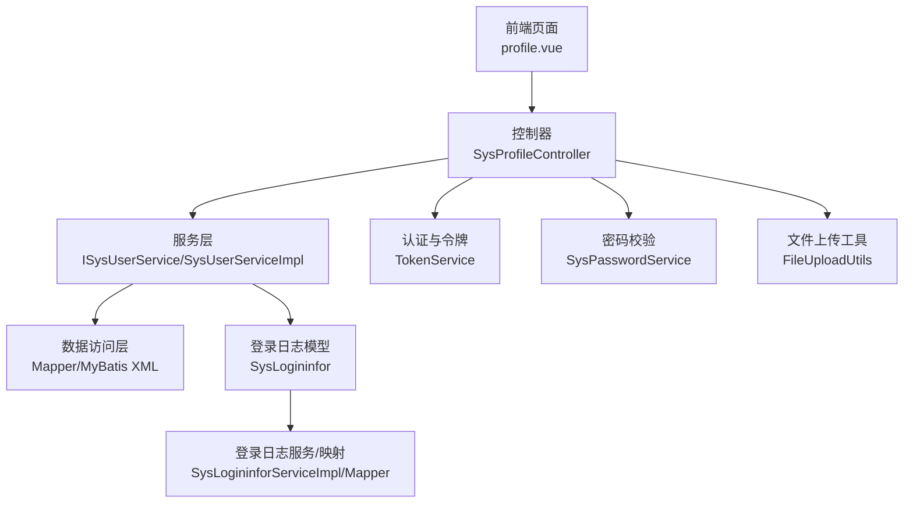
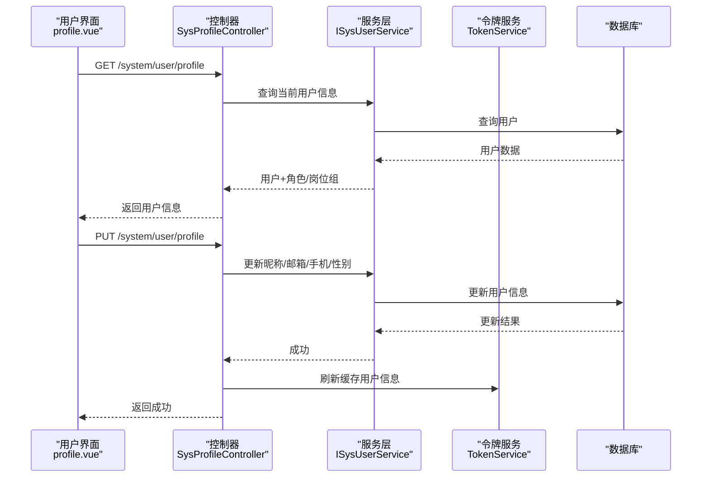
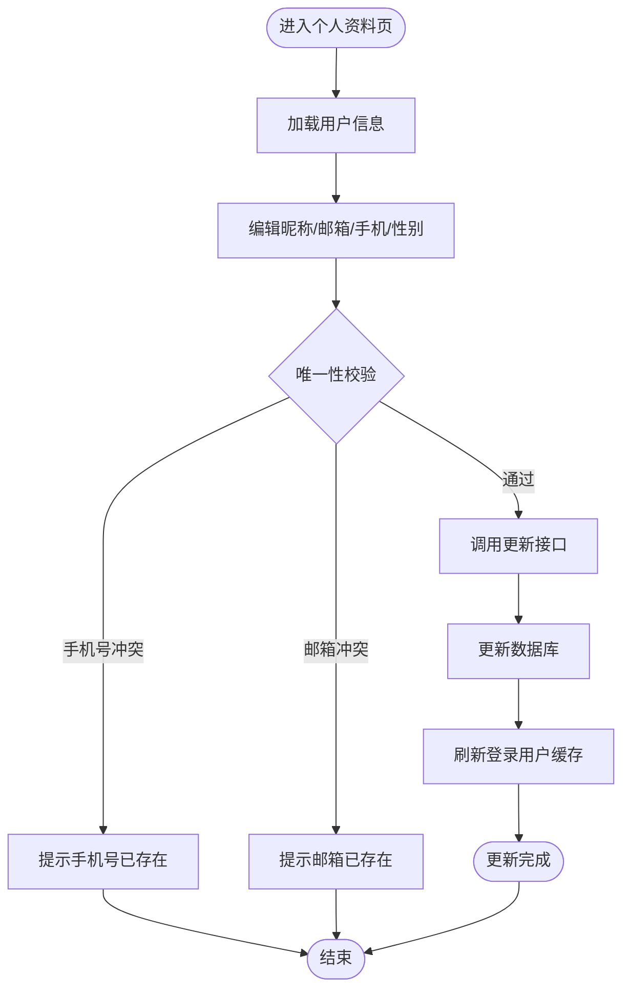
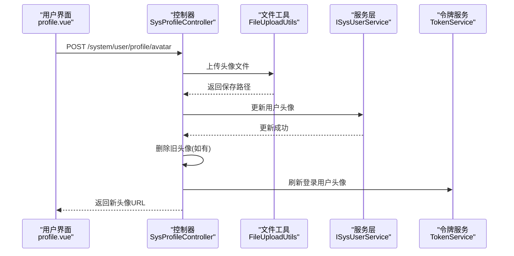
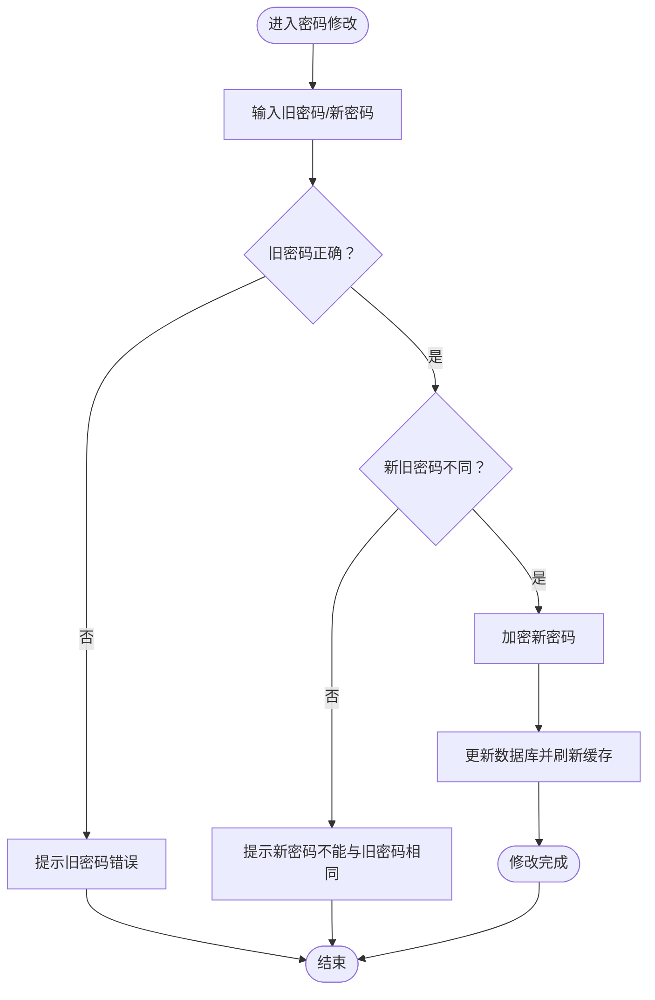
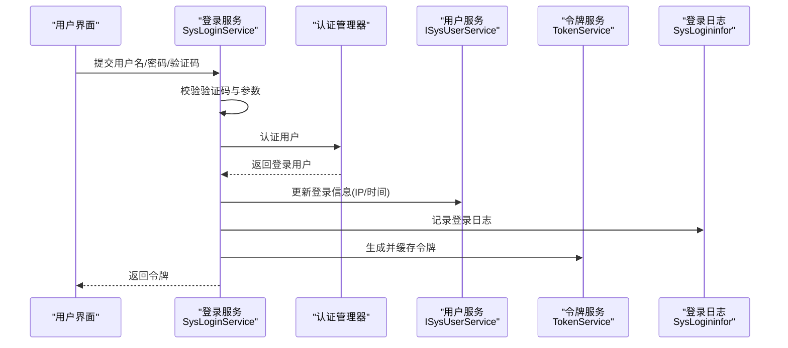
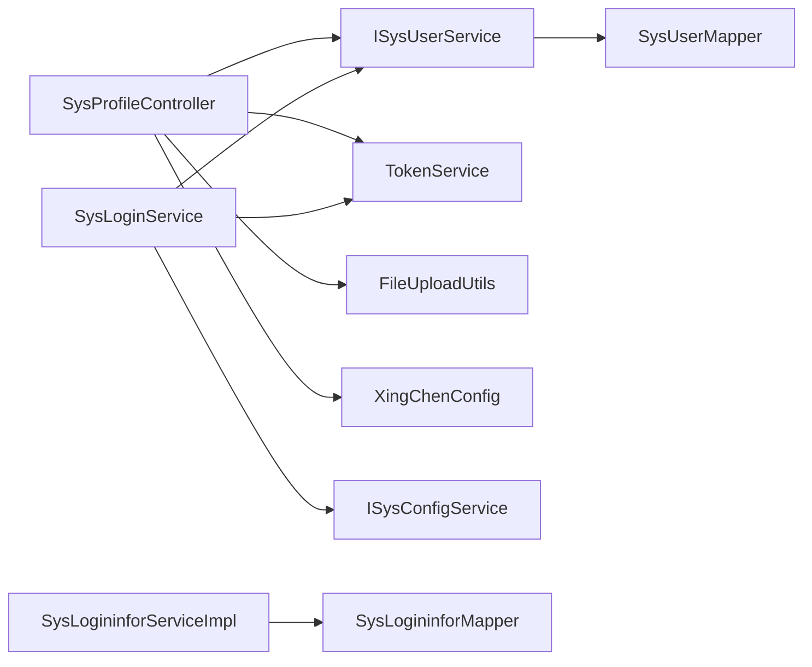

# 用户信息管理

<cite>
**本文引用的文件**
- [SysProfileController.java](file://XingChen-Vue/xingchen-admin/src/main/java/com/xingchen/web/controller/system/SysProfileController.java)
- [SysPasswordService.java](file://XingChen-Vue/xingchen-framework/src/main/java/com/xingchen/framework/web/service/SysPasswordService.java)
- [SysLoginService.java](file://XingChen-Vue/xingchen-framework/src/main/java/com/xingchen/framework/web/service/SysLoginService.java)
- [SysUser.java](file://XingChen-Vue/xingchen-common/src/main/java/com/xingchen/common/core/domain/entity/SysUser.java)
- [ISysUserService.java](file://XingChen-Vue/xingchen-system/src/main/java/com/xingchen/system/service/ISysUserService.java)
- [SysUserServiceImpl.java](file://XingChen-Vue/xingchen-system/src/main/java/com/xingchen/system/service/impl/SysUserServiceImpl.java)
- [FileUploadUtils.java](file://XingChen-Vue/xingchen-common/src/main/java/com/xingchen/common/utils/file/FileUploadUtils.java)
- [XingChenConfig.java](file://XingChen-Vue/xingchen-common/src/main/java/com/xingchen/common/config/XingChenConfig.java)
- [TokenService.java](file://XingChen-Vue/xingchen-framework/src/main/java/com/xingchen/framework/web/service/TokenService.java)
- [SysLogininfor.java](file://XingChen-Vue/xingchen-system/src/main/java/com/xingchen/system/domain/SysLogininfor.java)
- [SysLogininforServiceImpl.java](file://XingChen-Vue/xingchen-system/src/main/java/com/xingchen/system/service/impl/SysLogininforServiceImpl.java)
- [SysLogininforController.java](file://XingChen-Vue/xingchen-admin/src/main/java/com/xingchen/web/controller/monitor/SysLogininforController.java)
- [SysLogininforMapper.java](file://XingChen-Vue/xingchen-system/src/main/java/com/xingchen/system/mapper/SysLogininforMapper.java)
- [SysLogininforMapper.xml](file://XingChen-Vue/xingchen-system/src/main/resources/mapper/system/SysLogininforMapper.xml)
- [profile.vue](file://XingChen-Vue/xingchen-ui-user/src/views/profile.vue)
- [profile.vue](file://XingChen-Vue3/xingchen-ui-user/src/views/profile.vue)
</cite>

## 目录
1. [简介](#简介)
2. [项目结构](#项目结构)
3. [核心组件](#核心组件)
4. [架构总览](#架构总览)
5. [详细组件分析](#详细组件分析)
6. [依赖关系分析](#依赖关系分析)
7. [性能考量](#性能考量)
8. [故障排查指南](#故障排查指南)
9. [结论](#结论)
10. [附录](#附录)

## 简介
本文件围绕“用户信息管理”主题，系统化梳理健康管理系统中用户基本信息维护、头像上传管理、密码重置机制、登录信息更新等核心功能。文档重点阐述用户数据更新流程、文件上传处理、密码加密存储与登录日志记录，并提供流程图、数据更新策略、文件存储方案与安全防护建议，帮助开发者与运维人员快速理解与优化用户信息管理模块。

## 项目结构
用户信息管理涉及前后端协同：前端负责用户资料展示与编辑、头像上传与密码修改；后端提供REST接口、业务服务、数据持久化与安全控制。整体采用分层架构，控制器层接收请求，服务层执行业务逻辑，数据访问层完成数据库交互，通用工具与配置提供支撑。

图表来源
- [SysProfileController.java:1-150](file://XingChen-Vue/xingchen-admin/src/main/java/com/xingchen/web/controller/system/SysProfileController.java#L1-L150)
- [ISysUserService.java:1-218](file://XingChen-Vue/xingchen-system/src/main/java/com/xingchen/system/service/ISysUserService.java#L1-L218)
- [SysUserServiceImpl.java:1-200](file://XingChen-Vue/xingchen-system/src/main/java/com/xingchen/system/service/impl/SysUserServiceImpl.java#L1-L200)
- [SysLogininfor.java:1-145](file://XingChen-Vue/xingchen-system/src/main/java/com/xingchen/system/domain/SysLogininfor.java#L1-L145)
- [SysLogininforServiceImpl.java:1-65](file://XingChen-Vue/xingchen-system/src/main/java/com/xingchen/system/service/impl/SysLogininforServiceImpl.java#L1-L65)
- [SysLogininforMapper.java:1-42](file://XingChen-Vue/xingchen-system/src/main/java/com/xingchen/system/mapper/SysLogininforMapper.java#L1-L42)
- [SysLogininforMapper.xml:1-57](file://XingChen-Vue/xingchen-system/src/main/resources/mapper/system/SysLogininforMapper.xml#L1-L57)

章节来源
- [SysProfileController.java:1-150](file://XingChen-Vue/xingchen-admin/src/main/java/com/xingchen/web/controller/system/SysProfileController.java#L1-L150)
- [profile.vue:103-154](file://XingChen-Vue/xingchen-ui-user/src/views/profile.vue#L103-L154)
- [profile.vue:83-140](file://XingChen-Vue3/xingchen-ui-user/src/views/profile.vue#L83-L140)

## 核心组件
- 控制器层：SysProfileController 提供个人信息查询、更新、密码重置与头像上传接口。
- 服务层：ISysUserService 定义用户业务契约，SysUserServiceImpl 实现用户信息维护、唯一性校验、登录信息更新与密码重置。
- 数据模型：SysUser 描述用户实体字段，包括昵称、邮箱、手机号、性别、头像、密码与登录信息等。
- 安全与认证：TokenService 管理JWT令牌与登录用户缓存；SysPasswordService 负责登录密码校验与错误次数限制；SysLoginService 负责登录校验、验证码校验与登录信息记录。
- 文件上传：FileUploadUtils 统一处理文件上传、大小与扩展名校验、路径生成与命名策略；XingChenConfig 提供上传路径配置。
- 登录日志：SysLogininfor 记录登录行为，SysLogininforServiceImpl/Mapper/Controller 提供新增、查询、导出与清理能力。

章节来源
- [SysProfileController.java:47-148](file://XingChen-Vue/xingchen-admin/src/main/java/com/xingchen/web/controller/system/SysProfileController.java#L47-L148)
- [ISysUserService.java:148-190](file://XingChen-Vue/xingchen-system/src/main/java/com/xingchen/system/service/ISysUserService.java#L148-L190)
- [SysUser.java:22-337](file://XingChen-Vue/xingchen-common/src/main/java/com/xingchen/common/core/domain/entity/SysUser.java#L22-L337)
- [TokenService.java:62-155](file://XingChen-Vue/xingchen-framework/src/main/java/com/xingchen/framework/web/service/TokenService.java#L62-L155)
- [SysPasswordService.java:44-86](file://XingChen-Vue/xingchen-framework/src/main/java/com/xingchen/framework/web/service/SysPasswordService.java#L44-L86)
- [SysLoginService.java:63-177](file://XingChen-Vue/xingchen-framework/src/main/java/com/xingchen/framework/web/service/SysLoginService.java#L63-L177)
- [FileUploadUtils.java:102-176](file://XingChen-Vue/xingchen-common/src/main/java/com/xingchen/common/utils/file/FileUploadUtils.java#L102-L176)
- [XingChenConfig.java:100-121](file://XingChen-Vue/xingchen-common/src/main/java/com/xingchen/common/config/XingChenConfig.java#L100-L121)
- [SysLogininfor.java:14-145](file://XingChen-Vue/xingchen-system/src/main/java/com/xingchen/system/domain/SysLogininfor.java#L14-L145)

## 架构总览
用户信息管理采用前后端分离架构，前端通过HTTP请求调用后端REST接口，后端基于Spring Security与JWT进行认证授权，使用Redis缓存登录用户信息与验证码，MyBatis完成数据库访问，文件上传统一走FileUploadUtils并落盘到配置路径。

图表来源
- [SysProfileController.java:47-86](file://XingChen-Vue/xingchen-admin/src/main/java/com/xingchen/web/controller/system/SysProfileController.java#L47-L86)
- [ISysUserService.java:148-154](file://XingChen-Vue/xingchen-system/src/main/java/com/xingchen/system/service/ISysUserService.java#L148-L154)
- [TokenService.java:88-94](file://XingChen-Vue/xingchen-framework/src/main/java/com/xingchen/framework/web/service/TokenService.java#L88-L94)

## 详细组件分析

### 个人信息维护（基本资料）
- 接口：GET /system/user/profile 返回用户基础信息及角色/岗位组；PUT /system/user/profile 更新昵称、邮箱、手机号、性别。
- 业务要点：
  - 唯一性校验：更新手机号与邮箱前，调用服务层checkPhoneUnique与checkEmailUnique进行冲突检测。
  - 缓存同步：更新成功后，通过TokenService.setLoginUser刷新Redis中的登录用户缓存，确保前端显示最新信息。
- 前端交互：profile.vue加载用户信息并提交更新，使用Element Plus进行表单校验与反馈。

图表来源
- [SysProfileController.java:61-86](file://XingChen-Vue/xingchen-admin/src/main/java/com/xingchen/web/controller/system/SysProfileController.java#L61-L86)
- [ISysUserService.java:78-92](file://XingChen-Vue/xingchen-system/src/main/java/com/xingchen/system/service/ISysUserService.java#L78-L92)
- [TokenService.java:88-94](file://XingChen-Vue/xingchen-framework/src/main/java/com/xingchen/framework/web/service/TokenService.java#L88-L94)
- [profile.vue:129-154](file://XingChen-Vue/xingchen-ui-user/src/views/profile.vue#L129-L154)

章节来源
- [SysProfileController.java:47-86](file://XingChen-Vue/xingchen-admin/src/main/java/com/xingchen/web/controller/system/SysProfileController.java#L47-L86)
- [profile.vue:129-154](file://XingChen-Vue/xingchen-ui-user/src/views/profile.vue#L129-L154)

### 头像上传管理
- 接口：POST /system/user/profile/avatar 支持multipart/form-data上传头像。
- 处理流程：
  - 使用FileUploadUtils.upload在XingChenConfig.getAvatarPath()路径下上传图片，限制为图片类型与默认大小。
  - 更新用户头像字段；若原头像存在则删除旧文件。
  - 刷新登录用户缓存，返回新头像URL。
- 存储策略：按日期子目录组织，文件名采用UUID避免冲突；对外暴露统一资源前缀。

图表来源
- [SysProfileController.java:124-148](file://XingChen-Vue/xingchen-admin/src/main/java/com/xingchen/web/controller/system/SysProfileController.java#L124-L148)
- [FileUploadUtils.java:102-176](file://XingChen-Vue/xingchen-common/src/main/java/com/xingchen/common/utils/file/FileUploadUtils.java#L102-L176)
- [XingChenConfig.java:100-105](file://XingChen-Vue/xingchen-common/src/main/java/com/xingchen/common/config/XingChenConfig.java#L100-L105)
- [TokenService.java:88-94](file://XingChen-Vue/xingchen-framework/src/main/java/com/xingchen/framework/web/service/TokenService.java#L88-L94)

章节来源
- [SysProfileController.java:124-148](file://XingChen-Vue/xingchen-admin/src/main/java/com/xingchen/web/controller/system/SysProfileController.java#L124-L148)
- [FileUploadUtils.java:102-176](file://XingChen-Vue/xingchen-common/src/main/java/com/xingchen/common/utils/file/FileUploadUtils.java#L102-L176)
- [XingChenConfig.java:100-105](file://XingChen-Vue/xingchen-common/src/main/java/com/xingchen/common/config/XingChenConfig.java#L100-L105)

### 密码重置机制
- 接口：PUT /system/user/profile/updatePwd 接收旧密码与新密码。
- 校验规则：
  - 旧密码必须匹配当前密码。
  - 新密码不可与旧密码相同。
  - 通过SecurityUtils.encryptPassword进行加密存储。
- 缓存与会话：
  - 更新成功后刷新登录用户缓存中的密码与密码更新时间，确保后续校验与过期策略生效。
- 登录密码错误限制：
  - SysPasswordService基于Redis统计连续错误次数，超过阈值锁定，防止暴力破解。

图表来源
- [SysProfileController.java:91-119](file://XingChen-Vue/xingchen-admin/src/main/java/com/xingchen/web/controller/system/SysProfileController.java#L91-L119)
- [SysPasswordService.java:44-86](file://XingChen-Vue/xingchen-framework/src/main/java/com/xingchen/framework/web/service/SysPasswordService.java#L44-L86)
- [TokenService.java:88-94](file://XingChen-Vue/xingchen-framework/src/main/java/com/xingchen/framework/web/service/TokenService.java#L88-L94)

章节来源
- [SysProfileController.java:91-119](file://XingChen-Vue/xingchen-admin/src/main/java/com/xingchen/web/controller/system/SysProfileController.java#L91-L119)
- [SysPasswordService.java:44-86](file://XingChen-Vue/xingchen-framework/src/main/java/com/xingchen/framework/web/service/SysPasswordService.java#L44-L86)

### 登录信息更新与安全防护
- 登录流程：
  - SysLoginService.validateCaptcha 校验图形验证码（可配置启用）。
  - loginPreCheck 进行用户名/密码长度与白名单校验。
  - AuthenticationManager.authenticate 完成用户认证，记录登录日志。
  - TokenService.createToken 生成JWT并缓存登录用户信息。
- 登录日志：
  - SysLogininfor 记录登录IP、地点、浏览器、操作系统、消息与时间。
  - 提供查询、导出、删除与清空能力，便于审计与分析。

图表来源
- [SysLoginService.java:63-177](file://XingChen-Vue/xingchen-framework/src/main/java/com/xingchen/framework/web/service/SysLoginService.java#L63-L177)
- [SysLogininfor.java:14-145](file://XingChen-Vue/xingchen-system/src/main/java/com/xingchen/system/domain/SysLogininfor.java#L14-L145)
- [TokenService.java:114-155](file://XingChen-Vue/xingchen-framework/src/main/java/com/xingchen/framework/web/service/TokenService.java#L114-L155)

章节来源
- [SysLoginService.java:63-177](file://XingChen-Vue/xingchen-framework/src/main/java/com/xingchen/framework/web/service/SysLoginService.java#L63-L177)
- [SysLogininforServiceImpl.java:27-64](file://XingChen-Vue/xingchen-system/src/main/java/com/xingchen/system/service/impl/SysLogininforServiceImpl.java#L27-L64)
- [SysLogininforController.java:32-66](file://XingChen-Vue/xingchen-admin/src/main/java/com/xingchen/web/controller/monitor/SysLogininforController.java#L32-L66)

## 依赖关系分析
- 控制器依赖服务层与工具类，服务层依赖数据访问层与配置类，控制器与服务层共同依赖安全与认证组件。
- 关键耦合点：
  - SysProfileController 与 ISysUserService、TokenService、FileUploadUtils、XingChenConfig 的协作。
  - SysLoginService 与 TokenService、ISysUserService、ISysConfigService 的协作。
  - 登录日志链路贯穿 SysLoginService、SysLogininforServiceImpl、SysLogininforMapper。

图表来源
- [SysProfileController.java:38-42](file://XingChen-Vue/xingchen-admin/src/main/java/com/xingchen/web/controller/system/SysProfileController.java#L38-L42)
- [SysLoginService.java:39-52](file://XingChen-Vue/xingchen-framework/src/main/java/com/xingchen/framework/web/service/SysLoginService.java#L39-L52)
- [ISysUserService.java:1-20](file://XingChen-Vue/xingchen-system/src/main/java/com/xingchen/system/service/ISysUserService.java#L1-L20)
- [SysLogininforServiceImpl.java:19-21](file://XingChen-Vue/xingchen-system/src/main/java/com/xingchen/system/service/impl/SysLogininforServiceImpl.java#L19-L21)

章节来源
- [SysProfileController.java:38-42](file://XingChen-Vue/xingchen-admin/src/main/java/com/xingchen/web/controller/system/SysProfileController.java#L38-L42)
- [SysLoginService.java:39-52](file://XingChen-Vue/xingchen-framework/src/main/java/com/xingchen/framework/web/service/SysLoginService.java#L39-L52)

## 性能考量
- 缓存策略：TokenService 将登录用户信息缓存于Redis，减少重复查询；SysPasswordService 使用Redis计数器限制登录错误次数，降低数据库压力。
- 文件上传：FileUploadUtils 对文件大小与扩展名进行严格校验，避免异常文件占用IO；按日期子目录组织，提升文件系统性能。
- 登录日志：SysLogininforMapper 支持条件查询与分页，避免全表扫描；导出与清理操作按需执行，降低对主业务的影响。

## 故障排查指南
- 头像上传失败
  - 检查文件类型与大小限制；确认XingChenConfig.getAvatarPath()路径可写；查看FileUploadUtils异常类型。
  - 参考：[SysProfileController.java:124-148](file://XingChen-Vue/xingchen-admin/src/main/java/com/xingchen/web/controller/system/SysProfileController.java#L124-L148)、[FileUploadUtils.java:186-243](file://XingChen-Vue/xingchen-common/src/main/java/com/xingchen/common/utils/file/FileUploadUtils.java#L186-L243)
- 密码修改失败
  - 核对旧密码是否正确、新旧密码是否相同；检查加密流程与缓存刷新。
  - 参考：[SysProfileController.java:91-119](file://XingChen-Vue/xingchen-admin/src/main/java/com/xingchen/web/controller/system/SysProfileController.java#L91-L119)、[SysPasswordService.java:44-86](file://XingChen-Vue/xingchen-framework/src/main/java/com/xingchen/framework/web/service/SysPasswordService.java#L44-L86)
- 登录被拒绝
  - 检查验证码是否过期或不匹配；确认用户名/密码长度与白名单设置；查看登录日志定位原因。
  - 参考：[SysLoginService.java:110-165](file://XingChen-Vue/xingchen-framework/src/main/java/com/xingchen/framework/web/service/SysLoginService.java#L110-L165)、[SysLogininforMapper.xml:24-44](file://XingChen-Vue/xingchen-system/src/main/resources/mapper/system/SysLogininforMapper.xml#L24-L44)
- 登录信息未更新
  - 确认ISysUserService.updateLoginInfo调用与TokenService.setLoginUser缓存刷新。
  - 参考：[SysLoginService.java:172-175](file://XingChen-Vue/xingchen-framework/src/main/java/com/xingchen/framework/web/service/SysLoginService.java#L172-L175)、[TokenService.java:88-94](file://XingChen-Vue/xingchen-framework/src/main/java/com/xingchen/framework/web/service/TokenService.java#L88-L94)

章节来源
- [SysProfileController.java:124-148](file://XingChen-Vue/xingchen-admin/src/main/java/com/xingchen/web/controller/system/SysProfileController.java#L124-L148)
- [SysLoginService.java:110-165](file://XingChen-Vue/xingchen-framework/src/main/java/com/xingchen/framework/web/service/SysLoginService.java#L110-L165)
- [SysLogininforMapper.xml:24-44](file://XingChen-Vue/xingchen-system/src/main/resources/mapper/system/SysLogininforMapper.xml#L24-L44)

## 结论
用户信息管理模块通过清晰的分层设计与完善的工具链，实现了基本资料维护、头像上传、密码重置与登录日志记录等核心能力。结合Redis缓存、JWT认证与严格的文件/密码校验，系统在安全性与性能方面具备良好表现。建议持续关注登录日志审计、文件存储容量与缓存命中率，以保障长期稳定运行。

## 附录
- 最佳实践
  - 前端表单校验与后端参数校验双保险，确保数据一致性。
  - 头像上传采用UUID命名与日期目录，定期清理历史文件。
  - 密码策略：复杂度要求、定期更换、禁止与历史密码相同。
  - 登录日志保留周期与合规要求一致，定期归档。
- 数据备份与恢复
  - 数据库层面：定期全量/增量备份，验证恢复流程。
  - 文件层面：头像等静态资源与数据库分开备份，确保可独立恢复。
- 常见问题
  - 图片上传失败：检查磁盘空间、权限与MIME类型。
  - 密码重置无效：确认旧密码正确且未与新密码相同。
  - 登录频繁失败：检查验证码配置与错误次数限制。