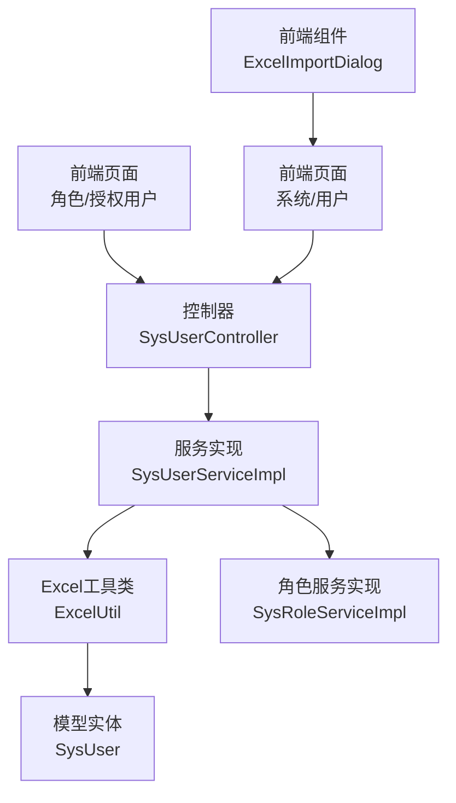
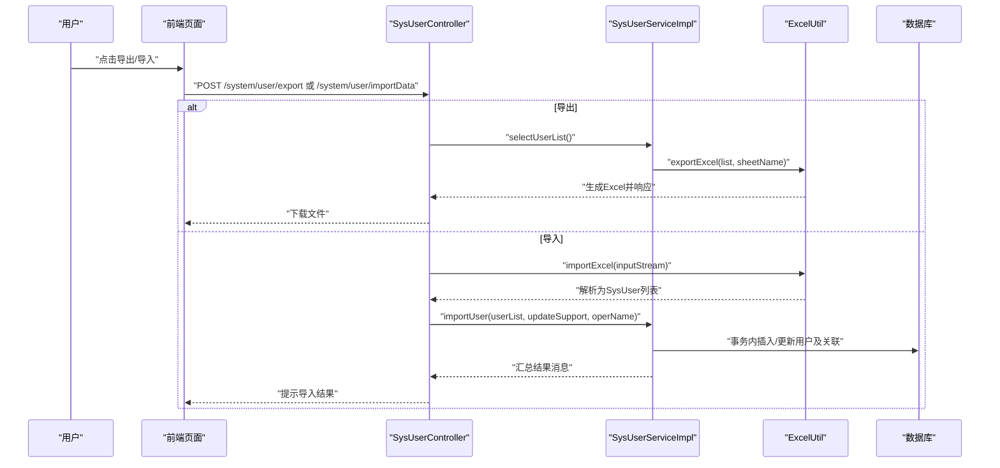
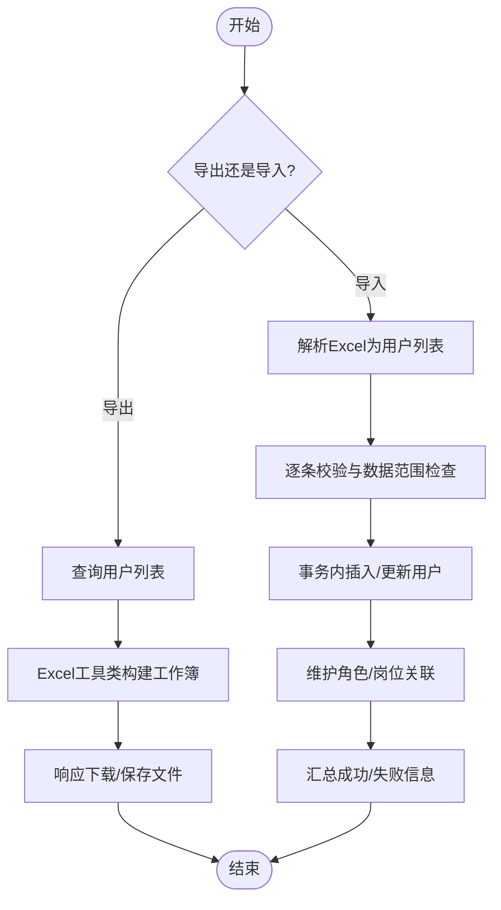
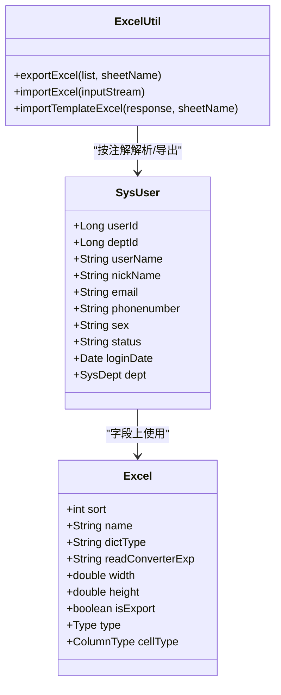
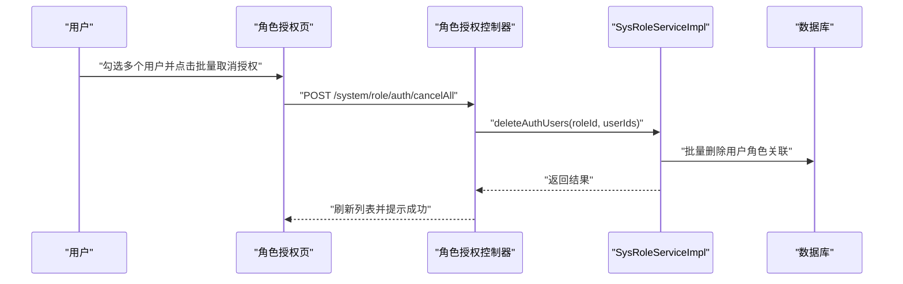
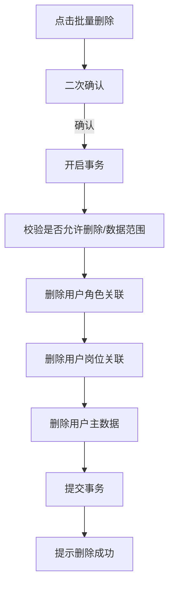
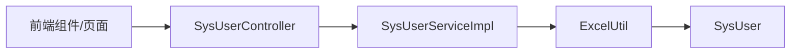
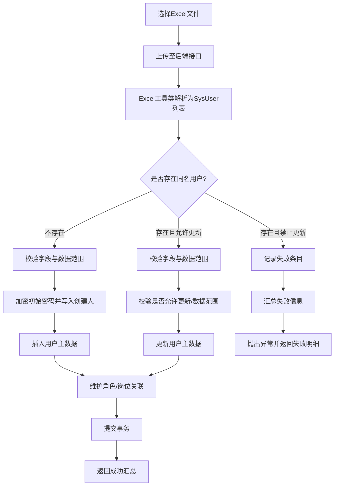

# 用户批量操作

<cite>
**本文引用的文件**
- [SysUserController.java](file://XingChen-Vue/xingchen-admin/src/main/java/com/xingchen/web/controller/system/SysUserController.java)
- [SysUserServiceImpl.java](file://XingChen-Vue/xingchen-system/src/main/java/com/xingchen/system/service/impl/SysUserServiceImpl.java)
- [ExcelUtil.java](file://XingChen-Vue/xingchen-common/src/main/java/com/xingchen/common/utils/poi/ExcelUtil.java)
- [Excel.java](file://XingChen-Vue/xingchen-common/src/main/java/com/xingchen/common/annotation/Excel.java)
- [SysUser.java](file://XingChen-Vue/xingchen-common/src/main/java/com/xingchen/common/core/domain/entity/SysUser.java)
- [ExcelImportDialog/index.vue](file://XingChen-Vue3/src/components/ExcelImportDialog/index.vue)
- [index.vue（系统/用户）](file://XingChen-Vue3/src/views/system/user/index.vue)
- [authUser.vue（角色/授权用户）](file://XingChen-Vue3/src/views/system/role/authUser.vue)
- [SysRoleServiceImpl.java](file://XingChen-Vue/xingchen-system/src/main/java/com/xingchen/system/service/impl/SysRoleServiceImpl.java)
</cite>

## 目录
1. [简介](#简介)
2. [项目结构](#项目结构)
3. [核心组件](#核心组件)
4. [架构总览](#架构总览)
5. [详细组件分析](#详细组件分析)
6. [依赖分析](#依赖分析)
7. [性能考虑](#性能考虑)
8. [故障排查指南](#故障排查指南)
9. [结论](#结论)
10. [附录](#附录)

## 简介
本文件面向“用户批量操作”的完整能力说明，覆盖以下关键能力：
- 用户数据导入与导出：基于注解驱动的Excel解析与生成，支持模板下载与批量导入。
- 批量用户删除：支持多选删除并联动清理用户角色与岗位关联。
- 批量权限分配：通过角色授权页面支持批量取消/授予用户角色。
- Excel数据处理：统一的Excel工具类，支持多Sheet导出、字典转换、公式与安全校验。

同时，文档提供批量流程图、模板说明、错误处理机制、事务管理与性能优化建议，帮助在大规模数据场景下稳定运行。

## 项目结构
围绕用户批量操作的关键模块分布如下：
- 控制层：系统用户控制器负责导出、导入、模板下载入口。
- 服务层：用户服务实现导入逻辑、批量删除、角色/岗位关联维护。
- 工具层：Excel工具类与注解体系支撑导入导出与模板生成。
- 前端：Excel导入对话框、用户列表页、角色授权页提供交互入口。

**图表来源**
- [SysUserController.java:70-95](file://XingChen-Vue/xingchen-admin/src/main/java/com/xingchen/web/controller/system/SysUserController.java#L70-L95)
- [SysUserServiceImpl.java:499-564](file://XingChen-Vue/xingchen-system/src/main/java/com/xingchen/system/service/impl/SysUserServiceImpl.java#L499-L564)
- [ExcelUtil.java:539-797](file://XingChen-Vue/xingchen-common/src/main/java/com/xingchen/common/utils/poi/ExcelUtil.java#L539-L797)
- [SysUser.java:22-100](file://XingChen-Vue/xingchen-common/src/main/java/com/xingchen/common/core/domain/entity/SysUser.java#L22-L100)
- [ExcelImportDialog/index.vue:1-138](file://XingChen-Vue3/src/components/ExcelImportDialog/index.vue#L1-L138)
- [index.vue（系统/用户）:302-307](file://XingChen-Vue3/src/views/system/user/index.vue#L302-L307)
- [authUser.vue（角色/授权用户）:166-176](file://XingChen-Vue3/src/views/system/role/authUser.vue#L166-L176)
- [SysRoleServiceImpl.java:399-414](file://XingChen-Vue/xingchen-system/src/main/java/com/xingchen/system/service/impl/SysRoleServiceImpl.java#L399-L414)

**章节来源**
- [SysUserController.java:70-95](file://XingChen-Vue/xingchen-admin/src/main/java/com/xingchen/web/controller/system/SysUserController.java#L70-L95)
- [index.vue（系统/用户）:302-307](file://XingChen-Vue3/src/views/system/user/index.vue#L302-L307)

## 核心组件
- 控制器：提供导出、导入、模板下载接口，接收前端上传文件与参数。
- 服务实现：执行导入校验、事务控制、批量删除、角色/岗位关联维护。
- Excel工具类：基于注解扫描字段、生成标题行、写入数据、多Sheet导出、模板生成。
- 前端组件：Excel导入对话框、用户列表页导出按钮、角色授权页批量操作。
- 模型实体：SysUser通过Excel注解声明导出/导入字段映射与字典转换。

**章节来源**
- [SysUserController.java:70-95](file://XingChen-Vue/xingchen-admin/src/main/java/com/xingchen/web/controller/system/SysUserController.java#L70-L95)
- [SysUserServiceImpl.java:499-564](file://XingChen-Vue/xingchen-system/src/main/java/com/xingchen/system/service/impl/SysUserServiceImpl.java#L499-L564)
- [ExcelUtil.java:539-797](file://XingChen-Vue/xingchen-common/src/main/java/com/xingchen/common/utils/poi/ExcelUtil.java#L539-L797)
- [Excel.java:19-198](file://XingChen-Vue/xingchen-common/src/main/java/com/xingchen/common/annotation/Excel.java#L19-L198)
- [SysUser.java:22-100](file://XingChen-Vue/xingchen-common/src/main/java/com/xingchen/common/core/domain/entity/SysUser.java#L22-L100)
- [ExcelImportDialog/index.vue:1-138](file://XingChen-Vue3/src/components/ExcelImportDialog/index.vue#L1-L138)
- [authUser.vue（角色/授权用户）:166-176](file://XingChen-Vue3/src/views/system/role/authUser.vue#L166-L176)

## 架构总览
用户批量操作的端到端流程如下：

**图表来源**
- [SysUserController.java:70-95](file://XingChen-Vue/xingchen-admin/src/main/java/com/xingchen/web/controller/system/SysUserController.java#L70-L95)
- [SysUserServiceImpl.java:499-564](file://XingChen-Vue/xingchen-system/src/main/java/com/xingchen/system/service/impl/SysUserServiceImpl.java#L499-L564)
- [ExcelUtil.java:539-797](file://XingChen-Vue/xingchen-common/src/main/java/com/xingchen/common/utils/poi/ExcelUtil.java#L539-L797)

## 详细组件分析

### 组件A：Excel导入与导出（后端）
- 导出：控制器调用服务查询用户列表，Excel工具类按注解生成标题与数据，支持多Sheet与本地文件输出。
- 导入：控制器接收文件流，Excel工具类解析为SysUser列表；服务层逐条校验、事务内插入或更新，并维护角色/岗位关联。
- 模板：控制器提供模板下载接口，Excel工具类生成仅含标题行的导入模板。

**图表来源**
- [SysUserController.java:70-95](file://XingChen-Vue/xingchen-admin/src/main/java/com/xingchen/web/controller/system/SysUserController.java#L70-L95)
- [SysUserServiceImpl.java:499-564](file://XingChen-Vue/xingchen-system/src/main/java/com/xingchen/system/service/impl/SysUserServiceImpl.java#L499-L564)
- [ExcelUtil.java:539-797](file://XingChen-Vue/xingchen-common/src/main/java/com/xingchen/common/utils/poi/ExcelUtil.java#L539-L797)

**章节来源**
- [SysUserController.java:70-95](file://XingChen-Vue/xingchen-admin/src/main/java/com/xingchen/web/controller/system/SysUserController.java#L70-L95)
- [SysUserServiceImpl.java:499-564](file://XingChen-Vue/xingchen-system/src/main/java/com/xingchen/system/service/impl/SysUserServiceImpl.java#L499-L564)
- [ExcelUtil.java:539-797](file://XingChen-Vue/xingchen-common/src/main/java/com/xingchen/common/utils/poi/ExcelUtil.java#L539-L797)

### 组件B：Excel解析机制与注解驱动
- 注解体系：Excel注解声明字段名称、字典类型、读取转换表达式、列宽/高度、对齐方式、是否导出/导入等。
- 解析流程：Excel工具类扫描实体字段上的注解，按顺序生成标题行；读取数据行时根据注解进行类型转换、字典反向解析、自定义格式化处理器等。
- 多Sheet支持：当数据量超过阈值时自动拆分到多个Sheet，提升大表性能与兼容性。

**图表来源**
- [SysUser.java:22-100](file://XingChen-Vue/xingchen-common/src/main/java/com/xingchen/common/core/domain/entity/SysUser.java#L22-L100)
- [Excel.java:19-198](file://XingChen-Vue/xingchen-common/src/main/java/com/xingchen/common/annotation/Excel.java#L19-L198)
- [ExcelUtil.java:539-797](file://XingChen-Vue/xingchen-common/src/main/java/com/xingchen/common/utils/poi/ExcelUtil.java#L539-L797)

**章节来源**
- [Excel.java:19-198](file://XingChen-Vue/xingchen-common/src/main/java/com/xingchen/common/annotation/Excel.java#L19-L198)
- [SysUser.java:22-100](file://XingChen-Vue/xingchen-common/src/main/java/com/xingchen/common/core/domain/entity/SysUser.java#L22-L100)
- [ExcelUtil.java:539-797](file://XingChen-Vue/xingchen-common/src/main/java/com/xingchen/common/utils/poi/ExcelUtil.java#L539-L797)

### 组件C：批量权限分配（角色授权）
- 批量取消授权：角色授权页支持多选用户，批量调用取消授权接口，服务层批量删除用户角色关联。
- 批量授权：可结合前端选择与后端接口完成批量授权，保持与批量取消一致的事务与权限校验策略。

**图表来源**
- [authUser.vue（角色/授权用户）:166-176](file://XingChen-Vue3/src/views/system/role/authUser.vue#L166-L176)
- [SysRoleServiceImpl.java:399-414](file://XingChen-Vue/xingchen-system/src/main/java/com/xingchen/system/service/impl/SysRoleServiceImpl.java#L399-L414)

**章节来源**
- [authUser.vue（角色/授权用户）:166-176](file://XingChen-Vue3/src/views/system/role/authUser.vue#L166-L176)
- [SysRoleServiceImpl.java:399-414](file://XingChen-Vue/xingchen-system/src/main/java/com/xingchen/system/service/impl/SysRoleServiceImpl.java#L399-L414)

### 组件D：批量用户删除
- 支持多选删除，服务层在事务内先校验是否允许删除与数据范围，再删除用户角色与岗位关联，最后删除用户主数据。
- 前端提供删除确认与成功提示，确保操作可追溯。

**图表来源**
- [SysUserServiceImpl.java:475-489](file://XingChen-Vue/xingchen-system/src/main/java/com/xingchen/system/service/impl/SysUserServiceImpl.java#L475-L489)

**章节来源**
- [SysUserServiceImpl.java:475-489](file://XingChen-Vue/xingchen-system/src/main/java/com/xingchen/system/service/impl/SysUserServiceImpl.java#L475-L489)

## 依赖分析
- 控制器依赖服务层：导出/导入/模板下载均委托服务层处理。
- 服务层依赖Excel工具类：导入/导出均通过Excel工具类完成。
- 服务层依赖模型实体：SysUser注解驱动字段映射与字典转换。
- 前端依赖控制器接口：导出按钮与Excel导入对话框分别调用导出与导入接口。

**图表来源**
- [SysUserController.java:70-95](file://XingChen-Vue/xingchen-admin/src/main/java/com/xingchen/web/controller/system/SysUserController.java#L70-L95)
- [SysUserServiceImpl.java:499-564](file://XingChen-Vue/xingchen-system/src/main/java/com/xingchen/system/service/impl/SysUserServiceImpl.java#L499-L564)
- [ExcelUtil.java:539-797](file://XingChen-Vue/xingchen-common/src/main/java/com/xingchen/common/utils/poi/ExcelUtil.java#L539-L797)
- [SysUser.java:22-100](file://XingChen-Vue/xingchen-common/src/main/java/com/xingchen/common/core/domain/entity/SysUser.java#L22-L100)

**章节来源**
- [SysUserController.java:70-95](file://XingChen-Vue/xingchen-admin/src/main/java/com/xingchen/web/controller/system/SysUserController.java#L70-L95)
- [SysUserServiceImpl.java:499-564](file://XingChen-Vue/xingchen-system/src/main/java/com/xingchen/system/service/impl/SysUserServiceImpl.java#L499-L564)
- [ExcelUtil.java:539-797](file://XingChen-Vue/xingchen-common/src/main/java/com/xingchen/common/utils/poi/ExcelUtil.java#L539-L797)
- [SysUser.java:22-100](file://XingChen-Vue/xingchen-common/src/main/java/com/xingchen/common/core/domain/entity/SysUser.java#L22-L100)

## 性能考虑
- 大数据量导出：Excel工具类采用流式工作簿与分Sheet策略，避免内存峰值过高。
- 导入批处理：服务层逐条校验与事务控制，建议前端限制单次导入条数或分批次导入。
- 字典与格式化：注解支持字典转换与自定义格式化处理器，减少重复计算，提高导入效率。
- 并发与锁：批量导入/删除涉及事务与外键约束，建议在业务高峰期错峰执行或增加限流策略。

[本节为通用性能建议，无需特定文件引用]

## 故障排查指南
- 导入失败：服务层会汇总失败条目并抛出异常，前端展示具体失败原因与定位。
- 校验失败：导入前对用户字段进行校验，若违反约束（如重复账号、越权更新），服务层抛出异常并记录日志。
- 权限不足：导入/导出需具备相应权限，前端应提示权限不足。
- Excel格式问题：模板缺失标题行、列名不匹配、单元格类型不符等会导致解析异常。

**章节来源**
- [SysUserServiceImpl.java:502-552](file://XingChen-Vue/xingchen-system/src/main/java/com/xingchen/system/service/impl/SysUserServiceImpl.java#L502-L552)
- [ExcelUtil.java:388-398](file://XingChen-Vue/xingchen-common/src/main/java/com/xingchen/common/utils/poi/ExcelUtil.java#L388-L398)

## 结论
本系统围绕“用户批量操作”提供了完善的导入导出、模板下载、批量删除与批量权限分配能力。通过注解驱动的Excel工具类与事务化的服务层实现，确保了数据一致性与可扩展性。建议在生产环境中配合前端分批导入、服务端限流与监控告警，保障大规模数据处理的稳定性与性能。

[本节为总结性内容，无需特定文件引用]

## 附录

### 批量导入流程图（细化）

**图表来源**
- [SysUserServiceImpl.java:500-564](file://XingChen-Vue/xingchen-system/src/main/java/com/xingchen/system/service/impl/SysUserServiceImpl.java#L500-L564)
- [ExcelUtil.java:539-797](file://XingChen-Vue/xingchen-common/src/main/java/com/xingchen/common/utils/poi/ExcelUtil.java#L539-L797)

### 数据导入模板（字段说明）
- 模板由控制器触发生成，包含用户登录名称、用户名称、邮箱、手机号码、性别、账号状态、部门编号等字段。
- 字段与SysUser注解一一对应，导入时按注解进行类型转换与字典解析。

**章节来源**
- [SysUserController.java:90-95](file://XingChen-Vue/xingchen-admin/src/main/java/com/xingchen/web/controller/system/SysUserController.java#L90-L95)
- [SysUser.java:22-100](file://XingChen-Vue/xingchen-common/src/main/java/com/xingchen/common/core/domain/entity/SysUser.java#L22-L100)

### 前端交互要点
- 导入对话框：支持选择xls/xlsx文件、勾选“是否更新已存在数据”，提交后弹窗展示导入结果。
- 用户列表页：提供导出按钮，直接下载当前筛选条件下的用户数据。
- 角色授权页：支持多选用户并批量取消授权。

**章节来源**
- [ExcelImportDialog/index.vue:1-138](file://XingChen-Vue3/src/components/ExcelImportDialog/index.vue#L1-L138)
- [index.vue（系统/用户）:302-307](file://XingChen-Vue3/src/views/system/user/index.vue#L302-L307)
- [authUser.vue（角色/授权用户）:166-176](file://XingChen-Vue3/src/views/system/role/authUser.vue#L166-L176)