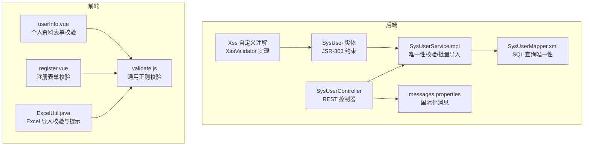
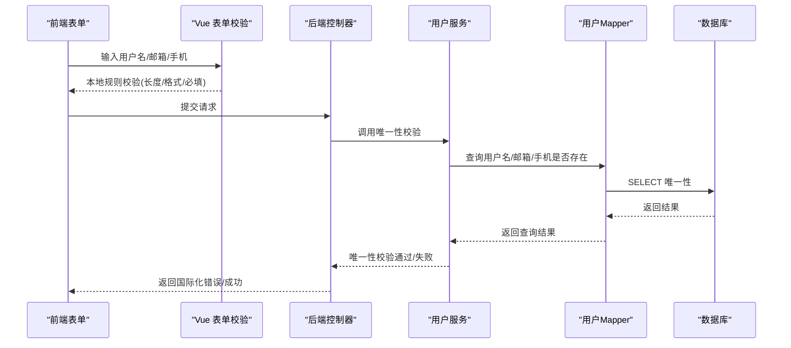
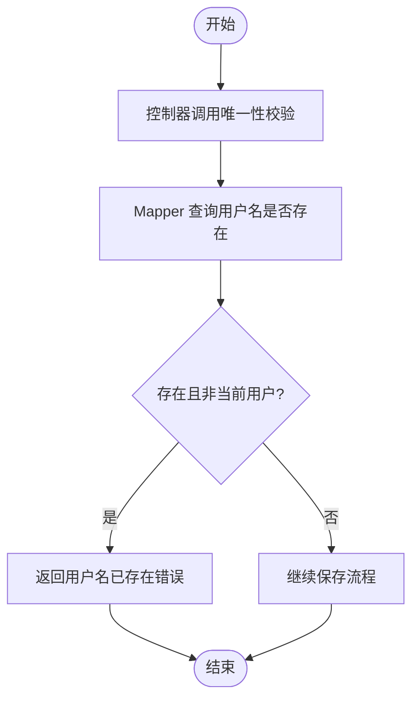
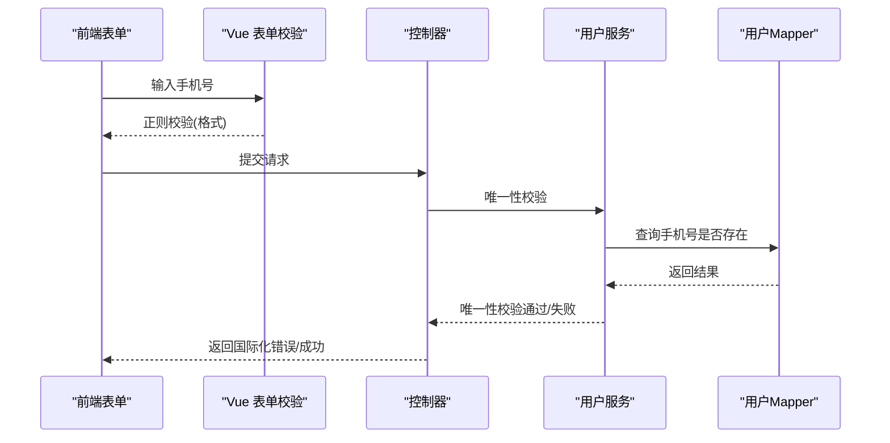
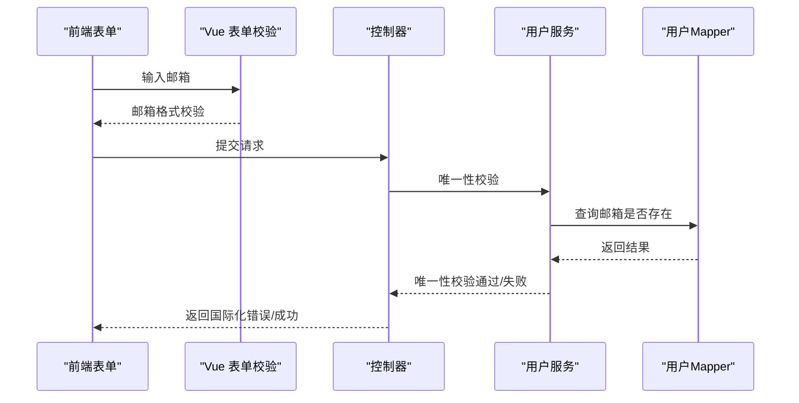
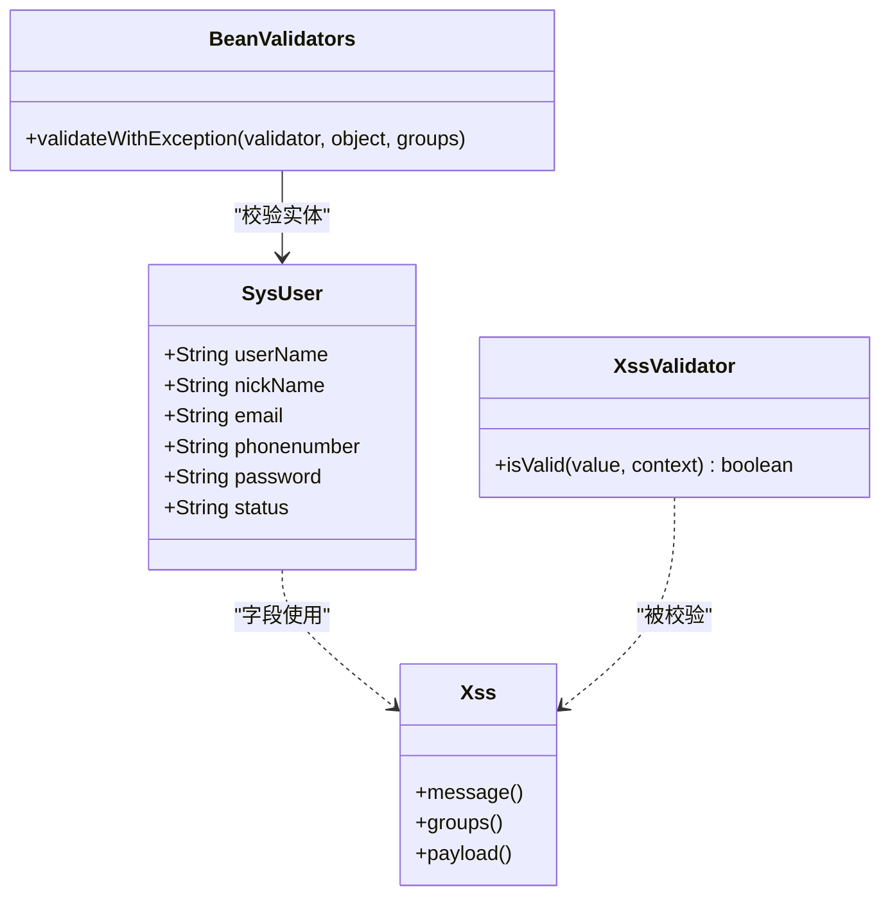
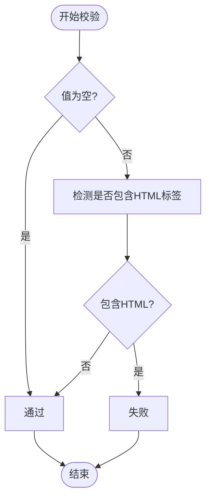
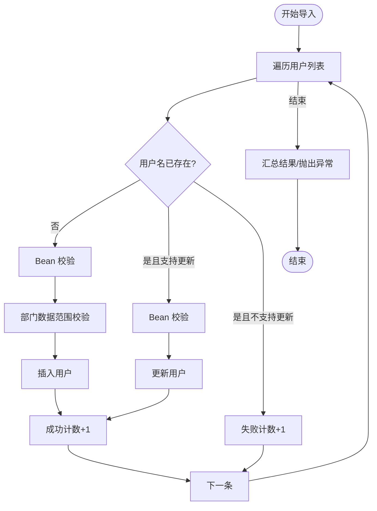
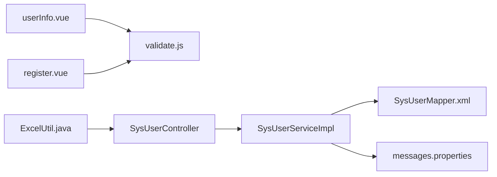

# 用户数据验证

<cite>
**本文引用的文件**
- [SysUser.java](file://XingChen-Vue/xingchen-common/src/main/java/com/xingchen/common/core/domain/entity/SysUser.java)
- [Xss.java](file://XingChen-Vue/xingchen-common/src/main/java/com/xingchen/common/xss/Xss.java)
- [XssValidator.java](file://XingChen-Vue/xingchen-common/src/main/java/com/xingchen/common/xss/XssValidator.java)
- [SysUserServiceImpl.java](file://XingChen-Vue/xingchen-system/src/main/java/com/xingchen/system/service/impl/SysUserServiceImpl.java)
- [SysUserMapper.xml](file://XingChen-Vue/xingchen-system/src/main/resources/mapper/system/SysUserMapper.xml)
- [SysUserController.java](file://XingChen-Vue/xingchen-admin/src/main/java/com/xingchen/web/controller/system/SysUserController.java)
- [SysRegisterController.java](file://XingChen-Vue/xingchen-admin/src/main/java/com/xingchen/web/controller/system/SysRegisterController.java)
- [BeanValidators.java](file://XingChen-Vue/xingchen-common/src/main/java/com/xingchen/common/utils/bean/BeanValidators.java)
- [messages.properties](file://XingChen-Vue/xingchen-admin/src/main/resources/i18n/messages.properties)
- [validate.js](file://XingChen-Vue3/src/utils/validate.js)
- [userInfo.vue](file://XingChen-Vue3/src/views/system/user/profile/userInfo.vue)
- [register.vue](file://XingChen-Vue3/src/views/register.vue)
- [ExcelUtil.java](file://XingChen-Vue/xingchen-common/src/main/java/com/xingchen/common/utils/poi/ExcelUtil.java)
</cite>

## 目录
1. [简介](#简介)
2. [项目结构](#项目结构)
3. [核心组件](#核心组件)
4. [架构总览](#架构总览)
5. [详细组件分析](#详细组件分析)
6. [依赖关系分析](#依赖关系分析)
7. [性能考量](#性能考量)
8. [故障排查指南](#故障排查指南)
9. [结论](#结论)
10. [附录](#附录)

## 简介
本文件面向“用户数据验证系统”，系统性梳理并解释以下验证规则与实现：
- 用户名唯一性校验
- 手机号码格式与唯一性校验
- 邮箱地址格式与唯一性校验
- 用户数据完整性检查（必填、长度、格式）
- 自定义验证注解与实现（XSS 过滤、JSR-303 约束）
- 国际化验证消息
- 批量数据导入验证策略
- 异常处理机制
- 验证流程图、扩展方法、性能优化与常见问题解决方案

## 项目结构
围绕用户验证的关键模块分布于前后端：
- 后端 Java 层：实体类 SysUser 及其 JSR-303 约束、XSS 自定义注解与校验器、服务层唯一性校验、MyBatis 映射、控制器校验与国际化消息
- 前端 Vue 层：表单校验规则（Element Plus）、国际化消息、Excel 导入校验与提示

图表来源
- [SysUser.java:132-178](file://XingChen-Vue/xingchen-common/src/main/java/com/xingchen/common/core/domain/entity/SysUser.java#L132-L178)
- [Xss.java:15-27](file://XingChen-Vue/xingchen-common/src/main/java/com/xingchen/common/xss/Xss.java#L15-L27)
- [XssValidator.java:14-39](file://XingChen-Vue/xingchen-common/src/main/java/com/xingchen/common/xss/XssValidator.java#L14-L39)
- [SysUserServiceImpl.java:176-218](file://XingChen-Vue/xingchen-system/src/main/java/com/xingchen/system/service/impl/SysUserServiceImpl.java#L176-L218)
- [SysUserMapper.xml:134-144](file://XingChen-Vue/xingchen-system/src/main/resources/mapper/system/SysUserMapper.xml#L134-L144)
- [SysUserController.java:128-159](file://XingChen-Vue/xingchen-admin/src/main/java/com/xingchen/web/controller/system/SysUserController.java#L128-L159)
- [messages.properties:1-39](file://XingChen-Vue/xingchen-admin/src/main/resources/i18n/messages.properties#L1-L39)
- [validate.js:88-95](file://XingChen-Vue3/src/utils/validate.js#L88-L95)
- [userInfo.vue:37-41](file://XingChen-Vue3/src/views/system/user/profile/userInfo.vue#L37-L41)
- [register.vue:104-119](file://XingChen-Vue3/src/views/register.vue#L104-L119)
- [ExcelUtil.java:1350-1383](file://XingChen-Vue/xingchen-common/src/main/java/com/xingchen/common/utils/poi/ExcelUtil.java#L1350-L1383)

章节来源
- [SysUser.java:132-178](file://XingChen-Vue/xingchen-common/src/main/java/com/xingchen/common/core/domain/entity/SysUser.java#L132-L178)
- [SysUserServiceImpl.java:176-218](file://XingChen-Vue/xingchen-system/src/main/java/com/xingchen/system/service/impl/SysUserServiceImpl.java#L176-L218)
- [SysUserMapper.xml:134-144](file://XingChen-Vue/xingchen-system/src/main/resources/mapper/system/SysUserMapper.xml#L134-L144)
- [SysUserController.java:128-159](file://XingChen-Vue/xingchen-admin/src/main/java/com/xingchen/web/controller/system/SysUserController.java#L128-L159)
- [messages.properties:1-39](file://XingChen-Vue/xingchen-admin/src/main/resources/i18n/messages.properties#L1-L39)
- [validate.js:88-95](file://XingChen-Vue3/src/utils/validate.js#L88-L95)
- [userInfo.vue:37-41](file://XingChen-Vue3/src/views/system/user/profile/userInfo.vue#L37-L41)
- [register.vue:104-119](file://XingChen-Vue3/src/views/register.vue#L104-L119)
- [ExcelUtil.java:1350-1383](file://XingChen-Vue/xingchen-common/src/main/java/com/xingchen/common/utils/poi/ExcelUtil.java#L1350-L1383)

## 核心组件
- 用户实体与约束
  - SysUser 使用 JSR-303 注解对字段进行约束，如邮箱格式、长度、必填、XSS 注解等
  - XSS 注解通过自定义校验器实现 HTML/脚本检测
- 唯一性校验
  - 服务层提供用户名、手机号、邮箱唯一性检查；MyBatis Mapper 提供 SQL 查询
- 控制器与国际化
  - 控制器在新增/编辑时调用唯一性校验，并返回国际化消息
- 前端校验
  - userInfo.vue 与 register.vue 定义表单规则；validate.js 提供通用正则校验
- 批量导入
  - ExcelUtil 提供导入模板校验与提示；SysUserServiceImpl 在导入时执行 Bean 校验与唯一性判断

章节来源
- [SysUser.java:132-178](file://XingChen-Vue/xingchen-common/src/main/java/com/xingchen/common/core/domain/entity/SysUser.java#L132-L178)
- [Xss.java:15-27](file://XingChen-Vue/xingchen-common/src/main/java/com/xingchen/common/xss/Xss.java#L15-L27)
- [XssValidator.java:14-39](file://XingChen-Vue/xingchen-common/src/main/java/com/xingchen/common/xss/XssValidator.java#L14-L39)
- [SysUserServiceImpl.java:176-218](file://XingChen-Vue/xingchen-system/src/main/java/com/xingchen/system/service/impl/SysUserServiceImpl.java#L176-L218)
- [SysUserMapper.xml:134-144](file://XingChen-Vue/xingchen-system/src/main/resources/mapper/system/SysUserMapper.xml#L134-L144)
- [SysUserController.java:128-159](file://XingChen-Vue/xingchen-admin/src/main/java/com/xingchen/web/controller/system/SysUserController.java#L128-L159)
- [messages.properties:1-39](file://XingChen-Vue/xingchen-admin/src/main/resources/i18n/messages.properties#L1-L39)
- [validate.js:88-95](file://XingChen-Vue3/src/utils/validate.js#L88-L95)
- [userInfo.vue:37-41](file://XingChen-Vue3/src/views/system/user/profile/userInfo.vue#L37-L41)
- [register.vue:104-119](file://XingChen-Vue3/src/views/register.vue#L104-L119)
- [ExcelUtil.java:1350-1383](file://XingChen-Vue/xingchen-common/src/main/java/com/xingchen/common/utils/poi/ExcelUtil.java#L1350-L1383)

## 架构总览
用户数据验证贯穿“前端表单校验 -> 后端接口校验 -> 数据库唯一性约束”的链路。

图表来源
- [SysUserController.java:128-159](file://XingChen-Vue/xingchen-admin/src/main/java/com/xingchen/web/controller/system/SysUserController.java#L128-L159)
- [SysUserServiceImpl.java:176-218](file://XingChen-Vue/xingchen-system/src/main/java/com/xingchen/system/service/impl/SysUserServiceImpl.java#L176-L218)
- [SysUserMapper.xml:134-144](file://XingChen-Vue/xingchen-system/src/main/resources/mapper/system/SysUserMapper.xml#L134-L144)

## 详细组件分析

### 用户名唯一性校验
- 实现位置
  - 服务层：SysUserServiceImpl.checkUserNameUnique
  - Mapper：SysUserMapper.xml.checkUserNameUnique
  - 控制器：SysUserController 新增/编辑时调用
- 流程
  - 控制器接收请求后，先调用唯一性校验
  - 若已存在且非当前用户，则返回国际化错误消息
- 国际化消息
  - messages.properties 中定义了用户名重复的错误文案

图表来源
- [SysUserController.java:128-132](file://XingChen-Vue/xingchen-admin/src/main/java/com/xingchen/web/controller/system/SysUserController.java#L128-L132)
- [SysUserServiceImpl.java:176-182](file://XingChen-Vue/xingchen-system/src/main/java/com/xingchen/system/service/impl/SysUserServiceImpl.java#L176-L182)
- [SysUserMapper.xml:134-136](file://XingChen-Vue/xingchen-system/src/main/resources/mapper/system/SysUserMapper.xml#L134-L136)
- [messages.properties:17](file://XingChen-Vue/xingchen-admin/src/main/resources/i18n/messages.properties#L17)

章节来源
- [SysUserController.java:128-132](file://XingChen-Vue/xingchen-admin/src/main/java/com/xingchen/web/controller/system/SysUserController.java#L128-L132)
- [SysUserServiceImpl.java:176-182](file://XingChen-Vue/xingchen-system/src/main/java/com/xingchen/system/service/impl/SysUserServiceImpl.java#L176-L182)
- [SysUserMapper.xml:134-136](file://XingChen-Vue/xingchen-system/src/main/resources/mapper/system/SysUserMapper.xml#L134-L136)
- [messages.properties:17](file://XingChen-Vue/xingchen-admin/src/main/resources/i18n/messages.properties#L17)

### 手机号码验证与唯一性
- 格式校验
  - 前端 userInfo.vue 使用正则表达式校验手机号格式
  - validate.js 提供通用正则工具
- 唯一性校验
  - 服务层 SysUserServiceImpl.checkPhoneUnique
  - Mapper SysUserMapper.xml.checkPhoneUnique
- 控制器在新增/编辑时调用唯一性校验并返回国际化消息

图表来源
- [userInfo.vue:40](file://XingChen-Vue3/src/views/system/user/profile/userInfo.vue#L40)
- [validate.js:88-95](file://XingChen-Vue3/src/utils/validate.js#L88-L95)
- [SysUserController.java:133-136](file://XingChen-Vue/xingchen-admin/src/main/java/com/xingchen/web/controller/system/SysUserController.java#L133-L136)
- [SysUserServiceImpl.java:190-200](file://XingChen-Vue/xingchen-system/src/main/java/com/xingchen/system/service/impl/SysUserServiceImpl.java#L190-L200)
- [SysUserMapper.xml:138-140](file://XingChen-Vue/xingchen-system/src/main/resources/mapper/system/SysUserMapper.xml#L138-L140)

章节来源
- [userInfo.vue:40](file://XingChen-Vue3/src/views/system/user/profile/userInfo.vue#L40)
- [validate.js:88-95](file://XingChen-Vue3/src/utils/validate.js#L88-L95)
- [SysUserController.java:133-136](file://XingChen-Vue/xingchen-admin/src/main/java/com/xingchen/web/controller/system/SysUserController.java#L133-L136)
- [SysUserServiceImpl.java:190-200](file://XingChen-Vue/xingchen-system/src/main/java/com/xingchen/system/service/impl/SysUserServiceImpl.java#L190-L200)
- [SysUserMapper.xml:138-140](file://XingChen-Vue/xingchen-system/src/main/resources/mapper/system/SysUserMapper.xml#L138-L140)

### 邮箱地址验证与唯一性
- 格式校验
  - 前端 userInfo.vue 使用 type: "email" 校验邮箱格式
  - validate.js 提供 validEmail 正则
- 唯一性校验
  - 服务层 SysUserServiceImpl.checkEmailUnique
  - Mapper SysUserMapper.xml.checkEmailUnique
- 控制器在新增/编辑时调用唯一性校验并返回国际化消息

图表来源
- [userInfo.vue:39](file://XingChen-Vue3/src/views/system/user/profile/userInfo.vue#L39)
- [validate.js:92-95](file://XingChen-Vue3/src/utils/validate.js#L92-L95)
- [SysUserController.java:137-139](file://XingChen-Vue/xingchen-admin/src/main/java/com/xingchen/web/controller/system/SysUserController.java#L137-L139)
- [SysUserServiceImpl.java:208-218](file://XingChen-Vue/xingchen-system/src/main/java/com/xingchen/system/service/impl/SysUserServiceImpl.java#L208-L218)
- [SysUserMapper.xml:142-144](file://XingChen-Vue/xingchen-system/src/main/resources/mapper/system/SysUserMapper.xml#L142-L144)

章节来源
- [userInfo.vue:39](file://XingChen-Vue3/src/views/system/user/profile/userInfo.vue#L39)
- [validate.js:92-95](file://XingChen-Vue3/src/utils/validate.js#L92-L95)
- [SysUserController.java:137-139](file://XingChen-Vue/xingchen-admin/src/main/java/com/xingchen/web/controller/system/SysUserController.java#L137-L139)
- [SysUserServiceImpl.java:208-218](file://XingChen-Vue/xingchen-system/src/main/java/com/xingchen/system/service/impl/SysUserServiceImpl.java#L208-L218)
- [SysUserMapper.xml:142-144](file://XingChen-Vue/xingchen-system/src/main/resources/mapper/system/SysUserMapper.xml#L142-L144)

### 用户数据完整性检查
- JSR-303 约束
  - SysUser 对用户名、昵称、邮箱、手机号等字段使用 @NotBlank、@Email、@Size、@Xss 等注解
- 前端规则
  - userInfo.vue 与 register.vue 定义必填、长度、格式规则
- Bean 校验
  - BeanValidators.validateWithException 将 JSR-303 违规转换为异常抛出

图表来源
- [SysUser.java:132-178](file://XingChen-Vue/xingchen-common/src/main/java/com/xingchen/common/core/domain/entity/SysUser.java#L132-L178)
- [Xss.java:15-27](file://XingChen-Vue/xingchen-common/src/main/java/com/xingchen/common/xss/Xss.java#L15-L27)
- [XssValidator.java:14-39](file://XingChen-Vue/xingchen-common/src/main/java/com/xingchen/common/xss/XssValidator.java#L14-L39)
- [BeanValidators.java:15-23](file://XingChen-Vue/xingchen-common/src/main/java/com/xingchen/common/utils/bean/BeanValidators.java#L15-L23)

章节来源
- [SysUser.java:132-178](file://XingChen-Vue/xingchen-common/src/main/java/com/xingchen/common/core/domain/entity/SysUser.java#L132-L178)
- [Xss.java:15-27](file://XingChen-Vue/xingchen-common/src/main/java/com/xingchen/common/xss/Xss.java#L15-L27)
- [XssValidator.java:14-39](file://XingChen-Vue/xingchen-common/src/main/java/com/xingchen/common/xss/XssValidator.java#L14-L39)
- [BeanValidators.java:15-23](file://XingChen-Vue/xingchen-common/src/main/java/com/xingchen/common/utils/bean/BeanValidators.java#L15-L23)

### 自定义验证注解与实现（XSS）
- 注解定义：Xss
- 校验器：XssValidator
- 使用场景：SysUser 的用户名与昵称字段
- 校验逻辑：空值跳过，否则检测是否包含 HTML 标签

图表来源
- [XssValidator.java:18-38](file://XingChen-Vue/xingchen-common/src/main/java/com/xingchen/common/xss/XssValidator.java#L18-L38)
- [SysUser.java:132-146](file://XingChen-Vue/xingchen-common/src/main/java/com/xingchen/common/core/domain/entity/SysUser.java#L132-L146)

章节来源
- [Xss.java:15-27](file://XingChen-Vue/xingchen-common/src/main/java/com/xingchen/common/xss/Xss.java#L15-L27)
- [XssValidator.java:14-39](file://XingChen-Vue/xingchen-common/src/main/java/com/xingchen/common/xss/XssValidator.java#L14-L39)
- [SysUser.java:132-146](file://XingChen-Vue/xingchen-common/src/main/java/com/xingchen/common/core/domain/entity/SysUser.java#L132-L146)

### 国际化验证消息
- messages.properties 定义了多条验证相关消息，包括：
  - 长度限制、用户名/邮箱/手机号格式错误、验证码错误等
- 控制器在唯一性冲突或业务校验失败时返回对应国际化消息

章节来源
- [messages.properties:15-21](file://XingChen-Vue/xingchen-admin/src/main/resources/i18n/messages.properties#L15-L21)
- [SysUserController.java:128-139](file://XingChen-Vue/xingchen-admin/src/main/java/com/xingchen/web/controller/system/SysUserController.java#L128-L139)

### 批量数据导入验证策略
- ExcelUtil
  - 导入时可设置下拉校验、提示信息，提升数据质量
  - 支持隐藏工作表与大量下拉兼容处理
- SysUserServiceImpl.importUser
  - 对每条记录先查重（用户名），不存在则执行 Bean 校验，再插入
  - 支持更新模式：若存在则执行 Bean 校验并更新
  - 统计成功/失败条目，失败时抛出 ServiceException 并汇总错误

图表来源
- [SysUserServiceImpl.java:500-566](file://XingChen-Vue/xingchen-system/src/main/java/com/xingchen/system/service/impl/SysUserServiceImpl.java#L500-L566)
- [ExcelUtil.java:1350-1383](file://XingChen-Vue/xingchen-common/src/main/java/com/xingchen/common/utils/poi/ExcelUtil.java#L1350-L1383)

章节来源
- [SysUserServiceImpl.java:500-566](file://XingChen-Vue/xingchen-system/src/main/java/com/xingchen/system/service/impl/SysUserServiceImpl.java#L500-L566)
- [ExcelUtil.java:1350-1383](file://XingChen-Vue/xingchen-common/src/main/java/com/xingchen/common/utils/poi/ExcelUtil.java#L1350-L1383)

### 异常处理机制
- JSR-303 违规转异常
  - BeanValidators.validateWithException 将校验违规转换为 ConstraintViolationException
- 业务异常
  - 导入失败时抛出 ServiceException，汇总错误信息
- 控制器统一返回 AjaxResult 或错误信息

章节来源
- [BeanValidators.java:15-23](file://XingChen-Vue/xingchen-common/src/main/java/com/xingchen/common/utils/bean/BeanValidators.java#L15-L23)
- [SysUserServiceImpl.java:546-558](file://XingChen-Vue/xingchen-system/src/main/java/com/xingchen/system/service/impl/SysUserServiceImpl.java#L546-L558)

## 依赖关系分析
- SysUserServiceImpl 依赖 SysUserMapper 执行唯一性查询
- SysUserController 依赖 SysUserServiceImpl 与国际化消息
- 前端 userInfo.vue/register.vue 依赖 validate.js 与 Element Plus 校验规则
- ExcelUtil 与导入流程耦合，提供模板与校验能力

图表来源
- [userInfo.vue:37-41](file://XingChen-Vue3/src/views/system/user/profile/userInfo.vue#L37-L41)
- [register.vue:104-119](file://XingChen-Vue3/src/views/register.vue#L104-L119)
- [validate.js:88-95](file://XingChen-Vue3/src/utils/validate.js#L88-L95)
- [SysUserController.java:128-159](file://XingChen-Vue/xingchen-admin/src/main/java/com/xingchen/web/controller/system/SysUserController.java#L128-L159)
- [SysUserServiceImpl.java:176-218](file://XingChen-Vue/xingchen-system/src/main/java/com/xingchen/system/service/impl/SysUserServiceImpl.java#L176-L218)
- [SysUserMapper.xml:134-144](file://XingChen-Vue/xingchen-system/src/main/resources/mapper/system/SysUserMapper.xml#L134-L144)
- [messages.properties:1-39](file://XingChen-Vue/xingchen-admin/src/main/resources/i18n/messages.properties#L1-L39)
- [ExcelUtil.java:1350-1383](file://XingChen-Vue/xingchen-common/src/main/java/com/xingchen/common/utils/poi/ExcelUtil.java#L1350-L1383)

章节来源
- [SysUserController.java:128-159](file://XingChen-Vue/xingchen-admin/src/main/java/com/xingchen/web/controller/system/SysUserController.java#L128-L159)
- [SysUserServiceImpl.java:176-218](file://XingChen-Vue/xingchen-system/src/main/java/com/xingchen/system/service/impl/SysUserServiceImpl.java#L176-L218)
- [SysUserMapper.xml:134-144](file://XingChen-Vue/xingchen-system/src/main/resources/mapper/system/SysUserMapper.xml#L134-L144)
- [messages.properties:1-39](file://XingChen-Vue/xingchen-admin/src/main/resources/i18n/messages.properties#L1-L39)
- [validate.js:88-95](file://XingChen-Vue3/src/utils/validate.js#L88-L95)
- [userInfo.vue:37-41](file://XingChen-Vue3/src/views/system/user/profile/userInfo.vue#L37-L41)
- [register.vue:104-119](file://XingChen-Vue3/src/views/register.vue#L104-L119)
- [ExcelUtil.java:1350-1383](file://XingChen-Vue/xingchen-common/src/main/java/com/xingchen/common/utils/poi/ExcelUtil.java#L1350-L1383)

## 性能考量
- 唯一性查询
  - 建议在用户名、邮箱、手机号字段建立数据库索引，降低查询成本
- 导入性能
  - 批量导入时尽量减少重复查询与校验次数，必要时采用缓存或预校验
- 前端校验
  - 优先使用本地校验减少无效请求，仅在必要时发起后端请求
- XSS 校验
  - 仅对敏感字段启用，避免对所有文本字段进行严格校验导致性能下降

## 故障排查指南
- 常见问题
  - 用户名重复：检查唯一性校验与国际化消息是否正确返回
  - 手机号/邮箱格式错误：确认前端规则与后端 JSR-303 注解一致
  - 导入失败：查看 ServiceException 汇总信息，定位具体失败项
- 排查步骤
  - 检查控制器调用链与服务层唯一性校验
  - 核对 messages.properties 中的错误文案
  - 查看 Bean 校验异常堆栈，定位具体字段

章节来源
- [SysUserController.java:128-159](file://XingChen-Vue/xingchen-admin/src/main/java/com/xingchen/web/controller/system/SysUserController.java#L128-L159)
- [SysUserServiceImpl.java:546-558](file://XingChen-Vue/xingchen-system/src/main/java/com/xingchen/system/service/impl/SysUserServiceImpl.java#L546-L558)
- [messages.properties:1-39](file://XingChen-Vue/xingchen-admin/src/main/resources/i18n/messages.properties#L1-L39)

## 结论
本系统通过“前端规则 + 后端 JSR-303 + 自定义注解 + 唯一性校验 + 国际化消息 + 批量导入校验”的多层保障，实现了对用户名、手机号、邮箱及用户数据完整性的全面验证。建议在生产环境中进一步完善索引、缓存与日志监控，持续优化导入性能与用户体验。

## 附录
- 验证规则扩展方法
  - 新增字段约束：在实体类添加相应注解，并在前端补充规则
  - 自定义注解：参考 Xss 注解与 XssValidator 实现方式
  - 扩展国际化：在 messages.properties 中新增键值对
- 批量导入最佳实践
  - 使用 ExcelUtil 的下拉校验与提示，减少人工错误
  - 分批导入并记录失败明细，便于回溯与修复