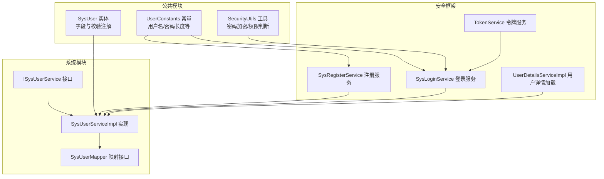
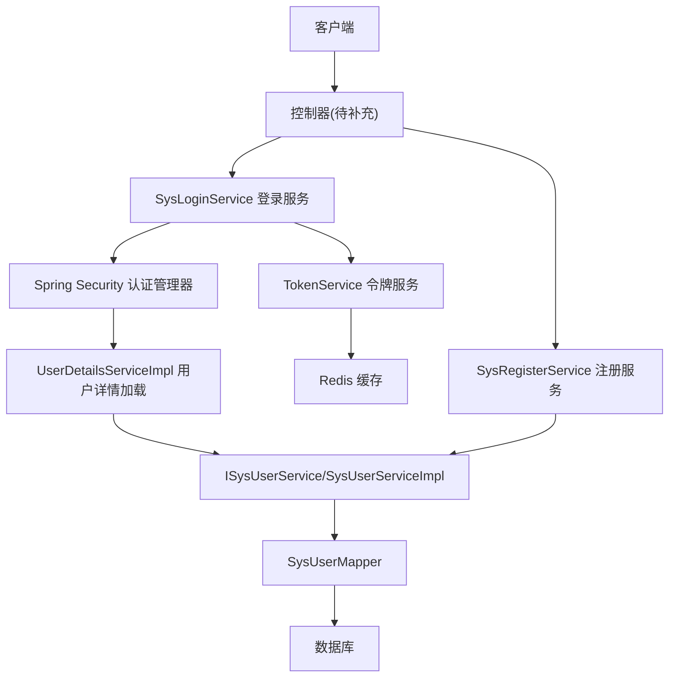
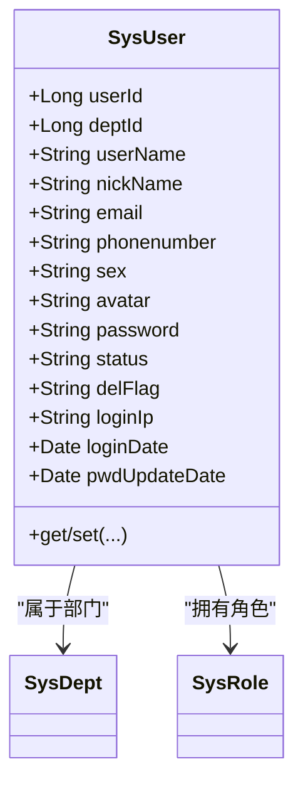
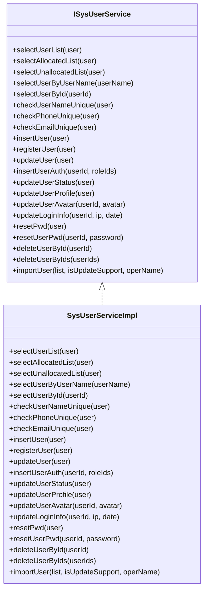
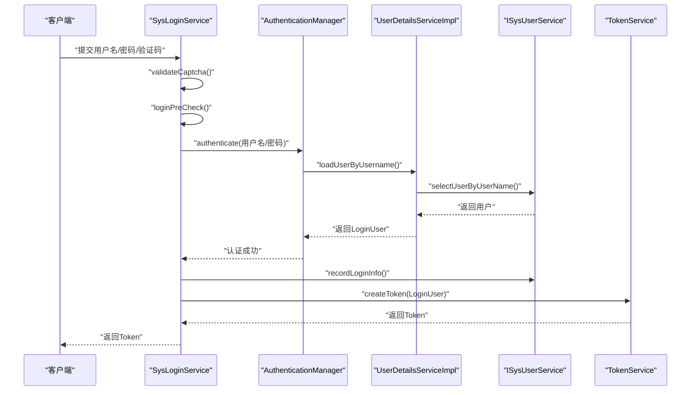
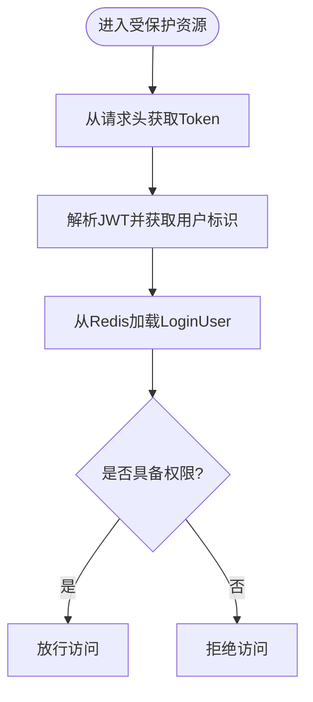
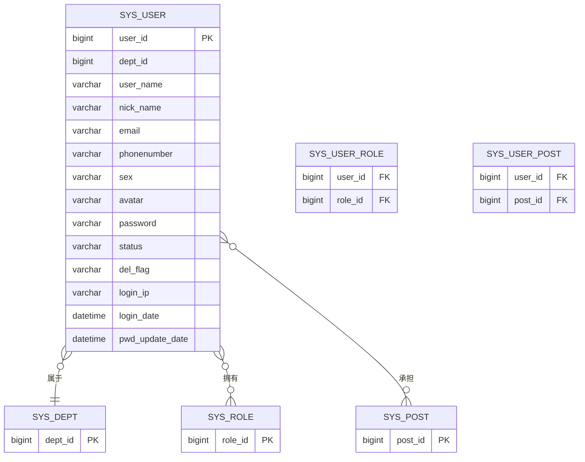
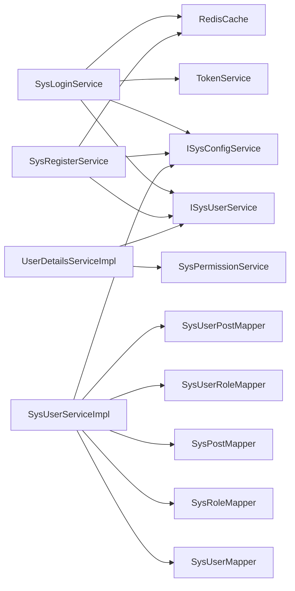

# 用户管理系统

<cite>
**本文引用的文件**
- [SysUser.java](file://XingChen-Vue/xingchen-common/src/main/java/com/xingchen/common/core/domain/entity/SysUser.java)
- [ISysUserService.java](file://XingChen-Vue/xingchen-system/src/main/java/com/xingchen/system/service/ISysUserService.java)
- [SysUserMapper.java](file://XingChen-Vue/xingchen-system/src/main/java/com/xingchen/system/mapper/SysUserMapper.java)
- [SysUserServiceImpl.java](file://XingChen-Vue/xingchen-system/src/main/java/com/xingchen/system/service/impl/SysUserServiceImpl.java)
- [SysRegisterService.java](file://XingChen-Vue/xingchen-framework/src/main/java/com/xingchen/framework/web/service/SysRegisterService.java)
- [SysLoginService.java](file://XingChen-Vue/xingchen-framework/src/main/java/com/xingchen/framework/web/service/SysLoginService.java)
- [UserDetailsServiceImpl.java](file://XingChen-Vue/xingchen-framework/src/main/java/com/xingchen/framework/web/service/UserDetailsServiceImpl.java)
- [TokenService.java](file://XingChen-Vue/xingchen-framework/src/main/java/com/xingchen/framework/web/service/TokenService.java)
- [SecurityUtils.java](file://XingChen-Vue/xingchen-common/src/main/java/com/xingchen/common/utils/SecurityUtils.java)
- [UserConstants.java](file://XingChen-Vue/xingchen-common/src/main/java/com/xingchen/common/constant/UserConstants.java)
</cite>

## 目录
1. [简介](#简介)
2. [项目结构](#项目结构)
3. [核心组件](#核心组件)
4. [架构总览](#架构总览)
5. [详细组件分析](#详细组件分析)
6. [依赖分析](#依赖分析)
7. [性能考虑](#性能考虑)
8. [故障排查指南](#故障排查指南)
9. [结论](#结论)
10. [附录](#附录)

## 简介
本文件面向“用户管理系统”的实现与使用，围绕用户注册、登录认证、权限与角色管理、用户信息维护等核心能力，系统性梳理实体模型、服务层接口、控制器实现与数据库映射关系，并给出数据验证规则、密码加密机制、会话管理策略与数据权限控制方案。同时提供最佳实践、常见问题解决方案与扩展开发指导，帮助开发者快速理解与二次开发。

## 项目结构
用户管理相关代码主要分布在以下模块：
- 实体与常量：xingchen-common（用户实体、常量）
- 系统服务与映射：xingchen-system（用户服务接口与实现、MyBatis Mapper）
- 安全与框架：xingchen-framework（登录/注册服务、Token、用户详情加载）

图表来源
- [SysUser.java:1-337](file://XingChen-Vue/xingchen-common/src/main/java/com/xingchen/common/core/domain/entity/SysUser.java#L1-L337)
- [ISysUserService.java:1-218](file://XingChen-Vue/xingchen-system/src/main/java/com/xingchen/system/service/ISysUserService.java#L1-L218)
- [SysUserMapper.java:1-148](file://XingChen-Vue/xingchen-system/src/main/java/com/xingchen/system/mapper/SysUserMapper.java#L1-L148)
- [SysUserServiceImpl.java:1-566](file://XingChen-Vue/xingchen-system/src/main/java/com/xingchen/system/service/impl/SysUserServiceImpl.java#L1-L566)
- [SysLoginService.java:1-177](file://XingChen-Vue/xingchen-framework/src/main/java/com/xingchen/framework/web/service/SysLoginService.java#L1-L177)
- [SysRegisterService.java:1-118](file://XingChen-Vue/xingchen-framework/src/main/java/com/xingchen/framework/web/service/SysRegisterService.java#L1-L118)
- [UserDetailsServiceImpl.java:1-67](file://XingChen-Vue/xingchen-framework/src/main/java/com/xingchen/framework/web/service/UserDetailsServiceImpl.java#L1-L67)
- [TokenService.java:1-233](file://XingChen-Vue/xingchen-framework/src/main/java/com/xingchen/framework/web/service/TokenService.java#L1-L233)
- [SecurityUtils.java:1-189](file://XingChen-Vue/xingchen-common/src/main/java/com/xingchen/common/utils/SecurityUtils.java#L1-L189)
- [UserConstants.java:1-82](file://XingChen-Vue/xingchen-common/src/main/java/com/xingchen/common/constant/UserConstants.java#L1-L82)

章节来源
- [SysUser.java:1-337](file://XingChen-Vue/xingchen-common/src/main/java/com/xingchen/common/core/domain/entity/SysUser.java#L1-L337)
- [ISysUserService.java:1-218](file://XingChen-Vue/xingchen-system/src/main/java/com/xingchen/system/service/ISysUserService.java#L1-L218)
- [SysUserMapper.java:1-148](file://XingChen-Vue/xingchen-system/src/main/java/com/xingchen/system/mapper/SysUserMapper.java#L1-L148)
- [SysUserServiceImpl.java:1-566](file://XingChen-Vue/xingchen-system/src/main/java/com/xingchen/system/service/impl/SysUserServiceImpl.java#L1-L566)
- [SysLoginService.java:1-177](file://XingChen-Vue/xingchen-framework/src/main/java/com/xingchen/framework/web/service/SysLoginService.java#L1-L177)
- [SysRegisterService.java:1-118](file://XingChen-Vue/xingchen-framework/src/main/java/com/xingchen/framework/web/service/SysRegisterService.java#L1-L118)
- [UserDetailsServiceImpl.java:1-67](file://XingChen-Vue/xingchen-framework/src/main/java/com/xingchen/framework/web/service/UserDetailsServiceImpl.java#L1-L67)
- [TokenService.java:1-233](file://XingChen-Vue/xingchen-framework/src/main/java/com/xingchen/framework/web/service/TokenService.java#L1-L233)
- [SecurityUtils.java:1-189](file://XingChen-Vue/xingchen-common/src/main/java/com/xingchen/common/utils/SecurityUtils.java#L1-L189)
- [UserConstants.java:1-82](file://XingChen-Vue/xingchen-common/src/main/java/com/xingchen/common/constant/UserConstants.java#L1-L82)

## 核心组件
- 用户实体模型：SysUser，包含用户基础字段、部门与角色关联、登录信息、以及基于注解的输入校验。
- 用户服务接口：ISysUserService，定义用户增删改查、角色授权、状态变更、导入导出等业务契约。
- 用户服务实现：SysUserServiceImpl，承载事务与数据权限控制，负责用户与角色/岗位的关联维护。
- 登录与注册服务：SysLoginService、SysRegisterService，分别负责登录校验、验证码校验、前置校验与登录成功后的Token签发；注册流程包含验证码开关、用户名/密码长度校验、唯一性校验与密码加密。
- 用户详情加载：UserDetailsServiceImpl，按用户名加载用户、状态校验、密码有效性校验，并构建登录用户上下文。
- 令牌服务：TokenService，负责JWT生成、解析、续期与Redis缓存，提供会话管理能力。
- 安全工具：SecurityUtils，提供密码加密/匹配、权限/角色判断、当前登录用户信息获取等通用能力。
- 用户常量：UserConstants，统一用户名/密码长度限制与状态枚举等常量。

章节来源
- [SysUser.java:1-337](file://XingChen-Vue/xingchen-common/src/main/java/com/xingchen/common/core/domain/entity/SysUser.java#L1-L337)
- [ISysUserService.java:1-218](file://XingChen-Vue/xingchen-system/src/main/java/com/xingchen/system/service/ISysUserService.java#L1-L218)
- [SysUserServiceImpl.java:1-566](file://XingChen-Vue/xingchen-system/src/main/java/com/xingchen/system/service/impl/SysUserServiceImpl.java#L1-L566)
- [SysLoginService.java:1-177](file://XingChen-Vue/xingchen-framework/src/main/java/com/xingchen/framework/web/service/SysLoginService.java#L1-L177)
- [SysRegisterService.java:1-118](file://XingChen-Vue/xingchen-framework/src/main/java/com/xingchen/framework/web/service/SysRegisterService.java#L1-L118)
- [UserDetailsServiceImpl.java:1-67](file://XingChen-Vue/xingchen-framework/src/main/java/com/xingchen/framework/web/service/UserDetailsServiceImpl.java#L1-L67)
- [TokenService.java:1-233](file://XingChen-Vue/xingchen-framework/src/main/java/com/xingchen/framework/web/service/TokenService.java#L1-L233)
- [SecurityUtils.java:1-189](file://XingChen-Vue/xingchen-common/src/main/java/com/xingchen/common/utils/SecurityUtils.java#L1-L189)
- [UserConstants.java:1-82](file://XingChen-Vue/xingchen-common/src/main/java/com/xingchen/common/constant/UserConstants.java#L1-L82)

## 架构总览
用户管理采用“控制器-服务-数据访问-安全框架”分层架构，结合Spring Security与JWT实现认证鉴权，配合Redis实现会话缓存与验证码存储。

图表来源
- [SysLoginService.java:1-177](file://XingChen-Vue/xingchen-framework/src/main/java/com/xingchen/framework/web/service/SysLoginService.java#L1-L177)
- [SysRegisterService.java:1-118](file://XingChen-Vue/xingchen-framework/src/main/java/com/xingchen/framework/web/service/SysRegisterService.java#L1-L118)
- [UserDetailsServiceImpl.java:1-67](file://XingChen-Vue/xingchen-framework/src/main/java/com/xingchen/framework/web/service/UserDetailsServiceImpl.java#L1-L67)
- [ISysUserService.java:1-218](file://XingChen-Vue/xingchen-system/src/main/java/com/xingchen/system/service/ISysUserService.java#L1-L218)
- [SysUserMapper.java:1-148](file://XingChen-Vue/xingchen-system/src/main/java/com/xingchen/system/mapper/SysUserMapper.java#L1-L148)
- [TokenService.java:1-233](file://XingChen-Vue/xingchen-framework/src/main/java/com/xingchen/framework/web/service/TokenService.java#L1-L233)

## 详细组件分析

### 用户实体模型（SysUser）
- 字段覆盖：用户ID、部门ID、账号、昵称、邮箱、手机、性别、头像、状态、删除标志、登录IP/时间、密码更新时间等。
- 输入校验：通过注解对账号、昵称、邮箱、手机号等字段进行长度与格式校验，并对脚本注入进行XSS防护。
- 关联关系：包含部门与角色集合，便于权限与数据范围查询时使用。
- JSON序列化：密码字段仅写不读，避免敏感信息泄露。

图表来源
- [SysUser.java:1-337](file://XingChen-Vue/xingchen-common/src/main/java/com/xingchen/common/core/domain/entity/SysUser.java#L1-L337)

章节来源
- [SysUser.java:1-337](file://XingChen-Vue/xingchen-common/src/main/java/com/xingchen/common/core/domain/entity/SysUser.java#L1-L337)

### 用户服务层接口与实现（ISysUserService / SysUserServiceImpl）
- 接口职责：用户列表查询（含数据范围注解）、唯一性校验（用户名/手机/邮箱）、新增/修改/删除、角色授权、状态变更、头像更新、登录信息更新、密码重置、批量删除、导入用户等。
- 实现要点：
  - 使用注解驱动的数据权限过滤（@DataScope），确保非超级管理员只能访问其数据范围内的用户。
  - 事务性维护用户与角色、岗位的关联表，保证一致性。
  - 导入流程支持新增或更新模式，结合配置项初始化密码与部门数据范围校验。

图表来源
- [ISysUserService.java:1-218](file://XingChen-Vue/xingchen-system/src/main/java/com/xingchen/system/service/ISysUserService.java#L1-L218)
- [SysUserServiceImpl.java:1-566](file://XingChen-Vue/xingchen-system/src/main/java/com/xingchen/system/service/impl/SysUserServiceImpl.java#L1-L566)

章节来源
- [ISysUserService.java:1-218](file://XingChen-Vue/xingchen-system/src/main/java/com/xingchen/system/service/ISysUserService.java#L1-L218)
- [SysUserServiceImpl.java:1-566](file://XingChen-Vue/xingchen-system/src/main/java/com/xingchen/system/service/impl/SysUserServiceImpl.java#L1-L566)

### 登录与注册流程（SysLoginService / SysRegisterService）
- 登录流程：
  - 验证码校验（可选，由配置开关控制）。
  - 登录前置校验（用户名/密码长度、黑名单IP）。
  - Spring Security 认证，失败抛出特定异常。
  - 成功后记录登录信息，生成Token并返回。
- 注册流程：
  - 验证码校验（可选）。
  - 用户名/密码长度校验与唯一性校验。
  - 密码加密后入库，异步记录注册日志。

图表来源
- [SysLoginService.java:1-177](file://XingChen-Vue/xingchen-framework/src/main/java/com/xingchen/framework/web/service/SysLoginService.java#L1-L177)
- [UserDetailsServiceImpl.java:1-67](file://XingChen-Vue/xingchen-framework/src/main/java/com/xingchen/framework/web/service/UserDetailsServiceImpl.java#L1-L67)
- [ISysUserService.java:1-218](file://XingChen-Vue/xingchen-system/src/main/java/com/xingchen/system/service/ISysUserService.java#L1-L218)
- [TokenService.java:1-233](file://XingChen-Vue/xingchen-framework/src/main/java/com/xingchen/framework/web/service/TokenService.java#L1-L233)

章节来源
- [SysLoginService.java:1-177](file://XingChen-Vue/xingchen-framework/src/main/java/com/xingchen/framework/web/service/SysLoginService.java#L1-L177)
- [SysRegisterService.java:1-118](file://XingChen-Vue/xingchen-framework/src/main/java/com/xingchen/framework/web/service/SysRegisterService.java#L1-L118)
- [UserDetailsServiceImpl.java:1-67](file://XingChen-Vue/xingchen-framework/src/main/java/com/xingchen/framework/web/service/UserDetailsServiceImpl.java#L1-L67)
- [TokenService.java:1-233](file://XingChen-Vue/xingchen-framework/src/main/java/com/xingchen/framework/web/service/TokenService.java#L1-L233)

### 会话与权限管理（TokenService / SecurityUtils / UserDetailsServiceImpl）
- 令牌生成与解析：使用JWT签名算法生成令牌，结合Redis缓存用户上下文，支持过期续期。
- 权限判断：通过SecurityUtils提供的hasPermi/hasRole方法进行细粒度权限校验。
- 用户详情加载：UserDetailsServiceImpl按用户名加载用户，校验状态与删除标志，执行密码有效性校验，构建LoginUser上下文。

图表来源
- [TokenService.java:1-233](file://XingChen-Vue/xingchen-framework/src/main/java/com/xingchen/framework/web/service/TokenService.java#L1-L233)
- [SecurityUtils.java:1-189](file://XingChen-Vue/xingchen-common/src/main/java/com/xingchen/common/utils/SecurityUtils.java#L1-L189)

章节来源
- [TokenService.java:1-233](file://XingChen-Vue/xingchen-framework/src/main/java/com/xingchen/framework/web/service/TokenService.java#L1-L233)
- [SecurityUtils.java:1-189](file://XingChen-Vue/xingchen-common/src/main/java/com/xingchen/common/utils/SecurityUtils.java#L1-L189)
- [UserDetailsServiceImpl.java:1-67](file://XingChen-Vue/xingchen-framework/src/main/java/com/xingchen/framework/web/service/UserDetailsServiceImpl.java#L1-L67)

### 数据库映射关系（SysUserMapper）
- 提供用户列表查询、唯一性校验、新增/修改/删除、登录信息更新、密码重置、头像更新、状态更新等SQL映射。
- 支持分页与条件查询，配合服务层的数据范围注解实现数据权限过滤。

图表来源
- [SysUserMapper.java:1-148](file://XingChen-Vue/xingchen-system/src/main/java/com/xingchen/system/mapper/SysUserMapper.java#L1-L148)

章节来源
- [SysUserMapper.java:1-148](file://XingChen-Vue/xingchen-system/src/main/java/com/xingchen/system/mapper/SysUserMapper.java#L1-L148)

## 依赖分析
- 组件耦合：
  - SysLoginService依赖TokenService、ISysUserService、ISysConfigService与Redis缓存。
  - SysRegisterService依赖ISysUserService、ISysConfigService与Redis缓存。
  - SysUserServiceImpl依赖多个Mapper与配置服务，承担事务与数据权限控制。
  - UserDetailsServiceImpl依赖ISysUserService与权限服务，构建登录上下文。
- 外部依赖：
  - Spring Security用于认证与授权。
  - JWT用于令牌签名与解析。
  - Redis用于缓存登录用户上下文与验证码。

图表来源
- [SysLoginService.java:1-177](file://XingChen-Vue/xingchen-framework/src/main/java/com/xingchen/framework/web/service/SysLoginService.java#L1-L177)
- [SysRegisterService.java:1-118](file://XingChen-Vue/xingchen-framework/src/main/java/com/xingchen/framework/web/service/SysRegisterService.java#L1-L118)
- [SysUserServiceImpl.java:1-566](file://XingChen-Vue/xingchen-system/src/main/java/com/xingchen/system/service/impl/SysUserServiceImpl.java#L1-L566)
- [UserDetailsServiceImpl.java:1-67](file://XingChen-Vue/xingchen-framework/src/main/java/com/xingchen/framework/web/service/UserDetailsServiceImpl.java#L1-L67)

章节来源
- [SysLoginService.java:1-177](file://XingChen-Vue/xingchen-framework/src/main/java/com/xingchen/framework/web/service/SysLoginService.java#L1-L177)
- [SysRegisterService.java:1-118](file://XingChen-Vue/xingchen-framework/src/main/java/com/xingchen/framework/web/service/SysRegisterService.java#L1-L118)
- [SysUserServiceImpl.java:1-566](file://XingChen-Vue/xingchen-system/src/main/java/com/xingchen/system/service/impl/SysUserServiceImpl.java#L1-L566)
- [UserDetailsServiceImpl.java:1-67](file://XingChen-Vue/xingchen-framework/src/main/java/com/xingchen/framework/web/service/UserDetailsServiceImpl.java#L1-L67)

## 性能考虑
- 事务边界：用户角色/岗位关联的新增/删除均在事务内完成，避免脏数据。
- 数据权限：通过注解驱动的数据范围过滤，减少不必要的全表扫描。
- 缓存策略：登录用户上下文与验证码使用Redis缓存，降低数据库压力。
- 密码加密：采用BCrypt，兼顾安全性与性能。
- 分页查询：列表查询支持分页，避免一次性加载大量数据。

## 故障排查指南
- 登录失败
  - 验证码错误或过期：检查验证码开关与Redis缓存键值。
  - 用户名或密码长度不符：核对UserConstants中的长度限制。
  - 黑名单IP拦截：检查配置项中的黑名单列表。
- 注册失败
  - 用户名重复：检查唯一性校验逻辑。
  - 密码加密异常：确认密码加密工具调用。
- 权限不足
  - 使用SecurityUtils.hasPermi/hasRole进行权限判断。
  - 确认用户角色与菜单权限是否正确配置。
- 会话失效
  - 检查Token有效期与续期逻辑。
  - 确认Redis中用户缓存是否被清理。

章节来源
- [SysLoginService.java:1-177](file://XingChen-Vue/xingchen-framework/src/main/java/com/xingchen/framework/web/service/SysLoginService.java#L1-L177)
- [SysRegisterService.java:1-118](file://XingChen-Vue/xingchen-framework/src/main/java/com/xingchen/framework/web/service/SysRegisterService.java#L1-L118)
- [SecurityUtils.java:1-189](file://XingChen-Vue/xingchen-common/src/main/java/com/xingchen/common/utils/SecurityUtils.java#L1-L189)
- [TokenService.java:1-233](file://XingChen-Vue/xingchen-framework/src/main/java/com/xingchen/framework/web/service/TokenService.java#L1-L233)

## 结论
本用户管理系统以清晰的分层架构与完善的认证授权机制为基础，结合Redis与JWT实现了高效的会话管理，通过数据权限注解与服务层事务保障了数据一致性与安全性。遵循本文档的最佳实践与扩展指导，可在保证安全性的前提下快速迭代用户相关功能。

## 附录
- 最佳实践
  - 严格使用UserConstants中的长度限制与状态枚举。
  - 在新增/修改用户时，同步维护角色与岗位关联。
  - 对外部暴露的接口统一进行参数校验与权限校验。
  - 合理设置Token有效期与续期阈值，平衡安全与体验。
- 常见问题
  - 验证码未生效：检查验证码开关与Redis键前缀。
  - 密码无法匹配：确认使用BCrypt加密与匹配。
  - 数据越权访问：检查数据范围注解与权限配置。
- 扩展开发
  - 新增用户字段：在SysUser实体与Mapper中同步扩展。
  - 自定义权限：在权限服务中扩展权限表达式与菜单配置。
  - 会话策略：根据业务调整Token有效期与续期策略。