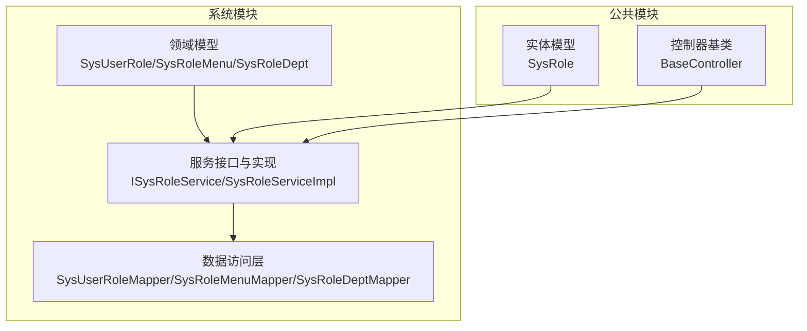
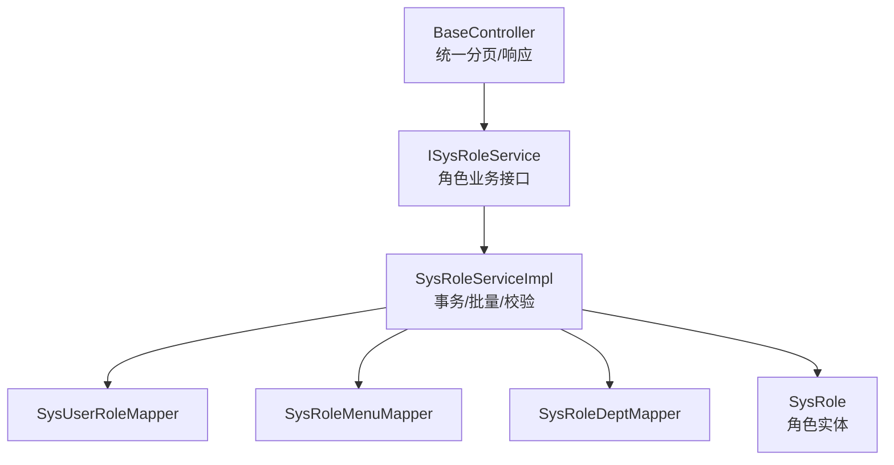
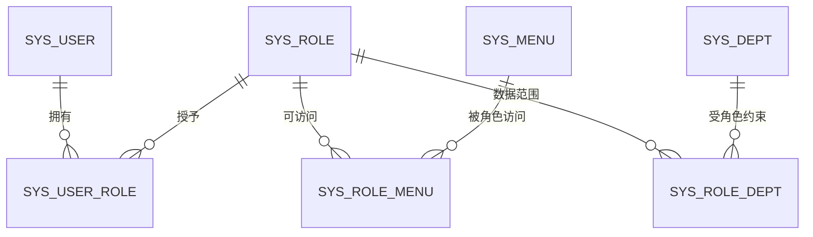
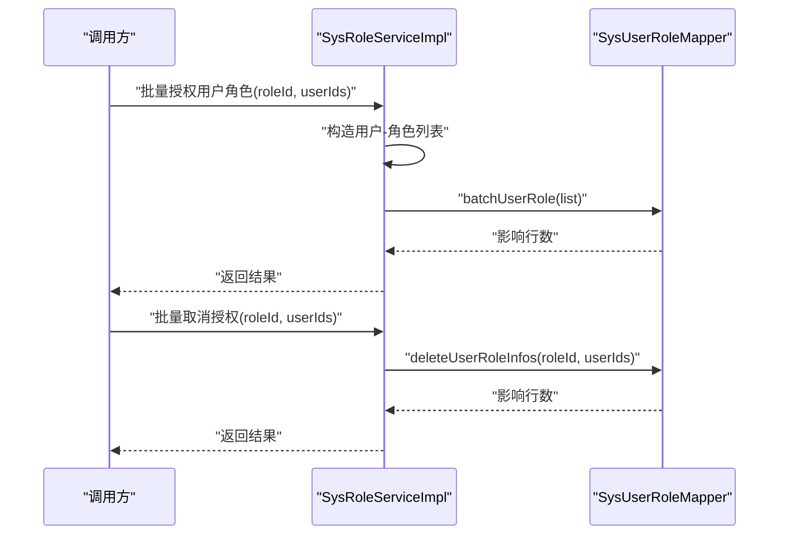
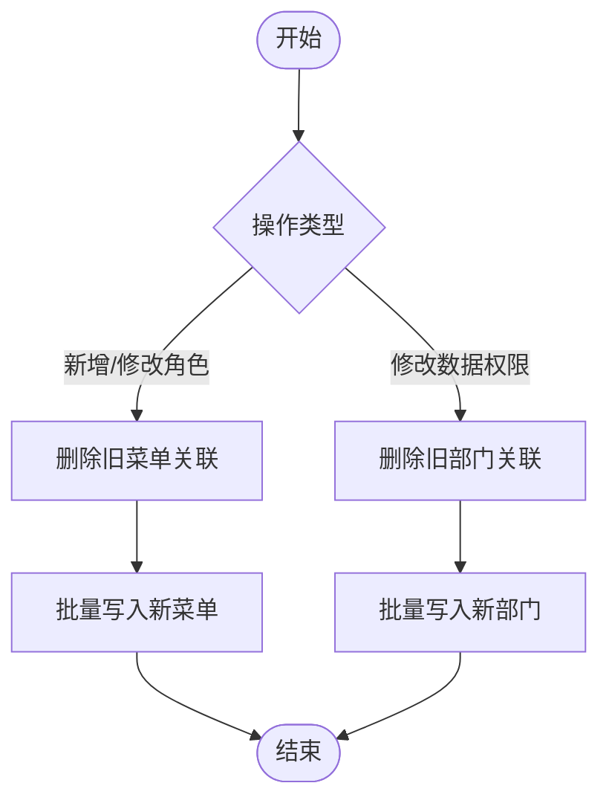
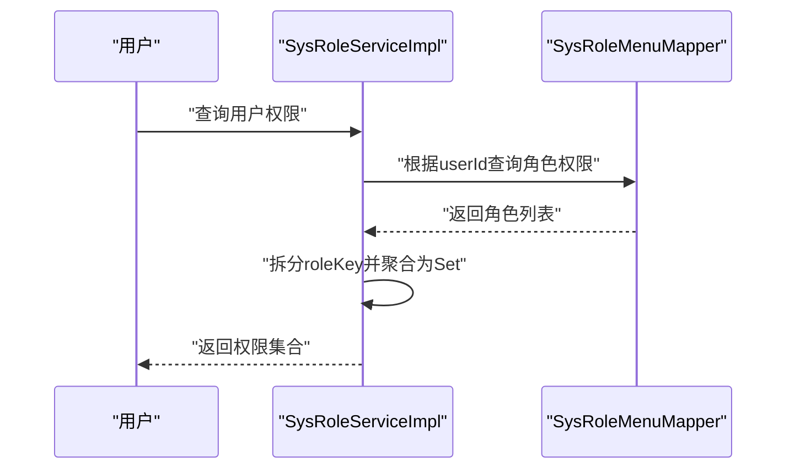
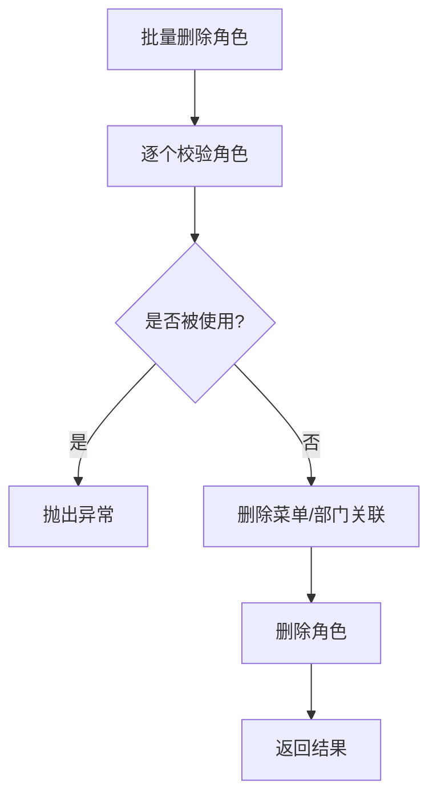
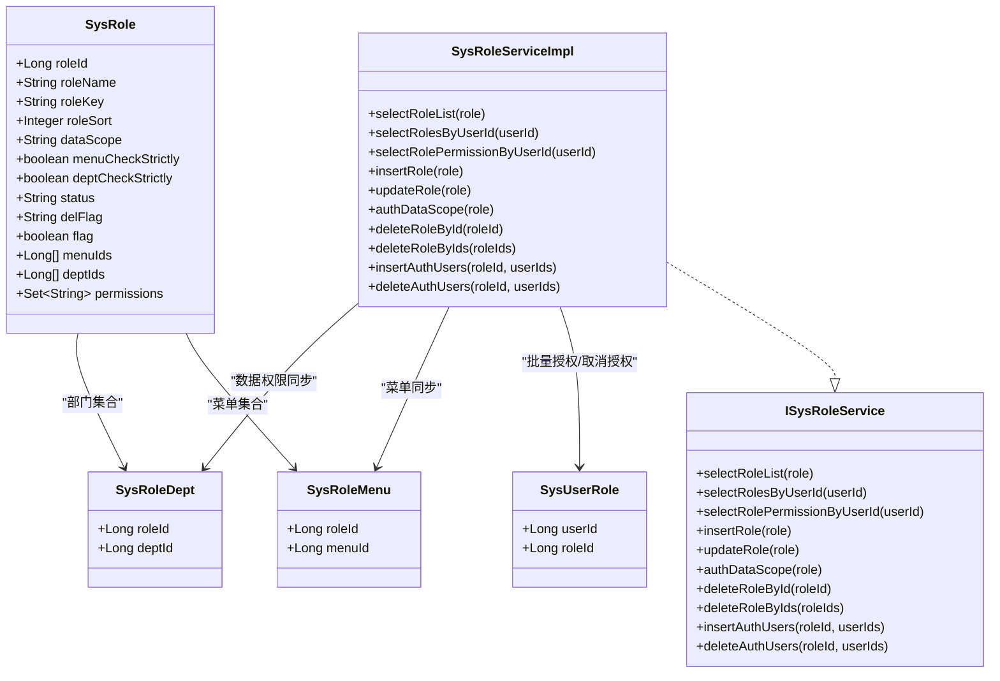
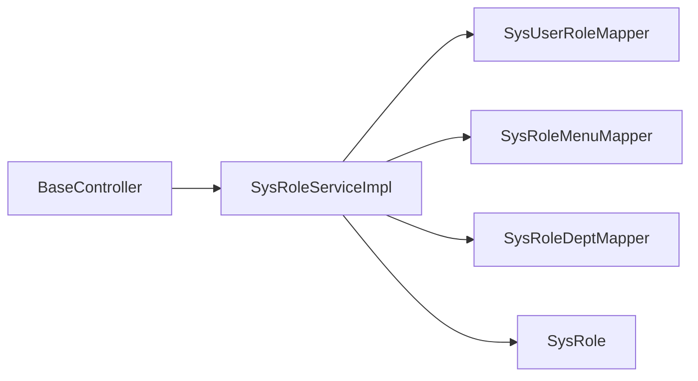

# 用户角色管理

<cite>
**本文引用的文件**
- [SysUserRole.java](file://XingChen-Vue/xingchen-system/src/main/java/com/xingchen/system/domain/SysUserRole.java)
- [SysRoleMenu.java](file://XingChen-Vue/xingchen-system/src/main/java/com/xingchen/system/domain/SysRoleMenu.java)
- [SysRoleDept.java](file://XingChen-Vue/xingchen-system/src/main/java/com/xingchen/system/domain/SysRoleDept.java)
- [ISysRoleService.java](file://XingChen-Vue/xingchen-system/src/main/java/com/xingchen/system/service/ISysRoleService.java)
- [SysRoleServiceImpl.java](file://XingChen-Vue/xingchen-system/src/main/java/com/xingchen/system/service/impl/SysRoleServiceImpl.java)
- [SysUserRoleMapper.java](file://XingChen-Vue/xingchen-system/src/main/java/com/xingchen/system/mapper/SysUserRoleMapper.java)
- [SysRoleMenuMapper.java](file://XingChen-Vue/xingchen-system/src/main/java/com/xingchen/system/mapper/SysRoleMenuMapper.java)
- [SysRoleDeptMapper.java](file://XingChen-Vue/xingchen-system/src/main/java/com/xingchen/system/mapper/SysRoleDeptMapper.java)
- [SysRole.java](file://XingChen-Vue/xingchen-common/src/main/java/com/xingchen/common/core/domain/entity/SysRole.java)
- [BaseController.java](file://XingChen-Vue/xingchen-common/src/main/java/com/xingchen/common/core/controller/BaseController.java)
</cite>

## 目录
1. [简介](#简介)
2. [项目结构](#项目结构)
3. [核心组件](#核心组件)
4. [架构总览](#架构总览)
5. [详细组件分析](#详细组件分析)
6. [依赖分析](#依赖分析)
7. [性能考虑](#性能考虑)
8. [故障排查指南](#故障排查指南)
9. [结论](#结论)
10. [附录](#附录)

## 简介
本文件围绕“用户角色管理”主题，系统化梳理后端角色与用户、菜单、部门之间的多对多关系模型，以及角色授权、权限继承、批量分配、权限验证与数据一致性保障等核心能力。文档同时给出流程图、类图、时序图与最佳实践建议，帮助开发者与运维人员快速理解并高效维护角色权限体系。

## 项目结构
角色管理相关代码主要分布在系统模块与公共模块中：
- 领域模型：用户-角色、角色-菜单、角色-部门的关联实体
- 服务接口与实现：角色业务逻辑、事务控制、批量操作
- 数据访问层：关联表的增删改查与批量操作
- 控制器基类：统一分页、返回封装与用户上下文获取

图表来源
- [SysUserRole.java:1-47](file://XingChen-Vue/xingchen-system/src/main/java/com/xingchen/system/domain/SysUserRole.java#L1-L47)
- [SysRoleMenu.java:1-47](file://XingChen-Vue/xingchen-system/src/main/java/com/xingchen/system/domain/SysRoleMenu.java#L1-L47)
- [SysRoleDept.java:1-47](file://XingChen-Vue/xingchen-system/src/main/java/com/xingchen/system/domain/SysRoleDept.java#L1-L47)
- [ISysRoleService.java:1-174](file://XingChen-Vue/xingchen-system/src/main/java/com/xingchen/system/service/ISysRoleService.java#L1-L174)
- [SysRoleServiceImpl.java:1-427](file://XingChen-Vue/xingchen-system/src/main/java/com/xingchen/system/service/impl/SysRoleServiceImpl.java#L1-L427)
- [SysUserRoleMapper.java:1-63](file://XingChen-Vue/xingchen-system/src/main/java/com/xingchen/system/mapper/SysUserRoleMapper.java#L1-L63)
- [SysRoleMenuMapper.java:1-45](file://XingChen-Vue/xingchen-system/src/main/java/com/xingchen/system/mapper/SysRoleMenuMapper.java#L1-L45)
- [SysRoleDeptMapper.java:1-45](file://XingChen-Vue/xingchen-system/src/main/java/com/xingchen/system/mapper/SysRoleDeptMapper.java#L1-L45)
- [SysRole.java:1-242](file://XingChen-Vue/xingchen-common/src/main/java/com/xingchen/common/core/domain/entity/SysRole.java#L1-L242)
- [BaseController.java:1-203](file://XingChen-Vue/xingchen-common/src/main/java/com/xingchen/common/core/controller/BaseController.java#L1-L203)

章节来源
- [SysUserRole.java:1-47](file://XingChen-Vue/xingchen-system/src/main/java/com/xingchen/system/domain/SysUserRole.java#L1-L47)
- [SysRoleMenu.java:1-47](file://XingChen-Vue/xingchen-system/src/main/java/com/xingchen/system/domain/SysRoleMenu.java#L1-L47)
- [SysRoleDept.java:1-47](file://XingChen-Vue/xingchen-system/src/main/java/com/xingchen/system/domain/SysRoleDept.java#L1-L47)
- [ISysRoleService.java:1-174](file://XingChen-Vue/xingchen-system/src/main/java/com/xingchen/system/service/ISysRoleService.java#L1-L174)
- [SysRoleServiceImpl.java:1-427](file://XingChen-Vue/xingchen-system/src/main/java/com/xingchen/system/service/impl/SysRoleServiceImpl.java#L1-L427)
- [SysUserRoleMapper.java:1-63](file://XingChen-Vue/xingchen-system/src/main/java/com/xingchen/system/mapper/SysUserRoleMapper.java#L1-L63)
- [SysRoleMenuMapper.java:1-45](file://XingChen-Vue/xingchen-system/src/main/java/com/xingchen/system/mapper/SysRoleMenuMapper.java#L1-L45)
- [SysRoleDeptMapper.java:1-45](file://XingChen-Vue/xingchen-system/src/main/java/com/xingchen/system/mapper/SysRoleDeptMapper.java#L1-L45)
- [SysRole.java:1-242](file://XingChen-Vue/xingchen-common/src/main/java/com/xingchen/common/core/domain/entity/SysRole.java#L1-L242)
- [BaseController.java:1-203](file://XingChen-Vue/xingchen-common/src/main/java/com/xingchen/common/core/controller/BaseController.java#L1-L203)

## 核心组件
- 关联实体
  - 用户-角色：用于记录用户与角色的多对多关系
  - 角色-菜单：用于记录角色可访问的菜单集合
  - 角色-部门：用于记录角色的数据权限范围（数据权限）
- 服务接口与实现
  - 提供角色查询、校验、新增/修改/删除、授权与取消授权、批量操作等能力
  - 使用事务注解确保角色变更的原子性
- 数据访问层
  - 提供批量插入、批量删除、计数统计等方法，支撑高并发场景
- 实体模型
  - 角色实体包含角色基本信息、数据范围、菜单/部门数组、权限集合等字段

章节来源
- [SysUserRole.java:11-45](file://XingChen-Vue/xingchen-system/src/main/java/com/xingchen/system/domain/SysUserRole.java#L11-L45)
- [SysRoleMenu.java:11-45](file://XingChen-Vue/xingchen-system/src/main/java/com/xingchen/system/domain/SysRoleMenu.java#L11-L45)
- [SysRoleDept.java:11-45](file://XingChen-Vue/xingchen-system/src/main/java/com/xingchen/system/domain/SysRoleDept.java#L11-L45)
- [ISysRoleService.java:13-173](file://XingChen-Vue/xingchen-system/src/main/java/com/xingchen/system/service/ISysRoleService.java#L13-L173)
- [SysRoleServiceImpl.java:32-426](file://XingChen-Vue/xingchen-system/src/main/java/com/xingchen/system/service/impl/SysRoleServiceImpl.java#L32-L426)
- [SysUserRoleMapper.java:12-62](file://XingChen-Vue/xingchen-system/src/main/java/com/xingchen/system/mapper/SysUserRoleMapper.java#L12-L62)
- [SysRoleMenuMapper.java:11-44](file://XingChen-Vue/xingchen-system/src/main/java/com/xingchen/system/mapper/SysRoleMenuMapper.java#L11-L44)
- [SysRoleDeptMapper.java:11-44](file://XingChen-Vue/xingchen-system/src/main/java/com/xingchen/system/mapper/SysRoleDeptMapper.java#L11-L44)
- [SysRole.java:18-241](file://XingChen-Vue/xingchen-common/src/main/java/com/xingchen/common/core/domain/entity/SysRole.java#L18-L241)

## 架构总览
角色管理采用经典的分层架构：
- 表现层：控制器基类提供统一的分页与响应封装
- 业务层：角色服务接口与实现负责权限聚合、批量操作与事务控制
- 数据层：Mapper 负责与数据库交互，支持批量插入/删除
- 领域模型：实体与关联表模型承载角色、菜单、部门与用户的关系

图表来源
- [BaseController.java:29-202](file://XingChen-Vue/xingchen-common/src/main/java/com/xingchen/common/core/controller/BaseController.java#L29-L202)
- [ISysRoleService.java:13-173](file://XingChen-Vue/xingchen-system/src/main/java/com/xingchen/system/service/ISysRoleService.java#L13-L173)
- [SysRoleServiceImpl.java:32-426](file://XingChen-Vue/xingchen-system/src/main/java/com/xingchen/system/service/impl/SysRoleServiceImpl.java#L32-L426)
- [SysUserRoleMapper.java:12-62](file://XingChen-Vue/xingchen-system/src/main/java/com/xingchen/system/mapper/SysUserRoleMapper.java#L12-L62)
- [SysRoleMenuMapper.java:11-44](file://XingChen-Vue/xingchen-system/src/main/java/com/xingchen/system/mapper/SysRoleMenuMapper.java#L11-L44)
- [SysRoleDeptMapper.java:11-44](file://XingChen-Vue/xingchen-system/src/main/java/com/xingchen/system/mapper/SysRoleDeptMapper.java#L11-L44)
- [SysRole.java:18-241](file://XingChen-Vue/xingchen-common/src/main/java/com/xingchen/common/core/domain/entity/SysRole.java#L18-L241)

## 详细组件分析

### 多对多关系建模与权限继承
- 用户-角色：用户可拥有多个角色，角色可授予多个用户
- 角色-菜单：角色可访问多个菜单，菜单可被多个角色访问
- 角色-部门：角色可限定在多个部门范围内进行数据访问（数据权限）
- 权限继承：角色权限由其关联的菜单集合决定，服务层将角色的权限键按逗号拆分聚合为集合，形成“继承”的效果

图表来源
- [SysUserRole.java:11-45](file://XingChen-Vue/xingchen-system/src/main/java/com/xingchen/system/domain/SysUserRole.java#L11-L45)
- [SysRoleMenu.java:11-45](file://XingChen-Vue/xingchen-system/src/main/java/com/xingchen/system/domain/SysRoleMenu.java#L11-L45)
- [SysRoleDept.java:11-45](file://XingChen-Vue/xingchen-system/src/main/java/com/xingchen/system/domain/SysRoleDept.java#L11-L45)

章节来源
- [SysUserRole.java:11-45](file://XingChen-Vue/xingchen-system/src/main/java/com/xingchen/system/domain/SysUserRole.java#L11-L45)
- [SysRoleMenu.java:11-45](file://XingChen-Vue/xingchen-system/src/main/java/com/xingchen/system/domain/SysRoleMenu.java#L11-L45)
- [SysRoleDept.java:11-45](file://XingChen-Vue/xingchen-system/src/main/java/com/xingchen/system/domain/SysRoleDept.java#L11-L45)
- [SysRoleServiceImpl.java:91-104](file://XingChen-Vue/xingchen-system/src/main/java/com/xingchen/system/service/impl/SysRoleServiceImpl.java#L91-L104)

### 角色授权与取消授权流程
- 授权用户角色：根据角色ID与用户ID列表批量插入用户-角色关联
- 取消授权用户角色：支持单条或批量删除用户-角色关联
- 服务层提供事务包装，确保授权/取消授权的原子性

图表来源
- [SysRoleServiceImpl.java:412-425](file://XingChen-Vue/xingchen-system/src/main/java/com/xingchen/system/service/impl/SysRoleServiceImpl.java#L412-L425)
- [SysUserRoleMapper.java:44-61](file://XingChen-Vue/xingchen-system/src/main/java/com/xingchen/system/mapper/SysUserRoleMapper.java#L44-L61)

章节来源
- [SysRoleServiceImpl.java:386-403](file://XingChen-Vue/xingchen-system/src/main/java/com/xingchen/system/service/impl/SysRoleServiceImpl.java#L386-L403)
- [SysRoleServiceImpl.java:412-425](file://XingChen-Vue/xingchen-system/src/main/java/com/xingchen/system/service/impl/SysRoleServiceImpl.java#L412-L425)
- [SysUserRoleMapper.java:44-61](file://XingChen-Vue/xingchen-system/src/main/java/com/xingchen/system/mapper/SysUserRoleMapper.java#L44-L61)

### 角色菜单与数据权限同步
- 新增/修改角色时，先删除旧的菜单关联，再批量写入新的菜单集合
- 修改数据权限时，删除旧的部门关联，再批量写入新的部门集合
- 该流程确保角色的菜单与数据权限与输入保持一致

图表来源
- [SysRoleServiceImpl.java:247-256](file://XingChen-Vue/xingchen-system/src/main/java/com/xingchen/system/service/impl/SysRoleServiceImpl.java#L247-L256)
- [SysRoleServiceImpl.java:276-286](file://XingChen-Vue/xingchen-system/src/main/java/com/xingchen/system/service/impl/SysRoleServiceImpl.java#L276-L286)
- [SysRoleMenuMapper.java:27-43](file://XingChen-Vue/xingchen-system/src/main/java/com/xingchen/system/mapper/SysRoleMenuMapper.java#L27-L43)
- [SysRoleDeptMapper.java:18-43](file://XingChen-Vue/xingchen-system/src/main/java/com/xingchen/system/mapper/SysRoleDeptMapper.java#L18-L43)

章节来源
- [SysRoleServiceImpl.java:247-256](file://XingChen-Vue/xingchen-system/src/main/java/com/xingchen/system/service/impl/SysRoleServiceImpl.java#L247-L256)
- [SysRoleServiceImpl.java:276-286](file://XingChen-Vue/xingchen-system/src/main/java/com/xingchen/system/service/impl/SysRoleServiceImpl.java#L276-L286)
- [SysRoleMenuMapper.java:27-43](file://XingChen-Vue/xingchen-system/src/main/java/com/xingchen/system/mapper/SysRoleMenuMapper.java#L27-L43)
- [SysRoleDeptMapper.java:18-43](file://XingChen-Vue/xingchen-system/src/main/java/com/xingchen/system/mapper/SysRoleDeptMapper.java#L18-L43)

### 权限验证与数据一致性
- 权限验证：服务层从角色关联中提取权限键，按逗号拆分并聚合为集合，作为当前用户的权限集
- 数据一致性：所有角色变更均在事务内执行，避免部分更新导致的状态不一致
- 数据范围校验：非超级管理员需具备对应角色的数据范围权限，否则抛出异常

图表来源
- [SysRoleServiceImpl.java:91-104](file://XingChen-Vue/xingchen-system/src/main/java/com/xingchen/system/service/impl/SysRoleServiceImpl.java#L91-L104)
- [SysRoleMenuMapper.java:19-43](file://XingChen-Vue/xingchen-system/src/main/java/com/xingchen/system/mapper/SysRoleMenuMapper.java#L19-L43)

章节来源
- [SysRoleServiceImpl.java:91-104](file://XingChen-Vue/xingchen-system/src/main/java/com/xingchen/system/service/impl/SysRoleServiceImpl.java#L91-L104)
- [SysRoleServiceImpl.java:196-212](file://XingChen-Vue/xingchen-system/src/main/java/com/xingchen/system/service/impl/SysRoleServiceImpl.java#L196-L212)

### 批量角色分配与删除策略
- 批量分配：接收角色ID与用户ID数组，构造用户-角色列表并批量插入
- 批量删除：对角色进行合法性检查（如是否被使用）、数据范围校验后，删除菜单/部门关联与角色本身
- 计数与校验：删除前统计用户使用情况，避免误删

图表来源
- [SysRoleServiceImpl.java:359-378](file://XingChen-Vue/xingchen-system/src/main/java/com/xingchen/system/service/impl/SysRoleServiceImpl.java#L359-L378)
- [SysUserRoleMapper.java:30-36](file://XingChen-Vue/xingchen-system/src/main/java/com/xingchen/system/mapper/SysUserRoleMapper.java#L30-L36)

章节来源
- [SysRoleServiceImpl.java:359-378](file://XingChen-Vue/xingchen-system/src/main/java/com/xingchen/system/service/impl/SysRoleServiceImpl.java#L359-L378)
- [SysUserRoleMapper.java:30-36](file://XingChen-Vue/xingchen-system/src/main/java/com/xingchen/system/mapper/SysUserRoleMapper.java#L30-L36)

### 类图：角色相关核心类

图表来源
- [SysUserRole.java:11-45](file://XingChen-Vue/xingchen-system/src/main/java/com/xingchen/system/domain/SysUserRole.java#L11-L45)
- [SysRoleMenu.java:11-45](file://XingChen-Vue/xingchen-system/src/main/java/com/xingchen/system/domain/SysRoleMenu.java#L11-L45)
- [SysRoleDept.java:11-45](file://XingChen-Vue/xingchen-system/src/main/java/com/xingchen/system/domain/SysRoleDept.java#L11-L45)
- [SysRole.java:18-241](file://XingChen-Vue/xingchen-common/src/main/java/com/xingchen/common/core/domain/entity/SysRole.java#L18-L241)
- [ISysRoleService.java:13-173](file://XingChen-Vue/xingchen-system/src/main/java/com/xingchen/system/service/ISysRoleService.java#L13-L173)
- [SysRoleServiceImpl.java:32-426](file://XingChen-Vue/xingchen-system/src/main/java/com/xingchen/system/service/impl/SysRoleServiceImpl.java#L32-L426)

## 依赖分析
- 组件耦合
  - 服务实现依赖三个 Mapper（用户-角色、角色-菜单、角色-部门），职责清晰、内聚度高
  - 角色实体作为跨层载体，向上承接服务层，向下承载数据层
- 外部依赖
  - 分页与响应封装来自公共模块基类
  - 事务控制由 Spring 注解提供，保证批量操作的一致性

图表来源
- [SysRoleServiceImpl.java:32-426](file://XingChen-Vue/xingchen-system/src/main/java/com/xingchen/system/service/impl/SysRoleServiceImpl.java#L32-L426)
- [SysUserRoleMapper.java:12-62](file://XingChen-Vue/xingchen-system/src/main/java/com/xingchen/system/mapper/SysUserRoleMapper.java#L12-L62)
- [SysRoleMenuMapper.java:11-44](file://XingChen-Vue/xingchen-system/src/main/java/com/xingchen/system/mapper/SysRoleMenuMapper.java#L11-L44)
- [SysRoleDeptMapper.java:11-44](file://XingChen-Vue/xingchen-system/src/main/java/com/xingchen/system/mapper/SysRoleDeptMapper.java#L11-L44)
- [SysRole.java:18-241](file://XingChen-Vue/xingchen-common/src/main/java/com/xingchen/common/core/domain/entity/SysRole.java#L18-L241)
- [BaseController.java:29-202](file://XingChen-Vue/xingchen-common/src/main/java/com/xingchen/common/core/controller/BaseController.java#L29-L202)

章节来源
- [SysRoleServiceImpl.java:32-426](file://XingChen-Vue/xingchen-system/src/main/java/com/xingchen/system/service/impl/SysRoleServiceImpl.java#L32-L426)
- [BaseController.java:29-202](file://XingChen-Vue/xingchen-common/src/main/java/com/xingchen/common/core/controller/BaseController.java#L29-L202)

## 性能考虑
- 批量操作
  - 用户-角色、角色-菜单、角色-部门均提供批量插入/删除接口，减少多次往返数据库的开销
- 事务边界
  - 新增/修改角色、授权/取消授权、修改数据权限等均置于事务内，避免中间态
- 权限聚合
  - 服务层一次性聚合权限集合，避免重复查询与拼接
- 分页与排序
  - 控制器基类提供统一分页与排序封装，降低重复代码与错误风险

章节来源
- [SysUserRoleMapper.java:44-44](file://XingChen-Vue/xingchen-system/src/main/java/com/xingchen/system/mapper/SysUserRoleMapper.java#L44-L44)
- [SysRoleMenuMapper.java:43-43](file://XingChen-Vue/xingchen-system/src/main/java/com/xingchen/system/mapper/SysRoleMenuMapper.java#L43-L43)
- [SysRoleDeptMapper.java:43-43](file://XingChen-Vue/xingchen-system/src/main/java/com/xingchen/system/mapper/SysRoleDeptMapper.java#L43-L43)
- [SysRoleServiceImpl.java:233-239](file://XingChen-Vue/xingchen-system/src/main/java/com/xingchen/system/service/impl/SysRoleServiceImpl.java#L233-L239)
- [BaseController.java:53-69](file://XingChen-Vue/xingchen-common/src/main/java/com/xingchen/common/core/controller/BaseController.java#L53-L69)

## 故障排查指南
- 删除角色失败
  - 现象：提示“已分配，不能删除”
  - 原因：角色仍有关联用户
  - 处理：先批量取消授权，再删除角色
- 权限不足
  - 现象：提示“没有权限访问角色数据”
  - 原因：非超级管理员尝试访问无数据范围权限的角色
  - 处理：确认当前用户是否具备相应角色的数据范围权限
- 授权/取消授权无效
  - 现象：用户角色未更新
  - 原因：未在事务内执行或参数不正确
  - 处理：确认调用路径使用服务层方法且传入正确的角色ID与用户ID数组

章节来源
- [SysRoleServiceImpl.java:368-372](file://XingChen-Vue/xingchen-system/src/main/java/com/xingchen/system/service/impl/SysRoleServiceImpl.java#L368-L372)
- [SysRoleServiceImpl.java:196-212](file://XingChen-Vue/xingchen-system/src/main/java/com/xingchen/system/service/impl/SysRoleServiceImpl.java#L196-L212)
- [SysRoleServiceImpl.java:386-403](file://XingChen-Vue/xingchen-system/src/main/java/com/xingchen/system/service/impl/SysRoleServiceImpl.java#L386-L403)

## 结论
本角色管理方案以清晰的多对多关系模型为基础，结合服务层的事务控制与批量操作能力，实现了角色授权、权限继承、数据权限同步与一致性保障。通过统一的控制器基类与权限聚合逻辑，系统在易用性与性能之间取得良好平衡。建议在生产环境中配合缓存与审计日志进一步增强可观测性与稳定性。

## 附录
- 最佳实践
  - 批量操作优先使用服务层提供的批量方法，避免逐条调用
  - 删除角色前先检查使用情况，必要时先批量取消授权
  - 修改角色菜单或数据权限时，遵循“清空旧关联+批量写入”的流程
  - 对关键角色（如超级管理员）增加额外校验，防止越权操作
- 权限冲突解决方案
  - 若出现权限冲突，优先以“角色-菜单”为准，确保最小权限原则
  - 对于数据权限冲突，明确角色的数据范围配置，避免跨部门访问
- 性能优化建议
  - 在高频授权/取消授权场景下，合理设置批量大小，避免单次批量过大
  - 对权限查询结果进行短期缓存，减少重复聚合计算