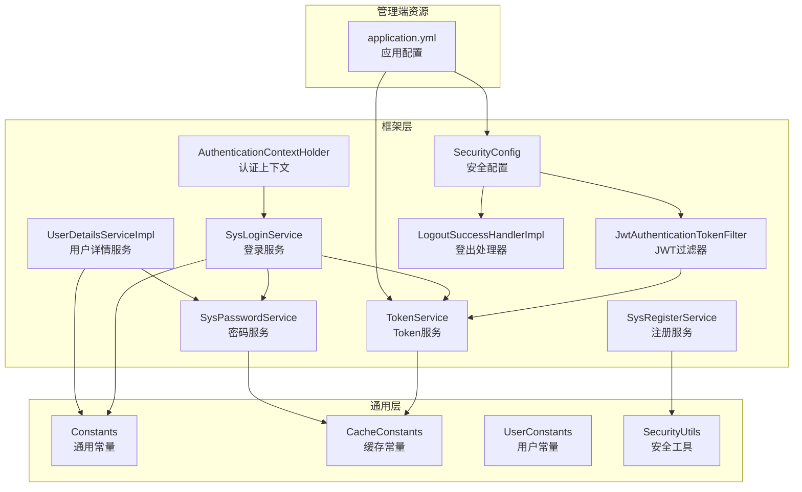
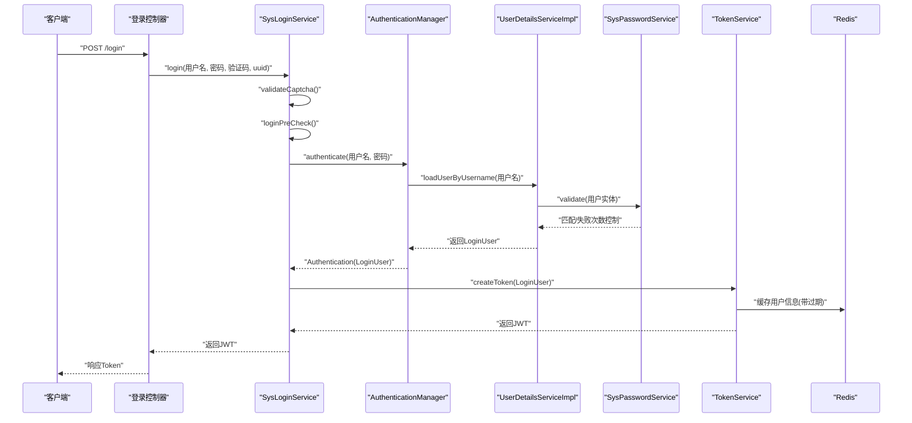
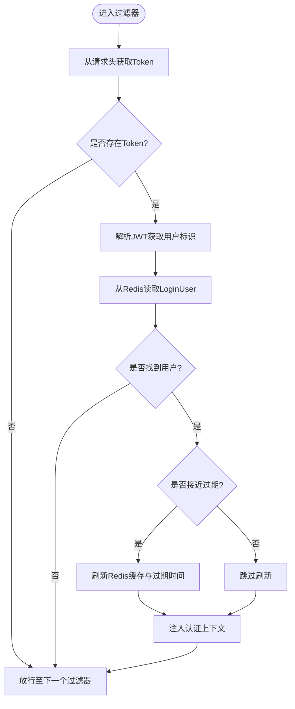
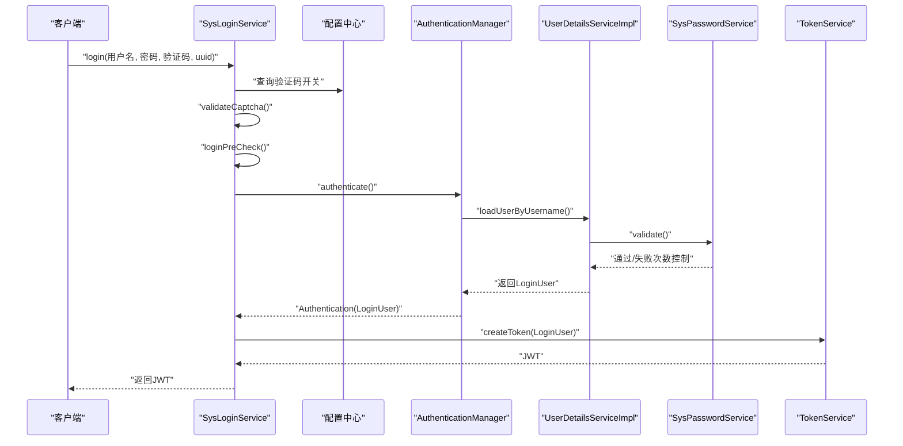
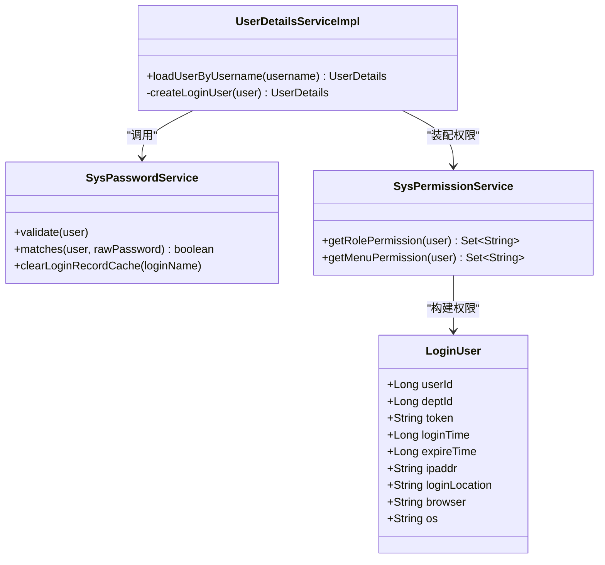
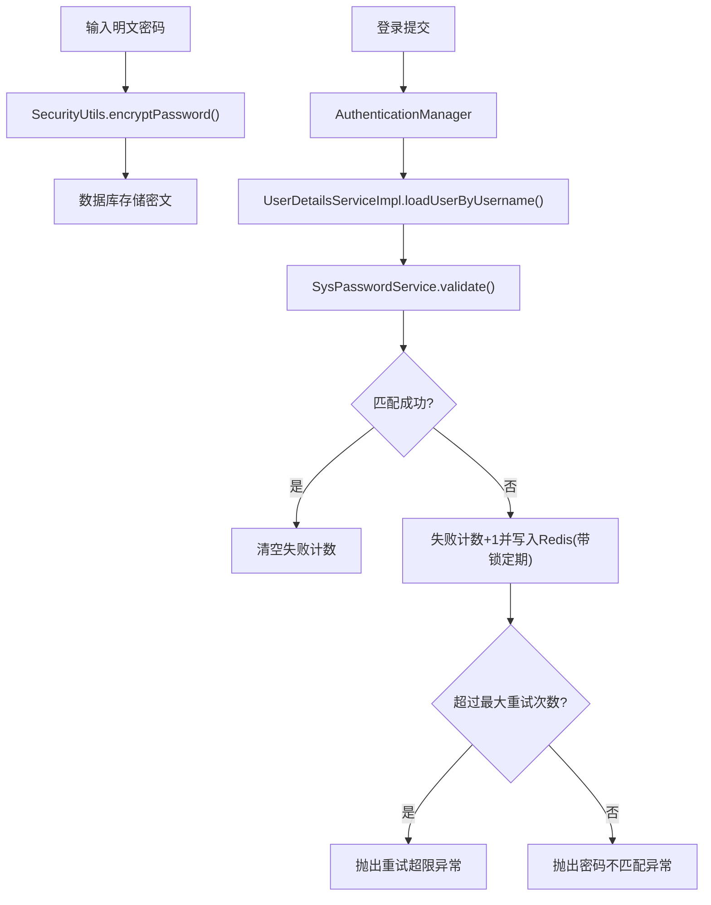
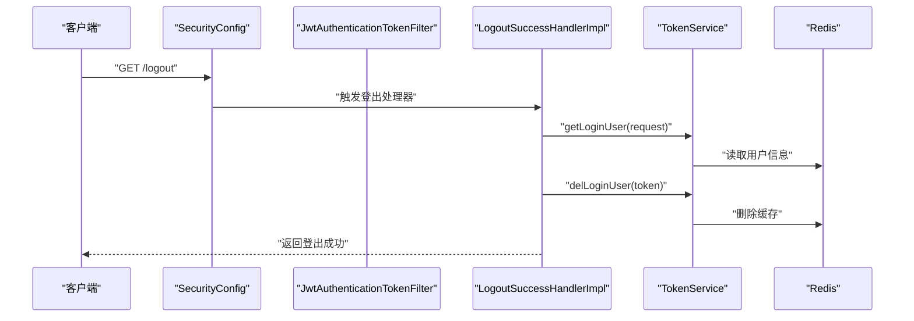
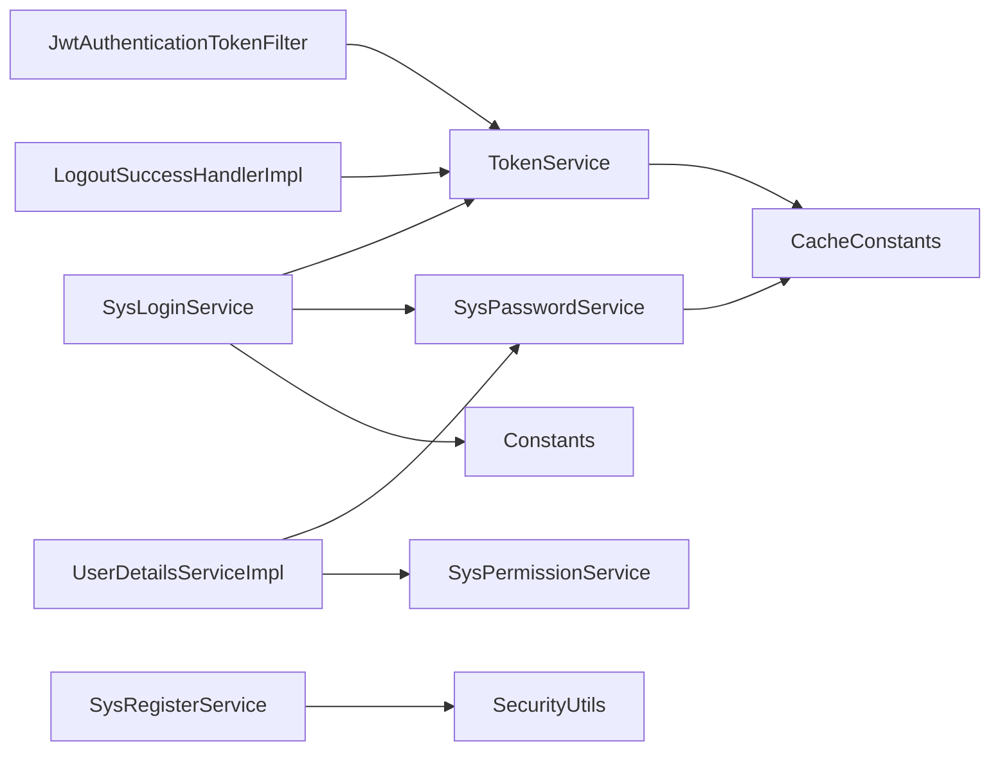

# 用户认证机制

<cite>
**本文引用的文件**
- [TokenService.java](file://XingChen-Vue/xingchen-framework/src/main/java/com/xingchen/framework/web/service/TokenService.java)
- [JwtAuthenticationTokenFilter.java](file://XingChen-Vue/xingchen-framework/src/main/java/com/xingchen/framework/security/filter/JwtAuthenticationTokenFilter.java)
- [SecurityConfig.java](file://XingChen-Vue/xingchen-framework/src/main/java/com/xingchen/framework/config/SecurityConfig.java)
- [SysLoginService.java](file://XingChen-Vue/xingchen-framework/src/main/java/com/xingchen/framework/web/service/SysLoginService.java)
- [UserDetailsServiceImpl.java](file://XingChen-Vue/xingchen-framework/src/main/java/com/xingchen/framework/web/service/UserDetailsServiceImpl.java)
- [SysPasswordService.java](file://XingChen-Vue/xingchen-framework/src/main/java/com/xingchen/framework/web/service/SysPasswordService.java)
- [SysRegisterService.java](file://XingChen-Vue/xingchen-framework/src/main/java/com/xingchen/framework/web/service/SysRegisterService.java)
- [LogoutSuccessHandlerImpl.java](file://XingChen-Vue/xingchen-framework/src/main/java/com/xingchen/framework/security/handle/LogoutSuccessHandlerImpl.java)
- [Constants.java](file://XingChen-Vue/xingchen-common/src/main/java/com/xingchen/common/constant/Constants.java)
- [CacheConstants.java](file://XingChen-Vue/xingchen-common/src/main/java/com/xingchen/common/constant/CacheConstants.java)
- [UserConstants.java](file://XingChen-Vue/xingchen-common/src/main/java/com/xingchen/common/constant/UserConstants.java)
- [SecurityUtils.java](file://XingChen-Vue/xingchen-common/src/main/java/com/xingchen/common/utils/SecurityUtils.java)
- [application.yml](file://XingChen-Vue/xingchen-admin/src/main/resources/application.yml)
- [AuthenticationContextHolder.java](file://XingChen-Vue/xingchen-framework/src/main/java/com/xingchen/framework/security/context/AuthenticationContextHolder.java)
</cite>

## 目录
1. [简介](#简介)
2. [项目结构](#项目结构)
3. [核心组件](#核心组件)
4. [架构总览](#架构总览)
5. [详细组件分析](#详细组件分析)
6. [依赖分析](#依赖分析)
7. [性能考虑](#性能考虑)
8. [故障排查指南](#故障排查指南)
9. [结论](#结论)
10. [附录](#附录)

## 简介
本文件系统性阐述健康管理系统中的用户认证机制，覆盖JWT Token认证流程、登录验证、密码加密存储、会话管理策略、异常处理、性能优化与故障排查。重点解析登录控制器实现、用户详情服务、JWT过滤器与安全配置的工作原理，并提供认证流程图、Token生成与验证机制、密码加密算法与安全最佳实践。

## 项目结构
认证相关代码主要分布在以下模块：
- 框架层（安全配置、过滤器、处理器、服务）
- 通用层（常量、工具、领域模型）
- 管理端资源（配置文件）

图表来源
- [SecurityConfig.java:20-128](file://XingChen-Vue/xingchen-framework/src/main/java/com/xingchen/framework/config/SecurityConfig.java#L20-L128)
- [JwtAuthenticationTokenFilter.java:1-44](file://XingChen-Vue/xingchen-framework/src/main/java/com/xingchen/framework/security/filter/JwtAuthenticationTokenFilter.java#L1-L44)
- [TokenService.java:38-232](file://XingChen-Vue/xingchen-framework/src/main/java/com/xingchen/framework/web/service/TokenService.java#L38-L232)
- [SysLoginService.java:1-177](file://XingChen-Vue/xingchen-framework/src/main/java/com/xingchen/framework/web/service/SysLoginService.java#L1-L177)
- [SysPasswordService.java:1-86](file://XingChen-Vue/xingchen-framework/src/main/java/com/xingchen/framework/web/service/SysPasswordService.java#L1-L86)
- [UserDetailsServiceImpl.java:1-67](file://XingChen-Vue/xingchen-framework/src/main/java/com/xingchen/framework/web/service/UserDetailsServiceImpl.java#L1-L67)
- [SysRegisterService.java:1-118](file://XingChen-Vue/xingchen-framework/src/main/java/com/xingchen/framework/web/service/SysRegisterService.java#L1-L118)
- [LogoutSuccessHandlerImpl.java:1-54](file://XingChen-Vue/xingchen-framework/src/main/java/com/xingchen/framework/security/handle/LogoutSuccessHandlerImpl.java#L1-L54)
- [Constants.java:1-205](file://XingChen-Vue/xingchen-common/src/main/java/com/xingchen/common/constant/Constants.java#L1-L205)
- [CacheConstants.java:1-45](file://XingChen-Vue/xingchen-common/src/main/java/com/xingchen/common/constant/CacheConstants.java#L1-L45)
- [UserConstants.java:1-82](file://XingChen-Vue/xingchen-common/src/main/java/com/xingchen/common/constant/UserConstants.java#L1-L82)
- [SecurityUtils.java:49-106](file://XingChen-Vue/xingchen-common/src/main/java/com/xingchen/common/utils/SecurityUtils.java#L49-L106)
- [application.yml:95-102](file://XingChen-Vue/xingchen-admin/src/main/resources/application.yml#L95-L102)
- [AuthenticationContextHolder.java:1-29](file://XingChen-Vue/xingchen-framework/src/main/java/com/xingchen/framework/security/context/AuthenticationContextHolder.java#L1-L29)

章节来源
- [SecurityConfig.java:20-128](file://XingChen-Vue/xingchen-framework/src/main/java/com/xingchen/framework/config/SecurityConfig.java#L20-L128)
- [application.yml:95-102](file://XingChen-Vue/xingchen-admin/src/main/resources/application.yml#L95-L102)

## 核心组件
- TokenService：负责JWT生成、解析、刷新与用户缓存；维护令牌有效期与过期刷新策略。
- JwtAuthenticationTokenFilter：拦截请求，提取并验证JWT，注入Spring Security认证上下文。
- SysLoginService：登录入口，执行验证码校验、前置校验、认证与Token签发。
- UserDetailsServiceImpl：加载用户详情、状态校验与权限装配。
- SysPasswordService：密码匹配与失败次数限制，结合Redis进行防暴力破解。
- SysRegisterService：注册流程，含验证码校验与密码加密存储。
- LogoutSuccessHandlerImpl：登出处理，清理用户缓存并记录登出日志。
- SecurityConfig：基于WebSecurityConfigurerAdapter的安全配置，启用无状态会话、添加JWT过滤器与跨域过滤器。
- 常量与工具：Constants、CacheConstants、UserConstants、SecurityUtils提供统一常量与加密工具。

章节来源
- [TokenService.java:38-232](file://XingChen-Vue/xingchen-framework/src/main/java/com/xingchen/framework/web/service/TokenService.java#L38-L232)
- [JwtAuthenticationTokenFilter.java:1-44](file://XingChen-Vue/xingchen-framework/src/main/java/com/xingchen/framework/security/filter/JwtAuthenticationTokenFilter.java#L1-L44)
- [SysLoginService.java:1-177](file://XingChen-Vue/xingchen-framework/src/main/java/com/xingchen/framework/web/service/SysLoginService.java#L1-L177)
- [UserDetailsServiceImpl.java:1-67](file://XingChen-Vue/xingchen-framework/src/main/java/com/xingchen/framework/web/service/UserDetailsServiceImpl.java#L1-L67)
- [SysPasswordService.java:1-86](file://XingChen-Vue/xingchen-framework/src/main/java/com/xingchen/framework/web/service/SysPasswordService.java#L1-L86)
- [SysRegisterService.java:1-118](file://XingChen-Vue/xingchen-framework/src/main/java/com/xingchen/framework/web/service/SysRegisterService.java#L1-L118)
- [LogoutSuccessHandlerImpl.java:1-54](file://XingChen-Vue/xingchen-framework/src/main/java/com/xingchen/framework/security/handle/LogoutSuccessHandlerImpl.java#L1-L54)
- [SecurityConfig.java:20-128](file://XingChen-Vue/xingchen-framework/src/main/java/com/xingchen/framework/config/SecurityConfig.java#L20-L128)
- [Constants.java:1-205](file://XingChen-Vue/xingchen-common/src/main/java/com/xingchen/common/constant/Constants.java#L1-L205)
- [CacheConstants.java:1-45](file://XingChen-Vue/xingchen-common/src/main/java/com/xingchen/common/constant/CacheConstants.java#L1-L45)
- [UserConstants.java:1-82](file://XingChen-Vue/xingchen-common/src/main/java/com/xingchen/common/constant/UserConstants.java#L1-L82)
- [SecurityUtils.java:49-106](file://XingChen-Vue/xingchen-common/src/main/java/com/xingchen/common/utils/SecurityUtils.java#L49-L106)

## 架构总览
下图展示认证子系统的整体交互：客户端发起登录请求，后端通过SysLoginService完成校验与认证，生成JWT并写入Redis；后续请求由JwtAuthenticationTokenFilter解析JWT并注入认证上下文，供授权与业务使用。

图表来源
- [SysLoginService.java:63-100](file://XingChen-Vue/xingchen-framework/src/main/java/com/xingchen/framework/web/service/SysLoginService.java#L63-L100)
- [UserDetailsServiceImpl.java:38-65](file://XingChen-Vue/xingchen-framework/src/main/java/com/xingchen/framework/web/service/UserDetailsServiceImpl.java#L38-L65)
- [SysPasswordService.java:44-77](file://XingChen-Vue/xingchen-framework/src/main/java/com/xingchen/framework/web/service/SysPasswordService.java#L44-L77)
- [TokenService.java:114-125](file://XingChen-Vue/xingchen-framework/src/main/java/com/xingchen/framework/web/service/TokenService.java#L114-L125)

## 详细组件分析

### JWT Token认证流程与实现
- 令牌生成：TokenService根据LoginUser生成唯一token并写入Redis，同时构造JWT载荷（包含用户标识与签名算法），默认使用HS512。
- 令牌解析：JwtAuthenticationTokenFilter从请求头提取Bearer Token，解析Claims并从Redis读取LoginUser，若认证上下文为空则注入认证信息。
- 过期刷新：当距离过期时间小于阈值（默认20分钟）时自动刷新Redis缓存与过期时间，避免频繁重新登录。

图表来源
- [JwtAuthenticationTokenFilter.java:30-43](file://XingChen-Vue/xingchen-framework/src/main/java/com/xingchen/framework/security/filter/JwtAuthenticationTokenFilter.java#L30-L43)
- [TokenService.java:62-83](file://XingChen-Vue/xingchen-framework/src/main/java/com/xingchen/framework/web/service/TokenService.java#L62-L83)
- [TokenService.java:133-141](file://XingChen-Vue/xingchen-framework/src/main/java/com/xingchen/framework/web/service/TokenService.java#L133-L141)
- [TokenService.java:148-155](file://XingChen-Vue/xingchen-framework/src/main/java/com/xingchen/framework/web/service/TokenService.java#L148-L155)

章节来源
- [TokenService.java:38-232](file://XingChen-Vue/xingchen-framework/src/main/java/com/xingchen/framework/web/service/TokenService.java#L38-L232)
- [JwtAuthenticationTokenFilter.java:1-44](file://XingChen-Vue/xingchen-framework/src/main/java/com/xingchen/framework/security/filter/JwtAuthenticationTokenFilter.java#L1-L44)

### 登录控制器实现与登录服务
- SysLoginService.login：执行验证码校验、前置参数校验、调用AuthenticationManager进行认证，记录登录日志，最终生成JWT返回给客户端。
- 前置校验：用户名/密码长度校验、黑名单IP校验。
- 验证码校验：从Redis读取并比对验证码，支持关闭验证码场景。
- 登录成功后更新用户最近登录信息。

图表来源
- [SysLoginService.java:63-100](file://XingChen-Vue/xingchen-framework/src/main/java/com/xingchen/framework/web/service/SysLoginService.java#L63-L100)
- [SysLoginService.java:110-129](file://XingChen-Vue/xingchen-framework/src/main/java/com/xingchen/framework/web/service/SysLoginService.java#L110-L129)
- [SysLoginService.java:136-165](file://XingChen-Vue/xingchen-framework/src/main/java/com/xingchen/framework/web/service/SysLoginService.java#L136-L165)
- [UserDetailsServiceImpl.java:38-65](file://XingChen-Vue/xingchen-framework/src/main/java/com/xingchen/framework/web/service/UserDetailsServiceImpl.java#L38-L65)
- [SysPasswordService.java:44-77](file://XingChen-Vue/xingchen-framework/src/main/java/com/xingchen/framework/web/service/SysPasswordService.java#L44-L77)
- [TokenService.java:114-125](file://XingChen-Vue/xingchen-framework/src/main/java/com/xingchen/framework/web/service/TokenService.java#L114-L125)

章节来源
- [SysLoginService.java:1-177](file://XingChen-Vue/xingchen-framework/src/main/java/com/xingchen/framework/web/service/SysLoginService.java#L1-L177)

### 用户详情服务与权限装配
- UserDetailsServiceImpl.loadUserByUsername：按用户名查询用户，校验状态与删除标记，委托SysPasswordService进行密码校验，最后装配LoginUser与权限集合。
- SysPermissionService：管理员拥有全部权限；普通用户按角色与菜单权限集合装配。

图表来源
- [UserDetailsServiceImpl.java:38-65](file://XingChen-Vue/xingchen-framework/src/main/java/com/xingchen/framework/web/service/UserDetailsServiceImpl.java#L38-L65)
- [SysPasswordService.java:44-77](file://XingChen-Vue/xingchen-framework/src/main/java/com/xingchen/framework/web/service/SysPasswordService.java#L44-L77)
- [SysPermissionService.java:37-88](file://XingChen-Vue/xingchen-framework/src/main/java/com/xingchen/framework/web/service/SysPermissionService.java#L37-L88)
- [LoginUser.java:19-68](file://XingChen-Vue/xingchen-common/src/main/java/com/xingchen/common/core/domain/model/LoginUser.java#L19-L68)

章节来源
- [UserDetailsServiceImpl.java:1-67](file://XingChen-Vue/xingchen-framework/src/main/java/com/xingchen/framework/web/service/UserDetailsServiceImpl.java#L1-L67)
- [SysPermissionService.java:1-90](file://XingChen-Vue/xingchen-framework/src/main/java/com/xingchen/framework/web/service/SysPermissionService.java#L1-L90)

### 密码加密存储与安全策略
- 密码加密：注册时通过SecurityUtils.encryptPassword使用BCrypt进行强散列加密，确保不可逆。
- 登录校验：SysPasswordService基于当前Authentication上下文获取用户名与明文密码，与用户记录的密文进行匹配，失败计数写入Redis并按锁定期限制重试。
- 配置项：最大重试次数与锁定时间在application.yml中配置。

图表来源
- [SysRegisterService.java:81](file://XingChen-Vue/xingchen-framework/src/main/java/com/xingchen/framework/web/service/SysRegisterService.java#L81)
- [SecurityUtils.java:98-102](file://XingChen-Vue/xingchen-common/src/main/java/com/xingchen/common/utils/SecurityUtils.java#L98-L102)
- [SysPasswordService.java:44-77](file://XingChen-Vue/xingchen-framework/src/main/java/com/xingchen/framework/web/service/SysPasswordService.java#L44-L77)
- [application.yml:41-46](file://XingChen-Vue/xingchen-admin/src/main/resources/application.yml#L41-L46)

章节来源
- [SysRegisterService.java:1-118](file://XingChen-Vue/xingchen-framework/src/main/java/com/xingchen/framework/web/service/SysRegisterService.java#L1-L118)
- [SysPasswordService.java:1-86](file://XingChen-Vue/xingchen-framework/src/main/java/com/xingchen/framework/web/service/SysPasswordService.java#L1-L86)
- [SecurityUtils.java:49-106](file://XingChen-Vue/xingchen-common/src/main/java/com/xingchen/common/utils/SecurityUtils.java#L49-L106)
- [application.yml:41-46](file://XingChen-Vue/xingchen-admin/src/main/resources/application.yml#L41-L46)

### 会话管理策略与登出处理
- 无状态会话：SecurityConfig配置SessionCreationPolicy.STATELESS，基于Token而非Session。
- 登出处理：LogoutSuccessHandlerImpl删除Redis中的用户缓存并记录登出日志，返回标准AjaxResult。

图表来源
- [SecurityConfig.java:98](file://XingChen-Vue/xingchen-framework/src/main/java/com/xingchen/framework/config/SecurityConfig.java#L98)
- [LogoutSuccessHandlerImpl.java:38-52](file://XingChen-Vue/xingchen-framework/src/main/java/com/xingchen/framework/security/handle/LogoutSuccessHandlerImpl.java#L38-L52)
- [TokenService.java:99-106](file://XingChen-Vue/xingchen-framework/src/main/java/com/xingchen/framework/web/service/TokenService.java#L99-L106)

章节来源
- [SecurityConfig.java:20-128](file://XingChen-Vue/xingchen-framework/src/main/java/com/xingchen/framework/config/SecurityConfig.java#L20-L128)
- [LogoutSuccessHandlerImpl.java:1-54](file://XingChen-Vue/xingchen-framework/src/main/java/com/xingchen/framework/security/handle/LogoutSuccessHandlerImpl.java#L1-L54)

### 安全配置与过滤器链
- 过滤器顺序：CorsFilter → JwtAuthenticationTokenFilter → UsernamePasswordAuthenticationFilter（由SecurityConfig添加）。
- 认证异常：AuthenticationEntryPointImpl返回未授权错误。
- 允许匿名访问的URL：通过PermitAllUrlProperties配置，静态资源与登录/注册/验证码接口默认放行。
- 密码加密：BCryptPasswordEncoder Bean提供强散列加密能力。

章节来源
- [SecurityConfig.java:112-117](file://XingChen-Vue/xingchen-framework/src/main/java/com/xingchen/framework/config/SecurityConfig.java#L112-L117)
- [SecurityConfig.java:96-108](file://XingChen-Vue/xingchen-framework/src/main/java/com/xingchen/framework/config/SecurityConfig.java#L96-L108)
- [SecurityConfig.java:120-127](file://XingChen-Vue/xingchen-framework/src/main/java/com/xingchen/framework/config/SecurityConfig.java#L120-L127)
- [AuthenticationEntryPointImpl.java:26-33](file://XingChen-Vue/xingchen-framework/src/main/java/com/xingchen/framework/security/handle/AuthenticationEntryPointImpl.java#L26-L33)

## 依赖分析
- 组件耦合
  - SysLoginService依赖TokenService、SysPasswordService、ISysUserService、ISysConfigService与异步日志工厂。
  - UserDetailsServiceImpl依赖ISysUserService、SysPasswordService与SysPermissionService。
  - TokenService依赖RedisCache与配置（header、secret、expireTime）。
  - JwtAuthenticationTokenFilter依赖TokenService与SecurityUtils。
  - LogoutSuccessHandlerImpl依赖TokenService与异步日志工厂。
- 外部依赖
  - Redis用于缓存用户信息与验证码、密码错误计数。
  - BCrypt用于密码加密。
  - JWT用于Token签名与解析。

图表来源
- [SysLoginService.java:39-52](file://XingChen-Vue/xingchen-framework/src/main/java/com/xingchen/framework/web/service/SysLoginService.java#L39-L52)
- [UserDetailsServiceImpl.java:28-35](file://XingChen-Vue/xingchen-framework/src/main/java/com/xingchen/framework/web/service/UserDetailsServiceImpl.java#L28-L35)
- [TokenService.java:54-55](file://XingChen-Vue/xingchen-framework/src/main/java/com/xingchen/framework/web/service/TokenService.java#L54-L55)
- [JwtAuthenticationTokenFilter.java:27-28](file://XingChen-Vue/xingchen-framework/src/main/java/com/xingchen/framework/security/filter/JwtAuthenticationTokenFilter.java#L27-L28)
- [LogoutSuccessHandlerImpl.java:30-31](file://XingChen-Vue/xingchen-framework/src/main/java/com/xingchen/framework/security/handle/LogoutSuccessHandlerImpl.java#L30-L31)
- [SysRegisterService.java:15](file://XingChen-Vue/xingchen-framework/src/main/java/com/xingchen/framework/web/service/SysRegisterService.java#L15)

章节来源
- [SysLoginService.java:1-177](file://XingChen-Vue/xingchen-framework/src/main/java/com/xingchen/framework/web/service/SysLoginService.java#L1-L177)
- [UserDetailsServiceImpl.java:1-67](file://XingChen-Vue/xingchen-framework/src/main/java/com/xingchen/framework/web/service/UserDetailsServiceImpl.java#L1-L67)
- [TokenService.java:38-232](file://XingChen-Vue/xingchen-framework/src/main/java/com/xingchen/framework/web/service/TokenService.java#L38-L232)
- [JwtAuthenticationTokenFilter.java:1-44](file://XingChen-Vue/xingchen-framework/src/main/java/com/xingchen/framework/security/filter/JwtAuthenticationTokenFilter.java#L1-L44)
- [LogoutSuccessHandlerImpl.java:1-54](file://XingChen-Vue/xingchen-framework/src/main/java/com/xingchen/framework/security/handle/LogoutSuccessHandlerImpl.java#L1-L54)
- [SysRegisterService.java:1-118](file://XingChen-Vue/xingchen-framework/src/main/java/com/xingchen/framework/web/service/SysRegisterService.java#L1-L118)

## 性能考虑
- Token过期刷新：当剩余有效期低于阈值（默认20分钟）自动刷新，减少频繁登录带来的压力。
- Redis缓存：用户信息与验证码、密码错误计数均缓存，降低数据库压力；注意合理设置过期时间与内存上限。
- 无状态会话：STATELESS策略避免Session占用，提升横向扩展能力。
- 密码加密成本：BCrypt迭代次数适中，兼顾安全性与性能；可根据硬件能力调整。
- 过滤器链顺序：先CORS再JWT，避免不必要的重复解析。

## 故障排查指南
- 请求未携带有效Token
  - 现象：返回未授权。
  - 排查：确认请求头Authorization是否以Bearer开头；检查TokenService.header配置。
  - 参考：[Constants.java:104-106](file://XingChen-Vue/xingchen-common/src/main/java/com/xingchen/common/constant/Constants.java#L104-L106)，[application.yml:98](file://XingChen-Vue/xingchen-admin/src/main/resources/application.yml#L98)
- Token过期或被篡改
  - 现象：解析异常导致未授权。
  - 排查：核对secret一致性与签名算法；检查expireTime配置。
  - 参考：[TokenService.java:178-198](file://XingChen-Vue/xingchen-framework/src/main/java/com/xingchen/framework/web/service/TokenService.java#L178-L198)，[application.yml:100](file://XingChen-Vue/xingchen-admin/src/main/resources/application.yml#L100)
- 登录失败次数过多
  - 现象：抛出重试超限异常。
  - 排查：查看Redis中PWD_ERR_CNT_KEY键值与过期时间；确认maxRetryCount与lockTime配置。
  - 参考：[CacheConstants.java:41-43](file://XingChen-Vue/xingchen-common/src/main/java/com/xingchen/common/constant/CacheConstants.java#L41-L43)，[application.yml:43-46](file://XingChen-Vue/xingchen-admin/src/main/resources/application.yml#L43-L46)
- 用户不存在或被停用
  - 现象：加载用户详情时抛出异常。
  - 排查：确认用户状态与删除标记；检查UserDetailsServiceImpl校验逻辑。
  - 参考：[UserDetailsServiceImpl.java:40-55](file://XingChen-Vue/xingchen-framework/src/main/java/com/xingchen/framework/web/service/UserDetailsServiceImpl.java#L40-L55)
- 登出后仍可访问
  - 现象：Redis中用户缓存未清理。
  - 排查：确认LogoutSuccessHandlerImpl执行路径与delLoginUser调用。
  - 参考：[LogoutSuccessHandlerImpl.java:42-51](file://XingChen-Vue/xingchen-framework/src/main/java/com/xingchen/framework/security/handle/LogoutSuccessHandlerImpl.java#L42-L51)，[TokenService.java:99-106](file://XingChen-Vue/xingchen-framework/src/main/java/com/xingchen/framework/web/service/TokenService.java#L99-L106)

章节来源
- [Constants.java:104-106](file://XingChen-Vue/xingchen-common/src/main/java/com/xingchen/common/constant/Constants.java#L104-L106)
- [application.yml:98-100](file://XingChen-Vue/xingchen-admin/src/main/resources/application.yml#L98-L100)
- [TokenService.java:178-198](file://XingChen-Vue/xingchen-framework/src/main/java/com/xingchen/framework/web/service/TokenService.java#L178-L198)
- [CacheConstants.java:41-43](file://XingChen-Vue/xingchen-common/src/main/java/com/xingchen/common/constant/CacheConstants.java#L41-L43)
- [application.yml:43-46](file://XingChen-Vue/xingchen-admin/src/main/resources/application.yml#L43-L46)
- [UserDetailsServiceImpl.java:40-55](file://XingChen-Vue/xingchen-framework/src/main/java/com/xingchen/framework/web/service/UserDetailsServiceImpl.java#L40-L55)
- [LogoutSuccessHandlerImpl.java:42-51](file://XingChen-Vue/xingchen-framework/src/main/java/com/xingchen/framework/security/handle/LogoutSuccessHandlerImpl.java#L42-L51)
- [TokenService.java:99-106](file://XingChen-Vue/xingchen-framework/src/main/java/com/xingchen/framework/web/service/TokenService.java#L99-L106)

## 结论
本认证机制采用JWT无状态认证，结合Redis缓存与BCrypt强散列加密，实现了高可用、可扩展且安全的用户认证体系。通过SysLoginService、UserDetailsServiceImpl与TokenService的协同，配合JwtAuthenticationTokenFilter与SecurityConfig的过滤器链，形成完整的登录、鉴权与登出闭环。建议在生产环境中妥善保管secret、合理设置过期时间与重试策略，并持续监控Redis与日志指标以保障系统稳定运行。

## 附录
- 关键配置项
  - token.header：请求头字段名，默认Authorization。
  - token.secret：JWT签名密钥。
  - token.expireTime：Token有效期（分钟）。
  - user.password.maxRetryCount：密码最大错误次数。
  - user.password.lockTime：密码锁定时间（分钟）。
- 常用常量
  - Constants.TOKEN_PREFIX：Bearer前缀。
  - CacheConstants.LOGIN_TOKEN_KEY：Redis中登录用户Key前缀。
  - UserConstants.USERNAME_MIN_LENGTH/USERNAME_MAX_LENGTH：用户名长度限制。
  - UserConstants.PASSWORD_MIN_LENGTH/PASSWORD_MAX_LENGTH：密码长度限制。

章节来源
- [application.yml:95-102](file://XingChen-Vue/xingchen-admin/src/main/resources/application.yml#L95-L102)
- [application.yml:41-46](file://XingChen-Vue/xingchen-admin/src/main/resources/application.yml#L41-L46)
- [Constants.java:104-106](file://XingChen-Vue/xingchen-common/src/main/java/com/xingchen/common/constant/Constants.java#L104-L106)
- [CacheConstants.java:11-13](file://XingChen-Vue/xingchen-common/src/main/java/com/xingchen/common/constant/CacheConstants.java#L11-L13)
- [UserConstants.java:71-81](file://XingChen-Vue/xingchen-common/src/main/java/com/xingchen/common/constant/UserConstants.java#L71-L81)