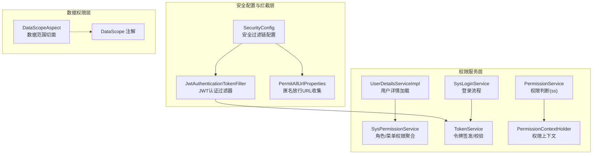
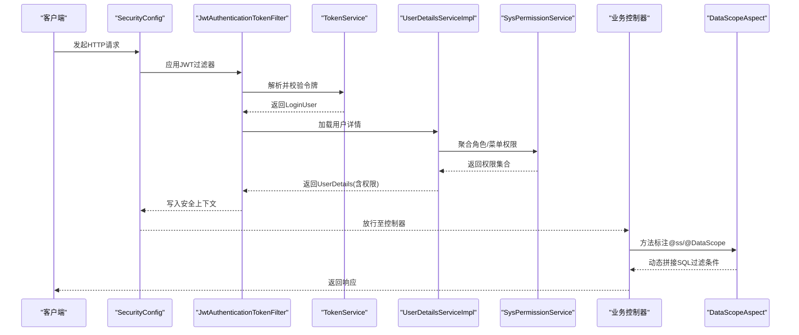
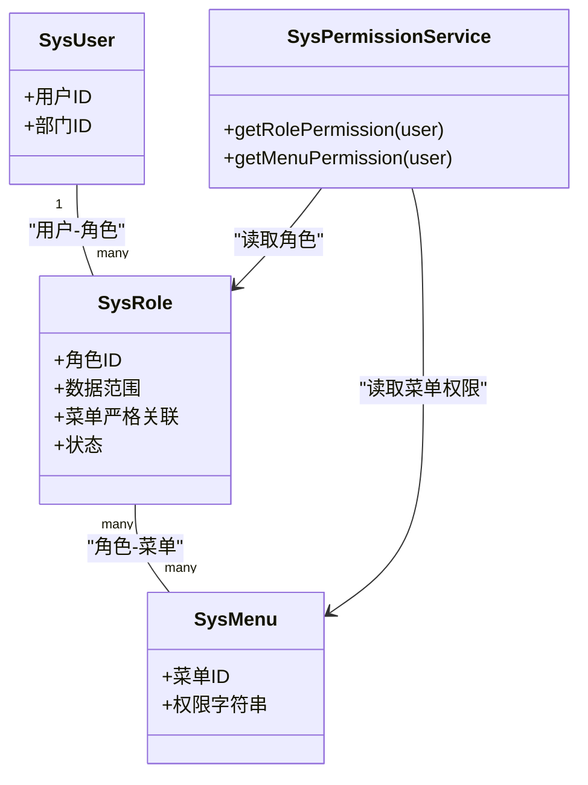
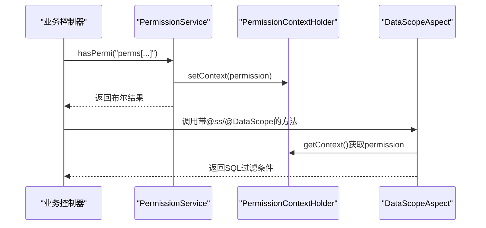
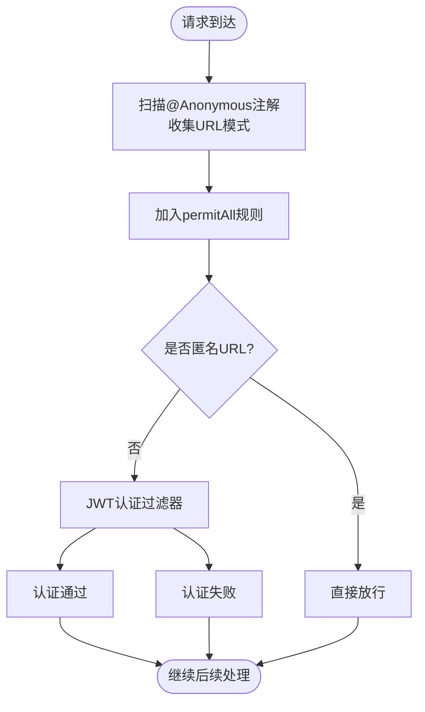
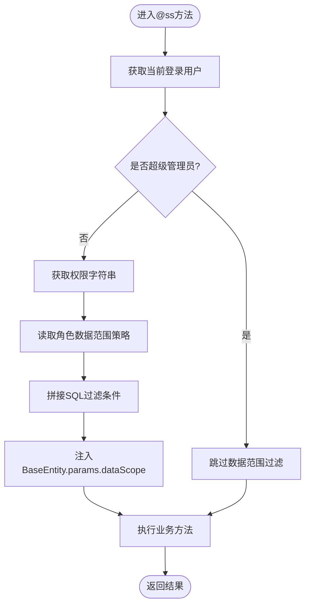
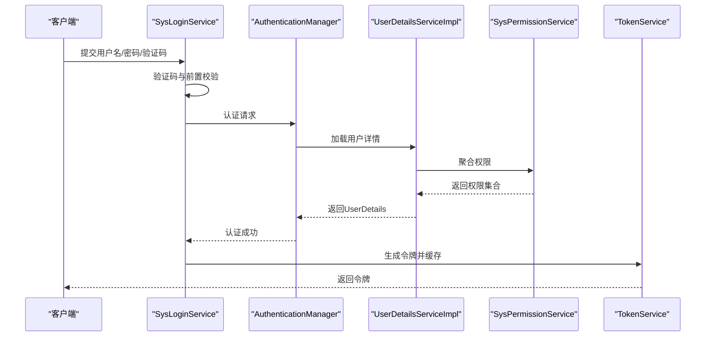
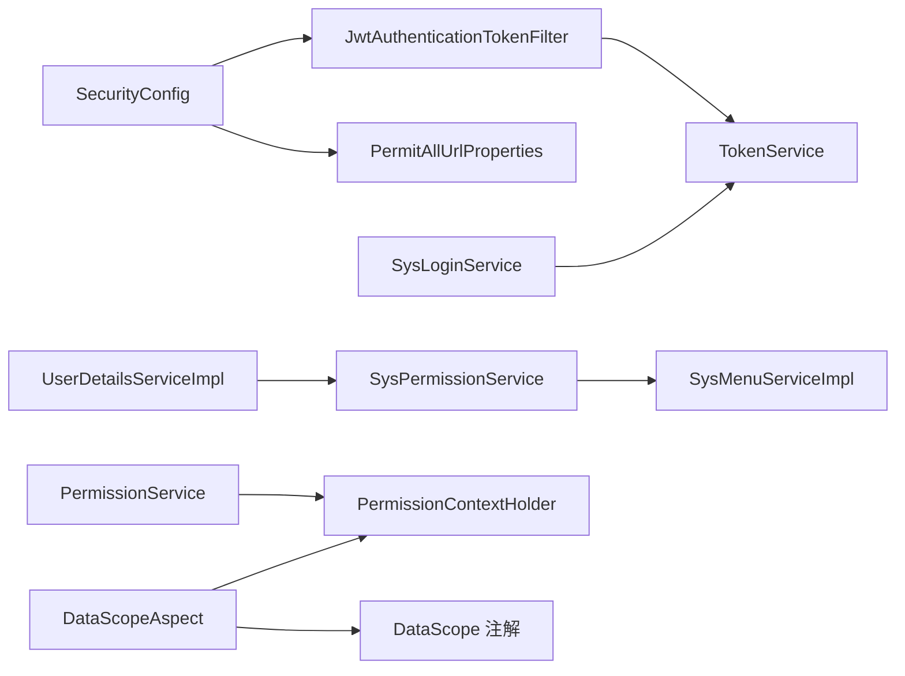

# 权限控制体系

<cite>
**本文引用的文件**
- [SecurityConfig.java](file://XingChen-Vue/xingchen-framework/src/main/java/com/xingchen/framework/config/SecurityConfig.java)
- [JwtAuthenticationTokenFilter.java](file://XingChen-Vue/xingchen-framework/src/main/java/com/xingchen/framework/security/filter/JwtAuthenticationTokenFilter.java)
- [TokenService.java](file://XingChen-Vue/xingchen-framework/src/main/java/com/xingchen/framework/web/service/TokenService.java)
- [SysLoginService.java](file://XingChen-Vue/xingchen-framework/src/main/java/com/xingchen/framework/web/service/SysLoginService.java)
- [UserDetailsServiceImpl.java](file://XingChen-Vue/xingchen-framework/src/main/java/com/xingchen/framework/web/service/UserDetailsServiceImpl.java)
- [SysPermissionService.java](file://XingChen-Vue/xingchen-framework/src/main/java/com/xingchen/framework/web/service/SysPermissionService.java)
- [PermissionService.java](file://XingChen-Vue/xingchen-framework/src/main/java/com/xingchen/framework/web/service/PermissionService.java)
- [PermissionContextHolder.java](file://XingChen-Vue/xingchen-framework/src/main/java/com/xingchen/framework/security/context/PermissionContextHolder.java)
- [DataScopeAspect.java](file://XingChen-Vue/xingchen-framework/src/main/java/com/xingchen/framework/aspectj/DataScopeAspect.java)
- [DataScope.java](file://XingChen-Vue/xingchen-common/src/main/java/com/xingchen/common/annotation/DataScope.java)
- [PermitAllUrlProperties.java](file://XingChen-Vue/xingchen-framework/src/main/java/com/xingchen/framework/config/properties/PermitAllUrlProperties.java)
- [Anonymous.java](file://XingChen-Vue/xingchen-common/src/main/java/com/xingchen/common/annotation/Anonymous.java)
- [Constants.java](file://XingChen-Vue/xingchen-common/src/main/java/com/xingchen/common/constant/Constants.java)
- [UserConstants.java](file://XingChen-Vue/xingchen-common/src/main/java/com/xingchen/common/constant/UserConstants.java)
- [SysMenuServiceImpl.java](file://XingChen-Vue/xingchen-system/src/main/java/com/xingchen/system/service/impl/SysMenuServiceImpl.java)
- [SysRoleController.java](file://XingChen-Vue/xingchen-admin/src/main/java/com/xingchen/web/controller/system/SysRoleController.java)
- [ry_20260321.sql](file://XingChen-Vue/sql/ry_20260321.sql)
</cite>

## 目录
1. [引言](#引言)
2. [项目结构](#项目结构)
3. [核心组件](#核心组件)
4. [架构总览](#架构总览)
5. [详细组件分析](#详细组件分析)
6. [依赖关系分析](#依赖关系分析)
7. [性能考量](#性能考量)
8. [故障排查指南](#故障排查指南)
9. [结论](#结论)
10. [附录](#附录)

## 引言
本文件系统化梳理健康管理系统中的权限控制体系，围绕基于角色的访问控制（RBAC）模型，全面阐述权限服务、权限拦截器、数据范围限制与权限验证流程，并给出权限注解使用、角色菜单权限管理、数据权限控制与权限配置示例等实操建议。目标是帮助开发者与运维人员快速理解并正确实施权限控制。

## 项目结构
权限控制涉及三层：
- 安全配置与拦截层：Spring Security 配置、JWT 过滤器、匿名放行配置
- 权限服务层：用户权限加载、角色与菜单权限聚合、权限上下文传递
- 数据权限层：基于注解的数据范围切面，动态拼接 SQL 过滤条件

图表来源
- [SecurityConfig.java:1-129](file://XingChen-Vue/xingchen-framework/src/main/java/com/xingchen/framework/config/SecurityConfig.java#L1-L129)
- [JwtAuthenticationTokenFilter.java:1-45](file://XingChen-Vue/xingchen-framework/src/main/java/com/xingchen/framework/security/filter/JwtAuthenticationTokenFilter.java#L1-L45)
- [PermitAllUrlProperties.java:1-75](file://XingChen-Vue/xingchen-framework/src/main/java/com/xingchen/framework/config/properties/PermitAllUrlProperties.java#L1-L75)
- [UserDetailsServiceImpl.java:1-67](file://XingChen-Vue/xingchen-framework/src/main/java/com/xingchen/framework/web/service/UserDetailsServiceImpl.java#L1-L67)
- [SysPermissionService.java:1-89](file://XingChen-Vue/xingchen-framework/src/main/java/com/xingchen/framework/web/service/SysPermissionService.java#L1-L89)
- [SysLoginService.java:1-177](file://XingChen-Vue/xingchen-framework/src/main/java/com/xingchen/framework/web/service/SysLoginService.java#L1-L177)
- [TokenService.java:1-233](file://XingChen-Vue/xingchen-framework/src/main/java/com/xingchen/framework/web/service/TokenService.java#L1-L233)
- [PermissionService.java:1-44](file://XingChen-Vue/xingchen-framework/src/main/java/com/xingchen/framework/web/service/PermissionService.java#L1-L44)
- [PermissionContextHolder.java:1-27](file://XingChen-Vue/xingchen-framework/src/main/java/com/xingchen/framework/security/context/PermissionContextHolder.java#L1-L27)
- [DataScopeAspect.java:1-160](file://XingChen-Vue/xingchen-framework/src/main/java/com/xingchen/framework/aspectj/DataScopeAspect.java#L1-L160)
- [DataScope.java:1-43](file://XingChen-Vue/xingchen-common/src/main/java/com/xingchen/common/annotation/DataScope.java#L1-L43)

章节来源
- [SecurityConfig.java:1-129](file://XingChen-Vue/xingchen-framework/src/main/java/com/xingchen/framework/config/SecurityConfig.java#L1-L129)
- [PermitAllUrlProperties.java:1-75](file://XingChen-Vue/xingchen-framework/src/main/java/com/xingchen/framework/config/properties/PermitAllUrlProperties.java#L1-L75)

## 核心组件
- 安全配置与过滤链：启用方法级安全注解，配置匿名放行、跨域、JWT 过滤器与登出处理器，构建无状态过滤链。
- JWT 认证过滤器：从请求头提取令牌，解析用户信息，校验令牌有效性并写入安全上下文。
- 登录与令牌服务：登录校验、验证码校验、用户状态校验、令牌签发与续期。
- 用户详情与权限聚合：按用户加载角色与菜单权限，支持管理员全权与多角色权限合并。
- 权限注解与上下文：提供 hasPermi 等权限判断能力，并通过上下文传递当前权限字符串以供数据范围切面使用。
- 数据范围切面：基于 @DataScope 注解动态拼接 SQL 过滤条件，支持“全部/自定义/本部门/本部门及以下/仅本人”等数据范围。

章节来源
- [SecurityConfig.java:27-129](file://XingChen-Vue/xingchen-framework/src/main/java/com/xingchen/framework/config/SecurityConfig.java#L27-L129)
- [JwtAuthenticationTokenFilter.java:30-45](file://XingChen-Vue/xingchen-framework/src/main/java/com/xingchen/framework/security/filter/JwtAuthenticationTokenFilter.java#L30-L45)
- [SysLoginService.java:63-100](file://XingChen-Vue/xingchen-framework/src/main/java/com/xingchen/framework/web/service/SysLoginService.java#L63-L100)
- [TokenService.java:62-155](file://XingChen-Vue/xingchen-framework/src/main/java/com/xingchen/framework/web/service/TokenService.java#L62-L155)
- [UserDetailsServiceImpl.java:37-66](file://XingChen-Vue/xingchen-framework/src/main/java/com/xingchen/framework/web/service/UserDetailsServiceImpl.java#L37-L66)
- [SysPermissionService.java:37-89](file://XingChen-Vue/xingchen-framework/src/main/java/com/xingchen/framework/web/service/SysPermissionService.java#L37-L89)
- [PermissionService.java:27-40](file://XingChen-Vue/xingchen-framework/src/main/java/com/xingchen/framework/web/service/PermissionService.java#L27-L40)
- [PermissionContextHolder.java:16-26](file://XingChen-Vue/xingchen-framework/src/main/java/com/xingchen/framework/security/context/PermissionContextHolder.java#L16-L26)
- [DataScopeAspect.java:35-160](file://XingChen-Vue/xingchen-framework/src/main/java/com/xingchen/framework/aspectj/DataScopeAspect.java#L35-L160)
- [DataScope.java:17-43](file://XingChen-Vue/xingchen-common/src/main/java/com/xingchen/common/annotation/DataScope.java#L17-L43)

## 架构总览
下图展示从请求到权限验证与数据范围过滤的关键交互：

图表来源
- [SecurityConfig.java:85-118](file://XingChen-Vue/xingchen-framework/src/main/java/com/xingchen/framework/config/SecurityConfig.java#L85-L118)
- [JwtAuthenticationTokenFilter.java:30-45](file://XingChen-Vue/xingchen-framework/src/main/java/com/xingchen/framework/security/filter/JwtAuthenticationTokenFilter.java#L30-L45)
- [TokenService.java:62-83](file://XingChen-Vue/xingchen-framework/src/main/java/com/xingchen/framework/web/service/TokenService.java#L62-L83)
- [UserDetailsServiceImpl.java:37-66](file://XingChen-Vue/xingchen-framework/src/main/java/com/xingchen/framework/web/service/UserDetailsServiceImpl.java#L37-L66)
- [SysPermissionService.java:37-89](file://XingChen-Vue/xingchen-framework/src/main/java/com/xingchen/framework/web/service/SysPermissionService.java#L37-L89)
- [DataScopeAspect.java:35-160](file://XingChen-Vue/xingchen-framework/src/main/java/com/xingchen/framework/aspectj/DataScopeAspect.java#L35-L160)

## 详细组件分析

### RBAC 权限模型与角色菜单权限管理
- 角色与菜单权限来源：系统通过用户绑定角色，角色再绑定菜单；权限由菜单权限字符串聚合而来。管理员拥有全部权限，普通用户按角色与菜单计算权限集合。
- 菜单权限字符串格式：系统使用特定前缀拼接权限字符串，便于统一校验。
- 角色数据范围：角色表包含数据范围字段，决定数据权限控制策略（全部/自定义/本部门/本部门及以下/仅本人）。

图表来源
- [SysPermissionService.java:37-89](file://XingChen-Vue/xingchen-framework/src/main/java/com/xingchen/framework/web/service/SysPermissionService.java#L37-L89)
- [SysMenuServiceImpl.java:62-85](file://XingChen-Vue/xingchen-system/src/main/java/com/xingchen/system/service/impl/SysMenuServiceImpl.java#L62-L85)
- [ry_20260321.sql:109-121](file://XingChen-Vue/sql/ry_20260321.sql#L109-L121)

章节来源
- [SysPermissionService.java:37-89](file://XingChen-Vue/xingchen-framework/src/main/java/com/xingchen/framework/web/service/SysPermissionService.java#L37-L89)
- [SysMenuServiceImpl.java:62-85](file://XingChen-Vue/xingchen-system/src/main/java/com/xingchen/system/service/impl/SysMenuServiceImpl.java#L62-L85)
- [ry_20260321.sql:109-121](file://XingChen-Vue/sql/ry_20260321.sql#L109-L121)

### 权限服务与权限注解使用
- 权限上下文：每次权限判断时，将当前权限字符串写入请求上下文，供数据范围切面读取。
- 权限判断：通过权限服务对用户权限集合进行匹配，支持“具备/不具备某权限”的判断。
- 方法级权限注解：结合 Spring Security 的方法级注解（如 @PreAuthorize），实现接口层面的权限控制。

图表来源
- [PermissionService.java:27-40](file://XingChen-Vue/xingchen-framework/src/main/java/com/xingchen/framework/web/service/PermissionService.java#L27-L40)
- [PermissionContextHolder.java:16-26](file://XingChen-Vue/xingchen-framework/src/main/java/com/xingchen/framework/security/context/PermissionContextHolder.java#L16-L26)
- [DataScopeAspect.java:42-56](file://XingChen-Vue/xingchen-framework/src/main/java/com/xingchen/framework/aspectj/DataScopeAspect.java#L42-L56)

章节来源
- [PermissionService.java:27-40](file://XingChen-Vue/xingchen-framework/src/main/java/com/xingchen/framework/web/service/PermissionService.java#L27-L40)
- [PermissionContextHolder.java:16-26](file://XingChen-Vue/xingchen-framework/src/main/java/com/xingchen/framework/security/context/PermissionContextHolder.java#L16-L26)

### 权限拦截器与匿名访问
- 匿名放行：通过扫描控制器与方法上的匿名注解，收集允许匿名访问的 URL 模式，并在安全过滤链中放行。
- 登录认证：除匿名放行外，其余请求均需认证，采用 JWT 无状态认证。

图表来源
- [PermitAllUrlProperties.java:38-57](file://XingChen-Vue/xingchen-framework/src/main/java/com/xingchen/framework/config/properties/PermitAllUrlProperties.java#L38-L57)
- [SecurityConfig.java:99-109](file://XingChen-Vue/xingchen-framework/src/main/java/com/xingchen/framework/config/SecurityConfig.java#L99-L109)
- [Anonymous.java:14-20](file://XingChen-Vue/xingchen-common/src/main/java/com/xingchen/common/annotation/Anonymous.java#L14-L20)

章节来源
- [PermitAllUrlProperties.java:38-57](file://XingChen-Vue/xingchen-framework/src/main/java/com/xingchen/framework/config/properties/PermitAllUrlProperties.java#L38-L57)
- [SecurityConfig.java:99-109](file://XingChen-Vue/xingchen-framework/src/main/java/com/xingchen/framework/config/SecurityConfig.java#L99-L109)

### 数据权限控制与数据范围限制
- 数据范围注解：通过 @DataScope 指定用户/部门表别名、字段名与权限字符，切面在执行前清理并注入过滤条件。
- 数据范围策略：依据角色表的数据范围字段，支持“全部/自定义/本部门/本部门及以下/仅本人”等策略，动态生成 SQL 片段。
- 过滤流程：切面在方法执行前解析当前用户、权限字符串与数据范围，拼接 SQL 过滤条件，避免越权访问。

图表来源
- [DataScopeAspect.java:35-160](file://XingChen-Vue/xingchen-framework/src/main/java/com/xingchen/framework/aspectj/DataScopeAspect.java#L35-L160)
- [DataScope.java:17-43](file://XingChen-Vue/xingchen-common/src/main/java/com/xingchen/common/annotation/DataScope.java#L17-L43)
- [Constants.java:177-203](file://XingChen-Vue/xingchen-common/src/main/java/com/xingchen/common/constant/Constants.java#L177-L203)

章节来源
- [DataScopeAspect.java:35-160](file://XingChen-Vue/xingchen-framework/src/main/java/com/xingchen/framework/aspectj/DataScopeAspect.java#L35-L160)
- [DataScope.java:17-43](file://XingChen-Vue/xingchen-common/src/main/java/com/xingchen/common/annotation/DataScope.java#L17-L43)
- [Constants.java:177-203](file://XingChen-Vue/xingchen-common/src/main/java/com/xingchen/common/constant/Constants.java#L177-L203)

### 登录与令牌验证流程
- 登录校验：验证码开关、用户名/密码长度校验、黑名单校验。
- 用户加载：加载用户详情，校验状态，构造 LoginUser 并注入权限集合。
- 令牌签发：生成令牌、写入用户信息缓存、设置过期时间与续期阈值。
- 令牌校验：请求到达时解析并校验令牌，必要时刷新缓存有效期。

图表来源
- [SysLoginService.java:63-100](file://XingChen-Vue/xingchen-framework/src/main/java/com/xingchen/framework/web/service/SysLoginService.java#L63-L100)
- [UserDetailsServiceImpl.java:37-66](file://XingChen-Vue/xingchen-framework/src/main/java/com/xingchen/framework/web/service/UserDetailsServiceImpl.java#L37-L66)
- [SysPermissionService.java:37-89](file://XingChen-Vue/xingchen-framework/src/main/java/com/xingchen/framework/web/service/SysPermissionService.java#L37-L89)
- [TokenService.java:114-155](file://XingChen-Vue/xingchen-framework/src/main/java/com/xingchen/framework/web/service/TokenService.java#L114-L155)

章节来源
- [SysLoginService.java:63-100](file://XingChen-Vue/xingchen-framework/src/main/java/com/xingchen/framework/web/service/SysLoginService.java#L63-L100)
- [TokenService.java:62-155](file://XingChen-Vue/xingchen-framework/src/main/java/com/xingchen/framework/web/service/TokenService.java#L62-L155)

### 角色分配策略与权限检查机制
- 角色分配：通过角色-菜单关联与用户-角色关联完成权限授予；角色表包含数据范围字段，决定数据可见性。
- 权限检查：在控制器层使用权限注解（如 @PreAuthorize）与服务层权限判断（如 ss.hasPermi）组合，确保接口与数据双层防护。
- 菜单权限字符串：系统约定的权限字符串格式，便于统一校验与前端路由控制。

章节来源
- [SysRoleController.java:1-27](file://XingChen-Vue/xingchen-admin/src/main/java/com/xingchen/web/controller/system/SysRoleController.java#L1-L27)
- [SysMenuServiceImpl.java:42-85](file://XingChen-Vue/xingchen-system/src/main/java/com/xingchen/system/service/impl/SysMenuServiceImpl.java#L42-L85)
- [Constants.java:74-91](file://XingChen-Vue/xingchen-common/src/main/java/com/xingchen/common/constant/Constants.java#L74-L91)

## 依赖关系分析
- 组件耦合：权限服务依赖用户与角色/菜单服务；数据范围切面依赖权限上下文与注解；安全配置依赖过滤器与匿名URL属性。
- 外部依赖：Spring Security、JWT、Redis 缓存、MyBatis Mapper（通过 Base Mapper 参数注入 SQL 片段）。

图表来源
- [SecurityConfig.java:85-118](file://XingChen-Vue/xingchen-framework/src/main/java/com/xingchen/framework/config/SecurityConfig.java#L85-L118)
- [JwtAuthenticationTokenFilter.java:25-45](file://XingChen-Vue/xingchen-framework/src/main/java/com/xingchen/framework/security/filter/JwtAuthenticationTokenFilter.java#L25-L45)
- [PermitAllUrlProperties.java:38-57](file://XingChen-Vue/xingchen-framework/src/main/java/com/xingchen/framework/config/properties/PermitAllUrlProperties.java#L38-L57)
- [TokenService.java:62-155](file://XingChen-Vue/xingchen-framework/src/main/java/com/xingchen/framework/web/service/TokenService.java#L62-L155)
- [SysLoginService.java:63-100](file://XingChen-Vue/xingchen-framework/src/main/java/com/xingchen/framework/web/service/SysLoginService.java#L63-L100)
- [UserDetailsServiceImpl.java:37-66](file://XingChen-Vue/xingchen-framework/src/main/java/com/xingchen/framework/web/service/UserDetailsServiceImpl.java#L37-L66)
- [SysPermissionService.java:37-89](file://XingChen-Vue/xingchen-framework/src/main/java/com/xingchen/framework/web/service/SysPermissionService.java#L37-L89)
- [SysMenuServiceImpl.java:62-85](file://XingChen-Vue/xingchen-system/src/main/java/com/xingchen/system/service/impl/SysMenuServiceImpl.java#L62-L85)
- [PermissionService.java:27-40](file://XingChen-Vue/xingchen-framework/src/main/java/com/xingchen/framework/web/service/PermissionService.java#L27-L40)
- [PermissionContextHolder.java:16-26](file://XingChen-Vue/xingchen-framework/src/main/java/com/xingchen/framework/security/context/PermissionContextHolder.java#L16-L26)
- [DataScopeAspect.java:35-160](file://XingChen-Vue/xingchen-framework/src/main/java/com/xingchen/framework/aspectj/DataScopeAspect.java#L35-L160)
- [DataScope.java:17-43](file://XingChen-Vue/xingchen-common/src/main/java/com/xingchen/common/annotation/DataScope.java#L17-L43)

## 性能考量
- 令牌续期：临近过期阈值自动刷新缓存，降低频繁重建成本。
- 权限聚合：角色与菜单权限在用户登录时一次性聚合，后续请求直接使用内存集合判断，减少数据库访问。
- 数据范围过滤：通过参数注入 SQL 片段，避免额外查询，提升数据权限过滤效率。
- 匿名放行：集中扫描与缓存匿名 URL，减少运行时反射开销。

## 故障排查指南
- 登录失败
  - 验证码未开启或已过期：检查验证码开关与缓存键。
  - 用户名/密码不匹配：确认用户名长度与密码长度约束。
  - 黑名单IP：检查配置项与当前请求IP。
- 认证失败
  - JWT 解析异常：检查令牌签名密钥与头部前缀配置。
  - 令牌过期或被顶下线：检查 Redis 中用户缓存是否存在与有效期。
- 权限不足
  - 方法级注解未生效：确认安全配置已启用方法级注解。
  - 权限字符串不匹配：核对菜单权限字符串格式与角色授权。
- 数据越权
  - 数据范围策略不正确：核对角色表数据范围字段与实际需求。
  - 注解参数缺失：检查 @DataScope 的用户/部门别名与字段配置。

章节来源
- [SysLoginService.java:110-165](file://XingChen-Vue/xingchen-framework/src/main/java/com/xingchen/framework/web/service/SysLoginService.java#L110-L165)
- [TokenService.java:62-83](file://XingChen-Vue/xingchen-framework/src/main/java/com/xingchen/framework/web/service/TokenService.java#L62-L83)
- [SecurityConfig.java:27-28](file://XingChen-Vue/xingchen-framework/src/main/java/com/xingchen/framework/config/SecurityConfig.java#L27-L28)
- [DataScopeAspect.java:67-146](file://XingChen-Vue/xingchen-framework/src/main/java/com/xingchen/framework/aspectj/DataScopeAspect.java#L67-L146)

## 结论
本权限体系以 RBAC 为核心，结合 JWT 无状态认证、方法级权限注解与数据范围切面，形成“接口+数据”的双重防护。通过清晰的角色-菜单-权限映射与灵活的数据范围策略，既能满足复杂组织架构下的权限隔离，又能保持良好的性能与可维护性。建议在生产环境中配合严格的日志审计与定期权限复核，持续保障系统安全。

## 附录
- 权限配置示例（步骤）
  - 新增菜单并配置权限字符串。
  - 分配角色并绑定菜单，设置数据范围策略。
  - 在控制器方法上使用权限注解或在服务层调用权限判断。
  - 使用 @DataScope 标注需要数据范围过滤的查询方法。
- 最佳实践
  - 管理员与普通用户分离：管理员拥有全部权限，普通用户按角色授权。
  - 数据范围最小化：优先使用“本部门/本部门及以下/仅本人”，避免“全部”滥用。
  - 权限字符串规范化：统一前缀与命名，便于前端与后端一致校验。
  - 匿名放行最小化：仅开放必要接口，其余接口强制认证。