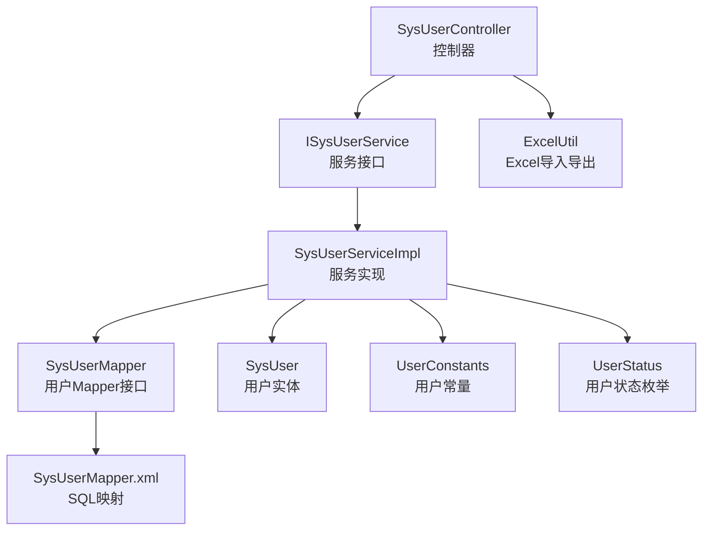
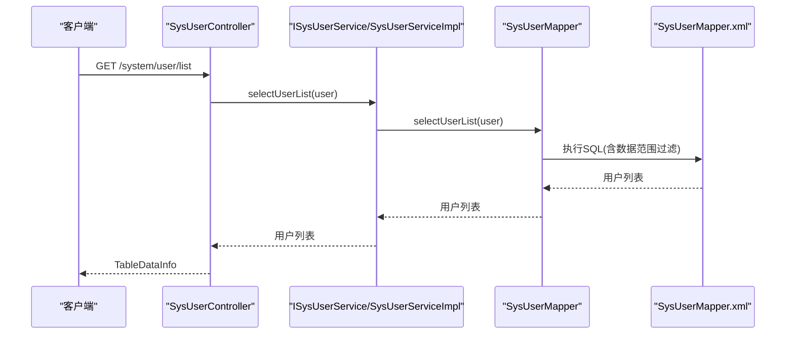
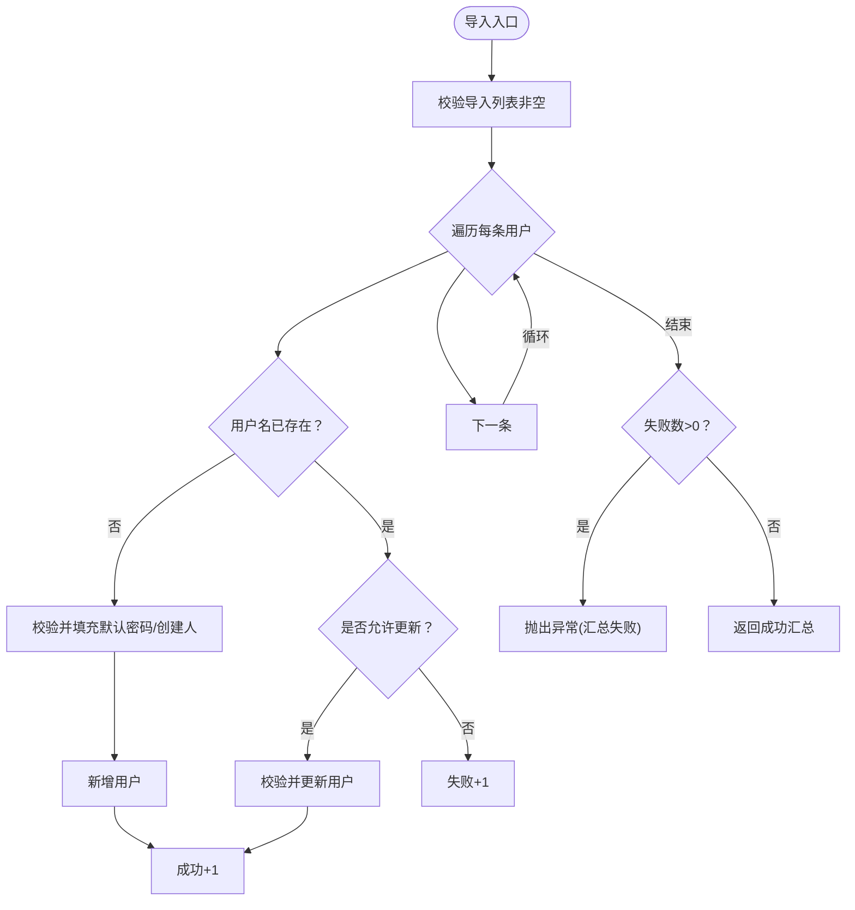
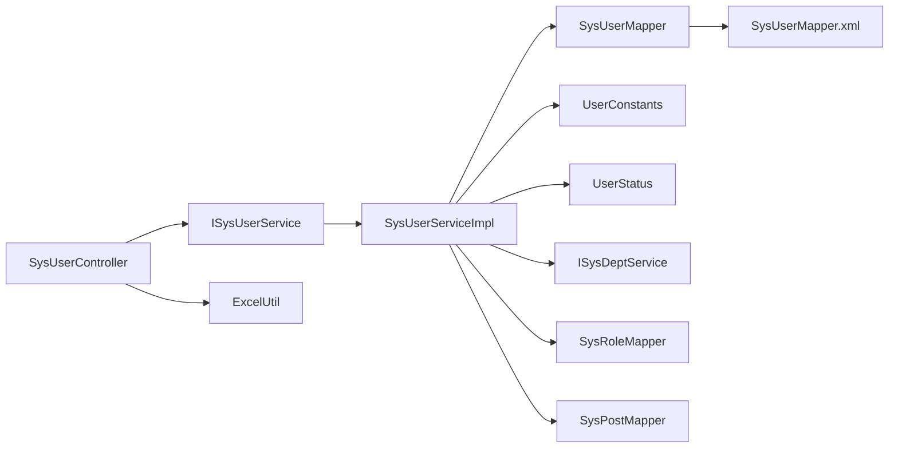

# 用户信息管理

<cite>
**本文引用的文件**   
- [SysUserController.java](file://XingChen-Vue/xingchen-admin/src/main/java/com/xingchen/web/controller/system/SysUserController.java)
- [ISysUserService.java](file://XingChen-Vue/xingchen-system/src/main/java/com/xingchen/system/service/ISysUserService.java)
- [SysUserServiceImpl.java](file://XingChen-Vue/xingchen-system/src/main/java/com/xingchen/system/service/impl/SysUserServiceImpl.java)
- [SysUserMapper.java](file://XingChen-Vue/xingchen-system/src/main/java/com/xingchen/system/mapper/SysUserMapper.java)
- [SysUserMapper.xml](file://XingChen-Vue/xingchen-system/src/main/resources/mapper/system/SysUserMapper.xml)
- [SysUser.java](file://XingChen-Vue/xingchen-common/src/main/java/com/xingchen/common/core/domain/entity/SysUser.java)
- [ExcelUtil.java](file://XingChen-Vue/xingchen-common/src/main/java/com/xingchen/common/utils/poi/ExcelUtil.java)
- [UserConstants.java](file://XingChen-Vue/xingchen-common/src/main/java/com/xingchen/common/constant/UserConstants.java)
- [UserStatus.java](file://XingChen-Vue/xingchen-common/src/main/java/com/xingchen/common/enums/UserStatus.java)
</cite>

## 目录
1. [简介](#简介)
2. [项目结构](#项目结构)
3. [核心组件](#核心组件)
4. [架构总览](#架构总览)
5. [详细组件分析](#详细组件分析)
6. [依赖分析](#依赖分析)
7. [性能考虑](#性能考虑)
8. [故障排查指南](#故障排查指南)
9. [结论](#结论)
10. [附录](#附录)

## 简介
本技术文档围绕健康管理系统中的“用户信息管理”模块展开，系统性阐述用户CRUD操作、数据验证、状态管理、导入导出等能力的实现方式与最佳实践。文档覆盖服务层业务逻辑、实体数据模型、Mapper数据库操作以及控制器接口实现，并提供API示例、数据校验规则、批量操作流程及常见问题解决方案。

## 项目结构
用户信息管理采用经典的分层架构：
- 控制器层：对外暴露REST接口，负责参数接收、鉴权与调用服务层
- 服务层：封装业务规则、事务控制、数据权限校验与角色/岗位关联维护
- 数据访问层：MyBatis映射XML定义SQL，完成用户主表与关联表的读写
- 公共工具与常量：Excel导入导出、用户状态枚举、唯一性常量等

图表来源
- [SysUserController.java:1-257](file://XingChen-Vue/xingchen-admin/src/main/java/com/xingchen/web/controller/system/SysUserController.java#L1-L257)
- [ISysUserService.java:1-218](file://XingChen-Vue/xingchen-system/src/main/java/com/xingchen/system/service/ISysUserService.java#L1-L218)
- [SysUserServiceImpl.java:1-566](file://XingChen-Vue/xingchen-system/src/main/java/com/xingchen/system/service/impl/SysUserServiceImpl.java#L1-L566)
- [SysUserMapper.java:1-148](file://XingChen-Vue/xingchen-system/src/main/java/com/xingchen/system/mapper/SysUserMapper.java#L1-L148)
- [SysUserMapper.xml:1-227](file://XingChen-Vue/xingchen-system/src/main/resources/mapper/system/SysUserMapper.xml#L1-L227)
- [SysUser.java:1-337](file://XingChen-Vue/xingchen-common/src/main/java/com/xingchen/common/core/domain/entity/SysUser.java#L1-L337)
- [ExcelUtil.java:1-800](file://XingChen-Vue/xingchen-common/src/main/java/com/xingchen/common/utils/poi/ExcelUtil.java#L1-L800)
- [UserConstants.java:1-82](file://XingChen-Vue/xingchen-common/src/main/java/com/xingchen/common/constant/UserConstants.java#L1-L82)
- [UserStatus.java:1-31](file://XingChen-Vue/xingchen-common/src/main/java/com/xingchen/common/enums/UserStatus.java#L1-L31)

章节来源
- [SysUserController.java:1-257](file://XingChen-Vue/xingchen-admin/src/main/java/com/xingchen/web/controller/system/SysUserController.java#L1-L257)
- [SysUserServiceImpl.java:1-566](file://XingChen-Vue/xingchen-system/src/main/java/com/xingchen/system/service/impl/SysUserServiceImpl.java#L1-L566)
- [SysUserMapper.xml:1-227](file://XingChen-Vue/xingchen-system/src/main/resources/mapper/system/SysUserMapper.xml#L1-L227)

## 核心组件
- 控制器：提供用户列表查询、详情获取、新增、修改、删除、重置密码、状态变更、授权角色、导入导出等接口
- 服务层：封装用户CRUD、唯一性校验、数据权限校验、角色/岗位关联维护、导入逻辑
- Mapper与XML：定义用户主表查询与更新、唯一性校验、软删除、分页与数据范围过滤
- 实体：SysUser承载用户字段、注解驱动的Excel映射与XSS/长度/邮箱等校验
- 工具与常量：ExcelUtil提供导入导出能力；UserConstants与UserStatus提供状态与唯一性判断

章节来源
- [SysUserController.java:56-256](file://XingChen-Vue/xingchen-admin/src/main/java/com/xingchen/web/controller/system/SysUserController.java#L56-L256)
- [ISysUserService.java:12-218](file://XingChen-Vue/xingchen-system/src/main/java/com/xingchen/system/service/ISysUserService.java#L12-L218)
- [SysUserServiceImpl.java:69-566](file://XingChen-Vue/xingchen-system/src/main/java/com/xingchen/system/service/impl/SysUserServiceImpl.java#L69-L566)
- [SysUserMapper.java:13-148](file://XingChen-Vue/xingchen-system/src/main/java/com/xingchen/system/mapper/SysUserMapper.java#L13-L148)
- [SysUser.java:17-337](file://XingChen-Vue/xingchen-common/src/main/java/com/xingchen/common/core/domain/entity/SysUser.java#L17-L337)
- [ExcelUtil.java:94-800](file://XingChen-Vue/xingchen-common/src/main/java/com/xingchen/common/utils/poi/ExcelUtil.java#L94-L800)
- [UserConstants.java:8-82](file://XingChen-Vue/xingchen-common/src/main/java/com/xingchen/common/constant/UserConstants.java#L8-L82)
- [UserStatus.java:8-31](file://XingChen-Vue/xingchen-common/src/main/java/com/xingchen/common/enums/UserStatus.java#L8-L31)

## 架构总览
用户信息管理遵循“控制器-服务-数据访问-实体”的分层设计，控制器负责鉴权与参数校验，服务层承担业务规则与事务，Mapper/XML负责SQL执行，公共工具提供导入导出能力。

图表来源
- [SysUserController.java:59-66](file://XingChen-Vue/xingchen-admin/src/main/java/com/xingchen/web/controller/system/SysUserController.java#L59-L66)
- [SysUserServiceImpl.java:75-80](file://XingChen-Vue/xingchen-system/src/main/java/com/xingchen/system/service/impl/SysUserServiceImpl.java#L75-L80)
- [SysUserMapper.xml:60-87](file://XingChen-Vue/xingchen-system/src/main/resources/mapper/system/SysUserMapper.xml#L60-L87)

## 详细组件分析

### 控制器：SysUserController
- 接口职责
  - 列表查询：分页查询用户，支持按账号、手机号、状态、部门、时间范围过滤
  - 导出：将查询结果导出为Excel
  - 导入：从Excel导入用户，支持覆盖或跳过已存在
  - 详情：获取用户信息及角色、岗位集合
  - 新增/修改：校验唯一性与数据范围，加密密码后持久化
  - 删除：禁止删除自身，支持批量删除
  - 重置密码：对指定用户重置密码
  - 状态变更：修改用户状态
  - 授权角色：查询与更新用户的角色授权
  - 部门树：提供部门树选择

- 关键点
  - 使用注解鉴权与日志记录
  - 调用服务层前进行数据范围与角色/部门范围校验
  - 密码统一加密处理

章节来源
- [SysUserController.java:56-256](file://XingChen-Vue/xingchen-admin/src/main/java/com/xingchen/web/controller/system/SysUserController.java#L56-L256)

### 服务层：ISysUserService 与 SysUserServiceImpl
- 业务职责
  - 分页查询用户列表（含已分配/未分配）
  - 唯一性校验：用户名、手机号、邮箱
  - 数据权限校验：防止越权访问
  - 用户CRUD：新增、修改、删除、重置密码、更新状态
  - 角色/岗位关联：插入、更新、删除
  - 导入：逐条校验、支持新增或更新

- 事务与一致性
  - 新增/修改/删除均使用事务保证用户-角色-岗位关联的一致性
  - 删除时先清理关联再软删除

- 导入流程
  - 校验数据非空
  - 逐条校验：不存在则新增，存在且允许更新则更新，否则统计失败
  - 统计成功/失败数量并抛出异常或返回成功汇总

图表来源
- [SysUserServiceImpl.java:499-564](file://XingChen-Vue/xingchen-system/src/main/java/com/xingchen/system/service/impl/SysUserServiceImpl.java#L499-L564)

章节来源
- [ISysUserService.java:12-218](file://XingChen-Vue/xingchen-system/src/main/java/com/xingchen/system/service/ISysUserService.java#L12-L218)
- [SysUserServiceImpl.java:69-566](file://XingChen-Vue/xingchen-system/src/main/java/com/xingchen/system/service/impl/SysUserServiceImpl.java#L69-L566)

### 数据模型：SysUser 实体
- 字段与注解
  - Excel注解：用于导入导出字段映射与展示
  - XSS与长度校验：昵称、账号等字段的输入安全与长度约束
  - 邮箱格式校验
  - 密码字段只写不读
  - 状态字段与删除标志
  - 关联对象：部门、角色、岗位ID数组

- 关键行为
  - 提供isAdmin辅助判断
  - toString便于日志输出

章节来源
- [SysUser.java:17-337](file://XingChen-Vue/xingchen-common/src/main/java/com/xingchen/common/core/domain/entity/SysUser.java#L17-L337)

### 数据访问层：SysUserMapper 与 SysUserMapper.xml
- Mapper接口
  - 列表查询、已分配/未分配查询
  - 唯一性校验
  - 新增、更新、状态更新、头像更新、登录信息更新、重置密码
  - 删除（软删除）

- XML映射
  - 结果映射：用户、部门、角色三表关联
  - 查询条件：用户ID、账号、状态、手机号、时间范围、部门范围、数据范围过滤
  - 数据范围过滤：通过${params.dataScope}注入动态过滤条件

章节来源
- [SysUserMapper.java:13-148](file://XingChen-Vue/xingchen-system/src/main/java/com/xingchen/system/mapper/SysUserMapper.java#L13-L148)
- [SysUserMapper.xml:7-227](file://XingChen-Vue/xingchen-system/src/main/resources/mapper/system/SysUserMapper.xml#L7-L227)

### 导入导出：ExcelUtil
- 导出
  - 支持单Sheet导出，设置响应头并写出
  - 支持多Sheet导出（静态方法）
- 导入
  - 解析标题行，建立列名到列索引映射
  - 类型转换：字符串、数值、日期、布尔、图片等
  - 字典/枚举转换：基于注解的readConverterExp与dictType
  - 反射赋值：支持嵌套属性targetAttr
  - 模板导出：生成导入模板

章节来源
- [ExcelUtil.java:94-800](file://XingChen-Vue/xingchen-common/src/main/java/com/xingchen/common/utils/poi/ExcelUtil.java#L94-L800)

### 状态与常量
- UserStatus：用户状态枚举（正常/停用/删除）
- UserConstants：唯一性返回标识、用户名/密码长度限制等

章节来源
- [UserStatus.java:8-31](file://XingChen-Vue/xingchen-common/src/main/java/com/xingchen/common/enums/UserStatus.java#L8-L31)
- [UserConstants.java:8-82](file://XingChen-Vue/xingchen-common/src/main/java/com/xingchen/common/constant/UserConstants.java#L8-L82)

## 依赖分析
- 控制器依赖服务接口与通用工具（ExcelUtil、安全工具、权限工具）
- 服务实现依赖Mapper接口、配置服务、角色/岗位/部门服务、Bean校验器
- Mapper依赖XML映射文件
- 实体依赖注解与XSS校验

图表来源
- [SysUserController.java:44-55](file://XingChen-Vue/xingchen-admin/src/main/java/com/xingchen/web/controller/system/SysUserController.java#L44-L55)
- [SysUserServiceImpl.java:45-67](file://XingChen-Vue/xingchen-system/src/main/java/com/xingchen/system/service/impl/SysUserServiceImpl.java#L45-L67)
- [SysUserMapper.java:13-148](file://XingChen-Vue/xingchen-system/src/main/java/com/xingchen/system/mapper/SysUserMapper.java#L13-L148)
- [SysUserMapper.xml:5-58](file://XingChen-Vue/xingchen-system/src/main/resources/mapper/system/SysUserMapper.xml#L5-L58)
- [ExcelUtil.java:94-212](file://XingChen-Vue/xingchen-common/src/main/java/com/xingchen/common/utils/poi/ExcelUtil.java#L94-L212)

章节来源
- [SysUserController.java:44-55](file://XingChen-Vue/xingchen-admin/src/main/java/com/xingchen/web/controller/system/SysUserController.java#L44-L55)
- [SysUserServiceImpl.java:45-67](file://XingChen-Vue/xingchen-system/src/main/java/com/xingchen/system/service/impl/SysUserServiceImpl.java#L45-L67)

## 性能考虑
- 分页与过滤：列表查询支持多条件过滤与数据范围注入，建议合理使用索引与分页大小
- 导入性能：ExcelUtil支持SXSSFWorkbook以降低内存占用；建议分批导入与批量写入
- 事务边界：新增/修改/删除涉及多表，确保事务范围最小化，避免长事务阻塞
- 唯一性校验：在服务层与数据库层面双重校验，减少重复请求
- 缓存与字典：导入导出中的字典转换可复用缓存，避免重复查询

## 故障排查指南
- 导入失败
  - 现象：导入报错或部分失败
  - 排查：查看失败汇总信息，确认模板列名、类型与注解配置一致；检查唯一性与数据范围
  - 参考
    - [SysUserServiceImpl.java:500-564](file://XingChen-Vue/xingchen-system/src/main/java/com/xingchen/system/service/impl/SysUserServiceImpl.java#L500-L564)
    - [ExcelUtil.java:318-530](file://XingChen-Vue/xingchen-common/src/main/java/com/xingchen/common/utils/poi/ExcelUtil.java#L318-L530)
- 唯一性冲突
  - 现象：新增/修改时报用户名/手机/邮箱重复
  - 排查：确认唯一性校验逻辑与数据库唯一约束一致
  - 参考
    - [SysUserServiceImpl.java:172-218](file://XingChen-Vue/xingchen-system/src/main/java/com/xingchen/system/service/impl/SysUserServiceImpl.java#L172-L218)
    - [SysUserMapper.xml:134-144](file://XingChen-Vue/xingchen-system/src/main/resources/mapper/system/SysUserMapper.xml#L134-L144)
- 权限不足
  - 现象：无法访问或修改特定用户
  - 排查：确认数据范围过滤与管理员判定逻辑
  - 参考
    - [SysUserServiceImpl.java:240-252](file://XingChen-Vue/xingchen-system/src/main/java/com/xingchen/system/service/impl/SysUserServiceImpl.java#L240-L252)
- 导出异常
  - 现象：导出空白或异常
  - 排查：确认响应头设置与工作簿写出流程
  - 参考
    - [ExcelUtil.java:566-769](file://XingChen-Vue/xingchen-common/src/main/java/com/xingchen/common/utils/poi/ExcelUtil.java#L566-L769)

章节来源
- [SysUserServiceImpl.java:500-564](file://XingChen-Vue/xingchen-system/src/main/java/com/xingchen/system/service/impl/SysUserServiceImpl.java#L500-L564)
- [ExcelUtil.java:318-769](file://XingChen-Vue/xingchen-common/src/main/java/com/xingchen/common/utils/poi/ExcelUtil.java#L318-L769)

## 结论
用户信息管理模块通过清晰的分层设计与完善的业务规则，实现了用户CRUD、状态管理、角色/岗位授权、数据权限控制与批量导入导出能力。结合唯一性校验、XSS防护与事务一致性保障，能够满足生产环境下的高可用需求。建议在实际部署中配合索引优化、分批导入与监控告警，持续提升稳定性与性能。

## 附录

### 用户管理API示例
- 获取用户列表
  - 方法：GET
  - 路径：/system/user/list
  - 权限：system:user:list
  - 参数：SysUser（支持账号、状态、手机号、部门、时间范围等过滤）
  - 返回：TableDataInfo
  - 参考
    - [SysUserController.java:59-66](file://XingChen-Vue/xingchen-admin/src/main/java/com/xingchen/web/controller/system/SysUserController.java#L59-L66)
- 导出用户
  - 方法：POST
  - 路径：/system/user/export
  - 权限：system:user:export
  - 参数：SysUser
  - 返回：Excel文件
  - 参考
    - [SysUserController.java:68-76](file://XingChen-Vue/xingchen-admin/src/main/java/com/xingchen/web/controller/system/SysUserController.java#L68-L76)
- 导入用户
  - 方法：POST
  - 路径：/system/user/importData
  - 权限：system:user:import
  - 参数：file（Excel）、updateSupport（是否更新）
  - 返回：AjaxResult（消息）
  - 参考
    - [SysUserController.java:78-88](file://XingChen-Vue/xingchen-admin/src/main/java/com/xingchen/web/controller/system/SysUserController.java#L78-L88)
- 获取用户详情
  - 方法：GET
  - 路径：/system/user 或 /system/user/{userId}
  - 权限：system:user:query
  - 返回：AjaxResult（包含用户、角色、岗位信息）
  - 参考
    - [SysUserController.java:97-117](file://XingChen-Vue/xingchen-admin/src/main/java/com/xingchen/web/controller/system/SysUserController.java#L97-L117)
- 新增用户
  - 方法：POST
  - 路径：/system/user
  - 权限：system:user:add
  - 参数：SysUser（校验唯一性与XSS/长度/邮箱）
  - 返回：AjaxResult
  - 参考
    - [SysUserController.java:119-144](file://XingChen-Vue/xingchen-admin/src/main/java/com/xingchen/web/controller/system/SysUserController.java#L119-L144)
- 修改用户
  - 方法：PUT
  - 路径：/system/user
  - 权限：system:user:edit
  - 参数：SysUser（校验唯一性与XSS/长度/邮箱）
  - 返回：AjaxResult
  - 参考
    - [SysUserController.java:146-172](file://XingChen-Vue/xingchen-admin/src/main/java/com/xingchen/web/controller/system/SysUserController.java#L146-L172)
- 删除用户
  - 方法：DELETE
  - 路径：/system/user/{userIds}
  - 权限：system:user:remove
  - 返回：AjaxResult
  - 参考
    - [SysUserController.java:174-187](file://XingChen-Vue/xingchen-admin/src/main/java/com/xingchen/web/controller/system/SysUserController.java#L174-L187)
- 重置密码
  - 方法：PUT
  - 路径：/system/user/resetPwd
  - 权限：system:user:resetPwd
  - 返回：AjaxResult
  - 参考
    - [SysUserController.java:189-202](file://XingChen-Vue/xingchen-admin/src/main/java/com/xingchen/web/controller/system/SysUserController.java#L189-L202)
- 修改状态
  - 方法：PUT
  - 路径：/system/user/changeStatus
  - 权限：system:user:edit
  - 返回：AjaxResult
  - 参考
    - [SysUserController.java:204-216](file://XingChen-Vue/xingchen-admin/src/main/java/com/xingchen/web/controller/system/SysUserController.java#L204-L216)
- 授权角色（查询）
  - 方法：GET
  - 路径：/system/user/authRole/{userId}
  - 权限：system:user:query
  - 返回：AjaxResult（用户与角色）
  - 参考
    - [SysUserController.java:218-231](file://XingChen-Vue/xingchen-admin/src/main/java/com/xingchen/web/controller/system/SysUserController.java#L218-L231)
- 授权角色（更新）
  - 方法：PUT
  - 路径：/system/user/authRole
  - 权限：system:user:edit
  - 参数：userId、roleIds
  - 返回：AjaxResult
  - 参考
    - [SysUserController.java:233-245](file://XingChen-Vue/xingchen-admin/src/main/java/com/xingchen/web/controller/system/SysUserController.java#L233-L245)

### 数据验证规则
- SysUser字段校验
  - 账号：非空、长度限制、XSS过滤
  - 昵称：长度限制、XSS过滤
  - 邮箱：格式校验、长度限制
  - 手机号：长度限制
  - 密码：只写不读
  - 参考
    - [SysUser.java:144-178](file://XingChen-Vue/xingchen-common/src/main/java/com/xingchen/common/core/domain/entity/SysUser.java#L144-L178)
- 唯一性校验
  - 用户名、手机号、邮箱唯一性
  - 参考
    - [SysUserServiceImpl.java:172-218](file://XingChen-Vue/xingchen-system/src/main/java/com/xingchen/system/service/impl/SysUserServiceImpl.java#L172-L218)
- 用户状态
  - 正常/停用/删除
  - 参考
    - [UserStatus.java:10-10](file://XingChen-Vue/xingchen-common/src/main/java/com/xingchen/common/enums/UserStatus.java#L10-L10)

### 批量操作实现
- 批量删除
  - 逐个校验是否允许删除与数据范围，清理关联后批量软删除
  - 参考
    - [SysUserServiceImpl.java:475-489](file://XingChen-Vue/xingchen-system/src/main/java/com/xingchen/system/service/impl/SysUserServiceImpl.java#L475-L489)
- 批量导入
  - 逐条校验与处理，统计成功/失败并汇总返回
  - 参考
    - [SysUserServiceImpl.java:499-564](file://XingChen-Vue/xingchen-system/src/main/java/com/xingchen/system/service/impl/SysUserServiceImpl.java#L499-L564)