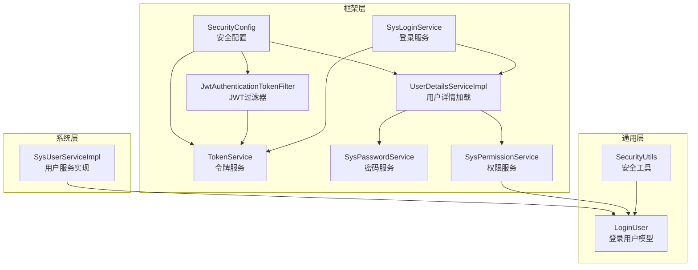
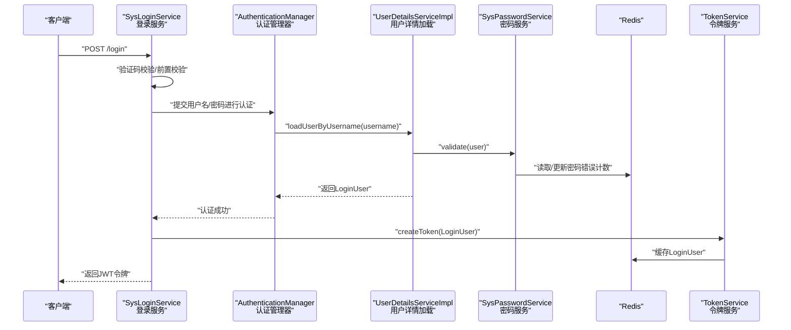
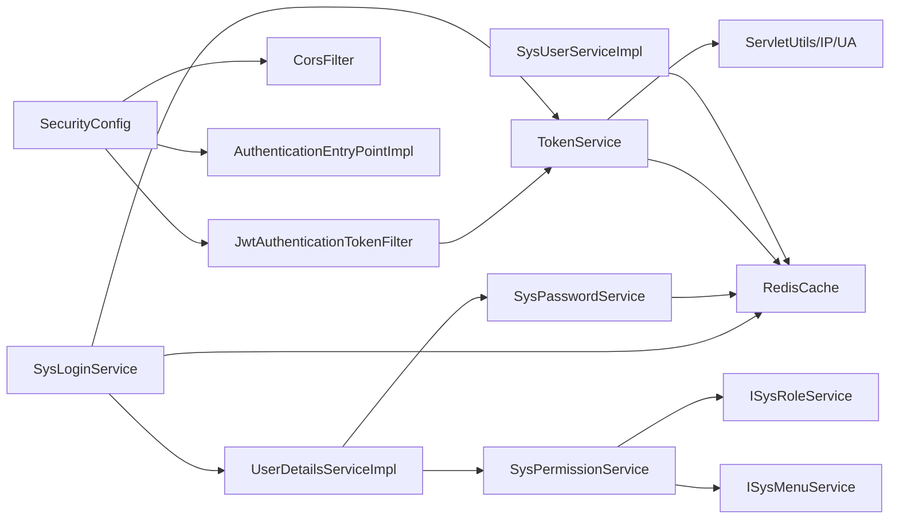
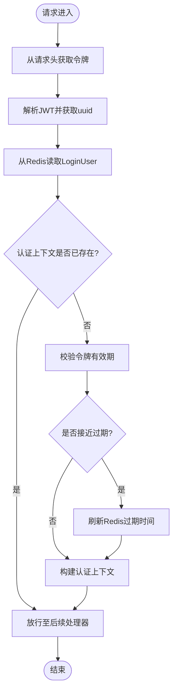
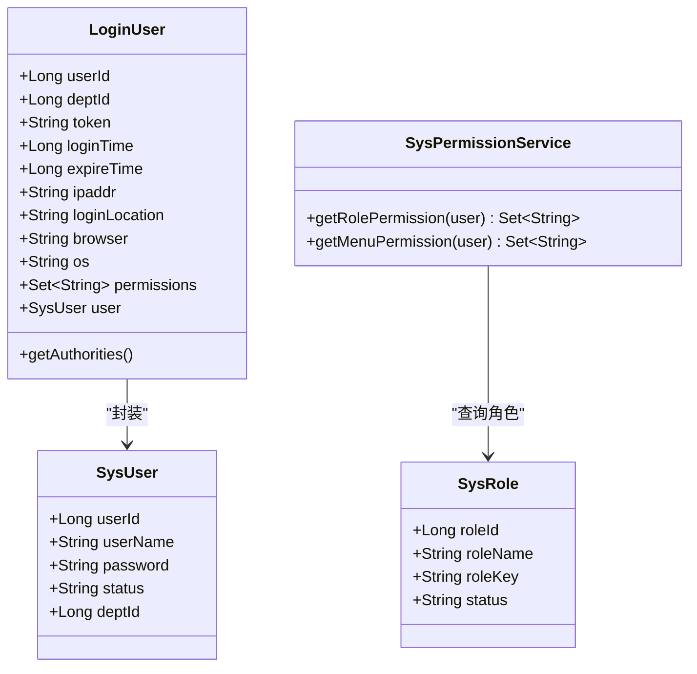

# 用户管理系统

<cite>
**本文引用的文件**
- [SecurityConfig.java](file://XingChen-Vue/xingchen-framework/src/main/java/com/xingchen/framework/config/SecurityConfig.java)
- [JwtAuthenticationTokenFilter.java](file://XingChen-Vue/xingchen-framework/src/main/java/com/xingchen/framework/security/filter/JwtAuthenticationTokenFilter.java)
- [UserDetailsServiceImpl.java](file://XingChen-Vue/xingchen-framework/src/main/java/com/xingchen/framework/web/service/UserDetailsServiceImpl.java)
- [TokenService.java](file://XingChen-Vue/xingchen-framework/src/main/java/com/xingchen/framework/web/service/TokenService.java)
- [SysLoginService.java](file://XingChen-Vue/xingchen-framework/src/main/java/com/xingchen/framework/web/service/SysLoginService.java)
- [SysPasswordService.java](file://XingChen-Vue/xingchen-framework/src/main/java/com/xingchen/framework/web/service/SysPasswordService.java)
- [SysPermissionService.java](file://XingChen-Vue/xingchen-framework/src/main/java/com/xingchen/framework/web/service/SysPermissionService.java)
- [SecurityUtils.java](file://XingChen-Vue/xingchen-common/src/main/java/com/xingchen/common/utils/SecurityUtils.java)
- [LoginUser.java](file://XingChen-Vue/xingchen-common/src/main/java/com/xingchen/common/core/domain/model/LoginUser.java)
- [SysUserServiceImpl.java](file://XingChen-Vue/xingchen-system/src/main/java/com/xingchen/system/service/impl/SysUserServiceImpl.java)
</cite>

## 目录
1. [简介](#简介)
2. [项目结构](#项目结构)
3. [核心组件](#核心组件)
4. [架构总览](#架构总览)
5. [详细组件分析](#详细组件分析)
6. [依赖分析](#依赖分析)
7. [性能考虑](#性能考虑)
8. [故障排查指南](#故障排查指南)
9. [结论](#结论)
10. [附录](#附录)

## 简介
本技术文档面向“用户管理系统”，围绕用户认证机制、权限管理体系、角色分配策略与用户信息管理展开，系统采用基于 JWT 的无状态认证与 Spring Security 拦截体系，结合 Redis 缓存与 BCrypt 密码加密，提供完整的 RBAC 权限模型实现与安全防护能力。文档同时覆盖用户 CRUD 操作、权限验证拦截器、XSS 与 SQL 注入防护、配置参数说明及常见问题解决方案。

## 项目结构
系统采用多模块分层组织：
- framework 层：安全配置、JWT 过滤器、登录/密码/权限服务、上下文与全局异常等
- common 层：通用常量、工具类、领域模型（如 LoginUser）、过滤器与 XSS/SQL 工具
- system 层：用户、角色、菜单、字典等业务实体与服务实现
- 前端模块：Vue3 前端工程，包含用户相关页面与权限指令

图表来源
- [SecurityConfig.java:85-118](file://XingChen-Vue/xingchen-framework/src/main/java/com/xingchen/framework/config/SecurityConfig.java#L85-L118)
- [JwtAuthenticationTokenFilter.java:30-43](file://XingChen-Vue/xingchen-framework/src/main/java/com/xingchen/framework/security/filter/JwtAuthenticationTokenFilter.java#L30-L43)
- [UserDetailsServiceImpl.java:37-60](file://XingChen-Vue/xingchen-framework/src/main/java/com/xingchen/framework/web/service/UserDetailsServiceImpl.java#L37-L60)
- [TokenService.java:62-83](file://XingChen-Vue/xingchen-framework/src/main/java/com/xingchen/framework/web/service/TokenService.java#L62-L83)
- [SysLoginService.java:63-100](file://XingChen-Vue/xingchen-framework/src/main/java/com/xingchen/framework/web/service/SysLoginService.java#L63-L100)
- [SysPasswordService.java:44-77](file://XingChen-Vue/xingchen-framework/src/main/java/com/xingchen/framework/web/service/SysPasswordService.java#L44-L77)
- [SysPermissionService.java:37-88](file://XingChen-Vue/xingchen-framework/src/main/java/com/xingchen/framework/web/service/SysPermissionService.java#L37-L88)
- [SecurityUtils.java:21-189](file://XingChen-Vue/xingchen-common/src/main/java/com/xingchen/common/utils/SecurityUtils.java#L21-L189)
- [LoginUser.java:19-279](file://XingChen-Vue/xingchen-common/src/main/java/com/xingchen/common/core/domain/model/LoginUser.java#L19-L279)
- [SysUserServiceImpl.java:41-566](file://XingChen-Vue/xingchen-system/src/main/java/com/xingchen/system/service/impl/SysUserServiceImpl.java#L41-L566)

章节来源
- [SecurityConfig.java:85-118](file://XingChen-Vue/xingchen-framework/src/main/java/com/xingchen/framework/config/SecurityConfig.java#L85-L118)

## 核心组件
- 安全配置与过滤链：禁用 CSRF、配置匿名放行路径、启用方法级安全注解、注册 JWT 与 CORS 过滤器、设置无状态会话策略
- JWT 过滤器：从请求头解析令牌、读取 Redis 中的登录用户、校验过期并自动续期、构建认证上下文
- 用户详情加载：按用户名查询用户、状态校验、密码校验、组装 LoginUser 与权限集合
- 令牌服务：令牌创建/解析/续期、Redis 缓存键管理、用户代理与登录信息记录
- 登录服务：验证码校验、前置校验、调用 AuthenticationManager、记录登录日志、生成 JWT
- 密码服务：密码匹配、失败次数与锁定控制、缓存清理
- 权限服务：角色与菜单权限聚合、管理员特殊处理
- 安全工具：密码加密/匹配、权限/角色判断、当前用户信息获取
- 用户服务实现：用户 CRUD、角色/岗位关联、数据范围与唯一性校验

章节来源
- [SecurityConfig.java:27-129](file://XingChen-Vue/xingchen-framework/src/main/java/com/xingchen/framework/config/SecurityConfig.java#L27-L129)
- [JwtAuthenticationTokenFilter.java:24-45](file://XingChen-Vue/xingchen-framework/src/main/java/com/xingchen/framework/security/filter/JwtAuthenticationTokenFilter.java#L24-L45)
- [UserDetailsServiceImpl.java:23-67](file://XingChen-Vue/xingchen-framework/src/main/java/com/xingchen/framework/web/service/UserDetailsServiceImpl.java#L23-L67)
- [TokenService.java:31-233](file://XingChen-Vue/xingchen-framework/src/main/java/com/xingchen/framework/web/service/TokenService.java#L31-L233)
- [SysLoginService.java:36-177](file://XingChen-Vue/xingchen-framework/src/main/java/com/xingchen/framework/web/service/SysLoginService.java#L36-L177)
- [SysPasswordService.java:21-87](file://XingChen-Vue/xingchen-framework/src/main/java/com/xingchen/framework/web/service/SysPasswordService.java#L21-L87)
- [SysPermissionService.java:22-90](file://XingChen-Vue/xingchen-framework/src/main/java/com/xingchen/framework/web/service/SysPermissionService.java#L22-L90)
- [SecurityUtils.java:21-189](file://XingChen-Vue/xingchen-common/src/main/java/com/xingchen/common/utils/SecurityUtils.java#L21-L189)
- [LoginUser.java:19-279](file://XingChen-Vue/xingchen-common/src/main/java/com/xingchen/common/core/domain/model/LoginUser.java#L19-L279)
- [SysUserServiceImpl.java:41-566](file://XingChen-Vue/xingchen-system/src/main/java/com/xingchen/system/service/impl/SysUserServiceImpl.java#L41-L566)

## 架构总览
系统采用前后端分离，后端基于 Spring Boot + Spring Security + JWT 实现无状态认证；用户认证流程由登录接口触发，随后发放 JWT 并在后续请求中由 JWT 过滤器解析与校验；权限判断通过方法级注解与工具类完成；用户信息与权限以 LoginUser 形式在内存与 Redis 中缓存，确保高并发下的性能与一致性。

图表来源
- [SysLoginService.java:63-100](file://XingChen-Vue/xingchen-framework/src/main/java/com/xingchen/framework/web/service/SysLoginService.java#L63-L100)
- [UserDetailsServiceImpl.java:37-60](file://XingChen-Vue/xingchen-framework/src/main/java/com/xingchen/framework/web/service/UserDetailsServiceImpl.java#L37-L60)
- [SysPasswordService.java:44-77](file://XingChen-Vue/xingchen-framework/src/main/java/com/xingchen/framework/web/service/SysPasswordService.java#L44-L77)
- [TokenService.java:114-125](file://XingChen-Vue/xingchen-framework/src/main/java/com/xingchen/framework/web/service/TokenService.java#L114-L125)

## 详细组件分析

### 安全配置与过滤链
- 禁用 CSRF，关闭缓存与 frameOptions，设置无状态会话
- 放行匿名访问路径（登录、注册、验证码、静态资源、Swagger、Druid）
- 注册 JWT 与 CORS 过滤器，保证鉴权与跨域处理顺序
- 开启方法级安全注解（@PreAuthorize/@Secured），用于接口级权限控制

章节来源
- [SecurityConfig.java:85-118](file://XingChen-Vue/xingchen-framework/src/main/java/com/xingchen/framework/config/SecurityConfig.java#L85-L118)

### JWT 认证过滤器
- 从请求头提取令牌，去除前缀
- 从 Redis 读取 LoginUser，若为空则跳过
- 若认证上下文为空，则构建 UsernamePasswordAuthenticationToken 并写入 SecurityContextHolder
- 在令牌即将过期（剩余时间小于阈值）时自动刷新缓存

章节来源
- [JwtAuthenticationTokenFilter.java:30-43](file://XingChen-Vue/xingchen-framework/src/main/java/com/xingchen/framework/security/filter/JwtAuthenticationTokenFilter.java#L30-L43)
- [TokenService.java:62-83](file://XingChen-Vue/xingchen-framework/src/main/java/com/xingchen/framework/web/service/TokenService.java#L62-L83)

### 用户详情加载与密码校验
- 根据用户名查询用户，校验是否存在、是否删除、是否停用
- 调用密码服务进行密码匹配与错误次数控制
- 组装 LoginUser，并通过权限服务获取菜单权限集合

章节来源
- [UserDetailsServiceImpl.java:37-65](file://XingChen-Vue/xingchen-framework/src/main/java/com/xingchen/framework/web/service/UserDetailsServiceImpl.java#L37-L65)
- [SysPasswordService.java:44-77](file://XingChen-Vue/xingchen-framework/src/main/java/com/xingchen/framework/web/service/SysPasswordService.java#L44-L77)

### 令牌服务与会话管理
- 令牌创建：生成 UUID 作为 token，填充用户代理与登录信息，写入 Redis
- 令牌解析：从请求头读取并解析 JWT，根据 uuid 从 Redis 取回 LoginUser
- 令牌续期：当剩余有效期小于阈值时刷新过期时间
- 令牌清理：登出时删除 Redis 中对应键

章节来源
- [TokenService.java:62-155](file://XingChen-Vue/xingchen-framework/src/main/java/com/xingchen/framework/web/service/TokenService.java#L62-L155)

### 登录流程与验证码校验
- 登录前置校验：用户名/密码长度校验、黑名单 IP 校验
- 验证码校验：从 Redis 读取并比对，过期或错误抛出相应异常
- 认证执行：通过 AuthenticationManager 调用 UserDetailsServiceImpl.loadUserByUsername
- 登录成功：记录登录日志、更新登录信息、生成 JWT

章节来源
- [SysLoginService.java:63-100](file://XingChen-Vue/xingchen-framework/src/main/java/com/xingchen/framework/web/service/SysLoginService.java#L63-L100)
- [SysLoginService.java:110-129](file://XingChen-Vue/xingchen-framework/src/main/java/com/xingchen/framework/web/service/SysLoginService.java#L110-L129)
- [SysLoginService.java:136-165](file://XingChen-Vue/xingchen-framework/src/main/java/com/xingchen/framework/web/service/SysLoginService.java#L136-L165)

### 权限服务与 RBAC 模型
- 角色权限：管理员拥有全部角色；普通用户通过角色表查询
- 菜单权限：管理员拥有全部菜单；普通用户通过角色或直接用户查询
- 权限聚合：将多个角色的权限合并，支持通配符匹配与全权限标识

章节来源
- [SysPermissionService.java:37-88](file://XingChen-Vue/xingchen-framework/src/main/java/com/xingchen/framework/web/service/SysPermissionService.java#L37-L88)

### 安全工具与权限判断
- 密码加密与匹配：BCryptPasswordEncoder
- 当前用户信息：获取用户 ID、部门 ID、用户名、LoginUser
- 权限/角色判断：支持通配符匹配与管理员特例

章节来源
- [SecurityUtils.java:92-189](file://XingChen-Vue/xingchen-common/src/main/java/com/xingchen/common/utils/SecurityUtils.java#L92-L189)

### 用户模型与领域对象
- LoginUser：实现 UserDetails，封装用户信息、权限集合与登录元数据
- 提供权限集合到 GrantedAuthority 的转换，便于 Spring Security 使用

章节来源
- [LoginUser.java:19-279](file://XingChen-Vue/xingchen-common/src/main/java/com/xingchen/common/core/domain/model/LoginUser.java#L19-L279)

### 用户 CRUD 与角色分配
- 用户新增/修改：维护用户与岗位、角色的关联表
- 用户授权角色：先删除旧关联，再批量插入新关联
- 用户删除：级联删除角色与岗位关联，再删除用户
- 数据范围与唯一性：用户名/手机/邮箱唯一性校验，数据范围校验

章节来源
- [SysUserServiceImpl.java:260-320](file://XingChen-Vue/xingchen-system/src/main/java/com/xingchen/system/service/impl/SysUserServiceImpl.java#L260-L320)
- [SysUserServiceImpl.java:458-467](file://XingChen-Vue/xingchen-system/src/main/java/com/xingchen/system/service/impl/SysUserServiceImpl.java#L458-L467)
- [SysUserServiceImpl.java:172-218](file://XingChen-Vue/xingchen-system/src/main/java/com/xingchen/system/service/impl/SysUserServiceImpl.java#L172-L218)

### 权限验证拦截器与方法级控制
- 方法级注解：@PreAuthorize/@Secured 生效，结合 SecurityConfig 启用
- 前端指令：hasPermi/hasRole 指令用于界面元素显示控制

章节来源
- [SecurityConfig.java:27](file://XingChen-Vue/xingchen-framework/src/main/java/com/xingchen/framework/config/SecurityConfig.java#L27)
- [SecurityUtils.java:144-186](file://XingChen-Vue/xingchen-common/src/main/java/com/xingchen/common/utils/SecurityUtils.java#L144-L186)

### XSS 与 SQL 注入防护
- XSS 防护：XssFilter 与 XssHttpServletRequestWrapper 对输入进行清洗
- SQL 注入防护：MyBatis 参数绑定与动态 SQL，避免拼接字符串；字段校验与白名单

章节来源
- [SecurityConfig.java:100-109](file://XingChen-Vue/xingchen-framework/src/main/java/com/xingchen/framework/config/SecurityConfig.java#L100-L109)

## 依赖分析
- 组件耦合
  - SecurityConfig 依赖 JwtAuthenticationTokenFilter、CorsFilter、AuthenticationEntryPointImpl、PermitAllUrlProperties
  - JwtAuthenticationTokenFilter 依赖 TokenService
  - UserDetailsServiceImpl 依赖 ISysUserService、SysPasswordService、SysPermissionService
  - SysLoginService 依赖 AuthenticationManager、TokenService、RedisCache、ISysUserService、ISysConfigService
  - SysPasswordService 依赖 RedisCache、SecurityUtils
  - SysPermissionService 依赖 ISysRoleService、ISysMenuService
  - TokenService 依赖 RedisCache、ServletUtils、IpUtils、AddressUtils、UserAgentUtils
  - SecurityUtils 依赖 Spring Security 上下文与 BCrypt
  - SysUserServiceImpl 依赖各 Mapper 与配置服务

图表来源
- [SecurityConfig.java:18-59](file://XingChen-Vue/xingchen-framework/src/main/java/com/xingchen/framework/config/SecurityConfig.java#L18-L59)
- [JwtAuthenticationTokenFilter.java:17](file://XingChen-Vue/xingchen-framework/src/main/java/com/xingchen/framework/security/filter/JwtAuthenticationTokenFilter.java#L17)
- [UserDetailsServiceImpl.java:28-35](file://XingChen-Vue/xingchen-framework/src/main/java/com/xingchen/framework/web/service/UserDetailsServiceImpl.java#L28-L35)
- [SysLoginService.java:39-52](file://XingChen-Vue/xingchen-framework/src/main/java/com/xingchen/framework/web/service/SysLoginService.java#L39-L52)
- [SysPasswordService.java:24-31](file://XingChen-Vue/xingchen-framework/src/main/java/com/xingchen/framework/web/service/SysPasswordService.java#L24-L31)
- [SysPermissionService.java:25-29](file://XingChen-Vue/xingchen-framework/src/main/java/com/xingchen/framework/web/service/SysPermissionService.java#L25-L29)
- [TokenService.java:54-55](file://XingChen-Vue/xingchen-framework/src/main/java/com/xingchen/framework/web/service/TokenService.java#L54-L55)
- [SysUserServiceImpl.java:45-67](file://XingChen-Vue/xingchen-system/src/main/java/com/xingchen/system/service/impl/SysUserServiceImpl.java#L45-L67)

## 性能考虑
- 令牌与用户信息缓存：LoginUser 存储于 Redis，减少数据库访问与 JWT 解析开销
- 自动续期：临近过期自动刷新，降低频繁登录带来的压力
- 无状态会话：STATELESS 策略避免服务器端会话存储
- 密码错误次数缓存：限制暴力破解，保护后端资源

## 故障排查指南
- 登录失败
  - 验证码过期或错误：检查 Redis 中验证码键是否存在与匹配
  - 密码错误次数超限：查看密码错误计数缓存键与锁定时间
  - 黑名单 IP：确认配置项 sys.login.blackIPList
- 权限不足
  - 检查用户角色与菜单权限是否正确分配
  - 确认方法级注解是否生效（SecurityConfig 已启用）
- JWT 无效
  - 核对请求头中的令牌前缀与配置项 token.header
  - 检查 Redis 中 LoginUser 缓存是否过期
- 密码加密不匹配
  - 确认使用 BCrypt 加密与匹配逻辑一致

章节来源
- [SysLoginService.java:110-129](file://XingChen-Vue/xingchen-framework/src/main/java/com/xingchen/framework/web/service/SysLoginService.java#L110-L129)
- [SysPasswordService.java:57-71](file://XingChen-Vue/xingchen-framework/src/main/java/com/xingchen/framework/web/service/SysPasswordService.java#L57-L71)
- [TokenService.java:218-226](file://XingChen-Vue/xingchen-framework/src/main/java/com/xingchen/framework/web/service/TokenService.java#L218-L226)

## 结论
本系统通过 Spring Security + JWT + Redis 的组合实现了高可用、高性能的用户认证与权限控制。RBAC 权限模型清晰，支持角色与菜单权限的灵活配置；配合密码加密、验证码与黑名单等安全策略，有效提升了系统的安全性与稳定性。建议在生产环境中进一步完善审计日志、令牌刷新策略与缓存监控。

## 附录

### JWT 认证流程图

图表来源
- [JwtAuthenticationTokenFilter.java:30-43](file://XingChen-Vue/xingchen-framework/src/main/java/com/xingchen/framework/security/filter/JwtAuthenticationTokenFilter.java#L30-L43)
- [TokenService.java:133-141](file://XingChen-Vue/xingchen-framework/src/main/java/com/xingchen/framework/web/service/TokenService.java#L133-L141)

### RBAC 权限模型类图

图表来源
- [LoginUser.java:82-94](file://XingChen-Vue/xingchen-common/src/main/java/com/xingchen/common/core/domain/model/LoginUser.java#L82-L94)
- [SysPermissionService.java:37-88](file://XingChen-Vue/xingchen-framework/src/main/java/com/xingchen/framework/web/service/SysPermissionService.java#L37-L88)