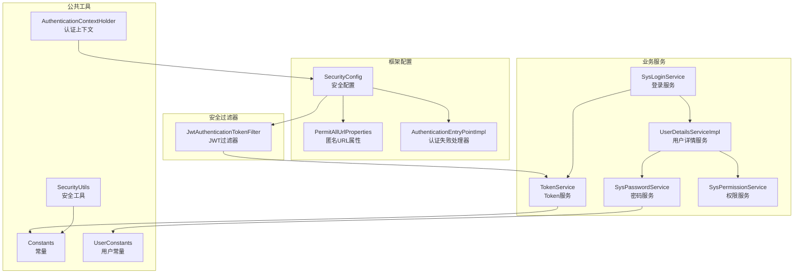
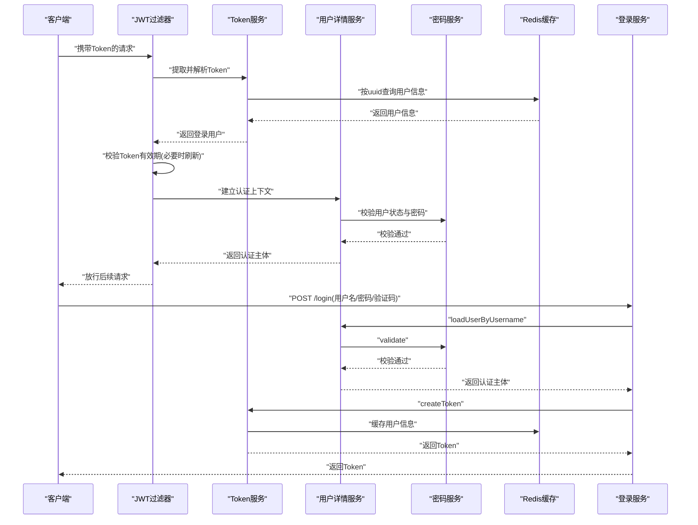
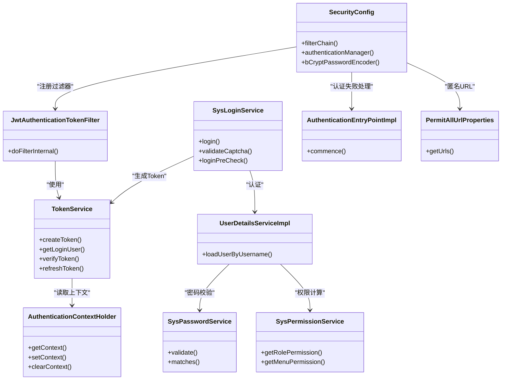
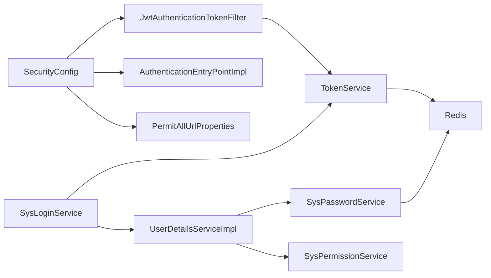

# 用户认证机制

<cite>
**本文引用的文件**
- [SecurityConfig.java](file://XingChen-Vue/xingchen-framework/src/main/java/com/xingchen/framework/config/SecurityConfig.java)
- [JwtAuthenticationTokenFilter.java](file://XingChen-Vue/xingchen-framework/src/main/java/com/xingchen/framework/security/filter/JwtAuthenticationTokenFilter.java)
- [SysLoginService.java](file://XingChen-Vue/xingchen-framework/src/main/java/com/xingchen/framework/web/service/SysLoginService.java)
- [TokenService.java](file://XingChen-Vue/xingchen-framework/src/main/java/com/xingchen/framework/web/service/TokenService.java)
- [UserDetailsServiceImpl.java](file://XingChen-Vue/xingchen-framework/src/main/java/com/xingchen/framework/web/service/UserDetailsServiceImpl.java)
- [SysPasswordService.java](file://XingChen-Vue/xingchen-framework/src/main/java/com/xingchen/framework/web/service/SysPasswordService.java)
- [SysPermissionService.java](file://XingChen-Vue/xingchen-framework/src/main/java/com/xingchen/framework/web/service/SysPermissionService.java)
- [AuthenticationContextHolder.java](file://XingChen-Vue/xingchen-framework/src/main/java/com/xingchen/framework/security/context/AuthenticationContextHolder.java)
- [AuthenticationEntryPointImpl.java](file://XingChen-Vue/xingchen-framework/src/main/java/com/xingchen/framework/security/handle/AuthenticationEntryPointImpl.java)
- [PermitAllUrlProperties.java](file://XingChen-Vue/xingchen-framework/src/main/java/com/xingchen/framework/config/properties/PermitAllUrlProperties.java)
- [Constants.java](file://XingChen-Vue/xingchen-common/src/main/java/com/xingchen/common/constant/Constants.java)
- [UserConstants.java](file://XingChen-Vue/xingchen-common/src/main/java/com/xingchen/common/constant/UserConstants.java)
- [SecurityUtils.java](file://XingChen-Vue/xingchen-common/src/main/java/com/xingchen/common/utils/SecurityUtils.java)
</cite>

## 目录
1. [简介](#简介)
2. [项目结构](#项目结构)
3. [核心组件](#核心组件)
4. [架构总览](#架构总览)
5. [详细组件分析](#详细组件分析)
6. [依赖关系分析](#依赖关系分析)
7. [性能考量](#性能考量)
8. [故障排查指南](#故障排查指南)
9. [结论](#结论)
10. [附录](#附录)

## 简介
本文件面向健康管理系统中的用户认证机制，围绕基于 JWT 的 Token 认证流程、Spring Security 安全配置、密码加密策略与会话管理进行深入技术说明。内容涵盖登录控制器的实现思路、Token 的生成与验证过程、权限拦截器的工作原理、安全配置项与常见问题的解决方案，并以图示展示各组件之间的交互关系与安全防护措施。

## 项目结构
认证相关代码主要分布在框架模块与公共模块中：
- 框架层负责安全配置、过滤器链、认证入口、注销处理与上下文管理
- 业务服务层负责登录校验、密码校验、权限计算与 Token 生命周期管理
- 公共模块提供常量、工具类与异常类型

图表来源
- [SecurityConfig.java:85-118](file://XingChen-Vue/xingchen-framework/src/main/java/com/xingchen/framework/config/SecurityConfig.java#L85-L118)
- [JwtAuthenticationTokenFilter.java:30-43](file://XingChen-Vue/xingchen-framework/src/main/java/com/xingchen/framework/security/filter/JwtAuthenticationTokenFilter.java#L30-L43)
- [SysLoginService.java:63-100](file://XingChen-Vue/xingchen-framework/src/main/java/com/xingchen/framework/web/service/SysLoginService.java#L63-L100)
- [TokenService.java:62-83](file://XingChen-Vue/xingchen-framework/src/main/java/com/xingchen/framework/web/service/TokenService.java#L62-L83)
- [UserDetailsServiceImpl.java:37-65](file://XingChen-Vue/xingchen-framework/src/main/java/com/xingchen/framework/web/service/UserDetailsServiceImpl.java#L37-L65)
- [SysPasswordService.java:44-77](file://XingChen-Vue/xingchen-framework/src/main/java/com/xingchen/framework/web/service/SysPasswordService.java#L44-L77)
- [SysPermissionService.java:37-88](file://XingChen-Vue/xingchen-framework/src/main/java/com/xingchen/framework/web/service/SysPermissionService.java#L37-L88)
- [Constants.java:104-121](file://XingChen-Vue/xingchen-common/src/main/java/com/xingchen/common/constant/Constants.java#L104-L121)
- [UserConstants.java:70-81](file://XingChen-Vue/xingchen-common/src/main/java/com/xingchen/common/constant/UserConstants.java#L70-L81)
- [SecurityUtils.java:92-115](file://XingChen-Vue/xingchen-common/src/main/java/com/xingchen/common/utils/SecurityUtils.java#L92-L115)
- [AuthenticationEntryPointImpl.java:26-33](file://XingChen-Vue/xingchen-framework/src/main/java/com/xingchen/framework/security/handle/AuthenticationEntryPointImpl.java#L26-L33)
- [PermitAllUrlProperties.java:38-56](file://XingChen-Vue/xingchen-framework/src/main/java/com/xingchen/framework/config/properties/PermitAllUrlProperties.java#L38-L56)

章节来源
- [SecurityConfig.java:85-118](file://XingChen-Vue/xingchen-framework/src/main/java/com/xingchen/framework/config/SecurityConfig.java#L85-L118)
- [PermitAllUrlProperties.java:38-56](file://XingChen-Vue/xingchen-framework/src/main/java/com/xingchen/framework/config/properties/PermitAllUrlProperties.java#L38-L56)

## 核心组件
- 安全配置与过滤器链：通过配置类启用方法级安全、禁用 CSRF、设置无状态会话、注册 CORS 与 JWT 过滤器、异常处理与注销处理
- JWT 过滤器：从请求头读取 Token，解析用户信息，校验有效期并在上下文中建立认证
- 登录服务：验证码校验、前置校验、调用认证管理器完成认证、记录登录日志、生成 Token
- Token 服务：生成 Token、解析 Token、刷新过期时间、存储用户信息到 Redis
- 用户详情服务：加载用户、校验状态、委托密码与权限服务构建认证主体
- 密码服务：基于 Redis 的失败次数统计与锁定、密码匹配校验
- 权限服务：根据用户角色与菜单计算权限集合
- 上下文与工具：线程本地认证上下文、安全工具类（加密、匹配、权限判断）

章节来源
- [SecurityConfig.java:85-127](file://XingChen-Vue/xingchen-framework/src/main/java/com/xingchen/framework/config/SecurityConfig.java#L85-L127)
- [JwtAuthenticationTokenFilter.java:30-43](file://XingChen-Vue/xingchen-framework/src/main/java/com/xingchen/framework/security/filter/JwtAuthenticationTokenFilter.java#L30-L43)
- [SysLoginService.java:63-100](file://XingChen-Vue/xingchen-framework/src/main/java/com/xingchen/framework/web/service/SysLoginService.java#L63-L100)
- [TokenService.java:114-155](file://XingChen-Vue/xingchen-framework/src/main/java/com/xingchen/framework/web/service/TokenService.java#L114-L155)
- [UserDetailsServiceImpl.java:37-65](file://XingChen-Vue/xingchen-framework/src/main/java/com/xingchen/framework/web/service/UserDetailsServiceImpl.java#L37-L65)
- [SysPasswordService.java:44-77](file://XingChen-Vue/xingchen-framework/src/main/java/com/xingchen/framework/web/service/SysPasswordService.java#L44-L77)
- [SysPermissionService.java:37-88](file://XingChen-Vue/xingchen-framework/src/main/java/com/xingchen/framework/web/service/SysPermissionService.java#L37-L88)
- [AuthenticationContextHolder.java:10-28](file://XingChen-Vue/xingchen-framework/src/main/java/com/xingchen/framework/security/context/AuthenticationContextHolder.java#L10-L28)
- [SecurityUtils.java:92-115](file://XingChen-Vue/xingchen-common/src/main/java/com/xingchen/common/utils/SecurityUtils.java#L92-L115)

## 架构总览
下图展示了认证流程的关键步骤与组件交互：

图表来源
- [JwtAuthenticationTokenFilter.java:30-43](file://XingChen-Vue/xingchen-framework/src/main/java/com/xingchen/framework/security/filter/JwtAuthenticationTokenFilter.java#L30-L43)
- [TokenService.java:62-83](file://XingChen-Vue/xingchen-framework/src/main/java/com/xingchen/framework/web/service/TokenService.java#L62-L83)
- [TokenService.java:114-155](file://XingChen-Vue/xingchen-framework/src/main/java/com/xingchen/framework/web/service/TokenService.java#L114-L155)
- [UserDetailsServiceImpl.java:37-65](file://XingChen-Vue/xingchen-framework/src/main/java/com/xingchen/framework/web/service/UserDetailsServiceImpl.java#L37-L65)
- [SysPasswordService.java:44-77](file://XingChen-Vue/xingchen-framework/src/main/java/com/xingchen/framework/web/service/SysPasswordService.java#L44-L77)
- [SysLoginService.java:63-100](file://XingChen-Vue/xingchen-framework/src/main/java/com/xingchen/framework/web/service/SysLoginService.java#L63-L100)

## 详细组件分析

### Spring Security 配置与过滤器链
- 禁用 CSRF，关闭缓存控制与 frameOptions，设置无状态会话
- 注册异常处理、注销处理器、JWT 过滤器与 CORS 过滤器
- 放行匿名访问的 URL（含注解与静态资源），其余请求需认证
- 提供 BCrypt 密码编码器 Bean

章节来源
- [SecurityConfig.java:85-118](file://XingChen-Vue/xingchen-framework/src/main/java/com/xingchen/framework/config/SecurityConfig.java#L85-L118)
- [SecurityConfig.java:120-127](file://XingChen-Vue/xingchen-framework/src/main/java/com/xingchen/framework/config/SecurityConfig.java#L120-L127)

### JWT Token 认证过滤器
- 从请求头读取 Token，去除前缀
- 解析用户信息并校验是否已存在认证上下文
- 若 Token 即将过期则刷新缓存有效期
- 在 SecurityContext 中设置认证主体，放行后续过滤器

章节来源
- [JwtAuthenticationTokenFilter.java:30-43](file://XingChen-Vue/xingchen-framework/src/main/java/com/xingchen/framework/security/filter/JwtAuthenticationTokenFilter.java#L30-L43)

### 登录控制器与登录服务
- 登录服务负责验证码校验、前置校验、调用认证管理器、记录登录信息与生成 Token
- 前置校验包括用户名/密码长度、黑名单 IP 校验
- 验证码启用时从 Redis 读取并校验，校验失败抛出对应异常

章节来源
- [SysLoginService.java:63-100](file://XingChen-Vue/xingchen-framework/src/main/java/com/xingchen/framework/web/service/SysLoginService.java#L63-L100)
- [SysLoginService.java:110-129](file://XingChen-Vue/xingchen-framework/src/main/java/com/xingchen/framework/web/service/SysLoginService.java#L110-L129)
- [SysLoginService.java:136-165](file://XingChen-Vue/xingchen-framework/src/main/java/com/xingchen/framework/web/service/SysLoginService.java#L136-L165)

### Token 生成与验证
- 生成：为登录用户生成唯一 uuid，写入用户代理信息，缓存用户对象到 Redis，构造 JWT Claims 并签名
- 解析：从请求头读取 Token，解析签名并提取 uuid，再从 Redis 读取用户对象
- 刷新：当剩余有效期小于阈值时刷新缓存有效期
- 存储键：使用统一前缀拼接 uuid

章节来源
- [TokenService.java:114-155](file://XingChen-Vue/xingchen-framework/src/main/java/com/xingchen/framework/web/service/TokenService.java#L114-L155)
- [TokenService.java:62-83](file://XingChen-Vue/xingchen-framework/src/main/java/com/xingchen/framework/web/service/TokenService.java#L62-L83)
- [TokenService.java:133-141](file://XingChen-Vue/xingchen-framework/src/main/java/com/xingchen/framework/web/service/TokenService.java#L133-L141)
- [Constants.java:104-121](file://XingChen-Vue/xingchen-common/src/main/java/com/xingchen/common/constant/Constants.java#L104-L121)

### 密码加密策略与校验
- 密码加密采用 BCrypt，提供加密与匹配工具方法
- 登录密码校验通过 Redis 统计失败次数，超过阈值锁定，支持配置最大重试次数与锁定时长
- 匹配失败更新失败计数，成功清除缓存

章节来源
- [SecurityUtils.java:92-115](file://XingChen-Vue/xingchen-common/src/main/java/com/xingchen/common/utils/SecurityUtils.java#L92-L115)
- [SysPasswordService.java:27-31](file://XingChen-Vue/xingchen-framework/src/main/java/com/xingchen/framework/web/service/SysPasswordService.java#L27-L31)
- [SysPasswordService.java:44-77](file://XingChen-Vue/xingchen-framework/src/main/java/com/xingchen/framework/web/service/SysPasswordService.java#L44-L77)
- [UserConstants.java:70-81](file://XingChen-Vue/xingchen-common/src/main/java/com/xingchen/common/constant/UserConstants.java#L70-L81)

### 权限拦截与权限计算
- 用户详情服务加载用户并委托密码与权限服务
- 权限服务根据用户角色与菜单计算权限集合，管理员拥有全部权限
- 安全工具类提供权限与角色判断方法

章节来源
- [UserDetailsServiceImpl.java:37-65](file://XingChen-Vue/xingchen-framework/src/main/java/com/xingchen/framework/web/service/UserDetailsServiceImpl.java#L37-L65)
- [SysPermissionService.java:37-88](file://XingChen-Vue/xingchen-framework/src/main/java/com/xingchen/framework/web/service/SysPermissionService.java#L37-L88)
- [SecurityUtils.java:144-186](file://XingChen-Vue/xingchen-common/src/main/java/com/xingchen/common/utils/SecurityUtils.java#L144-L186)

### 会话管理机制
- 使用无状态会话策略，基于 Token 的认证替代 Session
- Token 有效期由配置项控制，默认单位分钟
- 过期前刷新缓存有效期，降低频繁重新登录带来的体验问题

章节来源
- [SecurityConfig.java:98](file://XingChen-Vue/xingchen-framework/src/main/java/com/xingchen/framework/config/SecurityConfig.java#L98)
- [TokenService.java:44-46](file://XingChen-Vue/xingchen-framework/src/main/java/com/xingchen/framework/web/service/TokenService.java#L44-L46)
- [TokenService.java:133-141](file://XingChen-Vue/xingchen-framework/src/main/java/com/xingchen/framework/web/service/TokenService.java#L133-L141)

### 权限拦截器工作原理
- 通过注解扫描收集带匿名注解的 URL，动态加入放行列表
- 静态资源与 Swagger、Druid 等也纳入放行范围
- 其余请求均需认证

章节来源
- [PermitAllUrlProperties.java:38-56](file://XingChen-Vue/xingchen-framework/src/main/java/com/xingchen/framework/config/properties/PermitAllUrlProperties.java#L38-L56)
- [SecurityConfig.java:100-109](file://XingChen-Vue/xingchen-framework/src/main/java/com/xingchen/framework/config/SecurityConfig.java#L100-L109)

### 认证失败处理
- 未认证访问受保护资源时，返回统一的 AjaxResult 错误响应

章节来源
- [AuthenticationEntryPointImpl.java:26-33](file://XingChen-Vue/xingchen-framework/src/main/java/com/xingchen/framework/security/handle/AuthenticationEntryPointImpl.java#L26-L33)

### 类关系图（代码级）

图表来源
- [SecurityConfig.java:85-127](file://XingChen-Vue/xingchen-framework/src/main/java/com/xingchen/framework/config/SecurityConfig.java#L85-L127)
- [JwtAuthenticationTokenFilter.java:30-43](file://XingChen-Vue/xingchen-framework/src/main/java/com/xingchen/framework/security/filter/JwtAuthenticationTokenFilter.java#L30-L43)
- [SysLoginService.java:63-100](file://XingChen-Vue/xingchen-framework/src/main/java/com/xingchen/framework/web/service/SysLoginService.java#L63-L100)
- [TokenService.java:114-155](file://XingChen-Vue/xingchen-framework/src/main/java/com/xingchen/framework/web/service/TokenService.java#L114-L155)
- [UserDetailsServiceImpl.java:37-65](file://XingChen-Vue/xingchen-framework/src/main/java/com/xingchen/framework/web/service/UserDetailsServiceImpl.java#L37-L65)
- [SysPasswordService.java:44-77](file://XingChen-Vue/xingchen-framework/src/main/java/com/xingchen/framework/web/service/SysPasswordService.java#L44-L77)
- [SysPermissionService.java:37-88](file://XingChen-Vue/xingchen-framework/src/main/java/com/xingchen/framework/web/service/SysPermissionService.java#L37-L88)
- [AuthenticationContextHolder.java:10-28](file://XingChen-Vue/xingchen-framework/src/main/java/com/xingchen/framework/security/context/AuthenticationContextHolder.java#L10-L28)
- [AuthenticationEntryPointImpl.java:26-33](file://XingChen-Vue/xingchen-framework/src/main/java/com/xingchen/framework/security/handle/AuthenticationEntryPointImpl.java#L26-L33)
- [PermitAllUrlProperties.java:65-68](file://XingChen-Vue/xingchen-framework/src/main/java/com/xingchen/framework/config/properties/PermitAllUrlProperties.java#L65-68)

## 依赖关系分析
- 组件耦合度低：过滤器只依赖 Token 服务；登录服务依赖用户详情与 Token 服务；用户详情服务依赖密码与权限服务
- 外部依赖：Redis 用于缓存用户信息与验证码、密码失败计数；JWT 用于 Token 签名与解析
- 配置项：token.header、token.secret、token.expireTime、user.password.maxRetryCount、user.password.lockTime

图表来源
- [JwtAuthenticationTokenFilter.java:27-28](file://XingChen-Vue/xingchen-framework/src/main/java/com/xingchen/framework/security/filter/JwtAuthenticationTokenFilter.java#L27-L28)
- [SysLoginService.java:40](file://XingChen-Vue/xingchen-framework/src/main/java/com/xingchen/framework/web/service/SysLoginService.java#L40)
- [UserDetailsServiceImpl.java:28-35](file://XingChen-Vue/xingchen-framework/src/main/java/com/xingchen/framework/web/service/UserDetailsServiceImpl.java#L28-L35)
- [SysPasswordService.java:24-25](file://XingChen-Vue/xingchen-framework/src/main/java/com/xingchen/framework/web/service/SysPasswordService.java#L24-L25)
- [TokenService.java:54-55](file://XingChen-Vue/xingchen-framework/src/main/java/com/xingchen/framework/web/service/TokenService.java#L54-L55)
- [SecurityConfig.java:46-53](file://XingChen-Vue/xingchen-framework/src/main/java/com/xingchen/framework/config/SecurityConfig.java#L46-L53)

章节来源
- [SecurityConfig.java:46-53](file://XingChen-Vue/xingchen-framework/src/main/java/com/xingchen/framework/config/SecurityConfig.java#L46-L53)
- [TokenService.java:54-55](file://XingChen-Vue/xingchen-framework/src/main/java/com/xingchen/framework/web/service/TokenService.java#L54-L55)
- [SysPasswordService.java:24-25](file://XingChen-Vue/xingchen-framework/src/main/java/com/xingchen/framework/web/service/SysPasswordService.java#L24-L25)

## 性能考量
- 无状态会话避免了服务器端 Session 存储开销，适合水平扩展
- Token 有效期与自动刷新策略在安全性与用户体验之间取得平衡
- Redis 缓存用户信息与验证码，减少数据库压力
- 建议：合理设置 token.expireTime 与刷新阈值，避免频繁刷新导致缓存压力；对验证码与密码失败计数设置合适的过期时间

## 故障排查指南
- 请求未携带有效 Token 或格式不正确
  - 检查请求头是否包含正确的前缀与 Token 值
  - 参考：[TokenService.java:218-226](file://XingChen-Vue/xingchen-framework/src/main/java/com/xingchen/framework/web/service/TokenService.java#L218-L226)
- Token 已过期或即将过期
  - 确认 token.expireTime 配置与刷新阈值设置
  - 参考：[TokenService.java:44-46](file://XingChen-Vue/xingchen-framework/src/main/java/com/xingchen/framework/web/service/TokenService.java#L44-L46)、[TokenService.java:133-141](file://XingChen-Vue/xingchen-framework/src/main/java/com/xingchen/framework/web/service/TokenService.java#L133-L141)
- 登录失败或密码错误
  - 检查密码是否匹配，确认 Redis 中失败计数是否触发锁定
  - 参考：[SysPasswordService.java:44-77](file://XingChen-Vue/xingchen-framework/src/main/java/com/xingchen/framework/web/service/SysPasswordService.java#L44-L77)
- 用户不存在或被停用
  - 检查用户状态与是否存在
  - 参考：[UserDetailsServiceImpl.java:40-55](file://XingChen-Vue/xingchen-framework/src/main/java/com/xingchen/framework/web/service/UserDetailsServiceImpl.java#L40-L55)
- 验证码失效或不匹配
  - 确认验证码是否启用、Redis 中是否存在且未过期
  - 参考：[SysLoginService.java:110-129](file://XingChen-Vue/xingchen-framework/src/main/java/com/xingchen/framework/web/service/SysLoginService.java#L110-L129)
- 未认证访问受保护资源
  - 查看认证失败处理器返回的错误响应
  - 参考：[AuthenticationEntryPointImpl.java:26-33](file://XingChen-Vue/xingchen-framework/src/main/java/com/xingchen/framework/security/handle/AuthenticationEntryPointImpl.java#L26-L33)

章节来源
- [TokenService.java:218-226](file://XingChen-Vue/xingchen-framework/src/main/java/com/xingchen/framework/web/service/TokenService.java#L218-L226)
- [TokenService.java:44-46](file://XingChen-Vue/xingchen-framework/src/main/java/com/xingchen/framework/web/service/TokenService.java#L44-L46)
- [TokenService.java:133-141](file://XingChen-Vue/xingchen-framework/src/main/java/com/xingchen/framework/web/service/TokenService.java#L133-L141)
- [SysPasswordService.java:44-77](file://XingChen-Vue/xingchen-framework/src/main/java/com/xingchen/framework/web/service/SysPasswordService.java#L44-L77)
- [UserDetailsServiceImpl.java:40-55](file://XingChen-Vue/xingchen-framework/src/main/java/com/xingchen/framework/web/service/UserDetailsServiceImpl.java#L40-L55)
- [SysLoginService.java:110-129](file://XingChen-Vue/xingchen-framework/src/main/java/com/xingchen/framework/web/service/SysLoginService.java#L110-L129)
- [AuthenticationEntryPointImpl.java:26-33](file://XingChen-Vue/xingchen-framework/src/main/java/com/xingchen/framework/security/handle/AuthenticationEntryPointImpl.java#L26-L33)

## 结论
本认证机制通过 Spring Security 与 JWT 实现无状态、可扩展的用户认证，结合 Redis 缓存与密码策略保障安全性与可用性。配置清晰、职责分离，便于维护与演进。建议在生产环境中结合网络隔离、HTTPS、限流与审计等综合安全措施进一步加固。

## 附录
- 关键配置项
  - token.header：请求头中 Token 的键名
  - token.secret：JWT 签名密钥
  - token.expireTime：Token 有效期（分钟）
  - user.password.maxRetryCount：密码最大重试次数
  - user.password.lockTime：密码锁定时长（分钟）
- 常见异常与提示
  - 用户不存在、密码不匹配、验证码过期/错误、登录黑名单、权限不足等

章节来源
- [TokenService.java:37-46](file://XingChen-Vue/xingchen-framework/src/main/java/com/xingchen/framework/web/service/TokenService.java#L37-L46)
- [SysPasswordService.java:27-31](file://XingChen-Vue/xingchen-framework/src/main/java/com/xingchen/framework/web/service/SysPasswordService.java#L27-L31)
- [SysLoginService.java:110-129](file://XingChen-Vue/xingchen-framework/src/main/java/com/xingchen/framework/web/service/SysLoginService.java#L110-L129)
- [UserDetailsServiceImpl.java:40-55](file://XingChen-Vue/xingchen-framework/src/main/java/com/xingchen/framework/web/service/UserDetailsServiceImpl.java#L40-L55)