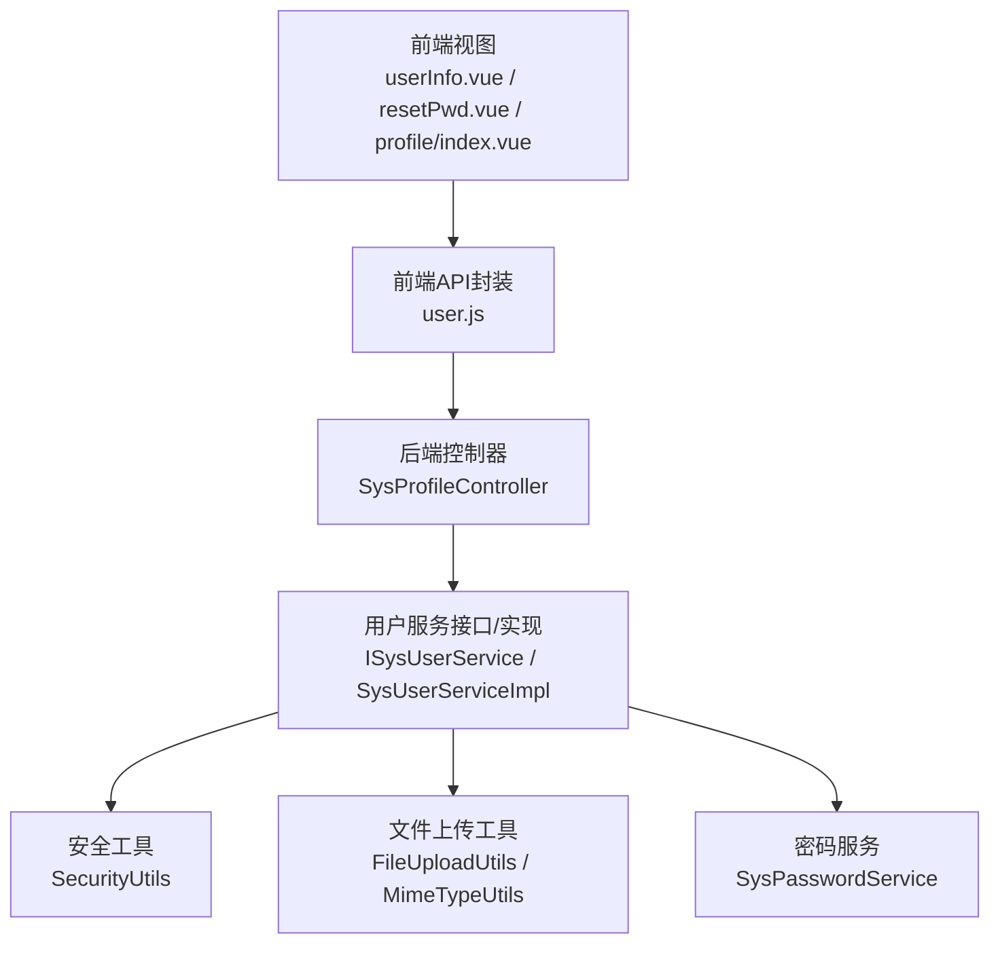
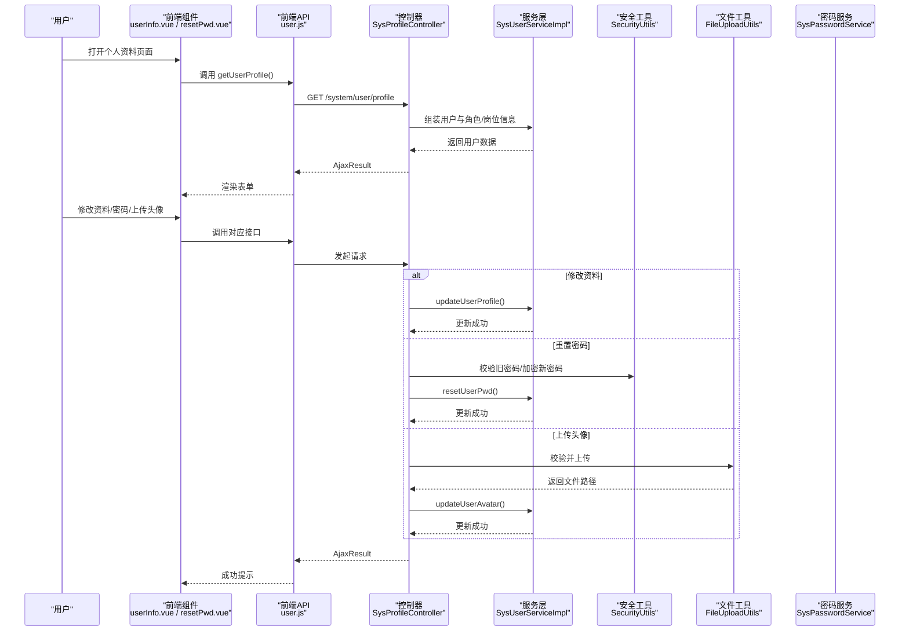
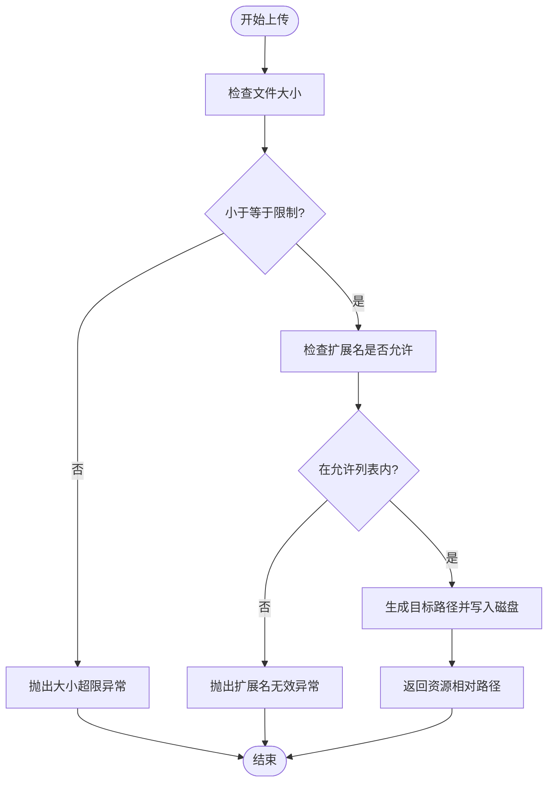
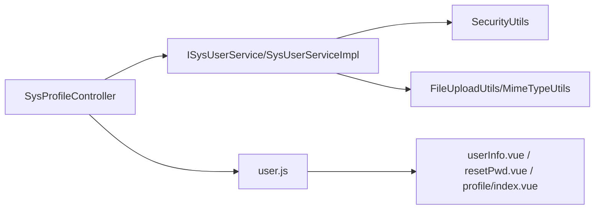

# 用户资料设置

<cite>
**本文引用的文件**   
- [SysProfileController.java](file://XingChen-Vue/xingchen-admin/src/main/java/com/xingchen/web/controller/system/SysProfileController.java)
- [ISysUserService.java](file://XingChen-Vue/xingchen-system/src/main/java/com/xingchen/system/service/ISysUserService.java)
- [SysUserServiceImpl.java](file://XingChen-Vue/xingchen-system/src/main/java/com/xingchen/system/service/impl/SysUserServiceImpl.java)
- [SecurityUtils.java](file://XingChen-Vue/xingchen-common/src/main/java/com/xingchen/common/utils/SecurityUtils.java)
- [FileUploadUtils.java](file://XingChen-Vue/xingchen-common/src/main/java/com/xingchen/common/utils/file/FileUploadUtils.java)
- [MimeTypeUtils.java](file://XingChen-Vue/xingchen-common/src/main/java/com/xingchen/common/utils/file/MimeTypeUtils.java)
- [SysPasswordService.java](file://XingChen-Vue/xingchen-framework/src/main/java/com/xingchen/framework/web/service/SysPasswordService.java)
- [user.js](file://XingChen-Vue3/src/api/system/user.js)
- [userInfo.vue](file://XingChen-Vue3/src/views/system/user/profile/userInfo.vue)
- [resetPwd.vue](file://XingChen-Vue3/src/views/system/user/profile/resetPwd.vue)
- [profile.vue](file://XingChen-Vue3/src/views/system/user/profile/index.vue)
- [ry_20260321.sql](file://XingChen-Vue/sql/ry_20260321.sql)
</cite>

## 目录
1. [简介](#简介)
2. [项目结构](#项目结构)
3. [核心组件](#核心组件)
4. [架构总览](#架构总览)
5. [详细组件分析](#详细组件分析)
6. [依赖分析](#依赖分析)
7. [性能考虑](#性能考虑)
8. [故障排查指南](#故障排查指南)
9. [结论](#结论)
10. [附录](#附录)

## 简介
本文件面向“用户资料设置”模块，系统性梳理后端控制器、用户服务层、安全与文件处理工具，以及前端交互组件的实现与协作关系。重点覆盖以下能力：
- 个人信息修改（昵称、手机、邮箱、性别）
- 密码重置（旧密码校验、新密码规则、加密存储）
- 头像上传（类型限制、大小限制、历史头像清理、缓存同步）
- 岗位信息管理（角色与岗位的查询与展示）

同时提供API示例、数据校验规则、文件处理流程图，并总结隐私保护与数据安全最佳实践。

## 项目结构
该模块采用前后端分离架构，前端负责UI与交互，后端提供REST接口与业务处理，通用工具库提供文件上传与安全工具。

**图表来源**
- [SysProfileController.java:34-148](file://XingChen-Vue/xingchen-admin/src/main/java/com/xingchen/web/controller/system/SysProfileController.java#L34-L148)
- [ISysUserService.java:12-218](file://XingChen-Vue/xingchen-system/src/main/java/com/xingchen/system/service/ISysUserService.java#L12-L218)
- [SysUserServiceImpl.java:40-566](file://XingChen-Vue/xingchen-system/src/main/java/com/xingchen/system/service/impl/SysUserServiceImpl.java#L40-L566)
- [SecurityUtils.java:21-189](file://XingChen-Vue/xingchen-common/src/main/java/com/xingchen/common/utils/SecurityUtils.java#L21-L189)
- [FileUploadUtils.java:24-261](file://XingChen-Vue/xingchen-common/src/main/java/com/xingchen/common/utils/file/FileUploadUtils.java#L24-L261)
- [MimeTypeUtils.java:8-60](file://XingChen-Vue/xingchen-common/src/main/java/com/xingchen/common/utils/file/MimeTypeUtils.java#L8-L60)
- [SysPasswordService.java:22-87](file://XingChen-Vue/xingchen-framework/src/main/java/com/xingchen/framework/web/service/SysPasswordService.java#L22-L87)
- [user.js:1-137](file://XingChen-Vue3/src/api/system/user.js#L1-L137)

**章节来源**
- [SysProfileController.java:34-148](file://XingChen-Vue/xingchen-admin/src/main/java/com/xingchen/web/controller/system/SysProfileController.java#L34-L148)
- [user.js:74-111](file://XingChen-Vue3/src/api/system/user.js#L74-L111)

## 核心组件
- 后端控制器：提供个人信息查询、修改、密码重置、头像上传等接口。
- 用户服务接口与实现：负责用户资料持久化、唯一性校验、角色/岗位查询、密码重置与头像更新。
- 安全工具：提供密码加密与匹配、上下文获取、权限判断等。
- 文件上传工具：统一处理文件大小、扩展名、命名策略与物理落盘。
- 密码服务：基于Redis的密码错误次数与锁定控制。
- 前端API封装与组件：负责调用后端接口、表单校验与交互反馈。

**章节来源**
- [ISysUserService.java:12-218](file://XingChen-Vue/xingchen-system/src/main/java/com/xingchen/system/service/ISysUserService.java#L12-L218)
- [SysUserServiceImpl.java:40-566](file://XingChen-Vue/xingchen-system/src/main/java/com/xingchen/system/service/impl/SysUserServiceImpl.java#L40-L566)
- [SecurityUtils.java:92-115](file://XingChen-Vue/xingchen-common/src/main/java/com/xingchen/common/utils/SecurityUtils.java#L92-L115)
- [FileUploadUtils.java:102-139](file://XingChen-Vue/xingchen-common/src/main/java/com/xingchen/common/utils/file/FileUploadUtils.java#L102-L139)
- [SysPasswordService.java:44-77](file://XingChen-Vue/xingchen-framework/src/main/java/com/xingchen/framework/web/service/SysPasswordService.java#L44-L77)
- [user.js:74-111](file://XingChen-Vue3/src/api/system/user.js#L74-L111)

## 架构总览
用户资料设置的端到端流程如下：

**图表来源**
- [SysProfileController.java:47-148](file://XingChen-Vue/xingchen-admin/src/main/java/com/xingchen/web/controller/system/SysProfileController.java#L47-L148)
- [SysUserServiceImpl.java:340-394](file://XingChen-Vue/xingchen-system/src/main/java/com/xingchen/system/service/impl/SysUserServiceImpl.java#L340-L394)
- [SecurityUtils.java:98-115](file://XingChen-Vue/xingchen-common/src/main/java/com/xingchen/common/utils/SecurityUtils.java#L98-L115)
- [FileUploadUtils.java:102-139](file://XingChen-Vue/xingchen-common/src/main/java/com/xingchen/common/utils/file/FileUploadUtils.java#L102-L139)
- [user.js:74-111](file://XingChen-Vue3/src/api/system/user.js#L74-L111)

## 详细组件分析

### 个人资料控制器（SysProfileController）
- 接口职责
  - GET /system/user/profile：返回当前登录用户的个人信息及角色/岗位分组。
  - PUT /system/user/profile：更新昵称、邮箱、手机号、性别；校验手机号与邮箱唯一性；更新缓存。
  - PUT /system/user/profile/updatePwd：旧密码校验、新旧密码相同性校验、加密存储、更新缓存。
  - POST /system/user/profile/avatar：头像上传、历史头像清理、更新缓存。

- 关键流程要点
  - 使用登录上下文获取当前用户，避免越权。
  - 密码重置前使用安全工具进行明文与密文匹配。
  - 头像上传使用统一工具类，支持扩展名校验与大小限制。
  - 更新成功后刷新Token缓存，确保前端即时生效。

**章节来源**
- [SysProfileController.java:47-148](file://XingChen-Vue/xingchen-admin/src/main/java/com/xingchen/web/controller/system/SysProfileController.java#L47-L148)

### 用户详情服务（ISysUserService 与 SysUserServiceImpl）
- 核心能力
  - 用户资料更新：updateUserProfile。
  - 唯一性校验：checkPhoneUnique、checkEmailUnique。
  - 角色/岗位查询：selectUserRoleGroup、selectUserPostGroup。
  - 密码重置：resetUserPwd。
  - 头像更新：updateUserAvatar。
  - 数据权限与范围校验：checkUserDataScope。

- 事务与一致性
  - 用户资料更新与角色/岗位重新绑定在服务层统一处理，保证一致性。
  - 密码重置与头像更新均返回影响行数，便于控制器判定结果。

**章节来源**
- [ISysUserService.java:14-218](file://XingChen-Vue/xingchen-system/src/main/java/com/xingchen/system/service/ISysUserService.java#L14-L218)
- [SysUserServiceImpl.java:340-394](file://XingChen-Vue/xingchen-system/src/main/java/com/xingchen/system/service/impl/SysUserServiceImpl.java#L340-L394)

### 密码加密与匹配（SecurityUtils）
- 密码加密：使用BCrypt对新密码进行编码。
- 明文匹配：使用BCrypt进行旧密码校验。
- 上下文获取：从Spring Security上下文中提取当前登录用户信息。

**章节来源**
- [SecurityUtils.java:98-115](file://XingChen-Vue/xingchen-common/src/main/java/com/xingchen/common/utils/SecurityUtils.java#L98-L115)

### 文件上传处理（FileUploadUtils 与 MimeTypeUtils）
- 上传策略
  - 默认最大大小、文件名长度限制。
  - 支持多种扩展名白名单，头像场景限定图片类型。
  - 自动按日期目录组织文件，支持UUID命名或序列命名。
- 物理落盘与路径
  - 自动创建目录，返回相对资源路径，便于静态资源访问。
- 异常处理
  - 超出大小、非法扩展名、文件名过长等均有明确异常类型。

**图表来源**
- [FileUploadUtils.java:102-139](file://XingChen-Vue/xingchen-common/src/main/java/com/xingchen/common/utils/file/FileUploadUtils.java#L102-L139)
- [MimeTypeUtils.java:20-39](file://XingChen-Vue/xingchen-common/src/main/java/com/xingchen/common/utils/file/MimeTypeUtils.java#L20-L39)

**章节来源**
- [FileUploadUtils.java:102-139](file://XingChen-Vue/xingchen-common/src/main/java/com/xingchen/common/utils/file/FileUploadUtils.java#L102-L139)
- [MimeTypeUtils.java:20-39](file://XingChen-Vue/xingchen-common/src/main/java/com/xingchen/common/utils/file/MimeTypeUtils.java#L20-L39)

### 密码重试与锁定（SysPasswordService）
- 机制概述
  - 基于Redis记录同一用户名的错误次数与锁定时间。
  - 达到阈值自动锁定，解锁需等待指定分钟数。
- 与控制器配合
  - 控制器在密码重置前调用安全工具进行匹配校验，失败则由服务层记录错误次数。

**章节来源**
- [SysPasswordService.java:44-77](file://XingChen-Vue/xingchen-framework/src/main/java/com/xingchen/framework/web/service/SysPasswordService.java#L44-L77)

### 前端交互与API封装
- 个人信息修改
  - 前端组件：userInfo.vue，包含昵称、手机、邮箱、性别字段与校验规则。
  - API封装：user.js 的 updateUserProfile。
  - 控制器：PUT /system/user/profile。
- 密码重置
  - 前端组件：resetPwd.vue，包含旧密码、新密码、确认密码字段与校验规则。
  - API封装：user.js 的 updateUserPwd。
  - 控制器：PUT /system/user/profile/updatePwd。
- 头像上传
  - 前端API：user.js 的 uploadAvatar，使用表单形式提交。
  - 控制器：POST /system/user/profile/avatar。
- 页面入口
  - profile/index.vue 展示用户基础信息、角色/岗位与切换标签页。

**章节来源**
- [userInfo.vue:37-41](file://XingChen-Vue3/src/views/system/user/profile/userInfo.vue#L37-L41)
- [resetPwd.vue:38-42](file://XingChen-Vue3/src/views/system/user/profile/resetPwd.vue#L38-L42)
- [user.js:82-111](file://XingChen-Vue3/src/api/system/user.js#L82-L111)
- [profile.vue:51-57](file://XingChen-Vue3/src/views/system/user/profile/index.vue#L51-L57)

## 依赖分析
- 控制器依赖服务接口，服务实现依赖Mapper与配置服务，工具类独立提供通用能力。
- 前端通过API封装调用后端接口，组件负责表单校验与交互反馈。
- 安全工具贯穿密码加密、匹配与上下文获取，文件工具贯穿上传校验与落盘。

**图表来源**
- [SysProfileController.java:38-42](file://XingChen-Vue/xingchen-admin/src/main/java/com/xingchen/web/controller/system/SysProfileController.java#L38-L42)
- [ISysUserService.java:12-218](file://XingChen-Vue/xingchen-system/src/main/java/com/xingchen/system/service/ISysUserService.java#L12-L218)
- [SysUserServiceImpl.java:40-566](file://XingChen-Vue/xingchen-system/src/main/java/com/xingchen/system/service/impl/SysUserServiceImpl.java#L40-L566)
- [SecurityUtils.java:21-189](file://XingChen-Vue/xingchen-common/src/main/java/com/xingchen/common/utils/SecurityUtils.java#L21-L189)
- [FileUploadUtils.java:24-261](file://XingChen-Vue/xingchen-common/src/main/java/com/xingchen/common/utils/file/FileUploadUtils.java#L24-L261)
- [user.js:1-137](file://XingChen-Vue3/src/api/system/user.js#L1-L137)

**章节来源**
- [SysProfileController.java:38-42](file://XingChen-Vue/xingchen-admin/src/main/java/com/xingchen/web/controller/system/SysProfileController.java#L38-L42)
- [user.js:74-111](file://XingChen-Vue3/src/api/system/user.js#L74-L111)

## 性能考虑
- 文件上传
  - 严格限制文件大小与扩展名，避免大文件与恶意文件占用带宽与存储。
  - 使用日期目录与UUID命名，减少同名冲突与目录压力。
- 密码处理
  - 使用BCrypt进行加解密，避免明文存储；重试锁定降低暴力破解风险。
- 缓存同步
  - 更新资料、密码、头像后及时刷新Token缓存，减少前后端数据不一致。

[本节为通用建议，无需特定文件来源]

## 故障排查指南
- 上传头像失败
  - 检查文件大小与扩展名是否符合限制。
  - 确认上传目录可写且路径正确。
  - 查看历史头像清理逻辑是否执行成功。
- 修改资料失败
  - 检查手机号与邮箱唯一性校验是否触发。
  - 确认服务层更新返回影响行数大于0。
- 密码重置失败
  - 确认旧密码与数据库中密文匹配。
  - 检查新密码长度、非法字符与与旧密码相同性校验。
  - 若频繁失败，检查Redis中错误计数与锁定状态。

**章节来源**
- [SysProfileController.java:71-85](file://XingChen-Vue/xingchen-admin/src/main/java/com/xingchen/web/controller/system/SysProfileController.java#L71-L85)
- [SysProfileController.java:101-118](file://XingChen-Vue/xingchen-admin/src/main/java/com/xingchen/web/controller/system/SysProfileController.java#L101-L118)
- [FileUploadUtils.java:186-224](file://XingChen-Vue/xingchen-common/src/main/java/com/xingchen/common/utils/file/FileUploadUtils.java#L186-L224)
- [SysPasswordService.java:57-71](file://XingChen-Vue/xingchen-framework/src/main/java/com/xingchen/framework/web/service/SysPasswordService.java#L57-L71)

## 结论
本模块通过清晰的分层设计与完善的工具链，实现了用户资料修改、密码重置与头像上传的核心能力。前端以组件化方式提供直观交互，后端以控制器与服务层协同保障数据一致性与安全性。结合文件上传与密码服务的约束，整体具备良好的可维护性与安全性。

[本节为总结，无需特定文件来源]

## 附录

### 个人设置API示例
- 获取个人信息
  - 方法：GET
  - 路径：/system/user/profile
  - 返回：用户对象、角色分组、岗位分组
- 修改个人信息
  - 方法：PUT
  - 路径：/system/user/profile
  - 请求体：昵称、邮箱、手机号、性别
- 重置密码
  - 方法：PUT
  - 路径：/system/user/profile/updatePwd
  - 请求体：旧密码、新密码
- 上传头像
  - 方法：POST
  - 路径：/system/user/profile/avatar
  - 表单字段：avatarfile（图片文件）

**章节来源**
- [user.js:74-111](file://XingChen-Vue3/src/api/system/user.js#L74-L111)
- [SysProfileController.java:47-148](file://XingChen-Vue/xingchen-admin/src/main/java/com/xingchen/web/controller/system/SysProfileController.java#L47-L148)

### 数据验证规则
- 个人信息
  - 昵称：必填，最大长度30
  - 邮箱：必填且符合邮箱格式，最大长度50
  - 手机号：必填且符合中国大陆手机号格式，最大长度11
  - 性别：枚举值（0/1）
- 密码重置
  - 旧密码：必填
  - 新密码：必填，长度6-20，不含非法字符
  - 确认密码：必填，需与新密码一致

**章节来源**
- [userInfo.vue:37-41](file://XingChen-Vue3/src/views/system/user/profile/userInfo.vue#L37-L41)
- [resetPwd.vue:38-42](file://XingChen-Vue3/src/views/system/user/profile/resetPwd.vue#L38-L42)

### 岗位信息管理
- 角色与岗位查询
  - 控制器返回角色/岗位分组字符串，前端用于展示。
- 数据模型
  - 岗位表包含岗位标识、名称、排序、状态等字段。
  - 初始化数据包含CEO、项目经理、HR、普通员工等岗位。

**章节来源**
- [SysProfileController.java:53-54](file://XingChen-Vue/xingchen-admin/src/main/java/com/xingchen/web/controller/system/SysProfileController.java#L53-L54)
- [ry_20260321.sql:86-109](file://XingChen-Vue/sql/ry_20260321.sql#L86-L109)

### 隐私保护与数据安全最佳实践
- 密码安全
  - 严禁明文存储，使用强哈希算法（BCrypt）。
  - 限制密码重试次数并设置锁定时间。
- 文件安全
  - 严格限制上传类型与大小，防止恶意文件。
  - 对外暴露的路径仅指向受控目录，避免路径穿越。
- 数据最小化
  - 仅收集必要字段，避免过度采集。
- 传输安全
  - 使用HTTPS，防止中间人攻击。
- 访问控制
  - 基于Token的鉴权与权限校验，避免越权访问。

[本节为通用建议，无需特定文件来源]