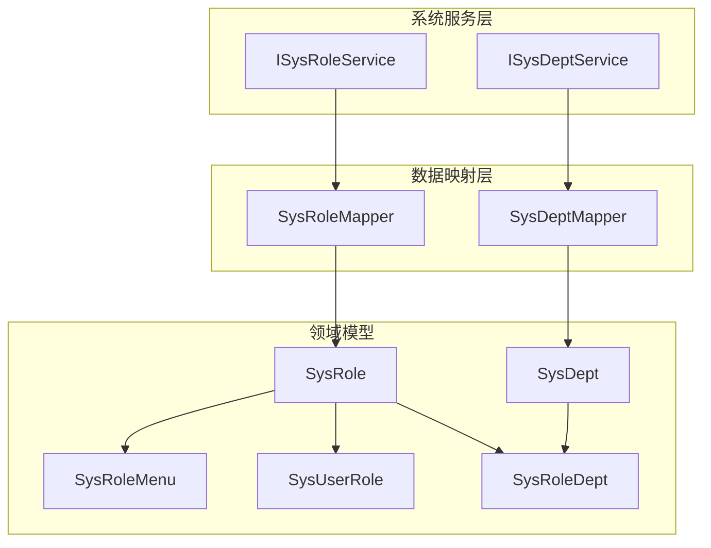
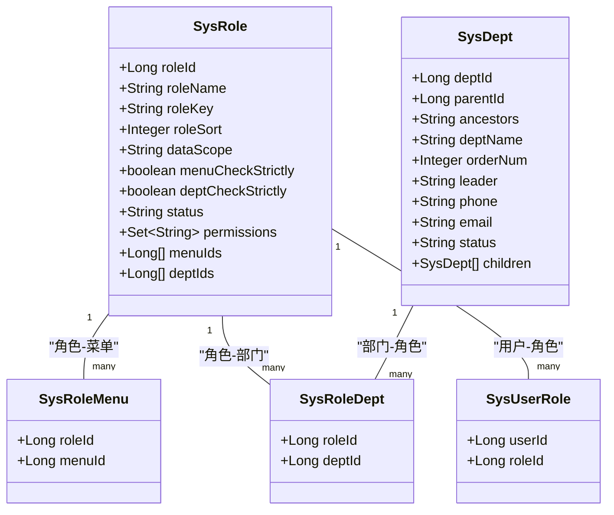
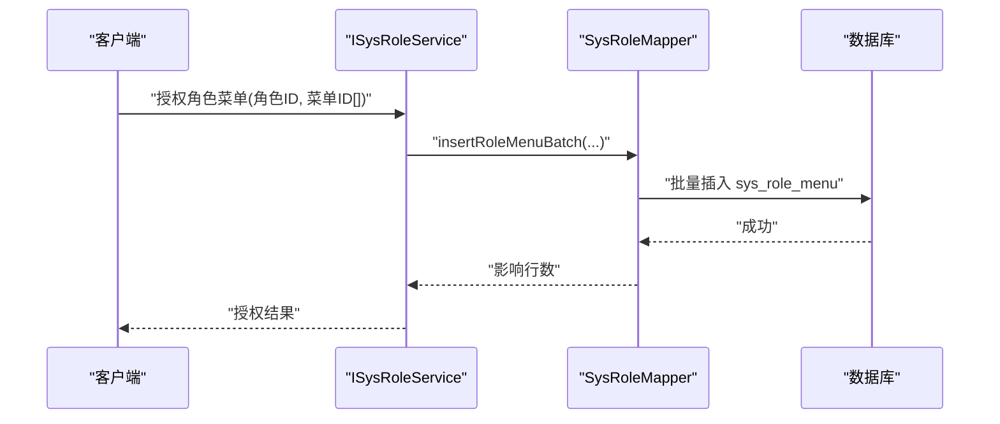
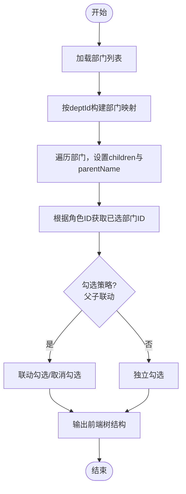
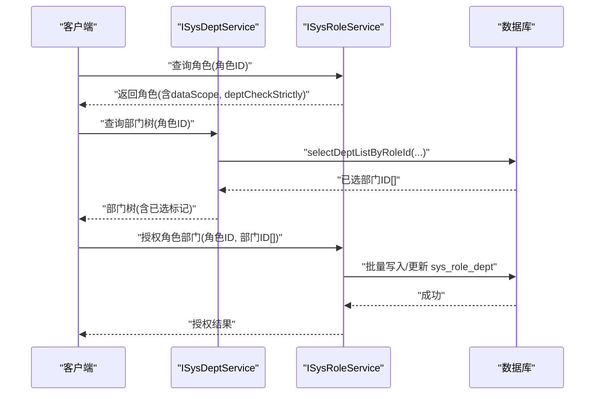
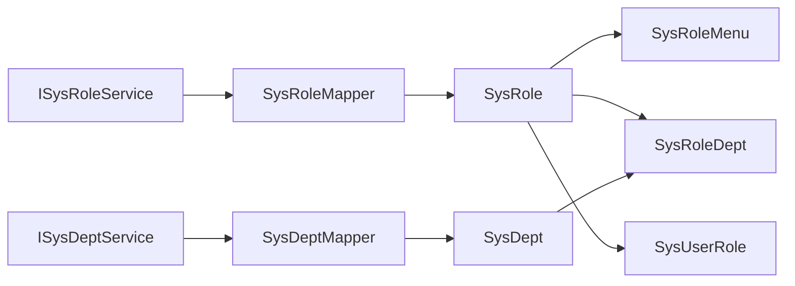

# 角色与部门管理

<cite>
**本文引用的文件**
- [ISysRoleService.java](file://XingChen-Vue/xingchen-system/src/main/java/com/xingchen/system/service/ISysRoleService.java)
- [ISysDeptService.java](file://XingChen-Vue/xingchen-system/src/main/java/com/xingchen/system/service/ISysDeptService.java)
- [SysRole.java](file://XingChen-Vue/xingchen-common/src/main/java/com/xingchen/common/core/domain/entity/SysRole.java)
- [SysDept.java](file://XingChen-Vue/xingchen-common/src/main/java/com/xingchen/common/core/domain/entity/SysDept.java)
- [SysRoleMapper.java](file://XingChen-Vue/xingchen-system/src/main/java/com/xingchen/system/mapper/SysRoleMapper.java)
- [SysDeptMapper.java](file://XingChen-Vue/xingchen-system/src/main/java/com/xingchen/system/mapper/SysDeptMapper.java)
- [SysRoleMenu.java](file://XingChen-Vue/xingchen-system/src/main/java/com/xingchen/system/domain/SysRoleMenu.java)
- [SysRoleDept.java](file://XingChen-Vue/xingchen-system/src/main/java/com/xingchen/system/domain/SysRoleDept.java)
- [SysUserRole.java](file://XingChen-Vue/xingchen-system/src/main/java/com/xingchen/system/domain/SysUserRole.java)
</cite>

## 目录
1. [引言](#引言)
2. [项目结构](#项目结构)
3. [核心组件](#核心组件)
4. [架构总览](#架构总览)
5. [详细组件分析](#详细组件分析)
6. [依赖分析](#依赖分析)
7. [性能考虑](#性能考虑)
8. [故障排查指南](#故障排查指南)
9. [结论](#结论)
10. [附录](#附录)

## 引言
本技术文档围绕“角色与部门管理”展开，系统性阐述角色管理的实现、部门组织架构管理、角色权限分配以及部门层级关系处理。文档从代码结构、架构设计、数据流与处理逻辑入手，结合接口契约与实体模型，给出角色服务层与部门服务层的业务边界、权限继承与数据范围控制机制，并提供角色配置示例、部门管理 API 的调用流程与最佳实践建议。

## 项目结构
本项目采用典型的分层架构：控制器层负责对外暴露 API；服务层封装业务规则；数据访问层负责数据库交互；领域模型承载数据与行为。角色与部门管理涉及如下关键模块：
- 角色与菜单、部门的多对多关联表：sys_role_menu、sys_role_dept
- 用户与角色的多对多关联表：sys_user_role
- 角色实体与部门实体：SysRole、SysDept
- 角色与部门的服务接口：ISysRoleService、ISysDeptService
- 角色与部门的数据映射接口：SysRoleMapper、SysDeptMapper

图表来源
- [ISysRoleService.java:1-174](file://XingChen-Vue/xingchen-system/src/main/java/com/xingchen/system/service/ISysRoleService.java#L1-L174)
- [ISysDeptService.java:1-133](file://XingChen-Vue/xingchen-system/src/main/java/com/xingchen/system/service/ISysDeptService.java#L1-L133)
- [SysRoleMapper.java:1-108](file://XingChen-Vue/xingchen-system/src/main/java/com/xingchen/system/mapper/SysRoleMapper.java#L1-L108)
- [SysDeptMapper.java:1-126](file://XingChen-Vue/xingchen-system/src/main/java/com/xingchen/system/mapper/SysDeptMapper.java#L1-L126)
- [SysRole.java:1-242](file://XingChen-Vue/xingchen-common/src/main/java/com/xingchen/common/core/domain/entity/SysRole.java#L1-L242)
- [SysDept.java:1-204](file://XingChen-Vue/xingchen-common/src/main/java/com/xingchen/common/core/domain/entity/SysDept.java#L1-L204)
- [SysRoleMenu.java:1-47](file://XingChen-Vue/xingchen-system/src/main/java/com/xingchen/system/domain/SysRoleMenu.java#L1-L47)
- [SysRoleDept.java:1-47](file://XingChen-Vue/xingchen-system/src/main/java/com/xingchen/system/domain/SysRoleDept.java#L1-L47)
- [SysUserRole.java:1-47](file://XingChen-Vue/xingchen-system/src/main/java/com/xingchen/system/domain/SysUserRole.java#L1-L47)

章节来源
- [ISysRoleService.java:1-174](file://XingChen-Vue/xingchen-system/src/main/java/com/xingchen/system/service/ISysRoleService.java#L1-L174)
- [ISysDeptService.java:1-133](file://XingChen-Vue/xingchen-system/src/main/java/com/xingchen/system/service/ISysDeptService.java#L1-L133)
- [SysRoleMapper.java:1-108](file://XingChen-Vue/xingchen-system/src/main/java/com/xingchen/system/mapper/SysRoleMapper.java#L1-L108)
- [SysDeptMapper.java:1-126](file://XingChen-Vue/xingchen-system/src/main/java/com/xingchen/system/mapper/SysDeptMapper.java#L1-L126)

## 核心组件
- 角色实体 SysRole：承载角色基本信息、数据范围、菜单/部门勾选策略、状态等字段，并提供管理员校验、菜单/部门 ID 数组与权限集合等属性。
- 部门实体 SysDept：承载部门树形结构字段（父 ID、祖先链、子部门集合）、显示顺序、负责人、联系方式、状态等。
- 角色服务接口 ISysRoleService：定义角色的查询、新增、修改、状态变更、数据范围授权、角色与用户的授权/取消授权、角色与菜单/部门的授权等方法。
- 部门服务接口 ISysDeptService：定义部门列表查询、部门树构建、部门树下拉构建、根据角色查询已选部门、部门校验、新增/修改/删除、排序更新等方法。
- 角色映射接口 SysRoleMapper：提供基于用户、角色、权限的查询与 CRUD 操作。
- 部门映射接口 SysDeptMapper：提供部门列表、树查询、子部门查询、是否存在用户、名称唯一性校验、新增/修改/删除、排序更新等方法。
- 关联实体：SysRoleMenu（角色-菜单）、SysRoleDept（角色-部门）、SysUserRole（用户-角色）。

章节来源
- [SysRole.java:1-242](file://XingChen-Vue/xingchen-common/src/main/java/com/xingchen/common/core/domain/entity/SysRole.java#L1-L242)
- [SysDept.java:1-204](file://XingChen-Vue/xingchen-common/src/main/java/com/xingchen/common/core/domain/entity/SysDept.java#L1-L204)
- [ISysRoleService.java:1-174](file://XingChen-Vue/xingchen-system/src/main/java/com/xingchen/system/service/ISysRoleService.java#L1-L174)
- [ISysDeptService.java:1-133](file://XingChen-Vue/xingchen-system/src/main/java/com/xingchen/system/service/ISysDeptService.java#L1-L133)
- [SysRoleMapper.java:1-108](file://XingChen-Vue/xingchen-system/src/main/java/com/xingchen/system/mapper/SysRoleMapper.java#L1-L108)
- [SysDeptMapper.java:1-126](file://XingChen-Vue/xingchen-system/src/main/java/com/xingchen/system/mapper/SysDeptMapper.java#L1-L126)
- [SysRoleMenu.java:1-47](file://XingChen-Vue/xingchen-system/src/main/java/com/xingchen/system/domain/SysRoleMenu.java#L1-L47)
- [SysRoleDept.java:1-47](file://XingChen-Vue/xingchen-system/src/main/java/com/xingchen/system/domain/SysRoleDept.java#L1-L47)
- [SysUserRole.java:1-47](file://XingChen-Vue/xingchen-system/src/main/java/com/xingchen/system/domain/SysUserRole.java#L1-L47)

## 架构总览
角色与部门管理遵循“接口隔离 + 分层解耦”的设计原则：
- 控制器层：接收请求参数，调用服务层完成业务处理。
- 服务层：封装角色与部门的业务规则，包括数据范围校验、菜单/部门树构建、权限继承策略等。
- 数据层：通过 Mapper 将领域模型持久化到数据库，维护角色-菜单、角色-部门、用户-角色三类关联关系。

图表来源
- [SysRole.java:1-242](file://XingChen-Vue/xingchen-common/src/main/java/com/xingchen/common/core/domain/entity/SysRole.java#L1-L242)
- [SysDept.java:1-204](file://XingChen-Vue/xingchen-common/src/main/java/com/xingchen/common/core/domain/entity/SysDept.java#L1-L204)
- [SysRoleMenu.java:1-47](file://XingChen-Vue/xingchen-system/src/main/java/com/xingchen/system/domain/SysRoleMenu.java#L1-L47)
- [SysRoleDept.java:1-47](file://XingChen-Vue/xingchen-system/src/main/java/com/xingchen/system/domain/SysRoleDept.java#L1-L47)
- [SysUserRole.java:1-47](file://XingChen-Vue/xingchen-system/src/main/java/com/xingchen/system/domain/SysUserRole.java#L1-L47)

## 详细组件分析

### 角色服务层（ISysRoleService）
职责边界
- 角色查询：支持按条件分页查询、按用户查询角色列表、按用户查询角色权限集合、查询全部角色、按用户获取角色选择框列表、按角色 ID 查询角色。
- 角色校验：校验角色名称唯一、角色权限唯一、角色是否允许操作、角色数据范围校验。
- 角色生命周期：新增保存、修改保存、修改状态、修改数据范围、删除角色（单个/批量）。
- 角色与用户授权：取消授权用户角色、批量取消授权、批量选择授权用户角色。
- 角色与菜单/部门授权：通过数据范围与勾选策略控制菜单/部门的授权范围。

业务要点
- 数据范围控制：通过 dataScope 字段与 deptCheckStrictly/menuCheckStrictly 决定授权范围与勾选联动策略。
- 权限集合：permissions 字段用于缓存角色的菜单权限字符串集合，便于快速判断。
- 管理员角色校验：isAdmin/isAdmin(roleId) 提供管理员角色识别能力。

章节来源
- [ISysRoleService.java:1-174](file://XingChen-Vue/xingchen-system/src/main/java/com/xingchen/system/service/ISysRoleService.java#L1-L174)
- [SysRole.java:1-242](file://XingChen-Vue/xingchen-common/src/main/java/com/xingchen/common/core/domain/entity/SysRole.java#L1-L242)

### 部门服务层（ISysDeptService）
职责边界
- 部门查询：支持按条件查询部门列表、构建前端所需部门树、构建下拉树。
- 部门树构建：根据角色 ID 查询已选部门 ID 列表，支持部门树勾选联动策略。
- 部门校验：名称唯一性校验、是否存在子节点、是否存在用户、数据范围校验。
- 部门生命周期：新增保存、修改保存、保存排序、删除部门。
- 部门树算法：通过祖先链 ancestors 与父子关系 parentId 实现树形结构的构建与查询。

业务要点
- 树形结构：children 字段承载子部门集合，配合 buildDeptTree/buildDeptTreeSelect 输出前端树结构。
- 排序与状态：支持批量更新排序与状态，保证树形展示一致性。
- 数据范围：与角色数据范围协同，决定角色可操作的部门范围。

章节来源
- [ISysDeptService.java:1-133](file://XingChen-Vue/xingchen-system/src/main/java/com/xingchen/system/service/ISysDeptService.java#L1-L133)
- [SysDept.java:1-204](file://XingChen-Vue/xingchen-common/src/main/java/com/xingchen/common/core/domain/entity/SysDept.java#L1-L204)
- [SysDeptMapper.java:1-126](file://XingChen-Vue/xingchen-system/src/main/java/com/xingchen/system/mapper/SysDeptMapper.java#L1-L126)

### 角色菜单权限绑定流程
角色与菜单通过中间表 sys_role_menu 绑定，服务层提供授权/取消授权接口，实体层通过 menuIds 与 permissions 字段承载菜单 ID 与权限字符串集合。

图表来源
- [ISysRoleService.java:1-174](file://XingChen-Vue/xingchen-system/src/main/java/com/xingchen/system/service/ISysRoleService.java#L1-L174)
- [SysRoleMapper.java:1-108](file://XingChen-Vue/xingchen-system/src/main/java/com/xingchen/system/mapper/SysRoleMapper.java#L1-L108)

章节来源
- [SysRoleMenu.java:1-47](file://XingChen-Vue/xingchen-system/src/main/java/com/xingchen/system/domain/SysRoleMenu.java#L1-L47)
- [SysRole.java:1-242](file://XingChen-Vue/xingchen-common/src/main/java/com/xingchen/common/core/domain/entity/SysRole.java#L1-L242)

### 部门树形结构处理
部门树通过 parentId 与 ancestors 字段维护层级关系，服务层提供构建树与下拉树的方法，支持根据角色 ID 获取已选部门 ID 列表。

图表来源
- [ISysDeptService.java:1-133](file://XingChen-Vue/xingchen-system/src/main/java/com/xingchen/system/service/ISysDeptService.java#L1-L133)
- [SysDept.java:1-204](file://XingChen-Vue/xingchen-common/src/main/java/com/xingchen/common/core/domain/entity/SysDept.java#L1-L204)

章节来源
- [SysDeptMapper.java:1-126](file://XingChen-Vue/xingchen-system/src/main/java/com/xingchen/system/mapper/SysDeptMapper.java#L1-L126)

### 角色与部门授权流程
角色可被授予多个部门，形成数据范围控制。服务层提供根据角色 ID 查询已选部门 ID 列表的能力，结合部门树勾选策略实现“本部门/本部门及以下/自定义”等范围控制。

图表来源
- [ISysRoleService.java:1-174](file://XingChen-Vue/xingchen-system/src/main/java/com/xingchen/system/service/ISysRoleService.java#L1-L174)
- [ISysDeptService.java:1-133](file://XingChen-Vue/xingchen-system/src/main/java/com/xingchen/system/service/ISysDeptService.java#L1-L133)
- [SysRoleDept.java:1-47](file://XingChen-Vue/xingchen-system/src/main/java/com/xingchen/system/domain/SysRoleDept.java#L1-L47)

章节来源
- [SysRoleDept.java:1-47](file://XingChen-Vue/xingchen-system/src/main/java/com/xingchen/system/domain/SysRoleDept.java#L1-L47)

### 角色配置示例（最佳实践）
- 角色类型与数据范围
  - 全部数据权限：适用于超级管理员或审计角色，允许跨部门查看与操作。
  - 自定义数据权限：适用于区域管理员，需手动勾选部门范围。
  - 本部门数据权限：适用于部门负责人，仅能操作当前部门。
  - 本部门及以下数据权限：适用于上级领导，可向下扩展。
  - 仅本人数据权限：适用于普通员工，仅能操作自身数据。
- 勾选策略
  - 菜单勾选策略：menuCheckStrictly 控制菜单树父子联动。
  - 部门勾选策略：deptCheckStrictly 控制部门树父子联动。
- 权限字符串
  - permissions 字段用于缓存菜单权限字符串集合，便于快速鉴权。

章节来源
- [SysRole.java:1-242](file://XingChen-Vue/xingchen-common/src/main/java/com/xingchen/common/core/domain/entity/SysRole.java#L1-L242)

### 部门管理 API（调用流程）
- 查询部门树
  - 输入：部门查询条件（如状态、名称模糊匹配）
  - 流程：服务层调用 Mapper 加载部门列表，构建树结构，返回前端树节点
  - 输出：部门树节点（含已选标记、排序、状态）
- 新增/修改/删除部门
  - 新增：校验名称唯一性 -> 插入 -> 更新祖先链 -> 返回结果
  - 修改：校验名称唯一性 -> 更新 -> 若父节点变化则更新祖先链 -> 返回结果
  - 删除：检查是否存在子节点/用户 -> 删除 -> 返回结果
- 排序更新
  - 支持批量更新部门排序，确保树形展示顺序一致

章节来源
- [ISysDeptService.java:1-133](file://XingChen-Vue/xingchen-system/src/main/java/com/xingchen/system/service/ISysDeptService.java#L1-L133)
- [SysDeptMapper.java:1-126](file://XingChen-Vue/xingchen-system/src/main/java/com/xingchen/system/mapper/SysDeptMapper.java#L1-L126)

## 依赖分析
- 低耦合高内聚
  - 服务接口与实现分离，便于替换与测试。
  - 实体与映射接口解耦，避免直接依赖数据库细节。
- 关联关系清晰
  - 角色与菜单/部门/用户通过中间表关联，权限与范围控制集中在角色实体与服务层。
- 循环依赖规避
  - 未发现循环依赖迹象；若后续扩展，应避免在实体间引入双向导航引用。

图表来源
- [ISysRoleService.java:1-174](file://XingChen-Vue/xingchen-system/src/main/java/com/xingchen/system/service/ISysRoleService.java#L1-L174)
- [ISysDeptService.java:1-133](file://XingChen-Vue/xingchen-system/src/main/java/com/xingchen/system/service/ISysDeptService.java#L1-L133)
- [SysRoleMapper.java:1-108](file://XingChen-Vue/xingchen-system/src/main/java/com/xingchen/system/mapper/SysRoleMapper.java#L1-L108)
- [SysDeptMapper.java:1-126](file://XingChen-Vue/xingchen-system/src/main/java/com/xingchen/system/mapper/SysDeptMapper.java#L1-L126)

## 性能考虑
- 树构建优化
  - 使用一次加载 + 内存映射的方式构建树，避免 N+1 查询。
  - 对于超大组织规模，建议分页或懒加载子节点。
- 关联写入批量化
  - 授权/取消授权时采用批量插入/删除，减少事务开销。
- 缓存策略
  - 对热点角色权限集合可进行短期缓存，降低重复计算与数据库压力。
- 索引建议
  - 在 sys_dept(parent_id)、sys_role_menu(role_id)、sys_role_dept(role_id) 等常用过滤字段建立索引。

## 故障排查指南
- 角色授权失败
  - 检查角色数据范围与部门树勾选策略是否匹配。
  - 确认目标部门状态正常且未被删除。
- 部门树异常
  - 检查 ancestors 与 parentId 是否一致，必要时重建祖先链。
  - 确认是否存在循环父子关系。
- 名称唯一性冲突
  - 在新增/修改时调用唯一性校验接口，避免违反约束。
- 授权后权限不生效
  - 确认 permissions 字段是否正确刷新，或在会话层重新加载权限。

章节来源
- [ISysRoleService.java:1-174](file://XingChen-Vue/xingchen-system/src/main/java/com/xingchen/system/service/ISysRoleService.java#L1-L174)
- [ISysDeptService.java:1-133](file://XingChen-Vue/xingchen-system/src/main/java/com/xingchen/system/service/ISysDeptService.java#L1-L133)
- [SysDeptMapper.java:1-126](file://XingChen-Vue/xingchen-system/src/main/java/com/xingchen/system/mapper/SysDeptMapper.java#L1-L126)

## 结论
本系统通过清晰的分层设计与明确的接口契约，实现了角色与部门管理的完整闭环：角色实体承载权限与数据范围，服务层封装业务规则，映射层负责持久化与树形结构构建。结合菜单/部门的授权策略与勾选联动，能够灵活支撑多种组织架构与权限继承场景。建议在生产环境中进一步完善缓存与索引策略，并持续优化树构建与批量授权的性能表现。

## 附录
- 角色与部门授权的关键实体关系
  - 角色与菜单：sys_role_menu
  - 角色与部门：sys_role_dept
  - 用户与角色：sys_user_role

章节来源
- [SysRoleMenu.java:1-47](file://XingChen-Vue/xingchen-system/src/main/java/com/xingchen/system/domain/SysRoleMenu.java#L1-L47)
- [SysRoleDept.java:1-47](file://XingChen-Vue/xingchen-system/src/main/java/com/xingchen/system/domain/SysRoleDept.java#L1-L47)
- [SysUserRole.java:1-47](file://XingChen-Vue/xingchen-system/src/main/java/com/xingchen/system/domain/SysUserRole.java#L1-L47)