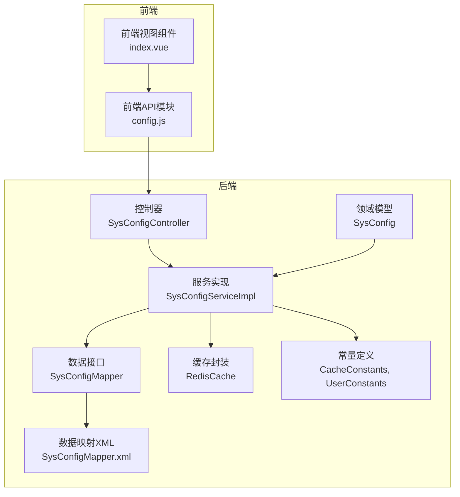
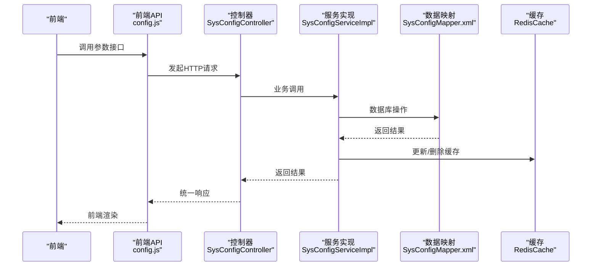
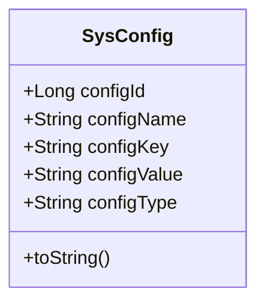
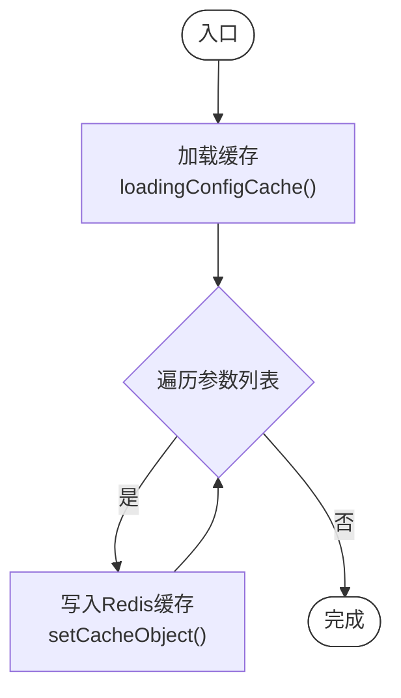
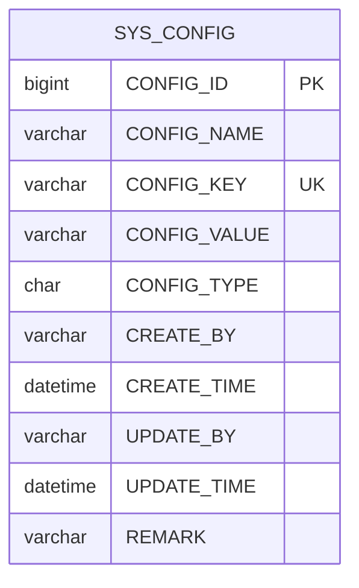
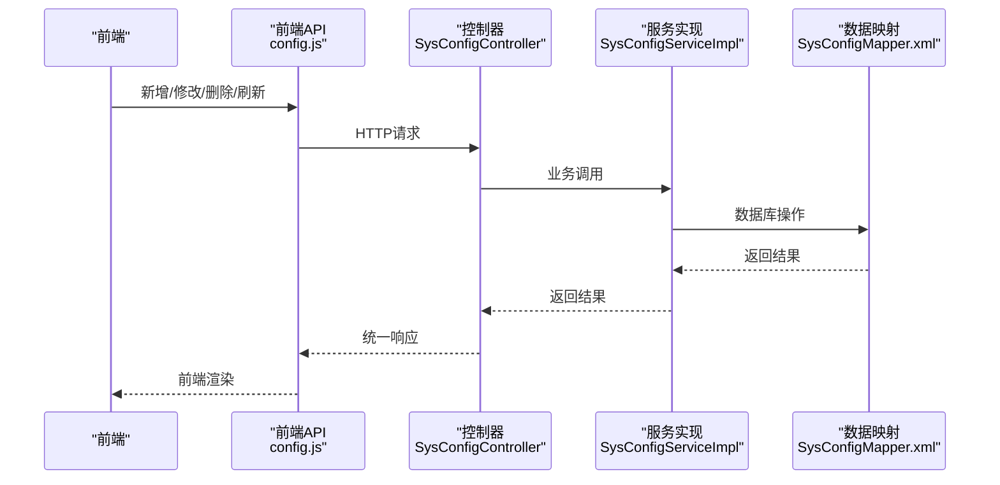
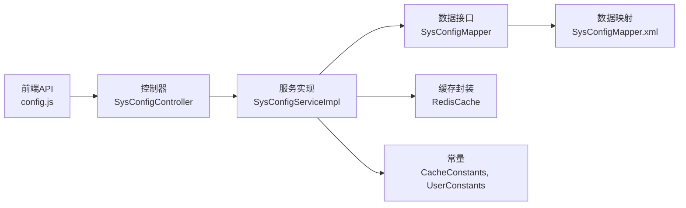

# 参数配置

<cite>
**本文引用的文件**   
- [SysConfig.java](file://XingChen-Vue/xingchen-system/src/main/java/com/xingchen/system/domain/SysConfig.java)
- [ISysConfigService.java](file://XingChen-Vue/xingchen-system/src/main/java/com/xingchen/system/service/ISysConfigService.java)
- [SysConfigServiceImpl.java](file://XingChen-Vue/xingchen-system/src/main/java/com/xingchen/system/service/impl/SysConfigServiceImpl.java)
- [SysConfigMapper.java](file://XingChen-Vue/xingchen-system/src/main/java/com/xingchen/system/mapper/SysConfigMapper.java)
- [SysConfigMapper.xml](file://XingChen-Vue/xingchen-system/src/main/resources/mapper/system/SysConfigMapper.xml)
- [SysConfigController.java](file://XingChen-Vue/xingchen-admin/src/main/java/com/xingchen/web/controller/system/SysConfigController.java)
- [config.js](file://XingChen-Vue3/src/api/system/config.js)
- [CacheController.java](file://XingChen-Vue/xingchen-admin/src/main/java/com/xingchen/web/controller/monitor/CacheController.java)
- [RedisCache.java](file://XingChen-Vue/xingchen-common/src/main/java/com/xingchen/common/core/redis/RedisCache.java)
- [CacheConstants.java](file://XingChen-Vue/xingchen-common/src/main/java/com/xingchen/common/constant/CacheConstants.java)
- [UserConstants.java](file://XingChen-Vue/xingchen-common/src/main/java/com/xingchen/common/constant/UserConstants.java)
- [BaseController.java](file://XingChen-Vue/xingchen-common/src/main/java/com/xingchen/common/core/controller/BaseController.java)
- [AjaxResult.java](file://XingChen-Vue/xingchen-common/src/main/java/com/xingchen/common/core/domain/AjaxResult.java)
- [SysConfig.java](file://XingChen-Vue3/src/views/system/config/index.vue)
</cite>

## 目录
1. [简介](#简介)
2. [项目结构](#项目结构)
3. [核心组件](#核心组件)
4. [架构总览](#架构总览)
5. [详细组件分析](#详细组件分析)
6. [依赖分析](#依赖分析)
7. [性能考虑](#性能考虑)
8. [故障排查指南](#故障排查指南)
9. [结论](#结论)
10. [附录](#附录)

## 简介
本技术文档围绕“系统参数配置”能力进行系统化梳理，覆盖参数分类管理、参数值存储机制、动态更新策略、参数缓存设计与热更新、配置生效机制、参数校验与默认值处理、生命周期管理、API 接口设计、前端表单与批量操作、安全控制、版本与回滚机制以及对系统运行时的影响与最佳实践。目标是帮助开发者与运维人员快速理解与高效使用该能力。

## 项目结构
参数配置模块在后端采用分层架构：控制器层负责对外暴露 REST API；服务层负责业务逻辑与缓存交互；数据访问层负责数据库持久化；领域模型承载参数实体；前端通过统一的 API 模块调用后端接口并展示配置管理页面。

图表来源
- [SysConfigController.java:1-134](file://XingChen-Vue/xingchen-admin/src/main/java/com/xingchen/web/controller/system/SysConfigController.java#L1-L134)
- [SysConfigServiceImpl.java:1-229](file://XingChen-Vue/xingchen-system/src/main/java/com/xingchen/system/service/impl/SysConfigServiceImpl.java#L1-L229)
- [SysConfigMapper.java:1-77](file://XingChen-Vue/xingchen-system/src/main/java/com/xingchen/system/mapper/SysConfigMapper.java#L1-L77)
- [SysConfigMapper.xml:89-117](file://XingChen-Vue/xingchen-system/src/main/resources/mapper/system/SysConfigMapper.xml#L89-L117)
- [SysConfig.java:1-112](file://XingChen-Vue/xingchen-system/src/main/java/com/xingchen/system/domain/SysConfig.java#L1-L112)
- [config.js:1-60](file://XingChen-Vue3/src/api/system/config.js#L1-L60)

章节来源
- [SysConfigController.java:1-134](file://XingChen-Vue/xingchen-admin/src/main/java/com/xingchen/web/controller/system/SysConfigController.java#L1-L134)
- [SysConfigServiceImpl.java:1-229](file://XingChen-Vue/xingchen-system/src/main/java/com/xingchen/system/service/impl/SysConfigServiceImpl.java#L1-L229)
- [SysConfigMapper.java:1-77](file://XingChen-Vue/xingchen-system/src/main/java/com/xingchen/system/mapper/SysConfigMapper.java#L1-L77)
- [SysConfigMapper.xml:89-117](file://XingChen-Vue/xingchen-system/src/main/resources/mapper/system/SysConfigMapper.xml#L89-L117)
- [SysConfig.java:1-112](file://XingChen-Vue/xingchen-system/src/main/java/com/xingchen/system/domain/SysConfig.java#L1-L112)
- [config.js:1-60](file://XingChen-Vue3/src/api/system/config.js#L1-L60)

## 核心组件
- 参数实体模型：SysConfig，包含参数主键、名称、键名、键值、系统内置标识等字段，并带有基础审计字段。
- 数据访问接口与映射：SysConfigMapper 提供查询、新增、更新、删除方法；SysConfigMapper.xml 定义 SQL 实现。
- 服务接口与实现：ISysConfigService 定义参数查询、新增、更新、删除、缓存加载/清空/重置、键名唯一性校验；SysConfigServiceImpl 实现业务逻辑与 Redis 缓存交互。
- 控制器：SysConfigController 对外暴露参数列表、详情、按键名查询、新增、修改、删除、刷新缓存等接口。
- 前端 API 与视图：config.js 统一封装请求；index.vue 展示参数配置页面。
- 缓存与常量：RedisCache 封装 Redis 操作；CacheConstants 定义缓存前缀；UserConstants 定义系统内置标识常量。

章节来源
- [SysConfig.java:1-112](file://XingChen-Vue/xingchen-system/src/main/java/com/xingchen/system/domain/SysConfig.java#L1-L112)
- [SysConfigMapper.java:1-77](file://XingChen-Vue/xingchen-system/src/main/java/com/xingchen/system/mapper/SysConfigMapper.java#L1-L77)
- [SysConfigMapper.xml:89-117](file://XingChen-Vue/xingchen-system/src/main/resources/mapper/system/SysConfigMapper.xml#L89-L117)
- [ISysConfigService.java:1-90](file://XingChen-Vue/xingchen-system/src/main/java/com/xingchen/system/service/ISysConfigService.java#L1-L90)
- [SysConfigServiceImpl.java:1-229](file://XingChen-Vue/xingchen-system/src/main/java/com/xingchen/system/service/impl/SysConfigServiceImpl.java#L1-L229)
- [SysConfigController.java:1-134](file://XingChen-Vue/xingchen-admin/src/main/java/com/xingchen/web/controller/system/SysConfigController.java#L1-L134)
- [config.js:1-60](file://XingChen-Vue3/src/api/system/config.js#L1-L60)
- [RedisCache.java](file://XingChen-Vue/xingchen-common/src/main/java/com/xingchen/common/core/redis/RedisCache.java)
- [CacheConstants.java](file://XingChen-Vue/xingchen-common/src/main/java/com/xingchen/common/constant/CacheConstants.java)
- [UserConstants.java](file://XingChen-Vue/xingchen-common/src/main/java/com/xingchen/common/constant/UserConstants.java)

## 架构总览
参数配置采用“数据库 + Redis 缓存”的双写架构：应用启动时从数据库加载所有参数到 Redis；后续读取直接命中缓存；写入/更新/删除均先更新数据库，再同步更新或删除 Redis 缓存；支持手动刷新缓存以强制同步。

图表来源
- [SysConfigController.java:1-134](file://XingChen-Vue/xingchen-admin/src/main/java/com/xingchen/web/controller/system/SysConfigController.java#L1-L134)
- [SysConfigServiceImpl.java:1-229](file://XingChen-Vue/xingchen-system/src/main/java/com/xingchen/system/service/impl/SysConfigServiceImpl.java#L1-L229)
- [SysConfigMapper.xml:89-117](file://XingChen-Vue/xingchen-system/src/main/resources/mapper/system/SysConfigMapper.xml#L89-L117)
- [config.js:1-60](file://XingChen-Vue3/src/api/system/config.js#L1-L60)

## 详细组件分析

### 参数实体与校验规则
- 字段与约束：参数名称、键名、键值均有限定长度与非空校验；系统内置标识用于区分可编辑/不可删除参数。
- 默认值处理：实体未设置默认值，由服务层在读取时根据业务场景决定是否返回默认值（如验证码开关）。
- 生命周期：新增/修改时自动填充创建人/更新人与时间；删除时对内置参数进行保护。

图表来源
- [SysConfig.java:1-112](file://XingChen-Vue/xingchen-system/src/main/java/com/xingchen/system/domain/SysConfig.java#L1-L112)

章节来源
- [SysConfig.java:1-112](file://XingChen-Vue/xingchen-system/src/main/java/com/xingchen/system/domain/SysConfig.java#L1-L112)

### 服务层与缓存策略
- 初始化加载：应用启动时执行加载缓存，将数据库中所有参数写入 Redis。
- 动态更新：新增/修改参数后，先更新数据库，再更新 Redis 缓存；删除参数后同步删除 Redis 缓存。
- 缓存键命名：使用统一前缀拼接参数键名，避免冲突。
- 内置参数保护：删除时若为系统内置参数则抛出异常，防止误删。
- 刷新缓存：支持清空并重新加载缓存，保证缓存与数据库一致。

图表来源
- [SysConfigServiceImpl.java:171-179](file://XingChen-Vue/xingchen-system/src/main/java/com/xingchen/system/service/impl/SysConfigServiceImpl.java#L171-L179)

章节来源
- [SysConfigServiceImpl.java:1-229](file://XingChen-Vue/xingchen-system/src/main/java/com/xingchen/system/service/impl/SysConfigServiceImpl.java#L1-L229)
- [CacheConstants.java](file://XingChen-Vue/xingchen-common/src/main/java/com/xingchen/common/constant/CacheConstants.java)
- [UserConstants.java](file://XingChen-Vue/xingchen-common/src/main/java/com/xingchen/common/constant/UserConstants.java)

### 数据访问层与SQL实现
- 查询：支持按 ID、键名、列表查询；键名唯一性校验。
- 新增/更新：动态 set 条件拼接，仅更新非空字段；更新时间自动刷新。
- 删除：支持单条与批量删除；批量删除内部循环逐条校验与删除。

图表来源
- [SysConfigMapper.xml:89-117](file://XingChen-Vue/xingchen-system/src/main/resources/mapper/system/SysConfigMapper.xml#L89-L117)

章节来源
- [SysConfigMapper.java:1-77](file://XingChen-Vue/xingchen-system/src/main/java/com/xingchen/system/mapper/SysConfigMapper.java#L1-L77)
- [SysConfigMapper.xml:89-117](file://XingChen-Vue/xingchen-system/src/main/resources/mapper/system/SysConfigMapper.xml#L89-L117)

### 控制器与API接口设计
- 列表查询：分页查询参数列表，支持导出。
- 详情查询：按参数 ID 获取详情。
- 键名查询：按参数键名获取当前值。
- 新增/修改：参数键名唯一性校验，重复时报错。
- 删除：支持单条与批量删除，内置参数保护。
- 刷新缓存：清空并重新加载参数缓存。

图表来源
- [SysConfigController.java:1-134](file://XingChen-Vue/xingchen-admin/src/main/java/com/xingchen/web/controller/system/SysConfigController.java#L1-L134)
- [config.js:1-60](file://XingChen-Vue3/src/api/system/config.js#L1-L60)

章节来源
- [SysConfigController.java:1-134](file://XingChen-Vue/xingchen-admin/src/main/java/com/xingchen/web/controller/system/SysConfigController.java#L1-L134)
- [config.js:1-60](file://XingChen-Vue3/src/api/system/config.js#L1-L60)

### 前端表单与批量操作
- 前端 API：统一封装 GET/POST/PUT/DELETE/刷新缓存等方法。
- 视图组件：参数配置页面支持列表展示、新增/编辑弹窗、删除、刷新缓存等操作。
- 批量操作：删除支持多选批量删除，内部逐条校验内置参数保护。

章节来源
- [config.js:1-60](file://XingChen-Vue3/src/api/system/config.js#L1-L60)
- [SysConfig.java](file://XingChen-Vue3/src/views/system/config/index.vue)

### 安全控制与权限
- 接口权限：基于注解控制新增、编辑、删除、导出、刷新缓存等操作的权限。
- 内置参数保护：删除时判断系统内置标识，防止误删关键参数。
- 统一响应：通过 BaseController 与 AjaxResult 统一返回格式。

章节来源
- [SysConfigController.java:1-134](file://XingChen-Vue/xingchen-admin/src/main/java/com/xingchen/web/controller/system/SysConfigController.java#L1-L134)
- [UserConstants.java](file://XingChen-Vue/xingchen-common/src/main/java/com/xingchen/common/constant/UserConstants.java)
- [BaseController.java](file://XingChen-Vue/xingchen-common/src/main/java/com/xingchen/common/core/controller/BaseController.java)
- [AjaxResult.java](file://XingChen-Vue/xingchen-common/src/main/java/com/xingchen/common/core/domain/AjaxResult.java)

### 版本管理与回滚机制
- 当前实现未提供参数版本记录与自动回滚能力。建议扩展方案：
  - 引入参数变更日志表，记录每次变更的参数键、旧值、新值、操作人、时间。
  - 提供“版本对比”与“一键回滚”接口，回滚时写入新版本日志并更新参数值与缓存。
  - 回滚操作需结合权限控制与二次确认，确保安全。

（本节为概念性建议，不对应具体源码）

## 依赖分析
- 控制器依赖服务接口；服务实现依赖数据访问接口与 Redis 缓存封装。
- 缓存键前缀与常量定义集中于 CacheConstants；系统内置标识定义于 UserConstants。
- 前端 API 与控制器通过统一的 REST 协议交互。

图表来源
- [SysConfigController.java:1-134](file://XingChen-Vue/xingchen-admin/src/main/java/com/xingchen/web/controller/system/SysConfigController.java#L1-L134)
- [SysConfigServiceImpl.java:1-229](file://XingChen-Vue/xingchen-system/src/main/java/com/xingchen/system/service/impl/SysConfigServiceImpl.java#L1-L229)
- [SysConfigMapper.java:1-77](file://XingChen-Vue/xingchen-system/src/main/java/com/xingchen/system/mapper/SysConfigMapper.java#L1-L77)
- [SysConfigMapper.xml:89-117](file://XingChen-Vue/xingchen-system/src/main/resources/mapper/system/SysConfigMapper.xml#L89-L117)
- [config.js:1-60](file://XingChen-Vue3/src/api/system/config.js#L1-L60)

章节来源
- [SysConfigController.java:1-134](file://XingChen-Vue/xingchen-admin/src/main/java/com/xingchen/web/controller/system/SysConfigController.java#L1-L134)
- [SysConfigServiceImpl.java:1-229](file://XingChen-Vue/xingchen-system/src/main/java/com/xingchen/system/service/impl/SysConfigServiceImpl.java#L1-L229)
- [SysConfigMapper.java:1-77](file://XingChen-Vue/xingchen-system/src/main/java/com/xingchen/system/mapper/SysConfigMapper.java#L1-L77)
- [SysConfigMapper.xml:89-117](file://XingChen-Vue/xingchen-system/src/main/resources/mapper/system/SysConfigMapper.xml#L89-L117)
- [config.js:1-60](file://XingChen-Vue3/src/api/system/config.js#L1-L60)

## 性能考虑
- 读性能：参数读取直接命中 Redis，避免频繁数据库访问。
- 写性能：更新/删除均先写数据库，再更新/删除缓存，保证一致性；批量删除采用循环逐条处理，注意在大数量场景下的事务与锁竞争。
- 缓存命中率：初始化加载全部参数到缓存，减少冷启动后的抖动。
- 导出性能：导出为一次性全量导出，建议在低峰期执行或增加分页导出。

（本节为通用性能建议，不对应具体源码）

## 故障排查指南
- 参数键名重复：新增/修改时会校验键名唯一性，重复会返回错误提示。
- 内置参数删除失败：尝试删除系统内置参数会抛出异常，需调整参数类型或联系管理员。
- 缓存不同步：执行“刷新参数缓存”后，缓存将重新加载；若仍异常，检查 Redis 连接与键前缀。
- 接口权限不足：缺少相应权限会导致操作被拒绝，需在权限中心分配对应菜单权限。

章节来源
- [SysConfigController.java:1-134](file://XingChen-Vue/xingchen-admin/src/main/java/com/xingchen/web/controller/system/SysConfigController.java#L1-L134)
- [SysConfigServiceImpl.java:153-166](file://XingChen-Vue/xingchen-system/src/main/java/com/xingchen/system/service/impl/SysConfigServiceImpl.java#L153-L166)
- [CacheController.java:38-62](file://XingChen-Vue/xingchen-admin/src/main/java/com/xingchen/web/controller/monitor/CacheController.java#L38-L62)

## 结论
参数配置模块通过“数据库 + Redis 缓存”的架构实现了高性能、易维护的参数管理能力。其核心优势在于：
- 读写分离与缓存命中，显著降低数据库压力；
- 明确的权限控制与内置参数保护，提升安全性；
- 完整的 CRUD 与批量操作接口，满足日常运维需求；
- 可扩展的版本与回滚机制建议，为未来演进预留空间。

## 附录

### API 接口清单
- GET /system/config/list：分页查询参数列表
- GET /system/config/{configId}：获取参数详情
- GET /system/config/configKey/{configKey}：按键名查询参数值
- POST /system/config：新增参数配置
- PUT /system/config：修改参数配置
- DELETE /system/config/{configIds}：删除参数配置（支持批量）
- DELETE /system/config/refreshCache：刷新参数缓存

章节来源
- [SysConfigController.java:1-134](file://XingChen-Vue/xingchen-admin/src/main/java/com/xingchen/web/controller/system/SysConfigController.java#L1-L134)
- [config.js:1-60](file://XingChen-Vue3/src/api/system/config.js#L1-L60)