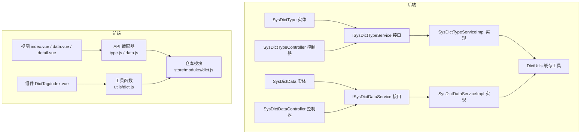
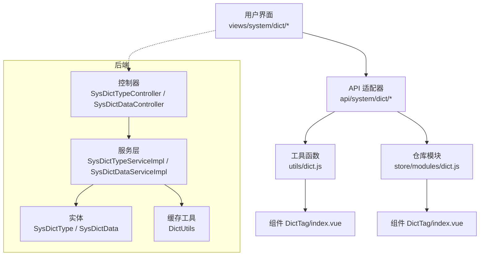
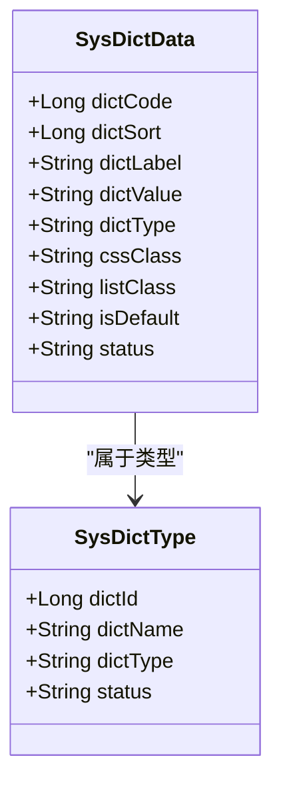
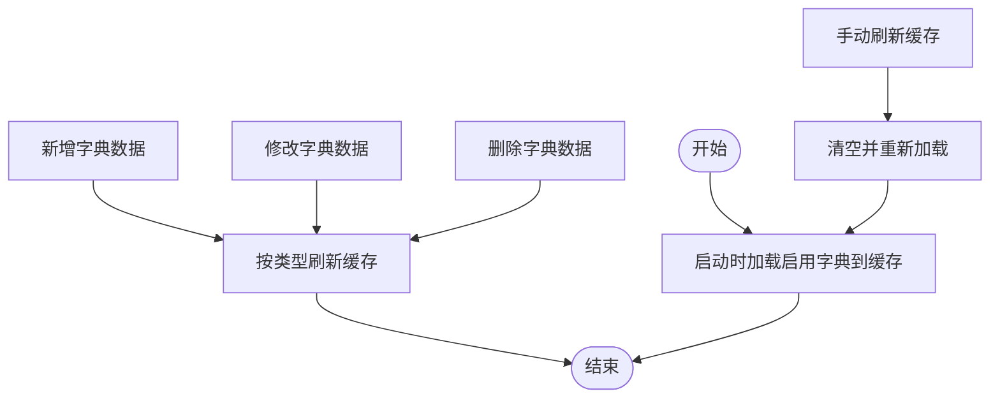
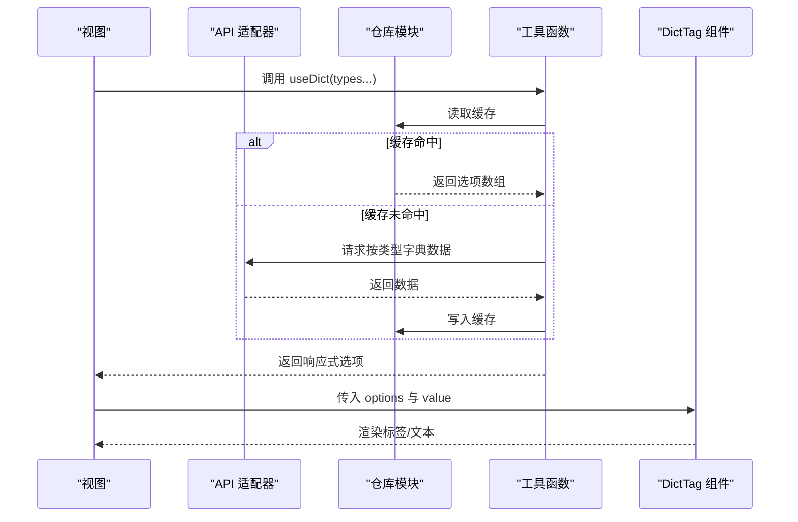
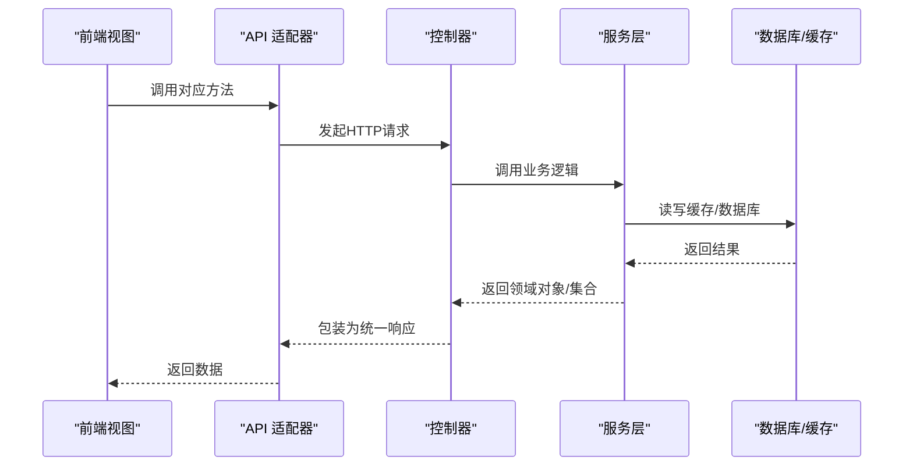
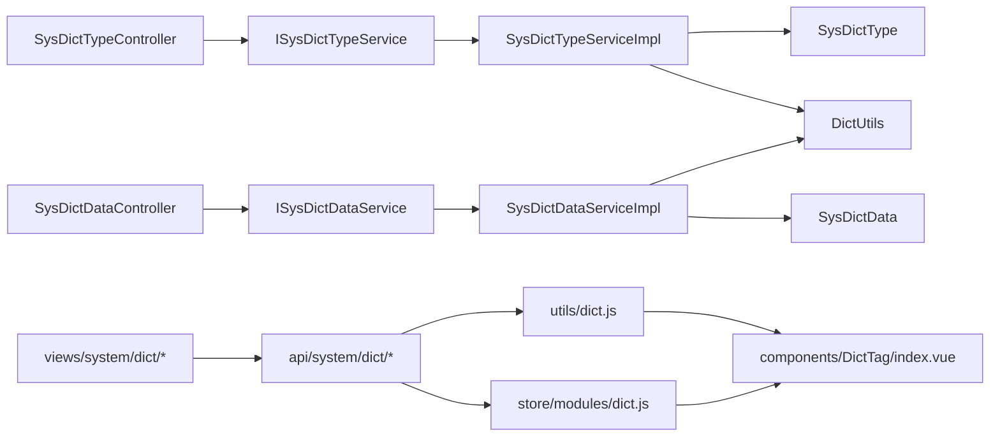

# 字典管理

<cite>
**本文引用的文件**
- [SysDictType.java](file://XingChen-Vue/xingchen-common/src/main/java/com/xingchen/common/core/domain/entity/SysDictType.java)
- [SysDictData.java](file://XingChen-Vue/xingchen-common/src/main/java/com/xingchen/common/core/domain/entity/SysDictData.java)
- [DictUtils.java](file://XingChen-Vue/xingchen-common/src/main/java/com/xingchen/common/utils/DictUtils.java)
- [ISysDictTypeService.java](file://XingChen-Vue/xingchen-system/src/main/java/com/xingchen/system/service/ISysDictTypeService.java)
- [ISysDictDataService.java](file://XingChen-Vue/xingchen-system/src/main/java/com/xingchen/system/service/ISysDictDataService.java)
- [SysDictTypeServiceImpl.java](file://XingChen-Vue/xingchen-system/src/main/java/com/xingchen/system/service/impl/SysDictTypeServiceImpl.java)
- [SysDictDataServiceImpl.java](file://XingChen-Vue/xingchen-system/src/main/java/com/xingchen/system/service/impl/SysDictDataServiceImpl.java)
- [SysDictTypeController.java](file://XingChen-Vue/xingchen-admin/src/main/java/com/xingchen/web/controller/system/SysDictTypeController.java)
- [SysDictDataController.java](file://XingChen-Vue/xingchen-admin/src/main/java/com/xingchen/web/controller/system/SysDictDataController.java)
- [data.js](file://XingChen-Vue3/src/api/system/dict/data.js)
- [type.js](file://XingChen-Vue3/src/api/system/dict/type.js)
- [dict.js](file://XingChen-Vue3/src/utils/dict.js)
- [dict.js（store）](file://XingChen-Vue3/src/store/modules/dict.js)
- [DictTag/index.vue](file://XingChen-Vue3/src/components/DictTag/index.vue)
- [index.vue（字典类型列表）](file://XingChen-Vue3/src/views/system/dict/index.vue)
- [data.vue（字典数据列表）](file://XingChen-Vue3/src/views/system/dict/data.vue)
- [detail.vue（字典类型详情）](file://XingChen-Vue3/src/views/system/dict/detail.vue)
</cite>

## 目录
1. [简介](#简介)
2. [项目结构](#项目结构)
3. [核心组件](#核心组件)
4. [架构总览](#架构总览)
5. [详细组件分析](#详细组件分析)
6. [依赖分析](#依赖分析)
7. [性能考虑](#性能考虑)
8. [故障排查指南](#故障排查指南)
9. [结论](#结论)
10. [附录](#附录)

## 简介
本技术文档围绕“字典管理”子系统展开，系统采用两级结构：字典类型（字典分类）与字典数据（键值对映射）。后端通过实体类、服务层、控制层与缓存工具协同，实现字典的增删改查、状态管理与缓存同步；前端通过API适配器、仓库与组件实现下拉选择器渲染与实时更新。文档同时覆盖国际化支持、校验规则、缓存失效策略与性能优化建议。

## 项目结构
字典管理涉及后端实体、服务与控制层，以及前端API、仓库与组件三部分。后端以“类型-数据”两级模型组织，前端以“视图-仓库-组件”三层协作。

**图表来源**
- [SysDictType.java:17-97](file://XingChen-Vue/xingchen-common/src/main/java/com/xingchen/common/core/domain/entity/SysDictType.java#L17-L97)
- [SysDictData.java:17-177](file://XingChen-Vue/xingchen-common/src/main/java/com/xingchen/common/core/domain/entity/SysDictData.java#L17-L177)
- [ISysDictTypeService.java:12-99](file://XingChen-Vue/xingchen-system/src/main/java/com/xingchen/system/service/ISysDictTypeService.java#L12-L99)
- [ISysDictDataService.java:11-61](file://XingChen-Vue/xingchen-system/src/main/java/com/xingchen/system/service/ISysDictDataService.java#L11-L61)
- [SysDictTypeServiceImpl.java:26-224](file://XingChen-Vue/xingchen-system/src/main/java/com/xingchen/system/service/impl/SysDictTypeServiceImpl.java#L26-L224)
- [SysDictDataServiceImpl.java:16-112](file://XingChen-Vue/xingchen-system/src/main/java/com/xingchen/system/service/impl/SysDictDataServiceImpl.java#L16-L112)
- [SysDictTypeController.java:30-132](file://XingChen-Vue/xingchen-admin/src/main/java/com/xingchen/web/controller/system/SysDictTypeController.java#L30-L132)
- [SysDictDataController.java:33-122](file://XingChen-Vue/xingchen-admin/src/main/java/com/xingchen/web/controller/system/SysDictDataController.java#L33-L122)
- [DictUtils.java:18-218](file://XingChen-Vue/xingchen-common/src/main/java/com/xingchen/common/utils/DictUtils.java#L18-L218)
- [type.js:1-61](file://XingChen-Vue3/src/api/system/dict/type.js#L1-L61)
- [data.js:1-53](file://XingChen-Vue3/src/api/system/dict/data.js#L1-L53)
- [dict.js（store）:1-58](file://XingChen-Vue3/src/store/modules/dict.js#L1-L58)
- [dict.js:1-24](file://XingChen-Vue3/src/utils/dict.js#L1-L24)
- [DictTag/index.vue:1-88](file://XingChen-Vue3/src/components/DictTag/index.vue#L1-L88)

**章节来源**
- [SysDictType.java:17-97](file://XingChen-Vue/xingchen-common/src/main/java/com/xingchen/common/core/domain/entity/SysDictType.java#L17-L97)
- [SysDictData.java:17-177](file://XingChen-Vue/xingchen-common/src/main/java/com/xingchen/common/core/domain/entity/SysDictData.java#L17-L177)
- [type.js:1-61](file://XingChen-Vue3/src/api/system/dict/type.js#L1-L61)
- [data.js:1-53](file://XingChen-Vue3/src/api/system/dict/data.js#L1-L53)
- [dict.js（store）:1-58](file://XingChen-Vue3/src/store/modules/dict.js#L1-L58)
- [dict.js:1-24](file://XingChen-Vue3/src/utils/dict.js#L1-L24)
- [DictTag/index.vue:1-88](file://XingChen-Vue3/src/components/DictTag/index.vue#L1-L88)

## 核心组件
- 实体层
  - 字典类型：包含类型标识、名称、状态等字段，用于定义字典分类。
  - 字典数据：包含标签、键值、类型、排序、样式、默认标记、状态等字段，用于承载具体的键值对映射。
- 工具与缓存
  - DictUtils：提供字典缓存的设置、获取、清理、批量清空与键生成，支撑前后端一致的缓存访问。
- 服务层
  - 类型服务：负责类型查询、加载/重置/清空缓存、唯一性校验、类型变更后的数据迁移与缓存刷新。
  - 数据服务：负责数据的增删改查、按类型查询、删除后按类型刷新缓存。
- 控制层
  - 类型控制器：提供类型列表、导出、详情、新增、修改、删除、刷新缓存、选项框列表等接口。
  - 数据控制器：提供数据列表、导出、详情、按类型查询、新增、修改、删除等接口。
- 前端
  - API适配器：封装REST请求，统一暴露类型与数据的CRUD方法。
  - 仓库模块：在内存中维护字典键值对，避免重复请求。
  - 工具函数：按类型异步拉取并转换为前端可用的选项数组，写入仓库。
  - 组件：DictTag根据传入的选项与当前值渲染标签或文本，支持多值与分隔符。

**章节来源**
- [SysDictType.java:17-97](file://XingChen-Vue/xingchen-common/src/main/java/com/xingchen/common/core/domain/entity/SysDictType.java#L17-L97)
- [SysDictData.java:17-177](file://XingChen-Vue/xingchen-common/src/main/java/com/xingchen/common/core/domain/entity/SysDictData.java#L17-L177)
- [DictUtils.java:18-218](file://XingChen-Vue/xingchen-common/src/main/java/com/xingchen/common/utils/DictUtils.java#L18-L218)
- [ISysDictTypeService.java:12-99](file://XingChen-Vue/xingchen-system/src/main/java/com/xingchen/system/service/ISysDictTypeService.java#L12-L99)
- [ISysDictDataService.java:11-61](file://XingChen-Vue/xingchen-system/src/main/java/com/xingchen/system/service/ISysDictDataService.java#L11-L61)
- [SysDictTypeServiceImpl.java:26-224](file://XingChen-Vue/xingchen-system/src/main/java/com/xingchen/system/service/impl/SysDictTypeServiceImpl.java#L26-L224)
- [SysDictDataServiceImpl.java:16-112](file://XingChen-Vue/xingchen-system/src/main/java/com/xingchen/system/service/impl/SysDictDataServiceImpl.java#L16-L112)
- [SysDictTypeController.java:30-132](file://XingChen-Vue/xingchen-admin/src/main/java/com/xingchen/web/controller/system/SysDictTypeController.java#L30-L132)
- [SysDictDataController.java:33-122](file://XingChen-Vue/xingchen-admin/src/main/java/com/xingchen/web/controller/system/SysDictDataController.java#L33-L122)
- [type.js:1-61](file://XingChen-Vue3/src/api/system/dict/type.js#L1-L61)
- [data.js:1-53](file://XingChen-Vue3/src/api/system/dict/data.js#L1-L53)
- [dict.js（store）:1-58](file://XingChen-Vue3/src/store/modules/dict.js#L1-L58)
- [dict.js:1-24](file://XingChen-Vue3/src/utils/dict.js#L1-L24)
- [DictTag/index.vue:1-88](file://XingChen-Vue3/src/components/DictTag/index.vue#L1-L88)

## 架构总览
系统采用“类型-数据”的两级结构设计，后端以服务层为核心协调数据库与缓存，前端以仓库与工具函数实现懒加载与本地缓存，组件负责渲染与交互。

**图表来源**
- [SysDictTypeController.java:30-132](file://XingChen-Vue/xingchen-admin/src/main/java/com/xingchen/web/controller/system/SysDictTypeController.java#L30-L132)
- [SysDictDataController.java:33-122](file://XingChen-Vue/xingchen-admin/src/main/java/com/xingchen/web/controller/system/SysDictDataController.java#L33-L122)
- [SysDictTypeServiceImpl.java:26-224](file://XingChen-Vue/xingchen-system/src/main/java/com/xingchen/system/service/impl/SysDictTypeServiceImpl.java#L26-L224)
- [SysDictDataServiceImpl.java:16-112](file://XingChen-Vue/xingchen-system/src/main/java/com/xingchen/system/service/impl/SysDictDataServiceImpl.java#L16-L112)
- [SysDictType.java:17-97](file://XingChen-Vue/xingchen-common/src/main/java/com/xingchen/common/core/domain/entity/SysDictType.java#L17-L97)
- [SysDictData.java:17-177](file://XingChen-Vue/xingchen-common/src/main/java/com/xingchen/common/core/domain/entity/SysDictData.java#L17-L177)
- [DictUtils.java:18-218](file://XingChen-Vue/xingchen-common/src/main/java/com/xingchen/common/utils/DictUtils.java#L18-L218)
- [type.js:1-61](file://XingChen-Vue3/src/api/system/dict/type.js#L1-L61)
- [data.js:1-53](file://XingChen-Vue3/src/api/system/dict/data.js#L1-L53)
- [dict.js（store）:1-58](file://XingChen-Vue3/src/store/modules/dict.js#L1-L58)
- [dict.js:1-24](file://XingChen-Vue3/src/utils/dict.js#L1-L24)
- [DictTag/index.vue:1-88](file://XingChen-Vue3/src/components/DictTag/index.vue#L1-L88)

## 详细组件分析

### 数据模型与两级结构
- 字典类型（分类）
  - 关键字段：名称、类型标识、状态。
  - 作用：作为字典数据的分类维度，决定数据的键值对集合归属。
- 字典数据（键值对）
  - 关键字段：标签、键值、所属类型、排序、样式、默认标记、状态。
  - 作用：承载具体业务键值映射，支持表格样式与标签样式扩展。

**图表来源**
- [SysDictType.java:17-97](file://XingChen-Vue/xingchen-common/src/main/java/com/xingchen/common/core/domain/entity/SysDictType.java#L17-L97)
- [SysDictData.java:17-177](file://XingChen-Vue/xingchen-common/src/main/java/com/xingchen/common/core/domain/entity/SysDictData.java#L17-L177)

**章节来源**
- [SysDictType.java:17-97](file://XingChen-Vue/xingchen-common/src/main/java/com/xingchen/common/core/domain/entity/SysDictType.java#L17-L97)
- [SysDictData.java:17-177](file://XingChen-Vue/xingchen-common/src/main/java/com/xingchen/common/core/domain/entity/SysDictData.java#L17-L177)

### 缓存策略与数据同步
- 缓存键命名：以统一前缀拼接类型标识，便于批量清理。
- 缓存内容：按类型存储字典数据列表，按排序字段排序。
- 同步机制：
  - 初始化：应用启动时加载所有启用状态的字典数据到缓存。
  - 写操作：新增/修改/删除后，按类型刷新缓存。
  - 刷新接口：提供手动刷新缓存能力。
  - 清理：支持按类型删除或全量清理。

**图表来源**
- [SysDictTypeServiceImpl.java:136-166](file://XingChen-Vue/xingchen-system/src/main/java/com/xingchen/system/service/impl/SysDictTypeServiceImpl.java#L136-L166)
- [SysDictDataServiceImpl.java:82-110](file://XingChen-Vue/xingchen-system/src/main/java/com/xingchen/system/service/impl/SysDictDataServiceImpl.java#L82-L110)
- [DictUtils.java:31-205](file://XingChen-Vue/xingchen-common/src/main/java/com/xingchen/common/utils/DictUtils.java#L31-L205)

**章节来源**
- [SysDictTypeServiceImpl.java:136-166](file://XingChen-Vue/xingchen-system/src/main/java/com/xingchen/system/service/impl/SysDictTypeServiceImpl.java#L136-L166)
- [SysDictDataServiceImpl.java:82-110](file://XingChen-Vue/xingchen-system/src/main/java/com/xingchen/system/service/impl/SysDictDataServiceImpl.java#L82-L110)
- [DictUtils.java:31-205](file://XingChen-Vue/xingchen-common/src/main/java/com/xingchen/common/utils/DictUtils.java#L31-L205)

### 前端标签组件与下拉渲染
- 工具函数 useDict：按类型异步拉取数据，转换为 {label, value, elTagType, elTagClass} 形式，写入仓库并返回响应式对象。
- 仓库模块：在内存中缓存字典键值对，避免重复请求。
- 组件 DictTag：根据传入的 options 与当前值进行匹配，渲染标签或文本，支持多值与分隔符，未匹配项可选展示原始值。

**图表来源**
- [dict.js:1-24](file://XingChen-Vue3/src/utils/dict.js#L1-L24)
- [dict.js（store）:1-58](file://XingChen-Vue3/src/store/modules/dict.js#L1-L58)
- [data.js:20-26](file://XingChen-Vue3/src/api/system/dict/data.js#L20-L26)
- [DictTag/index.vue:1-88](file://XingChen-Vue3/src/components/DictTag/index.vue#L1-L88)

**章节来源**
- [dict.js:1-24](file://XingChen-Vue3/src/utils/dict.js#L1-L24)
- [dict.js（store）:1-58](file://XingChen-Vue3/src/store/modules/dict.js#L1-L58)
- [data.js:20-26](file://XingChen-Vue3/src/api/system/dict/data.js#L20-L26)
- [DictTag/index.vue:1-88](file://XingChen-Vue3/src/components/DictTag/index.vue#L1-L88)

### API 接口设计
- 类型接口
  - GET /system/dict/type/list：分页查询类型列表
  - GET /system/dict/type/{id}：获取类型详情
  - POST /system/dict/type：新增类型
  - PUT /system/dict/type：修改类型
  - DELETE /system/dict/type/{ids}：删除类型
  - DELETE /system/dict/type/refreshCache：刷新字典缓存
  - GET /system/dict/type/optionselect：获取选项框列表
- 数据接口
  - GET /system/dict/data/list：分页查询数据列表
  - GET /system/dict/data/{code}：获取数据详情
  - GET /system/dict/data/type/{type}：按类型查询数据
  - POST /system/dict/data：新增数据
  - PUT /system/dict/data：修改数据
  - DELETE /system/dict/data/{code}：删除数据

**图表来源**
- [SysDictTypeController.java:37-130](file://XingChen-Vue/xingchen-admin/src/main/java/com/xingchen/web/controller/system/SysDictTypeController.java#L37-L130)
- [SysDictDataController.java:43-120](file://XingChen-Vue/xingchen-admin/src/main/java/com/xingchen/web/controller/system/SysDictDataController.java#L43-L120)
- [type.js:1-61](file://XingChen-Vue3/src/api/system/dict/type.js#L1-L61)
- [data.js:1-53](file://XingChen-Vue3/src/api/system/dict/data.js#L1-L53)

**章节来源**
- [SysDictTypeController.java:37-130](file://XingChen-Vue/xingchen-admin/src/main/java/com/xingchen/web/controller/system/SysDictTypeController.java#L37-L130)
- [SysDictDataController.java:43-120](file://XingChen-Vue/xingchen-admin/src/main/java/com/xingchen/web/controller/system/SysDictDataController.java#L43-L120)
- [type.js:1-61](file://XingChen-Vue3/src/api/system/dict/type.js#L1-L61)
- [data.js:1-53](file://XingChen-Vue3/src/api/system/dict/data.js#L1-L53)

### 增删改查与状态管理
- 增删改查
  - 类型：支持分页查询、导出、详情、新增、修改、删除、刷新缓存、选项框列表。
  - 数据：支持分页查询、导出、详情、按类型查询、新增、修改、删除。
- 状态管理
  - 类型状态：启用/停用，影响缓存加载与前端渲染。
  - 数据状态：启用/停用，影响键值对有效性。
  - 前端仓库：仅缓存有效状态的字典数据，保证渲染一致性。

**章节来源**
- [SysDictTypeController.java:37-130](file://XingChen-Vue/xingchen-admin/src/main/java/com/xingchen/web/controller/system/SysDictTypeController.java#L37-L130)
- [SysDictDataController.java:43-120](file://XingChen-Vue/xingchen-admin/src/main/java/com/xingchen/web/controller/system/SysDictDataController.java#L43-L120)
- [SysDictTypeServiceImpl.java:136-166](file://XingChen-Vue/xingchen-system/src/main/java/com/xingchen/system/service/impl/SysDictTypeServiceImpl.java#L136-L166)
- [SysDictDataServiceImpl.java:82-110](file://XingChen-Vue/xingchen-system/src/main/java/com/xingchen/system/service/impl/SysDictDataServiceImpl.java#L82-L110)

### 国际化支持
- 字典标签与键值本身不直接承担国际化职责；前端可通过翻译层或后端返回的多语言字段实现国际化展示。
- 若需国际化，建议在后端扩展字典标签的多语言字段并在前端按语言切换渲染。

[本节为概念性说明，无需列出来源]

### 校验规则
- 类型标识格式：必须以字母开头，仅允许小写字母、数字、下划线。
- 标签/键值/类型名称长度限制：均不超过100字符。
- 默认标记：使用“是/否”枚举值映射。
- 状态：使用“正常/停用”枚举值映射。

**章节来源**
- [SysDictType.java:59-62](file://XingChen-Vue/xingchen-common/src/main/java/com/xingchen/common/core/domain/entity/SysDictType.java#L59-L62)
- [SysDictData.java:75-101](file://XingChen-Vue/xingchen-common/src/main/java/com/xingchen/common/core/domain/entity/SysDictData.java#L75-L101)

## 依赖分析
- 后端
  - 控制器依赖服务接口，服务实现依赖实体与缓存工具。
  - 服务层通过Mapper访问数据库，同时与缓存工具协作。
- 前端
  - 视图依赖API适配器与仓库模块。
  - 工具函数依赖API与仓库模块。
  - 组件依赖工具函数与仓库模块。

**图表来源**
- [SysDictTypeController.java:34-42](file://XingChen-Vue/xingchen-admin/src/main/java/com/xingchen/web/controller/system/SysDictTypeController.java#L34-L42)
- [SysDictDataController.java:37-42](file://XingChen-Vue/xingchen-admin/src/main/java/com/xingchen/web/controller/system/SysDictDataController.java#L37-L42)
- [ISysDictTypeService.java:12-99](file://XingChen-Vue/xingchen-system/src/main/java/com/xingchen/system/service/ISysDictTypeService.java#L12-L99)
- [ISysDictDataService.java:11-61](file://XingChen-Vue/xingchen-system/src/main/java/com/xingchen/system/service/ISysDictDataService.java#L11-L61)
- [SysDictTypeServiceImpl.java:26-224](file://XingChen-Vue/xingchen-system/src/main/java/com/xingchen/system/service/impl/SysDictTypeServiceImpl.java#L26-L224)
- [SysDictDataServiceImpl.java:16-112](file://XingChen-Vue/xingchen-system/src/main/java/com/xingchen/system/service/impl/SysDictDataServiceImpl.java#L16-L112)
- [SysDictType.java:17-97](file://XingChen-Vue/xingchen-common/src/main/java/com/xingchen/common/core/domain/entity/SysDictType.java#L17-L97)
- [SysDictData.java:17-177](file://XingChen-Vue/xingchen-common/src/main/java/com/xingchen/common/core/domain/entity/SysDictData.java#L17-L177)
- [DictUtils.java:18-218](file://XingChen-Vue/xingchen-common/src/main/java/com/xingchen/common/utils/DictUtils.java#L18-L218)
- [type.js:1-61](file://XingChen-Vue3/src/api/system/dict/type.js#L1-L61)
- [data.js:1-53](file://XingChen-Vue3/src/api/system/dict/data.js#L1-L53)
- [dict.js（store）:1-58](file://XingChen-Vue3/src/store/modules/dict.js#L1-L58)
- [dict.js:1-24](file://XingChen-Vue3/src/utils/dict.js#L1-L24)
- [DictTag/index.vue:1-88](file://XingChen-Vue3/src/components/DictTag/index.vue#L1-L88)

**章节来源**
- [SysDictTypeController.java:34-42](file://XingChen-Vue/xingchen-admin/src/main/java/com/xingchen/web/controller/system/SysDictTypeController.java#L34-L42)
- [SysDictDataController.java:37-42](file://XingChen-Vue/xingchen-admin/src/main/java/com/xingchen/web/controller/system/SysDictDataController.java#L37-L42)
- [SysDictTypeServiceImpl.java:26-224](file://XingChen-Vue/xingchen-system/src/main/java/com/xingchen/system/service/impl/SysDictTypeServiceImpl.java#L26-L224)
- [SysDictDataServiceImpl.java:16-112](file://XingChen-Vue/xingchen-system/src/main/java/com/xingchen/system/service/impl/SysDictDataServiceImpl.java#L16-L112)

## 性能考虑
- 缓存优先：启动时加载启用字典到缓存，减少数据库压力；按类型刷新缓存，避免全量扫描。
- 响应式渲染：前端仓库与工具函数结合，避免重复请求；组件按需渲染标签，提升交互性能。
- 导航与分页：后端分页查询与导出能力，降低单次传输数据量。
- 样式与默认标记：通过样式类与默认标记减少前端复杂计算。

[本节提供通用指导，无需列出来源]

## 故障排查指南
- 缓存未生效
  - 检查启动时加载缓存逻辑是否执行。
  - 确认类型状态为启用。
- 刷新缓存无效
  - 使用刷新缓存接口后，确认缓存键前缀与清理范围正确。
- 前端未显示字典
  - 检查工具函数是否成功写入仓库，组件是否正确传入 options 与 value。
- 数据更新后未同步
  - 确认服务层在新增/修改/删除后调用了按类型刷新缓存。

**章节来源**
- [SysDictTypeServiceImpl.java:136-166](file://XingChen-Vue/xingchen-system/src/main/java/com/xingchen/system/service/impl/SysDictTypeServiceImpl.java#L136-L166)
- [SysDictDataServiceImpl.java:82-110](file://XingChen-Vue/xingchen-system/src/main/java/com/xingchen/system/service/impl/SysDictDataServiceImpl.java#L82-L110)
- [DictUtils.java:31-205](file://XingChen-Vue/xingchen-common/src/main/java/com/xingchen/common/utils/DictUtils.java#L31-L205)
- [dict.js:1-24](file://XingChen-Vue3/src/utils/dict.js#L1-L24)
- [DictTag/index.vue:1-88](file://XingChen-Vue3/src/components/DictTag/index.vue#L1-L88)

## 结论
字典管理通过“类型-数据”的两级结构清晰划分职责，配合后端缓存与前端仓库实现高效、稳定的字典数据管理。通过严格的校验规则、完善的增删改查接口与组件化渲染，系统在易用性与性能之间取得良好平衡。建议后续在国际化与动态配置方面进一步增强。

## 附录
- 视图与组件
  - 类型列表：views/system/dict/index.vue
  - 数据列表：views/system/dict/data.vue
  - 类型详情：views/system/dict/detail.vue
  - 标签组件：components/DictTag/index.vue

**章节来源**
- [index.vue（字典类型列表）](file://XingChen-Vue3/src/views/system/dict/index.vue)
- [data.vue（字典数据列表）](file://XingChen-Vue3/src/views/system/dict/data.vue)
- [detail.vue（字典类型详情）](file://XingChen-Vue3/src/views/system/dict/detail.vue)
- [DictTag/index.vue:1-88](file://XingChen-Vue3/src/components/DictTag/index.vue#L1-L88)