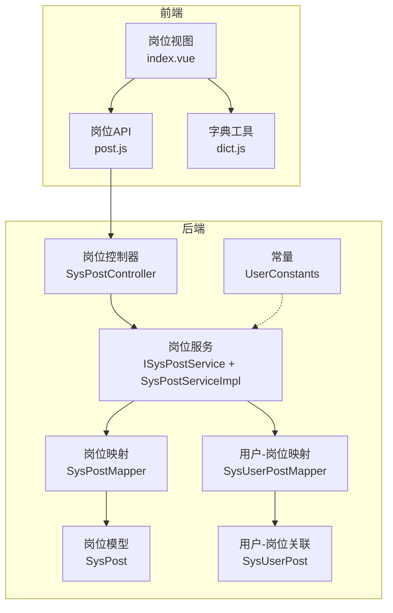
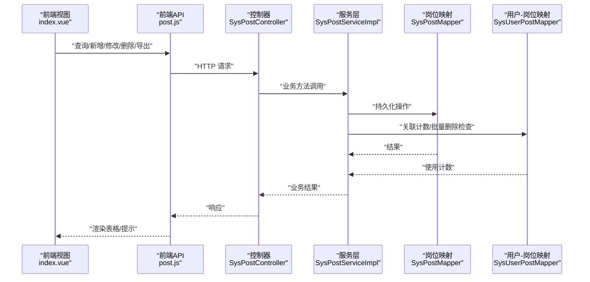
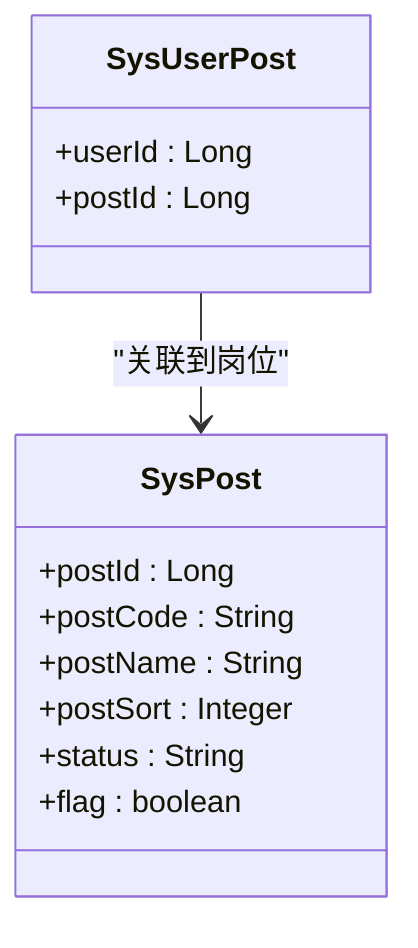
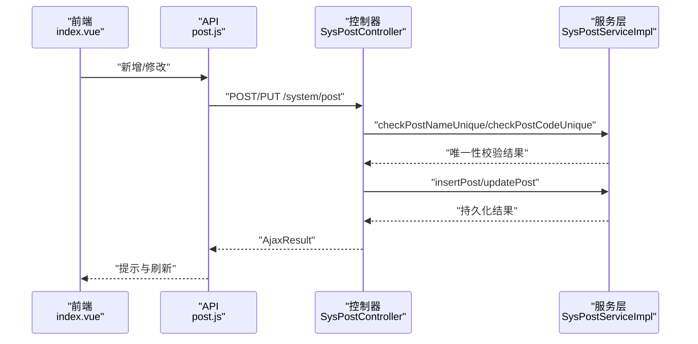
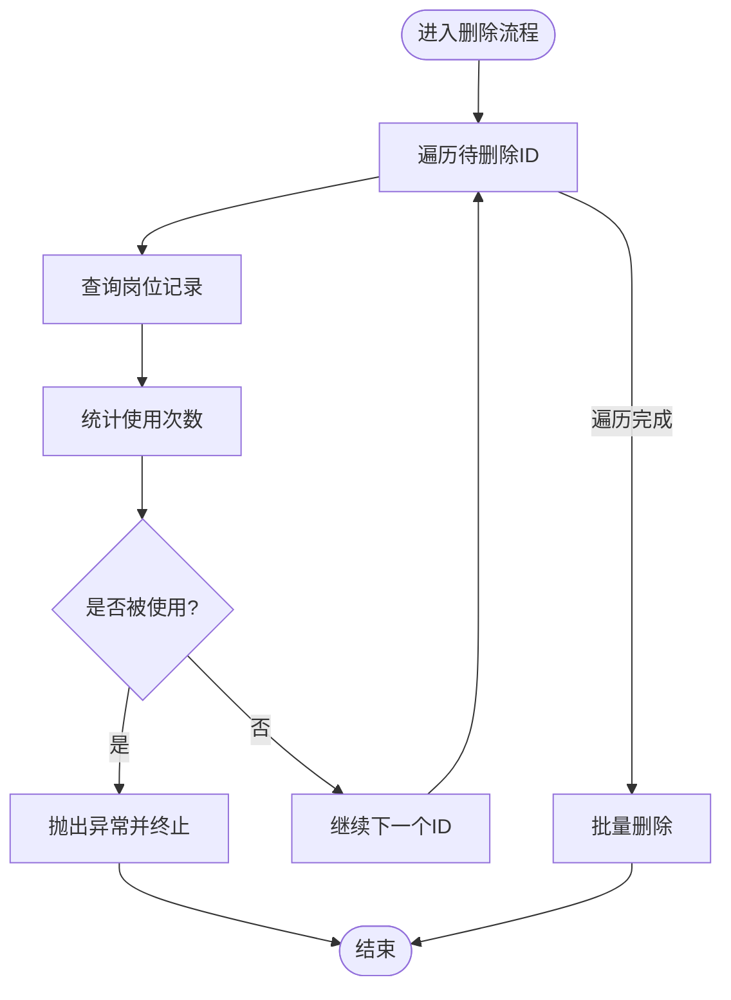
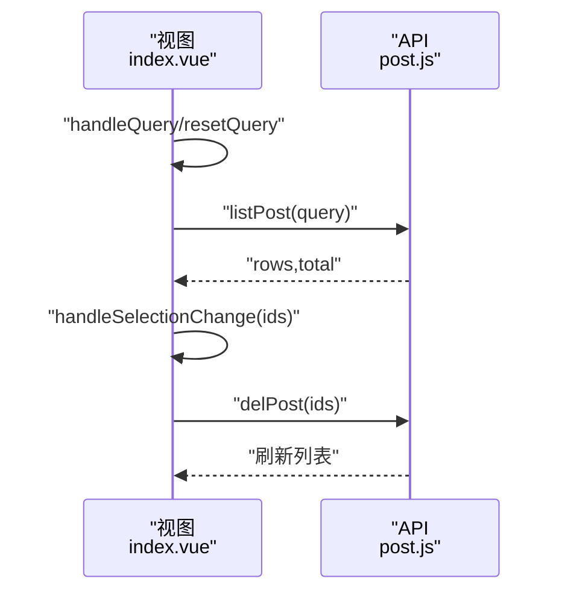
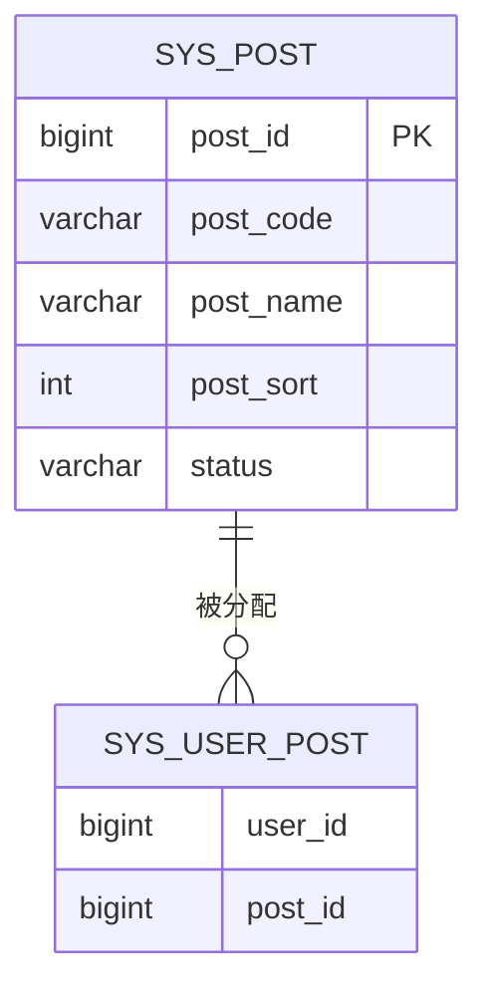
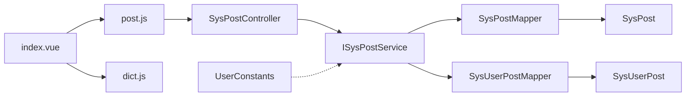

# 岗位管理

<cite>
**本文引用的文件**
- [SysPostController.java](file://XingChen-Vue/xingchen-admin/src/main/java/com/xingchen/web/controller/system/SysPostController.java)
- [ISysPostService.java](file://XingChen-Vue/xingchen-system/src/main/java/com/xingchen/system/service/ISysPostService.java)
- [SysPostServiceImpl.java](file://XingChen-Vue/xingchen-system/src/main/java/com/xingchen/system/service/impl/SysPostServiceImpl.java)
- [SysPostMapper.java](file://XingChen-Vue/xingchen-system/src/main/java/com/xingchen/system/mapper/SysPostMapper.java)
- [SysUserPostMapper.java](file://XingChen-Vue/xingchen-system/src/main/java/com/xingchen/system/mapper/SysUserPostMapper.java)
- [SysPost.java](file://XingChen-Vue/xingchen-system/src/main/java/com/xingchen/system/domain/SysPost.java)
- [SysUserPost.java](file://XingChen-Vue/xingchen-system/src/main/java/com/xingchen/system/domain/SysUserPost.java)
- [post.js](file://XingChen-Vue3/src/api/system/post.js)
- [index.vue](file://XingChen-Vue3/src/views/system/post/index.vue)
- [UserConstants.java](file://XingChen-Vue/xingchen-common/src/main/java/com/xingchen/common/constant/UserConstants.java)
- [dict.js](file://XingChen-Vue3/src/utils/dict.js)
- [ry_20260321.sql](file://XingChen-Vue/sql/ry_20260321.sql)
</cite>

## 目录
1. [简介](#简介)
2. [项目结构](#项目结构)
3. [核心组件](#核心组件)
4. [架构总览](#架构总览)
5. [详细组件分析](#详细组件分析)
6. [依赖分析](#依赖分析)
7. [性能考虑](#性能考虑)
8. [故障排查指南](#故障排查指南)
9. [结论](#结论)
10. [附录](#附录)

## 简介
本技术文档围绕“岗位管理”功能进行系统化说明，涵盖岗位信息的维护机制（岗位编码、岗位名称、岗位排序、状态）、岗位与用户的关联关系、岗位权限控制与数据范围管理、岗位的新增/修改/删除与状态控制、API 接口设计、前端表格组件与批量操作、数据校验规则与唯一性约束、以及岗位管理在用户管理和权限控制中的作用与影响。

## 项目结构
岗位管理功能由后端控制器、服务层、数据访问层、领域模型、前端 API 与视图组件构成，采用前后端分离架构，职责清晰、层次分明。

图表来源
- [SysPostController.java:1-130](file://XingChen-Vue/xingchen-admin/src/main/java/com/xingchen/web/controller/system/SysPostController.java#L1-L130)
- [ISysPostService.java:1-100](file://XingChen-Vue/xingchen-system/src/main/java/com/xingchen/system/service/ISysPostService.java#L1-L100)
- [SysPostServiceImpl.java:1-179](file://XingChen-Vue/xingchen-system/src/main/java/com/xingchen/system/service/impl/SysPostServiceImpl.java#L1-L179)
- [SysPostMapper.java:1-100](file://XingChen-Vue/xingchen-system/src/main/java/com/xingchen/system/mapper/SysPostMapper.java#L1-L100)
- [SysUserPostMapper.java:1-45](file://XingChen-Vue/xingchen-system/src/main/java/com/xingchen/system/mapper/SysUserPostMapper.java#L1-L45)
- [SysPost.java:1-125](file://XingChen-Vue/xingchen-system/src/main/java/com/xingchen/system/domain/SysPost.java#L1-L125)
- [SysUserPost.java:1-46](file://XingChen-Vue/xingchen-system/src/main/java/com/xingchen/system/domain/SysUserPost.java#L1-L46)
- [post.js:1-45](file://XingChen-Vue3/src/api/system/post.js#L1-L45)
- [index.vue:1-288](file://XingChen-Vue3/src/views/system/post/index.vue#L1-L288)
- [UserConstants.java:1-82](file://XingChen-Vue/xingchen-common/src/main/java/com/xingchen/common/constant/UserConstants.java#L1-L82)
- [dict.js:1-24](file://XingChen-Vue3/src/utils/dict.js#L1-L24)

章节来源
- [SysPostController.java:1-130](file://XingChen-Vue/xingchen-admin/src/main/java/com/xingchen/web/controller/system/SysPostController.java#L1-L130)
- [index.vue:1-288](file://XingChen-Vue3/src/views/system/post/index.vue#L1-L288)

## 核心组件
- 岗位实体模型：定义岗位编码、岗位名称、岗位排序、状态等字段及 Excel 导出注解。
- 岗位控制器：提供列表查询、详情查询、新增、修改、删除、导出、选项框列表等接口。
- 岗位服务：封装业务逻辑，包括唯一性校验、使用计数、批量删除前的关联检查。
- 岗位映射与用户-岗位映射：负责数据持久化与关联统计。
- 前端 API 与视图：提供岗位列表、筛选、新增/修改弹窗、批量删除、导出等交互能力。

章节来源
- [SysPost.java:1-125](file://XingChen-Vue/xingchen-system/src/main/java/com/xingchen/system/domain/SysPost.java#L1-L125)
- [SysPostController.java:1-130](file://XingChen-Vue/xingchen-admin/src/main/java/com/xingchen/web/controller/system/SysPostController.java#L1-L130)
- [ISysPostService.java:1-100](file://XingChen-Vue/xingchen-system/src/main/java/com/xingchen/system/service/ISysPostService.java#L1-L100)
- [SysPostServiceImpl.java:1-179](file://XingChen-Vue/xingchen-system/src/main/java/com/xingchen/system/service/impl/SysPostServiceImpl.java#L1-L179)
- [SysPostMapper.java:1-100](file://XingChen-Vue/xingchen-system/src/main/java/com/xingchen/system/mapper/SysPostMapper.java#L1-L100)
- [SysUserPostMapper.java:1-45](file://XingChen-Vue/xingchen-system/src/main/java/com/xingchen/system/mapper/SysUserPostMapper.java#L1-L45)
- [post.js:1-45](file://XingChen-Vue3/src/api/system/post.js#L1-L45)
- [index.vue:1-288](file://XingChen-Vue3/src/views/system/post/index.vue#L1-L288)

## 架构总览
岗位管理遵循典型的三层架构：前端负责展示与交互，后端通过控制器接收请求，调用服务层完成业务处理，再由数据访问层与数据库交互。权限控制基于注解与字典状态值共同实现。

图表来源
- [SysPostController.java:1-130](file://XingChen-Vue/xingchen-admin/src/main/java/com/xingchen/web/controller/system/SysPostController.java#L1-L130)
- [SysPostServiceImpl.java:1-179](file://XingChen-Vue/xingchen-system/src/main/java/com/xingchen/system/service/impl/SysPostServiceImpl.java#L1-L179)
- [SysPostMapper.java:1-100](file://XingChen-Vue/xingchen-system/src/main/java/com/xingchen/system/mapper/SysPostMapper.java#L1-L100)
- [SysUserPostMapper.java:1-45](file://XingChen-Vue/xingchen-system/src/main/java/com/xingchen/system/mapper/SysUserPostMapper.java#L1-L45)
- [post.js:1-45](file://XingChen-Vue3/src/api/system/post.js#L1-L45)
- [index.vue:1-288](file://XingChen-Vue3/src/views/system/post/index.vue#L1-L288)

## 详细组件分析

### 岗位实体模型与数据结构
- 字段设计
  - 岗位编码：用于唯一标识岗位，支持 Excel 导入导出。
  - 岗位名称：用于显示与检索，支持 Excel 导入导出。
  - 岗位排序：整型，用于前端展示顺序。
  - 状态：字典值，0 正常、1 停用。
  - flag：用于标记用户是否具有该岗位（业务辅助字段）。
- 校验规则
  - 岗位编码非空且长度不超过 64。
  - 岗位名称非空且长度不超过 50。
  - 岗位排序非空。
- Excel 注解：支持导入导出列映射与格式化。

图表来源
- [SysPost.java:1-125](file://XingChen-Vue/xingchen-system/src/main/java/com/xingchen/system/domain/SysPost.java#L1-L125)
- [SysUserPost.java:1-46](file://XingChen-Vue/xingchen-system/src/main/java/com/xingchen/system/domain/SysUserPost.java#L1-L46)

章节来源
- [SysPost.java:1-125](file://XingChen-Vue/xingchen-system/src/main/java/com/xingchen/system/domain/SysPost.java#L1-L125)

### 岗位控制器与权限控制
- 接口职责
  - 列表查询：分页查询岗位列表。
  - 导出：按条件导出岗位数据。
  - 详情查询：按岗位 ID 获取岗位信息。
  - 新增/修改：参数校验与唯一性检查，设置创建/更新人。
  - 删除：批量删除，删除前检查是否已被用户使用。
  - 选项框列表：提供岗位下拉选择数据。
- 权限控制
  - 使用注解控制接口访问权限，如列表、导出、新增、编辑、删除、查询等。
  - 前端按钮根据权限指令动态显隐。

图表来源
- [SysPostController.java:1-130](file://XingChen-Vue/xingchen-admin/src/main/java/com/xingchen/web/controller/system/SysPostController.java#L1-L130)
- [SysPostServiceImpl.java:1-179](file://XingChen-Vue/xingchen-system/src/main/java/com/xingchen/system/service/impl/SysPostServiceImpl.java#L1-L179)
- [post.js:1-45](file://XingChen-Vue3/src/api/system/post.js#L1-L45)
- [index.vue:1-288](file://XingChen-Vue3/src/views/system/post/index.vue#L1-L288)

章节来源
- [SysPostController.java:1-130](file://XingChen-Vue/xingchen-admin/src/main/java/com/xingchen/web/controller/system/SysPostController.java#L1-L130)

### 岗位服务层与业务规则
- 唯一性校验
  - 校验岗位名称唯一：忽略当前记录 ID 进行比较。
  - 校验岗位编码唯一：忽略当前记录 ID 进行比较。
- 使用计数与删除保护
  - 通过用户-岗位映射统计岗位使用次数。
  - 批量删除前逐条检查，若被使用则抛出异常并阻止删除。
- 新增/修改/删除
  - 统一走 Mapper 层执行 SQL 操作，返回影响行数供控制器处理。

图表来源
- [SysPostServiceImpl.java:135-153](file://XingChen-Vue/xingchen-system/src/main/java/com/xingchen/system/service/impl/SysPostServiceImpl.java#L135-L153)
- [SysUserPostMapper.java:21-27](file://XingChen-Vue/xingchen-system/src/main/java/com/xingchen/system/mapper/SysUserPostMapper.java#L21-L27)

章节来源
- [ISysPostService.java:1-100](file://XingChen-Vue/xingchen-system/src/main/java/com/xingchen/system/service/ISysPostService.java#L1-L100)
- [SysPostServiceImpl.java:1-179](file://XingChen-Vue/xingchen-system/src/main/java/com/xingchen/system/service/impl/SysPostServiceImpl.java#L1-L179)

### 前端表格组件与批量操作
- 功能特性
  - 支持按岗位编码、岗位名称、状态筛选。
  - 支持新增、修改、删除、导出。
  - 支持多选批量删除。
  - 分页加载与字典状态渲染。
- 表单校验
  - 岗位名称、岗位编码、岗位排序必填。
- 权限指令
  - 按钮级权限控制，未授权不可见或不可点。

图表来源
- [index.vue:181-287](file://XingChen-Vue3/src/views/system/post/index.vue#L181-L287)
- [post.js:1-45](file://XingChen-Vue3/src/api/system/post.js#L1-L45)

章节来源
- [index.vue:1-288](file://XingChen-Vue3/src/views/system/post/index.vue#L1-L288)
- [post.js:1-45](file://XingChen-Vue3/src/api/system/post.js#L1-L45)

### 岗位与用户关联关系
- 关联表设计
  - 用户-岗位关联表包含用户 ID 与岗位 ID，形成多对多关系。
- 关联用途
  - 用户可拥有多个岗位；岗位可分配给多个用户。
  - 服务层通过计数判断岗位是否可删除。
- 数据一致性
  - 删除岗位前必须解除用户关联或迁移岗位，避免破坏性删除。

图表来源
- [SysPost.java:1-125](file://XingChen-Vue/xingchen-system/src/main/java/com/xingchen/system/domain/SysPost.java#L1-L125)
- [SysUserPost.java:1-46](file://XingChen-Vue/xingchen-system/src/main/java/com/xingchen/system/domain/SysUserPost.java#L1-L46)
- [ry_20260321.sql:86-99](file://XingChen-Vue/sql/ry_20260321.sql#L86-L99)

章节来源
- [SysUserPost.java:1-46](file://XingChen-Vue/xingchen-system/src/main/java/com/xingchen/system/domain/SysUserPost.java#L1-L46)
- [SysUserPostMapper.java:1-45](file://XingChen-Vue/xingchen-system/src/main/java/com/xingchen/system/mapper/SysUserPostMapper.java#L1-L45)
- [ry_20260321.sql:86-99](file://XingChen-Vue/sql/ry_20260321.sql#L86-L99)

### 岗位权限控制与数据范围管理
- 权限控制
  - 控制器接口使用权限注解，确保只有具备相应权限的角色才能操作。
  - 前端按钮根据权限指令动态显示。
- 数据范围
  - 项目中存在数据范围切面与注解，岗位管理可结合数据范围注解实现按部门/组织的数据可见性控制（需在具体业务场景中启用）。

章节来源
- [SysPostController.java:40-128](file://XingChen-Vue/xingchen-admin/src/main/java/com/xingchen/web/controller/system/SysPostController.java#L40-L128)
- [index.vue:45-76](file://XingChen-Vue3/src/views/system/post/index.vue#L45-L76)

## 依赖分析
- 组件耦合
  - 控制器依赖服务接口；服务实现依赖映射接口；映射依赖模型与关联模型。
  - 前端 API 与视图组件依赖后端接口契约。
- 外部依赖
  - 字典工具用于状态值渲染；权限指令用于按钮级控制；Excel 工具用于导出。

图表来源
- [SysPostController.java:1-130](file://XingChen-Vue/xingchen-admin/src/main/java/com/xingchen/web/controller/system/SysPostController.java#L1-L130)
- [ISysPostService.java:1-100](file://XingChen-Vue/xingchen-system/src/main/java/com/xingchen/system/service/ISysPostService.java#L1-L100)
- [SysPostMapper.java:1-100](file://XingChen-Vue/xingchen-system/src/main/java/com/xingchen/system/mapper/SysPostMapper.java#L1-L100)
- [SysUserPostMapper.java:1-45](file://XingChen-Vue/xingchen-system/src/main/java/com/xingchen/system/mapper/SysUserPostMapper.java#L1-L45)
- [SysPost.java:1-125](file://XingChen-Vue/xingchen-system/src/main/java/com/xingchen/system/domain/SysPost.java#L1-L125)
- [SysUserPost.java:1-46](file://XingChen-Vue/xingchen-system/src/main/java/com/xingchen/system/domain/SysUserPost.java#L1-L46)
- [post.js:1-45](file://XingChen-Vue3/src/api/system/post.js#L1-L45)
- [index.vue:1-288](file://XingChen-Vue3/src/views/system/post/index.vue#L1-L288)
- [dict.js:1-24](file://XingChen-Vue3/src/utils/dict.js#L1-L24)
- [UserConstants.java:1-82](file://XingChen-Vue/xingchen-common/src/main/java/com/xingchen/common/constant/UserConstants.java#L1-L82)

章节来源
- [SysPostController.java:1-130](file://XingChen-Vue/xingchen-admin/src/main/java/com/xingchen/web/controller/system/SysPostController.java#L1-L130)
- [index.vue:1-288](file://XingChen-Vue3/src/views/system/post/index.vue#L1-L288)

## 性能考虑
- 分页查询：后端统一分页，前端按需加载，避免一次性传输大量数据。
- 唯一性校验：在新增/修改时进行数据库层面的唯一性检查，减少重复数据。
- 批量删除：逐条检查使用计数，避免大规模事务锁表。
- 导出优化：按需导出，建议限制导出条数或分批导出。

## 故障排查指南
- 唯一性冲突
  - 现象：新增/修改岗位时报“名称/编码已存在”。
  - 排查：确认岗位名称与编码在当前记录之外是否重复。
  - 参考：服务层唯一性校验逻辑。
- 删除失败
  - 现象：批量删除岗位提示“已分配，不能删除”。
  - 排查：先清理用户-岗位关联，再执行删除。
  - 参考：服务层删除前使用计数检查。
- 权限不足
  - 现象：前端按钮不可见或点击无反应。
  - 排查：确认当前登录用户是否具备对应权限。
  - 参考：控制器注解与前端指令。

章节来源
- [SysPostServiceImpl.java:141-153](file://XingChen-Vue/xingchen-system/src/main/java/com/xingchen/system/service/impl/SysPostServiceImpl.java#L141-L153)
- [SysPostController.java:77-118](file://XingChen-Vue/xingchen-admin/src/main/java/com/xingchen/web/controller/system/SysPostController.java#L77-L118)
- [index.vue:45-76](file://XingChen-Vue3/src/views/system/post/index.vue#L45-L76)

## 结论
岗位管理功能通过清晰的分层设计与严格的业务规则保障了岗位信息的准确性与完整性。结合权限控制与数据范围管理，能够有效支撑用户管理与权限体系的落地实施。前端提供了完善的表格与批量操作能力，后端实现了稳健的校验与保护机制，整体满足企业级应用需求。

## 附录
- 数据库初始化示例
  - 岗位表初始化包含常见岗位（如董事长、项目经理、人力资源、普通员工），便于快速验证。
- 常量与字典
  - 状态值“0 正常、1 停用”与字典渲染配合，保证界面一致性和可维护性。

章节来源
- [ry_20260321.sql:95-98](file://XingChen-Vue/sql/ry_20260321.sql#L95-L98)
- [dict.js:1-24](file://XingChen-Vue3/src/utils/dict.js#L1-L24)
- [UserConstants.java:15-16](file://XingChen-Vue/xingchen-common/src/main/java/com/xingchen/common/constant/UserConstants.java#L15-L16)