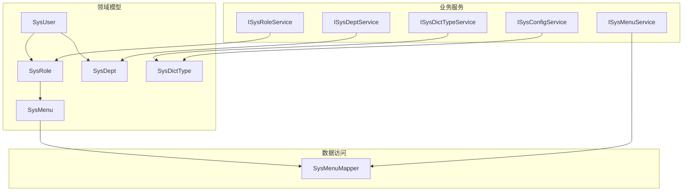
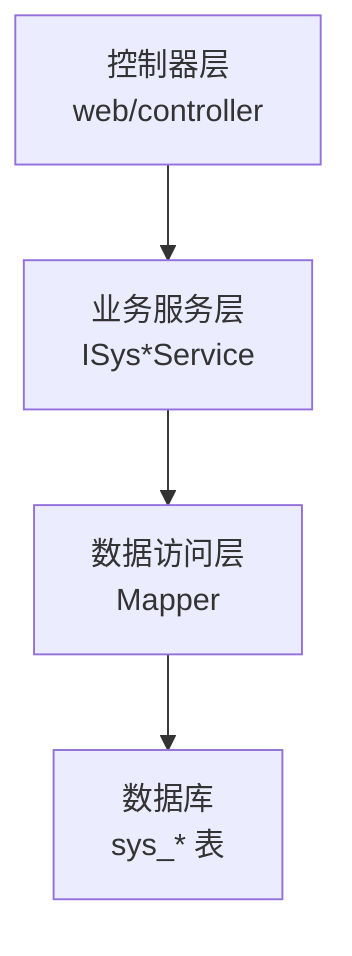
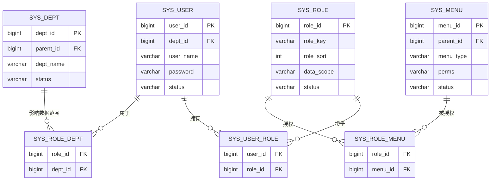
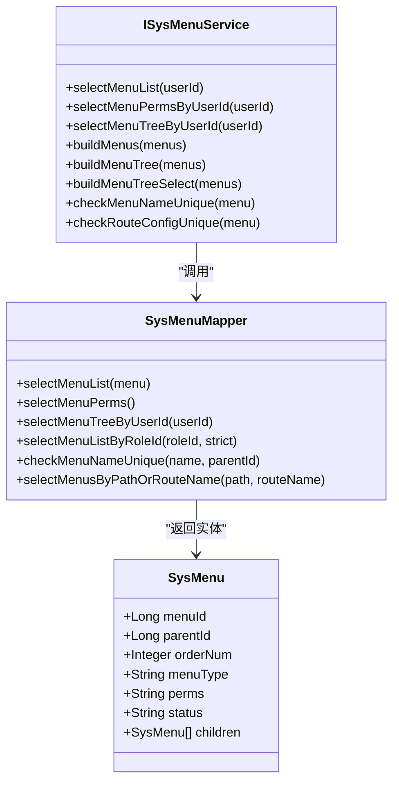
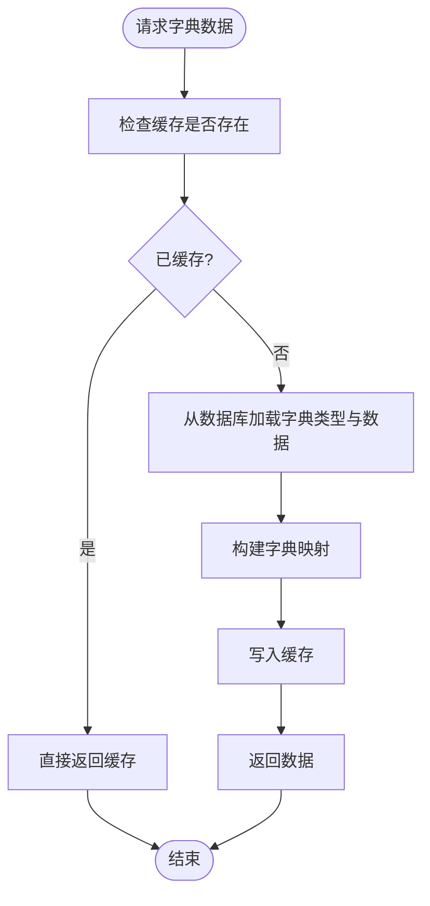
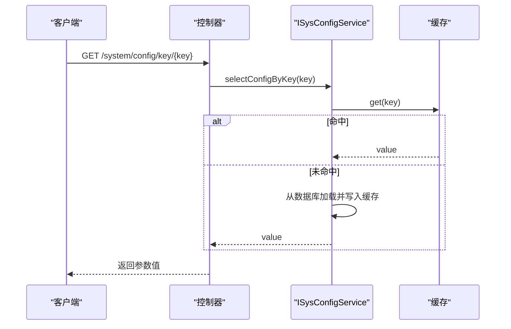
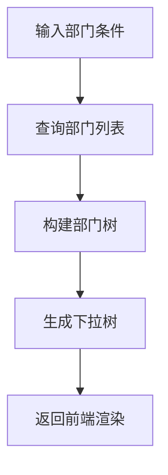
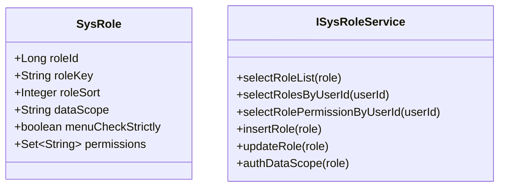
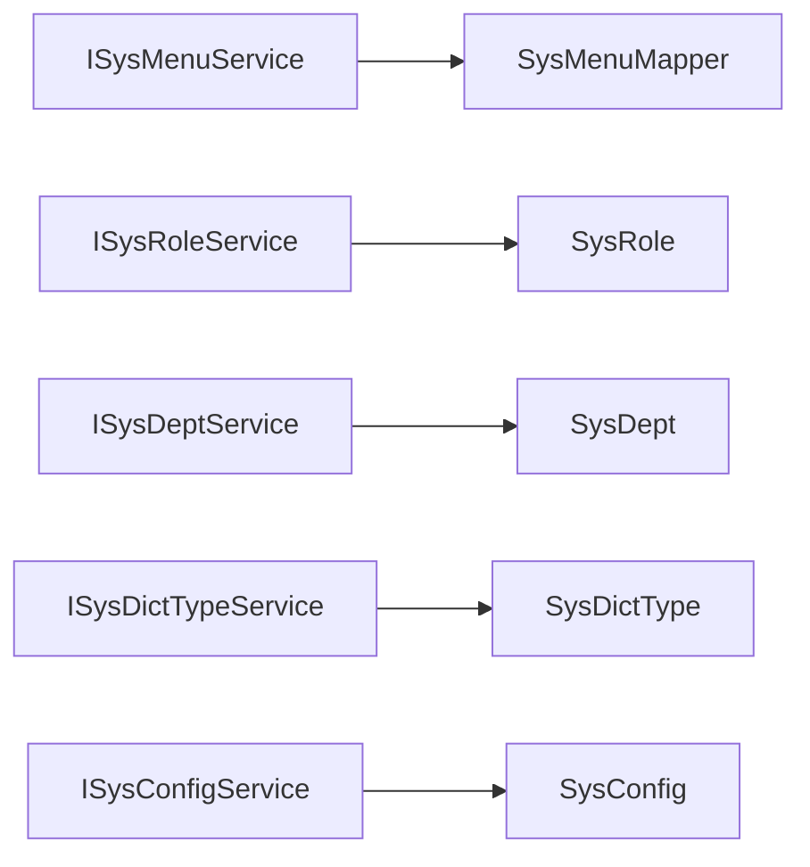

# 系统管理模块

<cite>
**本文引用的文件**
- [SysMenu.java](file://XingChen-Vue/xingchen-common/src/main/java/com/xingchen/common/core/domain/entity/SysMenu.java)
- [SysRole.java](file://XingChen-Vue/xingchen-common/src/main/java/com/xingchen/common/core/domain/entity/SysRole.java)
- [SysUser.java](file://XingChen-Vue/xingchen-common/src/main/java/com/xingchen/common/core/domain/entity/SysUser.java)
- [SysDept.java](file://XingChen-Vue/xingchen-common/src/main/java/com/xingchen/common/core/domain/entity/SysDept.java)
- [SysDictType.java](file://XingChen-Vue/xingchen-common/src/main/java/com/xingchen/common/core/domain/entity/SysDictType.java)
- [ISysMenuService.java](file://XingChen-Vue/xingchen-system/src/main/java/com/xingchen/system/service/ISysMenuService.java)
- [ISysRoleService.java](file://XingChen-Vue/xingchen-system/src/main/java/com/xingchen/system/service/ISysRoleService.java)
- [ISysDeptService.java](file://XingChen-Vue/xingchen-system/src/main/java/com/xingchen/system/service/ISysDeptService.java)
- [ISysDictTypeService.java](file://XingChen-Vue/xingchen-system/src/main/java/com/xingchen/system/service/ISysDictTypeService.java)
- [ISysConfigService.java](file://XingChen-Vue/xingchen-system/src/main/java/com/xingchen/system/service/ISysConfigService.java)
- [SysMenuMapper.java](file://XingChen-Vue/xingchen-system/src/main/java/com/xingchen/system/mapper/SysMenuMapper.java)
</cite>

## 目录
1. [引言](#引言)
2. [项目结构](#项目结构)
3. [核心组件](#核心组件)
4. [架构总览](#架构总览)
5. [详细组件分析](#详细组件分析)
6. [依赖分析](#依赖分析)
7. [性能考虑](#性能考虑)
8. [故障排查指南](#故障排查指南)
9. [结论](#结论)
10. [附录](#附录)

## 引言
本技术文档聚焦于系统管理模块，围绕RBAC权限模型、菜单权限、字典管理和参数配置展开，系统性阐述数据库设计、菜单树形结构管理、字典分类维护与系统参数配置的技术方案，并覆盖权限继承机制、菜单动态加载、字典缓存策略与配置热更新能力。同时提供API接口职责说明、前后端交互要点以及安全控制与审计日志的设计思路，帮助读者快速理解并高效落地。

## 项目结构
系统管理模块位于后端工程的system子模块，采用典型的分层架构：
- 领域模型层：定义实体类（用户、角色、菜单、部门、字典类型等）
- Mapper层：负责与数据库交互，提供基础CRUD与复杂查询
- Service层：封装业务规则与流程编排，如菜单树构建、权限计算、字典缓存管理、参数缓存管理
- 控制器层：对外暴露REST接口（位于web子模块controller包），调用Service完成具体业务

图表来源
- [SysUser.java:1-337](file://XingChen-Vue/xingchen-common/src/main/java/com/xingchen/common/core/domain/entity/SysUser.java#L1-L337)
- [SysRole.java:1-242](file://XingChen-Vue/xingchen-common/src/main/java/com/xingchen/common/core/domain/entity/SysRole.java#L1-L242)
- [SysMenu.java:1-275](file://XingChen-Vue/xingchen-common/src/main/java/com/xingchen/common/core/domain/entity/SysMenu.java#L1-L275)
- [SysDept.java:1-204](file://XingChen-Vue/xingchen-common/src/main/java/com/xingchen/common/core/domain/entity/SysDept.java#L1-L204)
- [SysDictType.java:1-97](file://XingChen-Vue/xingchen-common/src/main/java/com/xingchen/common/core/domain/entity/SysDictType.java#L1-L97)
- [SysMenuMapper.java:1-142](file://XingChen-Vue/xingchen-system/src/main/java/com/xingchen/system/mapper/SysMenuMapper.java#L1-L142)
- [ISysMenuService.java:1-161](file://XingChen-Vue/xingchen-system/src/main/java/com/xingchen/system/service/ISysMenuService.java#L1-L161)
- [ISysRoleService.java:1-174](file://XingChen-Vue/xingchen-system/src/main/java/com/xingchen/system/service/ISysRoleService.java#L1-L174)
- [ISysDeptService.java:1-133](file://XingChen-Vue/xingchen-system/src/main/java/com/xingchen/system/service/ISysDeptService.java#L1-L133)
- [ISysDictTypeService.java:1-99](file://XingChen-Vue/xingchen-system/src/main/java/com/xingchen/system/service/ISysDictTypeService.java#L1-L99)
- [ISysConfigService.java:1-90](file://XingChen-Vue/xingchen-system/src/main/java/com/xingchen/system/service/ISysConfigService.java#L1-L90)

章节来源
- [SysMenu.java:1-275](file://XingChen-Vue/xingchen-common/src/main/java/com/xingchen/common/core/domain/entity/SysMenu.java#L1-L275)
- [SysRole.java:1-242](file://XingChen-Vue/xingchen-common/src/main/java/com/xingchen/common/core/domain/entity/SysRole.java#L1-L242)
- [SysUser.java:1-337](file://XingChen-Vue/xingchen-common/src/main/java/com/xingchen/common/core/domain/entity/SysUser.java#L1-L337)
- [SysDept.java:1-204](file://XingChen-Vue/xingchen-common/src/main/java/com/xingchen/common/core/domain/entity/SysDept.java#L1-L204)
- [SysDictType.java:1-97](file://XingChen-Vue/xingchen-common/src/main/java/com/xingchen/common/core/domain/entity/SysDictType.java#L1-L97)
- [ISysMenuService.java:1-161](file://XingChen-Vue/xingchen-system/src/main/java/com/xingchen/system/service/ISysMenuService.java#L1-L161)
- [ISysRoleService.java:1-174](file://XingChen-Vue/xingchen-system/src/main/java/com/xingchen/system/service/ISysRoleService.java#L1-L174)
- [ISysDeptService.java:1-133](file://XingChen-Vue/xingchen-system/src/main/java/com/xingchen/system/service/ISysDeptService.java#L1-L133)
- [ISysDictTypeService.java:1-99](file://XingChen-Vue/xingchen-system/src/main/java/com/xingchen/system/service/ISysDictTypeService.java#L1-L99)
- [ISysConfigService.java:1-90](file://XingChen-Vue/xingchen-system/src/main/java/com/xingchen/system/service/ISysConfigService.java#L1-L90)
- [SysMenuMapper.java:1-142](file://XingChen-Vue/xingchen-system/src/main/java/com/xingchen/system/mapper/SysMenuMapper.java#L1-L142)

## 核心组件
- RBAC模型核心实体
  - 用户：承载基本信息、所属部门、角色集合等
  - 角色：角色标识、数据范围、状态、菜单/部门勾选严格模式等
  - 菜单：菜单树结构、路由配置、权限标识、显示状态等
  - 部门：组织架构树、层级祖先、状态、排序等
  - 字典类型：字典分类、键名、状态等
- 业务接口
  - 菜单服务：菜单列表、权限集合、菜单树、路由构建、唯一性校验等
  - 角色服务：角色列表、权限集合、数据范围校验、角色授权等
  - 部门服务：部门树、下拉树、数据范围校验、唯一性校验等
  - 字典服务：字典类型列表、按类型取数据、缓存加载/清空/重置
  - 参数服务：参数键值查询、验证码开关、缓存加载/清空/重置

章节来源
- [SysUser.java:1-337](file://XingChen-Vue/xingchen-common/src/main/java/com/xingchen/common/core/domain/entity/SysUser.java#L1-L337)
- [SysRole.java:1-242](file://XingChen-Vue/xingchen-common/src/main/java/com/xingchen/common/core/domain/entity/SysRole.java#L1-L242)
- [SysMenu.java:1-275](file://XingChen-Vue/xingchen-common/src/main/java/com/xingchen/common/core/domain/entity/SysMenu.java#L1-L275)
- [SysDept.java:1-204](file://XingChen-Vue/xingchen-common/src/main/java/com/xingchen/common/core/domain/entity/SysDept.java#L1-L204)
- [SysDictType.java:1-97](file://XingChen-Vue/xingchen-common/src/main/java/com/xingchen/common/core/domain/entity/SysDictType.java#L1-L97)
- [ISysMenuService.java:1-161](file://XingChen-Vue/xingchen-system/src/main/java/com/xingchen/system/service/ISysMenuService.java#L1-L161)
- [ISysRoleService.java:1-174](file://XingChen-Vue/xingchen-system/src/main/java/com/xingchen/system/service/ISysRoleService.java#L1-L174)
- [ISysDeptService.java:1-133](file://XingChen-Vue/xingchen-system/src/main/java/com/xingchen/system/service/ISysDeptService.java#L1-L133)
- [ISysDictTypeService.java:1-99](file://XingChen-Vue/xingchen-system/src/main/java/com/xingchen/system/service/ISysDictTypeService.java#L1-L99)
- [ISysConfigService.java:1-90](file://XingChen-Vue/xingchen-system/src/main/java/com/xingchen/system/service/ISysConfigService.java#L1-L90)

## 架构总览
系统管理模块遵循“接口隔离+分层解耦”的设计原则，通过Mapper直连数据库，Service编排业务，Controller对外提供REST接口。权限继承体现在用户→角色→菜单/权限的链路，菜单树与部门树通过统一的构建算法生成前端所需结构。

图表来源
- [ISysMenuService.java:1-161](file://XingChen-Vue/xingchen-system/src/main/java/com/xingchen/system/service/ISysMenuService.java#L1-L161)
- [ISysRoleService.java:1-174](file://XingChen-Vue/xingchen-system/src/main/java/com/xingchen/system/service/ISysRoleService.java#L1-L174)
- [ISysDeptService.java:1-133](file://XingChen-Vue/xingchen-system/src/main/java/com/xingchen/system/service/ISysDeptService.java#L1-L133)
- [ISysDictTypeService.java:1-99](file://XingChen-Vue/xingchen-system/src/main/java/com/xingchen/system/service/ISysDictTypeService.java#L1-L99)
- [ISysConfigService.java:1-90](file://XingChen-Vue/xingchen-system/src/main/java/com/xingchen/system/service/ISysConfigService.java#L1-L90)
- [SysMenuMapper.java:1-142](file://XingChen-Vue/xingchen-system/src/main/java/com/xingchen/system/mapper/SysMenuMapper.java#L1-L142)

## 详细组件分析

### RBAC权限模型与数据库设计
- 实体关系
  - 用户与角色：多对多（SysUserRole）
  - 角色与菜单：多对多（SysRoleMenu）
  - 角色与部门：多对多（SysRoleDept）
  - 用户与岗位：多对多（SysUserPost）
- 权限继承机制
  - 用户权限 = 角色权限 ∪ 自身权限（若存在）
  - 菜单权限 = 角色菜单集合的权限标识合集
  - 数据范围：角色维度限定可见数据范围（全部/自定义/本部门/本部门及以下/仅本人）

图表来源
- [SysUser.java:1-337](file://XingChen-Vue/xingchen-common/src/main/java/com/xingchen/common/core/domain/entity/SysUser.java#L1-L337)
- [SysRole.java:1-242](file://XingChen-Vue/xingchen-common/src/main/java/com/xingchen/common/core/domain/entity/SysRole.java#L1-L242)
- [SysMenu.java:1-275](file://XingChen-Vue/xingchen-common/src/main/java/com/xingchen/common/core/domain/entity/SysMenu.java#L1-L275)
- [SysDept.java:1-204](file://XingChen-Vue/xingchen-common/src/main/java/com/xingchen/common/core/domain/entity/SysDept.java#L1-L204)

章节来源
- [SysUser.java:1-337](file://XingChen-Vue/xingchen-common/src/main/java/com/xingchen/common/core/domain/entity/SysUser.java#L1-L337)
- [SysRole.java:1-242](file://XingChen-Vue/xingchen-common/src/main/java/com/xingchen/common/core/domain/entity/SysRole.java#L1-L242)
- [SysMenu.java:1-275](file://XingChen-Vue/xingchen-common/src/main/java/com/xingchen/common/core/domain/entity/SysMenu.java#L1-L275)
- [SysDept.java:1-204](file://XingChen-Vue/xingchen-common/src/main/java/com/xingchen/common/core/domain/entity/SysDept.java#L1-L204)

### 菜单权限与菜单树形结构管理
- 菜单实体字段涵盖：名称、父ID、显示顺序、路由地址/名称/参数、组件路径、是否外链/缓存、类型（目录/菜单/按钮）、状态、权限标识、图标等
- 菜单树构建
  - 依据parentId构建父子关系
  - 支持“父子联动”模式（菜单树选择项是否关联显示）
- 动态加载与路由构建
  - 服务层提供buildMenus/buildMenuTree/buildMenuTreeSelect方法
  - 控制器层根据用户/角色返回菜单树与路由结构，供前端渲染

图表来源
- [SysMenu.java:1-275](file://XingChen-Vue/xingchen-common/src/main/java/com/xingchen/common/core/domain/entity/SysMenu.java#L1-L275)
- [ISysMenuService.java:1-161](file://XingChen-Vue/xingchen-system/src/main/java/com/xingchen/system/service/ISysMenuService.java#L1-L161)
- [SysMenuMapper.java:1-142](file://XingChen-Vue/xingchen-system/src/main/java/com/xingchen/system/mapper/SysMenuMapper.java#L1-L142)

章节来源
- [SysMenu.java:1-275](file://XingChen-Vue/xingchen-common/src/main/java/com/xingchen/common/core/domain/entity/SysMenu.java#L1-L275)
- [ISysMenuService.java:1-161](file://XingChen-Vue/xingchen-system/src/main/java/com/xingchen/system/service/ISysMenuService.java#L1-L161)
- [SysMenuMapper.java:1-142](file://XingChen-Vue/xingchen-system/src/main/java/com/xingchen/system/mapper/SysMenuMapper.java#L1-L142)

### 字典分类维护与字典缓存策略
- 字典类型实体：字典名称、字典类型（键名）、状态
- 业务职责
  - 分页查询字典类型、按类型查询字典数据
  - 缓存加载/清空/重置，保障运行时读取高性能
- 缓存策略
  - 启动/手动触发加载缓存
  - 写操作后清空或重置缓存，确保一致性

图表来源
- [ISysDictTypeService.java:1-99](file://XingChen-Vue/xingchen-system/src/main/java/com/xingchen/system/service/ISysDictTypeService.java#L1-L99)
- [SysDictType.java:1-97](file://XingChen-Vue/xingchen-common/src/main/java/com/xingchen/common/core/domain/entity/SysDictType.java#L1-L97)

章节来源
- [ISysDictTypeService.java:1-99](file://XingChen-Vue/xingchen-system/src/main/java/com/xingchen/system/service/ISysDictTypeService.java#L1-L99)
- [SysDictType.java:1-97](file://XingChen-Vue/xingchen-common/src/main/java/com/xingchen/common/core/domain/entity/SysDictType.java#L1-L97)

### 参数配置与热更新
- 参数实体：键名、键值、类型、备注等
- 业务职责
  - 按键名查询参数值、验证码开关
  - 缓存加载/清空/重置，支持热更新
- 热更新机制
  - 写操作后清空/重置缓存，下次读取生效
  - 前端可定时刷新或通过事件驱动触发重新加载

图表来源
- [ISysConfigService.java:1-90](file://XingChen-Vue/xingchen-system/src/main/java/com/xingchen/system/service/ISysConfigService.java#L1-L90)

章节来源
- [ISysConfigService.java:1-90](file://XingChen-Vue/xingchen-system/src/main/java/com/xingchen/system/service/ISysConfigService.java#L1-L90)

### 部门管理与数据范围控制
- 部门实体：部门名称、父ID、祖先列表、排序、负责人、联系方式、状态
- 业务职责
  - 部门树构建、下拉树构建
  - 数据范围校验（角色/部门维度）
  - 唯一性校验与删除前检查

图表来源
- [ISysDeptService.java:1-133](file://XingChen-Vue/xingchen-system/src/main/java/com/xingchen/system/service/ISysDeptService.java#L1-L133)
- [SysDept.java:1-204](file://XingChen-Vue/xingchen-common/src/main/java/com/xingchen/common/core/domain/entity/SysDept.java#L1-L204)

章节来源
- [ISysDeptService.java:1-133](file://XingChen-Vue/xingchen-system/src/main/java/com/xingchen/system/service/ISysDeptService.java#L1-L133)
- [SysDept.java:1-204](file://XingChen-Vue/xingchen-common/src/main/java/com/xingchen/common/core/domain/entity/SysDept.java#L1-L204)

### 角色管理与权限分配
- 角色实体：角色名称、角色键、排序、数据范围、状态、菜单/部门勾选严格模式
- 业务职责
  - 角色列表、角色权限集合、数据范围校验
  - 角色授权（菜单/部门/用户）

图表来源
- [SysRole.java:1-242](file://XingChen-Vue/xingchen-common/src/main/java/com/xingchen/common/core/domain/entity/SysRole.java#L1-L242)
- [ISysRoleService.java:1-174](file://XingChen-Vue/xingchen-system/src/main/java/com/xingchen/system/service/ISysRoleService.java#L1-L174)

章节来源
- [SysRole.java:1-242](file://XingChen-Vue/xingchen-common/src/main/java/com/xingchen/common/core/domain/entity/SysRole.java#L1-L242)
- [ISysRoleService.java:1-174](file://XingChen-Vue/xingchen-system/src/main/java/com/xingchen/system/service/ISysRoleService.java#L1-L174)

### 安全控制与审计日志
- 安全控制
  - 基于注解的权限拦截（如@RequiresPermissions）
  - 登录认证与会话管理（TokenService、JwtAuthenticationTokenFilter）
  - 重复提交防护、接口限流、XSS过滤
- 审计日志
  - 操作日志（SysOperLog）、登录日志（SysLogininfor）
  - 记录操作人、时间、IP、参数、结果等

章节来源
- [SysOperLog.java](file://XingChen-Vue/xingchen-system/src/main/java/com/xingchen/system/domain/SysOperLog.java)
- [SysLogininfor.java](file://XingChen-Vue/xingchen-system/src/main/java/com/xingchen/system/domain/SysLogininfor.java)

## 依赖分析
- 组件内聚与耦合
  - Service层聚合多个Mapper/缓存操作，保持业务内聚
  - Mapper层专注SQL与实体映射，避免跨层依赖
- 外部依赖
  - MyBatis、Redis（缓存）、Spring Security（鉴权）
- 循环依赖
  - 通过接口隔离避免循环依赖

图表来源
- [ISysMenuService.java:1-161](file://XingChen-Vue/xingchen-system/src/main/java/com/xingchen/system/service/ISysMenuService.java#L1-L161)
- [ISysRoleService.java:1-174](file://XingChen-Vue/xingchen-system/src/main/java/com/xingchen/system/service/ISysRoleService.java#L1-L174)
- [ISysDeptService.java:1-133](file://XingChen-Vue/xingchen-system/src/main/java/com/xingchen/system/service/ISysDeptService.java#L1-L133)
- [ISysDictTypeService.java:1-99](file://XingChen-Vue/xingchen-system/src/main/java/com/xingchen/system/service/ISysDictTypeService.java#L1-L99)
- [ISysConfigService.java:1-90](file://XingChen-Vue/xingchen-system/src/main/java/com/xingchen/system/service/ISysConfigService.java#L1-L90)

## 性能考虑
- 缓存优先：字典与参数均支持缓存，减少数据库压力
- 批量操作：菜单/部门排序、批量授权/取消授权
- SQL优化：基于索引的唯一性校验（菜单名称、路由配置、字典类型键名）
- 分页查询：角色、字典、参数列表查询均支持分页

## 故障排查指南
- 菜单唯一性校验失败
  - 现象：新增/修改菜单时报名称或路由配置重复
  - 排查：确认同一父节点下的菜单名称唯一、路由地址/名称唯一
  - 参考接口：checkMenuNameUnique、checkRouteConfigUnique
- 字典缓存异常
  - 现象：前端字典显示为空或旧值
  - 排查：执行缓存清空/重置后再访问
  - 参考接口：clearDictCache/resetDictCache
- 参数缓存异常
  - 现象：修改参数后立即生效但后续读取仍旧值
  - 排查：确认写操作后执行缓存清空/重置
  - 参考接口：clearConfigCache/resetConfigCache
- 数据范围校验失败
  - 现象：角色授权/部门删除时报数据范围限制
  - 排查：核对角色数据范围设置与实际业务需求

章节来源
- [ISysMenuService.java:146-160](file://XingChen-Vue/xingchen-system/src/main/java/com/xingchen/system/service/ISysMenuService.java#L146-L160)
- [ISysDictTypeService.java:60-73](file://XingChen-Vue/xingchen-system/src/main/java/com/xingchen/system/service/ISysDictTypeService.java#L60-L73)
- [ISysConfigService.java:67-80](file://XingChen-Vue/xingchen-system/src/main/java/com/xingchen/system/service/ISysConfigService.java#L67-L80)
- [ISysDeptService.java:95-99](file://XingChen-Vue/xingchen-system/src/main/java/com/xingchen/system/service/ISysDeptService.java#L95-L99)

## 结论
系统管理模块以RBAC为核心，结合菜单树、部门树、字典与参数配置，形成完整的后台管理能力。通过清晰的分层设计、完善的缓存策略与热更新机制，既保证了运行效率，也提升了运维灵活性。配合安全控制与审计日志，满足企业级系统的合规与安全要求。

## 附录
- API接口职责（示例）
  - 菜单管理：查询菜单列表、权限集合、菜单树、路由构建、新增/修改/删除、唯一性校验
  - 角色管理：查询角色列表、角色权限、数据范围校验、角色授权/撤销
  - 部门管理：部门树/下拉树构建、数据范围校验、新增/修改/删除、唯一性校验
  - 字典管理：字典类型分页查询、按类型取数据、缓存加载/清空/重置
  - 参数配置：按键名查询、验证码开关、缓存加载/清空/重置

章节来源
- [ISysMenuService.java:1-161](file://XingChen-Vue/xingchen-system/src/main/java/com/xingchen/system/service/ISysMenuService.java#L1-L161)
- [ISysRoleService.java:1-174](file://XingChen-Vue/xingchen-system/src/main/java/com/xingchen/system/service/ISysRoleService.java#L1-L174)
- [ISysDeptService.java:1-133](file://XingChen-Vue/xingchen-system/src/main/java/com/xingchen/system/service/ISysDeptService.java#L1-L133)
- [ISysDictTypeService.java:1-99](file://XingChen-Vue/xingchen-system/src/main/java/com/xingchen/system/service/ISysDictTypeService.java#L1-L99)
- [ISysConfigService.java:1-90](file://XingChen-Vue/xingchen-system/src/main/java/com/xingchen/system/service/ISysConfigService.java#L1-L90)