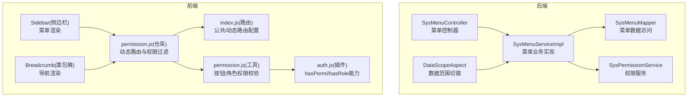
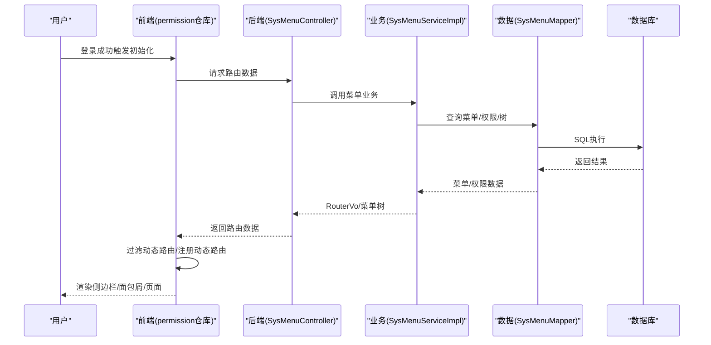
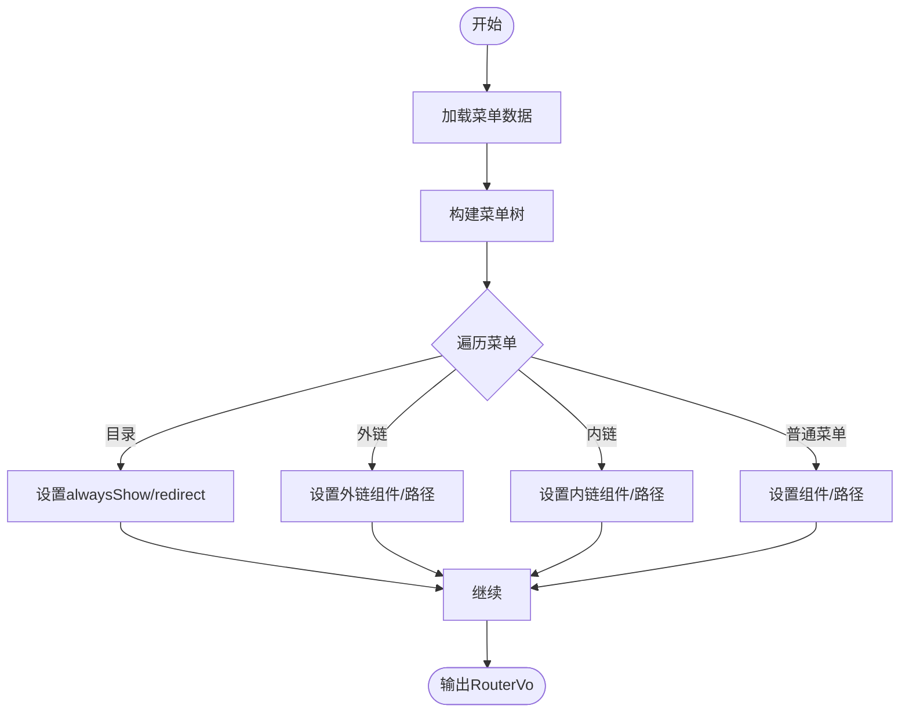
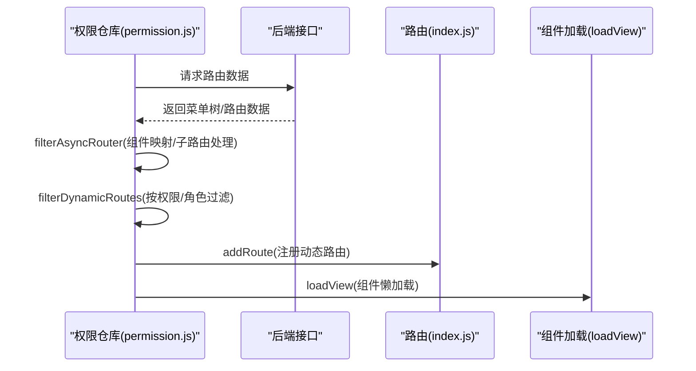
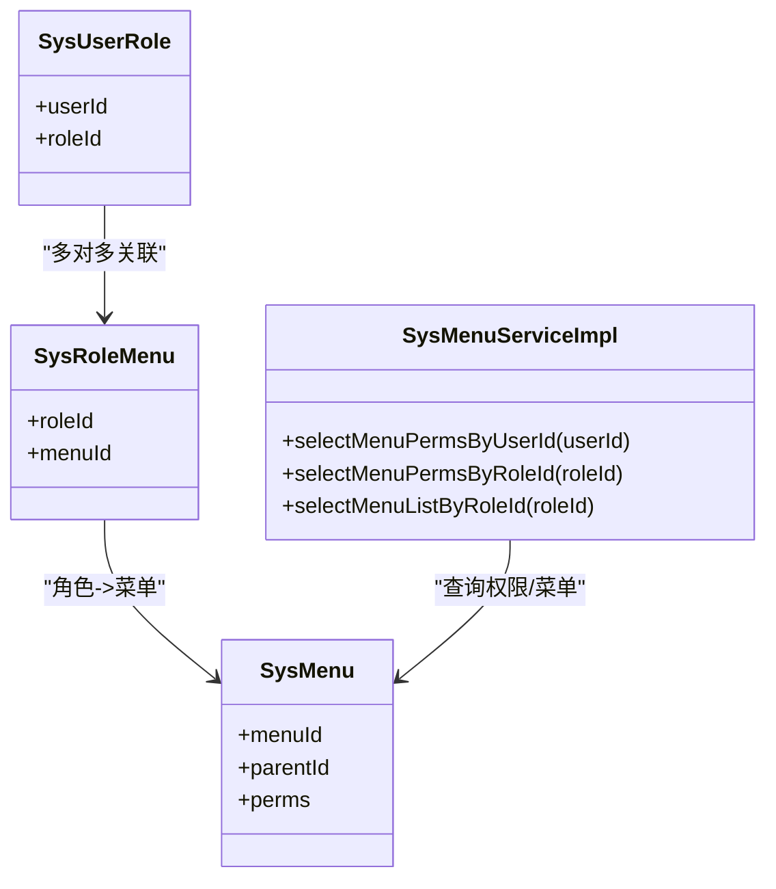
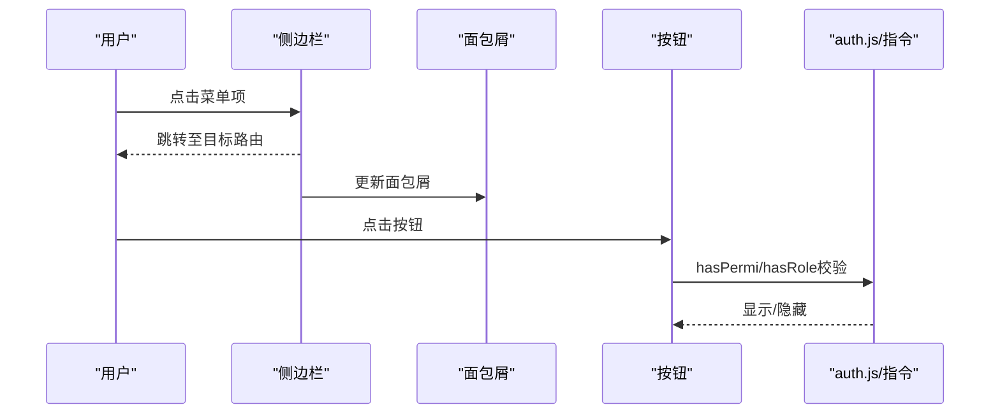
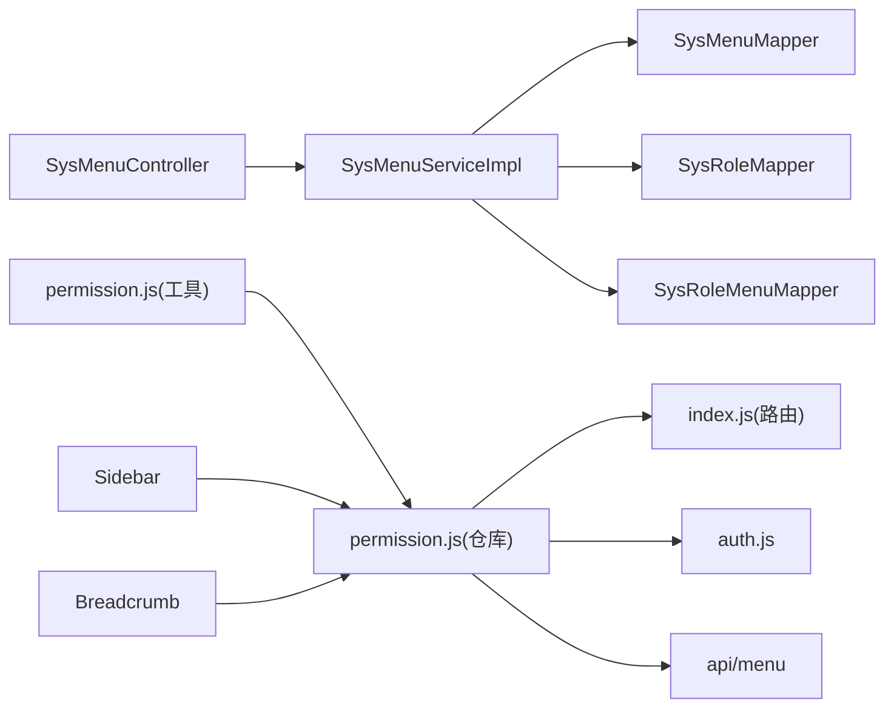

# 菜单权限

<cite>
**本文引用的文件**
- [SysMenu.java](file://XingChen-Vue/xingchen-common/src/main/java/com/xingchen/common/core/domain/entity/SysMenu.java)
- [ISysMenuService.java](file://XingChen-Vue/xingchen-system/src/main/java/com/xingchen/system/service/ISysMenuService.java)
- [SysMenuMapper.java](file://XingChen-Vue/xingchen-system/src/main/java/com/xingchen/system/mapper/SysMenuMapper.java)
- [SysMenuServiceImpl.java](file://XingChen-Vue/xingchen-system/src/main/java/com/xingchen/system/service/impl/SysMenuServiceImpl.java)
- [SysMenuController.java](file://XingChen-Vue/xingchen-admin/src/main/java/com/xingchen/web/controller/system/SysMenuController.java)
- [permission.js（前端工具）](file://XingChen-Vue3/src/utils/permission.js)
- [permission.js（前端权限仓库）](file://XingChen-Vue3/src/store/modules/permission.js)
- [index.js（前端路由）](file://XingChen-Vue3/src/router/index.js)
- [auth.js（前端鉴权插件）](file://XingChen-Vue3/src/plugins/auth.js)
- [hasPermi.js（按钮权限指令）](file://XingChen-Vue3/src/directive/permission/hasPermi.js)
- [hasRole.js（角色权限指令）](file://XingChen-Vue3/src/directive/permission/hasRole.js)
- [Breadcrumb（面包屑组件）](file://XingChen-Vue3/src/components/Breadcrumb/index.vue)
- [Sidebar（侧边栏组件）](file://XingChen-Vue3/src/layout/components/Sidebar/index.vue)
- [CacheConstants.java](file://XingChen-Vue/xingchen-common/src/main/java/com/xingchen/common/constant/CacheConstants.java)
- [RedisCache.java](file://XingChen-Vue/xingchen-common/src/main/java/com/xingchen/common/core/redis/RedisCache.java)
- [DataScopeAspect.java](file://XingChen-Vue/xingchen-framework/src/main/java/com/xingchen/framework/aspectj/DataScopeAspect.java)
- [SysPermissionService.java](file://XingChen-Vue/xingchen-framework/src/main/java/com/xingchen/framework/web/service/SysPermissionService.java)
- [SysRoleMenu.java](file://XingChen-Vue/xingchen-system/src/main/java/com/xingchen/system/domain/SysRoleMenu.java)
- [SysUserRole.java](file://XingChen-Vue/xingchen-system/src/main/java/com/xingchen/system/domain/SysUserRole.java)
</cite>

## 目录
1. [简介](#简介)
2. [项目结构](#项目结构)
3. [核心组件](#核心组件)
4. [架构总览](#架构总览)
5. [详细组件分析](#详细组件分析)
6. [依赖关系分析](#依赖关系分析)
7. [性能考量](#性能考量)
8. [故障排查指南](#故障排查指南)
9. [结论](#结论)
10. [附录](#附录)

## 简介
本文件围绕“菜单权限”主题，系统化梳理健康管理系统中基于 RBAC 的权限模型实现，涵盖菜单树形结构设计、路由权限控制、动态菜单加载机制、菜单类型与权限标识设计、前端路由配置、菜单与角色关联、权限继承与数据范围控制、API 接口设计、前端侧边栏与面包屑渲染、按钮级权限控制、缓存策略、权限验证流程与安全防护等。

## 项目结构
本项目采用前后端分离架构，权限体系由后端 Java 服务与前端 Vue3 应用共同实现：
- 后端模块
  - xingchen-common：通用实体、常量、工具与 Redis 缓存封装
  - xingchen-system：系统菜单、角色、用户、字典等业务模块
  - xingchen-framework：安全框架、拦截器、切面（含数据范围）
  - xingchen-admin：Web 控制器层
- 前端模块
  - xingchen-ui、xingchen-ui-user：用户前端应用
  - XingChen-Vue3：管理后台前端应用（本文件重点）

**图表来源**
- [SysMenuServiceImpl.java:1-619](file://XingChen-Vue/xingchen-system/src/main/java/com/xingchen/system/service/impl/SysMenuServiceImpl.java#L1-619)
- [SysMenuMapper.java:1-142](file://XingChen-Vue/xingchen-system/src/main/java/com/xingchen/system/mapper/SysMenuMapper.java#L1-142)
- [SysMenuController.java](file://XingChen-Vue/xingchen-admin/src/main/java/com/xingchen/web/controller/system/SysMenuController.java)
- [DataScopeAspect.java](file://XingChen-Vue/xingchen-framework/src/main/java/com/xingchen/framework/aspectj/DataScopeAspect.java)
- [SysPermissionService.java](file://XingChen-Vue/xingchen-framework/src/main/java/com/xingchen/framework/web/service/SysPermissionService.java)
- [permission.js（前端权限仓库）:1-135](file://XingChen-Vue3/src/store/modules/permission.js#L1-135)
- [index.js（前端路由）:1-197](file://XingChen-Vue3/src/router/index.js#L1-197)
- [permission.js（前端工具）:1-51](file://XingChen-Vue3/src/utils/permission.js#L1-51)
- [auth.js（前端鉴权插件）](file://XingChen-Vue3/src/plugins/auth.js)
- [Sidebar（侧边栏组件）](file://XingChen-Vue3/src/layout/components/Sidebar/index.vue)
- [Breadcrumb（面包屑组件）](file://XingChen-Vue3/src/components/Breadcrumb/index.vue)

**章节来源**
- [SysMenuServiceImpl.java:1-619](file://XingChen-Vue/xingchen-system/src/main/java/com/xingchen/system/service/impl/SysMenuServiceImpl.java#L1-619)
- [SysMenuMapper.java:1-142](file://XingChen-Vue/xingchen-system/src/main/java/com/xingchen/system/mapper/SysMenuMapper.java#L1-142)
- [SysMenuController.java](file://XingChen-Vue/xingchen-admin/src/main/java/com/xingchen/web/controller/system/SysMenuController.java)
- [permission.js（前端权限仓库）:1-135](file://XingChen-Vue3/src/store/modules/permission.js#L1-135)
- [index.js（前端路由）:1-197](file://XingChen-Vue3/src/router/index.js#L1-197)

## 核心组件
- 菜单实体与树形结构
  - SysMenu 实体定义菜单字段（名称、父ID、顺序、路由地址、组件路径、类型、可见状态、状态、权限标识、图标等），并维护子菜单集合，支撑树形构建与渲染。
- 菜单服务层
  - ISysMenuService 定义菜单查询、权限提取、菜单树构建、路由构建等接口。
  - SysMenuServiceImpl 实现菜单树构建、路由构建、权限拼装、内外链/父视图/内链组件判定、路由唯一性校验等。
- 菜单数据访问层
  - SysMenuMapper 提供按用户/角色查询菜单、权限、菜单树、唯一性校验等方法。
- 前端权限仓库
  - permission.js(仓库) 负责向后端请求路由数据、过滤动态路由、生成侧边栏/顶部路由、注册动态路由。
- 前端路由与鉴权
  - index.js 定义公共路由与动态路由模板，动态路由携带 permissions/roles 属性。
  - permission.js(工具) 提供 checkPermi/checkRole 校验。
  - auth.js 插件提供 hasPermi/hasRole 指令能力。
- 前端渲染组件
  - Sidebar 与 Breadcrumb 组件消费后端返回的菜单树与路由元信息进行渲染。

**章节来源**
- [SysMenu.java:1-275](file://XingChen-Vue/xingchen-common/src/main/java/com/xingchen/common/core/domain/entity/SysMenu.java#L1-275)
- [ISysMenuService.java:1-161](file://XingChen-Vue/xingchen-system/src/main/java/com/xingchen/system/service/ISysMenuService.java#L1-161)
- [SysMenuServiceImpl.java:1-619](file://XingChen-Vue/xingchen-system/src/main/java/com/xingchen/system/service/impl/SysMenuServiceImpl.java#L1-619)
- [SysMenuMapper.java:1-142](file://XingChen-Vue/xingchen-system/src/main/java/com/xingchen/system/mapper/SysMenuMapper.java#L1-142)
- [permission.js（前端权限仓库）:1-135](file://XingChen-Vue3/src/store/modules/permission.js#L1-135)
- [index.js（前端路由）:1-197](file://XingChen-Vue3/src/router/index.js#L1-197)
- [permission.js（前端工具）:1-51](file://XingChen-Vue3/src/utils/permission.js#L1-51)

## 架构总览
RBAC 权限模型在本系统中的落地路径：
- 数据层：SysMenuMapper 从数据库读取菜单与权限，SysRoleMenu 关联角色与菜单。
- 业务层：SysMenuServiceImpl 将菜单组装为树形结构，构建前端 RouterVo，并拼接权限标识。
- 控制层：SysMenuController 对外暴露菜单与路由相关接口（如获取路由树）。
- 前端：permission.js(仓库) 请求后端路由数据，filterAsyncRouter 将后端路由映射为前端组件；filterDynamicRoutes 按权限/角色过滤动态路由；Sidebar/Breadcrumb 渲染菜单树与面包屑。
- 安全校验：permission.js(工具)/auth.js 指令在按钮级与页面级进行权限校验；DataScopeAspect 在后端实现数据范围控制。

**图表来源**
- [SysMenuController.java](file://XingChen-Vue/xingchen-admin/src/main/java/com/xingchen/web/controller/system/SysMenuController.java)
- [SysMenuServiceImpl.java:172-222](file://XingChen-Vue/xingchen-system/src/main/java/com/xingchen/system/service/impl/SysMenuServiceImpl.java#L172-222)
- [SysMenuMapper.java:65-66](file://XingChen-Vue/xingchen-system/src/main/java/com/xingchen/system/mapper/SysMenuMapper.java#L65-66)
- [permission.js（前端权限仓库）:35-54](file://XingChen-Vue3/src/store/modules/permission.js#L35-54)

## 详细组件分析

### 菜单类型与权限标识设计
- 菜单类型
  - 目录（M）：作为分组容器，可重定向、聚合子菜单。
  - 菜单（C）：具体页面路由，可配置外链/内链、缓存策略。
  - 按钮（F）：细粒度操作权限，通过权限字符串在前端指令与后端切面中校验。
- 权限标识符
  - 后端通过 SysMenu.perms 拼接权限字符串，SysMenuServiceImpl 将逗号分隔的权限拆分并去重，形成 Set<String> 供前端与后端使用。
  - 前端动态路由可直接携带 permissions 或 roles 字段，用于动态过滤与按钮级指令校验。

**章节来源**
- [SysMenu.java:54-64](file://XingChen-Vue/xingchen-common/src/main/java/com/xingchen/common/core/domain/entity/SysMenu.java#L54-64)
- [SysMenuServiceImpl.java:96-130](file://XingChen-Vue/xingchen-system/src/main/java/com/xingchen/system/service/impl/SysMenuServiceImpl.java#L96-130)
- [index.js（前端路由）:16-17](file://XingChen-Vue3/src/router/index.js#L16-17)

### 菜单树形结构设计与路由构建
- 树形构建
  - SysMenuServiceImpl.buildMenuTree 以菜单 ID 与父 ID 关系递归构建树，支持下拉树 Select。
- 路由构建
  - SysMenuServiceImpl.buildMenus 将菜单转换为 RouterVo，处理：
    - 外链/内链/父视图/一级菜单的组件与路径差异
    - 菜单可见性、缓存、图标、标题等元信息
    - 目录类型的 alwaysShow/redirect 行为
- 路由唯一性校验
  - SysMenuServiceImpl.checkRouteConfigUnique 校验同级路由路径与根目录路由唯一性、路由名称全局唯一性。

**图表来源**
- [SysMenuServiceImpl.java:230-250](file://XingChen-Vue/xingchen-system/src/main/java/com/xingchen/system/service/impl/SysMenuServiceImpl.java#L230-250)
- [SysMenuServiceImpl.java:172-222](file://XingChen-Vue/xingchen-system/src/main/java/com/xingchen/system/service/impl/SysMenuServiceImpl.java#L172-222)
- [SysMenuServiceImpl.java:390-422](file://XingChen-Vue/xingchen-system/src/main/java/com/xingchen/system/service/impl/SysMenuServiceImpl.java#L390-422)

**章节来源**
- [SysMenuServiceImpl.java:230-250](file://XingChen-Vue/xingchen-system/src/main/java/com/xingchen/system/service/impl/SysMenuServiceImpl.java#L230-250)
- [SysMenuServiceImpl.java:172-222](file://XingChen-Vue/xingchen-system/src/main/java/com/xingchen/system/service/impl/SysMenuServiceImpl.java#L172-222)
- [SysMenuServiceImpl.java:390-422](file://XingChen-Vue/xingchen-system/src/main/java/com/xingchen/system/service/impl/SysMenuServiceImpl.java#L390-422)

### 路由权限控制与动态菜单加载
- 前端动态路由
  - permission.js(仓库) generateRoutes 发起请求获取路由数据，调用 filterAsyncRouter 将后端字符串组件映射为实际组件，再通过 filterDynamicRoutes 按权限/角色过滤动态路由并注册。
  - index.js 定义 constantRoutes（公共路由）与 dynamicRoutes（模板路由），动态路由携带 permissions/roles。
- 组件加载策略
  - loadView 支持全路径与去斜杠匹配，便于组件路径与 views 文件夹结构对齐。
- 侧边栏与顶部路由
  - 生成 sidebarRouters/topbarRouters/defaultRoutes 三套路由集，分别用于不同场景渲染。

**图表来源**
- [permission.js（前端权限仓库）:35-54](file://XingChen-Vue3/src/store/modules/permission.js#L35-54)
- [permission.js（前端权限仓库）:59-84](file://XingChen-Vue3/src/store/modules/permission.js#L59-84)
- [permission.js（前端权限仓库）:100-114](file://XingChen-Vue3/src/store/modules/permission.js#L100-114)
- [index.js（前端路由）:112-183](file://XingChen-Vue3/src/router/index.js#L112-183)

**章节来源**
- [permission.js（前端权限仓库）:35-54](file://XingChen-Vue3/src/store/modules/permission.js#L35-54)
- [permission.js（前端权限仓库）:59-84](file://XingChen-Vue3/src/store/modules/permission.js#L59-84)
- [permission.js（前端权限仓库）:100-114](file://XingChen-Vue3/src/store/modules/permission.js#L100-114)
- [index.js（前端路由）:112-183](file://XingChen-Vue3/src/router/index.js#L112-183)

### 菜单与角色的关联关系、权限继承与数据范围控制
- 角色-菜单关联
  - SysRoleMenu 作为中间表，记录角色与菜单的绑定关系；SysMenuServiceImpl.selectMenuListByRoleId 依据角色严格模式决定是否关联选择。
- 权限继承
  - 用户权限来源于其角色所拥有的菜单权限集合，SysMenuServiceImpl.selectMenuPermsByUserId/selectMenuPermsByRoleId 将多角色/用户的权限合并为 Set，去重后下发前端。
- 数据范围控制
  - DataScopeAspect 通过注解与切面在业务方法上注入数据范围条件，限制用户只能访问授权的数据范围。

**图表来源**
- [SysRoleMenu.java](file://XingChen-Vue/xingchen-system/src/main/java/com/xingchen/system/domain/SysRoleMenu.java)
- [SysUserRole.java](file://XingChen-Vue/xingchen-system/src/main/java/com/xingchen/system/domain/SysUserRole.java)
- [SysMenuServiceImpl.java:96-130](file://XingChen-Vue/xingchen-system/src/main/java/com/xingchen/system/service/impl/SysMenuServiceImpl.java#L96-130)
- [SysMenuServiceImpl.java:159-164](file://XingChen-Vue/xingchen-system/src/main/java/com/xingchen/system/service/impl/SysMenuServiceImpl.java#L159-164)

**章节来源**
- [SysMenuServiceImpl.java:96-130](file://XingChen-Vue/xingchen-system/src/main/java/com/xingchen/system/service/impl/SysMenuServiceImpl.java#L96-130)
- [SysMenuServiceImpl.java:159-164](file://XingChen-Vue/xingchen-system/src/main/java/com/xingchen/system/service/impl/SysMenuServiceImpl.java#L159-164)
- [DataScopeAspect.java](file://XingChen-Vue/xingchen-framework/src/main/java/com/xingchen/framework/aspectj/DataScopeAspect.java)

### API 接口设计
- 菜单与路由相关接口
  - SysMenuController 暴露菜单查询、菜单树、权限集合、路由构建等接口，供前端 permission.js(仓库) 调用。
- 接口职责
  - 获取当前用户/角色的菜单树与权限集合
  - 构建前端可用的路由数据（RouterVo）
  - 校验菜单名称与路由配置唯一性

**章节来源**
- [SysMenuController.java](file://XingChen-Vue/xingchen-admin/src/main/java/com/xingchen/web/controller/system/SysMenuController.java)
- [ISysMenuService.java:16-87](file://XingChen-Vue/xingchen-system/src/main/java/com/xingchen/system/service/ISysMenuService.java#L16-87)

### 前端侧边栏渲染、面包屑导航与按钮级权限控制
- 侧边栏渲染
  - Sidebar 组件消费 sidebarRouters，结合菜单图标、可见性、缓存等元信息渲染层级菜单。
- 面包屑导航
  - Breadcrumb 组件消费路由元信息（meta.title/meta.icon）生成路径导航。
- 按钮级权限控制
  - permission.js(工具) 提供 checkPermi/checkRole，auth.js 提供 hasPermi/hasRole 指令，hasPermi.js/hasRole.js 指令在 DOM 层面控制按钮显隐。

**图表来源**
- [Sidebar（侧边栏组件）](file://XingChen-Vue3/src/layout/components/Sidebar/index.vue)
- [Breadcrumb（面包屑组件）](file://XingChen-Vue3/src/components/Breadcrumb/index.vue)
- [permission.js（前端工具）:8-26](file://XingChen-Vue3/src/utils/permission.js#L8-26)
- [hasPermi.js（按钮权限指令）](file://XingChen-Vue3/src/directive/permission/hasPermi.js)
- [hasRole.js（角色权限指令）](file://XingChen-Vue3/src/directive/permission/hasRole.js)

**章节来源**
- [permission.js（前端工具）:8-26](file://XingChen-Vue3/src/utils/permission.js#L8-26)
- [hasPermi.js（按钮权限指令）](file://XingChen-Vue3/src/directive/permission/hasPermi.js)
- [hasRole.js（角色权限指令）](file://XingChen-Vue3/src/directive/permission/hasRole.js)

### 缓存策略、权限验证流程与安全防护
- 缓存策略
  - CacheConstants 定义缓存键前缀与过期时间；RedisCache 提供统一的缓存读写封装，可用于缓存菜单树、权限集合、路由数据等热点数据。
- 权限验证流程
  - 前端：登录后通过 permission.js(仓库) 请求路由数据，按权限/角色过滤动态路由；按钮级通过 hasPermi/hasRole 指令即时校验。
  - 后端：SysMenuServiceImpl 汇总用户/角色权限；DataScopeAspect 在业务层注入数据范围；SysPermissionService 提供统一权限入口。
- 安全防护
  - XssFilter、RepeatSubmitInterceptor、RateLimiterAspect 等在框架层面提供 XSS、重复提交、限流等安全防护。
  - 路由唯一性校验防止同级/根目录路由冲突，降低越权风险。

**章节来源**
- [CacheConstants.java](file://XingChen-Vue/xingchen-common/src/main/java/com/xingchen/common/constant/CacheConstants.java)
- [RedisCache.java](file://XingChen-Vue/xingchen-common/src/main/java/com/xingchen/common/core/redis/RedisCache.java)
- [SysMenuServiceImpl.java:96-130](file://XingChen-Vue/xingchen-system/src/main/java/com/xingchen/system/service/impl/SysMenuServiceImpl.java#L96-130)
- [DataScopeAspect.java](file://XingChen-Vue/xingchen-framework/src/main/java/com/xingchen/framework/aspectj/DataScopeAspect.java)
- [SysPermissionService.java](file://XingChen-Vue/xingchen-framework/src/main/java/com/xingchen/framework/web/service/SysPermissionService.java)

## 依赖关系分析
- 后端依赖
  - SysMenuServiceImpl 依赖 SysMenuMapper、SysRoleMapper、SysRoleMenuMapper，负责菜单树、权限、路由构建与校验。
  - SysMenuController 依赖菜单服务层，对外提供接口。
- 前端依赖
  - permission.js(仓库) 依赖 index.js(路由)、auth.js、api/menu 接口；permission.js(工具) 依赖用户 store 中的权限/角色集合。
  - Sidebar/Breadcrumb 依赖路由元信息与菜单树数据。

**图表来源**
- [SysMenuController.java](file://XingChen-Vue/xingchen-admin/src/main/java/com/xingchen/web/controller/system/SysMenuController.java)
- [SysMenuServiceImpl.java:46-53](file://XingChen-Vue/xingchen-system/src/main/java/com/xingchen/system/service/impl/SysMenuServiceImpl.java#L46-53)
- [SysMenuMapper.java:1-142](file://XingChen-Vue/xingchen-system/src/main/java/com/xingchen/system/mapper/SysMenuMapper.java#L1-142)
- [permission.js（前端权限仓库）:1-135](file://XingChen-Vue3/src/store/modules/permission.js#L1-135)
- [index.js（前端路由）:1-197](file://XingChen-Vue3/src/router/index.js#L1-197)
- [permission.js（前端工具）:1-51](file://XingChen-Vue3/src/utils/permission.js#L1-51)

**章节来源**
- [SysMenuServiceImpl.java:46-53](file://XingChen-Vue/xingchen-system/src/main/java/com/xingchen/system/service/impl/SysMenuServiceImpl.java#L46-53)
- [SysMenuMapper.java:1-142](file://XingChen-Vue/xingchen-system/src/main/java/com/xingchen/system/mapper/SysMenuMapper.java#L1-142)
- [permission.js（前端权限仓库）:1-135](file://XingChen-Vue3/src/store/modules/permission.js#L1-135)
- [index.js（前端路由）:1-197](file://XingChen-Vue3/src/router/index.js#L1-197)

## 性能考量
- 菜单树构建与权限拼装
  - 使用 Set 去重权限字符串，避免重复校验；优先在后端完成权限聚合，减少前端计算压力。
- 组件懒加载
  - loadView 仅在路由命中时按需加载组件，降低首屏体积。
- 路由唯一性校验
  - 在菜单新增/修改时尽早发现路由冲突，避免运行期错误。
- 缓存热点数据
  - 将菜单树、权限集合、路由数据放入 Redis，设置合理过期策略，提升二次登录与刷新性能。

## 故障排查指南
- 路由组件找不到
  - 现象：控制台出现“找不到组件路径”的警告。
  - 排查：确认后端菜单配置的组件路径与 src/views 下文件名一致（不含后缀），loadView 的增强匹配逻辑支持全匹配与去斜杠匹配。
- 菜单未显示在侧边栏
  - 现象：菜单存在但侧边栏不显示。
  - 排查：检查 visible/status 字段、父级是否为目录、是否被 filterAsyncRouter 删除 children/redirect。
- 按钮不可见或不可点
  - 现象：按钮被隐藏或点击无效。
  - 排查：确认 hasPermi/hasRole 指令绑定的权限/角色是否在用户权限集合中；检查 permission.js(工具) 的校验逻辑。
- 路由冲突
  - 现象：同级/根目录路由路径重复或路由名称重复。
  - 排查：利用 checkRouteConfigUnique 的校验日志定位冲突菜单并调整配置。

**章节来源**
- [permission.js（前端权限仓库）:116-132](file://XingChen-Vue3/src/store/modules/permission.js#L116-132)
- [SysMenuServiceImpl.java:390-422](file://XingChen-Vue/xingchen-system/src/main/java/com/xingchen/system/service/impl/SysMenuServiceImpl.java#L390-422)
- [permission.js（前端工具）:8-26](file://XingChen-Vue3/src/utils/permission.js#L8-26)

## 结论
本系统以 RBAC 为核心，结合后端菜单树与权限聚合、前端动态路由与指令级校验，实现了完整的菜单权限闭环。通过清晰的菜单类型与权限标识设计、严格的路由唯一性校验、完善的缓存与安全防护，既保证了功能的灵活性，也确保了系统的安全性与可维护性。建议在后续迭代中持续优化缓存策略与权限校验性能，并完善权限审计与可视化配置界面。

## 附录
- 关键字段说明
  - 菜单类型：M（目录）、C（菜单）、F（按钮）
  - 可见状态：0（显示）、1（隐藏）
  - 状态：0（正常）、1（停用）
  - 是否外链：0（是）、1（否）
  - 是否缓存：0（缓存）、1（不缓存）
- 前端指令与工具
  - hasPermi/hasRole 指令用于按钮级权限控制
  - checkPermi/checkRole 工具函数用于页面级权限校验
- 后端切面与服务
  - DataScopeAspect：数据范围控制
  - SysPermissionService：统一权限入口