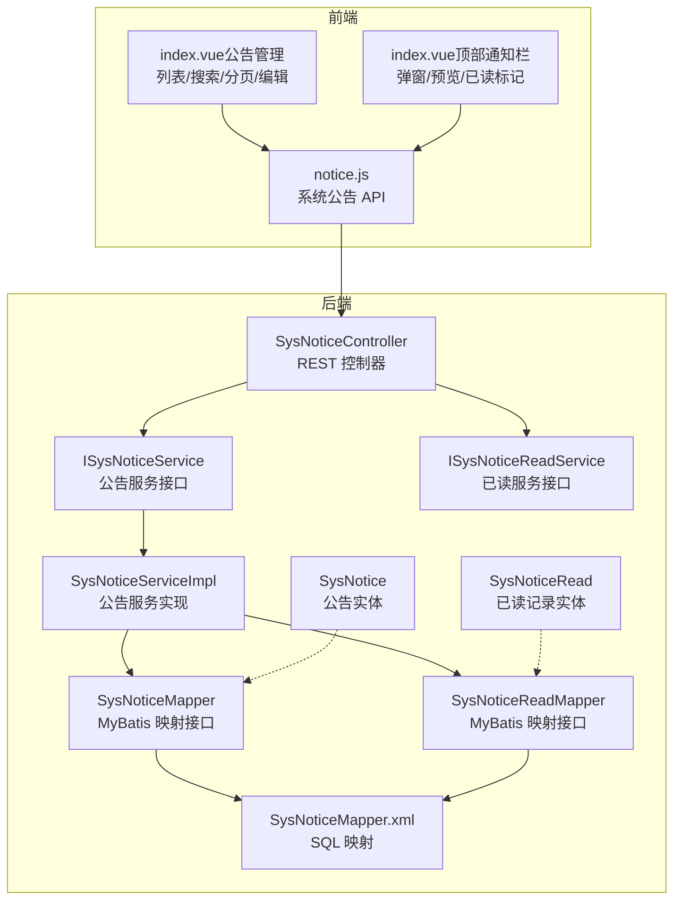
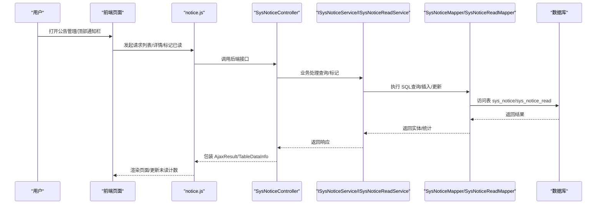
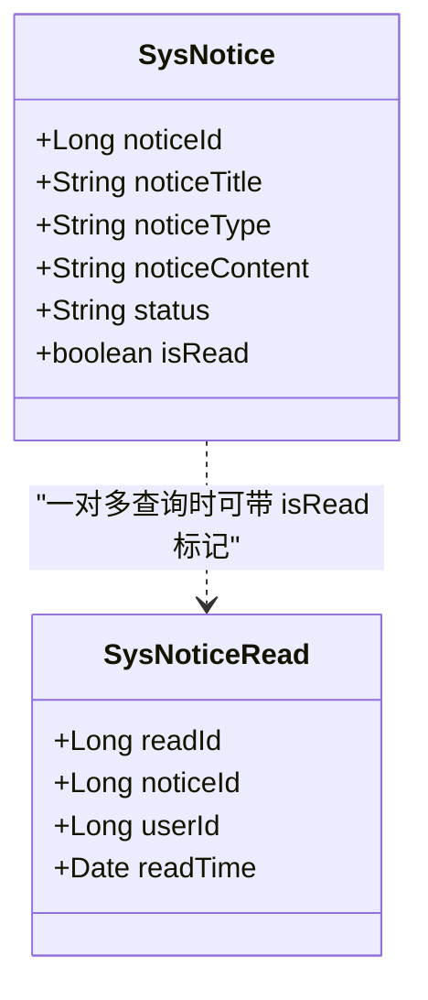
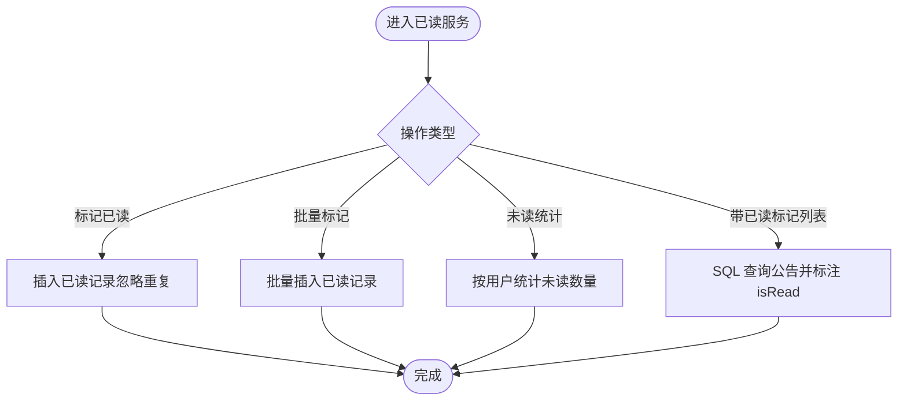
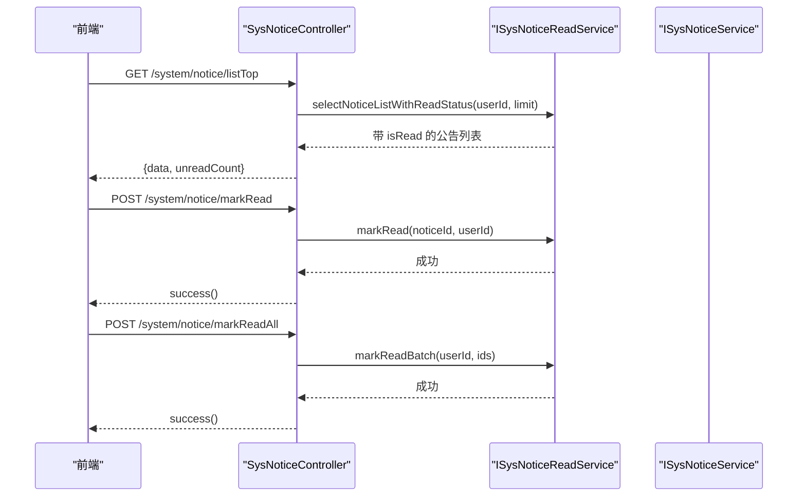
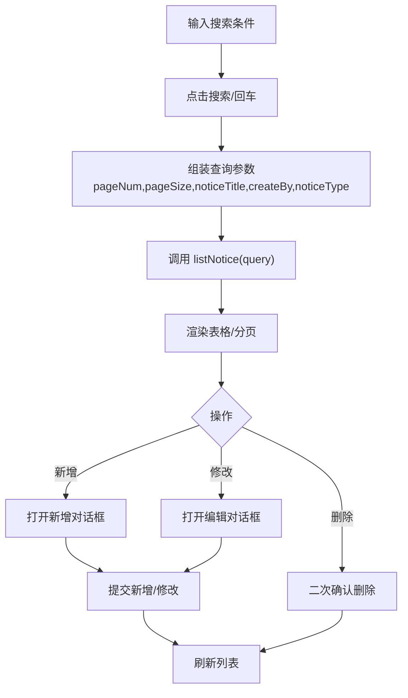
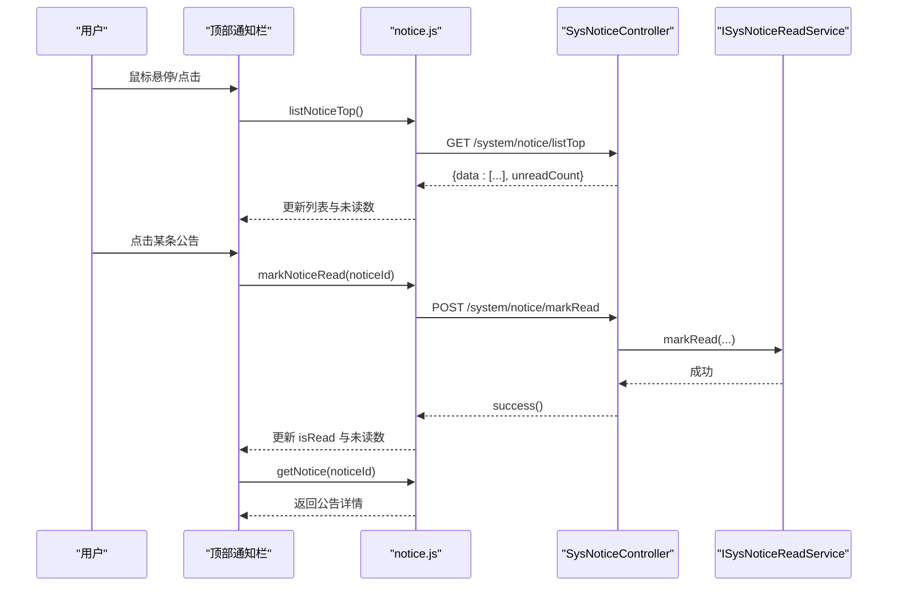
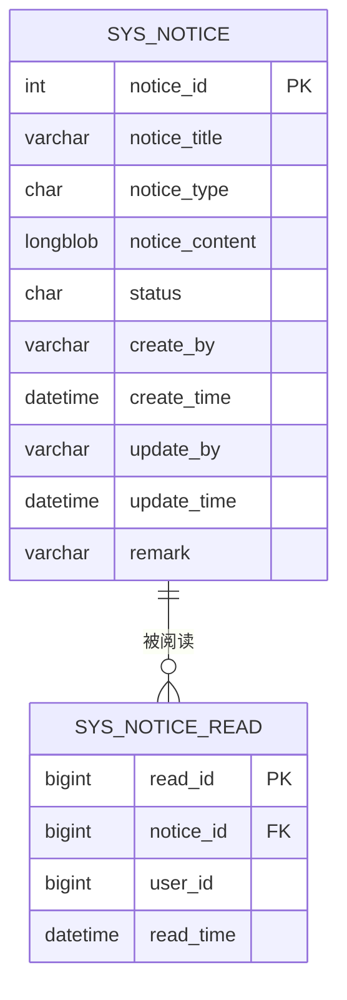
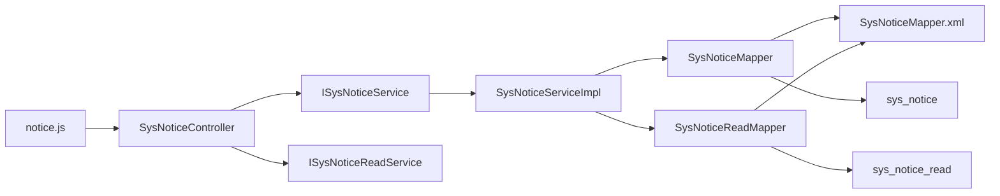

# 通知公告

<cite>
**本文引用的文件**
- [SysNotice.java](file://XingChen-Vue/xingchen-system/src/main/java/com/xingchen/system/domain/SysNotice.java)
- [SysNoticeRead.java](file://XingChen-Vue/xingchen-system/src/main/java/com/xingchen/system/domain/SysNoticeRead.java)
- [ISysNoticeService.java](file://XingChen-Vue/xingchen-system/src/main/java/com/xingchen/system/service/ISysNoticeService.java)
- [ISysNoticeReadService.java](file://XingChen-Vue/xingchen-system/src/main/java/com/xingchen/system/service/ISysNoticeReadService.java)
- [SysNoticeController.java](file://XingChen-Vue/xingchen-admin/src/main/java/com/xingchen/web/controller/system/SysNoticeController.java)
- [notice.js](file://XingChen-Vue3/src/api/system/notice.js)
- [SysNoticeMapper.java](file://XingChen-Vue/xingchen-system/src/main/java/com/xingchen/system/mapper/SysNoticeMapper.java)
- [SysNoticeReadMapper.java](file://XingChen-Vue/xingchen-system/src/main/java/com/xingchen/system/mapper/SysNoticeReadMapper.java)
- [SysNoticeMapper.xml](file://XingChen-Vue/xingchen-system/src/main/resources/mapper/system/SysNoticeMapper.xml)
- [SysNoticeServiceImpl.java](file://XingChen-Vue/xingchen-system/src/main/java/com/xingchen/system/service/impl/SysNoticeServiceImpl.java)
- [index.vue（公告管理列表）](file://XingChen-Vue3/src/views/system/notice/index.vue)
- [index.vue（顶部通知栏）](file://XingChen-Vue3/src/layout/components/HeaderNotice/index.vue)
- [ry_20260321.sql](file://XingChen-Vue/sql/ry_20260321.sql)
</cite>

## 目录
1. [简介](#简介)
2. [项目结构](#项目结构)
3. [核心组件](#核心组件)
4. [架构总览](#架构总览)
5. [详细组件分析](#详细组件分析)
6. [依赖分析](#依赖分析)
7. [性能考虑](#性能考虑)
8. [故障排查指南](#故障排查指南)
9. [结论](#结论)
10. [附录](#附录)

## 简介
本技术文档围绕“通知公告”管理功能展开，覆盖公告类型分类、发布状态管理、阅读状态跟踪、创建/编辑/发布/撤销流程、优先级与有效期控制建议、公告与用户的关联关系、已读/未读统计与推送机制、API 接口设计、前端列表与详情展示、搜索过滤/分页/排序能力，以及该模块在信息传播与用户沟通中的作用。

## 项目结构
后端采用分层架构：控制器层负责对外暴露 REST 接口；服务层封装业务逻辑；数据访问层通过 MyBatis Mapper 访问数据库；领域模型定义实体字段与校验规则。前端 Vue3 使用 Element Plus 组件实现公告管理列表与顶部通知栏弹窗，通过统一的 API 模块与后端交互。

**图表来源**
- [SysNoticeController.java:31-138](file://XingChen-Vue/xingchen-admin/src/main/java/com/xingchen/web/controller/system/SysNoticeController.java#L31-L138)
- [ISysNoticeService.java:11-60](file://XingChen-Vue/xingchen-system/src/main/java/com/xingchen/system/service/ISysNoticeService.java#L11-L60)
- [ISysNoticeReadService.java:11-52](file://XingChen-Vue/xingchen-system/src/main/java/com/xingchen/system/service/ISysNoticeReadService.java#L11-L52)
- [SysNoticeServiceImpl.java:15-59](file://XingChen-Vue/xingchen-system/src/main/java/com/xingchen/system/service/impl/SysNoticeServiceImpl.java#L15-L59)
- [SysNoticeMapper.java:11-60](file://XingChen-Vue/xingchen-system/src/main/java/com/xingchen/system/mapper/SysNoticeMapper.java#L11-L60)
- [SysNoticeReadMapper.java:13-65](file://XingChen-Vue/xingchen-system/src/main/java/com/xingchen/system/mapper/SysNoticeReadMapper.java#L13-L65)
- [SysNoticeMapper.xml:57-90](file://XingChen-Vue/xingchen-system/src/main/resources/mapper/system/SysNoticeMapper.xml#L57-L90)
- [SysNotice.java:16-117](file://XingChen-Vue/xingchen-system/src/main/java/com/xingchen/system/domain/SysNotice.java#L16-L117)
- [SysNoticeRead.java:12-76](file://XingChen-Vue/xingchen-system/src/main/java/com/xingchen/system/domain/SysNoticeRead.java#L12-L76)
- [notice.js:1-70](file://XingChen-Vue3/src/api/system/notice.js#L1-L70)
- [index.vue（公告管理列表）:1-293](file://XingChen-Vue3/src/views/system/notice/index.vue#L1-L293)
- [index.vue（顶部通知栏）:1-238](file://XingChen-Vue3/src/layout/components/HeaderNotice/index.vue#L1-L238)

**章节来源**
- [SysNoticeController.java:31-138](file://XingChen-Vue/xingchen-admin/src/main/java/com/xingchen/web/controller/system/SysNoticeController.java#L31-L138)
- [notice.js:1-70](file://XingChen-Vue3/src/api/system/notice.js#L1-L70)
- [index.vue（公告管理列表）:1-293](file://XingChen-Vue3/src/views/system/notice/index.vue#L1-L293)
- [index.vue（顶部通知栏）:1-238](file://XingChen-Vue3/src/layout/components/HeaderNotice/index.vue#L1-L238)

## 核心组件
- 实体模型
  - 公告实体：包含公告 ID、标题、类型、内容、状态、创建/更新信息、以及前端渲染用的“是否已读”标记。
  - 已读记录实体：记录用户对公告的阅读行为，包含主键、公告 ID、用户 ID、阅读时间。
- 服务接口
  - 公告服务接口：提供查询、新增、修改、删除等能力。
  - 已读服务接口：提供标记已读（幂等）、批量标记、查询未读数量、按用户返回带已读标记的公告列表等。
- 控制器
  - 公告控制器：提供列表、详情、新增、修改、删除、首页顶部公告列表、标记已读、批量标记已读等接口。
- 前端
  - API 模块：封装与后端交互的请求方法。
  - 列表页：支持搜索（标题、创建人、类型）、分页、编辑/删除。
  - 顶部通知栏：弹窗展示公告列表、未读计数、点击预览、标记已读、全部已读。

**章节来源**
- [SysNotice.java:16-117](file://XingChen-Vue/xingchen-system/src/main/java/com/xingchen/system/domain/SysNotice.java#L16-L117)
- [SysNoticeRead.java:12-76](file://XingChen-Vue/xingchen-system/src/main/java/com/xingchen/system/domain/SysNoticeRead.java#L12-L76)
- [ISysNoticeService.java:11-60](file://XingChen-Vue/xingchen-system/src/main/java/com/xingchen/system/service/ISysNoticeService.java#L11-L60)
- [ISysNoticeReadService.java:11-52](file://XingChen-Vue/xingchen-system/src/main/java/com/xingchen/system/service/ISysNoticeReadService.java#L11-L52)
- [SysNoticeController.java:31-138](file://XingChen-Vue/xingchen-admin/src/main/java/com/xingchen/web/controller/system/SysNoticeController.java#L31-L138)
- [notice.js:1-70](file://XingChen-Vue3/src/api/system/notice.js#L1-L70)
- [index.vue（公告管理列表）:1-293](file://XingChen-Vue3/src/views/system/notice/index.vue#L1-L293)
- [index.vue（顶部通知栏）:1-238](file://XingChen-Vue3/src/layout/components/HeaderNotice/index.vue#L1-L238)

## 架构总览
后端通过控制器暴露 REST 接口，服务层协调业务与数据访问，Mapper 负责 SQL 映射，XML 中定义具体 SQL。前端通过 API 模块调用后端接口，实现公告的增删改查、已读标记与统计。

**图表来源**
- [SysNoticeController.java:44-137](file://XingChen-Vue/xingchen-admin/src/main/java/com/xingchen/web/controller/system/SysNoticeController.java#L44-L137)
- [notice.js:1-70](file://XingChen-Vue3/src/api/system/notice.js#L1-L70)
- [SysNoticeMapper.java:11-60](file://XingChen-Vue/xingchen-system/src/main/java/com/xingchen/system/mapper/SysNoticeMapper.java#L11-L60)
- [SysNoticeReadMapper.java:13-65](file://XingChen-Vue/xingchen-system/src/main/java/com/xingchen/system/mapper/SysNoticeReadMapper.java#L13-L65)
- [SysNoticeMapper.xml:57-90](file://XingChen-Vue/xingchen-system/src/main/resources/mapper/system/SysNoticeMapper.xml#L57-L90)

## 详细组件分析

### 公告实体与已读实体
- 公告实体包含标题、类型、内容、状态、创建/更新信息及“是否已读”标记，便于前端直接渲染。
- 已读实体记录用户阅读行为，支持按用户与公告维度进行统计与清理。

**图表来源**
- [SysNotice.java:16-117](file://XingChen-Vue/xingchen-system/src/main/java/com/xingchen/system/domain/SysNotice.java#L16-L117)
- [SysNoticeRead.java:12-76](file://XingChen-Vue/xingchen-system/src/main/java/com/xingchen/system/domain/SysNoticeRead.java#L12-L76)

**章节来源**
- [SysNotice.java:16-117](file://XingChen-Vue/xingchen-system/src/main/java/com/xingchen/system/domain/SysNotice.java#L16-L117)
- [SysNoticeRead.java:12-76](file://XingChen-Vue/xingchen-system/src/main/java/com/xingchen/system/domain/SysNoticeRead.java#L12-L76)

### 已读服务与统计逻辑
- 幂等标记已读：重复调用不会产生副作用。
- 批量标记已读：支持一次性标记多个公告为已读。
- 未读统计：按用户统计未读数量，用于顶部通知栏徽章显示。
- 带已读标记的列表：SQL 层限制条数，一次性返回带 isRead 的公告列表，减少多次往返。

**图表来源**
- [ISysNoticeReadService.java:11-52](file://XingChen-Vue/xingchen-system/src/main/java/com/xingchen/system/service/ISysNoticeReadService.java#L11-L52)
- [SysNoticeReadMapper.java:13-65](file://XingChen-Vue/xingchen-system/src/main/java/com/xingchen/system/mapper/SysNoticeReadMapper.java#L13-L65)

**章节来源**
- [ISysNoticeReadService.java:11-52](file://XingChen-Vue/xingchen-system/src/main/java/com/xingchen/system/service/ISysNoticeReadService.java#L11-L52)
- [SysNoticeReadMapper.java:13-65](file://XingChen-Vue/xingchen-system/src/main/java/com/xingchen/system/mapper/SysNoticeReadMapper.java#L13-L65)

### 控制器接口与权限控制
- 列表/详情/新增/修改/删除：均受权限注解保护。
- 首页顶部公告列表：返回最多 N 条正常公告，并携带未读数量。
- 标记已读/批量标记已读：基于当前登录用户执行。

**图表来源**
- [SysNoticeController.java:88-125](file://XingChen-Vue/xingchen-admin/src/main/java/com/xingchen/web/controller/system/SysNoticeController.java#L88-L125)

**章节来源**
- [SysNoticeController.java:31-138](file://XingChen-Vue/xingchen-admin/src/main/java/com/xingchen/web/controller/system/SysNoticeController.java#L31-L138)

### 前端公告管理列表
- 支持按标题、创建人、类型搜索，重置与回车触发查询。
- 分页参数 pageNum/pageSize 默认传入后端，后端使用分页工具处理。
- 编辑/删除按钮根据选择状态启用/禁用。
- 表单包含标题、类型、状态、内容（富文本编辑器），提交时进行必填校验。

**图表来源**
- [index.vue（公告管理列表）:194-289](file://XingChen-Vue3/src/views/system/notice/index.vue#L194-L289)
- [notice.js:3-10](file://XingChen-Vue3/src/api/system/notice.js#L3-L10)

**章节来源**
- [index.vue（公告管理列表）:1-293](file://XingChen-Vue3/src/views/system/notice/index.vue#L1-L293)
- [notice.js:1-70](file://XingChen-Vue3/src/api/system/notice.js#L1-L70)

### 顶部通知栏弹窗
- 首次加载拉取顶部公告列表，显示未读数量徽章。
- 弹窗内展示公告标题、类型标签、创建时间；点击项自动标记已读并更新未读计数。
- 支持“全部已读”，批量标记后清零未读计数。
- 点击公告打开预览对话框，展示完整内容与元信息。

**图表来源**
- [index.vue（顶部通知栏）:70-130](file://XingChen-Vue3/src/layout/components/HeaderNotice/index.vue#L70-L130)
- [notice.js:46-70](file://XingChen-Vue3/src/api/system/notice.js#L46-L70)
- [SysNoticeController.java:88-125](file://XingChen-Vue/xingchen-admin/src/main/java/com/xingchen/web/controller/system/SysNoticeController.java#L88-L125)

**章节来源**
- [index.vue（顶部通知栏）:1-238](file://XingChen-Vue3/src/layout/components/HeaderNotice/index.vue#L1-L238)
- [notice.js:1-70](file://XingChen-Vue3/src/api/system/notice.js#L1-L70)
- [SysNoticeController.java:88-125](file://XingChen-Vue/xingchen-admin/src/main/java/com/xingchen/web/controller/system/SysNoticeController.java#L88-L125)

### 数据库与映射
- 表结构：sys_notice（公告表）与 sys_notice_read（已读记录表）。
- Mapper 接口：定义查询、新增、更新、删除等方法。
- XML 映射：实现动态 SQL（如按条件拼接查询）、更新语句设置时间戳、批量删除等。

**图表来源**
- [ry_20260321.sql:626-639](file://XingChen-Vue/sql/ry_20260321.sql#L626-L639)
- [SysNoticeReadMapper.java:13-65](file://XingChen-Vue/xingchen-system/src/main/java/com/xingchen/system/mapper/SysNoticeReadMapper.java#L13-L65)
- [SysNoticeMapper.xml:57-90](file://XingChen-Vue/xingchen-system/src/main/resources/mapper/system/SysNoticeMapper.xml#L57-L90)

**章节来源**
- [ry_20260321.sql:626-639](file://XingChen-Vue/sql/ry_20260321.sql#L626-L639)
- [SysNoticeMapper.xml:57-90](file://XingChen-Vue/xingchen-system/src/main/resources/mapper/system/SysNoticeMapper.xml#L57-L90)

## 依赖分析
- 控制器依赖服务接口，服务实现依赖 Mapper 接口，Mapper 通过 XML 映射到数据库表。
- 前端通过 notice.js 统一调用后端接口，列表页与顶部通知栏共享同一套 API。
- 未读统计与已读标记通过 Mapper 的 SQL 查询与插入实现，避免多次往返。

**图表来源**
- [SysNoticeController.java:31-138](file://XingChen-Vue/xingchen-admin/src/main/java/com/xingchen/web/controller/system/SysNoticeController.java#L31-L138)
- [SysNoticeServiceImpl.java:15-59](file://XingChen-Vue/xingchen-system/src/main/java/com/xingchen/system/service/impl/SysNoticeServiceImpl.java#L15-L59)
- [SysNoticeMapper.java:11-60](file://XingChen-Vue/xingchen-system/src/main/java/com/xingchen/system/mapper/SysNoticeMapper.java#L11-L60)
- [SysNoticeReadMapper.java:13-65](file://XingChen-Vue/xingchen-system/src/main/java/com/xingchen/system/mapper/SysNoticeReadMapper.java#L13-L65)
- [SysNoticeMapper.xml:57-90](file://XingChen-Vue/xingchen-system/src/main/resources/mapper/system/SysNoticeMapper.xml#L57-L90)

**章节来源**
- [SysNoticeController.java:31-138](file://XingChen-Vue/xingchen-admin/src/main/java/com/xingchen/web/controller/system/SysNoticeController.java#L31-L138)
- [SysNoticeServiceImpl.java:15-59](file://XingChen-Vue/xingchen-system/src/main/java/com/xingchen/system/service/impl/SysNoticeServiceImpl.java#L15-L59)
- [SysNoticeMapper.java:11-60](file://XingChen-Vue/xingchen-system/src/main/java/com/xingchen/system/mapper/SysNoticeMapper.java#L11-L60)
- [SysNoticeReadMapper.java:13-65](file://XingChen-Vue/xingchen-system/src/main/java/com/xingchen/system/mapper/SysNoticeReadMapper.java#L13-L65)
- [SysNoticeMapper.xml:57-90](file://XingChen-Vue/xingchen-system/src/main/resources/mapper/system/SysNoticeMapper.xml#L57-L90)

## 性能考虑
- SQL 层限制顶部公告条数：避免一次性返回过多数据，提升首屏性能。
- 幂等插入已读记录：减少重复写入与异常处理成本。
- 批量标记已读：减少网络往返次数，适合顶部“全部已读”场景。
- 分页查询：前端默认传入 pageNum/pageSize，后端分页处理，降低单次传输压力。
- 建议优化点（扩展性）：
  - 为公告类型与状态增加索引，加速搜索过滤。
  - 对高频查询（按用户未读统计）可引入缓存层。
  - 顶部列表可加入本地缓存与失效策略，减少重复请求。

[本节为通用性能建议，无需特定文件来源]

## 故障排查指南
- 接口权限不足
  - 现象：提示无权限访问。
  - 排查：确认用户角色是否具备 system:notice:* 权限。
  - 参考：控制器中权限注解与菜单配置。
- 标记已读失败
  - 现象：点击“已读”后未生效。
  - 排查：检查已读服务幂等实现与数据库唯一约束；确认当前登录用户是否正确传递。
- 未读计数不准确
  - 现象：顶部徽章数字与列表不一致。
  - 排查：确认 listTop 返回的 unreadCount 与前端计算逻辑一致；检查 SQL 中 isRead 标记逻辑。
- 删除公告后仍显示
  - 现象：删除公告后历史记录仍可见。
  - 排查：确认删除公告时是否调用清理已读记录的方法；检查删除顺序与事务一致性。

**章节来源**
- [SysNoticeController.java:44-137](file://XingChen-Vue/xingchen-admin/src/main/java/com/xingchen/web/controller/system/SysNoticeController.java#L44-L137)
- [ISysNoticeReadService.java:11-52](file://XingChen-Vue/xingchen-system/src/main/java/com/xingchen/system/service/ISysNoticeReadService.java#L11-L52)
- [SysNoticeReadMapper.java:13-65](file://XingChen-Vue/xingchen-system/src/main/java/com/xingchen/system/mapper/SysNoticeReadMapper.java#L13-L65)

## 结论
通知公告模块以清晰的分层架构实现了公告的全生命周期管理：从类型与状态的定义，到发布与撤销流程，再到阅读状态的跟踪与统计。前后端通过统一 API 协作，既满足后台管理需求，又为用户提供了便捷的顶部通知体验。建议后续结合业务场景引入索引优化、缓存与有效期控制等增强能力，进一步提升性能与可用性。

[本节为总结性内容，无需特定文件来源]

## 附录

### API 接口清单（后端）
- GET /system/notice/list：分页查询公告列表（支持搜索条件）
- GET /system/notice/{noticeId}：获取公告详情
- POST /system/notice：新增公告
- PUT /system/notice：修改公告
- DELETE /system/notice/{noticeIds}：删除公告
- GET /system/notice/listTop：首页顶部公告列表（带 isRead 与未读计数）
- POST /system/notice/markRead：标记公告已读
- POST /system/notice/markReadAll：批量标记已读

**章节来源**
- [SysNoticeController.java:44-137](file://XingChen-Vue/xingchen-admin/src/main/java/com/xingchen/web/controller/system/SysNoticeController.java#L44-L137)
- [notice.js:1-70](file://XingChen-Vue3/src/api/system/notice.js#L1-L70)

### 前端组件与交互要点
- 公告管理列表：搜索、分页、编辑/删除、字典渲染。
- 顶部通知栏：弹窗、预览、已读标记、全部已读、未读徽章。
- 交互建议：保持已读状态与未读计数的一致性；对批量操作提供二次确认。

**章节来源**
- [index.vue（公告管理列表）:1-293](file://XingChen-Vue3/src/views/system/notice/index.vue#L1-L293)
- [index.vue（顶部通知栏）:1-238](file://XingChen-Vue3/src/layout/components/HeaderNotice/index.vue#L1-L238)

### 公告类型与状态字典（示例）
- 类型：1 通知，2 公告
- 状态：0 正常，1 关闭

**章节来源**
- [SysNotice.java:26-33](file://XingChen-Vue/xingchen-system/src/main/java/com/xingchen/system/domain/SysNotice.java#L26-L33)
- [index.vue（公告管理列表）:22-31](file://XingChen-Vue3/src/views/system/notice/index.vue#L22-L31)