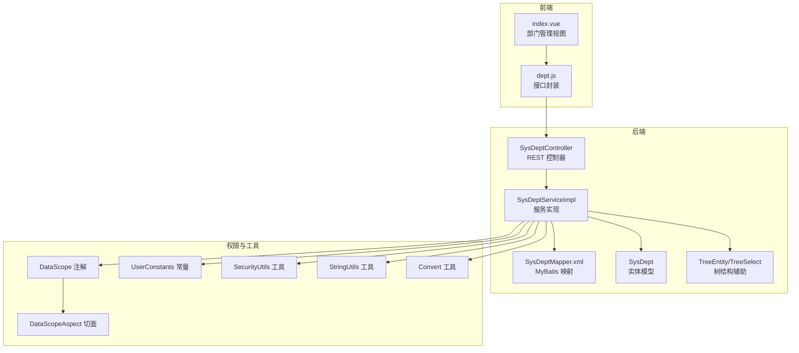
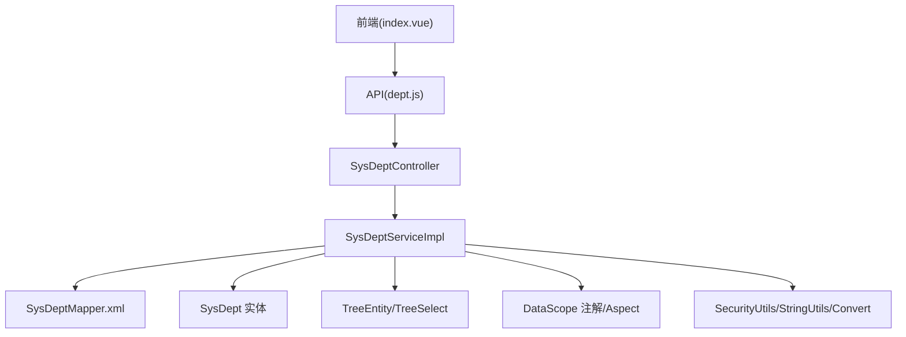
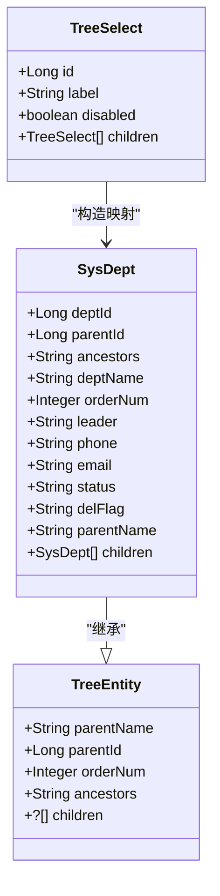
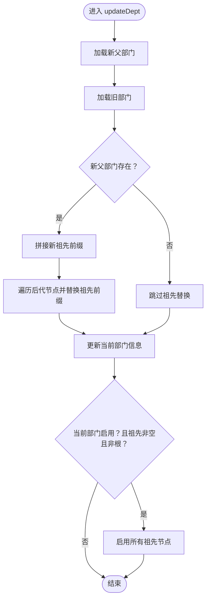
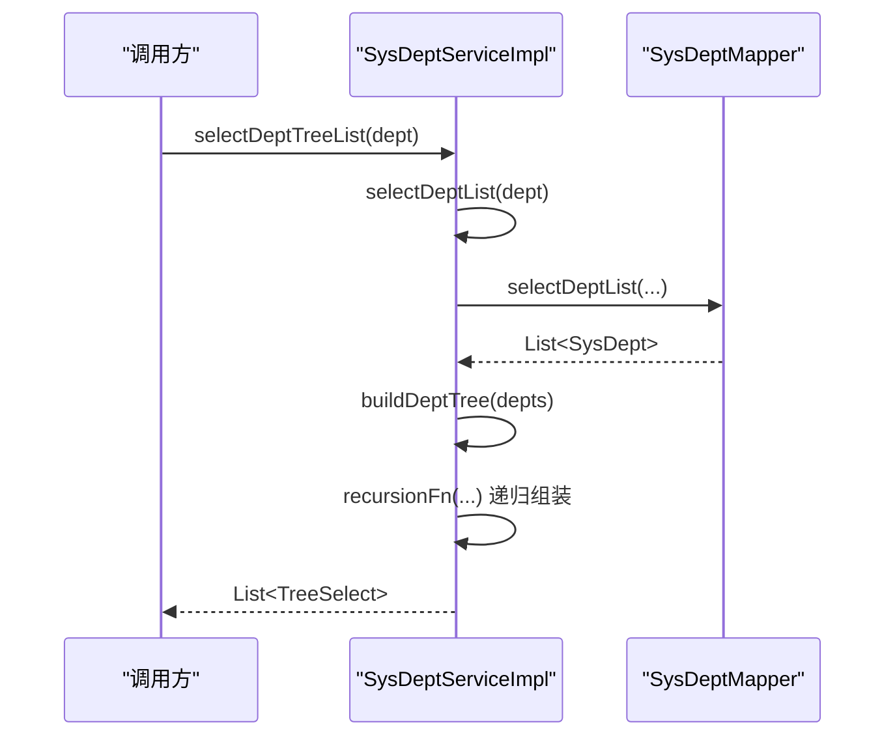
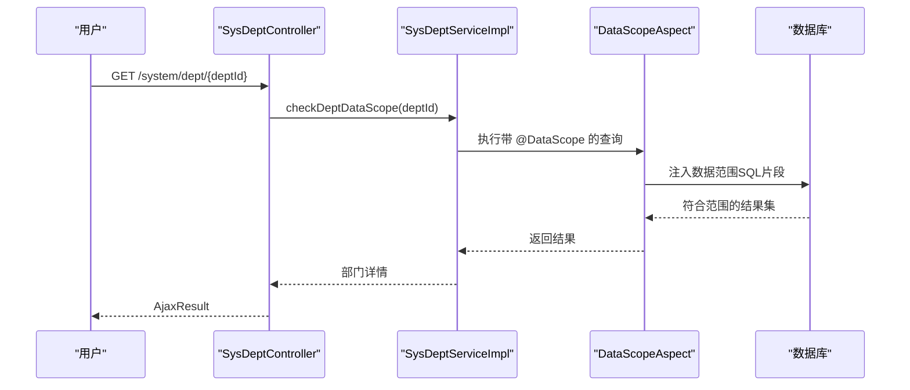
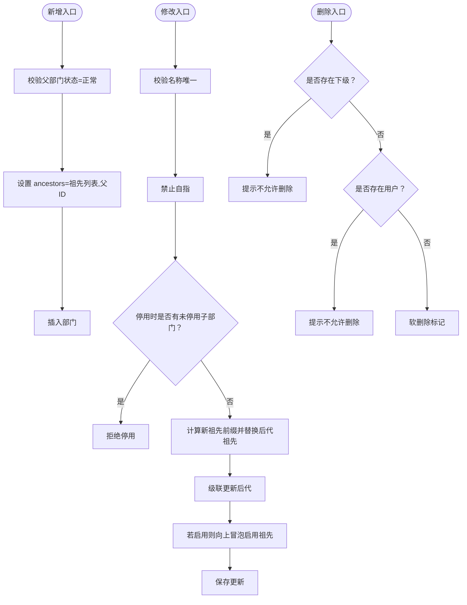
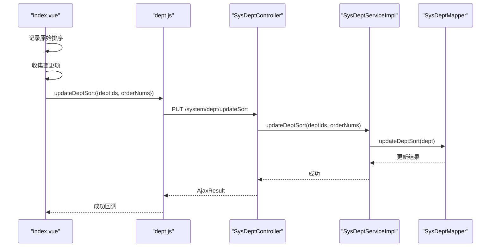
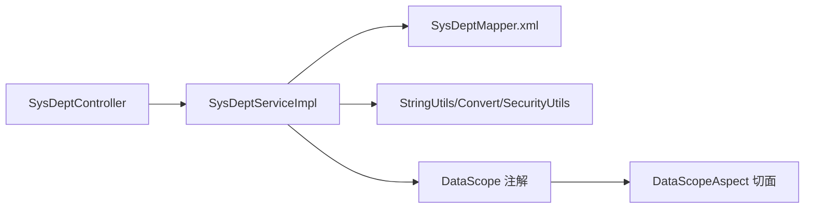

# 部门管理

<cite>
**本文引用的文件**
- [SysDept.java](file://XingChen-Vue/xingchen-common/src/main/java/com/xingchen/common/core/domain/entity/SysDept.java)
- [TreeEntity.java](file://XingChen-Vue/xingchen-common/src/main/java/com/xingchen/common/core/domain/TreeEntity.java)
- [TreeSelect.java](file://XingChen-Vue/xingchen-common/src/main/java/com/xingchen/common/core/domain/TreeSelect.java)
- [ISysDeptService.java](file://XingChen-Vue/xingchen-system/src/main/java/com/xingchen/system/service/ISysDeptService.java)
- [SysDeptServiceImpl.java](file://XingChen-Vue/xingchen-system/src/main/java/com/xingchen/system/service/impl/SysDeptServiceImpl.java)
- [SysDeptMapper.xml](file://XingChen-Vue/xingchen-system/src/main/resources/mapper/system/SysDeptMapper.xml)
- [SysDeptController.java](file://XingChen-Vue/xingchen-admin/src/main/java/com/xingchen/web/controller/system/SysDeptController.java)
- [dept.js](file://XingChen-Vue3/src/api/system/dept.js)
- [index.vue（部门管理前端）](file://XingChen-Vue3/src/views/system/dept/index.vue)
- [DataScope.java](file://XingChen-Vue/xingchen-common/src/main/java/com/xingchen/common/annotation/DataScope.java)
- [DataScopeAspect.java](file://XingChen-Vue/xingchen-framework/src/main/java/com/xingchen/framework/aspectj/DataScopeAspect.java)
- [UserConstants.java](file://XingChen-Vue/xingchen-common/src/main/java/com/xingchen/common/constant/UserConstants.java)
- [SecurityUtils.java](file://XingChen-Vue/xingchen-common/src/main/java/com/xingchen/common/utils/SecurityUtils.java)
- [StringUtils.java](file://XingChen-Vue/xingchen-common/src/main/java/com/xingchen/common/utils/StringUtils.java)
- [Convert.java](file://XingChen-Vue/xingchen-common/src/main/java/com/xingchen/common/core/text/Convert.java)
</cite>

## 目录
1. [简介](#简介)
2. [项目结构](#项目结构)
3. [核心组件](#核心组件)
4. [架构总览](#架构总览)
5. [详细组件分析](#详细组件分析)
6. [依赖分析](#依赖分析)
7. [性能考虑](#性能考虑)
8. [故障排查指南](#故障排查指南)
9. [结论](#结论)
10. [附录](#附录)

## 简介
本文件面向“部门管理”功能，系统性阐述组织架构树形结构的设计与实现，包括祖先路径算法、父子关系维护、层级权限控制、新增/修改/删除业务逻辑、数据权限范围控制、部门排序与树构建算法、前后端接口与渲染方案，以及数据校验、级联操作与异常处理策略。目标是帮助开发者与产品/测试人员全面理解并高效使用该模块。

## 项目结构
围绕部门管理的关键文件分布如下：
- 后端领域模型与服务层：SysDept 实体、TreeEntity/TreeSelect 树结构辅助类、ISysDeptService 接口、SysDeptServiceImpl 服务实现、SysDeptMapper.xml 映射。
- 后端控制层：SysDeptController 控制器，提供 REST API。
- 前端 API 与视图：dept.js 接口封装、index.vue 部门管理页面。
- 权限与数据范围：DataScope 注解与 DataScopeAspect 切面、UserConstants 常量、SecurityUtils 工具类。
- 工具类：StringUtils、Convert 等。

图表来源
- [SysDeptController.java:1-148](file://XingChen-Vue/xingchen-admin/src/main/java/com/xingchen/web/controller/system/SysDeptController.java#L1-148)
- [SysDeptServiceImpl.java:1-365](file://XingChen-Vue/xingchen-system/src/main/java/com/xingchen/system/service/impl/SysDeptServiceImpl.java#L1-365)
- [SysDeptMapper.xml:1-163](file://XingChen-Vue/xingchen-system/src/main/resources/mapper/system/SysDeptMapper.xml#L1-163)
- [SysDept.java:1-204](file://XingChen-Vue/xingchen-common/src/main/java/com/xingchen/common/core/domain/entity/SysDept.java#L1-204)
- [TreeEntity.java:1-79](file://XingChen-Vue/xingchen-common/src/main/java/com/xingchen/common/core/domain/TreeEntity.java#L1-79)
- [TreeSelect.java:1-50](file://XingChen-Vue/xingchen-common/src/main/java/com/xingchen/common/core/domain/TreeSelect.java#L1-50)
- [DataScope.java:1-43](file://XingChen-Vue/xingchen-common/src/main/java/com/xingchen/common/annotation/DataScope.java#L1-43)
- [DataScopeAspect.java:68-97](file://XingChen-Vue/xingchen-framework/src/main/java/com/xingchen/framework/aspectj/DataScopeAspect.java#L68-97)
- [UserConstants.java:1-53](file://XingChen-Vue/xingchen-common/src/main/java/com/xingchen/common/constant/UserConstants.java#L1-53)
- [SecurityUtils.java:1-189](file://XingChen-Vue/xingchen-common/src/main/java/com/xingchen/common/utils/SecurityUtils.java#L1-189)
- [StringUtils.java:1-800](file://XingChen-Vue/xingchen-common/src/main/java/com/xingchen/common/utils/StringUtils.java#L1-800)
- [Convert.java:293-400](file://XingChen-Vue/xingchen-common/src/main/java/com/xingchen/common/core/text/Convert.java#L293-400)

章节来源
- [SysDeptController.java:1-148](file://XingChen-Vue/xingchen-admin/src/main/java/com/xingchen/web/controller/system/SysDeptController.java#L1-148)
- [SysDeptServiceImpl.java:1-365](file://XingChen-Vue/xingchen-system/src/main/java/com/xingchen/system/service/impl/SysDeptServiceImpl.java#L1-365)
- [SysDeptMapper.xml:1-163](file://XingChen-Vue/xingchen-system/src/main/resources/mapper/system/SysDeptMapper.xml#L1-163)
- [SysDept.java:1-204](file://XingChen-Vue/xingchen-common/src/main/java/com/xingchen/common/core/domain/entity/SysDept.java#L1-204)
- [TreeEntity.java:1-79](file://XingChen-Vue/xingchen-common/src/main/java/com/xingchen/common/core/domain/TreeEntity.java#L1-79)
- [TreeSelect.java:1-50](file://XingChen-Vue/xingchen-common/src/main/java/com/xingchen/common/core/domain/TreeSelect.java#L1-50)
- [DataScope.java:1-43](file://XingChen-Vue/xingchen-common/src/main/java/com/xingchen/common/annotation/DataScope.java#L1-43)
- [DataScopeAspect.java:68-97](file://XingChen-Vue/xingchen-framework/src/main/java/com/xingchen/framework/aspectj/DataScopeAspect.java#L68-97)
- [UserConstants.java:1-53](file://XingChen-Vue/xingchen-common/src/main/java/com/xingchen/common/constant/UserConstants.java#L1-53)
- [SecurityUtils.java:1-189](file://XingChen-Vue/xingchen-common/src/main/java/com/xingchen/common/utils/SecurityUtils.java#L1-189)
- [StringUtils.java:1-800](file://XingChen-Vue/xingchen-common/src/main/java/com/xingchen/common/utils/StringUtils.java#L1-800)
- [Convert.java:293-400](file://XingChen-Vue/xingchen-common/src/main/java/com/xingchen/common/core/text/Convert.java#L293-400)

## 核心组件
- 实体模型：SysDept 定义部门字段（名称、排序、负责人、电话、邮箱、状态、删除标记、祖先路径、父子关系等），并提供标准的 getter/setter 与 toString。
- 树结构基类：TreeEntity 提供 parentId、ancestors、orderNum、children 等通用树属性；TreeSelect 将 SysDept 转换为前端 Treeselect 结构，支持禁用态与子节点映射。
- 服务接口与实现：ISysDeptService 定义查询、树构建、唯一性校验、数据权限校验、新增/修改/删除、排序保存等；SysDeptServiceImpl 实现具体逻辑，包含祖先路径更新、子节点级联更新、启用状态向上冒泡等。
- 控制器：SysDeptController 提供 REST 接口，负责鉴权、参数校验、调用服务层并返回 AjaxResult。
- 前端：dept.js 封装部门 API；index.vue 负责表格树渲染、表单提交、排序保存、树选择器等交互。

章节来源
- [SysDept.java:18-204](file://XingChen-Vue/xingchen-common/src/main/java/com/xingchen/common/core/domain/entity/SysDept.java#L18-204)
- [TreeEntity.java:11-79](file://XingChen-Vue/xingchen-common/src/main/java/com/xingchen/common/core/domain/TreeEntity.java#L11-79)
- [TreeSelect.java:17-50](file://XingChen-Vue/xingchen-common/src/main/java/com/xingchen/common/core/domain/TreeSelect.java#L17-50)
- [ISysDeptService.java:53-132](file://XingChen-Vue/xingchen-system/src/main/java/com/xingchen/system/service/ISysDeptService.java#L53-132)
- [SysDeptServiceImpl.java:30-365](file://XingChen-Vue/xingchen-system/src/main/java/com/xingchen/system/service/impl/SysDeptServiceImpl.java#L30-365)
- [SysDeptController.java:31-148](file://XingChen-Vue/xingchen-admin/src/main/java/com/xingchen/web/controller/system/SysDeptController.java#L31-148)
- [dept.js:1-61](file://XingChen-Vue3/src/api/system/dept.js#L1-61)
- [index.vue（部门管理前端）:1-335](file://XingChen-Vue3/src/views/system/dept/index.vue#L1-335)

## 架构总览
后端采用“控制器-服务-持久层”的分层架构，配合数据权限切面与工具类，实现树形结构的维护与权限控制。前端通过 API 与视图组件完成树形展示与交互。

图表来源
- [SysDeptController.java:31-148](file://XingChen-Vue/xingchen-admin/src/main/java/com/xingchen/web/controller/system/SysDeptController.java#L31-148)
- [SysDeptServiceImpl.java:30-365](file://XingChen-Vue/xingchen-system/src/main/java/com/xingchen/system/service/impl/SysDeptServiceImpl.java#L30-365)
- [SysDeptMapper.xml:1-163](file://XingChen-Vue/xingchen-system/src/main/resources/mapper/system/SysDeptMapper.xml#L1-163)
- [SysDept.java:18-204](file://XingChen-Vue/xingchen-common/src/main/java/com/xingchen/common/core/domain/entity/SysDept.java#L18-204)
- [TreeEntity.java:11-79](file://XingChen-Vue/xingchen-common/src/main/java/com/xingchen/common/core/domain/TreeEntity.java#L11-79)
- [TreeSelect.java:17-50](file://XingChen-Vue/xingchen-common/src/main/java/com/xingchen/common/core/domain/TreeSelect.java#L17-50)
- [DataScope.java:17-43](file://XingChen-Vue/xingchen-common/src/main/java/com/xingchen/common/annotation/DataScope.java#L17-43)
- [DataScopeAspect.java:68-97](file://XingChen-Vue/xingchen-framework/src/main/java/com/xingchen/framework/aspectj/DataScopeAspect.java#L68-97)
- [SecurityUtils.java:21-189](file://XingChen-Vue/xingchen-common/src/main/java/com/xingchen/common/utils/SecurityUtils.java#L21-189)
- [StringUtils.java:19-800](file://XingChen-Vue/xingchen-common/src/main/java/com/xingchen/common/utils/StringUtils.java#L19-800)
- [Convert.java:293-400](file://XingChen-Vue/xingchen-common/src/main/java/com/xingchen/common/core/text/Convert.java#L293-400)

## 详细组件分析

### 部门实体与树结构模型
- SysDept 字段覆盖部门基本信息、状态、删除标记、祖先路径 ancestors、父子关系 children，以及基础审计字段。
- TreeEntity 提供树通用属性（parentId、ancestors、orderNum、children），便于复用。
- TreeSelect 将 SysDept 转为前端 Treeselect，支持禁用态（基于状态）与子节点递归映射。

图表来源
- [SysDept.java:18-204](file://XingChen-Vue/xingchen-common/src/main/java/com/xingchen/common/core/domain/entity/SysDept.java#L18-204)
- [TreeEntity.java:11-79](file://XingChen-Vue/xingchen-common/src/main/java/com/xingchen/common/core/domain/TreeEntity.java#L11-79)
- [TreeSelect.java:17-50](file://XingChen-Vue/xingchen-common/src/main/java/com/xingchen/common/core/domain/TreeSelect.java#L17-50)

章节来源
- [SysDept.java:18-204](file://XingChen-Vue/xingchen-common/src/main/java/com/xingchen/common/core/domain/entity/SysDept.java#L18-204)
- [TreeEntity.java:11-79](file://XingChen-Vue/xingchen-common/src/main/java/com/xingchen/common/core/domain/TreeEntity.java#L11-79)
- [TreeSelect.java:17-50](file://XingChen-Vue/xingchen-common/src/main/java/com/xingchen/common/core/domain/TreeSelect.java#L17-50)

### 祖先路径算法与父子关系维护
- 新增部门：校验父部门状态为“正常”，设置 ancestors 为“祖先列表,父ID”，插入新节点。
- 修改部门：计算新父节点的 ancestors 作为新前缀，遍历当前节点的所有子孙（通过 ancestors 包含关系查询），将每个子节点的 ancestors 中的旧前缀替换为新前缀，批量更新；若当前节点启用，则向上冒泡启用其所有祖先节点。
- 子节点级联更新：通过 find_in_set 或 ancestors 包含关系定位所有后代节点，统一替换祖先前缀，保证树结构一致性。

图表来源
- [SysDeptServiceImpl.java:230-262](file://XingChen-Vue/xingchen-system/src/main/java/com/xingchen/system/service/impl/SysDeptServiceImpl.java#L230-262)
- [SysDeptServiceImpl.java:271-282](file://XingChen-Vue/xingchen-system/src/main/java/com/xingchen/system/service/impl/SysDeptServiceImpl.java#L271-282)
- [SysDeptMapper.xml:77-83](file://XingChen-Vue/xingchen-system/src/main/resources/mapper/system/SysDeptMapper.xml#L77-83)
- [SysDeptMapper.xml:135-146](file://XingChen-Vue/xingchen-system/src/main/resources/mapper/system/SysDeptMapper.xml#L135-146)
- [SysDeptMapper.xml:148-153](file://XingChen-Vue/xingchen-system/src/main/resources/mapper/system/SysDeptMapper.xml#L148-153)

章节来源
- [SysDeptServiceImpl.java:230-262](file://XingChen-Vue/xingchen-system/src/main/java/com/xingchen/system/service/impl/SysDeptServiceImpl.java#L230-262)
- [SysDeptServiceImpl.java:271-282](file://XingChen-Vue/xingchen-system/src/main/java/com/xingchen/system/service/impl/SysDeptServiceImpl.java#L271-282)
- [SysDeptMapper.xml:77-83](file://XingChen-Vue/xingchen-system/src/main/resources/mapper/system/SysDeptMapper.xml#L77-83)
- [SysDeptMapper.xml:135-146](file://XingChen-Vue/xingchen-system/src/main/resources/mapper/system/SysDeptMapper.xml#L135-146)
- [SysDeptMapper.xml:148-153](file://XingChen-Vue/xingchen-system/src/main/resources/mapper/system/SysDeptMapper.xml#L148-153)

### 部门树构建与下拉树
- 树构建：通过 buildDeptTree 识别根节点（父ID不在任一节点的ID集合中），递归组装 children。
- 下拉树：buildDeptTreeSelect 将树结构转换为 Treeselect，支持前端树选择器渲染。

图表来源
- [SysDeptServiceImpl.java:57-102](file://XingChen-Vue/xingchen-system/src/main/java/com/xingchen/system/service/impl/SysDeptServiceImpl.java#L57-102)
- [SysDeptMapper.xml:30-48](file://XingChen-Vue/xingchen-system/src/main/resources/mapper/system/SysDeptMapper.xml#L30-48)
- [TreeSelect.java:39-44](file://XingChen-Vue/xingchen-common/src/main/java/com/xingchen/common/core/domain/TreeSelect.java#L39-44)

章节来源
- [SysDeptServiceImpl.java:57-102](file://XingChen-Vue/xingchen-system/src/main/java/com/xingchen/system/service/impl/SysDeptServiceImpl.java#L57-102)
- [SysDeptMapper.xml:30-48](file://XingChen-Vue/xingchen-system/src/main/resources/mapper/system/SysDeptMapper.xml#L30-48)
- [TreeSelect.java:39-44](file://XingChen-Vue/xingchen-common/src/main/java/com/xingchen/common/core/domain/TreeSelect.java#L39-44)

### 数据权限范围控制
- 数据范围注解：@DataScope 支持为部门表设置别名与字段，结合切面动态注入 SQL 片段。
- 切面逻辑：根据用户角色的数据范围策略（全部/自定义/本部门等）拼接条件，避免越权访问。
- 控制器校验：在读取/编辑/删除前调用 checkDeptDataScope，确保用户只能访问其有权限的部门数据。

图表来源
- [SysDeptController.java:64-70](file://XingChen-Vue/xingchen-admin/src/main/java/com/xingchen/web/controller/system/SysDeptController.java#L64-70)
- [SysDeptServiceImpl.java:190-203](file://XingChen-Vue/xingchen-system/src/main/java/com/xingchen/system/service/impl/SysDeptServiceImpl.java#L190-203)
- [DataScope.java:17-43](file://XingChen-Vue/xingchen-common/src/main/java/com/xingchen/common/annotation/DataScope.java#L17-43)
- [DataScopeAspect.java:68-97](file://XingChen-Vue/xingchen-framework/src/main/java/com/xingchen/framework/aspectj/DataScopeAspect.java#L68-97)

章节来源
- [SysDeptController.java:64-70](file://XingChen-Vue/xingchen-admin/src/main/java/com/xingchen/web/controller/system/SysDeptController.java#L64-70)
- [SysDeptServiceImpl.java:190-203](file://XingChen-Vue/xingchen-system/src/main/java/com/xingchen/system/service/impl/SysDeptServiceImpl.java#L190-203)
- [DataScope.java:17-43](file://XingChen-Vue/xingchen-common/src/main/java/com/xingchen/common/annotation/DataScope.java#L17-43)
- [DataScopeAspect.java:68-97](file://XingChen-Vue/xingchen-framework/src/main/java/com/xingchen/framework/aspectj/DataScopeAspect.java#L68-97)

### 部门新增/修改/删除业务逻辑
- 新增：校验父部门状态为“正常”，设置 ancestors=“祖先列表,父ID”，插入。
- 修改：校验名称唯一、禁止自指、停用时需无未停用子部门；更新祖先前缀并级联更新后代；启用时向上冒泡启用祖先。
- 删除：禁止存在下级或关联用户；支持按 ID 软删除（标记 del_flag）。

图表来源
- [SysDeptServiceImpl.java:211-250](file://XingChen-Vue/xingchen-system/src/main/java/com/xingchen/system/service/impl/SysDeptServiceImpl.java#L211-250)
- [SysDeptServiceImpl.java:316-321](file://XingChen-Vue/xingchen-system/src/main/java/com/xingchen/system/service/impl/SysDeptServiceImpl.java#L316-321)
- [SysDeptMapper.xml:77-83](file://XingChen-Vue/xingchen-system/src/main/resources/mapper/system/SysDeptMapper.xml#L77-83)
- [SysDeptMapper.xml:148-153](file://XingChen-Vue/xingchen-system/src/main/resources/mapper/system/SysDeptMapper.xml#L148-153)
- [SysDeptController.java:72-146](file://XingChen-Vue/xingchen-admin/src/main/java/com/xingchen/web/controller/system/SysDeptController.java#L72-146)

章节来源
- [SysDeptServiceImpl.java:211-250](file://XingChen-Vue/xingchen-system/src/main/java/com/xingchen/system/service/impl/SysDeptServiceImpl.java#L211-250)
- [SysDeptServiceImpl.java:316-321](file://XingChen-Vue/xingchen-system/src/main/java/com/xingchen/system/service/impl/SysDeptServiceImpl.java#L316-321)
- [SysDeptMapper.xml:77-83](file://XingChen-Vue/xingchen-system/src/main/resources/mapper/system/SysDeptMapper.xml#L77-83)
- [SysDeptMapper.xml:148-153](file://XingChen-Vue/xingchen-system/src/main/resources/mapper/system/SysDeptMapper.xml#L148-153)
- [SysDeptController.java:72-146](file://XingChen-Vue/xingchen-admin/src/main/java/com/xingchen/web/controller/system/SysDeptController.java#L72-146)

### 部门排序算法
- 前端收集变更：记录原始 orderNum，遍历树收集变更项。
- 后端批量更新：接收 deptIds 与 orderNums 数组，逐条更新 order_num。

图表来源
- [index.vue（部门管理前端）:287-321](file://XingChen-Vue3/src/views/system/dept/index.vue#L287-321)
- [dept.js:46-53](file://XingChen-Vue3/src/api/system/dept.js#L46-53)
- [SysDeptController.java:114-126](file://XingChen-Vue/xingchen-admin/src/main/java/com/xingchen/web/controller/system/SysDeptController.java#L114-126)
- [SysDeptServiceImpl.java:284-308](file://XingChen-Vue/xingchen-system/src/main/java/com/xingchen/system/service/impl/SysDeptServiceImpl.java#L284-308)
- [SysDeptMapper.xml:155-157](file://XingChen-Vue/xingchen-system/src/main/resources/mapper/system/SysDeptMapper.xml#L155-157)

章节来源
- [index.vue（部门管理前端）:287-321](file://XingChen-Vue3/src/views/system/dept/index.vue#L287-321)
- [dept.js:46-53](file://XingChen-Vue3/src/api/system/dept.js#L46-53)
- [SysDeptController.java:114-126](file://XingChen-Vue/xingchen-admin/src/main/java/com/xingchen/web/controller/system/SysDeptController.java#L114-126)
- [SysDeptServiceImpl.java:284-308](file://XingChen-Vue/xingchen-system/src/main/java/com/xingchen/system/service/impl/SysDeptServiceImpl.java#L284-308)
- [SysDeptMapper.xml:155-157](file://XingChen-Vue/xingchen-system/src/main/resources/mapper/system/SysDeptMapper.xml#L155-157)

### API 接口设计
- 列表查询：GET /system/dept/list（支持按名称、状态、父ID过滤，排序 order by parent_id, order_num）
- 排除节点列表：GET /system/dept/list/exclude/{deptId}（排除自身及后代）
- 获取详情：GET /system/dept/{deptId}
- 新增：POST /system/dept
- 修改：PUT /system/dept
- 保存排序：PUT /system/dept/updateSort
- 删除：DELETE /system/dept/{deptId}

章节来源
- [SysDeptController.java:38-146](file://XingChen-Vue/xingchen-admin/src/main/java/com/xingchen/web/controller/system/SysDeptController.java#L38-146)
- [dept.js:3-61](file://XingChen-Vue3/src/api/system/dept.js#L3-61)

### 前端树形组件渲染
- 表格树：el-table + tree-props 渲染树形结构，支持默认展开/折叠、行键 deptId。
- 表单树选择：el-tree-select + check-strictly 选择上级部门，排除自身及后代。
- 表单校验：部门名称、显示排序必填，邮箱格式、手机号格式校验。
- 排序保存：收集变更项，批量请求后刷新本地树与原始排序缓存。

章节来源
- [index.vue（部门管理前端）:59-90](file://XingChen-Vue3/src/views/system/dept/index.vue#L59-90)
- [index.vue（部门管理前端）:92-152](file://XingChen-Vue3/src/views/system/dept/index.vue#L92-152)
- [index.vue（部门管理前端）:231-264](file://XingChen-Vue3/src/views/system/dept/index.vue#L231-264)
- [index.vue（部门管理前端）:287-321](file://XingChen-Vue3/src/views/system/dept/index.vue#L287-321)

## 依赖分析
- 服务层对持久层的依赖：通过 SysDeptMapper.xml 的 SQL 完成 CRUD、祖先包含查询、后代批量更新、状态批量更新、软删除。
- 控制器对服务层的依赖：统一鉴权与参数校验，调用服务层执行业务。
- 权限切面对服务层的依赖：通过注解与切面动态注入数据范围 SQL，避免越权。
- 工具类依赖：StringUtils、Convert、SecurityUtils 提供字符串处理、类型转换与安全上下文访问。

图表来源
- [SysDeptController.java:31-148](file://XingChen-Vue/xingchen-admin/src/main/java/com/xingchen/web/controller/system/SysDeptController.java#L31-148)
- [SysDeptServiceImpl.java:30-365](file://XingChen-Vue/xingchen-system/src/main/java/com/xingchen/system/service/impl/SysDeptServiceImpl.java#L30-365)
- [SysDeptMapper.xml:1-163](file://XingChen-Vue/xingchen-system/src/main/resources/mapper/system/SysDeptMapper.xml#L1-163)
- [DataScope.java:17-43](file://XingChen-Vue/xingchen-common/src/main/java/com/xingchen/common/annotation/DataScope.java#L17-43)
- [DataScopeAspect.java:68-97](file://XingChen-Vue/xingchen-framework/src/main/java/com/xingchen/framework/aspectj/DataScopeAspect.java#L68-97)
- [SecurityUtils.java:21-189](file://XingChen-Vue/xingchen-common/src/main/java/com/xingchen/common/utils/SecurityUtils.java#L21-189)
- [StringUtils.java:19-800](file://XingChen-Vue/xingchen-common/src/main/java/com/xingchen/common/utils/StringUtils.java#L19-800)
- [Convert.java:293-400](file://XingChen-Vue/xingchen-common/src/main/java/com/xingchen/common/core/text/Convert.java#L293-400)

章节来源
- [SysDeptController.java:31-148](file://XingChen-Vue/xingchen-admin/src/main/java/com/xingchen/web/controller/system/SysDeptController.java#L31-148)
- [SysDeptServiceImpl.java:30-365](file://XingChen-Vue/xingchen-system/src/main/java/com/xingchen/system/service/impl/SysDeptServiceImpl.java#L30-365)
- [SysDeptMapper.xml:1-163](file://XingChen-Vue/xingchen-system/src/main/resources/mapper/system/SysDeptMapper.xml#L1-163)
- [DataScope.java:17-43](file://XingChen-Vue/xingchen-common/src/main/java/com/xingchen/common/annotation/DataScope.java#L17-43)
- [DataScopeAspect.java:68-97](file://XingChen-Vue/xingchen-framework/src/main/java/com/xingchen/framework/aspectj/DataScopeAspect.java#L68-97)
- [SecurityUtils.java:21-189](file://XingChen-Vue/xingchen-common/src/main/java/com/xingchen/common/utils/SecurityUtils.java#L21-189)
- [StringUtils.java:19-800](file://XingChen-Vue/xingchen-common/src/main/java/com/xingchen/common/utils/StringUtils.java#L19-800)
- [Convert.java:293-400](file://XingChen-Vue/xingchen-common/src/main/java/com/xingchen/common/core/text/Convert.java#L293-400)

## 性能考虑
- 树构建：buildDeptTree 通过一次遍历识别根节点并递归组装，时间复杂度 O(n)，适合中大型组织规模。
- 祖先替换：后代节点通过 ancestors 包含关系一次性定位，批量更新采用 CASE/WHERE IN，减少多次往返。
- 排序更新：批量更新 order_num，避免逐条事务开销。
- 数据权限：通过切面注入 SQL 片段限制查询范围，避免应用层二次过滤。

[本节为通用性能讨论，无需列出章节来源]

## 故障排查指南
- 新增失败：父部门状态非“正常”导致新增被拒绝。
- 修改失败：名称重复、自指、停用但存在未停用子部门。
- 删除失败：存在下级或关联用户。
- 权限问题：未配置数据范围或角色状态异常，导致无法访问部门数据。
- 排序异常：后端捕获异常并提示“保存排序异常，请联系管理员”。

章节来源
- [SysDeptServiceImpl.java:211-250](file://XingChen-Vue/xingchen-system/src/main/java/com/xingchen/system/service/impl/SysDeptServiceImpl.java#L211-250)
- [SysDeptServiceImpl.java:316-321](file://XingChen-Vue/xingchen-system/src/main/java/com/xingchen/system/service/impl/SysDeptServiceImpl.java#L316-321)
- [SysDeptController.java:72-146](file://XingChen-Vue/xingchen-admin/src/main/java/com/xingchen/web/controller/system/SysDeptController.java#L72-146)
- [SysDeptServiceImpl.java:290-308](file://XingChen-Vue/xingchen-system/src/main/java/com/xingchen/system/service/impl/SysDeptServiceImpl.java#L290-308)

## 结论
部门管理模块以树形结构为核心，通过祖先路径算法与批量级联更新保障父子关系一致性；结合数据权限切面与控制器校验，实现细粒度的数据范围控制；前后端协同完成树形渲染、表单校验与排序保存，满足企业组织管理的典型需求。建议在生产环境关注批量更新的事务边界与异常回滚策略，确保数据一致性。

[本节为总结性内容，无需列出章节来源]

## 附录

### 数据校验规则
- 部门名称：必填，长度不超过 30；邮箱格式与长度限制；电话长度不超过 11；显示排序必填且非负。
- 状态：枚举“正常/停用”。

章节来源
- [SysDept.java:88-142](file://XingChen-Vue/xingchen-common/src/main/java/com/xingchen/common/core/domain/entity/SysDept.java#L88-142)
- [index.vue（部门管理前端）:178-184](file://XingChen-Vue3/src/views/system/dept/index.vue#L178-184)

### 级联操作与异常处理
- 父部门停用：禁止新增子节点。
- 子部门状态变更：启用时向上冒泡启用祖先；停用时需确保无未停用子部门。
- 删除保护：存在下级或关联用户时禁止删除。
- 排序异常：捕获异常并提示管理员。

章节来源
- [SysDeptServiceImpl.java:211-250](file://XingChen-Vue/xingchen-system/src/main/java/com/xingchen/system/service/impl/SysDeptServiceImpl.java#L211-250)
- [SysDeptServiceImpl.java:316-321](file://XingChen-Vue/xingchen-system/src/main/java/com/xingchen/system/service/impl/SysDeptServiceImpl.java#L316-321)
- [SysDeptController.java:106-109](file://XingChen-Vue/xingchen-admin/src/main/java/com/xingchen/web/controller/system/SysDeptController.java#L106-109)
- [SysDeptServiceImpl.java:290-308](file://XingChen-Vue/xingchen-system/src/main/java/com/xingchen/system/service/impl/SysDeptServiceImpl.java#L290-308)