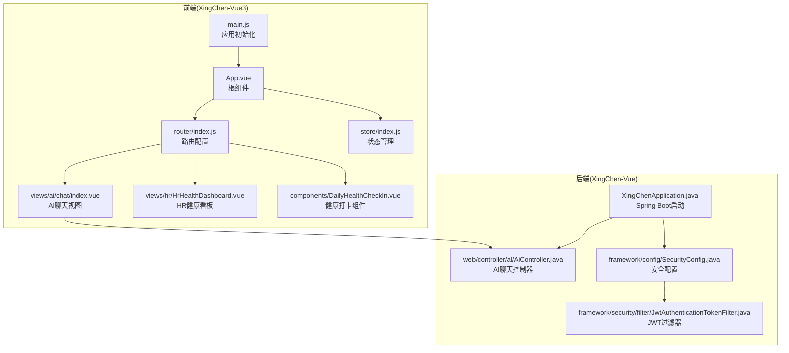
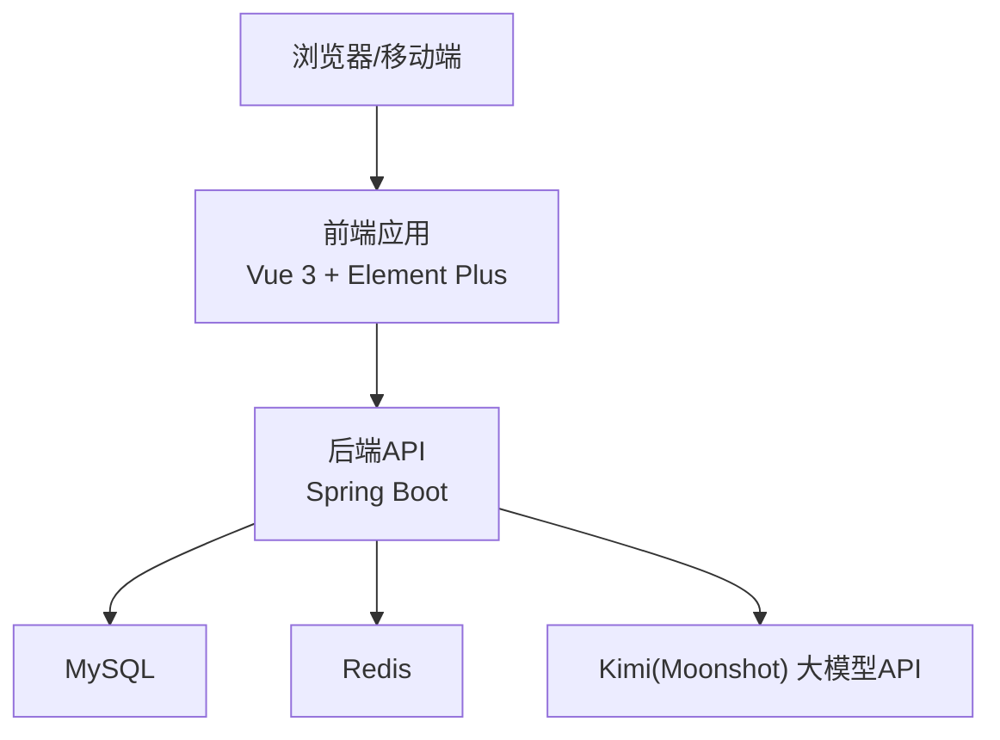
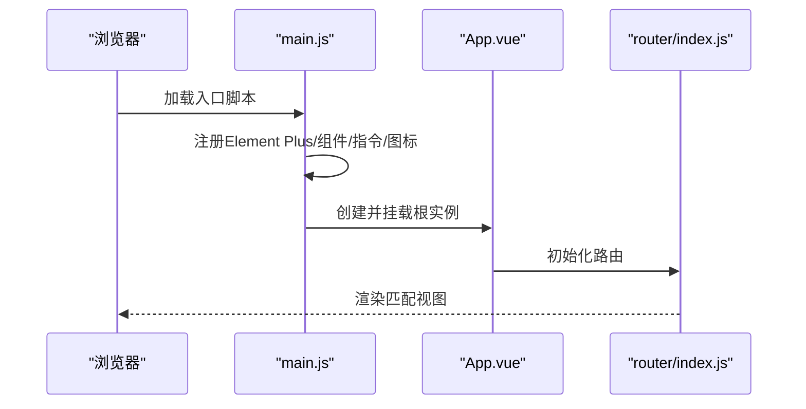
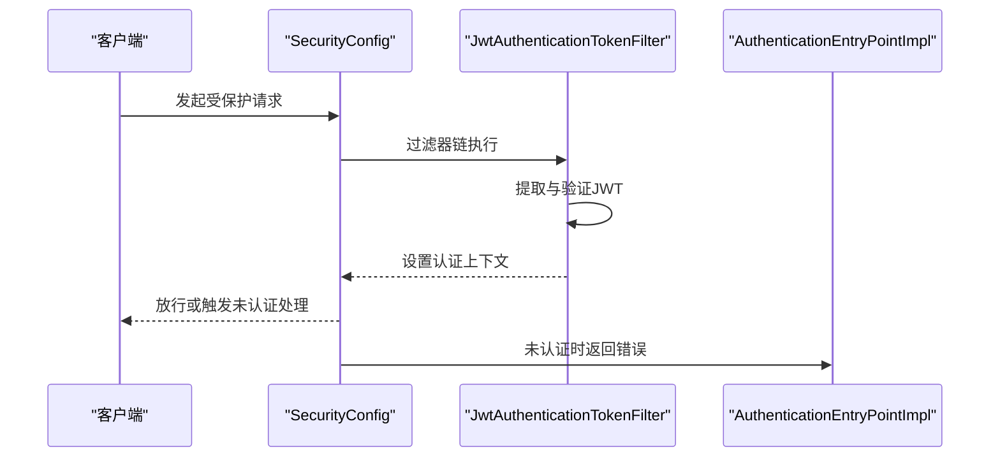
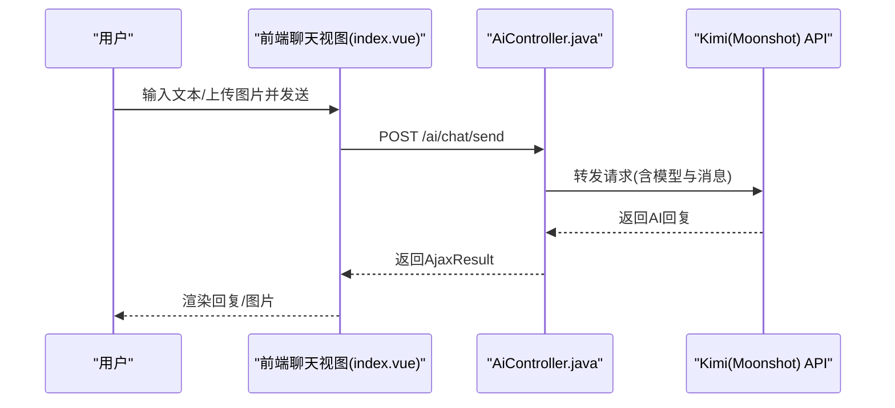
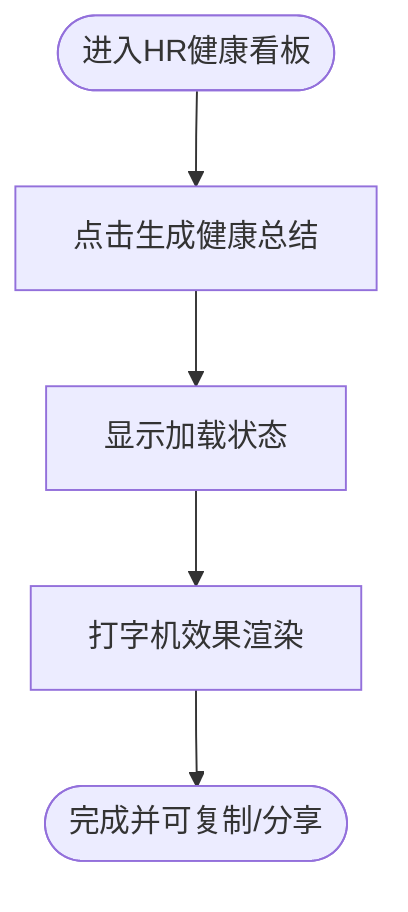
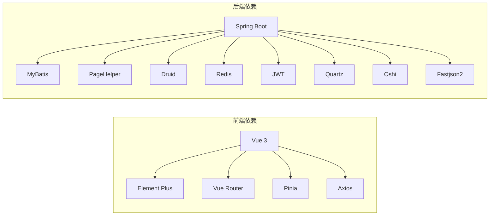

# 项目概述

<cite>
**本文引用的文件**
- [项目说明文档.md](file://项目说明文档.md)
- [XingChenApplication.java](file://XingChen-Vue/xingchen-admin/src/main/java/com/xingchen/XingChenApplication.java)
- [pom.xml](file://XingChen-Vue/pom.xml)
- [package.json](file://XingChen-Vue3/package.json)
- [main.js](file://XingChen-Vue3/src/main.js)
- [App.vue](file://XingChen-Vue3/src/App.vue)
- [router/index.js](file://XingChen-Vue3/src/router/index.js)
- [store/index.js](file://XingChen-Vue3/src/store/index.js)
- [AiController.java](file://XingChen-Vue/xingchen-admin/src/main/java/com/xingchen/web/controller/al/AiController.java)
- [index.vue](file://XingChen-Vue3/src/views/ai/chat/index.vue)
- [HrHealthDashboard.vue](file://XingChen-Vue3/src/views/hr/HrHealthDashboard.vue)
- [DailyHealthCheckIn.vue](file://XingChen-Vue3/src/components/DailyHealthCheckIn.vue)
- [SecurityConfig.java](file://XingChen-Vue/xingchen-framework/src/main/java/com/xingchen/framework/config/SecurityConfig.java)
- [JwtAuthenticationTokenFilter.java](file://XingChen-Vue/xingchen-framework/src/main/java/com/xingchen/framework/security/filter/JwtAuthenticationTokenFilter.java)
- [AuthenticationEntryPointImpl.java](file://XingChen-Vue/xingchen-framework/src/main/java/com/xingchen/framework/security/handle/AuthenticationEntryPointImpl.java)
</cite>

## 目录
1. [引言](#引言)
2. [项目结构](#项目结构)
3. [核心组件](#核心组件)
4. [架构总览](#架构总览)
5. [详细组件分析](#详细组件分析)
6. [依赖关系分析](#依赖关系分析)
7. [性能考量](#性能考量)
8. [故障排查指南](#故障排查指南)
9. [结论](#结论)
10. [附录](#附录)

## 引言
本项目“我的星辰系统”是一个面向企业健康与管理场景的数字化平台，基于成熟的前后端分离架构，融合多模态AI助手能力，提供从用户日常健康打卡、积分商城、HR健康看板到AI智能问答与图片分析的完整闭环。项目以“健康管理系统”为核心目标，围绕以下价值主张展开：
- 以AI驱动的人机协作：通过多模态AI助手，实现文本与图像的智能分析，辅助健康咨询与风险识别。
- 以权限与安全为核心的治理：基于Spring Security与JWT的认证授权体系，保障企业级数据与操作安全。
- 以用户体验为中心的设计：前端采用Vue 3 + Element Plus，提供沉浸式交互与现代化界面。
- 以模块化与可扩展为基础：后端采用多模块Maven工程，便于功能迭代与团队协作。

目标用户群体覆盖：
- 企业管理者与HR：用于健康数据看板、员工行为分析与激励机制运营。
- 普通员工：用于每日健康打卡、积分获取与兑换、AI健康问答。
- 平台运维与开发团队：基于统一框架与模块化结构，快速扩展与维护。

核心竞争力：
- 前后端分离架构与现代化技术栈，兼顾性能与可维护性。
- 企业级权限与安全体系，满足合规与审计要求。
- 多模态AI助手集成，提升人机交互体验与智能化水平。
- 健康管理闭环（打卡—积分—兑换—看板—AI分析）。

## 项目结构
项目采用双端架构与多模块后端组织方式：
- 后端（XingChen-Vue，Maven多模块）
  - xingchen-admin：应用启动与业务Controller入口（含新增AI控制器）。
  - xingchen-framework：安全、过滤器、异常处理、配置等核心框架层。
  - xingchen-system：系统基础业务（用户、角色、菜单、字典等）。
  - xingchen-common：通用工具、常量、异常、注解等。
  - xingchen-quartz：定时任务模块。
  - xingchen-generator：代码生成模块。
- 前端（XingChen-Vue3，Vite + Vue 3）
  - 应用入口与全局配置（main.js、App.vue、router、store）。
  - 视图与组件：AI聊天、HR健康看板、健康打卡、系统管理等。
  - API与工具：Axios封装、权限校验、主题与国际化等。

**图表来源**
- [main.js:1-85](file://XingChen-Vue3/src/main.js#L1-L85)
- [App.vue:1-16](file://XingChen-Vue3/src/App.vue#L1-L16)
- [router/index.js:1-197](file://XingChen-Vue3/src/router/index.js#L1-L197)
- [store/index.js:1-4](file://XingChen-Vue3/src/store/index.js#L1-L4)
- [AiController.java:1-165](file://XingChen-Vue/xingchen-admin/src/main/java/com/xingchen/web/controller/al/AiController.java#L1-L165)
- [SecurityConfig.java:20-128](file://XingChen-Vue/xingchen-framework/src/main/java/com/xingchen/framework/config/SecurityConfig.java#L20-L128)
- [JwtAuthenticationTokenFilter.java:1-44](file://XingChen-Vue/xingchen-framework/src/main/java/com/xingchen/framework/security/filter/JwtAuthenticationTokenFilter.java#L1-L44)

**章节来源**
- [项目说明文档.md:86-110](file://项目说明文档.md#L86-L110)
- [pom.xml:176-184](file://XingChen-Vue/pom.xml#L176-L184)
- [package.json:1-54](file://XingChen-Vue3/package.json#L1-L54)

## 核心组件
- 前端应用入口与全局配置
  - 应用初始化：注册Element Plus、全局组件与指令、SVG图标、权限守卫与国际化等。
  - 根组件：负责主题初始化与页面渲染。
  - 路由与状态：基于Vue Router与Pinia，支持公共路由与动态权限路由。
- 后端应用与安全框架
  - Spring Boot启动：排除数据源自动装配，便于自定义配置。
  - 安全配置：基于Spring Security与JWT，支持匿名访问白名单、跨域、会话无状态等。
- AI助手模块
  - 前端：聊天界面、图片上传与Base64处理、快捷键与自动滚动。
  - 后端：对接Kimi（Moonshot）大模型API，支持纯文本与多模态（文本+图片）两种模式。
- HR健康看板与健康打卡
  - HR看板：统计与AI生成健康总结的演示界面。
  - 健康打卡：渐进式问答与进度指示，支持动画与交互反馈。

**章节来源**
- [main.js:1-85](file://XingChen-Vue3/src/main.js#L1-L85)
- [App.vue:1-16](file://XingChen-Vue3/src/App.vue#L1-L16)
- [router/index.js:1-197](file://XingChen-Vue3/src/router/index.js#L1-L197)
- [store/index.js:1-4](file://XingChen-Vue3/src/store/index.js#L1-L4)
- [XingChenApplication.java:1-31](file://XingChen-Vue/xingchen-admin/src/main/java/com/xingchen/XingChenApplication.java#L1-L31)
- [SecurityConfig.java:20-128](file://XingChen-Vue/xingchen-framework/src/main/java/com/xingchen/framework/config/SecurityConfig.java#L20-L128)
- [AiController.java:1-165](file://XingChen-Vue/xingchen-admin/src/main/java/com/xingchen/web/controller/al/AiController.java#L1-L165)
- [index.vue:1-527](file://XingChen-Vue3/src/views/ai/chat/index.vue#L1-L527)
- [HrHealthDashboard.vue:1-208](file://XingChen-Vue3/src/views/hr/HrHealthDashboard.vue#L1-L208)
- [DailyHealthCheckIn.vue:1-37](file://XingChen-Vue3/src/components/DailyHealthCheckIn.vue#L1-L37)

## 架构总览
系统采用前后端分离架构，后端以Spring Boot多模块组织，前端以Vue 3单页应用形式提供交互体验。AI助手作为新增能力，通过HTTP请求对接第三方大模型API，实现文本与图片的多模态分析。

**图表来源**
- [package.json:18-37](file://XingChen-Vue3/package.json#L18-L37)
- [pom.xml:20-34](file://XingChen-Vue/pom.xml#L20-L34)
- [AiController.java:27-29](file://XingChen-Vue/xingchen-admin/src/main/java/com/xingchen/web/controller/al/AiController.java#L27-L29)

## 详细组件分析

### 前端应用初始化与路由
- 应用初始化流程
  - 注册Element Plus与本地化、全局组件与指令、SVG图标、权限守卫与国际化。
  - 挂载全局方法与组件，注入下载、字典、时间处理等工具函数。
- 路由与权限
  - 定义公共路由（登录、404、首页、锁定屏等）与动态路由（基于权限的菜单与操作）。
  - 支持面包屑、侧边栏、标题与图标等元信息配置。

**图表来源**
- [main.js:1-85](file://XingChen-Vue3/src/main.js#L1-L85)
- [App.vue:1-16](file://XingChen-Vue3/src/App.vue#L1-L16)
- [router/index.js:1-197](file://XingChen-Vue3/src/router/index.js#L1-L197)

**章节来源**
- [main.js:1-85](file://XingChen-Vue3/src/main.js#L1-L85)
- [router/index.js:1-197](file://XingChen-Vue3/src/router/index.js#L1-L197)

### 后端安全与认证
- 安全配置
  - 基于Spring Security启用方法级安全与匿名放行URL。
  - 会话策略为STATELESS，结合JWT过滤器与跨域过滤器。
- JWT过滤器
  - 从请求中提取并验证令牌，构建认证上下文，确保后续业务逻辑的安全性。
- 未认证处理
  - 统一返回未授权错误，便于前端进行登录跳转或提示。

**图表来源**
- [SecurityConfig.java:20-128](file://XingChen-Vue/xingchen-framework/src/main/java/com/xingchen/framework/config/SecurityConfig.java#L20-L128)
- [JwtAuthenticationTokenFilter.java:1-44](file://XingChen-Vue/xingchen-framework/src/main/java/com/xingchen/framework/security/filter/JwtAuthenticationTokenFilter.java#L1-L44)
- [AuthenticationEntryPointImpl.java:1-34](file://XingChen-Vue/xingchen-framework/src/main/java/com/xingchen/framework/security/handle/AuthenticationEntryPointImpl.java#L1-L34)

**章节来源**
- [SecurityConfig.java:20-128](file://XingChen-Vue/xingchen-framework/src/main/java/com/xingchen/framework/config/SecurityConfig.java#L20-L128)
- [JwtAuthenticationTokenFilter.java:1-44](file://XingChen-Vue/xingchen-framework/src/main/java/com/xingchen/framework/security/filter/JwtAuthenticationTokenFilter.java#L1-L44)
- [AuthenticationEntryPointImpl.java:1-34](file://XingChen-Vue/xingchen-framework/src/main/java/com/xingchen/framework/security/handle/AuthenticationEntryPointImpl.java#L1-L34)

### AI助手：前后端协同
- 前端交互
  - 支持文本输入与图片上传（Base64），实现快捷键发送、自动滚动、加载动画与错误提示。
  - 调用统一API发送消息，接收并渲染AI回复。
- 后端集成
  - 对接Kimi（Moonshot）API，根据是否包含图片选择不同模型与消息结构。
  - 统一封装HTTP请求与响应解析，返回AjaxResult。

**图表来源**
- [index.vue:182-227](file://XingChen-Vue3/src/views/ai/chat/index.vue#L182-L227)
- [AiController.java:37-93](file://XingChen-Vue/xingchen-admin/src/main/java/com/xingchen/web/controller/al/AiController.java#L37-L93)

**章节来源**
- [index.vue:1-527](file://XingChen-Vue3/src/views/ai/chat/index.vue#L1-L527)
- [AiController.java:1-165](file://XingChen-Vue/xingchen-admin/src/main/java/com/xingchen/web/controller/al/AiController.java#L1-L165)

### HR健康看板与健康打卡
- HR健康看板
  - 提供AI健康分析总结的演示区域，支持按钮触发与打字机效果模拟。
  - 展示异常预警、核心指标与动态活动等信息。
- 健康打卡
  - 渐进式问答与进度条，支持选项选择与动画切换，增强用户参与感。

**图表来源**
- [HrHealthDashboard.vue:159-185](file://XingChen-Vue3/src/views/hr/HrHealthDashboard.vue#L159-L185)

**章节来源**
- [HrHealthDashboard.vue:1-208](file://XingChen-Vue3/src/views/hr/HrHealthDashboard.vue#L1-L208)
- [DailyHealthCheckIn.vue:1-37](file://XingChen-Vue3/src/components/DailyHealthCheckIn.vue#L1-L37)

## 依赖关系分析
- 前端依赖
  - 核心：Vue 3、Element Plus、Vue Router、Pinia、Axios。
  - 工具与构建：Vite、Sass、SVG图标、压缩插件等。
- 后端依赖
  - 核心：Spring Boot、MyBatis、PageHelper、Druid、Redis、JWT、Quartz、Oshi、Fastjson2等。
  - 模块：admin、framework、system、common、quartz、generator。

**图表来源**
- [package.json:18-37](file://XingChen-Vue3/package.json#L18-L37)
- [pom.xml:20-34](file://XingChen-Vue/pom.xml#L20-L34)

**章节来源**
- [package.json:1-54](file://XingChen-Vue3/package.json#L1-L54)
- [pom.xml:1-232](file://XingChen-Vue/pom.xml#L1-L232)

## 性能考量
- 前端性能
  - 使用Vite构建，支持按需加载与组件懒加载，减少首屏体积。
  - Element Plus按需引入与主题变量，降低CSS体积。
- 后端性能
  - Druid连接池与Redis缓存结合，优化数据库与热点数据访问。
  - PageHelper分页插件减少查询负担；JWT无状态会话避免服务器存储。
- AI集成
  - 前端对图片大小与类型进行限制，后端对模型选择与请求参数进行控制，避免超时与资源浪费。

[本节为通用指导，无需具体文件引用]

## 故障排查指南
- 启动失败
  - 后端：确认Java版本与数据库、Redis服务可用，查看启动日志输出。
  - 前端：安装依赖后执行开发命令，检查端口占用与代理配置。
- 权限相关
  - 未认证或权限不足：检查SecurityConfig中的匿名放行列表与JWT过滤器链顺序。
  - 401错误：确认前端携带正确的Token并在请求头中设置。
- AI助手异常
  - 前端：检查图片上传限制与快捷键绑定；查看错误提示与加载状态。
  - 后端：确认API Key与目标URL正确，关注响应解析与异常分支。

**章节来源**
- [XingChenApplication.java:15-29](file://XingChen-Vue/xingchen-admin/src/main/java/com/xingchen/XingChenApplication.java#L15-L29)
- [SecurityConfig.java:100-118](file://XingChen-Vue/xingchen-framework/src/main/java/com/xingchen/framework/config/SecurityConfig.java#L100-L118)
- [AuthenticationEntryPointImpl.java:26-33](file://XingChen-Vue/xingchen-framework/src/main/java/com/xingchen/framework/security/handle/AuthenticationEntryPointImpl.java#L26-L33)
- [index.vue:146-165](file://XingChen-Vue3/src/views/ai/chat/index.vue#L146-L165)
- [AiController.java:98-134](file://XingChen-Vue/xingchen-admin/src/main/java/com/xingchen/web/controller/al/AiController.java#L98-L134)

## 结论
本项目以“健康管理系统”为核心，通过前后端分离架构、企业级权限与安全体系、以及多模态AI助手的深度融合，为企业提供从日常健康打卡、积分运营到HR健康看板与智能问答的完整数字化解决方案。对于初学者，项目提供了清晰的模块划分与运行指引；对于经验丰富的开发者，项目在安全性、可扩展性与交互体验方面均具备良好的技术深度与实践参考价值。

[本节为总结性内容，无需具体文件引用]

## 附录
- 本地运行指南
  - 后端：导入IDEA，启动MySQL与Redis，运行Spring Boot启动类，观察控制台输出。
  - 前端：安装依赖后启动开发服务器，访问本地地址。
- 目录结构摘要
  - 后端多模块工程，前端单页应用，AI助手与HR看板、健康打卡等视图模块齐全。

**章节来源**
- [项目说明文档.md:63-84](file://项目说明文档.md#L63-L84)
- [项目说明文档.md:86-110](file://项目说明文档.md#L86-L110)